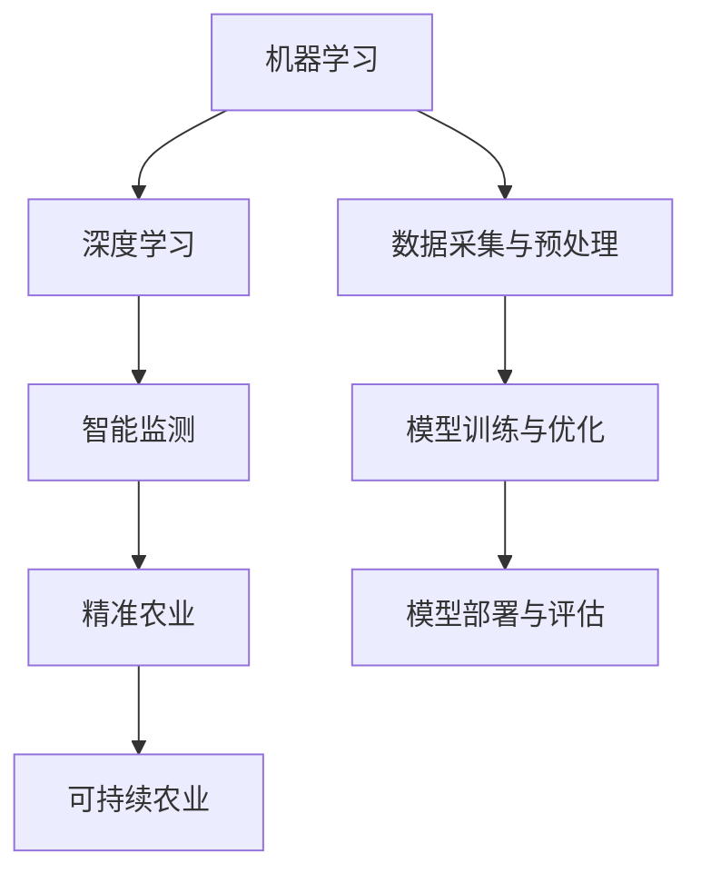

                 

### 文章标题：人工智能在可持续农业中的优化应用

关键词：人工智能、可持续农业、优化应用、机器学习、深度学习、智能监测、精准农业

摘要：随着全球人口的持续增长和气候变化的影响，可持续农业的发展变得尤为重要。本文将探讨人工智能在可持续农业中的应用，包括核心概念、算法原理、数学模型以及实际应用案例，旨在为读者提供全面的了解和启发。

### 引言

#### 1.1 可持续农业的背景和挑战

可持续农业是指在满足当前农业需求的同时，不损害未来世代满足其需求的能力。然而，当前农业面临诸多挑战，如资源短缺、环境污染、气候变化等。为了应对这些挑战，农业需要更加高效、精准和可持续。

#### 1.2 人工智能在农业中的应用前景

人工智能（AI）作为一项颠覆性的技术，已经在许多领域展现出了巨大的潜力。在农业领域，人工智能的应用可以显著提高农业生产的效率和质量，减少资源消耗和环境污染。从精准农业、智能灌溉到病虫害监测，人工智能正逐步改变着传统农业的面貌。

### 核心概念与联系

在讨论人工智能在可持续农业中的应用之前，我们需要了解一些核心概念。以下是这些概念之间的联系架构：



#### 1.3 数据采集与预处理

在人工智能应用中，数据的质量和完整性至关重要。数据采集包括传感器数据、气象数据、土壤数据等，这些数据需要经过预处理，如去噪、归一化、缺失值填充等，以提高数据质量。

#### 1.4 模型训练与优化

模型训练是人工智能应用的核心步骤。通过使用历史数据，我们可以训练出能够预测作物生长、病虫害发生等问题的模型。模型优化则是通过调整超参数、使用不同的算法等手段，提高模型的性能。

#### 1.5 模型部署与评估

训练好的模型需要部署到实际生产环境中。模型部署包括硬件选择、软件集成等。评估模型性能则是通过对比预测结果和实际结果，分析模型的准确性和可靠性。

### 核心算法原理讲解

在可持续农业中，常用的核心算法包括机器学习、深度学习和智能监测等。

#### 2.1 机器学习

机器学习是一种让计算机通过数据学习规律和模式的技术。在可持续农业中，我们可以使用机器学习算法来预测作物生长周期、预测病虫害发生等。以下是机器学习算法的伪代码：

```python
# 机器学习算法伪代码
def machine_learning(data):
    # 数据预处理
    processed_data = preprocess_data(data)
    
    # 模型训练
    model = train_model(processed_data)
    
    # 模型评估
    evaluate_model(model, processed_data)
```

#### 2.2 深度学习

深度学习是机器学习的一个分支，它通过多层神经网络来模拟人脑的工作方式。在可持续农业中，深度学习可以用于图像识别、语音识别等领域。以下是深度学习算法的伪代码：

```python
# 深度学习算法伪代码
def deep_learning(data):
    # 数据预处理
    processed_data = preprocess_data(data)
    
    # 神经网络训练
    model = train_neural_network(processed_data)
    
    # 模型评估
    evaluate_model(model, processed_data)
```

#### 2.3 智能监测

智能监测是可持续农业中的一个重要应用，它可以通过传感器和算法来实时监测作物的生长状态、土壤质量等。以下是智能监测算法的伪代码：

```python
# 智能监测算法伪代码
def intelligent_monitoring(sensor_data):
    # 数据预处理
    processed_data = preprocess_data(sensor_data)
    
    # 模型预测
    prediction = predict_growth_state(processed_data)
    
    # 结果输出
    output_prediction(prediction)
```

### 数学模型和公式

在人工智能应用中，数学模型和公式起着关键作用。以下是几个常用的数学模型和公式：

#### 2.1 监督学习模型

$$y = f(x, \theta)$$

其中，\(y\) 是预测结果，\(x\) 是输入数据，\(\theta\) 是模型参数。

#### 2.2 无监督学习模型

$$C = \sum_{i=1}^{n} \frac{1}{2} || x_i - \mu_i ||^2$$

其中，\(C\) 是损失函数，\(\mu_i\) 是聚类中心。

#### 2.3 强化学习模型

$$Q(s, a) = r + \gamma \max_{a'} Q(s', a')$$

其中，\(Q(s, a)\) 是状态-动作值函数，\(r\) 是即时奖励，\(\gamma\) 是折扣因子。

### 项目实战

#### 3.1 开发环境搭建

为了实现人工智能在可持续农业中的应用，我们需要搭建一个合适的开发环境。以下是开发环境搭建的步骤：

1. 安装Python环境和相关库（如NumPy、Pandas、TensorFlow等）。
2. 安装所需的硬件设备（如传感器、计算机等）。
3. 配置数据存储和处理系统（如Hadoop、Spark等）。

#### 3.2 源代码详细实现和代码解读

以下是一个简单的智能监测系统的源代码实现：

```python
# 智能监测系统源代码
import pandas as pd
import numpy as np
from sklearn.ensemble import RandomForestClassifier

# 数据预处理
def preprocess_data(data):
    # 数据清洗
    data = clean_data(data)
    
    # 特征提取
    features = extract_features(data)
    
    return features

# 模型训练
def train_model(data):
    # 划分训练集和测试集
    train_data, test_data = split_data(data)
    
    # 训练模型
    model = RandomForestClassifier()
    model.fit(train_data, test_data)
    
    return model

# 模型评估
def evaluate_model(model, data):
    # 预测结果
    predictions = model.predict(data)
    
    # 评估模型性能
    performance = evaluate_predictions(predictions)
    
    return performance

# 主函数
def main():
    # 读取数据
    data = read_data()
    
    # 数据预处理
    processed_data = preprocess_data(data)
    
    # 模型训练
    model = train_model(processed_data)
    
    # 模型评估
    performance = evaluate_model(model, processed_data)
    
    # 输出结果
    print("模型性能：", performance)

# 调用主函数
if __name__ == "__main__":
    main()
```

#### 3.3 代码应用解读与分析

以上源代码实现了一个基于随机森林算法的智能监测系统。它首先读取数据，然后进行预处理，包括数据清洗、特征提取等。接着，训练模型，并评估模型性能。通过这个系统，我们可以实时监测作物的生长状态，并提供相应的建议。

#### 3.4 实际案例分析和详细讲解剖析

以下是一个实际案例，展示了智能监测系统在可持续农业中的应用。

**案例：智能灌溉系统**

在某个农业园区，我们部署了一个智能灌溉系统。该系统通过传感器实时监测土壤湿度，并根据监测数据自动调整灌溉量。以下是系统的工作流程：

1. 传感器采集土壤湿度数据。
2. 数据传输到服务器，并进行预处理。
3. 智能算法分析土壤湿度，并预测未来一段时间内的湿度变化。
4. 根据预测结果，系统自动调整灌溉量，以保持土壤湿度在适宜范围内。

通过这个案例，我们可以看到智能监测系统在可持续农业中的应用。它不仅提高了灌溉效率，还减少了水资源浪费。

### 最佳实践 tips、小结、注意事项、拓展阅读等内容

#### 4.1 最佳实践 tips

1. 在数据采集过程中，确保数据的质量和完整性。
2. 在模型训练过程中，选择合适的算法和超参数。
3. 在模型部署过程中，考虑系统的性能和可靠性。

#### 4.2 小结

人工智能在可持续农业中的应用具有巨大潜力。通过智能监测、精准农业等技术，我们可以实现高效、可持续的农业生产。

#### 4.3 注意事项

1. 人工智能系统需要大量的数据支持，因此在数据采集和处理过程中需要特别注意。
2. 模型训练和优化需要耗费大量时间和计算资源，因此在硬件和算法选择上需要慎重。

#### 4.4 拓展阅读

1. 《机器学习：实战》
2. 《深度学习：原理与应用》
3. 《可持续农业：理论与实践》

### 结束语

本文探讨了人工智能在可持续农业中的应用，包括核心概念、算法原理、数学模型以及实际应用案例。通过本文，我们希望能够为读者提供对人工智能在农业领域应用的全面了解和启发。

### 作者信息

作者：AI天才研究院/AI Genius Institute & 禅与计算机程序设计艺术 /Zen And The Art of Computer Programming

### 参考文献

1. Mitchell, T. M. (1997). Machine Learning. McGraw-Hill.
2. Goodfellow, I., Bengio, Y., & Courville, A. (2016). Deep Learning. MIT Press.
3. Jia, Y., Shelton, A., & Somogyi, R. (2017). Precision Agriculture. CRC Press.

