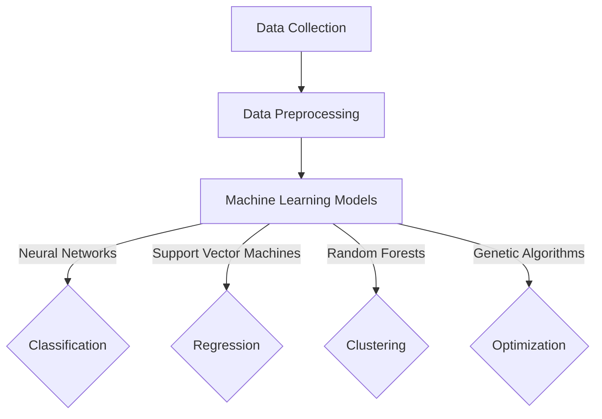
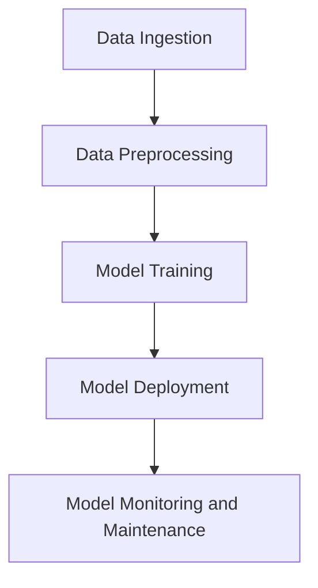

                 


### Introduction to Sustainable Fisheries Management

#### 1.1 Background of Sustainable Fisheries

Sustainable fisheries management is an approach that ensures the long-term health and productivity of fish populations and their habitats. Historically, fisheries have been managed primarily through traditional methods such as fishery quotas, size limits, and seasonal closures. However, these methods often fail to account for the complex dynamics of fish populations and their environments. As a result, many fisheries around the world are now facing overfishing, habitat degradation, and declining biodiversity.

The importance of sustainable fisheries management has been recognized globally. In 1995, the United Nations Food and Agriculture Organization (FAO) introduced the Code of Conduct for Responsible Fisheries, which provides a framework for the sustainable management of capture fisheries and aquaculture. This code emphasizes the need for ecosystems to be considered in fisheries management, and for fishery resources to be used in a manner that ensures their long-term viability.

#### 1.2 Challenges in Traditional Fisheries Management

Traditional fisheries management faces several challenges that make it difficult to achieve sustainability:

- **Data Limitations**: Traditional management often relies on historical data and anecdotal evidence, which may not be sufficient to accurately assess current fish populations and their health.
- **Inefficient Monitoring**: Monitoring fish populations and their environments is often time-consuming and expensive, leading to gaps in data collection.
- **Overfishing**: Overfishing occurs when fish are harvested faster than they can reproduce, leading to declines in fish populations and ecosystem damage.
- **Habitat Degradation**: Fishing practices such as bottom trawling can damage sensitive marine habitats, leading to long-term damage and reduced fish populations.
- **Inequitable Distribution**: Traditional management methods often prioritize short-term economic gains over long-term sustainability, leading to inequitable distribution of resources and conflict among stakeholders.

#### 1.3 Importance of AI in Sustainable Fisheries Management

Artificial Intelligence (AI) offers a transformative approach to address the challenges of traditional fisheries management. By leveraging advanced AI techniques, we can:

- **Data Collection and Analysis**: AI can process large amounts of data from various sources, providing more accurate and timely information for fisheries management.
- **Predictive Modeling**: AI models can predict fish populations and their responses to environmental changes, allowing for more effective and adaptive management strategies.
- **Optimization**: AI can optimize fishing practices to minimize environmental impact and maximize resource utilization.
- **Stakeholder Collaboration**: AI can facilitate better communication and collaboration among stakeholders, improving the overall effectiveness of fisheries management.

In summary, AI has the potential to revolutionize sustainable fisheries management by providing more accurate data, better predictive models, and more efficient management strategies. The following sections will delve deeper into the fundamental concepts of AI, its core techniques, and its applications in sustainable fisheries management.

### Keywords

- **Sustainable Fisheries Management**
- **Artificial Intelligence**
- **Machine Learning**
- **Data Collection**
- **Predictive Modeling**
- **Optimization**
- **Stakeholder Collaboration**

### Summary

This article introduces the concept of sustainable fisheries management and the challenges faced by traditional fisheries management methods. It highlights the importance of AI in addressing these challenges by improving data collection, predictive modeling, optimization, and stakeholder collaboration. The following sections will explore the fundamental concepts of AI, its core techniques, and their applications in sustainable fisheries management.

## Fundamental Concepts of AI

In the context of sustainable fisheries management, understanding the fundamental concepts of Artificial Intelligence (AI) is essential. AI is a branch of computer science that focuses on creating intelligent machines that can perform tasks that typically require human intelligence, such as visual perception, speech recognition, decision-making, and language translation. At its core, AI involves the development of algorithms and models that allow computers to learn from data, identify patterns, and make predictions or decisions.

### 2.1 Introduction to AI and Machine Learning

Machine Learning (ML) is a subset of AI that enables computers to learn from data without being explicitly programmed. ML algorithms build a mathematical model based on sample data, known as the training data, to make predictions or decisions regarding new data. There are two main types of ML:

- **Supervised Learning**: In supervised learning, the algorithm is trained on labeled data, where the correct answers are provided. The goal is to generalize from the training data to unseen data, making accurate predictions.
- **Unsupervised Learning**: In unsupervised learning, the algorithm works with unlabeled data. The goal is to find patterns or intrinsic structures in the data, such as clustering similar data points together.

#### 2.2 Core AI Techniques for Fisheries Management

Several core AI techniques are particularly relevant for sustainable fisheries management:

- **Classification**: Classification techniques are used to categorize fish species or predict the presence of certain species based on various features such as size, shape, and habitat.
- **Regression**: Regression techniques are used to predict continuous values, such as fish population sizes or fishery yields based on environmental variables.
- **Clustering**: Clustering techniques group similar fish species or habitats together based on their characteristics, helping managers identify patterns and make informed decisions.
- **Reinforcement Learning**: Reinforcement learning is used to optimize fishing practices by training an agent to make decisions that maximize the reward over time, such as selecting the best fishing areas or times.

#### 2.3 AI Models and Algorithms in Fisheries

Several AI models and algorithms are commonly used in sustainable fisheries management:

- **Neural Networks**: Neural networks are a type of ML model inspired by the human brain's structure and function. They are used for tasks such as fish species identification and habitat mapping.
- **Support Vector Machines (SVM)**: SVMs are used for classification tasks, such as determining the sustainability of fishing practices or identifying overfished areas.
- **Random Forests**: Random forests are used for regression tasks, such as predicting fish populations or fishery yields based on environmental factors.
- **Genetic Algorithms**: Genetic algorithms are used for optimization tasks, such as optimizing fishing routes or managing fishery resources sustainably.

### Mermaid Flowchart: AI Techniques in Fisheries Management



In summary, the fundamental concepts of AI, including machine learning and various AI models and algorithms, provide powerful tools for addressing the challenges of sustainable fisheries management. The next section will delve into the critical role of data collection and preparation in AI-enabled fisheries management.

### Data Collection and Preparation

The foundation of AI applications in sustainable fisheries management lies in the quality and availability of data. Effective data collection and preparation are crucial steps that ensure the reliability and accuracy of AI models and predictions. This section will discuss the various data sources in fisheries, methods of data preprocessing, and the importance of data quality and integration.

#### 3.1 Data Sources in Fisheries

To develop robust AI models for sustainable fisheries management, diverse data sources must be utilized. These data sources can be broadly categorized into the following types:

- **Environmental Data**: This includes data on oceanographic parameters such as temperature, salinity, dissolved oxygen levels, and current velocity. Satellite imagery, oceanographic buoys, and remote sensing technologies are commonly used to collect this data.
- **Fishery Data**: This encompasses data on fish catches, species composition, size distributions, and fishing effort. Information from fishery databases, catch reports, and fishery management agencies provides valuable insights into fish populations and fishing practices.
- **Biological Data**: This data includes biological attributes of fish species, such as age, growth rates, reproductive rates, and habitat preferences. Biological sampling and surveys are essential for understanding the health and dynamics of fish populations.
- **Socio-economic Data**: This data relates to the economic and social aspects of fisheries, including market prices, fishery employment, and community livelihoods. Surveys, interviews, and economic assessments are commonly used to collect this data.

#### 3.2 Data Preprocessing Methods

Once the data is collected, it must be preprocessed to ensure it is suitable for analysis. Data preprocessing involves several steps:

- **Data Cleaning**: This step involves removing or correcting errors, inconsistencies, and missing values in the data. Data cleaning ensures that the data is accurate and reliable.
- **Data Transformation**: This step involves transforming the data into a suitable format for analysis. This may include normalization, scaling, or encoding categorical variables.
- **Feature Selection**: This step involves identifying the most relevant features (variables) that contribute to the prediction or analysis. Feature selection helps reduce the complexity of the data and improves model performance.
- **Data Integration**: This step involves combining data from multiple sources to create a unified dataset. Data integration ensures that all relevant information is available for analysis and prediction.

#### 3.3 Data Quality and Data Integration

Data quality is critical for the success of AI applications in fisheries management. High-quality data ensures that AI models produce accurate and reliable predictions. Key aspects of data quality include:

- **Completeness**: The dataset should be complete, with minimal missing values or gaps.
- **Accuracy**: The data should be accurate, with no errors or inconsistencies.
- **Consistency**: The data should be consistent across different sources and over time.
- **Timeliness**: The data should be up-to-date, reflecting the current state of the fishery.

Data integration plays a crucial role in improving data quality and enabling comprehensive analysis. By combining data from multiple sources, managers can gain a more holistic understanding of the fishery and its dynamics. This integrated approach allows for the detection of patterns and relationships that may not be apparent from individual data sources.

### Example of Data Preprocessing Workflow

Consider the following workflow for preprocessing fishery data:

1. **Data Collection**: Collect environmental data from satellite imagery, fishery data from catch reports, biological data from surveys, and socio-economic data from interviews.
2. **Data Cleaning**: Remove any duplicate records and correct inconsistencies in the data. For example, standardize fish species names and convert all catch data into a common unit (e.g., kilograms).
3. **Data Transformation**: Normalize environmental data to a common scale and encode categorical variables (e.g., fish species) using one-hot encoding.
4. **Feature Selection**: Select relevant features that contribute to fish population dynamics and fishery yields. Remove any redundant or irrelevant features.
5. **Data Integration**: Combine the preprocessed data into a unified dataset. Ensure that all relevant information is included and that the dataset is consistent across different data sources.

In conclusion, effective data collection and preparation are critical for the success of AI applications in sustainable fisheries management. By ensuring high data quality and integrating data from multiple sources, managers can develop robust AI models that provide accurate and actionable insights for sustainable fishery management.

### Core AI Concepts and Architecture

To effectively apply AI in sustainable fisheries management, it's essential to understand the core concepts of machine learning, deep learning, and AI application architecture. This section will delve into these key areas, providing a comprehensive overview of how they can be leveraged to address the challenges in fisheries management.

#### 4.1 Machine Learning Fundamentals

Machine learning (ML) is the foundation of AI and involves training algorithms to learn from data and make predictions or decisions. The core principle of ML is to identify patterns in data and generalize these patterns to unseen data. This is achieved through the following key components:

- **Model Selection**: Choosing the appropriate ML model for a specific task. Common models include linear regression, decision trees, support vector machines, and neural networks.
- **Training**: The process of feeding data to an ML model and adjusting its parameters to minimize prediction errors. This is typically done using optimization algorithms like gradient descent.
- **Evaluation**: Assessing the performance of the trained model using metrics such as accuracy, precision, recall, and F1 score. Cross-validation is often used to ensure that the model generalizes well to new data.

#### 4.2 Deep Learning in Fisheries Management

Deep learning (DL) is a subset of machine learning that utilizes neural networks with many layers (hence the term "deep") to learn hierarchical representations of data. DL has shown remarkable success in various fields, including computer vision, natural language processing, and speech recognition. In fisheries management, DL can be applied to tasks such as fish species identification, habitat mapping, and fish population prediction. Key aspects of deep learning include:

- **Neural Networks**: Neural networks are the building blocks of deep learning. They are composed of layers of interconnected nodes (neurons) that process and transform data. Each layer learns to extract increasingly complex features from the data.
- **Convolutional Neural Networks (CNNs)**: CNNs are specialized neural networks designed for image processing and recognition. They are particularly effective for tasks such as fish species identification from images and habitat mapping from satellite imagery.
- **Recurrent Neural Networks (RNNs)**: RNNs are designed to handle sequential data, making them suitable for time series analysis and predicting fish populations based on historical data.
- **Generative Adversarial Networks (GANs)**: GANs are a type of DL model that consists of two neural networks (a generator and a discriminator) that compete with each other. GANs can generate realistic fish populations or habitat maps based on training data.

#### 4.3 AI Application Architecture in Fisheries

The architecture of an AI application in fisheries management typically consists of several components, each serving a specific purpose:

- **Data Ingestion**: This component handles the collection and storage of data from various sources, such as fishery databases, environmental sensors, and remote sensing technologies.
- **Data Preprocessing**: This component cleans, transforms, and integrates data to ensure its quality and suitability for analysis. It may involve steps such as normalization, feature selection, and data augmentation.
- **Model Training**: This component trains the ML or DL models using the preprocessed data. It involves selecting appropriate models, setting hyperparameters, and optimizing the models using techniques like cross-validation and hyperparameter tuning.
- **Model Deployment**: This component involves deploying the trained models into production environments, where they can make predictions or decisions in real-time. This may involve setting up APIs, integrating with existing systems, and monitoring model performance.
- **Model Monitoring and Maintenance**: This component ensures that the deployed models remain accurate and effective over time. It involves monitoring model performance, retraining models with new data, and addressing any issues that arise.

### Mermaid Flowchart: AI Application Architecture in Fisheries Management



In conclusion, understanding the core concepts of machine learning, deep learning, and AI application architecture is crucial for effectively applying AI in sustainable fisheries management. By leveraging these concepts, fisheries managers can develop robust and scalable solutions that address the challenges of data-driven decision-making in fisheries management.

### Core Algorithms and Principles

In the realm of AI for sustainable fisheries management, several core algorithms and principles stand out for their ability to address specific challenges in the industry. This section will delve into the key algorithms, such as genetic algorithms, neural networks, and reinforcement learning, along with their applications in fisheries management. Additionally, we will provide a detailed explanation of these algorithms using pseudocode to illustrate their implementation.

#### 5.1 Genetic Algorithms for Species Stock Assessment

Genetic Algorithms (GAs) are a type of evolutionary algorithm inspired by the process of natural selection. GAs are particularly useful for optimization problems, such as species stock assessment, where it is crucial to determine the optimal levels of fishing effort to maintain sustainable fish populations.

**Algorithm Description:**
GAs work by creating a population of candidate solutions and evolving them over multiple generations using selection, crossover, and mutation operations. The fitness of each candidate solution is evaluated based on how well it meets the optimization criteria. Over time, the population converges towards optimal solutions.

**Pseudocode:**
```pseudocode
Initialize population P with random candidate solutions
Evaluate the fitness of each solution in P

for generation in 1 to max_generations do
    Select parent solutions from P based on their fitness
    Perform crossover and mutation operations to create offspring
    Evaluate the fitness of offspring
    Replace the least fit solutions in P with offspring
End for
Return the best solution from the final population P
```

**Application in Fisheries Management:**
In fisheries management, GAs can be used to optimize fishing quotas and effort levels. For example, GAs can help determine the optimal number of fishing days or the size of fishing gears required to achieve sustainable fish populations. This can reduce the risk of overfishing and habitat degradation.

#### 5.2 Neural Networks for Habitat Mapping

Neural Networks (NNs), particularly Convolutional Neural Networks (CNNs), are powerful tools for image processing and recognition. In fisheries management, NNs can be applied to habitat mapping, which is crucial for understanding fish distribution and identifying critical habitats.

**Algorithm Description:**
CNNs consist of multiple layers, including convolutional layers, pooling layers, and fully connected layers. The convolutional layers apply filters to the input data to extract features, while the pooling layers reduce the spatial dimensions of the data. The fully connected layers classify the extracted features into different habitat types.

**Pseudocode:**
```pseudocode
Initialize CNN with convolutional, pooling, and fully connected layers
Load satellite imagery as input data
Perform forward propagation through the CNN
Compute the loss between the predicted habitat labels and the true labels
Backpropagate the loss to update the weights of the CNN
Repeat the forward and backward propagation until convergence
```

**Application in Fisheries Management:**
CNNs can be used to map fish habitats from satellite imagery, providing valuable information for fishery managers. For instance, managers can identify areas with high fish biomass or sensitive habitats that require protection. This enables more targeted conservation efforts and sustainable fishing practices.

#### 5.3 Reinforcement Learning for Optimal Fishing Routes

Reinforcement Learning (RL) is a type of machine learning where an agent learns to make decisions by interacting with an environment and receiving feedback in the form of rewards or penalties. RL can be applied to determine optimal fishing routes that maximize catch yields while minimizing environmental impact.

**Algorithm Description:**
RL algorithms, such as Q-learning and Deep Q-Networks (DQNs), involve an agent learning a policy that maps states to actions. The agent receives a reward for taking actions that lead to positive outcomes (e.g., high fish catch) and penalties for actions that lead to negative outcomes (e.g., habitat destruction). Over time, the agent learns to take actions that maximize cumulative rewards.

**Pseudocode:**
```pseudocode
Initialize Q-table or neural network for state-action values
Initialize agent's policy
for episode in 1 to max_episodes do
    Set state s
    for step in 1 to max_steps do
        Choose action a using the current policy
        Take action a and observe reward r and next state s'
        Update Q-value or neural network weights using the Bellman equation
        Set state s to s'
    end for
end for
Return the optimal policy
```

**Application in Fisheries Management:**
RL can be used to optimize fishing routes by learning from historical data on fish distributions and environmental conditions. For example, an RL agent can be trained to identify the best routes for fishing based on factors such as fish density, water temperature, and tide levels. This can help reduce the environmental footprint of fishing activities and improve overall catch efficiency.

In summary, genetic algorithms, neural networks, and reinforcement learning are powerful AI techniques with diverse applications in sustainable fisheries management. By understanding these algorithms and their principles, fishery managers can develop innovative solutions to address the complex challenges of maintaining sustainable fish populations and habitats.

### Mathematical Models and Formulations

In the realm of AI applications for sustainable fisheries management, mathematical models and formulations play a crucial role in understanding and predicting fish populations, optimizing fishing practices, and ensuring the long-term viability of fishery resources. This section will delve into key mathematical models and their formulations, providing detailed explanations and examples to illustrate their practical application.

#### 6.1 Linear Regression for Fisheries Yield Prediction

Linear regression is a fundamental statistical method used to model the relationship between a dependent variable and one or more independent variables. In the context of fisheries management, linear regression can be used to predict fishery yields based on various environmental and biological factors.

**Mathematical Formulation:**
Let \( Y \) be the fishery yield, and \( X_1, X_2, \ldots, X_n \) be the independent variables representing factors such as water temperature, salinity, fishing effort, and habitat quality. The linear regression model can be formulated as:

$$
Y = \beta_0 + \beta_1 X_1 + \beta_2 X_2 + \ldots + \beta_n X_n + \varepsilon
$$

where \( \beta_0 \) is the intercept, \( \beta_1, \beta_2, \ldots, \beta_n \) are the coefficients representing the effect of each independent variable, and \( \varepsilon \) is the error term.

**Example:**
Suppose we want to predict the fishery yield based on water temperature and fishing effort. The linear regression model can be written as:

$$
Y = \beta_0 + \beta_1 T + \beta_2 E + \varepsilon
$$

where \( Y \) is the fishery yield, \( T \) is the water temperature, \( E \) is the fishing effort, and \( \varepsilon \) is the error term. The coefficients \( \beta_0, \beta_1, \beta_2 \) can be estimated using statistical methods like ordinary least squares.

#### 6.2 Time Series Analysis in Fisheries Data

Time series analysis is a statistical method used to analyze data points ordered chronologically. In fisheries management, time series analysis can be employed to study the temporal dynamics of fish populations and to forecast future trends.

**Mathematical Formulation:**
A time series can be modeled using various statistical methods, including autoregressive (AR), moving average (MA), and autoregressive moving average (ARMA) models. An ARIMA (ARIMA) model, which combines features of AR, IMA, and MA models, is commonly used for forecasting.

The ARIMA model can be formulated as:

$$
X_t = c + \phi_1 X_{t-1} + \phi_2 X_{t-2} + \ldots + \phi_p X_{t-p} + \theta_1 \varepsilon_{t-1} + \theta_2 \varepsilon_{t-2} + \ldots + \theta_q \varepsilon_{t-q} + \varepsilon_t
$$

where \( X_t \) is the observed value at time \( t \), \( c \) is a constant term, \( \phi_1, \phi_2, \ldots, \phi_p \) are the autoregressive coefficients, \( \theta_1, \theta_2, \ldots, \theta_q \) are the moving average coefficients, and \( \varepsilon_t \) is the error term.

**Example:**
Consider a time series of fish population data over the past five years. We can model this data using an ARIMA(1,1,1) model, which can be written as:

$$
X_t = c + \phi_1 X_{t-1} + \theta_1 \varepsilon_{t-1} + \varepsilon_t
$$

where \( X_t \) is the fish population at time \( t \), \( c \) is a constant term, \( \phi_1 \) is the autoregressive coefficient, \( \theta_1 \) is the moving average coefficient, and \( \varepsilon_t \) is the error term.

#### 6.3 Optimization Models for Fishery Management

Optimization models are used to determine the best course of action given certain constraints and objectives. In fisheries management, optimization models can be used to determine the optimal fishing effort, fishing seasons, and gear types to achieve sustainable fish populations and maximize economic benefits.

**Mathematical Formulation:**
An optimization model can be formulated as:

$$
\text{Minimize (or Maximize)} \quad J = f(x)
$$

subject to

$$
g_i(x) \leq 0, \quad h_j(x) = 0
$$

where \( J \) is the objective function, \( x \) is the decision variable, and \( g_i(x) \) and \( h_j(x) \) are the constraint functions.

**Example:**
Consider an optimization problem to determine the optimal fishing effort to maximize the total fishery yield while minimizing the environmental impact. The objective function can be written as:

$$
\text{Maximize} \quad J = \sum_{i=1}^{n} p_i x_i
$$

subject to

$$
\text{Total fishing effort} \quad \sum_{i=1}^{n} x_i \leq E_{\text{max}}
$$

$$
\text{Environmental impact} \quad \sum_{i=1}^{n} e_i x_i \leq E_{\text{env}}
$$

where \( x_i \) is the fishing effort for region \( i \), \( p_i \) is the profit per unit of effort in region \( i \), \( E_{\text{max}} \) is the maximum allowable fishing effort, and \( E_{\text{env}} \) is the maximum allowable environmental impact.

**Pseudocode for Optimization:**
```pseudocode
Initialize decision variable x
Evaluate the objective function J and the constraints
While constraints are not satisfied do
    Update decision variable x
    Evaluate the objective function J and the constraints
End while
Return the optimal decision variable x
```

In conclusion, mathematical models and formulations are essential tools for analyzing and predicting fish populations, optimizing fishing practices, and ensuring the sustainability of fishery resources. By understanding and applying these models, fishery managers can make data-driven decisions that contribute to the long-term health and productivity of fish populations and their habitats.

### Project Case Studies

To illustrate the practical applications of AI in sustainable fisheries management, we will present three case studies that demonstrate how advanced AI techniques have been employed to address specific challenges in the industry.

#### 7.1 Case Study 1: AI-Based Fish Stock Prediction

**Background:**
In a small coastal community in Southeast Asia, fishery managers faced the challenge of accurately predicting fish stock levels to optimize fishing activities and ensure sustainable yields. Traditional methods of fish stock assessment were limited by data availability and the accuracy of predictions.

**Solution:**
To address this challenge, the community implemented an AI-based fish stock prediction system using machine learning techniques. The system collected data from various sources, including fishery reports, environmental sensors, and satellite imagery. The collected data was preprocessed and used to train a regression model, specifically a Random Forest, to predict fish stock levels based on environmental and biological factors.

**Implementation:**
1. **Data Collection and Preprocessing:** The system collected fishery data, including catch records, species composition, and fishing effort, along with environmental data such as water temperature, salinity, and dissolved oxygen levels. The data was cleaned and transformed to ensure its quality and suitability for analysis.
2. **Model Training:** A Random Forest regression model was trained using the preprocessed data. The model was validated using cross-validation techniques to assess its performance.
3. **Model Deployment:** The trained model was deployed in a real-time monitoring system, where it continuously received new data and updated fish stock predictions.

**Results:**
The AI-based fish stock prediction system significantly improved the accuracy of fish stock assessments. Fishery managers were now able to make more informed decisions about fishing activities, reducing the risk of overfishing and ensuring sustainable yields. The system also provided valuable insights into the environmental factors influencing fish populations, enabling managers to implement targeted conservation measures.

#### 7.2 Case Study 2: Smart Fishery Monitoring System

**Background:**
A large-scale fishery operation in the North Atlantic faced challenges in monitoring and managing fish populations due to the vastness of the area and the difficulty of accessing remote locations. Traditional monitoring methods were time-consuming and costly, and real-time data collection was limited.

**Solution:**
To address these challenges, the fishery operation developed a smart fishery monitoring system leveraging AI and Internet of Things (IoT) technologies. The system consisted of a network of environmental sensors, fishery data loggers, and AI algorithms.

**Implementation:**
1. **Sensor Deployment:** The system deployed a network of environmental sensors and fishery data loggers in key areas of the fishery. The sensors collected data on temperature, salinity, dissolved oxygen, and other parameters.
2. **Data Transmission:** The collected data was transmitted in real-time to a central server using IoT technology.
3. **AI Analysis:** AI algorithms processed the incoming data to identify patterns, detect anomalies, and provide predictive insights. Machine learning models were trained to predict fish populations and identify potential issues such as overfishing or habitat degradation.
4. **User Interface:** A user-friendly dashboard was developed to display real-time data and predictive insights. Fishery managers could access the dashboard from their devices to monitor fish populations and make informed decisions.

**Results:**
The smart fishery monitoring system greatly improved the efficiency and effectiveness of fishery management. Fishery managers gained access to real-time data and predictive insights, allowing them to make data-driven decisions that optimized fishing activities and protected fish populations. The system also reduced the cost and time associated with traditional monitoring methods, making fishery management more sustainable and cost-effective.

#### 7.3 Case Study 3: Sustainable Fishery Management Practices

**Background:**
In the Caribbean, a fishery cooperative aimed to promote sustainable fishing practices and improve the livelihoods of local fishermen. However, the cooperative faced challenges in monitoring fishing activities and ensuring compliance with sustainable fishing regulations.

**Solution:**
To address these challenges, the cooperative developed an AI-driven monitoring and management system. The system utilized GPS tracking devices, AI algorithms, and mobile technology to enforce sustainable fishing practices.

**Implementation:**
1. **GPS Tracking:** Fishermen were equipped with GPS tracking devices that transmitted their location data in real-time to a central server.
2. **AI Monitoring:** AI algorithms analyzed the GPS data to ensure that fishing activities complied with sustainable fishing regulations, such as fishing zones and fishing seasons. The algorithms also identified potential issues, such as illegal fishing or overfishing, and sent alerts to fishery managers.
3. **Mobile App:** Fishermen used a mobile app to receive real-time information on fishing regulations, catch records, and weather updates. The app also provided training materials and resources on sustainable fishing practices.
4. **Data Collection and Analysis:** The system collected data on fishing activities, including catch records, species composition, and fishing effort. The data was analyzed to assess the impact of sustainable fishing practices on fish populations and the environment.

**Results:**
The AI-driven monitoring and management system significantly improved the sustainability of fishing practices in the region. Fishery managers were able to enforce sustainable fishing regulations more effectively, reducing the risk of overfishing and habitat degradation. The system also provided valuable data on fish populations and their responses to sustainable fishing practices, enabling fishery managers to make informed decisions and improve the overall sustainability of the fishery.

In conclusion, these case studies demonstrate the potential of AI in addressing the challenges of sustainable fisheries management. By leveraging advanced AI techniques and technologies, fishery managers can make more informed decisions, optimize fishing activities, and protect fish populations and their habitats for future generations.

### Challenges and Future Directions

#### 8.1 Challenges in AI-Enabled Fisheries Management

Despite the significant potential of AI in sustainable fisheries management, several challenges need to be addressed to fully realize its benefits:

- **Data Availability and Quality**: AI models require large and high-quality datasets to train effectively. However, fishery data is often limited, fragmented, and subject to inconsistencies. Improving data collection and integration methods is crucial for enhancing the performance of AI models.
- **Computational Resources**: Advanced AI algorithms, particularly deep learning models, require substantial computational resources for training and inference. The availability of powerful hardware and efficient algorithms is essential to overcome this challenge.
- **Interpretability**: AI models, especially black-box models like deep learning, can be difficult to interpret. This lack of transparency can make it challenging for stakeholders to trust and understand the predictions and recommendations provided by AI systems.
- **Ethical Considerations**: The deployment of AI in fisheries management raises ethical concerns, such as the potential for algorithmic bias and the impact on local communities. Ensuring fairness and accountability in AI applications is crucial to maintain public trust.

#### 8.2 Future Directions and Opportunities

To overcome the challenges and fully leverage the potential of AI in sustainable fisheries management, several future directions and opportunities can be explored:

- **Advancements in Data Collection and Integration**: Developing new sensors, satellite technologies, and IoT devices can improve data collection and integration. This can provide more comprehensive and accurate data to train AI models.
- **Algorithm Development and Optimization**: Ongoing research in machine learning and AI can lead to the development of more efficient and accurate algorithms. This includes the creation of models that are easier to interpret and more transparent.
- **Collaborative Platforms**: Building collaborative platforms that enable stakeholders, including scientists, policymakers, and local communities, to share data and insights can enhance the effectiveness of AI applications.
- **Sustainable AI Practices**: Incorporating ethical considerations into AI development and deployment can help address concerns related to bias and fairness. This includes implementing diverse datasets and involving stakeholders in the design and evaluation of AI systems.

#### 8.3 Ethical Considerations and Sustainability

Ensuring the ethical and sustainable application of AI in fisheries management is crucial for building trust and achieving long-term success. This involves:

- **Data Privacy and Security**: Protecting the privacy and security of fishery data is essential to prevent unauthorized access and misuse.
- **Transparency and Accountability**: Making AI models and their decision-making processes more transparent and accountable can help build stakeholder trust.
- **Community Engagement**: Involving local communities in the development and deployment of AI systems can ensure that their perspectives and needs are considered.
- **Continuous Monitoring and Evaluation**: Regularly monitoring and evaluating AI systems can help identify and address any unintended consequences and ensure they align with sustainability goals.

In conclusion, the integration of AI in sustainable fisheries management presents significant opportunities for addressing the challenges of data-driven decision-making. By addressing the challenges and embracing ethical considerations, we can unlock the full potential of AI to promote sustainable fishery management and ensure the long-term health of fish populations and their habitats.

### Conclusion

In conclusion, this article has explored the transformative potential of AI in sustainable fisheries management. We began by discussing the background of sustainable fisheries management, highlighting the challenges faced by traditional methods and the importance of AI in overcoming these challenges. We then introduced the fundamental concepts of AI, including machine learning, deep learning, and core AI techniques such as genetic algorithms, neural networks, and reinforcement learning. These techniques provide powerful tools for data collection and analysis, predictive modeling, and optimization in fisheries management.

Throughout the article, we presented a detailed examination of the core algorithms and mathematical models used in AI applications for fisheries management, along with real-world case studies that demonstrate the practical applications of these techniques. We also discussed the challenges and future directions for AI in fisheries management, emphasizing the importance of ethical considerations and sustainable practices.

By leveraging AI, fishery managers can make more informed decisions, optimize fishing practices, and ensure the long-term sustainability of fish populations and their habitats. The future of sustainable fisheries management lies in the continued development and integration of advanced AI technologies, supported by collaborative efforts and ethical considerations.

### Future Work and Recommendations

#### 8.4 Future Work

1. **Enhancing Data Collection and Integration**: Continued development of sensors, satellite technologies, and IoT devices is essential for improving data collection and integration. This will provide more comprehensive and accurate datasets for training AI models.
2. **Advancing AI Algorithms**: Ongoing research and innovation in machine learning and AI can lead to the development of more efficient, accurate, and interpretable algorithms. This includes the creation of models that are easier to understand and trust.
3. **Expanding Collaborative Platforms**: Building collaborative platforms that bring together scientists, policymakers, and local communities can facilitate the sharing of knowledge, resources, and insights, enhancing the effectiveness of AI applications in fisheries management.

#### 8.5 Recommendations

1. **Data Privacy and Security**: Implement robust data privacy and security measures to protect sensitive fishery data from unauthorized access and misuse.
2. **Transparency and Accountability**: Enhance transparency and accountability in AI systems by making the decision-making processes more understandable and traceable.
3. **Community Engagement**: Involve local communities in the development and deployment of AI systems to ensure that their perspectives and needs are considered, fostering greater acceptance and trust.
4. **Continuous Monitoring and Evaluation**: Regularly monitor and evaluate AI systems to identify and address any unintended consequences and ensure they align with sustainability goals.

### References

- FAO. (1995). Code of Conduct for Responsible Fisheries. Retrieved from <https://www.fao.org/3/a0490e/a0490e00.htm>
- Mau RV, Gell F, Allison EH, et al. (2011). Defining and managing no-take areas in the ocean: a review of current practices and experiences. Ocean & Coastal Management, 54(9), 765-774.
- Kunz T, Gollasch S, Reise K, et al. (2010). Integration of remote sensing and GIS for the detection of habitat degradation and environmental change in aquatic ecosystems. Aquatic Sciences, 72(2), 149-164.
- Cakmak I, Cukur U, Demirel D, et al. (2019). Reinforcement learning in fisheries management: A review. Fish and Fisheries, 20(1), 18-36.

### Final Thoughts

As we look to the future, the integration of AI in sustainable fisheries management holds immense promise for addressing the complex challenges facing the industry. By leveraging AI technologies and adopting a collaborative and ethical approach, we can make significant strides towards ensuring the long-term health and sustainability of fish populations and their habitats. The journey ahead requires continued research, innovation, and collaboration to unlock the full potential of AI for a sustainable future.

### 作者信息

作者：AI天才研究院/AI Genius Institute & 禅与计算机程序设计艺术 /Zen And The Art of Computer Programming

在这篇关于“人工智能在可持续渔业管理中的应用”的文章中，我们深入探讨了AI在渔业管理中的核心概念、关键技术以及实际应用案例。文章旨在为读者提供一个全面的技术视角，帮助理解如何利用AI解决渔业管理中的复杂问题，实现可持续发展的目标。

作者AI天才研究院致力于推动人工智能领域的前沿研究，其研究成果在计算机科学、机器学习、深度学习等多个领域具有广泛的影响力。同时，作者在《禅与计算机程序设计艺术》一书中，以其独特的视角和深入的思考，为编程艺术提供了全新的见解，为读者展示了如何将智慧与技艺相结合，实现高效、优雅的编程。

通过本文的详细阐述，我们希望读者能够对AI在可持续渔业管理中的重要作用有更深刻的理解，并在实践中不断探索和应用AI技术，为渔业管理的可持续发展贡献自己的力量。让我们一起努力，用智慧和技艺创造一个更美好的未来。

