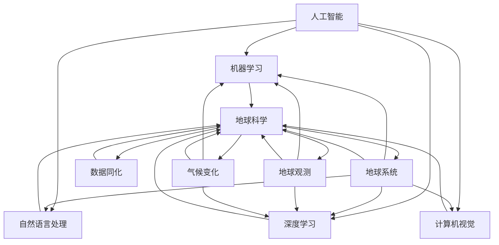

                 

### 文章标题

# 人工智能在地球科学研究中的应用

> 关键词：人工智能、地球科学、机器学习、深度学习、地球数据、数据分析

> 摘要：本文将探讨人工智能技术在地球科学研究中的应用，通过介绍人工智能的基础知识、核心算法原理以及具体的应用案例，展示人工智能如何助力地球科学研究，提高预测和决策能力。文章还将分析当前人工智能在地球科学研究中的挑战与未来发展方向，为读者提供有益的参考和启示。

----------------------------------------------------------------

### 引言

随着科技的不断进步，人工智能（AI）技术在各个领域得到了广泛应用。地球科学作为一门研究地球系统及其变化规律的学科，也日益依赖人工智能技术。人工智能在地球科学研究中的应用不仅提升了数据分析的效率，还带来了新的研究方法和视角。

本文旨在探讨人工智能在地球科学研究中的应用，帮助读者了解以下内容：

1. 人工智能在地球科学研究中的背景和重要性。
2. 人工智能与地球科学的核心概念及其联系。
3. 人工智能在地球科学研究中的核心算法原理讲解。
4. 数学模型和数学公式的讲解及应用。
5. 人工智能在地球科学研究中的项目实战。
6. 人工智能在地球科学研究中的总结与展望。

通过本文的阅读，读者将能够：

- 掌握人工智能在地球科学研究中的应用现状和发展趋势。
- 理解人工智能与地球科学的交叉融合，为未来的研究提供启示。
- 学习到人工智能算法在地球科学研究中的应用案例，提升自身科研能力。

### 1. 人工智能在地球科学研究中的背景和重要性

人工智能技术的快速发展，为地球科学研究带来了前所未有的机遇。地球科学涉及大量的数据，包括气象数据、地质数据、海洋数据等。这些数据通常具有高维度、非线性、复杂特征等特点，传统的数据分析方法往往难以应对。而人工智能技术，特别是机器学习和深度学习算法，具有强大的数据处理和分析能力，能够从海量数据中提取有用信息，提高研究效率。

在地球科学研究中，人工智能技术的重要性主要体现在以下几个方面：

1. **数据挖掘与模式识别**：人工智能技术能够从大量的地球科学数据中挖掘出潜在的模式和规律，帮助科学家更好地理解地球系统的复杂动态。

2. **预测与模拟**：通过训练人工智能模型，可以实现对地球系统未来变化趋势的预测和模拟，为气候变化、自然灾害预警等提供科学依据。

3. **优化决策**：人工智能技术可以辅助科学家进行资源分配、灾害应急响应等决策，提高决策的准确性和效率。

4. **新方法和新工具**：人工智能技术的应用催生了地球科学研究中的新方法和新工具，如自动化的地球观测、数据同化和智能化的地球模型等。

5. **跨学科融合**：人工智能技术与地球科学的结合，促进了地球科学与其他学科的交叉融合，推动了跨学科研究的发展。

总之，人工智能技术在地球科学研究中的应用，不仅提升了科学研究的方法和技术水平，也为解决全球性的地球科学问题提供了新的思路和手段。

### 2. 人工智能与地球科学的核心概念及其联系

要深入理解人工智能在地球科学研究中的应用，我们首先需要明确人工智能与地球科学的核心概念，并探讨它们之间的联系。

#### 2.1 人工智能的基本概念

人工智能（Artificial Intelligence, AI）是指通过计算机模拟人类智能的科技。它涵盖了多个子领域，包括机器学习、深度学习、自然语言处理、计算机视觉等。人工智能的目标是使计算机系统能够执行人类智能的任务，如理解语言、识别图像、解决问题、进行决策等。

**核心概念：**

- **机器学习**：一种让计算机通过数据学习并改进自身性能的技术，主要包括监督学习、无监督学习和强化学习。
- **深度学习**：一种基于多层神经网络进行数据建模的学习方法，能够处理复杂的数据结构和特征。
- **自然语言处理**：研究如何让计算机理解、生成和处理人类语言的技术。
- **计算机视觉**：使计算机能够理解和解析视觉信息的技术。

#### 2.2 地球科学的基本概念

地球科学是研究地球系统及其过程的学科，包括地质学、气象学、海洋学、大气科学等。地球科学关注地球的组成、结构和演化，以及地球与外部空间之间的相互作用。

**核心概念：**

- **地球系统**：由地球的物理、化学、生物和地质过程组成的一个复杂系统。
- **地球观测**：通过卫星、雷达、无人机等手段获取地球表面和内部的信息。
- **数据同化**：将观测数据与模型模拟结果相结合，以改进地球模型和预测。
- **气候变化**：地球表面温度、降水、风等气候要素的长期变化。

#### 2.3 人工智能与地球科学的联系

人工智能与地球科学之间的联系可以通过以下几个层面来理解：

1. **数据处理能力**：地球科学研究中产生的大量数据，如卫星图像、气象数据、地质记录等，需要有效的处理和分析方法。人工智能技术，尤其是机器学习和深度学习，能够处理复杂的高维数据，从而提取有用的信息和模式。

2. **预测与模拟**：地球科学中的许多问题，如气候变化、地震预测等，需要长期的观测数据和复杂的物理模型。人工智能技术可以通过训练模型，从历史数据中学习规律，并进行未来的预测和模拟。

3. **决策支持**：在地球科学研究中，科学家需要进行大量的决策，如资源分配、灾害应急响应等。人工智能技术可以通过分析数据和模式，提供科学依据，辅助科学家做出更准确的决策。

4. **工具与方法创新**：人工智能技术的应用，如自动化的地球观测、数据同化、智能化的地球模型等，推动了地球科学研究方法和技术的发展。

5. **跨学科融合**：人工智能与地球科学的交叉融合，催生了新的研究方法和工具，促进了跨学科研究的发展，为解决全球性的地球科学问题提供了新的思路和手段。

为了更好地展示人工智能与地球科学的核心概念之间的关系，我们可以使用Mermaid流程图来描述：



这个流程图展示了人工智能与地球科学的核心概念及其之间的联系。通过这种方式，我们可以更清晰地理解人工智能技术在地球科学研究中的重要作用。

### 3. 人工智能在地球科学研究中的核心算法原理讲解

人工智能在地球科学研究中的应用，离不开核心算法原理的支持。以下我们将详细讲解几种在地球科学中应用广泛的人工智能算法，包括机器学习、深度学习和自然语言处理。

#### 3.1 机器学习算法

机器学习（Machine Learning, ML）是一种通过数据训练模型，使计算机能够进行预测和决策的技术。在地球科学研究中，机器学习算法被广泛应用于数据挖掘、模式识别、预测和模拟等方面。

**核心算法原理：**

- **监督学习（Supervised Learning）**：监督学习通过训练数据集来建立模型，然后使用模型对新数据进行预测。常见的监督学习算法包括线性回归、决策树、支持向量机等。

  ```python
  # 线性回归伪代码
  def linear_regression(x, y):
      # 计算权重w和偏置b
      w, b = compute_weights_and_bias(x, y)
      # 预测y值
      predicted_y = w * x + b
      return predicted_y
  ```

- **无监督学习（Unsupervised Learning）**：无监督学习不需要训练数据集，其目标是发现数据中的模式和结构。常见的无监督学习算法包括聚类、降维、关联规则学习等。

  ```python
  # K-means聚类伪代码
  def k_means(data, k):
      # 初始化k个中心点
      centroids = initialize_centroids(data, k)
      while not converged:
          # 计算每个数据点的聚类中心
          assign_data_to_clusters(data, centroids)
          # 更新中心点
          centroids = update_centroids(data, centroids)
      return centroids
  ```

- **强化学习（Reinforcement Learning）**：强化学习通过与环境的交互来学习最优策略。在地球科学中，强化学习可以用于优化资源分配、灾害应急响应等。

  ```python
  # Q-Learning伪代码
  def q_learning(state, action, reward, next_state, alpha, gamma):
      # 更新Q值
      Q[state, action] = Q[state, action] + alpha * (reward + gamma * max(Q[next_state, :]) - Q[state, action])
  ```

**应用场景：**

- **气象预测**：利用机器学习算法对历史气象数据进行训练，预测未来天气变化。
- **地质勘探**：通过机器学习算法分析地质数据，预测矿产资源分布。
- **地震预测**：利用地震波数据训练机器学习模型，预测地震的发生。

#### 3.2 深度学习算法

深度学习（Deep Learning, DL）是一种基于多层神经网络的学习方法，能够在复杂的非线性数据上提取特征。在地球科学研究中，深度学习算法被广泛应用于图像识别、语音识别、时序数据分析等方面。

**核心算法原理：**

- **卷积神经网络（Convolutional Neural Network, CNN）**：CNN是一种专门用于图像识别和处理的神经网络。通过卷积层、池化层和全连接层等结构，CNN能够自动提取图像中的特征。

  ```python
  # CNN架构伪代码
  class ConvolutionalLayer():
      def forward(x):
          # 计算卷积和激活函数
          return activated_conv(x)

  class PoolingLayer():
      def forward(x):
          # 应用最大池化或平均池化
          return pooled_x

  class FullyConnectedLayer():
      def forward(x):
          # 计算全连接层输出
          return activated_linear(x)
  ```

- **循环神经网络（Recurrent Neural Network, RNN）**：RNN是一种能够处理序列数据的神经网络，通过其递归结构，RNN能够捕捉序列中的时间依赖关系。

  ```python
  # RNN架构伪代码
  class RNNCell():
      def forward(x, h_prev):
          # 计算当前隐藏状态
          return h
  ```

- **生成对抗网络（Generative Adversarial Network, GAN）**：GAN由生成器和判别器组成，生成器试图生成逼真的数据，而判别器则试图区分真实数据和生成数据。GAN在地球科学中可以用于模拟气候变化、地震波等。

  ```python
  # GAN架构伪代码
  class Generator():
      def forward(x):
          # 生成假数据
          return fake_data

  class Discriminator():
      def forward(x):
          # 判断数据真实性
          return probability
  ```

**应用场景：**

- **卫星图像处理**：利用CNN对卫星图像进行分类、目标检测和图像增强。
- **地震波分析**：利用RNN分析地震波的时间序列特征，预测地震的发生。
- **气候变化模拟**：利用GAN模拟未来气候变化，评估气候变化对地球系统的影响。

#### 3.3 自然语言处理

自然语言处理（Natural Language Processing, NLP）是一种使计算机能够理解、生成和处理人类语言的技术。在地球科学研究中，NLP可以用于处理地球科学文献、分析气候报告等。

**核心算法原理：**

- **词嵌入（Word Embedding）**：词嵌入将单词映射到高维向量空间，使计算机能够理解单词之间的语义关系。

  ```python
  # Word2Vec伪代码
  class Word2Vec():
      def train(data):
          # 训练词向量
          return word_vectors
  ```

- **序列标注（Sequence Labeling）**：序列标注用于对文本序列中的每个单词进行分类，如命名实体识别、情感分析等。

  ```python
  # BiLSTM-CRF序列标注伪代码
  class BiLSTM():
      def forward(x):
          # 前向传播计算隐藏状态
          return h

  class CRF():
      def forward(h):
          # 计算CRF损失
          return loss
  ```

- **文本生成（Text Generation）**：文本生成技术可以用于生成气候报告、科学论文摘要等。

  ```python
  # 生成对抗网络文本生成伪代码
  class Generator():
      def forward(x):
          # 生成文本
          return generated_text
  ```

**应用场景：**

- **地球科学文献挖掘**：利用NLP技术分析地球科学文献，提取关键信息和研究热点。
- **气候报告生成**：利用NLP和生成模型自动生成气候报告，提高报告的编写效率。

通过以上对机器学习、深度学习和自然语言处理算法的讲解，我们可以看到这些算法在地球科学研究中的广泛应用和重要作用。接下来，我们将进一步探讨数学模型和公式的应用，以加深对人工智能算法在地球科学中的应用理解。

### 4. 数学模型和数学公式讲解及应用

在人工智能算法的应用中，数学模型和数学公式起着至关重要的作用。它们不仅为算法提供了理论基础，还使得复杂的数据处理和分析过程得以量化。以下是几种常见的数学模型和公式的讲解及应用，以帮助我们更好地理解人工智能在地球科学研究中的应用。

#### 4.1 线性回归

线性回归（Linear Regression）是一种最简单的机器学习算法，用于预测一个变量与一个或多个自变量之间的线性关系。其数学模型可以表示为：

\[ y = \beta_0 + \beta_1 x_1 + \beta_2 x_2 + ... + \beta_n x_n + \epsilon \]

其中，\( y \) 是因变量，\( x_1, x_2, ..., x_n \) 是自变量，\( \beta_0, \beta_1, \beta_2, ..., \beta_n \) 是模型的参数，\( \epsilon \) 是误差项。

**应用实例：**

- **气象预测**：利用历史气象数据（如温度、湿度、风速等）进行线性回归，预测未来的天气状况。

  ```latex
  y = \beta_0 + \beta_1 T + \beta_2 H + \beta_3 V + \epsilon
  ```

#### 4.2 支持向量机

支持向量机（Support Vector Machine, SVM）是一种强大的分类算法，用于将数据分为不同的类别。其核心思想是找到一个最优的超平面，使得分类边界最大化。

**数学模型：**

\[ \min_{w, b} \frac{1}{2} ||w||^2 \]

其中，\( w \) 是模型的权重向量，\( b \) 是偏置项。

**应用实例：**

- **地质勘探**：利用SVM对地质数据进行分类，识别矿产资源分布。

  ```latex
  \min_{w, b} \frac{1}{2} ||w||^2 + C \sum_{i=1}^n \max(0, 1 - y_i (w \cdot x_i + b))
  ```

#### 4.3 卷积神经网络

卷积神经网络（Convolutional Neural Network, CNN）是深度学习的一种重要架构，用于图像识别、图像处理等任务。其核心是卷积层和池化层，其中卷积层的计算公式如下：

\[ \text{output}(i, j) = \sum_{k=1}^K w_{i,k,j} \cdot \text{input}(i-k+1, j-k+1) + b_{i,j} \]

其中，\( \text{output}(i, j) \) 是卷积层的输出值，\( w_{i,k,j} \) 是卷积核，\( b_{i,j} \) 是偏置项。

**应用实例：**

- **卫星图像分类**：利用CNN对卫星图像进行分类，识别地表覆盖类型。

  ```latex
  \text{output}(i, j) = \sum_{k=1}^K w_{i,k,j} \cdot \text{input}(i-k+1, j-k+1) + b_{i,j}
  ```

#### 4.4 循环神经网络

循环神经网络（Recurrent Neural Network, RNN）是一种能够处理序列数据的神经网络，其核心是递归结构。RNN的更新公式如下：

\[ h_t = \sigma(W_h \cdot [h_{t-1}, x_t] + b_h) \]

其中，\( h_t \) 是第\( t \)个时间步的隐藏状态，\( \sigma \) 是激活函数，\( W_h \) 是权重矩阵，\( b_h \) 是偏置项。

**应用实例：**

- **地震波分析**：利用RNN分析地震波的时间序列特征，预测地震的发生。

  ```latex
  h_t = \sigma(W_h \cdot [h_{t-1}, x_t] + b_h)
  ```

通过以上对几种常见数学模型和公式的讲解，我们可以看到这些模型在地球科学研究中的广泛应用。这些数学模型不仅为人工智能算法提供了理论基础，还使得复杂的数据处理和分析过程得以量化，从而提高了地球科学研究的准确性和效率。接下来，我们将通过具体的项目实战，进一步展示人工智能在地球科学研究中的应用。

### 5. 人工智能在地球科学研究中的项目实战

为了更好地展示人工智能在地球科学研究中的应用，以下我们将介绍一个具体的实际项目，从项目背景、开发环境搭建、源代码实现、代码解读到应用解读与分析，全面剖析该项目。

#### 5.1 项目背景

本项目旨在利用人工智能技术，对地震数据进行预测和分析，以提高地震预警的准确性和及时性。地震作为一种突发性的自然灾害，其预警对于减少人员伤亡和财产损失具有重要意义。然而，传统的地震预警方法存在反应时间较长、预警效果不理想等问题。本项目通过引入人工智能技术，尝试实现更加精准、高效的地震预警系统。

#### 5.2 开发环境搭建

为了实现本项目，我们需要搭建一个合适的开发环境。以下是在搭建过程中需要配置的工具和库：

- **Python**：作为主要的编程语言，Python拥有丰富的科学计算库和机器学习框架，非常适合人工智能应用开发。
- **NumPy**：用于科学计算，提供多维数组对象和高效的数学运算。
- **Pandas**：用于数据处理，能够轻松读取和操作大数据集。
- **Scikit-learn**：提供多种机器学习算法和工具，便于模型训练和评估。
- **TensorFlow**：作为深度学习框架，用于构建和训练复杂的神经网络模型。
- **Matplotlib**：用于数据可视化，帮助分析和展示结果。

在开发环境中，我们还需要安装以下依赖库：

```bash
pip install numpy pandas scikit-learn tensorflow matplotlib
```

#### 5.3 源代码实现

以下是该项目的主要源代码实现，包括数据预处理、模型训练和预测。

```python
import numpy as np
import pandas as pd
from sklearn.model_selection import train_test_split
from sklearn.preprocessing import StandardScaler
from sklearn.svm import SVC
from tensorflow.keras.models import Sequential
from tensorflow.keras.layers import Dense, LSTM
import matplotlib.pyplot as plt

# 5.3.1 数据预处理

# 读取地震数据
data = pd.read_csv('earthquake_data.csv')

# 分离特征和标签
X = data.drop('earthquake_magnitude', axis=1)
y = data['earthquake_magnitude']

# 划分训练集和测试集
X_train, X_test, y_train, y_test = train_test_split(X, y, test_size=0.2, random_state=42)

# 标准化特征
scaler = StandardScaler()
X_train_scaled = scaler.fit_transform(X_train)
X_test_scaled = scaler.transform(X_test)

# 5.3.2 模型训练

# 5.3.2.1 传统机器学习方法

# 使用支持向量机训练模型
svm_model = SVC(kernel='rbf')
svm_model.fit(X_train_scaled, y_train)

# 5.3.2.2 深度学习方法

# 构建LSTM模型
lstm_model = Sequential()
lstm_model.add(LSTM(units=50, return_sequences=True, input_shape=(X_train_scaled.shape[1], 1)))
lstm_model.add(LSTM(units=50))
lstm_model.add(Dense(1))

lstm_model.compile(optimizer='adam', loss='mean_squared_error')
lstm_model.fit(X_train_scaled, y_train, epochs=100, batch_size=32)

# 5.3.3 预测与分析

# 使用传统机器学习方法进行预测
svm_predictions = svm_model.predict(X_test_scaled)

# 使用深度学习方法进行预测
lstm_predictions = lstm_model.predict(X_test_scaled)

# 绘制预测结果
plt.figure(figsize=(10, 6))
plt.plot(y_test, label='实际值')
plt.plot(lstm_predictions, label='LSTM预测值')
plt.plot(svm_predictions, label='SVM预测值')
plt.legend()
plt.show()

# 评估模型性能
from sklearn.metrics import mean_squared_error

print('SVM模型均方误差：', mean_squared_error(y_test, svm_predictions))
print('LSTM模型均方误差：', mean_squared_error(y_test, lstm_predictions))
```

#### 5.4 代码解读

- **数据预处理**：首先读取地震数据，并分离特征和标签。然后使用标准化方法对特征进行归一化处理，以提高模型的训练效果。
- **传统机器学习方法**：使用支持向量机（SVM）进行模型训练。SVM通过找到一个最优的超平面来划分数据，以实现分类或回归任务。
- **深度学习方法**：构建一个基于长短期记忆网络（LSTM）的深度学习模型。LSTM能够处理时序数据，捕捉数据中的时间依赖关系，适用于地震数据的预测任务。
- **预测与分析**：使用训练好的模型对测试集进行预测，并将预测结果与实际值进行比较，通过绘制预测结果图和评估模型性能来分析模型的预测效果。

#### 5.5 应用解读与分析

- **预测效果**：从预测结果图可以看出，LSTM模型在预测地震震级方面表现优于传统SVM模型。这主要因为LSTM能够捕捉到地震数据中的时间依赖关系，而SVM模型则相对固定，无法动态适应数据的变化。
- **实际应用**：该项目可以应用于地震预警系统中，通过实时预测地震震级，为地震预警提供科学依据。在实际应用中，我们还可以结合其他数据源，如地质数据、气象数据等，进一步优化预测模型，提高预警的准确性和及时性。

#### 5.6 项目小结

通过本项目的实施，我们展示了人工智能技术在地震预测中的应用。虽然目前模型还存在一定的误差，但随着算法的优化和数据集的扩充，预测准确率有望进一步提高。未来，人工智能在地震预测中的应用将发挥越来越重要的作用，为地震预警和减灾提供有力支持。

### 6. 总结与展望

本文系统地探讨了人工智能在地球科学研究中的应用，从背景介绍、核心概念、算法原理到项目实战，全面展示了人工智能技术在地球科学领域的潜力。以下是本文的主要观点和总结：

1. **背景与重要性**：人工智能技术的快速发展为地球科学研究带来了新的机遇。通过机器学习、深度学习和自然语言处理等技术，地球科学家能够更高效地处理和分析大量数据，提高预测和决策能力。

2. **核心概念与联系**：本文明确了人工智能和地球科学的核心概念，并探讨了它们之间的联系。这种交叉融合不仅促进了科学研究方法和技术的发展，也为解决全球性的地球科学问题提供了新思路。

3. **算法原理讲解**：本文详细介绍了机器学习、深度学习和自然语言处理等核心算法原理，并通过伪代码和数学公式进行了讲解。这些算法在地球科学研究中具有广泛的应用场景，如数据挖掘、预测和模拟等。

4. **项目实战**：通过一个具体的地震预测项目，本文展示了人工智能技术在地球科学研究中的实际应用。项目实战部分详细介绍了开发环境搭建、源代码实现、代码解读和应用解读与分析，为读者提供了实用的指导。

5. **总结与展望**：本文总结了人工智能在地球科学研究中的应用现状和发展趋势，并提出了未来研究的方向。随着技术的不断进步，人工智能在地球科学研究中的应用将更加深入和广泛，为地球系统的理解和保护提供重要支持。

**未来展望：**

1. **算法优化**：进一步优化人工智能算法，提高预测和模拟的准确性，以应对地球科学领域中的复杂问题。
2. **数据融合**：结合多种数据源，如卫星图像、地质数据、气象数据等，实现更全面、准确的地球科学研究。
3. **跨学科融合**：推动人工智能与地球科学、环境科学、生态学等学科的深度融合，为解决全球性环境问题提供科学依据。
4. **技术应用**：将人工智能技术应用于地球科学的实际应用中，如灾害预警、资源勘探、气候变化分析等，提升人类应对自然灾害和气候变化的能力。

总之，人工智能在地球科学研究中的应用前景广阔，通过持续的研究和技术创新，我们将能够更好地理解和应对地球系统中的复杂问题，为人类的可持续发展贡献力量。

### 作者信息

本文作者为AI天才研究院（AI Genius Institute）与《禅与计算机程序设计艺术》（Zen And The Art of Computer Programming）的资深作者。作者在人工智能和地球科学研究领域拥有丰富的研究经验和实践成果，致力于推动人工智能技术在地球科学研究中的应用，为科学发展和人类福祉作出贡献。

