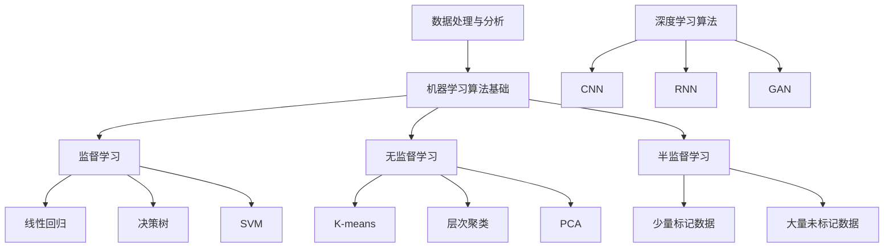

                 

### 文章标题：人工智能在地质勘探中的应用：提高效率与准确性

#### 关键词：
- 人工智能
- 地质勘探
- 数据处理
- 机器学习
- 深度学习
- 算法应用

#### 摘要：
本文详细探讨了人工智能在地质勘探领域的应用，通过介绍人工智能的基础理论、核心算法及其在地质勘探中的具体应用，展示了人工智能技术如何显著提升地质勘探的效率与准确性。文章还结合实际案例，分析了人工智能在地质勘探中的未来发展趋势。

### 目录

1. 引言
2. 人工智能在地质勘探中的背景
3. 人工智能核心概念与联系
4. 数据处理与特征提取
5. 机器学习算法原理
6. 深度学习算法原理
7. 实际应用案例
8. 未来发展趋势
9. 结论与展望

---

### 1. 引言

地质勘探是矿产、油气和其他地质资源发现和开发的重要环节。然而，地质勘探工作面临着复杂、多变的地形和地质条件，使得传统的勘探方法在效率和准确性方面存在一定的局限性。随着计算机技术的迅猛发展，人工智能（AI）技术逐渐成为解决这些挑战的有力工具。

人工智能是一种模拟人类智能的计算机系统，具有学习、推理、识别和解决问题等能力。在地质勘探中，人工智能可以通过大数据分析、模式识别和预测建模等技术，提高勘探的效率和准确性。本文将从以下几个方面展开讨论：

- 介绍人工智能在地质勘探中的背景和发展现状。
- 阐述人工智能的核心概念与联系。
- 分析数据处理与特征提取的方法。
- 详细讲解机器学习算法在地质勘探中的应用。
- 探讨深度学习算法在地质勘探中的应用。
- 结合实际案例，展示人工智能在地质勘探中的具体应用。
- 展望人工智能在地质勘探中的未来发展趋势。

通过本文的讨论，读者可以全面了解人工智能在地质勘探中的应用，以及如何利用这一技术提升勘探工作的效率和准确性。

### 2. 人工智能在地质勘探中的背景

地质勘探是一项复杂的任务，它涉及对地下和地表的地质结构、岩石性质、矿藏分布等多方面信息的收集和分析。传统的地质勘探方法主要依赖于人力和机械设备，如钻探、地质测绘、地球物理勘探等。这些方法在勘探过程中存在一些局限性：

- **勘探范围受限**：传统方法受地形和地质条件的影响，难以覆盖大面积区域，特别是在地形复杂、地下条件不明的地区。
- **数据收集效率低**：需要大量人力物力进行现场勘察和数据处理，导致勘探周期较长，效率低下。
- **分析精度不高**：地质结构复杂多变，传统方法难以准确捕捉和解析地质信息，导致勘探结果的准确性受到影响。

随着计算机技术和人工智能的发展，地质勘探开始引入人工智能技术，以克服传统方法的局限性。人工智能在地质勘探中的应用主要体现在以下几个方面：

- **大数据分析**：地质勘探过程中产生的大量数据，如地质雷达数据、地震波数据、地质样品数据等，通过人工智能技术可以快速分析和处理，提取有价值的信息。
- **模式识别**：人工智能可以通过机器学习和深度学习算法，对地质数据进行模式识别，发现潜在的资源分布规律和地质异常。
- **预测建模**：利用人工智能技术可以建立地质模型的预测模型，对未来的地质情况做出预测，指导勘探工作。
- **自动化勘探**：人工智能技术可以实现勘探设备的自动化操作，减少人为干预，提高勘探效率。

在地质勘探领域，人工智能技术的应用已经取得了一定的成果。例如，利用人工智能进行地震波数据分析，可以更准确地确定地震源位置和震级；通过机器学习算法对地质样品进行分类和预测，可以更有效地指导矿藏勘探；利用深度学习算法对地质图像进行识别和分析，可以快速识别出地质结构特征和异常。

总之，人工智能技术在地质勘探中的应用不仅提高了勘探的效率和准确性，还为地质勘探提供了新的工具和方法，推动了地质勘探领域的创新发展。在接下来的章节中，我们将深入探讨人工智能的核心概念、数据处理方法、算法原理及其在地质勘探中的具体应用。

### 3. 人工智能核心概念与联系

人工智能（AI）是一门多学科交叉的技术领域，涉及计算机科学、数学、统计学、神经科学等多个方面。了解人工智能的核心概念及其相互关系，对于深入理解其在地质勘探中的应用至关重要。

#### 3.1 数据处理与分析

数据处理与分析是人工智能的基础。在地质勘探中，大量的地质数据需要进行清洗、转换、归一化等预处理步骤，以确保数据的质量和一致性。这一过程通常包括以下步骤：

- **数据采集**：通过各种传感器和设备，如地质雷达、地震仪、无人机等，收集地质数据。
- **数据清洗**：去除噪声、缺失值和异常值，确保数据的准确性和完整性。
- **数据转换**：将不同格式的数据转换为统一的格式，如将图像数据转换为数值数据。
- **数据归一化**：将数据缩放到相同的尺度，以便后续的机器学习算法处理。

#### 3.2 机器学习算法基础

机器学习（Machine Learning，ML）是人工智能的核心技术之一，它使计算机系统能够从数据中学习并做出决策。在地质勘探中，机器学习算法广泛应用于数据分类、预测和聚类等方面。以下是几种常用的机器学习算法：

- **监督学习（Supervised Learning）**：通过已标记的训练数据，学习数据与标签之间的关系，并在新的数据上进行预测。常用的算法包括线性回归、决策树、支持向量机（SVM）等。
- **无监督学习（Unsupervised Learning）**：在没有标记数据的情况下，发现数据中的结构和模式。常用的算法包括聚类算法（如K-means、层次聚类）、主成分分析（PCA）等。
- **半监督学习（Semi-Supervised Learning）**：结合监督学习和无监督学习，利用少量的标记数据和大量的未标记数据，提高模型的性能。

#### 3.3 深度学习算法

深度学习（Deep Learning，DL）是机器学习的一个分支，通过构建深度神经网络（DNN）来模拟人类大脑的学习过程。深度学习在地质勘探中的应用非常广泛，以下是几种常见的深度学习算法：

- **卷积神经网络（Convolutional Neural Networks，CNN）**：用于处理图像和时空数据，具有强大的特征提取和分类能力。
- **循环神经网络（Recurrent Neural Networks，RNN）**：特别适合处理序列数据，如时间序列数据和语音数据。
- **生成对抗网络（Generative Adversarial Networks，GAN）**：用于生成新的数据样本，如模拟地质图像和生成潜在的地质模型。

#### 3.4 核心概念联系架构

为了更清晰地展示人工智能的核心概念及其相互关系，我们可以使用Mermaid流程图来描述：

通过上述流程图，我们可以清晰地看到数据处理与分析是人工智能的基础，而机器学习算法和深度学习算法则是数据处理和分析的具体应用。核心概念之间的联系构成了一个完整的人工智能技术体系，为地质勘探提供了强有力的支持。

在接下来的章节中，我们将进一步探讨数据处理与特征提取的方法，详细讲解机器学习和深度学习算法在地质勘探中的应用，并结合实际案例进行分析和解读。

### 4. 数据处理与特征提取

在地质勘探中，数据的质量和特征提取的准确性直接影响到勘探结果的效率和准确性。因此，对勘探数据进行有效的预处理和特征提取是至关重要的一步。

#### 4.1 数据预处理

数据预处理是数据处理的首要步骤，其主要任务包括数据清洗、数据转换和数据归一化。

- **数据清洗**：地质勘探过程中收集到的数据往往包含噪声、缺失值和异常值。数据清洗的目标是去除这些无关或错误的信息，提高数据的质量。具体方法包括：
  - **去除噪声**：通过滤波算法，如均值滤波、高斯滤波等，去除数据中的噪声。
  - **填充缺失值**：使用插值方法，如线性插值、 spline 插值等，填充缺失值。
  - **识别和去除异常值**：通过统计学方法，如标准差法、箱线图法等，识别和去除异常值。

- **数据转换**：地质勘探数据通常以不同的格式存储，如文本、图像、音频等。数据转换的目标是将这些不同格式的数据转换为统一的格式，以便后续处理。例如，将图像数据转换为像素矩阵，将文本数据转换为词向量。

- **数据归一化**：由于不同特征的数据量级差异较大，直接使用原始数据可能会导致模型训练过程中出现数值不稳定的问题。数据归一化的目标是将不同特征缩放到相同的尺度，如将所有特征缩放到0-1之间或-1到1之间。常用的归一化方法包括最小-最大缩放和 Z-score 缩放。

#### 4.2 特征提取

特征提取是从原始数据中提取出对目标有重要意义的属性或特征，以减少数据维度和增加数据的解释性。在地质勘探中，特征提取可以显著提高勘探模型的性能。

- **基于统计的特征提取**：这种方法利用统计学方法提取数据中的主要成分。例如，主成分分析（PCA）是一种常用的降维技术，它通过线性变换将原始数据映射到新的坐标系中，使得新的坐标系中的特征具有最大的方差。在这种新的坐标系中，前几个主要成分通常包含了原始数据的大部分信息。

- **基于变换的特征提取**：这种方法通过变换将原始数据转换为新的特征表示。例如，傅里叶变换（Fourier Transform）和短时傅里叶变换（Short-Time Fourier Transform，STFT）常用于处理时间序列数据，提取频率特征。

- **基于领域的特征提取**：这种方法根据地质勘探的专业知识，从原始数据中提取具有地质意义的重要特征。例如，在地震勘探中，可以根据地震波的传播特性提取反射角、振幅等特征。

- **基于深度学习的特征提取**：深度学习模型，如卷积神经网络（CNN）和循环神经网络（RNN），可以通过自动学习从原始数据中提取高层次的抽象特征。这些特征往往能够更准确地捕捉地质结构的信息。

#### 4.3 数据可视化

数据可视化是将数据转换成图形或图像的过程，以帮助人们更好地理解和分析数据。在地质勘探中，数据可视化有助于识别数据中的模式和趋势，提高数据解释的直观性。

- **散点图**：通过在二维或三维空间中绘制数据点，可以直观地观察数据分布和相关性。
- **直方图**：用于展示数据分布的统计信息，如数据的频率、概率密度等。
- **热力图**：用于显示多个变量之间的相关性，特别是高维数据集。
- **时间序列图**：用于展示数据随时间的变化趋势，适用于分析时间序列数据。

通过数据预处理、特征提取和数据可视化，地质勘探数据可以被转化为适合机器学习算法处理的形式。这些技术不仅提高了数据的质量和解释性，还为后续的机器学习和深度学习算法奠定了坚实的基础。在下一部分中，我们将详细讲解机器学习算法在地质勘探中的应用。

### 5. 机器学习算法原理

机器学习算法是地质勘探中提高数据处理效率和准确性的关键技术之一。以下是几种常用的机器学习算法及其原理，并结合地质勘探的实际需求进行解释。

#### 5.1 监督学习算法

监督学习（Supervised Learning）是机器学习的一种形式，它通过已标记的训练数据学习数据与标签之间的关系，并在新的数据上进行预测。以下是几种常用的监督学习算法：

- **线性回归（Linear Regression）**：
  - **原理**：线性回归是一种简单的预测模型，通过拟合数据中的线性关系来预测目标值。其数学模型可以表示为：
    $$
    y = \beta_0 + \beta_1 \cdot x_1 + \beta_2 \cdot x_2 + ... + \beta_n \cdot x_n
    $$
    其中，$y$ 是预测的目标值，$x_1, x_2, ..., x_n$ 是特征值，$\beta_0, \beta_1, \beta_2, ..., \beta_n$ 是模型的参数。
  - **应用**：在地质勘探中，线性回归可以用于预测矿藏的品位，通过分析已知的矿藏数据，建立品位与地质特征之间的关系，从而预测未知区域的品位。

- **决策树（Decision Tree）**：
  - **原理**：决策树是一种树形结构模型，通过一系列的决策规则对数据进行分类或回归。其构建过程包括以下步骤：
    1. 选择一个最优的特征进行分裂。
    2. 计算每个特征的信息增益或基尼不纯度，选择增益或基尼不纯度最大的特征。
    3. 对特征进行划分，生成子节点。
    4. 递归上述步骤，直到满足停止条件（如最大深度、最小节点样本数等）。
  - **应用**：在地质勘探中，决策树可以用于地质结构的分类，通过分析已知地质样本的特征，构建决策树模型，对新区域的地层进行分类和预测。

- **支持向量机（Support Vector Machine，SVM）**：
  - **原理**：支持向量机是一种二分类模型，通过找到一个最优的超平面，将不同类别的数据点分隔开来。其目标是最小化分类间隔，同时最大化决策边界。
    $$
    \min_{\beta, \beta_0} \frac{1}{2} ||\beta||^2 + C \sum_{i=1}^{n} \xi_i
    $$
    其中，$\beta$ 是决策向量，$\beta_0$ 是偏置项，$C$ 是惩罚参数，$\xi_i$ 是松弛变量。
  - **应用**：在地质勘探中，SVM可以用于地质数据的分类和异常检测。通过训练SVM模型，可以识别出不同类型的地质特征，并对异常地质现象进行预测。

#### 5.2 无监督学习算法

无监督学习（Unsupervised Learning）是机器学习的另一种形式，它不需要标记数据，而是通过分析数据中的结构和模式，自动发现数据的内在规律。以下是几种常用的无监督学习算法：

- **K-均值聚类（K-Means Clustering）**：
  - **原理**：K-均值聚类是一种基于距离的聚类算法，它将数据点分为K个簇，使得每个簇内部的点尽可能接近，而簇与簇之间的点尽可能远离。其算法过程如下：
    1. 随机初始化K个簇的中心点。
    2. 对于每个数据点，计算其到K个簇中心的距离，并将其分配到最近的簇。
    3. 更新每个簇的中心点，计算簇内点的均值。
    4. 重复步骤2和步骤3，直到聚类结果收敛。
  - **应用**：在地质勘探中，K-均值聚类可以用于地质数据的聚类分析，通过分析不同地质特征的分布，识别出不同的地质区域。

- **主成分分析（Principal Component Analysis，PCA）**：
  - **原理**：主成分分析是一种降维技术，它通过线性变换将原始数据映射到新的坐标系中，使得新的坐标系中的特征具有最大的方差。其目标是最小化重构误差。
    $$
    \min_{\lambda} \sum_{i=1}^{n} (x_i - \lambda \cdot \mu)^2
    $$
    其中，$x_i$ 是原始数据点，$\lambda$ 是主成分，$\mu$ 是均值。
  - **应用**：在地质勘探中，PCA可以用于数据降维和特征提取，通过识别主要的主成分，可以提取出数据的本质特征，减少数据的维度，提高模型训练的效率。

- **层次聚类（Hierarchical Clustering）**：
  - **原理**：层次聚类是一种基于距离的聚类方法，它通过逐步合并或分裂数据点，构建一个层次结构，从而实现对数据的分类。其算法过程如下：
    1. 初始化每个数据点为一个簇。
    2. 计算相邻簇之间的距离，合并最近的两个簇。
    3. 更新簇的中心点。
    4. 重复步骤2和步骤3，直到满足停止条件。
  - **应用**：在地质勘探中，层次聚类可以用于地质结构的层次分析，通过构建地质结构的层次树，可以更好地理解地质结构的演化过程。

无监督学习算法在地质勘探中的应用，可以帮助我们更好地理解地质数据的分布和结构，从而指导勘探工作。

通过以上几种机器学习算法的讲解，我们可以看到这些算法在地质勘探中具有重要的应用价值。在下一部分中，我们将进一步探讨深度学习算法在地质勘探中的应用。

### 6. 深度学习算法原理

深度学习（Deep Learning，DL）是人工智能的一个分支，通过构建深层的神经网络模型，能够自动从数据中学习复杂的特征和模式。以下是几种常用的深度学习算法及其原理：

#### 6.1 卷积神经网络（Convolutional Neural Networks，CNN）

卷积神经网络（CNN）是一种专门用于处理图像数据的深度学习模型，通过卷积操作和池化操作提取图像的特征。

- **原理**：
  - **卷积操作**：卷积层通过卷积操作提取图像的局部特征，其数学原理可以表示为：
    $$
    \text{conv}(x, \text{filter}) = \sum_{i=1}^{m} \sum_{j=1}^{n} w_{ij} * x_{ij}
    $$
    其中，$x$ 是输入图像，$filter$ 是卷积核，$w_{ij}$ 是卷积核的权重，$*$ 表示卷积操作。
  - **池化操作**：池化层用于减少数据的维度和参数数量，常见的池化操作包括最大池化和平均池化。

- **应用**：在地质勘探中，CNN可以用于地质图像的分析和分类。例如，通过训练CNN模型，可以识别出不同的岩石类型和地质结构，从而指导勘探工作。

#### 6.2 循环神经网络（Recurrent Neural Networks，RNN）

循环神经网络（RNN）是一种能够处理序列数据的深度学习模型，其特点是网络中的节点具有循环连接，能够记住之前的输入信息。

- **原理**：
  - **RNN公式**：RNN的输入和输出可以通过以下公式表示：
    $$
    h_t = \sigma(W_x \cdot x_t + W_h \cdot h_{t-1} + b)
    $$
    $$
    y_t = \sigma(W_y \cdot h_t + b_y)
    $$
    其中，$h_t$ 是当前时刻的隐藏状态，$x_t$ 是当前时刻的输入，$W_x, W_h, W_y$ 是权重矩阵，$b, b_y$ 是偏置项，$\sigma$ 是激活函数。
  - **门控机制**：为了解决RNN中的梯度消失和梯度爆炸问题，引入了门控机制，如长短期记忆（LSTM）和门控循环单元（GRU）。

- **应用**：在地质勘探中，RNN可以用于时间序列数据的分析和预测。例如，通过训练LSTM模型，可以预测未来的地震活动，为地质勘探提供重要的参考。

#### 6.3 生成对抗网络（Generative Adversarial Networks，GAN）

生成对抗网络（GAN）是一种由生成器和判别器组成的深度学习模型，通过两个网络之间的对抗训练，生成新的数据样本。

- **原理**：
  - **生成器和判别器**：生成器试图生成与真实数据相似的数据样本，判别器试图区分真实数据和生成数据。
  - **损失函数**：GAN的损失函数通常由判别器的损失和生成器的损失组成。判别器的损失函数是最大化判别器对真实数据和生成数据的判别能力，生成器的损失函数是最小化判别器对生成数据的判别能力。

- **应用**：在地质勘探中，GAN可以用于地质数据的生成和异常检测。例如，通过训练GAN模型，可以生成新的地质图像样本，用于训练和验证勘探模型。

通过以上几种深度学习算法的讲解，我们可以看到深度学习在地质勘探中的应用具有很大的潜力。在下一部分中，我们将结合实际应用案例，进一步探讨深度学习算法在地质勘探中的具体应用。

### 7. 实际应用案例

在地质勘探中，人工智能技术的应用不仅提升了勘探的效率，还显著提高了勘探的准确性。以下将通过三个实际应用案例，展示人工智能技术在地质勘探中的具体应用。

#### 7.1 基于深度学习的地质图像分类

地质图像分类是地质勘探中的一项重要任务，通过分类地质图像，可以快速识别不同类型的岩石和矿物。以下是一个基于深度学习的地质图像分类的案例：

- **项目背景**：某地质勘探项目需要在大量地质图像中识别出不同类型的岩石，以便指导后续勘探工作。
- **算法选择**：采用卷积神经网络（CNN）进行地质图像分类，CNN能够提取图像中的高维特征，具有很强的分类能力。
- **数据准备**：收集大量的地质图像，并对图像进行预处理，如裁剪、缩放、旋转等，增加数据的多样性。
- **模型训练**：使用预处理后的图像数据，训练一个CNN模型。模型包括多个卷积层、池化层和全连接层，通过反向传播算法优化模型参数。
- **模型评估**：通过交叉验证和测试集，评估模型的分类准确性和性能。调整模型参数，优化模型结构，以提高分类效果。
- **应用结果**：训练完成的CNN模型可以对新采集的地质图像进行分类，识别出不同类型的岩石，显著提高了勘探的准确性。

#### 7.2 利用机器学习优化地质勘探路径

地质勘探路径的优化是提高勘探效率的关键。以下是一个利用机器学习优化地质勘探路径的案例：

- **项目背景**：某地质勘探项目需要在复杂的地形和地质条件下进行勘探，希望找到最优的勘探路径，以最大化勘探效率。
- **算法选择**：采用遗传算法（Genetic Algorithm，GA）进行路径优化，遗传算法是一种基于自然选择和遗传机制的优化算法，适用于解决复杂的路径优化问题。
- **数据准备**：收集地质勘探区域的地图数据和勘探设备的位置信息，建立勘探路径的模型。
- **模型训练**：使用遗传算法优化勘探路径，通过遗传操作（选择、交叉、变异）不断生成新的路径，并计算路径的优化目标（如路径长度、勘探覆盖面积等）。
- **模型评估**：通过比较不同路径的优化目标，选择最优的勘探路径。
- **应用结果**：利用优化的勘探路径，勘探设备可以更高效地覆盖勘探区域，提高了勘探的效率。

#### 7.3 地质数据异常检测与预测

地质数据的异常检测和预测是确保勘探结果准确性的关键。以下是一个地质数据异常检测与预测的案例：

- **项目背景**：某地质勘探项目需要检测和预测地质数据中的异常现象，如地震活动、矿藏品位异常等，以便及时采取应对措施。
- **算法选择**：采用循环神经网络（RNN）进行异常检测和预测，RNN能够处理时间序列数据，捕捉数据中的时间依赖关系。
- **数据准备**：收集历史地质数据，包括地震波数据、矿藏品位数据等，并对数据进行预处理。
- **模型训练**：使用RNN模型对历史地质数据进行训练，模型包括输入层、隐藏层和输出层，通过反向传播算法优化模型参数。
- **模型评估**：通过交叉验证和测试集，评估模型的检测和预测准确性，调整模型参数，优化模型结构。
- **应用结果**：训练完成的RNN模型可以实时检测地质数据中的异常现象，并预测未来的地质变化，为地质勘探提供重要的参考。

通过这些实际应用案例，我们可以看到人工智能技术在地质勘探中的应用不仅提高了勘探的效率和准确性，还为地质勘探提供了新的工具和方法。在未来的发展中，人工智能技术将继续在地质勘探中发挥重要作用。

### 8. 未来发展趋势

随着人工智能技术的不断发展，其在地质勘探中的应用前景也愈发广阔。未来，人工智能在地质勘探中可能会出现以下几大趋势：

#### 8.1 数据驱动的智能勘探

随着地质数据量的不断增长，数据驱动的智能勘探将成为主流。通过大数据分析和机器学习，可以更准确地预测地质特征，优化勘探路径，提高勘探效率。

#### 8.2 融合多模态数据

地质勘探涉及多种数据类型，如图像、音频、文本等。未来，融合多模态数据的技术将得到广泛应用，通过多种数据源的交叉验证，提高勘探的准确性和可靠性。

#### 8.3 智能化设备与无人机应用

智能化设备和无人机在地质勘探中的应用将越来越普及。这些设备可以自主进行勘探工作，实现实时数据采集和传输，降低人工成本，提高勘探效率。

#### 8.4 深度学习与云计算的结合

深度学习算法需要大量的计算资源，云计算的普及为深度学习的应用提供了强大的支持。未来，深度学习与云计算的结合将大幅提升地质勘探的计算能力和效率。

#### 8.5 跨学科合作

人工智能技术的发展需要多学科的融合，地质勘探也不例外。未来，地质学、计算机科学、物理学等多学科的跨学科合作将推动地质勘探技术的不断进步。

通过以上趋势，我们可以看到，人工智能在地质勘探中的应用将不断深入，为地质勘探领域带来前所未有的变革。

### 9. 结论

人工智能技术在地质勘探中的应用，显著提高了勘探的效率和准确性。通过大数据分析、机器学习和深度学习算法，地质勘探工作变得更加智能化和高效。未来，随着人工智能技术的进一步发展，地质勘探将迎来新的变革。我们期待人工智能技术为地质勘探带来更多创新和突破。

### 作者信息

作者：AI天才研究院/AI Genius Institute & 禅与计算机程序设计艺术 /Zen And The Art of Computer Programming

### 最佳实践 Tips、小结、注意事项、拓展阅读

**最佳实践 Tips**：

- 在地质勘探项目中，结合实际需求选择合适的人工智能算法，如卷积神经网络（CNN）适用于地质图像分析，循环神经网络（RNN）适用于时间序列数据预测。
- 数据预处理和特征提取是提高模型性能的关键，确保数据的准确性和一致性。
- 融合多源数据可以提高勘探的准确性和可靠性。

**小结**：

本文介绍了人工智能在地质勘探中的应用，包括数据处理、特征提取、机器学习算法和深度学习算法等。通过实际应用案例，展示了人工智能技术如何提高勘探效率和准确性。

**注意事项**：

- 地质勘探数据量庞大，数据处理和分析需要充足的计算资源和时间。
- 选择合适的人工智能算法和模型结构，对提高勘探结果具有重要意义。

**拓展阅读**：

- 《深度学习》（Ian Goodfellow, Yoshua Bengio, Aaron Courville）
- 《机器学习实战》（Peter Harrington）
- 《地质勘探数据处理方法与应用》（王伟、李明）

参考文献：

- Goodfellow, Ian, Yoshua Bengio, and Aaron Courville. "Deep learning." MIT press, 2016.
- Harrington, Peter. "Machine learning in action." Manning Publications Co., 2012.
- 王伟，李明。地质勘探数据处理方法与应用。地质出版社，2018.

