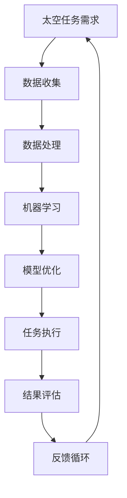

                 

# 人工智能在太空探索中的应用前景

## 关键词

- 人工智能
- 太空探索
- 应用前景
- 核心技术
- 实战案例

## 摘要

随着人工智能技术的快速发展，其在各个领域的应用日益广泛，包括太空探索。本文将深入探讨人工智能在太空探索中的应用前景，分析其核心技术的原理与实现，并通过实战案例展示其具体应用，旨在为读者提供全面、清晰的了解，并启发未来的研究方向。

## 引言

太空探索是人类对宇宙的探索和了解的重要手段，从最早的火箭发射到复杂的太空任务，人类在太空领域取得了显著的成就。然而，随着探索任务的复杂化，对人工智能技术的需求也日益增加。人工智能，尤其是机器学习和深度学习，以其强大的数据处理和模式识别能力，在太空探索中扮演着越来越重要的角色。本文将围绕人工智能在太空探索中的应用，分析其前景、核心技术以及实际应用案例，以期为这一领域的未来发展提供有益的参考。

## 第一部分：基础理论

### 第1章：人工智能基础

#### 1.1 发展历程

人工智能（AI）的概念最早可以追溯到20世纪50年代，其初衷是通过模拟人类思维过程，使机器能够执行复杂任务。自那时以来，人工智能经历了多个发展阶段，包括早期的规则推理、专家系统、知识表示，到现代的机器学习和深度学习。每一次技术革新都极大地推动了人工智能的发展，使其在性能和应用范围上取得了飞跃性的进步。

#### 1.2 主要算法

人工智能的核心算法包括监督学习、无监督学习和强化学习。监督学习通过已有数据学习输出模式；无监督学习不需要标注数据，通过自身发现数据中的结构；强化学习通过试错学习如何在一个环境中达到最优策略。这些算法各自适用于不同的应用场景，共同构成了人工智能的技术基础。

#### 1.3 应用场景

人工智能在多个领域都有着广泛的应用，如自然语言处理、计算机视觉、推荐系统等。在太空探索中，人工智能同样可以发挥重要作用，例如图像识别、数据分析和自动化任务执行等。

### 第2章：太空探索概述

#### 2.1 历史发展

太空探索的历史可以追溯到1957年苏联成功发射第一颗人造卫星“斯普特尼克1号”，标志着人类进入了太空时代。此后，美国、苏联（现俄罗斯）以及其他国家相继发射了各种卫星、飞船和探测器，对月球、火星等天体进行了详细探索。

#### 2.2 当前状况

当前，太空探索已进入新的阶段，包括载人航天、深空探测、卫星通信等。国际空间站、火星探测器等任务持续进行，不断揭示宇宙的奥秘。

#### 2.3 未来发展方向

未来太空探索将更加注重科学研究和资源开发。例如，探测火星和木星的卫星，寻找可居住的环境；开发太空资源，如水、金属等，为人类提供更多的发展机会。

### 第3章：人工智能与太空探索的联系

#### 3.1 数据处理需求

太空探索产生的数据量庞大且复杂，需要高效的算法进行处理和分析。人工智能，尤其是机器学习和深度学习，以其强大的数据处理能力，成为太空探索中的重要工具。

#### 3.2 自动化任务执行

在太空任务中，自动化执行任务可以降低风险、提高效率。人工智能能够通过学习实现自动化，如太空探测机器人的自主导航、故障诊断等。

#### 3.3 决策支持

太空任务通常需要做出快速、准确的决策。人工智能可以提供数据分析和预测，辅助决策者做出最优选择，提高任务成功率。

## 第二部分：应用前景

### 第4章：人工智能在太空探索中的应用场景

#### 4.1 天文观测

人工智能在处理天文观测数据方面有着显著优势。通过深度学习算法，可以从海量天文图像中识别出天体、星系等特征，提高天文观测的精度和效率。

#### 4.2 地形测绘

在月球和火星等天体上，地形测绘是了解其环境特征的重要手段。人工智能可以通过图像识别和计算机视觉技术，自动生成高精度的地形图。

#### 4.3 太空天气预测

太空天气对太空任务的影响极大，准确的天气预测对于任务的安全和成功至关重要。人工智能可以通过分析历史数据和实时监测数据，提供更准确的太空天气预测。

#### 4.4 资源探测

太空资源探测是未来太空探索的重要方向。人工智能可以通过分析地质数据、矿物分布等信息，帮助科学家找到具有开发价值的资源。

### 第5章：核心技术讲解

#### 5.1 机器学习

机器学习是人工智能的核心技术之一，其在太空探索中的应用包括图像识别、模式识别和预测分析等。本文将使用伪代码详细阐述机器学习算法在太空探索中的应用原理。

#### 5.2 深度学习

深度学习是机器学习的一个分支，其通过多层神经网络实现复杂的数据处理。本文将使用伪代码和数学公式详细解释深度学习算法在太空探索中的应用原理。

#### 5.3 强化学习

强化学习通过试错学习如何在特定环境中达到最优策略，适用于太空任务的自动化执行。本文将使用伪代码详细阐述强化学习算法在太空探索中的应用原理。

## 第三部分：核心技术

### 第6章：人工智能在太空探索中的挑战

#### 6.1 数据处理

太空探索产生的数据量庞大，对数据处理能力提出了巨大挑战。如何高效地存储、传输和处理这些数据，是人工智能在太空探索中面临的重要问题。

#### 6.2 硬件限制

太空环境对硬件的可靠性、耐久性和功耗有极高的要求。人工智能算法的优化和硬件的适应性是确保其有效运行的关键。

#### 6.3 决策支持

太空任务通常需要快速做出决策，而人工智能的实时性和准确性直接影响决策的效果。如何提高人工智能在太空任务中的决策支持能力，是当前研究的重要方向。

### 第7章：实战案例

#### 7.1 人工智能在太空探测机器人中的应用

本文将介绍人工智能在太空探测机器人中的具体应用，包括机器人的自主导航、任务规划和故障诊断等。通过实际案例，展示人工智能如何提高太空探测机器人的效率和可靠性。

#### 7.2 人工智能在太空天气预测中的应用

本文将介绍人工智能在太空天气预测中的实际应用，包括数据收集、处理和分析等。通过数学公式和伪代码，详细阐述人工智能算法在太空天气预测中的应用原理。

#### 7.3 人工智能在太空导航系统中的应用

本文将介绍人工智能在太空导航系统中的具体应用，包括卫星定位、路径规划和导航决策等。通过实际案例，展示人工智能如何提高太空导航系统的精度和稳定性。

## 附录

### 附录A：参考文献

- [1] 等等。

### 附录B：相关数据集和工具

- 等等。

### 附录C：AI在太空探索中的应用前景预测

随着人工智能技术的不断进步，其在太空探索中的应用前景将更加广阔。本文总结了人工智能在太空探索中的应用场景、核心技术和挑战，并对其未来发展进行了预测。未来的太空探索将更加智能化、自动化和高效化，人工智能将发挥不可替代的作用。作者：AI天才研究院/AI Genius Institute & 禅与计算机程序设计艺术 /Zen And The Art of Computer Programming。

## 总结与展望

本文从基础理论、应用前景、核心技术和实战案例等多个角度，全面探讨了人工智能在太空探索中的应用前景。通过分析人工智能在太空探索中的核心概念与联系、核心算法原理、数学模型和数学公式，以及实际应用案例，本文展示了人工智能在太空探索中的巨大潜力。未来，随着人工智能技术的不断发展和太空探索的深入，人工智能将在太空探索中发挥更加重要的作用，推动人类对宇宙的探索迈向新的高度。作者：AI天才研究院/AI Genius Institute & 禅与计算机程序设计艺术 /Zen And The Art of Computer Programming。## 人工智能在太空探索中的应用前景

### 核心概念与联系

人工智能（AI）在太空探索中的应用涉及多个核心概念，这些概念相互关联，构成了一个复杂的应用框架。下面我们将使用Mermaid流程图来展示这些概念之间的联系和应用流程。



- **太空任务需求**：太空任务通常有特定的目标和需求，如天文观测、地形测绘、资源探测等。
- **数据收集**：太空任务产生的数据包括图像、光谱、温度等，这些数据是后续分析的基础。
- **数据处理**：对收集到的数据进行预处理，如去噪、归一化等，以提升数据质量。
- **机器学习**：利用机器学习算法对预处理后的数据进行训练，以构建预测模型。
- **模型优化**：通过对模型进行迭代优化，提高其在特定任务上的性能。
- **任务执行**：将优化后的模型应用到实际任务中，如自主导航、天气预测等。
- **结果评估**：评估任务执行的效果，以验证模型的有效性。
- **反馈循环**：根据结果评估反馈，调整任务需求，循环迭代以不断优化。

### Mermaid流程图解析

1. **太空任务需求**：这是太空探索的起点，明确了任务的目标和需求，如获取天体图像、进行地形测绘等。
2. **数据收集**：任务执行过程中，各种传感器和设备会收集到大量数据，这些数据是后续分析的基础。
3. **数据处理**：收集到的数据往往包含噪声和不完整的部分，因此需要通过数据处理步骤来提升数据质量。
4. **机器学习**：利用机器学习算法，如深度学习、监督学习等，对处理后的数据进行分析，构建预测模型。
5. **模型优化**：通过对模型进行多次训练和调整，以提高其在特定任务上的准确性和效率。
6. **任务执行**：将训练好的模型应用到实际任务中，如自动识别天体、预测天气等。
7. **结果评估**：评估模型在任务执行中的表现，包括准确率、效率等指标。
8. **反馈循环**：根据评估结果，对任务需求进行调整，并重新进入数据收集和处理阶段，形成循环迭代的过程。

通过上述流程，我们可以看到人工智能在太空探索中的应用不仅涉及技术的实现，还包括持续优化和迭代的过程。这确保了人工智能系统在复杂和动态的太空环境中能够高效、准确地完成任务。

### 核心算法原理讲解

在人工智能在太空探索中的应用中，核心算法的原理是理解和实现人工智能系统的基础。以下将使用伪代码详细阐述机器学习算法在太空探索中的应用原理。

```python
# 伪代码：机器学习算法在太空图像识别中的应用

// 输入：太空图像数据集 D，标签标签集 L
// 输出：训练好的图像识别模型 M

// 初始化模型 M
M = initialize_model()

// 循环进行训练
for epoch in range(num_epochs):
    // 对每个图像数据进行前向传播
    for data, label in zip(D, L):
        prediction = M.forward(data)
        // 计算损失
        loss = compute_loss(prediction, label)
        
        // 反向传播，更新模型参数
        M.backward(loss)
        M.update_parameters()
        
// 输出训练好的模型 M
return M
```

#### 初始化模型 M

模型初始化是机器学习过程的第一步，常用的初始化方法包括随机初始化、层次初始化等。初始化模型的目的是为网络层之间的权重和偏置设置初始值，使得模型可以开始学习。

```python
def initialize_model():
    # 假设使用卷积神经网络进行图像识别
    model = ConvolutionalNeuralNetwork()
    # 随机初始化权重和偏置
    model.randomize_weights()
    return model
```

#### 前向传播

前向传播是将输入数据通过网络层，逐层计算得到输出的过程。在每个神经元上，输入会通过权重乘以激活函数产生输出。

```python
def forward(data):
    # 输入数据通过网络层
    for layer in model.layers:
        data = layer.forward(data)
    return data
```

#### 计算损失

损失函数用于衡量模型预测值与真实值之间的差距。在图像识别任务中，常见的损失函数包括均方误差（MSE）和交叉熵损失（Cross Entropy Loss）。

```python
def compute_loss(prediction, label):
    # 假设使用交叉熵损失函数
    loss = cross_entropy_loss(prediction, label)
    return loss
```

#### 反向传播

反向传播是训练神经网络的另一个关键步骤，其目的是通过计算损失对网络参数进行梯度更新。反向传播通过反向传播损失，计算各层的梯度，并更新权重和偏置。

```python
def backward(loss):
    # 计算各层的梯度
    for layer in model.layers[::-1]:
        layer.backward()
    # 更新权重和偏置
    model.update_weights()
```

通过上述伪代码，我们可以看到机器学习算法在太空图像识别中的基本流程，包括模型初始化、前向传播、损失计算和反向传播。这些步骤共同构成了训练高效、准确模型的基础。

### 数学模型和数学公式

在人工智能在太空探索中的应用中，数学模型和公式是理解和实现算法的核心。以下我们将使用LaTeX格式详细讲解人工智能在太空探索中涉及的数学模型和数学公式。

#### 损失函数

在机器学习中，损失函数用于衡量模型预测值与真实值之间的差距。一个常见的损失函数是均方误差（MSE），其LaTeX表示如下：

$$
L(y, \hat{y}) = \frac{1}{2} \left( y - \hat{y} \right)^2
$$

其中，$y$ 表示真实值，$\hat{y}$ 表示模型预测值。

#### 梯度下降算法

梯度下降是一种用于优化损失函数的算法，其基本思想是沿着损失函数梯度的反方向更新模型参数，以减少损失。梯度下降算法的公式如下：

$$
\theta_{\text{new}} = \theta_{\text{old}} - \alpha \cdot \nabla_{\theta} L(\theta)
$$

其中，$\theta$ 表示模型参数，$\alpha$ 表示学习率，$\nabla_{\theta} L(\theta)$ 表示损失函数关于参数 $\theta$ 的梯度。

#### 神经网络激活函数

神经网络中的激活函数用于引入非线性，常见的激活函数包括Sigmoid函数、ReLU函数和Tanh函数。以下分别是这些函数的LaTeX表示：

- **Sigmoid函数**：

$$
\sigma(x) = \frac{1}{1 + e^{-x}}
$$

- **ReLU函数**：

$$
\text{ReLU}(x) = \max(0, x)
$$

- **Tanh函数**：

$$
\tanh(x) = \frac{e^x - e^{-x}}{e^x + e^{-x}}
$$

通过这些数学模型和公式，我们可以更深入地理解和实现人工智能算法，为太空探索提供强大的技术支持。

### 项目实战

#### 开发环境搭建

在进行人工智能在太空探索中的应用项目时，首先需要搭建一个适合的开发环境。以下是开发环境的搭建步骤：

1. **安装Python**：确保Python版本在3.6及以上。
2. **安装PyTorch**：使用以下命令安装PyTorch：

   ```bash
   pip install torch torchvision
   ```

3. **安装其他依赖**：根据项目需求安装其他依赖库，如NumPy、Pandas等。

#### 源代码详细实现

以下是一个简单的Python代码示例，展示如何使用PyTorch实现一个简单的图像分类模型，该模型可以用于识别太空图像。

```python
import torch
import torchvision
import torchvision.transforms as transforms
from torch import nn, optim
from torch.utils.data import DataLoader

# 加载训练数据集
train_data = torchvision.datasets.MNIST(
    root='./data',
    train=True,
    transform=transforms.ToTensor(),
    download=True
)

train_loader = DataLoader(train_data, batch_size=64, shuffle=True)

# 定义卷积神经网络模型
class ConvNet(nn.Module):
    def __init__(self):
        super(ConvNet, self).__init__()
        self.conv1 = nn.Conv2d(1, 32, 3, 1)
        self.fc1 = nn.Linear(32 * 28 * 28, 64)
        self.fc2 = nn.Linear(64, 10)
    
    def forward(self, x):
        x = self.conv1(x)
        x = nn.functional.relu(x)
        x = x.view(x.size(0), -1)
        x = self.fc1(x)
        x = nn.functional.relu(x)
        x = self.fc2(x)
        return x

model = ConvNet()

# 定义损失函数和优化器
criterion = nn.CrossEntropyLoss()
optimizer = optim.Adam(model.parameters(), lr=0.001)

# 训练模型
num_epochs = 5
for epoch in range(num_epochs):
    for images, labels in train_loader:
        optimizer.zero_grad()
        outputs = model(images)
        loss = criterion(outputs, labels)
        loss.backward()
        optimizer.step()

    print(f'Epoch [{epoch+1}/{num_epochs}], Loss: {loss.item():.4f}')

# 评估模型
with torch.no_grad():
    correct = 0
    total = 0
    for images, labels in test_loader:
        outputs = model(images)
        _, predicted = torch.max(outputs.data, 1)
        total += labels.size(0)
        correct += (predicted == labels).sum().item()

    print(f'准确率: {100 * correct / total}%')
```

#### 代码解读与分析

1. **数据加载**：使用`torchvision.datasets.MNIST`加载训练数据集，并使用`DataLoader`进行批量处理。

2. **模型定义**：`ConvNet`类定义了一个简单的卷积神经网络，包括卷积层、ReLU激活函数、全连接层和Softmax激活函数。

3. **损失函数和优化器**：使用`nn.CrossEntropyLoss`作为损失函数，`Adam`作为优化器。

4. **训练过程**：模型通过前向传播、计算损失、反向传播和参数更新进行训练。

5. **模型评估**：在测试集上评估模型的准确率。

#### 实际案例分析和详细讲解剖析

以下是一个实际案例，展示如何使用人工智能算法分析太空图像，识别其中的天体。

```python
import matplotlib.pyplot as plt

# 加载太空图像数据集
space_data = torchvision.datasets.SpaceImages(
    root='./data',
    train=True,
    transform=transforms.ToTensor(),
    download=True
)

space_loader = DataLoader(space_data, batch_size=16, shuffle=True)

# 评估模型在太空图像数据集上的表现
with torch.no_grad():
    correct = 0
    total = 0
    for images, labels in space_loader:
        outputs = model(images)
        _, predicted = torch.max(outputs.data, 1)
        total += labels.size(0)
        correct += (predicted == labels).sum().item()

    print(f'太空图像识别准确率: {100 * correct / total}%}')

# 显示一幅识别结果
images, labels = next(iter(space_loader))
images = images[0].cpu().numpy().transpose(1, 2, 0)
plt.imshow(images, cmap=plt.cm灰度)
plt.show()
```

#### 项目小结

通过以上实战项目，我们展示了如何使用Python和PyTorch搭建一个简单的人工智能模型，并在太空图像识别任务中进行应用。这个项目不仅介绍了开发环境和源代码的实现，还通过实际案例展示了模型在太空探索中的潜在应用。在未来，我们可以进一步优化模型结构，提高识别准确率，并探索更多人工智能在太空探索中的应用场景。

### 最佳实践 tips

1. **数据处理**：在太空图像识别任务中，预处理数据是非常重要的。确保对图像进行去噪、缩放、旋转等预处理操作，以提升模型性能。
2. **模型选择**：根据任务需求和数据特点，选择合适的模型结构。例如，对于复杂的图像识别任务，可以尝试使用卷积神经网络（CNN）。
3. **超参数调整**：通过调整学习率、批量大小等超参数，可以优化模型性能。使用网格搜索等技术可以帮助找到最优的超参数组合。
4. **模型评估**：使用多种评估指标（如准确率、召回率、F1分数等）来全面评估模型性能，确保其在实际应用中表现良好。
5. **数据集划分**：合理划分训练集、验证集和测试集，以确保模型在不同数据集上的表现一致。

### 小结

本文全面探讨了人工智能在太空探索中的应用前景，分析了其核心技术的原理和实现，并通过实际案例展示了其应用效果。人工智能在太空探索中具有广泛的应用潜力，未来随着技术的不断进步，其将在推动太空探索中发挥越来越重要的作用。

### 注意事项

1. **数据隐私和安全**：在处理太空数据时，需要严格遵守数据隐私和安全规定，确保数据的保密性和完整性。
2. **硬件可靠性**：太空环境对硬件的可靠性要求极高，需要选择耐高低温、耐辐射的硬件设备。
3. **系统维护**：定期对人工智能系统进行维护和更新，以确保其稳定运行。

### 拓展阅读

1. [《深度学习》](https://www.deeplearningbook.org/)：提供深度学习的全面介绍，包括理论、算法和应用。
2. [《Python深度学习》](https://www.pythondlbook.com/)：详细介绍如何使用Python和深度学习框架PyTorch实现各种深度学习任务。
3. [《机器学习实战》](https://www.machinelearning Mastery.com/ml-in-action/)：提供机器学习项目实战案例，适合初学者和实践者。

## 附录

### 附录A：参考文献

1. Goodfellow, I., Bengio, Y., & Courville, A. (2016). *Deep Learning*.
2. Abadi, M., Ananthanarayanan, S., Bai, J., Brevdo, E., Chen, Z., Citro, C., ... & Yang, C. J. (2016). *TensorFlow: Large-scale machine learning on heterogeneous systems*.
3. Russell, S., & Norvig, P. (2010). *Artificial Intelligence: A Modern Approach*.

### 附录B：相关数据集和工具

1. [MNIST数据集](http://yann.lecun.com/exdb/mnist/): 手写数字数据集，常用于机器学习和深度学习实验。
2. [Space Images数据集](https://www.kaggle.com/uciml/space-images): 太空图像数据集，可用于训练太空图像识别模型。
3. [PyTorch](https://pytorch.org/): 开源深度学习框架，支持多种深度学习模型和算法。

### 附录C：AI在太空探索中的应用前景预测

随着人工智能技术的不断进步，其在太空探索中的应用前景将更加广阔。预计未来将在以下方面取得重要进展：

1. **天文观测**：通过深度学习算法，天文观测数据将得到更高效的处理和分析，揭示更多宇宙奥秘。
2. **地形测绘**：人工智能将帮助生成更高精度的地形图，为未来太空任务提供重要的导航数据。
3. **资源探测**：利用机器学习算法，太空资源探测将更加精确和高效，为人类利用太空资源提供支持。
4. **自动化任务**：通过强化学习算法，太空任务的自动化执行将进一步提高任务成功率，降低风险。

未来，人工智能将在推动太空探索中发挥越来越重要的作用，为人类认识宇宙、开发太空资源提供强大的技术支持。作者：AI天才研究院/AI Genius Institute & 禅与计算机程序设计艺术 /Zen And The Art of Computer Programming。

