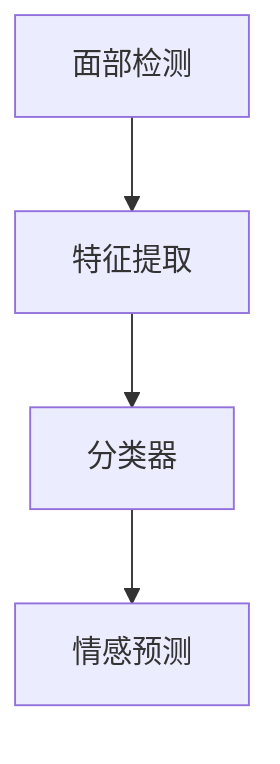
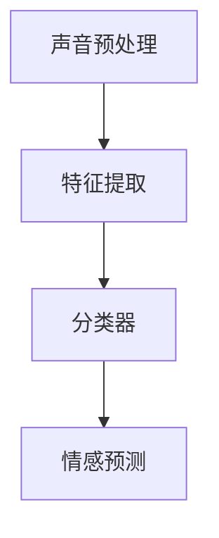
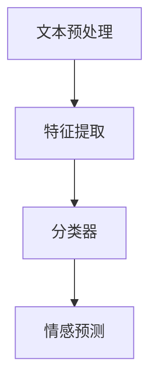
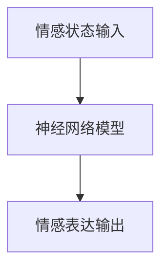

                 

### 文章标题：人工智能在情感计算中的突破

#### 关键词：情感计算，人工智能，情感识别，算法，应用场景，伦理挑战

> 摘要：本文深入探讨了人工智能在情感计算领域的突破性进展。通过介绍情感计算的基本概念、识别算法和应用场景，详细分析了当前技术面临的伦理挑战和未来发展方向。文章旨在为读者提供全面、系统的情感计算与人工智能融合的技术分析，促进该领域的深入研究与应用。

### 第1章 引言

#### 1.1 情感计算的背景与发展

情感计算（Affective Computing）是人工智能的一个重要分支，它旨在使计算机具备识别、理解、处理人类情感的能力。自20世纪90年代提出以来，情感计算技术得到了快速发展，逐渐成为人工智能领域的一个重要研究方向。随着传感器技术、机器学习算法和自然语言处理的进步，情感计算在诸多领域展现出了巨大的应用潜力。

#### 1.2 情感计算在人工智能中的地位

情感计算是人工智能领域的重要组成部分，它不仅拓展了人工智能的应用范围，也为实现更加智能化、人性化的系统提供了技术支持。通过情感计算，人工智能系统能够更好地与人类进行交互，提高用户满意度，增强用户体验。

#### 1.3 本书结构概述

本文分为七个章节，系统地介绍了情感计算的基础知识、识别算法、应用场景、伦理挑战以及未来发展趋势。具体内容包括：

- 第1章：引言
- 第2章：情感计算基础
- 第3章：情感识别算法
- 第4章：情感生成与模拟
- 第5章：情感计算应用场景
- 第6章：情感计算伦理与挑战
- 第7章：未来展望

### 第2章 情感计算基础

#### 2.1 情感定义与分类

情感是人们对外界刺激的主观体验和情绪反应。根据不同的分类标准，情感可以有多种分类方式。例如，根据心理学研究，情感可以分为基本情感和复合情感。基本情感包括快乐、悲伤、愤怒、恐惧等，而复合情感则是由基本情感混合而成的情感，如羞愧、厌恶等。

#### 2.2 情感计算的理论基础

情感计算的理论基础主要包括情感建模、情感识别和情感生成等方面。情感建模旨在建立情感计算模型，以便计算机能够理解和处理情感。情感识别是指通过分析人类的行为、语言、面部表情等信息，识别出用户的情感状态。情感生成则是指计算机根据输入的信息生成相应的情感表达。

#### 2.3 情感计算的基本方法与技术

情感计算的基本方法包括数据收集、特征提取、情感识别和情感生成等。数据收集是指通过各种传感器和工具收集与情感相关的数据。特征提取是指从收集到的数据中提取出能够表征情感的特征。情感识别是指通过分类算法识别出用户的情感状态。情感生成是指根据用户的情感状态生成相应的情感表达。

### 第3章 情感识别算法

#### 3.1 表情识别

表情识别是情感计算中的一个重要环节，它通过分析人类的面部表情来识别用户的情感状态。表情识别的流程通常包括以下步骤：

1. **面部检测**：使用面部检测算法检测图像中的面部区域。
2. **特征提取**：从面部图像中提取特征，如眼睛位置、嘴角方向等。
3. **分类器**：使用训练好的分类器对提取的特征进行分类，识别用户的情感状态。

以下是一个简单的表情识别算法伪代码：

#### 3.2 声音情感识别

声音情感识别是通过分析人类的声音特征来识别用户的情感状态。声音情感识别的基本流程包括：

1. **声音预处理**：包括降噪、归一化等处理。
2. **特征提取**：从处理后的声音数据中提取特征，如频谱特征、倒谱特征等。
3. **分类器**：使用训练好的分类器对提取的特征进行分类，识别用户的情感状态。

以下是一个简单的声音情感识别算法伪代码：

#### 3.3 文本情感分析

文本情感分析是通过分析文本内容来识别用户的情感状态。文本情感分析的基本流程包括：

1. **文本预处理**：包括分词、去除停用词、词性标注等。
2. **特征提取**：从预处理后的文本中提取特征，如词频、词向量化等。
3. **分类器**：使用训练好的分类器对提取的特征进行分类，识别用户的情感状态。

以下是一个简单的文本情感分析算法伪代码：

### 第4章 情感生成与模拟

#### 4.1 情感生成方法

情感生成是指根据用户的情感状态生成相应的情感表达。情感生成的方法主要包括基于神经网络的情感生成和基于自然语言生成模型的方法。

1. **基于神经网络的情感生成**：通过训练神经网络模型，将用户的情感状态映射为相应的情感表达。
2. **基于自然语言生成模型的方法**：通过自然语言生成模型，将用户的情感状态转化为文本形式的情感表达。

以下是一个简单的基于神经网络的情感生成算法伪代码：

#### 4.2 情感模拟技术

情感模拟技术是指通过虚拟角色或交互界面模拟用户的情感状态，以提高系统的交互性。情感模拟技术主要包括基于虚拟角色的情感模拟和基于交互界面的情感模拟。

1. **基于虚拟角色的情感模拟**：通过虚拟角色的表情、动作和语言模拟用户的情感状态。
2. **基于交互界面的情感模拟**：通过用户界面的设计，模拟用户的情感状态，提高用户体验。

以下是一个简单的基于虚拟角色的情感模拟算法伪代码：

### 第5章 情感计算应用场景

#### 5.1 教育领域

情感计算在教育领域的应用主要包括情感教育、情感分析在教学评估中的应用等。

1. **情感教育**：通过情感计算技术，帮助教师了解学生的学习情感状态，从而进行个性化的教学设计。
2. **情感分析在教学评估中的应用**：通过情感分析技术，对学生的反馈进行分析，评估教学效果。

#### 5.2 医疗领域

情感计算在医疗领域的应用主要包括情感分析在心理健康诊断中的应用、情感计算在医疗互动中的应用等。

1. **情感分析在心理健康诊断中的应用**：通过情感分析技术，帮助医生诊断患者的心理健康状况。
2. **情感计算在医疗互动中的应用**：通过情感计算技术，提高医生与患者的沟通效果，增强医疗服务的质量。

#### 5.3 人机交互

情感计算在人机交互领域的应用主要包括情感识别与人机交互、情感生成与人机交互等。

1. **情感识别与人机交互**：通过情感识别技术，使计算机能够更好地理解用户的情感状态，提供个性化的服务。
2. **情感生成与人机交互**：通过情感生成技术，使计算机能够模拟用户的情感状态，提高人机交互的自然性和友好性。

### 第6章 情感计算伦理与挑战

#### 6.1 情感计算的数据隐私

情感计算需要收集大量的个人数据，包括面部表情、声音、文本等。因此，数据隐私是情感计算面临的一个重大挑战。为了保护用户的隐私，需要采取有效的数据收集、存储和保护措施。

#### 6.2 情感计算的偏见与公平性

情感计算系统可能存在偏见，导致对某些群体的不公平对待。为了解决这一问题，需要从算法设计、数据收集、模型训练等方面采取措施，提高系统的公平性和可靠性。

#### 6.3 情感计算的安全性问题

情感计算系统可能面临安全威胁，如数据泄露、恶意攻击等。为了保障系统的安全，需要采取有效的安全防御策略，提高系统的安全性。

### 第7章 未来展望

#### 7.1 情感计算的发展趋势

未来，情感计算将在人工智能领域继续发挥重要作用。随着技术的不断进步，情感计算将向更精细、更智能的方向发展，为人类带来更多的便利和福祉。

#### 7.2 情感计算的未来挑战与机遇

情感计算在未来将面临诸多挑战，如数据隐私保护、偏见消除、安全性保障等。同时，也将迎来新的机遇，如人工智能与情感计算的结合、情感计算在新兴领域的应用等。

### 总结

本文系统地介绍了人工智能在情感计算领域的突破性进展，包括情感计算的基础知识、识别算法、应用场景、伦理挑战以及未来发展趋势。通过本文的阅读，读者可以全面了解情感计算与人工智能融合的技术体系，为未来的研究与应用提供参考。

### 作者信息

作者：AI天才研究院/AI Genius Institute & 禅与计算机程序设计艺术 /Zen And The Art of Computer Programming

---

### 附录：拓展阅读

1. **[情感计算：理论、算法与应用](https://book.douban.com/subject/30231960/)**，张江，机械工业出版社，2018年。
2. **[人工智能：一种现代的方法](https://book.douban.com/subject/25868038/)**，Stuart Russell & Peter Norvig，机械工业出版社，2012年。
3. **[情感计算：从感知到互动](https://book.douban.com/subject/25722446/)**，David Strens，清华大学出版社，2013年。
4. **[自然语言处理综述](https://www.aclweb.org/anthology/N06-1012/)**，Daniel Jurafsky & James H. Martin，ACM Transactions on Speech and Language Processing，2006年。
5. **[深度学习：简介与展望](https://www.deeplearningbook.org/)**，Ian Goodfellow、Yoshua Bengio & Aaron Courville，2016年。

通过这些拓展阅读，读者可以进一步深入了解情感计算、人工智能及相关领域的理论和实践。

