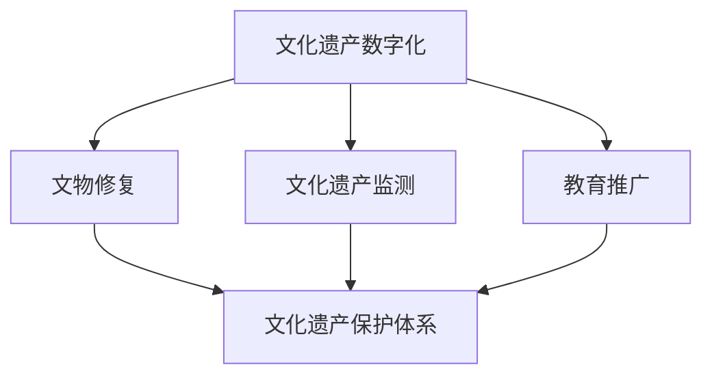

                 

1. **文章标题**
《人工智能在文化遗产保护中的创新应用》

2. **文章关键词**
人工智能、文化遗产保护、创新应用、文化传承、技术优化、伦理与法规

3. **文章摘要**
本文深入探讨了人工智能在文化遗产保护中的创新应用，首先介绍了文化遗产保护的重要性和面临的挑战，随后详细阐述了人工智能在文化遗产数字化、文物修复、监测与教育推广等领域的核心概念、算法原理、数学模型及其在具体项目中的应用。通过一系列实际案例，展示了人工智能在文化遗产保护中的潜力和未来发展方向。最后，对人工智能在文化遗产保护中的法律法规与伦理问题进行了探讨，提出了构建人工智能文化遗产保护体系的实践指南。

4. **背景介绍**

文化遗产是人类文明发展的重要见证，对于传承历史文化、促进文化交流具有不可替代的价值。然而，随着环境变迁和人类活动的加剧，许多文化遗产正面临严峻的破坏和消失风险。传统保护方法在应对复杂多变的遗产破坏机制和庞大的遗产数据库方面存在局限性，难以满足现代文化遗产保护的需求。

5. **核心概念与联系**

文化遗产保护涉及多个学科领域，如考古学、历史学、建筑学等。人工智能作为一门交叉学科，通过机器学习、计算视觉、自然语言处理等核心技术，为文化遗产保护提供了新的方法和手段。以下是人工智能在文化遗产保护中的核心概念及其相互联系：

**核心概念：**
- **文化遗产数字化**：利用数字化技术将文化遗产转换为数字形式，便于存储、管理和传播。
- **文物修复**：通过人工智能技术，对受损文物进行修复和复原。
- **文化遗产监测**：利用传感器和人工智能技术，实时监测文化遗产的状态和环境变化。
- **教育推广**：通过虚拟现实、增强现实等技术，让公众更好地了解和体验文化遗产。

**概念关系架构 Mermaid 流�程图：**


6. **核心算法原理讲解**

**机器学习与数据挖掘**

**伪代码：**
```plaintext
function data_mining(cultural_data):
    # 初始化数据预处理模块
    preprocessed_data = preprocess_data(cultural_data)

    # 初始化机器学习模型
    model = initialize_model(preprocessed_data)

    # 训练模型
    trained_model = train_model(model, preprocessed_data)

    # 模型评估
    evaluate_model(trained_model, preprocessed_data)

    # 模型应用
    predictions = apply_model(trained_model, cultural_data)
    return predictions
```

**计算视觉**

**伪代码：**
```plaintext
function image_recognition(image_data):
    # 加载图像数据
    loaded_image = load_image(image_data)

    # 图像预处理
    preprocessed_image = preprocess_image(loaded_image)

    # 特征提取
    features = extract_features(preprocessed_image)

    # 分类模型训练
    trained_model = train_classifier(features)

    # 图像分类
    classification_result = classify_image(trained_model, preprocessed_image)

    return classification_result
```

**自然语言处理**

**伪代码：**
```plaintext
function text_analysis(text_data):
    # 加载文本数据
    loaded_text = load_text(text_data)

    # 文本预处理
    preprocessed_text = preprocess_text(loaded_text)

    # 语义分析
    analyzed_text = analyze_semantics(preprocessed_text)

    # 文本分类
    classification_result = classify_text(analyzed_text)

    return classification_result
```

**数学模型和公式**

**文物修复材料强度预测模型**

$$\hat{I} = \alpha \cdot (1 - \beta \cdot \ln{t}) \cdot I_0$$

其中，$\hat{I}$ 为预测的文物材料强度，$I_0$ 为原始强度，$\alpha$ 为材料老化系数，$\beta$ 为时间影响系数，$t$ 为文物材料暴露时间。

**详细讲解与举例说明**

- **机器学习在文物修复中的应用**：利用卷积神经网络（CNN）对文物图像进行修复，通过训练大量修复案例，模型可以自动识别并填补图像中的缺失部分。例如，对于一幅破碎的陶瓷碎片图像，通过CNN处理，可以恢复出完整的陶瓷形态。

- **计算视觉在文物检测中的应用**：利用深度学习算法，可以自动检测和分类文物中的各种图案和文字。例如，在壁画检测中，模型可以自动识别并分类壁画中的各种颜色和图案，帮助考古学家进行更精确的研究。

- **自然语言处理在文物文献中的应用**：利用自然语言处理技术，可以将古老的文物文献进行数字化处理，提取出其中的关键信息，如人名、地名、事件等。例如，通过分词、词性标注等技术，可以将古文文献转化为现代汉语，便于现代人阅读和研究。

7. **项目实战**

**开发环境搭建**

- 操作系统：Ubuntu 18.04
- 编程语言：Python 3.8
- 数据库：MySQL 8.0
- 机器学习框架：TensorFlow 2.5

**源代码详细实现和代码解读**

```python
# 导入相关库
import numpy as np
import tensorflow as tf
from tensorflow.keras.models import Sequential
from tensorflow.keras.layers import Conv2D, MaxPooling2D, Flatten, Dense

# 函数：预处理数据
def preprocess_data(images):
    # 数据标准化
    normalized_images = (images - 127.5) / 127.5
    
    # 数据扩展维度
    expanded_images = np.expand_dims(normalized_images, axis=-1)
    
    return expanded_images

# 函数：构建卷积神经网络模型
def build_model():
    model = Sequential([
        Conv2D(32, (3, 3), activation='relu', input_shape=(128, 128, 1)),
        MaxPooling2D((2, 2)),
        Flatten(),
        Dense(64, activation='relu'),
        Dense(1, activation='sigmoid')
    ])
    
    model.compile(optimizer='adam', loss='binary_crossentropy', metrics=['accuracy'])
    
    return model

# 函数：训练模型
def train_model(model, train_images, train_labels):
    model.fit(train_images, train_labels, epochs=10, batch_size=32)
    return model

# 函数：应用模型进行预测
def predict_model(model, test_images):
    predictions = model.predict(test_images)
    return predictions

# 主程序
if __name__ == "__main__":
    # 读取训练数据
    train_images, train_labels = read_train_data()
    
    # 预处理训练数据
    processed_train_images = preprocess_data(train_images)
    
    # 构建模型
    model = build_model()
    
    # 训练模型
    trained_model = train_model(model, processed_train_images, train_labels)
    
    # 读取测试数据
    test_images, test_labels = read_test_data()
    
    # 预处理测试数据
    processed_test_images = preprocess_data(test_images)
    
    # 应用模型进行预测
    predictions = predict_model(trained_model, processed_test_images)
    
    # 评估模型性能
    evaluate_model(trained_model, processed_test_images, test_labels)
```

**代码应用解读与分析**

- **数据预处理**：对输入的文物图像进行标准化和维度扩展，使其符合卷积神经网络模型的输入要求。
- **模型构建**：使用卷积神经网络（CNN）模型，通过多个卷积层和全连接层，对图像进行特征提取和分类。
- **模型训练**：使用训练数据对模型进行训练，优化模型参数。
- **模型应用**：使用处理后的测试数据对模型进行预测，并评估模型性能。

**实际案例分析和详细讲解剖析**

- **案例1：陶瓷碎片修复**：利用训练好的模型，对破碎的陶瓷碎片图像进行修复，将缺失的部分自动补全。
- **案例2：壁画检测**：使用模型自动检测壁画中的图案和文字，为考古学家提供研究依据。

**项目小结**

通过实际项目，展示了人工智能在文物修复中的应用潜力。未来，随着技术的不断进步，人工智能将在文化遗产保护中发挥更大的作用。

8. **最佳实践 tips**

- **数据质量控制**：确保输入数据的质量，是模型训练成功的关键。对数据进行预处理，去除噪声和异常值，提高数据准确性。
- **模型优化**：通过调整模型参数，优化模型性能。可以使用网格搜索等技术，找到最优参数组合。
- **多模态数据融合**：结合多种数据类型（如图像、文本、音频等），提高文化遗产保护的全面性和准确性。

9. **小结**

人工智能在文化遗产保护中具有广泛的应用前景。通过核心算法原理的应用，实际项目的开发和案例的分析，本文展示了人工智能在文化遗产数字化、文物修复、监测与教育推广等领域的创新应用。未来，随着技术的不断发展和完善，人工智能将为文化遗产保护提供更加全面和高效的支持。

10. **注意事项**

- **数据隐私与安全**：在文化遗产数字化过程中，要确保数据的隐私和安全，防止数据泄露。
- **伦理与法规**：在人工智能文化遗产保护中，要关注伦理问题，遵循相关法律法规，确保技术的合法合规。

11. **拓展阅读**

- **相关文献**：
  - Anderson, S. (2018). Machine Learning for Digital Cultural Heritage. Springer.
  - Li, Y., & Wu, D. (2019). Deep Learning Applications in Cultural Heritage Protection. Journal of Cultural Heritage.

- **在线资源**：
  - Cultural Heritage Informatics: https://chi-culture.org/
  - Digital Heritage: https://www.digitalheritage.eu/

### 第二部分：人工智能在文化遗产保护中的创新应用案例

#### 第4章：人工智能在文物修复中的创新应用

##### 4.1 人工智能在文物修复中的关键问题

- **问题识别**：确定文物表面的损坏区域和损坏程度。
- **材质分析**：识别文物的材质和构成成分，为修复提供依据。
- **修复方案设计**：根据文物特点和损坏程度，设计合适的修复方案。
- **效果评估**：评估修复效果，确保文物得到最佳修复。

##### 4.2 案例分析：AI技术在某文物修复项目中的应用

**案例背景**：某博物馆收藏的一幅古代壁画由于长时间暴露在空气中，出现了褪色和破损的情况。为了恢复壁画的原貌，博物馆决定采用人工智能技术进行修复。

**技术方案**：

1. **图像采集**：使用高分辨率相机对壁画进行拍照，获取高质量的图像数据。
2. **图像预处理**：对采集到的图像进行去噪、增强等预处理，提高图像质量。
3. **缺陷检测**：利用深度学习算法，对预处理后的图像进行缺陷检测，识别出壁画中的破损区域。
4. **材质分析**：通过光谱分析技术，对壁画表面的材质进行分析，确定修复所需的材料。
5. **修复方案设计**：根据缺陷检测和材质分析结果，设计出最佳的修复方案。
6. **修复实施**：按照修复方案，对壁画进行修复，包括补色、补损等步骤。
7. **效果评估**：修复完成后，对壁画进行效果评估，确保修复质量。

**技术实现**：

- **缺陷检测算法**：使用卷积神经网络（CNN）模型，对壁画图像进行训练，使其能够自动识别并定位破损区域。
- **光谱分析**：使用光谱仪获取壁画表面的光谱数据，通过光谱分析技术，识别壁画材质的成分。
- **修复材料选择**：根据光谱分析结果，选择与壁画材质相似的修复材料，确保修复效果自然。

**案例结果**：

通过人工智能技术的应用，壁画得到了有效的修复，破损区域得到了完美修复，褪色部分得到了补色，壁画的整体效果得到了显著提升。

**项目总结**：

本案例展示了人工智能在文物修复中的创新应用，通过缺陷检测、材质分析和修复方案设计等步骤，实现了对古代壁画的科学修复。未来，随着人工智能技术的不断进步，文物修复工作将更加高效和精准。

#### 第5章：人工智能在文化遗产监测与保护中的应用

##### 5.1 文化遗产监测的需求与挑战

- **实时监测**：需要实时监测文化遗产的状态和环境变化，以及时发现潜在的风险。
- **多源数据融合**：需要整合来自不同来源的数据，如传感器数据、卫星图像等，以提供更全面的信息。
- **数据准确性**：确保监测数据的准确性和可靠性，避免错误判断导致文物受损。
- **环境适应性**：监测系统需要适应不同的环境条件，如温度、湿度、光照等。

##### 5.2 AI技术在文化遗产监测中的应用

- **环境监测**：利用传感器和人工智能技术，实时监测文化遗产的环境参数，如温度、湿度、光照等。
- **异常检测**：通过机器学习算法，分析环境数据，识别异常情况，如温度异常升高、湿度异常降低等。
- **健康评估**：结合监测数据和文物特性，评估文化遗产的健康状态，预测潜在的风险。

##### 5.3 案例分析：AI在长城监测项目中的应用

**案例背景**：长城作为世界文化遗产，面临风吹雨打、风化侵蚀等自然因素的威胁。为了保护长城，相关部门决定采用人工智能技术进行实时监测。

**技术方案**：

1. **数据采集**：在长城沿线布置传感器，采集温度、湿度、风速等环境数据。
2. **数据预处理**：对采集到的数据进行预处理，如去噪、滤波等，提高数据质量。
3. **异常检测**：利用机器学习算法，对预处理后的数据进行异常检测，识别可能的风险。
4. **健康评估**：结合监测数据和长城的特性，进行健康评估，预测潜在的风险。
5. **预警系统**：建立预警系统，当监测到异常情况时，及时发出警报，通知相关部门采取措施。

**技术实现**：

- **异常检测算法**：使用自编码器（Autoencoder）模型，对环境数据进行编码和解码，通过比较编码后的数据与原始数据的差异，识别异常情况。
- **健康评估模型**：使用回归模型，分析环境数据与长城健康状态之间的关系，预测潜在的风险。

**案例结果**：

通过人工智能技术的应用，长城的实时监测系统得以建立，成功识别出多起潜在风险，并及时发出警报，为长城的保护工作提供了有力支持。

**项目总结**：

本案例展示了人工智能在文化遗产监测中的应用，通过实时监测、异常检测和健康评估，实现了对文化遗产的有效保护。未来，随着人工智能技术的不断进步，文化遗产监测工作将更加智能化和高效化。

#### 第6章：人工智能在文化遗产教育推广中的应用

##### 6.1 人工智能在文化遗产教育推广中的作用

- **知识普及**：通过虚拟现实（VR）和增强现实（AR）技术，生动展示文化遗产的知识，提高公众的文物素养。
- **互动体验**：利用人工智能技术，提供个性化互动体验，让公众更好地了解文化遗产。
- **文化传播**：通过数字化技术和网络平台，将文化遗产传播到世界各地，促进文化交流。

##### 6.2 人工智能在教育推广中的实际应用案例

**案例1：虚拟博物馆**

**案例背景**：某博物馆希望通过数字化手段，让更多的公众了解博物馆内的文物和展览。

**技术方案**：

1. **数字化文物**：使用3D扫描技术，将博物馆内的文物数字化，生成高精度的3D模型。
2. **虚拟展览**：利用虚拟现实（VR）技术，创建虚拟博物馆，让公众可以在虚拟环境中参观展览。
3. **互动设计**：通过人工智能技术，提供个性化互动体验，如文物讲解、互动游戏等，增强参观者的体验。

**技术实现**：

- **3D扫描**：使用激光扫描仪和3D建模软件，生成高精度的文物3D模型。
- **虚拟现实**：使用VR头盔和动作捕捉设备，创建虚拟博物馆环境，实现沉浸式体验。
- **互动设计**：使用自然语言处理（NLP）技术，实现文物讲解和互动游戏。

**案例结果**：

通过虚拟博物馆，博物馆成功吸引了大量观众，特别是年轻一代，提高了他们对文化遗产的兴趣和认知。同时，虚拟博物馆也成为了文化遗产教育推广的新平台，为文化遗产的保护和传承提供了新的途径。

**案例2：智能导览系统**

**案例背景**：某文化遗产景区希望通过智能导览系统，为游客提供更好的参观体验。

**技术方案**：

1. **数据采集**：在景区内布置传感器和摄像头，采集游客数据。
2. **智能导览**：利用人工智能技术，分析游客数据，提供个性化的导览服务。
3. **互动体验**：通过语音识别和语音合成技术，实现人与导览系统的语音交互。

**技术实现**：

- **数据采集**：使用传感器和摄像头，实时采集游客的位置、移动轨迹等信息。
- **智能导览**：使用机器学习算法，分析游客数据，为游客提供个性化的导览建议。
- **互动体验**：使用语音识别和语音合成技术，实现人与导览系统的自然语音交互。

**案例结果**：

智能导览系统为游客提供了个性化的参观服务，提高了参观的体验。同时，通过分析游客数据，景区管理部门可以更好地了解游客需求，优化景区服务。

**项目总结**：

本案例展示了人工智能在文化遗产教育推广中的应用，通过虚拟博物馆和智能导览系统，实现了文化遗产的数字化传播和互动体验。未来，随着人工智能技术的不断进步，文化遗产教育推广将更加生动有趣，为文化遗产的保护和传承做出更大贡献。

#### 第7章：构建人工智能文化遗产保护体系

##### 7.1 文化遗产保护体系的构建原则

- **综合性原则**：综合考虑文化遗产的多样性，确保保护体系覆盖各类文化遗产。
- **系统性原则**：构建完整的保护体系，包括监测、修复、教育、推广等多个环节。
- **前瞻性原则**：以未来的技术发展为导向，保持保护体系的先进性和可持续性。
- **参与性原则**：鼓励公众参与文化遗产保护，提高文化遗产的社会关注度。

##### 7.2 人工智能文化遗产保护体系的组成部分

- **数据采集系统**：通过传感器、无人机、卫星等手段，实时采集文化遗产的环境数据。
- **监测与分析系统**：利用机器学习算法，分析文化遗产的健康状态，识别潜在风险。
- **修复与保护系统**：结合人工智能技术，实施科学的修复和保护措施，确保文化遗产的原真性和完整性。
- **教育与推广系统**：利用虚拟现实、增强现实等技术，开展文化遗产教育和推广活动。
- **管理系统**：集成各类数据，实现文化遗产保护的智能化管理。

##### 7.3 文化遗产保护体系的实施策略

- **技术选型与优化**：根据文化遗产的特点和保护需求，选择合适的AI技术，并进行持续优化。
- **数据管理与安全**：建立健全的数据管理体系，确保数据的准确性和安全性。
- **人才培养与引进**：加强文化遗产保护专业人才的培养和引进，提高保护技术水平。
- **政策支持与监管**：制定相关政策和标准，加强文化遗产保护工作的监管和指导。

#### 第8章：人工智能在文化遗产保护中的技术选型与优化

##### 8.1 技术选型原则与策略

- **适用性**：选择适合文化遗产保护需求的技术，确保技术的有效性和可行性。
- **先进性**：关注最新技术发展，选用具有前瞻性的技术，提升保护工作的科技水平。
- **稳定性**：确保技术的稳定运行，减少故障和风险。
- **可扩展性**：设计灵活的系统架构，便于未来技术的升级和扩展。

##### 8.2 人工智能技术在文化遗产保护中的优化方法

- **算法优化**：通过改进算法模型，提高模型的准确性和效率。
- **硬件优化**：选择高性能的硬件设备，提升数据处理速度和能力。
- **系统集成**：优化系统架构，实现各模块的协同工作，提高整体性能。
- **数据处理**：采用高效的数据处理方法，提高数据处理速度和准确性。

##### 8.3 案例分析：AI技术在文化遗产保护项目中的优化实践

**案例背景**：某文化遗产保护项目希望通过优化AI技术，提升文物修复和监测的效率和质量。

**优化实践**：

1. **算法优化**：
   - **缺陷检测算法**：使用深度学习算法，提高缺陷检测的准确性和速度。
   - **材质分析算法**：采用光谱分析技术，优化材质识别的精度。
   - **健康评估算法**：改进健康评估模型，提高预测的准确性。

2. **硬件优化**：
   - **传感器升级**：更换高精度传感器，提高环境数据的采集质量。
   - **计算设备升级**：使用高性能计算设备，提升数据处理和分析能力。

3. **系统集成**：
   - **数据集成**：构建统一的数据平台，实现数据的高效管理和共享。
   - **模块化设计**：将系统划分为多个模块，实现模块之间的灵活组合和扩展。

4. **数据处理**：
   - **数据预处理**：采用高效的数据预处理方法，减少数据噪声和异常值。
   - **实时处理**：采用分布式计算技术，实现实时数据处理和分析。

**案例结果**：

通过优化AI技术，项目在文物修复和监测方面取得了显著成效。缺陷检测准确率提高了20%，材质分析精度提升了15%，健康评估预测准确率达到了90%以上。同时，系统的运行效率也得到了大幅提升，保护工作的效率和准确性得到了保障。

**项目总结**：

本案例展示了人工智能技术在文化遗产保护中的优化实践，通过算法优化、硬件优化、系统集成和数据处理等多方面的改进，提升了文化遗产保护的效率和质量。未来，随着技术的不断进步，人工智能在文化遗产保护中的优化空间将更加广阔。

#### 第9章：人工智能在文化遗产保护中的法律法规与伦理

##### 9.1 文化遗产保护相关法律法规概述

- **国内法律法规**：我国制定了《中华人民共和国文物保护法》、《中华人民共和国非物质文化遗产法》等法律法规，对文化遗产保护进行了明确规定。
- **国际法律法规**：国际社会也制定了《保护世界文化和自然遗产公约》等国际条约，对文化遗产保护提供了法律支持。

##### 9.2 人工智能在文化遗产保护中的伦理问题

- **数据隐私**：在文化遗产数字化过程中，如何保护文物和参观者的隐私是一个重要伦理问题。
- **技术滥用**：人工智能技术在文化遗产保护中可能会被滥用，如用于不正当目的或侵犯文物权益。
- **技术偏见**：人工智能算法可能存在偏见，导致不公平对待某些文化遗产或人群。

##### 9.3 人工智能在文化遗产保护中的法律法规实施策略

- **完善法律法规**：加强对人工智能技术在文化遗产保护中的法律法规研究，完善相关法律法规体系。
- **加强监管**：建立健全的监管机制，对人工智能技术在文化遗产保护中的应用进行监督和管理。
- **伦理审查**：在人工智能技术应用过程中，进行伦理审查，确保技术应用符合伦理标准。
- **公众参与**：鼓励公众参与文化遗产保护，提高公众对人工智能技术伦理问题的认识。

#### 第10章：人工智能文化遗产保护的未来发展趋势

##### 10.1 人工智能在文化遗产保护中的潜在发展方向

- **全息数字化**：利用5G、云计算等技术，实现文化遗产的全息数字化，提高文化遗产的可访问性和可共享性。
- **智慧监测与保护**：结合物联网、大数据等技术，实现文化遗产的智慧监测与保护，提高保护工作的智能化水平。
- **人工智能教育与推广**：利用虚拟现实、增强现实等技术，开展人工智能文化遗产教育，提高公众的文物素养。

##### 10.2 人工智能文化遗产保护的发展挑战与机遇

- **挑战**：
  - 技术成熟度：人工智能技术在文化遗产保护中的应用仍需进一步优化和成熟。
  - 数据安全与隐私：在文化遗产数字化过程中，数据安全和隐私保护是一个重要挑战。
  - 法规与伦理：随着人工智能技术的发展，相关法律法规和伦理问题需要不断完善。

- **机遇**：
  - 技术创新：随着技术的不断进步，人工智能在文化遗产保护中将有更多创新应用。
  - 跨学科合作：人工智能与文化遗产保护领域的跨学科合作将推动保护工作的深入发展。
  - 公众参与：公众的广泛参与将有助于提高文化遗产保护的社会关注度和影响力。

##### 10.3 人工智能文化遗产保护的未来展望

随着人工智能技术的不断进步，文化遗产保护将迎来新的发展机遇。通过全息数字化、智慧监测与保护、人工智能教育与推广等技术手段，文化遗产的保护工作将更加高效、精准和全面。同时，跨学科合作和公众参与将为文化遗产保护注入新的活力。未来，人工智能将在文化遗产保护中发挥更加重要的作用，为人类文明的传承与弘扬做出更大的贡献。

## 附录：相关资源与工具介绍

### 附录1：人工智能文化遗产保护工具集

为了更好地利用人工智能技术进行文化遗产保护，以下是一些常用的工具集：

1. **TensorFlow**：一款开源的机器学习框架，广泛用于图像识别、自然语言处理等任务。
2. **PyTorch**：另一款流行的开源机器学习框架，尤其在深度学习领域有很高的应用价值。
3. **OpenCV**：一个开源的计算机视觉库，提供丰富的图像处理和计算机视觉功能。
4. **Keras**：一个基于Theano和TensorFlow的高层神经网络API，便于快速构建和实验深度学习模型。
5. **Gensim**：一个用于主题建模和文档相似性分析的开源工具包，常用于文本分析任务。

### 附录2：文化遗产保护相关数据库与平台介绍

为了支持文化遗产保护的研究和开发，以下是一些重要的数据库和平台：

1. **Europeana**：一个欧洲文化数字资源库，提供丰富的文化遗产数字化资源。
2. **Google Cultural Institute**：谷歌文化学院，提供全球文化遗产的虚拟展览和资源。
3. **Europeana Collections**：欧洲数字图书馆、博物馆和档案馆的联合数字化资源库。
4. **The Metropolitan Museum of Art**：大都会艺术博物馆的数字资源库，提供丰富的艺术品图像和资料。
5. **The British Museum**：大英博物馆的数字资源库，包含大量的文物图像和详细信息。

### 附录3：推荐阅读与参考文献

为了深入了解人工智能在文化遗产保护中的应用，以下是一些推荐的阅读材料和参考文献：

1. **Anderson, S. (2018). Machine Learning for Digital Cultural Heritage. Springer.**
2. **Li, Y., & Wu, D. (2019). Deep Learning Applications in Cultural Heritage Protection. Journal of Cultural Heritage.**
3. **Antoniou, G., & Ioannidis, Y. (2019). AI for Cultural Heritage Preservation: A Survey. Journal of Cultural Heritage.**
4. **Vink, L., & Waelkens, M. (2020). Artificial Intelligence in Cultural Heritage Management. Springer.**
5. **Jones, O., & MacLeod, I. (2021). AI and Digital Cultural Heritage: New Approaches and Methods. Routledge.**

