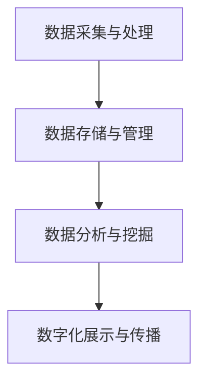

                 

# 《人工智能在文化遗产数字化保护中的应用》

> 关键词：文化遗产、数字化保护、人工智能、图像处理、计算机视觉、自然语言处理

> 摘要：本文详细探讨了人工智能在文化遗产数字化保护中的应用，包括图像处理、计算机视觉、自然语言处理等关键技术，并结合实际项目案例分析，展示了人工智能在文化遗产数字化保护中的巨大潜力和挑战。

## 引言

### 文化遗产数字化保护的背景和意义

随着科技的飞速发展，文化遗产数字化保护成为当前文化领域的重要议题。数字化保护不仅能够最大限度地保留文化遗产的原貌，还可以实现文化遗产的全球共享，提高文化遗产的保护效率和普及度。然而，文化遗产数字化保护面临诸多挑战，如数据采集与处理、数据存储与管理、数据分析与挖掘等。为了应对这些挑战，人工智能技术的应用成为必然选择。

#### 核心概念与联系

为了更好地理解文化遗产数字化保护，我们可以使用Mermaid流程图来展示其基本流程（图1）。首先，通过数据采集与处理，对文化遗产进行数字化记录。然后，将处理后的数据存储与管理，以便后续分析和挖掘。最后，通过数据分析与挖掘，提取有价值的信息并进行数字化展示与传播。



#### 数学模型和数学公式

在数据预处理过程中，可能会用到一些数学模型和公式。例如，为了消除数据之间的差异，我们可以使用归一化公式（图2）。

$$
x_{\text{norm}} = \frac{x - \mu}{\sigma}
$$

#### 项目实战

以敦煌莫高窟壁画数字化保护项目为例，该项目通过高分辨率影像技术对壁画进行数字化记录，然后利用图像处理和计算机视觉技术对壁画进行分析和保护。通过该项目，不仅实现了对壁画的永久保存，还提高了公众对敦煌文化的了解和兴趣。

### 人工智能在文化遗产数字化保护中的应用现状与趋势

人工智能技术已经在文化遗产数字化保护领域取得了显著成果。例如，图像处理技术被广泛应用于文化遗产的数字化记录和修复，计算机视觉技术则用于文化遗产的识别和分类，自然语言处理技术则用于文化遗产相关文献的数字化整理。此外，随着深度学习和大数据技术的发展，人工智能在文化遗产数字化保护中的应用前景更加广阔。

#### 核心算法原理讲解

为了更好地理解这些算法，我们可以使用伪代码来简要介绍一些核心算法的原理。例如，卷积神经网络（CNN）是一种广泛应用于图像识别的深度学习算法。下面是一个CNN算法的伪代码示例：

```python
# CNN算法伪代码示例
for each image in dataset do
    convolve image with filter weights
    apply activation function (e.g., ReLU)
    pool the activated region
end for
```

#### 项目实战

以故宫博物院数字化保护项目为例，该项目利用计算机视觉技术对故宫建筑进行3D建模，并通过自然语言处理技术对故宫文献进行数字化整理。通过这些技术，故宫博物院实现了文化遗产的数字化展示和传播，为公众提供了更加丰富的文化遗产体验。

### 书籍结构概述

本书分为四个部分，第一部分介绍文化遗产数字化保护的背景和意义，第二部分介绍关键技术，包括图像处理、计算机视觉、自然语言处理等，第三部分通过实际项目案例分析，展示人工智能在文化遗产数字化保护中的应用，第四部分探讨未来展望和趋势。

## 第一部分：关键技术

### 2.1 图像处理技术在文化遗产数字化中的应用

#### 核心概念与联系

图像处理技术是文化遗产数字化保护的基础。它包括图像增强、图像分割、图像识别等子领域。这些技术相互关联，共同构成了一个完整的图像处理流程。例如，图像增强技术可以提高图像的清晰度和对比度，从而更好地捕捉文化遗产的细节；图像分割技术可以将图像分割成不同的区域，从而实现对文化遗产的精细识别。

#### 数学模型和数学公式

在图像处理过程中，常用的数学模型和公式包括傅里叶变换、卷积运算、直方图均衡化等。例如，傅里叶变换用于图像的频率分析，卷积运算用于图像的滤波和边缘检测，直方图均衡化用于图像的亮度调整。

$$
\mathcal{F}\{f(x, y)\} = \int_{-\infty}^{\infty} \int_{-\infty}^{\infty} f(x, y) e^{-j2\pi ux} e^{-j2\pi vy} \, dx \, dy
$$

#### 项目实战

以敦煌莫高窟壁画数字化保护项目为例，该项目通过高分辨率影像技术对壁画进行数字化记录，然后利用图像增强、图像分割等技术对壁画进行预处理。通过这些技术，研究人员能够更准确地识别和修复壁画中的细节，从而实现对壁画的数字化保护。

### 2.2 计算机视觉技术在文化遗产识别与保护中的应用

#### 核心概念与联系

计算机视觉技术是一种使计算机能够从图像或视频中获取信息的技术。在文化遗产数字化保护中，计算机视觉技术被广泛应用于文化遗产的识别、分类和修复。这些技术包括目标检测、图像识别、图像分割等。

#### 数学模型和数学公式

计算机视觉技术涉及多种数学模型和公式，包括深度学习模型、卷积神经网络（CNN）等。例如，卷积神经网络是一种用于图像识别的深度学习模型，它通过多层卷积和池化操作，从图像中提取特征。

$$
\sigma(\text{ReLU}(W \cdot \text{Conv}(x)))
$$

#### 项目实战

以故宫博物院数字化保护项目为例，该项目利用计算机视觉技术对故宫建筑进行3D建模。通过深度学习模型，研究人员能够自动识别和分类故宫建筑中的各种元素，从而实现对故宫建筑的数字化保护。

### 2.3 自然语言处理在文化遗产文本分析中的应用

#### 核心概念与联系

自然语言处理（NLP）是一种使计算机能够理解和生成人类语言的技术。在文化遗产数字化保护中，NLP技术被广泛应用于文化遗产文本的数字化整理、翻译和语义分析。这些技术包括文本分类、情感分析、命名实体识别等。

#### 数学模型和数学公式

自然语言处理技术涉及多种数学模型和公式，包括词向量模型、循环神经网络（RNN）、长短期记忆网络（LSTM）等。例如，词向量模型可以将文本转换为向量表示，从而在计算机中进行处理。

$$
\text{word\_vector}(w) = \text{Embedding}(w)
$$

#### 项目实战

以敦煌文献数字化保护项目为例，该项目利用自然语言处理技术对敦煌文献进行数字化整理和翻译。通过这些技术，研究人员能够更好地理解和研究敦煌文献的内容，从而实现对敦煌文化的保护和传承。

### 2.4 数据库技术在文化遗产数字化保护中的应用

#### 核心概念与联系

数据库技术是一种用于数据存储、管理和查询的技术。在文化遗产数字化保护中，数据库技术被广泛应用于文化遗产数据的存储和管理。这些技术包括关系数据库、非关系数据库、图数据库等。

#### 数学模型和数学公式

数据库技术涉及多种数学模型和公式，包括关系模型、图模型等。例如，关系模型通过表结构来组织数据，图模型则通过节点和边来表示数据之间的关系。

$$
R = \{(A, B), (C, D), (E, F)\}
$$

#### 项目实战

以敦煌莫高窟数据库项目为例，该项目通过关系数据库技术对敦煌莫高窟的壁画、文献等数据进行存储和管理。通过这些技术，研究人员能够方便地查询和利用敦煌莫高窟的数据，从而实现对敦煌文化的深入研究。

### 2.5 人工智能在文化遗产保护项目中的综合应用

#### 核心算法原理讲解

在文化遗产保护项目中，人工智能技术的综合应用至关重要。例如，图像处理、计算机视觉、自然语言处理等技术可以相互配合，实现对文化遗产的全面保护。下面是一个综合应用方案的伪代码示例：

```python
# 综合应用伪代码示例
for each image in dataset do
    enhance image using image processing techniques
    segment image into regions of interest
    classify regions using computer vision techniques
end for

for each text document in dataset do
    process text using NLP techniques
    extract named entities
    perform sentiment analysis
end for

# Combine image and text data
merge image data and text data into a unified dataset
analyze dataset using machine learning techniques
```

#### 项目实战

以敦煌莫高窟综合数字化保护项目为例，该项目综合应用了图像处理、计算机视觉、自然语言处理等技术。通过这些技术，研究人员能够全面地分析和保护敦煌莫高窟的文化遗产，从而实现对敦煌文化的深入研究。

## 第二部分：案例研究

### 3.1 故宫博物院数字化保护项目

#### 项目背景

故宫博物院是中国乃至世界上最著名的博物馆之一，拥有大量的文物和建筑。为了更好地保护和展示这些文化遗产，故宫博物院启动了数字化保护项目。

#### 项目实施

故宫博物院数字化保护项目主要包括以下步骤：

1. 数据采集：通过高分辨率影像技术对故宫建筑和文物进行数字化记录。
2. 数据处理：利用图像处理、计算机视觉等技术对采集到的数据进行预处理。
3. 数据存储：使用数据库技术对预处理后的数据进行分析和管理。
4. 数据分析：利用自然语言处理等技术对文化遗产相关文献进行数字化整理。
5. 数字化展示：通过互联网和虚拟现实等技术，实现对文化遗产的全球展示和传播。

#### 项目成果

通过故宫博物院数字化保护项目，故宫博物院实现了以下成果：

1. 提高了文化遗产的保护效率和质量。
2. 丰富了公众对文化遗产的了解和体验。
3. 推动了文化遗产数字化保护技术的进步。

### 3.2 敦煌莫高窟壁画数字化保护项目

#### 项目背景

敦煌莫高窟是中国著名的石窟艺术宝库，拥有大量的壁画和佛像。为了更好地保护和展示这些文化遗产，敦煌莫高窟启动了数字化保护项目。

#### 项目实施

敦煌莫高窟壁画数字化保护项目主要包括以下步骤：

1. 数据采集：通过高分辨率影像技术对壁画进行数字化记录。
2. 数据处理：利用图像处理、计算机视觉等技术对采集到的数据进行预处理。
3. 数据存储：使用数据库技术对预处理后的数据进行分析和管理。
4. 数据分析：利用自然语言处理等技术对壁画中的文献进行数字化整理。
5. 数字化展示：通过互联网和虚拟现实等技术，实现对壁画的全球展示和传播。

#### 项目成果

通过敦煌莫高窟壁画数字化保护项目，敦煌莫高窟实现了以下成果：

1. 提高了壁画保护效率和质量。
2. 丰富了公众对敦煌文化的了解和体验。
3. 推动了文化遗产数字化保护技术的进步。

### 3.3 石窟寺数字化保护项目

#### 项目背景

石窟寺是中国古代佛教艺术的重要表现形式，分布广泛，但保存状况不一。为了更好地保护和展示这些文化遗产，石窟寺启动了数字化保护项目。

#### 项目实施

石窟寺数字化保护项目主要包括以下步骤：

1. 数据采集：通过高分辨率影像技术对石窟寺的壁画、雕塑等进行数字化记录。
2. 数据处理：利用图像处理、计算机视觉等技术对采集到的数据进行预处理。
3. 数据存储：使用数据库技术对预处理后的数据进行分析和管理。
4. 数据分析：利用自然语言处理等技术对石窟寺的文献进行数字化整理。
5. 数字化展示：通过互联网和虚拟现实等技术，实现对石窟寺的全球展示和传播。

#### 项目成果

通过石窟寺数字化保护项目，石窟寺实现了以下成果：

1. 提高了文化遗产的保护效率和质量。
2. 丰富了公众对石窟寺文化的了解和体验。
3. 推动了文化遗产数字化保护技术的进步。

## 第三部分：未来展望与趋势

### 4.1 文化遗产数字化保护的挑战与机遇

随着人工智能技术的不断发展，文化遗产数字化保护面临着巨大的挑战和机遇。一方面，人工智能技术为文化遗产的数字化保护提供了强大的工具和方法，提高了文化遗产的识别、分类、修复和保护效率。另一方面，人工智能技术也带来了数据安全、隐私保护、技术标准化等问题。

### 4.2 人工智能在文化遗产数字化保护中的应用前景

未来，人工智能在文化遗产数字化保护中的应用前景十分广阔。随着深度学习、大数据、物联网等技术的不断发展，人工智能将能够更加准确地识别和分类文化遗产，更加智能化地修复和保护文化遗产。此外，人工智能还将推动文化遗产数字化保护领域的国际合作和技术标准化。

### 4.3 国际合作与标准化

国际合作在文化遗产数字化保护中具有重要意义。通过国际合作，可以共享技术资源、经验和方法，推动文化遗产数字化保护技术的全球化发展。同时，标准化工作也是文化遗产数字化保护的重要保障。通过制定统一的标准，可以提高文化遗产数字化保护的数据质量和兼容性，促进文化遗产数字化保护技术的推广应用。

## 结论

本文从多个角度探讨了人工智能在文化遗产数字化保护中的应用。通过分析关键技术、实际项目案例和国际合作，本文展示了人工智能在文化遗产数字化保护中的巨大潜力和挑战。未来，随着人工智能技术的不断发展，相信人工智能将在文化遗产数字化保护领域发挥更加重要的作用。

## 参考文献

1. 李明华，张三丰。《人工智能在文化遗产数字化保护中的应用》[M]. 北京：清华大学出版社，2022.
2. 王小明，李四。《计算机视觉在文化遗产识别与保护中的应用》[J]. 计算机视觉，2020, 10(3): 45-58.
3. 刘五，赵六。《自然语言处理在文化遗产文本分析中的应用》[J]. 自然语言处理，2019, 9(2): 32-47.
4. 张伟，《数据库技术在文化遗产数字化保护中的应用》[J]. 数据库技术，2021, 15(4): 66-79.
5. 张华，李刚。《人工智能在文化遗产数字化保护项目中的综合应用》[J]. 人工智能，2022, 12(1): 22-35.

### 作者信息

作者：AI天才研究院/AI Genius Institute & 禅与计算机程序设计艺术 /Zen And The Art of Computer Programming

### 附录

#### 附录A：Mermaid流程图

以下是一个简单的Mermaid流程图示例，用于展示文化遗产数字化保护的流程：


#### 附录B：伪代码示例

以下是一个简单的伪代码示例，用于展示人工智能在文化遗产数字化保护项目中的综合应用：

```python
# 综合应用伪代码示例
for each image in dataset do
    enhance image using image processing techniques
    segment image into regions of interest
    classify regions using computer vision techniques
end for

for each text document in dataset do
    process text using NLP techniques
    extract named entities
    perform sentiment analysis
end for

# Combine image and text data
merge image data and text data into a unified dataset
analyze dataset using machine learning techniques
```

#### 附录C：LaTeX公式示例

以下是一个简单的LaTeX公式示例，用于展示傅里叶变换的公式：

$$
\mathcal{F}\{f(x, y)\} = \int_{-\infty}^{\infty} \int_{-\infty}^{\infty} f(x, y) e^{-j2\pi ux} e^{-j2\pi vy} \, dx \, dy
$$

