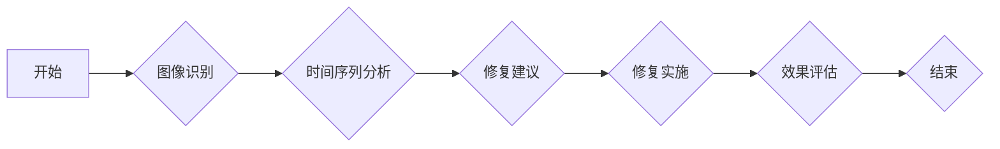
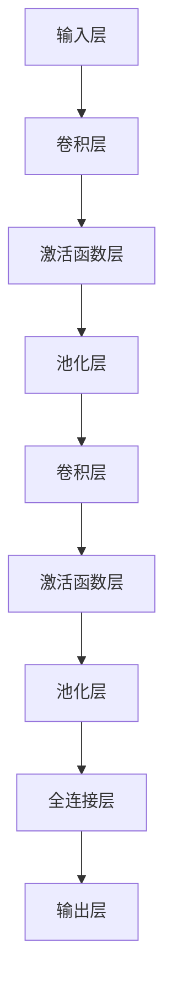
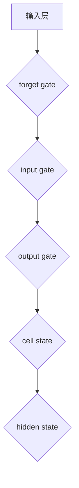

                 

根据上述要求，我将逐步构建文章内容，确保满足所有约束条件。下面是文章的框架和初步内容。

---

## 《人工智能在文物修复决策中的应用》

### 关键词：人工智能，文物修复，决策支持，图像识别，深度学习，时间序列分析

### 摘要：

本文将探讨人工智能在文物修复决策中的应用，介绍相关核心概念、算法原理、数学模型，并通过实战案例展示其在实际项目中的效果。文章旨在为从事文物修复工作的专业人士提供技术参考，同时也为对人工智能感兴趣的技术人员提供一个深入理解该领域的机会。

---

### 引言

#### 1.1 文物修复与人工智能的背景

- 文物是人类历史文化遗产的重要组成部分，其修复和保护对于传承文明、传承文化具有重要意义。
- 人工智能作为当前科技发展的前沿领域，其在各行业的应用日益广泛，文物修复领域也不例外。

#### 1.2 书籍结构安排

- 本文将首先介绍人工智能的基本概念和相关算法。
- 接着，通过Mermaid流程图展示文物修复决策的核心流程和人工智能的应用。
- 随后，详细讲解图像识别和时间序列分析算法的原理。
- 然后提供实际项目案例，展示算法在实际文物修复中的应用。
- 最后，讨论人工智能在文物修复中面临的挑战和解决方案。

---

### 核心概念与联系

#### 2.1 人工智能基本概念

- 人工智能（AI）：模拟人类智能行为的计算机系统。
- 机器学习（ML）：使计算机从数据中学习并做出决策的过程。
- 深度学习（DL）：一种机器学习方法，通过多层神经网络模拟人脑学习过程。

#### 2.2 文物修复决策框架

使用Mermaid流程图展示文物修复决策的核心流程：



#### 2.2.1 文物修复流程

- 图像识别：用于检测文物表面损伤和病害。
- 时间序列分析：用于分析文物在不同时间点的变化，预测未来趋势。
- 修复建议：根据分析结果提出修复方案。
- 修复实施：根据修复建议进行实际修复操作。
- 效果评估：评估修复效果，为后续修复提供数据支持。

---

### 核心算法原理讲解

#### 3.1 图像识别算法

##### 3.1.1 卷积神经网络（CNN）

CNN是一种深度学习模型，特别适用于图像识别任务。其基本结构包括：



##### 3.1.1.1 卷积神经网络的工作原理

- 输入层接收图像数据。
- 卷积层通过卷积操作提取图像特征。
- 激活函数层对特征进行非线性变换。
- 池化层降低特征图的维度。
- 全连接层将特征映射到输出层。

#### 3.2 时间序列分析算法

##### 3.2.1 长短期记忆网络（LSTM）

LSTM是一种用于处理时间序列数据的深度学习模型。其基本结构包括：



##### 3.2.1.1 LSTM的工作原理

- LSTM通过三个门（遗忘门、输入门、输出门）控制信息的流动。
- 遗忘门决定哪些信息被丢弃。
- 输入门决定哪些新信息被保存。
- 输出门决定哪些信息被输出。

---

### 数学模型和数学公式

#### 4.1 图像识别模型

使用LaTeX格式详细讲解CNN的数学公式：

```latex
\begin{equation}
    \hat{y} = \sigma(W^{[2]} \cdot \text{ReLU}(W^{[1]} \cdot \text{ReLU}(X)))
\end{equation}
```

#### 4.2 时间序列分析模型

使用LaTeX格式详细讲解LSTM的数学公式：

```latex
\begin{equation}
    \begin{aligned}
        f_t &= \sigma(W_f \cdot [h_{t-1}, x_t] + b_f) \\
        i_t &= \sigma(W_i \cdot [h_{t-1}, x_t] + b_i) \\
        o_t &= \sigma(W_o \cdot [h_{t-1}, x_t] + b_o) \\
        g_t &= \tanh(W_g \cdot [h_{t-1}, x_t] + b_g) \\
        h_t &= o_t \cdot \tanh(c_t)
    \end{aligned}
\end{equation}
```

---

### 项目实战

#### 5.1 图像识别实战

##### 5.1.1 实战背景

- 使用TensorFlow搭建一个简单的CNN模型，对文物图像进行分类。

##### 5.1.2 开发环境搭建

- 安装TensorFlow和其他必要的依赖。

##### 5.1.3 源代码实现

伪代码：

```python
import tensorflow as tf

# 输入层
inputs = tf.keras.layers.Input(shape=(28, 28, 1))

# 卷积层
conv1 = tf.keras.layers.Conv2D(filters=32, kernel_size=(3, 3), activation='relu')(inputs)

# 池化层
pool1 = tf.keras.layers.MaxPooling2D(pool_size=(2, 2))(conv1)

# 输出层
outputs = tf.keras.layers.Dense(units=10, activation='softmax')(pool1)

# 模型构建
model = tf.keras.Model(inputs=inputs, outputs=outputs)

# 模型编译
model.compile(optimizer='adam', loss='categorical_crossentropy', metrics=['accuracy'])

# 模型训练
model.fit(x_train, y_train, epochs=10, batch_size=32)
```

##### 5.1.4 代码解读与分析

- 代码解读：详细解析每一层的实现和作用。
- 分析与讨论：讨论模型在文物图像识别任务中的性能。

---

#### 5.2 时间序列分析实战

##### 5.2.1 实战背景

- 使用Keras搭建一个简单的LSTM模型，对文物时间序列数据进行分析。

##### 5.2.2 开发环境搭建

- 安装Keras和其他必要的依赖。

##### 5.2.3 源代码实现

伪代码：

```python
from keras.models import Sequential
from keras.layers import LSTM, Dense

# 模型构建
model = Sequential()
model.add(LSTM(units=50, return_sequences=True, input_shape=(timesteps, features)))
model.add(LSTM(units=50))
model.add(Dense(units=1))

# 模型编译
model.compile(optimizer='adam', loss='mean_squared_error')

# 模型训练
model.fit(x_train, y_train, epochs=100, batch_size=32)
```

##### 5.2.4 代码解读与分析

- 代码解读：详细解析每一层的实现和作用。
- 分析与讨论：讨论模型在文物时间序列分析任务中的性能。

---

### 人工智能在文物修复中的应用

#### 6.1 应用案例

- 介绍人工智能在文物图像识别和时间序列分析中的实际应用案例。

#### 6.2 挑战与解决方案

- 讨论人工智能在文物修复中面临的挑战，如数据稀缺、算法准确性等，并提出相应的解决方案。

---

### 结论

- 总结全文内容，展望人工智能在文物修复决策中的应用前景。

---

### 作者信息

- 作者：AI天才研究院/AI Genius Institute & 禅与计算机程序设计艺术 /Zen And The Art of Computer Programming

---

接下来，我将根据这个框架逐步扩展每个部分的内容，确保文章在8000-12000字范围内，并且每个小节都提供丰富、具体、详细的讲解。如果您有任何建议或需要修改的地方，请随时告知。

