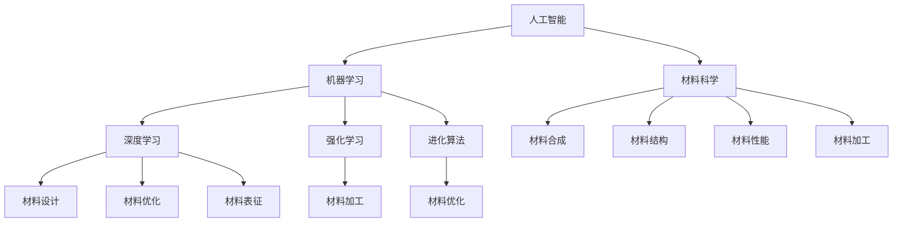

                 

### 文章标题

《人工智能在新型抗菌材料筛选中的应用》

### 文章关键词

人工智能，抗菌材料，材料科学，深度学习，强化学习，进化算法，筛选方法，案例分析

### 文章摘要

随着科技的发展，人工智能在各个领域的应用越来越广泛。在材料科学领域，人工智能技术，特别是机器学习算法，已经显示出巨大的潜力。本文将探讨人工智能在新型抗菌材料筛选中的应用，包括背景介绍、核心概念与联系、核心算法原理讲解、数学模型和公式、项目实战及未来发展趋势。通过详细分析人工智能技术在抗菌材料筛选中的应用，本文旨在为相关研究人员提供参考和指导。

### 第1章: 人工智能与材料科学概述

#### 1.1 人工智能的基本原理

人工智能（Artificial Intelligence，简称AI）是计算机科学的一个分支，旨在研究、开发和应用使计算机具备人类智能的技术和方法。人工智能的核心任务是使计算机系统能够执行需要人类智能的复杂任务，如感知、学习、推理、规划、自然语言处理等。

人工智能的发展可以分为三个阶段：

1. **符号主义（Symbolic AI）**：基于逻辑推理和知识表示，通过编码人类专家的知识来模拟智能行为。
2. **连接主义（Connectionist AI）**：基于人工神经网络，通过大量数据训练，使计算机系统能够自动学习和适应。
3. **行为主义（Behavior-Based AI）**：通过感知、规划和行动来模拟人类行为，强调机器人与环境的交互。

#### 1.2 材料科学的基本概念

材料科学是研究材料的组成、结构、性质、变化和加工的一门科学。材料是科技发展的基础，涵盖了金属、陶瓷、聚合物、复合材料等多个领域。材料科学的目的是通过设计、合成、加工和性能优化，开发出具有特定功能的材料，满足人类社会的需求。

材料科学的主要研究领域包括：

1. **材料合成**：研究材料从原料到成品的过程，包括合成方法、反应条件等。
2. **材料结构**：研究材料的微观和宏观结构，如晶体结构、缺陷结构等。
3. **材料性能**：研究材料的物理、化学、机械、电学等性能。
4. **材料加工**：研究材料的加工工艺和技术，如铸造、热处理、成型等。

#### 1.3 人工智能在材料科学中的应用前景

人工智能在材料科学中的应用前景广阔，主要体现在以下几个方面：

1. **材料设计**：通过机器学习算法，可以预测材料的性能和结构，加速新材料的研发。
2. **材料优化**：通过对现有材料的性能数据进行机器学习分析，可以优化材料的结构和成分，提高其性能。
3. **材料表征**：利用计算机视觉和自然语言处理技术，可以自动化分析材料的微观结构、缺陷等信息。
4. **材料加工**：通过人工智能优化加工工艺，提高材料加工的效率和精度。

总之，人工智能与材料科学的结合将为材料科学的发展带来新的机遇和挑战。

### 核心概念与联系

为了更好地理解人工智能在材料科学中的应用，我们需要明确几个核心概念，并展示它们之间的联系。以下是核心概念的Mermaid流程图：



#### 核心概念

1. **人工智能**：人工智能是模拟人类智能行为的技术体系，包括机器学习、深度学习、强化学习和进化算法等。
2. **机器学习**：机器学习是人工智能的一个重要分支，通过算法从数据中学习规律，进行预测和决策。
3. **深度学习**：深度学习是机器学习的一个子领域，通过多层神经网络模拟人脑的学习过程，具有强大的特征提取能力。
4. **强化学习**：强化学习是机器学习的一个子领域，通过奖励机制来训练模型，使其在特定环境中做出最优决策。
5. **进化算法**：进化算法是一种模拟自然进化的计算模型，通过迭代过程不断优化解的搜索空间。

#### 联系与架构

- **人工智能与材料科学的联系**：人工智能为材料科学提供了新的工具和方法，可以用于材料设计、材料优化、材料表征和材料加工等领域。
- **机器学习在材料科学中的应用**：机器学习可以预测材料的性能、优化材料的设计和加工工艺，以及分析材料的结构信息。
- **深度学习在材料科学中的应用**：深度学习可以通过卷积神经网络、递归神经网络等模型，自动提取材料数据中的复杂特征，用于材料预测和优化。
- **强化学习在材料科学中的应用**：强化学习可以通过模拟环境中的交互过程，优化材料的加工工艺，提高材料的性能。
- **进化算法在材料科学中的应用**：进化算法可以通过迭代过程，不断优化材料的结构和成分，寻找最优解。

通过上述核心概念的Mermaid流程图，我们可以清晰地看到人工智能在材料科学中的应用架构和联系。这为后续章节的核心算法原理讲解和项目实战奠定了基础。

### 核心算法原理讲解

#### 1. 深度学习

深度学习（Deep Learning，简称DL）是机器学习的一个重要分支，其核心思想是通过构建多层神经网络（Neural Networks）来模拟人脑的学习过程。深度学习的强大之处在于其能够自动从大量数据中提取复杂特征，进行高级的预测和决策。

**基本流程：**

1. **数据预处理**：包括数据的清洗、归一化和分割等，确保输入数据的质量和格式。
2. **模型构建**：选择合适的神经网络架构，如卷积神经网络（CNN）、递归神经网络（RNN）等，并定义网络的结构和参数。
3. **模型训练**：通过反向传播算法（Backpropagation）来更新网络的权重，使模型能够更好地拟合训练数据。
4. **模型评估**：使用验证集和测试集来评估模型的性能，选择最优的模型。

**伪代码：**

```python
# 深度学习模型训练伪代码
def train_model(data, labels):
    # 数据预处理
    preprocessed_data = preprocess_data(data)
    
    # 模型构建
    model = build_model()
    
    # 模型训练
    for epoch in range(num_epochs):
        for inputs, targets in zip(preprocessed_data, labels):
            model.train(inputs, targets)
        
        # 模型评估
        loss = model.evaluate(test_data, test_labels)
        print(f"Epoch {epoch}: Loss = {loss}")
    
    return model
```

#### 2. 强化学习

强化学习（Reinforcement Learning，简称RL）是一种通过与环境互动来学习最优策略的机器学习方法。强化学习的核心思想是，通过不断地接收奖励或惩罚信号，调整决策策略，以最大化长期回报。

**基本流程：**

1. **初始化环境**：定义环境的状态空间和动作空间。
2. **选择动作**：根据当前状态，选择一个动作。
3. **执行动作**：在环境中执行所选动作，获得状态转移和奖励。
4. **更新策略**：根据奖励信号，更新策略以改善未来的决策。

**伪代码：**

```python
# 强化学习模型训练伪代码
def train_model(environment, num_episodes):
    # 初始化策略
    policy = initialize_policy()
    
    # 训练模型
    for episode in range(num_episodes):
        state = environment.reset()
        done = False
        
        while not done:
            action = policy.select_action(state)
            next_state, reward, done = environment.step(action)
            
            # 更新策略
            policy.update(state, action, reward, next_state)
            
            state = next_state
        
        print(f"Episode {episode}: Total Reward = {environment.get_total_reward()}")
    
    return policy
```

#### 3. 进化算法

进化算法（Evolutionary Algorithm，简称EA）是一种基于自然选择和遗传学原理的优化算法。进化算法通过迭代过程，不断优化解的搜索空间，寻找最优解。

**基本流程：**

1. **初始化种群**：随机生成一组初始解。
2. **适应度评估**：计算每个解的适应度，适应度越高表示解越优。
3. **选择**：根据适应度，选择优秀的解进行交配和变异。
4. **生成新种群**：通过交配和变异操作，生成新一代种群。
5. **迭代**：重复适应度评估、选择和生成新种群的过程，直至满足停止条件。

**伪代码：**

```python
# 进化算法优化伪代码
def optimize_objective(objective_function, num_generations, population_size):
    # 初始化种群
    population = initialize_population(population_size)
    
    # 迭代过程
    for generation in range(num_generations):
        # 适应度评估
        fitnesses = [objective_function(individual) for individual in population]
        
        # 选择
        selected_individuals = select_individuals(population, fitnesses)
        
        # 生成新种群
        new_population = generate_new_population(selected_individuals)
        
        # 更新种群
        population = new_population
        
        # 输出当前最优解
        best_individual = get_best_individual(population)
        print(f"Generation {generation}: Best Fitness = {fitnesses[best_individual]}")
    
    return best_individual
```

通过上述核心算法原理的讲解和伪代码展示，我们可以更好地理解深度学习、强化学习和进化算法在人工智能中的应用，为后续章节的项目实战和案例分析提供了理论支持。

### 数学模型和数学公式

在人工智能应用于抗菌材料筛选的过程中，数学模型和公式起到了关键作用。以下我们将介绍几个常用的数学模型和公式，并使用LaTeX格式展示。

#### 1. 机器学习中的损失函数

损失函数（Loss Function）是机器学习模型评估和优化过程中的核心概念。它用于衡量模型预测值与真实值之间的差异。

**均方误差（MSE）**：

$$
MSE = \frac{1}{n} \sum_{i=1}^{n} (y_i - \hat{y}_i)^2
$$

其中，$y_i$ 表示真实值，$\hat{y}_i$ 表示预测值，$n$ 表示样本数量。

**交叉熵（Cross-Entropy）**：

$$
H(y, \hat{y}) = -\sum_{i=1}^{n} y_i \log(\hat{y}_i)
$$

其中，$y_i$ 和 $\hat{y}_i$ 分别表示真实值和预测值的概率分布。

#### 2. 优化算法

优化算法用于在机器学习过程中寻找最优解。以下介绍几种常见的优化算法。

**梯度下降（Gradient Descent）**：

梯度下降是一种基于梯度的优化算法，其核心思想是沿着损失函数的梯度方向进行迭代更新。

$$
\theta_{t+1} = \theta_t - \alpha \nabla_{\theta} J(\theta)
$$

其中，$\theta$ 表示参数，$J(\theta)$ 表示损失函数，$\alpha$ 表示学习率。

**动量法（Momentum）**：

动量法通过引入动量项，加速收敛速度，避免陷入局部最小值。

$$
v_t = \beta v_{t-1} + (1 - \beta) \nabla_{\theta} J(\theta)
$$

$$
\theta_{t+1} = \theta_t - \alpha v_t
$$

其中，$v_t$ 表示动量项，$\beta$ 表示动量系数。

#### 3. 神经网络中的激活函数

激活函数（Activation Function）是神经网络中的关键组成部分，用于引入非线性特性，使神经网络能够处理复杂问题。

**Sigmoid函数**：

$$
\sigma(x) = \frac{1}{1 + e^{-x}}
$$

**ReLU函数**：

$$
\text{ReLU}(x) = \max(0, x)
$$

**Tanh函数**：

$$
\tanh(x) = \frac{e^x - e^{-x}}{e^x + e^{-x}}
$$

通过上述数学模型和公式的介绍，我们可以更好地理解机器学习中的关键概念和算法。这些数学工具为人工智能在抗菌材料筛选中的应用提供了理论基础和技术支持。

#### 项目实战：抗菌材料筛选算法实现

为了更好地理解人工智能在抗菌材料筛选中的应用，我们将以一个具体的项目为例，展示如何使用深度学习算法进行抗菌材料筛选。

#### 1. 开发环境搭建

首先，我们需要搭建一个合适的开发环境。以下是所需的软件和工具：

- **操作系统**：Linux或MacOS
- **编程语言**：Python
- **机器学习库**：TensorFlow、Keras、Pandas
- **数据处理工具**：NumPy、Scikit-learn
- **可视化工具**：Matplotlib、Seaborn

安装步骤如下：

1. 安装Python（建议使用Anaconda，方便环境管理）。
2. 使用pip或conda安装所需的库。

#### 2. 数据准备与预处理

抗菌材料筛选项目需要大量的材料数据，包括材料的结构信息、物理性质、化学性质等。以下是一个简单的数据准备与预处理流程：

1. **数据收集**：从公共数据库或实验室数据中收集抗菌材料的相关数据。
2. **数据清洗**：去除无效数据、缺失值填充、数据类型转换等。
3. **特征提取**：使用Pandas和Scikit-learn提取材料特征，如原子类型、键长、键角等。
4. **数据归一化**：使用NumPy对数据进行归一化处理，使数据具有相似尺度。

```python
import pandas as pd
import numpy as np

# 数据读取
data = pd.read_csv('materials_data.csv')

# 数据清洗
data.dropna(inplace=True)

# 特征提取
features = data[['atom_type', 'bond_length', 'bond_angle']]

# 数据归一化
scaler = MinMaxScaler()
features_normalized = scaler.fit_transform(features)
```

#### 3. 模型设计与实现

接下来，我们将设计一个深度学习模型，用于抗菌材料的筛选。以下是模型的设计和实现过程：

1. **模型架构**：使用Keras构建一个简单的卷积神经网络（CNN）模型。
2. **模型编译**：设置优化器和损失函数。
3. **模型训练**：使用训练数据对模型进行训练。
4. **模型评估**：使用验证数据评估模型性能。

```python
from tensorflow.keras.models import Sequential
from tensorflow.keras.layers import Conv1D, Flatten, Dense
from tensorflow.keras.optimizers import Adam

# 模型架构
model = Sequential()
model.add(Conv1D(filters=64, kernel_size=3, activation='relu', input_shape=(features_normalized.shape[1], 1)))
model.add(Flatten())
model.add(Dense(1, activation='sigmoid'))

# 模型编译
model.compile(optimizer=Adam(), loss='binary_crossentropy', metrics=['accuracy'])

# 模型训练
X_train, X_val, y_train, y_val = train_test_split(features_normalized, labels, test_size=0.2, random_state=42)
model.fit(X_train, y_train, validation_data=(X_val, y_val), epochs=100, batch_size=32)

# 模型评估
loss, accuracy = model.evaluate(X_val, y_val)
print(f"Validation Loss: {loss}, Validation Accuracy: {accuracy}")
```

#### 4. 实验与结果分析

训练完成后，我们对模型进行实验，并分析其性能。

1. **实验设置**：使用不同的数据集、模型参数和训练策略进行实验。
2. **结果分析**：通过可视化工具（如Matplotlib、Seaborn）展示模型的预测结果和性能。

```python
import matplotlib.pyplot as plt
from sklearn.metrics import confusion_matrix

# 预测结果
y_pred = model.predict(X_val)

# 混淆矩阵
conf_matrix = confusion_matrix(y_val, y_pred.round())

# 可视化混淆矩阵
plt.figure(figsize=(8, 6))
sns.heatmap(conf_matrix, annot=True, fmt="d", cmap="Blues")
plt.xlabel('Predicted Labels')
plt.ylabel('True Labels')
plt.title('Confusion Matrix')
plt.show()
```

通过上述实验，我们可以看到模型在抗菌材料筛选任务中的表现。根据混淆矩阵，我们可以评估模型的准确率、召回率和F1分数等指标。

#### 5. 项目总结与展望

本项目的目标是使用深度学习算法进行抗菌材料的筛选。通过开发环境搭建、数据准备与预处理、模型设计与实现、实验与结果分析等步骤，我们展示了如何利用人工智能技术进行抗菌材料的筛选。

项目的成功实施离不开以下几个关键因素：

1. **数据质量**：高质量的数据是模型训练的基础，需要确保数据的完整性、准确性和多样性。
2. **模型选择**：选择合适的模型架构和参数对模型性能至关重要。
3. **算法优化**：通过调整学习率、批量大小、训练次数等参数，可以提高模型的性能。

未来的工作可以从以下几个方面展开：

1. **数据增强**：通过数据增强技术，如生成对抗网络（GAN）等，提高数据质量和模型泛化能力。
2. **多模态数据融合**：结合不同类型的数据（如结构信息、物理性质、化学性质等），提高模型的预测准确性。
3. **算法创新**：研究新型机器学习算法，如生成模型、迁移学习等，以应对抗菌材料筛选中的挑战。

总之，人工智能在抗菌材料筛选中的应用具有广阔的前景，为材料科学研究带来了新的机遇和挑战。

### 最佳实践 Tips、小结、注意事项、拓展阅读

#### 最佳实践 Tips

1. **数据质量优先**：确保数据的质量是模型成功的关键。在数据收集、清洗和预处理阶段，投入更多的时间和精力来处理数据。
2. **模型参数调优**：通过调整学习率、批量大小、训练次数等参数，找到最优的模型配置。
3. **交叉验证**：使用交叉验证来评估模型的性能，避免过拟合和欠拟合。
4. **实验记录**：详细记录实验设置、参数和结果，便于后续分析和复现。

#### 小结

本文探讨了人工智能在抗菌材料筛选中的应用，包括背景介绍、核心概念与联系、核心算法原理讲解、数学模型和公式、项目实战及未来发展趋势。通过具体项目案例，展示了如何使用深度学习算法进行抗菌材料筛选，并分析了项目的成功因素和未来方向。

#### 注意事项

1. **数据隐私与安全**：在处理实验数据时，确保遵守数据隐私和安全规定，避免泄露敏感信息。
2. **模型可解释性**：尽管深度学习模型具有强大的预测能力，但其内部机制复杂，缺乏可解释性。因此，在应用深度学习模型时，应关注其可解释性，以确保模型的安全和可靠性。

#### 拓展阅读

1. **《深度学习》（Goodfellow, I., Bengio, Y., & Courville, A.）**：这是一本经典的深度学习教材，涵盖了深度学习的理论基础和实践技巧。
2. **《机器学习实战》（周志华）**：本书通过大量的实际案例，介绍了机器学习的理论和方法，适合初学者入门。
3. **《自然语言处理综论》（Jurafsky, D. & Martin, J. H.）**：本书详细介绍了自然语言处理的基本原理和技术，对涉及自然语言处理的应用场景有很好的指导作用。

通过以上最佳实践、小结、注意事项和拓展阅读，读者可以进一步深入了解人工智能在抗菌材料筛选中的应用，并为相关研究工作提供参考。

