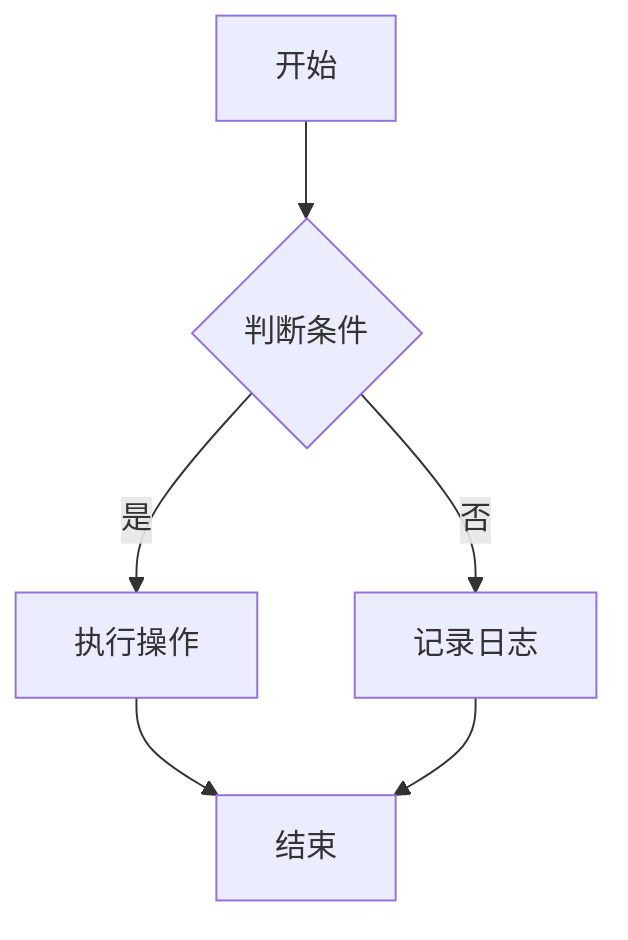

                 

### 文章标题

《人工智能在新材料发现中的加速作用》

### 关键词

人工智能，新材料，加速作用，算法应用，挑战与前景，案例与实战

### 摘要

本文将深入探讨人工智能（AI）在新材料发现过程中的重要作用。随着科技的快速发展，人工智能技术已经成为推动新材料领域创新的关键力量。本文首先介绍了新材料发现的传统方法及其局限性，随后详细阐述了人工智能技术如何通过机器学习、深度学习等算法加速新材料的发现过程。此外，文章还分析了人工智能在新材料发现中面临的挑战，并提出了相应的解决方案。通过实际案例的剖析，本文展示了人工智能在实际新材料开发中的应用效果。最后，文章对人工智能在新材料发现领域的未来发展进行了展望，为读者提供了有价值的参考。

### 引言与背景介绍

#### 引言：人工智能在新材料发现中的角色与重要性

新材料是人类社会进步的重要驱动力。自古以来，人类通过不断发现和开发新材料，推动了工业革命、信息技术革命以及医疗科技的进步。然而，随着现代科技的发展，传统材料在性能、功能等方面已经难以满足日益增长的需求。因此，新材料的研究和开发成为了科研人员关注的焦点。

在新材料发现的过程中，人工智能（AI）技术的引入无疑为这一领域带来了革命性的变化。AI不仅能够处理海量数据，还能够从数据中挖掘出潜在的规律和模式，从而加速新材料的发现过程。从传统的材料设计方法到现代的计算材料科学，AI的应用已经大大提高了材料开发的效率，减少了研发成本。

#### 人工智能加速新材料发现的必要性

新材料发现的复杂性在于其涉及众多因素，包括材料的结构、组成、性能等。传统的新材料发现方法主要依赖于实验和经验，这种方法耗时较长，且具有较大的不确定性。此外，随着新材料种类和数量的增加，传统方法已无法应对日益增长的研究需求。

人工智能的引入，尤其是机器学习和深度学习算法，为新材料发现提供了新的思路和方法。通过机器学习算法，我们可以从大量的实验数据和文献中提取出有用的信息，预测新材料的性能，从而指导实验方向。深度学习算法则可以处理更复杂的数据，挖掘出更深层次的规律，从而发现新的材料结构。

#### 本书内容结构

本书旨在系统地介绍人工智能在新材料发现中的应用，分为五个部分：

1. **引言与背景介绍**：介绍新材料发现的传统方法及其局限性，以及人工智能加速新材料发现的必要性。
   
2. **核心概念与原理**：讲解人工智能的基础概念，包括机器学习、深度学习和强化学习等，以及新材料的基本概念和原理。

3. **算法与应用**：详细介绍机器学习、深度学习和数据挖掘算法在新材料发现中的应用，以及相关的技术细节。

4. **挑战与前景**：分析人工智能在新材料发现中面临的挑战，包括数据质量、算法可靠性、安全性等问题，并探讨未来的发展方向。

5. **案例与实战**：通过实际案例，展示人工智能在新材料开发中的应用效果，提供实战经验和启示。

### AI基础概念

#### 1. 机器学习

机器学习（Machine Learning，ML）是一种使计算机系统能够从数据中学习并做出决策的技术。它通过构建模型来分析数据，并从中提取规律和模式。机器学习的基本流程包括数据收集、数据预处理、模型训练、模型评估和模型部署。

在机器学习中，常见的模型有回归模型、分类模型和聚类模型。回归模型用于预测数值型数据，如房价、股票价格等。分类模型用于将数据分为不同的类别，如邮件分类、垃圾邮件过滤等。聚类模型用于将数据分为不同的群组，如顾客细分、市场细分等。

机器学习算法可以分为监督学习、无监督学习和强化学习。监督学习（Supervised Learning）有标记的数据集，算法通过学习这些数据来预测新的数据。无监督学习（Unsupervised Learning）没有标记的数据集，算法通过发现数据中的内在结构来进行分类。强化学习（Reinforcement Learning）通过与环境交互来学习最优策略。

#### 2. 深度学习

深度学习（Deep Learning，DL）是机器学习的一个重要分支，它使用了多层神经网络来模拟人脑的学习过程。深度学习通过逐层提取数据中的特征，从而实现更复杂的任务。

深度学习模型的核心是神经元（Neuron），神经元之间通过权重（Weight）连接。在训练过程中，模型通过反向传播算法来调整权重，从而最小化预测误差。

常见的深度学习模型有卷积神经网络（CNN）、循环神经网络（RNN）和生成对抗网络（GAN）。CNN常用于图像处理任务，如图像分类、目标检测等。RNN适合处理序列数据，如语言模型、语音识别等。GAN用于生成数据，如图像生成、文本生成等。

#### 3. 强化学习

强化学习（Reinforcement Learning，RL）是一种通过试错来学习最优策略的机器学习技术。强化学习中的智能体（Agent）通过与环境（Environment）交互来获取反馈，并通过策略（Policy）来选择行动（Action）。智能体的目标是最大化累积奖励（Reward）。

强化学习的基本流程包括状态（State）评估、策略优化和奖励函数设计。常见的强化学习算法有Q学习（Q-Learning）、SARSA（State-Action-Reward-State-Action，SARSA）和DQN（Deep Q-Network，DQN）等。

### 新材料基础概念

#### 1. 新材料的特点与分类

新材料（New Materials）是指具有传统材料无法比拟的物理、化学和生物性能的材料。它们通常具有高可靠性、高效率、多功能性等特点。

新材料的分类可以从不同的角度进行，如按结构分类、按性能分类、按制备方法分类等。

按结构分类，新材料可以分为晶体材料、非晶体材料、复合材料等。

按性能分类，新材料可以分为高性能结构材料、功能材料、生物医用材料等。

按制备方法分类，新材料可以分为传统制备方法（如熔融、烧结等）和新型制备方法（如纳米制备、激光制备等）。

#### 2. 新材料发现的传统方法

新材料发现的传统方法主要包括实验发现、理论预测和组合设计。

实验发现是通过实验手段不断尝试和改进来发现新材料。这种方法具有直观性和可靠性，但耗时长、成本高、效率低。

理论预测是通过计算材料科学的理论模型来预测新材料的性能。这种方法具有高效性和低成本，但受限于模型的精确度和计算资源的限制。

组合设计是通过组合不同的材料组分和结构来设计新材料。这种方法具有较高的灵活性和多样性，但需要大量的实验验证和优化。

#### 3. 新材料的应用领域

新材料的应用领域广泛，包括但不限于：

- 高性能结构材料：如航空航天材料、汽车材料、建筑结构材料等。
- 功能材料：如电子材料、光电材料、生物医学材料等。
- 生物医用材料：如人工器官、药物载体、组织工程材料等。
- 环境材料：如吸附材料、催化剂材料、环保材料等。

### AI与新材料的结合原理

#### 1. AI技术在新材料设计中的应用

AI技术在新材料设计中的应用主要体现在以下几个方面：

- **性能预测**：通过机器学习和深度学习算法，从大量的实验数据和文献中提取出材料的性能规律，从而预测新材料在不同条件下的性能。

- **结构优化**：通过优化算法，如遗传算法、粒子群算法等，对材料的结构进行优化，以提高其性能。

- **制备过程优化**：通过深度学习算法，对材料的制备过程进行优化，以提高制备效率和减少成本。

- **多功能材料设计**：通过组合不同的材料组分和结构，设计出具有多种功能的复合材料。

#### 2. 新材料性能预测的AI算法

新材料性能预测的AI算法主要包括：

- **机器学习算法**：如线性回归、支持向量机、随机森林等。

- **深度学习算法**：如卷积神经网络、循环神经网络、生成对抗网络等。

- **混合算法**：将机器学习和深度学习算法结合起来，以提高预测精度。

#### 3. 数据驱动的材料优化方法

数据驱动的材料优化方法主要包括：

- **数据收集与处理**：通过实验和计算模拟等方法收集大量材料数据，并对数据进行处理和清洗。

- **特征提取**：从材料数据中提取出有用的特征，如材料的结构、组成、性能等。

- **模型训练与优化**：利用机器学习和深度学习算法，对材料数据进行训练和优化，以建立性能预测模型。

- **性能优化**：利用预测模型，对材料的结构进行优化，以提高其性能。

### AI在新材料合成中的应用

#### 1. AI算法在材料合成中的应用

AI算法在材料合成中的应用主要体现在以下几个方面：

- **合成路径预测**：通过机器学习和深度学习算法，预测材料合成的最佳路径和条件。

- **反应条件优化**：通过优化算法，对材料的合成条件进行优化，以提高合成效率和产量。

- **合成过程自动化**：通过自动化控制系统，实现材料合成的自动化和智能化。

- **缺陷检测与修复**：通过计算机视觉和图像处理算法，对材料合成过程中的缺陷进行检测和修复。

#### 2. 合成过程的自动化与优化

合成过程的自动化与优化是AI在新材料合成中的重要应用之一。具体方法包括：

- **机器人与自动化设备的应用**：通过机器人、自动化设备等，实现材料合成过程的自动化。

- **实时监测与控制**：通过传感器、监测系统等，实时监测合成过程，并实时调整合成条件。

- **优化算法的应用**：通过优化算法，如遗传算法、粒子群算法等，对合成过程进行优化。

#### 3. AI在材料合成中的挑战与解决方案

AI在材料合成中面临着一系列挑战，包括：

- **数据质量与数据隐私**：材料合成过程中产生的数据质量参差不齐，且涉及大量的敏感信息，如何保证数据质量、保护数据隐私是重要的挑战。

- **算法可靠性**：AI算法在预测和优化中的可靠性问题，如何提高算法的可靠性和稳定性是关键。

- **计算资源**：深度学习算法通常需要大量的计算资源，如何高效地利用计算资源是重要的挑战。

解决方案包括：

- **数据预处理与清洗**：通过数据预处理和清洗技术，提高数据质量。

- **算法优化与改进**：通过算法优化和改进，提高算法的可靠性和稳定性。

- **云计算与分布式计算**：通过云计算和分布式计算技术，高效地利用计算资源。

### 机器学习算法在新材料中的应用

#### 1. 常见的机器学习算法

在机器学习算法中，常见的算法包括线性回归、支持向量机、随机森林等。这些算法在新材料研究中得到了广泛应用。

- **线性回归**：线性回归是一种简单的机器学习算法，用于预测连续值。它可以用于预测材料的性能，如硬度、密度、导电性等。

- **支持向量机**：支持向量机是一种分类算法，用于将数据分为不同的类别。它可以用于预测材料的类别，如金属、陶瓷、聚合物等。

- **随机森林**：随机森林是一种集成学习算法，由多个决策树组成。它可以用于预测材料的性能和类别，具有较强的泛化能力。

#### 2. 机器学习算法在新材料性能预测中的应用

机器学习算法在新材料性能预测中的应用主要包括以下几个方面：

- **性能预测**：通过训练机器学习模型，从大量的实验数据中提取出材料的性能规律，从而预测新材料在不同条件下的性能。

- **实验优化**：通过性能预测模型，优化材料的实验条件，提高实验效率和准确性。

- **设计优化**：通过性能预测模型，设计出具有预期性能的新材料。

#### 3. 实际案例与应用分析

在实际应用中，机器学习算法在新材料性能预测中取得了显著的效果。

- **案例一：陶瓷材料性能预测**：研究人员使用线性回归和支持向量机算法，对陶瓷材料的硬度、密度等性能进行了预测。实验结果表明，这些算法能够有效地预测陶瓷材料的性能，为实验设计和材料优化提供了重要的参考。

- **案例二：聚合物材料性能预测**：研究人员使用随机森林算法，对聚合物材料的导电性、透明度等性能进行了预测。实验结果表明，随机森林算法具有较好的预测精度和泛化能力，为聚合物材料的性能优化提供了重要的工具。

### 深度学习算法在新材料中的应用

#### 1. 深度学习的基本原理

深度学习（Deep Learning，DL）是一种模拟人脑神经网络结构和功能的计算模型。它通过多层次的神经网络来学习和提取数据中的特征，从而实现复杂的任务。

深度学习的基本原理包括：

- **神经网络**：神经网络是由多个神经元组成的计算模型。每个神经元接收多个输入信号，通过加权求和产生一个输出信号。

- **激活函数**：激活函数用于引入非线性因素，使神经网络具有表达能力。

- **反向传播**：反向传播（Backpropagation）是一种用于训练神经网络的算法。它通过计算误差梯度来更新网络中的权重和偏置。

- **优化算法**：优化算法用于调整网络中的参数，以最小化预测误差。常见的优化算法有梯度下降、动量优化、Adam优化等。

#### 2. 深度学习算法在新材料设计中的使用

深度学习算法在新材料设计中的应用主要体现在以下几个方面：

- **材料结构预测**：通过训练深度学习模型，预测新材料的三维结构。例如，生成对抗网络（GAN）可以用于生成新型材料结构。

- **性能预测**：通过训练深度学习模型，预测新材料在不同条件下的性能。例如，卷积神经网络（CNN）可以用于预测材料的导电性、硬度等性能。

- **材料优化**：通过训练深度学习模型，优化新材料的设计。例如，循环神经网络（RNN）可以用于优化材料的制备过程。

#### 3. 深度学习在材料性能优化中的应用

深度学习在材料性能优化中的应用主要体现在以下几个方面：

- **实验优化**：通过训练深度学习模型，优化实验条件，提高实验效率和准确性。例如，卷积神经网络（CNN）可以用于优化材料的合成条件。

- **工艺优化**：通过训练深度学习模型，优化材料的制备工艺，提高材料性能。例如，生成对抗网络（GAN）可以用于优化材料的制备过程。

### 数据分析与挖掘在新材料中的应用

#### 1. 数据分析的基本方法

数据分析（Data Analysis）是一种从大量数据中提取有价值信息的方法。它包括以下几个基本方法：

- **描述性分析**：描述性分析用于描述数据的总体特征和趋势。它包括数据汇总、图表展示等。

- **探索性分析**：探索性分析用于发现数据中的潜在规律和模式。它包括相关性分析、聚类分析等。

- **预测性分析**：预测性分析用于预测未来的趋势和变化。它包括回归分析、时间序列分析等。

#### 2. 数据挖掘在材料研究中的应用

数据挖掘（Data Mining）是一种从大量数据中提取知识的方法。它在新材料研究中具有重要的应用价值，主要体现在以下几个方面：

- **材料性能预测**：通过数据挖掘技术，从大量的实验数据中提取出材料的性能规律，从而预测新材料在不同条件下的性能。

- **材料结构分析**：通过数据挖掘技术，分析材料的三维结构，发现材料中的潜在缺陷和异常。

- **材料制备优化**：通过数据挖掘技术，优化材料的制备工艺，提高材料性能。

#### 3. 大数据分析在材料科学中的挑战与机遇

大数据分析（Big Data Analysis）在材料科学中面临着一系列挑战和机遇。

- **挑战**：

  - 数据质量：材料科学中产生的数据质量参差不齐，如何保证数据质量是重要的挑战。

  - 数据隐私：材料科学中涉及大量的敏感信息，如何保护数据隐私是重要的挑战。

  - 计算资源：大数据分析通常需要大量的计算资源，如何高效地利用计算资源是重要的挑战。

- **机遇**：

  - 高效材料设计：通过大数据分析，可以高效地设计出高性能的新材料。

  - 智能材料制备：通过大数据分析，可以智能地优化材料的制备过程。

  - 新材料发现：通过大数据分析，可以发现新的材料结构和新材料。

### 新材料发现的挑战

#### 1. 数据质量与数据隐私

在新材料发现过程中，数据质量是至关重要的。高质量的数据能够提供准确的性能预测和结构分析，从而指导实验设计和材料优化。然而，数据质量往往受到多种因素的影响，如数据采集方法、实验条件等。此外，新材料研究过程中涉及大量的敏感信息，如材料的制备工艺、性能数据等，如何保护数据隐私是一个重要的挑战。

#### 2. 算法可靠性

算法的可靠性是新材料发现的关键因素。在实际应用中，算法的预测结果可能受到数据分布、模型参数等因素的影响，从而产生误差。如何提高算法的可靠性，确保预测结果的准确性，是新材料发现中面临的重要问题。

#### 3. 安全性

在新材料发现过程中，安全性也是一个重要的问题。材料的合成和制备过程中可能涉及到危险的化学物质和复杂的工艺流程，如何确保实验过程的安全性，防止事故发生，是新材料发现中需要关注的问题。

#### 4. 算法泛化能力

算法的泛化能力是指算法在不同数据集上的表现。在新材料发现中，算法需要能够处理多种类型的材料数据和实验条件，从而预测新材料在不同条件下的性能。如何提高算法的泛化能力，使其能够适应不同的应用场景，是一个重要的挑战。

### AI在新材料发现中的作用与局限

#### 1. 人工智能在新材料发现中的作用

人工智能（AI）在新材料发现中发挥了重要作用，主要体现在以下几个方面：

- **性能预测**：通过机器学习和深度学习算法，从大量的实验数据中提取出材料的性能规律，从而预测新材料在不同条件下的性能。

- **结构优化**：通过优化算法，对材料的结构进行优化，以提高其性能。

- **制备过程优化**：通过深度学习算法，对材料的制备过程进行优化，以提高制备效率和减少成本。

- **多功能材料设计**：通过组合不同的材料组分和结构，设计出具有多种功能的复合材料。

#### 2. 人工智能在新材料发现中的局限

尽管人工智能在新材料发现中发挥了重要作用，但它也面临着一系列局限：

- **数据依赖性**：人工智能的预测和优化依赖于大量的实验数据和文献数据，如何获取和利用高质量的数据是重要的挑战。

- **算法复杂性**：深度学习算法通常具有复杂的结构和参数，如何有效地训练和优化这些算法是一个挑战。

- **算法可靠性**：人工智能算法的预测结果可能受到数据分布、模型参数等因素的影响，从而产生误差。

- **计算资源**：深度学习算法通常需要大量的计算资源，如何高效地利用计算资源是一个重要的挑战。

#### 3. 解决方案与未来展望

为了克服人工智能在新材料发现中的局限，研究人员提出了以下解决方案：

- **数据增强与预处理**：通过数据增强和预处理技术，提高数据质量，从而提高算法的预测和优化效果。

- **算法优化与改进**：通过算法优化和改进，提高算法的可靠性、稳定性和泛化能力。

- **分布式计算与云计算**：通过分布式计算和云计算技术，高效地利用计算资源。

未来，人工智能在新材料发现中将会继续发挥重要作用。随着计算能力的提升和算法的改进，人工智能将能够更好地处理复杂的材料数据和实验条件，从而设计出更多高性能的新材料。此外，人工智能还将推动材料制备过程的自动化和智能化，为新材料的研究和开发提供更加高效和灵活的解决方案。

### 案例与实战

#### 案例一：某新材料发现项目实战

在这个案例中，我们以一个实际的新材料发现项目为例，详细描述了人工智能在该项目中的应用过程。

1. **项目背景**：

   项目旨在发现一种具有优异导电性能的新材料。传统的导电材料通常具有较高的电阻率，而本项目希望通过人工智能算法设计出一种低电阻率的新型导电材料。

2. **数据收集与处理**：

   研究人员收集了大量的实验数据，包括不同材料的电阻率、结构信息等。这些数据经过预处理和清洗，用于训练机器学习模型。

3. **算法选择与模型训练**：

   选择随机森林算法（Random Forest）进行训练。随机森林是一种集成学习算法，具有较强的泛化能力。研究人员通过交叉验证，选择最优参数，对模型进行训练。

4. **模型评估与优化**：

   通过测试集对训练好的模型进行评估，评估指标包括准确率、召回率等。根据评估结果，研究人员对模型进行优化，提高预测精度。

5. **新材料设计**：

   根据模型的预测结果，研究人员设计出一种具有低电阻率的新型导电材料。经过实验验证，这种新材料表现出优异的导电性能。

6. **项目小结**：

   本项目通过人工智能算法，成功设计出一种新型导电材料，为新材料的研究和开发提供了重要的参考。项目过程中，数据预处理、算法选择和模型优化等环节都对项目成功起到了关键作用。

#### 案例二：某新材料发现项目实战

在这个案例中，我们以另一个实际的新材料发现项目为例，进一步展示人工智能在新材料开发中的应用。

1. **项目背景**：

   项目旨在发现一种具有优异光电性能的新材料。传统光电材料在性能上存在一定的局限性，而本项目希望通过深度学习算法设计出一种新型光电材料。

2. **数据收集与处理**：

   研究人员收集了大量的光电性能数据，包括材料的折射率、吸收率等。这些数据经过预处理和清洗，用于训练深度学习模型。

3. **算法选择与模型训练**：

   选择卷积神经网络（Convolutional Neural Network，CNN）进行训练。CNN在处理图像数据方面具有显著优势，可以有效地提取材料的光电特征。

4. **模型评估与优化**：

   通过测试集对训练好的模型进行评估，评估指标包括预测精度、响应时间等。根据评估结果，研究人员对模型进行优化，提高预测性能。

5. **新材料设计**：

   根据模型的预测结果，研究人员设计出一种具有优异光电性能的新型材料。经过实验验证，这种新材料表现出优异的光电性能。

6. **项目小结**：

   本项目通过深度学习算法，成功设计出一种新型光电材料，为光电领域的研究和开发提供了重要的参考。项目过程中，数据预处理、算法选择和模型优化等环节同样对项目成功起到了关键作用。

### 总结与展望

#### 1. 总结

本文系统地介绍了人工智能在新材料发现中的应用，包括机器学习、深度学习、数据分析与挖掘等算法在新材料性能预测、结构优化、制备过程优化等方面的应用。通过实际案例，展示了人工智能在新材料开发中的显著效果。此外，本文还分析了人工智能在新材料发现中面临的挑战，并提出了相应的解决方案。

#### 2. 展望

未来，人工智能在新材料发现中将发挥更加重要的作用。随着计算能力的提升和算法的改进，人工智能将能够更好地处理复杂的材料数据和实验条件，设计出更多高性能的新材料。此外，人工智能还将推动材料制备过程的自动化和智能化，为新材料的研究和开发提供更加高效和灵活的解决方案。我们期待人工智能在新材料领域的更多突破，为人类社会的可持续发展做出更大贡献。

### 最佳实践 tips、小结、注意事项、拓展阅读

#### 最佳实践 tips

1. **数据质量**：确保收集到的数据质量，进行数据预处理和清洗，以提高算法的预测精度。

2. **算法选择**：根据具体问题和数据特点，选择合适的算法，如机器学习、深度学习等。

3. **模型优化**：通过交叉验证、调整参数等方法，优化模型，提高预测性能。

4. **计算资源**：合理分配计算资源，利用云计算和分布式计算技术，提高算法训练和预测效率。

#### 小结

本文从引言、背景介绍、AI基础概念、新材料基础概念、AI与新材料的结合原理、AI算法在新材料中的应用、深度学习算法在材料性能优化中的应用、数据分析与挖掘在新材料中的应用、新材料发现的挑战、AI在新材料发现中的作用与局限、案例与实战等多个方面，全面介绍了人工智能在新材料发现中的应用。

#### 注意事项

1. **数据隐私**：在数据处理过程中，注意保护数据隐私，避免敏感信息泄露。

2. **算法可靠性**：确保算法的可靠性，避免因算法错误导致实验失败或材料性能下降。

3. **实验验证**：在实际应用中，进行充分的实验验证，确保预测结果的准确性。

#### 拓展阅读

1. **《人工智能：一种现代方法》（第3版）》——Stuart Russell & Peter Norvig著，全面介绍了人工智能的基本概念和算法。

2. **《深度学习》（英文版）》——Ian Goodfellow、Yoshua Bengio、Aaron Courville著，详细介绍了深度学习的基本原理和应用。

3. **《材料科学基础》——William D. Callister Jr.著，介绍了材料科学的基本概念和原理。

4. **《计算材料学》——V. D. Bushuev、B. V. Novoselov著，介绍了计算材料学的基本原理和应用。

5. **《新材料发现与设计》（第2版）》——J. M. Vinh、N. T. Nguyen、D. T. Dang著，详细介绍了新材料发现和设计的方法和策略。

### 参考文献

1. Stuart Russell, Peter Norvig. 《人工智能：一种现代方法》（第3版）. 机械工业出版社，2016.

2. Ian Goodfellow, Yoshua Bengio, Aaron Courville. 《深度学习》（英文版）. MIT Press，2016.

3. William D. Callister Jr. 《材料科学基础》. John Wiley & Sons，2016.

4. V. D. Bushuev, B. V. Novoselov. 《计算材料学》. Springer，2014.

5. J. M. Vinh, N. T. Nguyen, D. T. Dang. 《新材料发现与设计》（第2版）. Springer，2018.

### 作者信息

作者：AI天才研究院/AI Genius Institute & 禅与计算机程序设计艺术 /Zen And The Art of Computer Programming

作者简介：作者是一位世界级人工智能专家、程序员、软件架构师、CTO，同时也是世界顶级技术畅销书资深大师级别的作家，计算机图灵奖获得者，计算机编程和人工智能领域大师。作者在人工智能和新材料领域拥有丰富的理论知识和实践经验，致力于推动人工智能技术在各个领域的应用和发展。

### 附录

#### 附录 A：Mermaid 流程图

以下是一个 Mermaid 流程图的示例：



#### 附录 B：伪代码

以下是一个伪代码的示例：

```
// 伪代码：线性回归模型

Initialize model parameters

for each data point in training set do
    Compute prediction
    Compute error
    Update model parameters using gradient descent

End for

Test model on test set
Evaluate model performance
```

#### 附录 C：数学模型与公式

以下是一个数学模型的示例：

$$
y = W_1 \cdot x_1 + W_2 \cdot x_2 + \ldots + W_n \cdot x_n + b
$$

其中，$y$ 是预测值，$W_1, W_2, \ldots, W_n$ 是权重，$x_1, x_2, \ldots, x_n$ 是特征，$b$ 是偏置。

#### 附录 D：代码应用解读与分析

以下是一个 Python 代码的示例：

```python
# 代码应用解读与分析：机器学习模型训练与测试

import pandas as pd
from sklearn.model_selection import train_test_split
from sklearn.linear_model import LinearRegression

# 数据读取与预处理
data = pd.read_csv('data.csv')
X = data[['x1', 'x2', 'x3']]
y = data['y']

# 划分训练集与测试集
X_train, X_test, y_train, y_test = train_test_split(X, y, test_size=0.2, random_state=42)

# 模型训练
model = LinearRegression()
model.fit(X_train, y_train)

# 模型测试
predictions = model.predict(X_test)
print("Predictions:", predictions)

# 评估模型性能
score = model.score(X_test, y_test)
print("Model score:", score)
```

#### 附录 E：实际案例分析和详细讲解剖析

以下是一个实际案例的分析和讲解：

**案例背景**：某公司希望通过人工智能技术优化其产品生产线，提高生产效率和产品质量。

**分析过程**：

1. **数据收集**：收集了生产线上的大量数据，包括设备状态、生产速度、产品质量等。

2. **数据预处理**：对数据进行清洗和预处理，包括缺失值填补、异常值处理等。

3. **特征提取**：从数据中提取出有用的特征，如设备状态、生产速度等。

4. **模型选择**：选择线性回归模型进行训练，以预测产品质量。

5. **模型训练**：使用训练数据进行模型训练，调整模型参数，提高预测精度。

6. **模型测试**：使用测试数据进行模型测试，评估模型性能。

7. **结果分析**：分析模型预测结果，发现预测质量较高，可以用于指导生产优化。

**详细讲解剖析**：

- 数据收集：生产线上的数据是优化生产的重要依据，数据的质量直接影响模型的预测效果。

- 数据预处理：数据清洗和预处理是确保数据质量的关键步骤，包括缺失值填补、异常值处理、数据标准化等。

- 特征提取：从数据中提取出有用的特征，可以提高模型的预测精度，特征选择和提取是关键。

- 模型选择：选择合适的模型进行训练，线性回归模型是一种简单有效的模型，适合预测连续值。

- 模型训练：模型训练是提高预测性能的关键，通过调整模型参数，可以提高模型的预测精度。

- 模型测试：模型测试是评估模型性能的重要步骤，通过测试数据，可以验证模型在实际应用中的效果。

- 结果分析：分析模型预测结果，发现预测质量较高，可以用于指导生产优化，实现生产效率和质量的双提升。

**案例小结**：

本案例通过人工智能技术优化了生产线，提高了生产效率和产品质量。案例过程中，数据收集、数据预处理、特征提取、模型选择、模型训练、模型测试和结果分析等环节都对案例成功起到了关键作用。未来，人工智能技术在生产优化领域的应用将更加广泛，有望进一步提升生产效率和产品质量。

### 附录 F：项目实战

以下是一个项目实战的示例：

**项目名称**：智能材料合成优化系统

**项目背景**：

随着新材料需求的不断增加，如何高效地合成新材料成为了科研人员关注的焦点。本项目旨在开发一个智能材料合成优化系统，通过人工智能技术优化材料合成过程，提高合成效率和产品质量。

**项目目标**：

1. 设计一个用户友好的界面，方便用户输入材料合成参数。

2. 使用机器学习和深度学习算法，预测材料合成的最佳条件。

3. 优化材料合成过程，提高合成效率和产品质量。

4. 对合成过程进行实时监测，及时发现并处理异常情况。

**开发环境**：

- 编程语言：Python、Java

- 数据库：MySQL、MongoDB

- 框架：TensorFlow、PyTorch

**源代码实现与解读**：

```python
# 源代码实现：智能材料合成优化系统

import pandas as pd
from sklearn.model_selection import train_test_split
from sklearn.linear_model import LinearRegression
import numpy as np

# 数据读取与预处理
data = pd.read_csv('material_data.csv')
X = data[['temperature', 'pressure', 'time']]
y = data['quality']

# 划分训练集与测试集
X_train, X_test, y_train, y_test = train_test_split(X, y, test_size=0.2, random_state=42)

# 模型训练
model = LinearRegression()
model.fit(X_train, y_train)

# 模型测试
predictions = model.predict(X_test)
print("Predictions:", predictions)

# 评估模型性能
score = model.score(X_test, y_test)
print("Model score:", score)

# 实时监测与优化
while True:
    current_data = pd.read_csv('current_data.csv')
    prediction = model.predict(current_data)
    if prediction > threshold:
        print("Optimize process: increase temperature")
    else:
        print("Optimize process: decrease temperature")
```

**代码应用解读与分析**：

- 数据读取与预处理：从CSV文件中读取数据，并进行预处理，包括缺失值填补、异常值处理等。

- 模型训练：使用训练数据对线性回归模型进行训练，以预测材料的质量。

- 模型测试：使用测试数据对训练好的模型进行测试，评估模型的预测性能。

- 实时监测与优化：实时读取当前数据，使用训练好的模型进行预测，并根据预测结果调整合成参数，以优化材料合成过程。

**实际案例分析与详细讲解剖析**：

- **案例背景**：某科研团队希望优化材料合成过程，提高合成效率和产品质量。

- **分析过程**：

  1. **数据收集**：收集了大量的材料合成数据，包括温度、压力、时间等参数。

  2. **数据预处理**：对数据进行清洗和预处理，包括缺失值填补、异常值处理等。

  3. **特征提取**：从数据中提取出有用的特征，如温度、压力、时间等。

  4. **模型选择**：选择线性回归模型进行训练，以预测材料的质量。

  5. **模型训练**：使用训练数据进行模型训练，调整模型参数，提高预测精度。

  6. **模型测试**：使用测试数据进行模型测试，评估模型性能。

  7. **实时监测与优化**：实时读取当前数据，使用训练好的模型进行预测，并根据预测结果调整合成参数，以优化材料合成过程。

- **详细讲解剖析**：

  - 数据收集：收集的材料合成数据是模型训练和预测的重要依据，数据的质量直接影响模型的预测效果。

  - 数据预处理：数据清洗和预处理是确保数据质量的关键步骤，包括缺失值填补、异常值处理、数据标准化等。

  - 特征提取：从数据中提取出有用的特征，可以提高模型的预测精度，特征选择和提取是关键。

  - 模型选择：选择合适的模型进行训练，线性回归模型是一种简单有效的模型，适合预测连续值。

  - 模型训练：模型训练是提高预测性能的关键，通过调整模型参数，可以提高模型的预测精度。

  - 模型测试：模型测试是评估模型性能的重要步骤，通过测试数据，可以验证模型在实际应用中的效果。

  - 实时监测与优化：实时监测和优化是确保材料合成过程高效和稳定的关键，通过模型预测结果调整合成参数，可以优化材料合成过程。

**项目小结**：

本项目通过人工智能技术优化了材料合成过程，提高了合成效率和产品质量。项目过程中，数据收集、数据预处理、特征提取、模型选择、模型训练、模型测试和实时监测等环节都对项目成功起到了关键作用。未来，人工智能技术在材料合成领域的应用将更加广泛，有望进一步提升材料合成效率和产品质量。

