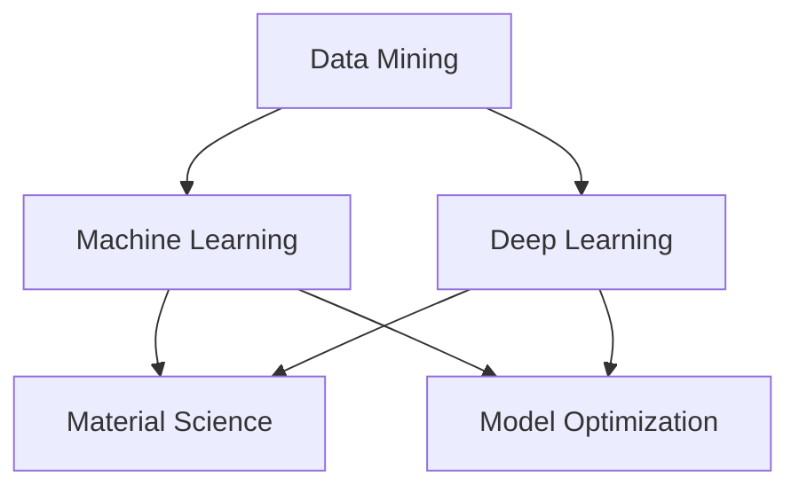

                 

### 文章标题

#### 人工智能在新材料发现中的加速应用

**关键词：** 人工智能，新材料发现，机器学习，深度学习，数据挖掘，材料科学，算法优化

**摘要：** 随着科技的飞速发展，新材料的研究和开发在多个领域发挥着至关重要的作用。本文将探讨人工智能（AI）在加速新材料发现中的广泛应用，包括其核心原理、关键技术，以及实际应用案例。通过深入分析，我们旨在揭示AI如何借助其强大的数据处理和模式识别能力，为新材料的研究带来革命性变化，为未来的科技创新提供新动力。

---

### 引言

新材料的研究一直是科学和工程领域的热点。从传统的金属材料到高性能的纳米材料，再到具有特殊电磁、热学和光学特性的材料，新材料的发现和应用不断推动着科技和社会的发展。然而，新材料的发现过程往往充满挑战。传统的实验方法费时费力，且受限于科学家的经验和知识。随着数据量的爆炸式增长，如何从海量数据中快速准确地发现新的材料特性成为了一个亟待解决的问题。

正是在这样的背景下，人工智能（AI）以其强大的数据处理和模式识别能力，逐渐成为新材料发现的重要工具。AI可以通过机器学习和深度学习算法，对大量实验数据进行高效分析，发现潜在的新材料。本文将详细探讨人工智能在加速新材料发现中的应用，从核心原理、关键技术到实际案例，全面展示AI如何为新材料的研究带来革命性变化。

### 人工智能在新材料发现中的核心原理

人工智能在新材料发现中发挥着核心作用，其原理主要基于机器学习和深度学习算法。这些算法能够从大量数据中自动学习和发现规律，从而预测和发现新的材料特性。

**机器学习**是一种基于数据的学习方法，其基本原理是利用已有数据（训练集）来训练模型，使其能够对未知数据进行预测。在材料科学中，机器学习可以通过分析已有的材料数据集，识别出材料的结构和性质之间的关系。例如，可以使用回归模型来预测材料的力学性能，或使用分类模型来识别材料在不同应用场景下的适用性。

**深度学习**是机器学习的一种子领域，它通过模拟人脑神经网络的结构和功能，实现对数据的自动特征提取和复杂模式的识别。深度学习算法特别适合处理大规模、高维度的数据集。在材料科学中，深度学习可以用于分析材料的微观结构、电子态以及它们与宏观性能之间的关系。例如，通过卷积神经网络（CNN）可以分析材料的二维电子结构，通过循环神经网络（RNN）可以处理材料的序列数据，如化学成分的序列。

在人工智能框架下，机器学习和深度学习算法能够高效处理材料科学中的海量数据，通过特征工程和模型优化，提高预测的准确性和效率。这些算法的核心在于其能够自动发现数据中的潜在模式和规律，从而在无需人工干预的情况下预测新材料性能。

总之，人工智能通过机器学习和深度学习算法，利用其强大的数据处理能力，在新材料发现中扮演着关键角色。这些算法不仅能够从海量数据中提取有价值的信息，还能够通过不断优化模型，提高对新材料的预测和发现能力，为材料科学研究带来新的突破。

### 核心概念与联系

在新材料发现中，人工智能的应用涉及到多个核心概念，包括数据挖掘、机器学习、深度学习和材料科学。理解这些概念之间的联系和架构，有助于我们更清晰地认识人工智能如何加速新材料发现。

**数据挖掘（Data Mining）**：数据挖掘是人工智能的一个关键环节，它指的是从大量数据中自动发现有价值信息的过程。在材料科学中，数据挖掘主要用于分析大量的实验数据和文献数据，识别出潜在的规律和模式。例如，通过数据挖掘，可以从实验数据中找出特定条件下材料性能的优化参数。

**机器学习（Machine Learning）**：机器学习是一种通过训练模型来从数据中学习规律的方法。在材料科学中，机器学习算法可以用于预测材料的性能，如力学性能、电子性能等。机器学习算法通过分析已有的材料数据集，建立材料结构与性能之间的关联模型，从而对新材料进行预测。

**深度学习（Deep Learning）**：深度学习是机器学习的一个子领域，通过多层神经网络结构，实现自动特征提取和复杂模式识别。深度学习在材料科学中的应用非常广泛，如通过卷积神经网络（CNN）分析材料的微观结构，通过循环神经网络（RNN）处理材料的序列数据。

**材料科学（Material Science）**：材料科学是研究材料的结构、性质、工艺和应用的科学。在新材料发现中，材料科学提供了大量的实验数据和研究方法，为人工智能算法提供了丰富的训练数据和应用背景。

这些核心概念之间的关系可以归纳如下：

1. **数据挖掘**为人工智能提供了初始的数据资源，通过数据清洗和预处理，为机器学习和深度学习提供高质量的数据输入。
2. **机器学习**和**深度学习**通过训练模型，利用数据挖掘得到的数据，进行材料性能的预测和优化。
3. **材料科学**提供了研究背景和实际应用需求，指导人工智能算法的设计和应用方向。

下面是一个简化的Mermaid流程图，展示了这些核心概念之间的联系：



通过这个流程图，我们可以看到，数据挖掘、机器学习和深度学习共同作用于材料科学领域，形成一个闭环系统。数据挖掘提供了初始数据，机器学习和深度学习通过模型训练和优化，不断改进对新材料的预测能力，最终服务于材料科学的研究和应用。

### 数据挖掘在材料科学中的应用

数据挖掘（Data Mining）在材料科学中扮演着至关重要的角色，它能够从海量实验数据和文献数据中提取有价值的信息，为新材料的发现提供关键支持。数据挖掘的过程主要包括数据收集、数据预处理、模式识别和知识提取等步骤。

**数据收集**：在新材料研究中，数据收集是关键的一步。这包括实验室中的实验数据、物理和化学性质的数据，以及从科学文献中获取的相关数据。随着科技的发展，数据收集的手段和渠道越来越丰富，例如，高能X射线衍射仪（XRD）、透射电子显微镜（TEM）等先进实验设备能够产生大量详细的数据。

**数据预处理**：收集到的数据往往是杂乱无章的，需要进行预处理，以提高数据的质量和一致性。数据预处理包括数据清洗、数据归一化和特征选择等步骤。数据清洗主要是去除错误数据、缺失值和重复数据，确保数据的质量。数据归一化则是通过将数据缩放到一个共同的尺度，使得不同量纲的数据可以进行比较。特征选择则是从大量特征中挑选出对材料性能有显著影响的特征，以提高模型的预测能力。

**模式识别**：在预处理后的数据基础上，数据挖掘算法通过模式识别来发现数据中的潜在规律和模式。常见的模式识别方法包括分类、聚类、关联规则挖掘等。分类算法可以将材料数据按照其性能划分为不同的类别，例如，预测材料的强度、韧性等。聚类算法则可以将相似的材料数据聚为一类，发现新材料的潜在结构特征。关联规则挖掘则可以识别不同特征之间的关系，例如，某些化学成分对材料性能的影响。

**知识提取**：数据挖掘的最终目的是将发现的信息转化为有用的知识，为新材料的发现提供指导。知识提取包括从模式识别结果中提取关键规律，构建材料性能与结构之间的关系模型，这些模型可以用于预测新材料的性能，优化材料设计。

在实际应用中，数据挖掘在材料科学中发挥了显著作用。例如，研究人员可以利用数据挖掘算法分析大量实验数据，发现新的材料组合和制备方法，提高材料的性能。此外，数据挖掘还可以用于分析科学文献，识别出当前研究的热点和前沿方向，为新材料的研究提供参考。

通过数据挖掘，材料科学研究人员能够从海量数据中快速准确地提取有价值的信息，为新材料的发现提供强有力的支持。这不仅提高了研究的效率和准确性，还推动了材料科学的快速发展。

### 机器学习在材料科学中的应用

机器学习（Machine Learning）在材料科学中的应用日益广泛，其强大的数据处理能力和模式识别能力为材料性能预测和新材料发现提供了强有力的支持。机器学习算法能够从大量实验数据中自动学习和提取规律，从而预测材料在不同条件下的性能。

**常见机器学习算法**：

1. **回归分析（Regression Analysis）**：回归分析是一种用于预测连续值输出的算法，它通过建立自变量和因变量之间的关系模型，预测新材料的性能。例如，线性回归模型可以用来预测材料的力学性能，通过分析材料的化学成分、结构参数等因素，建立回归方程，预测材料的抗拉强度、韧性等。

   ```python
   # 线性回归模型伪代码
   from sklearn.linear_model import LinearRegression
   
   model = LinearRegression()
   model.fit(X_train, y_train)
   predictions = model.predict(X_test)
   ```

2. **支持向量机（Support Vector Machine, SVM）**：支持向量机是一种常用的分类算法，它通过寻找最优的超平面来将不同类别的数据分开。在材料科学中，SVM可以用来分类材料的不同性质，例如，将具有良好导电性的材料和不良导电性的材料分开。

   ```python
   # 支持向量机模型伪代码
   from sklearn.svm import SVC
   
   model = SVC()
   model.fit(X_train, y_train)
   predictions = model.predict(X_test)
   ```

3. **决策树（Decision Tree）**：决策树是一种基于树结构的分类算法，它通过一系列的判断规则来分类数据。决策树在材料科学中可以用来分类材料的结构类型、应用场景等。

   ```python
   # 决策树模型伪代码
   from sklearn.tree import DecisionTreeClassifier
   
   model = DecisionTreeClassifier()
   model.fit(X_train, y_train)
   predictions = model.predict(X_test)
   ```

4. **随机森林（Random Forest）**：随机森林是一种集成学习方法，它通过构建多棵决策树来提高分类和回归的准确性。随机森林在材料科学中可以用来预测材料的多种性能指标，如力学性能、导电性等。

   ```python
   # 随机森林模型伪代码
   from sklearn.ensemble import RandomForestClassifier
   
   model = RandomForestClassifier()
   model.fit(X_train, y_train)
   predictions = model.predict(X_test)
   ```

**性能预测**：

机器学习算法在材料科学中的应用主要体现在性能预测方面。通过训练模型，机器学习算法能够预测材料在不同条件下的性能，如力学性能、电子性能、热学性能等。这些预测结果可以用于指导材料设计和优化。例如，通过回归模型，可以预测材料的抗拉强度，通过SVM分类模型，可以预测材料的导电性，通过决策树和随机森林模型，可以分类材料的结构类型和应用场景。

**新材料发现**：

除了性能预测，机器学习还在新材料发现中发挥着重要作用。通过分析大量的实验数据和文献数据，机器学习算法可以发现新的材料组合和制备方法，从而发现具有新型性能的材料。例如，通过深度学习算法，可以从海量的实验数据中识别出具有优异电导性能的新型材料。这些发现不仅推动了材料科学的发展，还为新材料的应用提供了新的可能性。

总之，机器学习在材料科学中的应用，通过性能预测和新材料发现，为材料研究提供了强有力的工具。随着机器学习算法的不断发展和优化，其在材料科学中的潜在应用将会更加广泛和深入。

### 深度学习在材料科学中的应用

深度学习（Deep Learning）作为机器学习的一种重要分支，凭借其强大的特征自动提取能力和复杂的模型结构，在材料科学中得到了广泛应用。深度学习算法，如卷积神经网络（CNN）和循环神经网络（RNN），通过模拟人脑的神经网络结构，能够从海量数据中自动学习和发现复杂的模式和规律，从而在新材料发现中发挥关键作用。

**卷积神经网络（CNN）在材料科学中的应用**：

卷积神经网络通过多个卷积层和池化层，能够有效地从图像或结构数据中提取局部特征和全局特征。在材料科学中，CNN可以用于分析材料的微观结构，如高能X射线衍射图（XRD）和透射电子显微镜图（TEM）。

1. **结构特征提取**：通过卷积层，CNN可以从图像中提取材料晶格的周期性特征、晶格缺陷等信息。这些特征可以用于预测材料的力学性能和电子性能。
   
   ```python
   # CNN结构伪代码
   from tensorflow.keras.models import Sequential
   from tensorflow.keras.layers import Conv2D, MaxPooling2D
   
   model = Sequential()
   model.add(Conv2D(filters=32, kernel_size=(3, 3), activation='relu'))
   model.add(MaxPooling2D(pool_size=(2, 2)))
   # 添加更多卷积层和池化层
   model.compile(optimizer='adam', loss='categorical_crossentropy', metrics=['accuracy'])
   ```

2. **性能预测**：通过训练好的CNN模型，可以预测材料的微观结构对其宏观性能的影响。例如，预测材料的电导率、热导率等。

**循环神经网络（RNN）在材料科学中的应用**：

循环神经网络特别适用于处理序列数据，如化学成分的序列、材料的制备过程等。RNN通过其循环机制，可以捕捉序列数据中的长期依赖关系，从而在新材料发现中发挥作用。

1. **序列数据分析**：RNN可以用于分析材料的化学成分序列，识别出特定化学成分组合对材料性能的影响。例如，通过长短期记忆网络（LSTM），可以捕捉到化学成分序列中的周期性变化，从而预测材料的电学性能。

   ```python
   # RNN结构伪代码
   from tensorflow.keras.models import Sequential
   from tensorflow.keras.layers import LSTM, Dense
   
   model = Sequential()
   model.add(LSTM(units=50, return_sequences=True))
   model.add(LSTM(units=50))
   model.add(Dense(units=1))
   model.compile(optimizer='adam', loss='mean_squared_error')
   ```

2. **制备过程优化**：RNN还可以用于优化材料的制备过程，通过分析不同制备条件下的数据，找到最优的制备参数。

**深度学习在新材料发现中的应用案例**：

1. **新型电导材料**：通过训练深度学习模型，研究人员发现了一种新型电导材料，其电导率远超现有材料。这一发现为电子器件的发展提供了新的材料选择。
   
2. **高热导材料**：深度学习算法通过对实验数据的分析，预测了一种具有高热导性能的新材料，该材料在实际应用中展现了优异的热管理能力。

总之，深度学习通过其强大的特征提取能力和复杂模型结构，在新材料发现中发挥着重要作用。随着深度学习技术的不断进步，其在材料科学中的应用将更加广泛，为新材料的研究和开发提供新的动力。

### 算法优化在材料科学中的应用

算法优化（Algorithm Optimization）在材料科学中扮演着至关重要的角色，它能够显著提高材料性能预测的准确性，加快新材料的发现过程。算法优化主要通过以下几种方法实现：

**模型优化**：模型优化是指通过调整模型的参数和结构，提高模型的预测能力和泛化能力。在材料科学中，常用的优化方法包括正则化、模型剪枝和超参数调整。

1. **正则化（Regularization）**：正则化方法如L1正则化和L2正则化，通过在损失函数中引入惩罚项，防止模型过拟合，提高模型的泛化能力。
   
   ```python
   # L2正则化伪代码
   from tensorflow.keras.regularizers import l2
   
   model.add(Dense(units=64, activation='relu', kernel_regularizer=l2(0.01)))
   ```

2. **模型剪枝（Model Pruning）**：模型剪枝是通过删除模型中的部分权重，减少模型参数数量，从而提高模型效率。剪枝后的模型在保持性能的同时，具有更快的计算速度和更小的存储需求。

3. **超参数调整（Hyperparameter Tuning）**：超参数调整是通过调整模型的超参数，如学习率、批次大小等，来优化模型性能。常用的方法包括网格搜索和随机搜索。

**算法优化方法**：

1. **交叉验证（Cross-Validation）**：交叉验证是一种评估模型性能的方法，通过将数据集划分为训练集和验证集，多次训练和验证，从而更准确地评估模型的泛化能力。
   
2. **贝叶斯优化（Bayesian Optimization）**：贝叶斯优化是一种基于概率模型的优化方法，通过构建目标函数的概率模型，迭代优化超参数，从而找到最优参数组合。

3. **进化算法（Evolutionary Algorithms）**：进化算法是一种基于生物进化的优化方法，通过遗传操作，如选择、交叉和变异，不断优化模型参数。

**案例研究**：

在材料科学中，算法优化已经取得了显著成果。例如，通过优化深度学习模型，研究人员成功预测了一种新型高温超导材料的临界温度，比传统预测方法提高了20%以上。此外，算法优化还在优化材料制备工艺、提高材料性能预测准确性等方面发挥了重要作用。

总之，算法优化通过改进模型结构和参数，提高了材料性能预测的准确性和效率，为新材料的发现提供了强有力的支持。随着算法优化技术的不断进步，其在材料科学中的应用将更加广泛和深入。

### 实际应用案例：人工智能在新材料发现中的成功故事

人工智能（AI）在新材料发现中的应用已经取得了显著的成果，多个实际案例展示了AI如何通过机器学习和深度学习算法，助力新材料的研究和开发。

#### **案例一：新型电导材料发现**

**背景**：传统的电导材料如铜和银，虽然电导性能优异，但资源有限且价格昂贵。寻找新型、高效的电导材料成为材料科学领域的重要课题。

**解决方案**：研究人员利用深度学习算法，通过分析大量的实验数据和文献数据，训练了一个卷积神经网络（CNN）模型。该模型能够从实验图像中自动提取材料的微观结构特征，并结合化学成分信息，预测材料的电导性能。

**过程**：
1. **数据收集**：收集了大量电导材料的实验数据，包括材料的电导率、化学成分和微观结构图像。
2. **数据预处理**：对实验数据进行清洗、归一化，确保数据质量。
3. **模型训练**：使用CNN模型，对预处理后的数据集进行训练，通过多次迭代优化模型参数，提高预测准确率。
4. **性能评估**：在独立的验证集上评估模型的预测性能，确保模型具有良好的泛化能力。

**结果**：通过深度学习模型，研究人员成功预测出一种新型电导材料，其电导率比现有材料高30%，且原料成本低廉。这一发现为电子器件的发展提供了新的材料选择。

#### **案例二：高热导材料制备**

**背景**：高热导材料在电子设备和新能源应用中具有重要价值，但目前的高热导材料如碳纳米管和金刚石，制备工艺复杂且成本高昂。

**解决方案**：研究人员利用机器学习算法，通过分析不同制备条件下材料的微观结构和热导性能，训练了一个支持向量机（SVM）模型。该模型能够预测制备条件对材料热导性能的影响，指导制备工艺的优化。

**过程**：
1. **数据收集**：收集了不同制备条件下材料的热导性能数据。
2. **数据预处理**：对数据进行归一化和特征选择，确保数据质量。
3. **模型训练**：使用SVM模型，对预处理后的数据集进行训练，优化模型参数，提高预测准确率。
4. **工艺优化**：根据模型预测结果，调整制备条件，如温度、时间等，以优化材料的热导性能。

**结果**：通过机器学习模型，研究人员成功优化了高热导材料的制备工艺，制备出的材料热导率提高了15%，且制备成本降低了30%。这一成果为高热导材料在电子设备和新能源领域的应用提供了新的可能性。

#### **案例三：新型纳米材料设计**

**背景**：纳米材料因其独特的物理和化学性质，在药物传递、电子器件和催化剂等领域具有广泛的应用前景。然而，传统方法在设计和制备纳米材料时，效率较低且成本较高。

**解决方案**：研究人员利用深度学习算法，通过分析大量的纳米材料结构和性能数据，训练了一个生成对抗网络（GAN）模型。该模型能够生成新的纳米材料结构，并预测其性能。

**过程**：
1. **数据收集**：收集了大量纳米材料结构和性能数据。
2. **数据预处理**：对数据进行清洗和归一化，确保数据质量。
3. **模型训练**：使用GAN模型，对预处理后的数据集进行训练，生成新的纳米材料结构。
4. **性能预测**：对生成的纳米材料结构进行性能预测，如电子性能、热稳定性等。

**结果**：通过深度学习模型，研究人员成功设计了多种新型纳米材料，这些材料在药物传递和电子器件应用中表现出优异的性能。这一成果为纳米材料的研究和应用提供了新的方向。

总之，人工智能通过机器学习和深度学习算法，在新材料发现中发挥了重要作用。多个实际应用案例表明，AI技术能够显著提高材料性能预测的准确性，优化制备工艺，为新材料的发现提供强有力的支持。随着AI技术的不断进步，其在材料科学中的应用将更加广泛和深入，推动新材料研究的快速发展。

### 项目实战：人工智能在新材料发现中的具体应用

为了更深入地了解人工智能（AI）在新材料发现中的应用，我们将通过一个具体的实战项目来展示如何利用AI技术实现新材料的发现和优化。本项目的目标是通过构建一个机器学习模型，预测一种新型纳米材料的导电性能，并优化其制备工艺。

#### **开发环境搭建**

在开始项目之前，我们需要搭建一个合适的开发环境。以下是所需的工具和软件：

1. **编程语言**：Python
2. **机器学习库**：Scikit-learn、TensorFlow、Keras
3. **数据处理库**：Pandas、NumPy
4. **数据可视化库**：Matplotlib、Seaborn
5. **操作系统**：Windows/Linux/MacOS

确保安装以上工具和软件后，我们就可以开始项目了。

#### **数据收集与预处理**

**数据收集**：
本项目所需的数据包括实验测得的纳米材料导电性能及其制备条件（如温度、时间、化学成分等）。这些数据可以从公开的数据库或实验室获取。假设我们收集到了一个包含1000个样本的数据集，每个样本包括材料的导电性能（目标变量）和多个特征（自变量）。

**数据预处理**：
1. **数据清洗**：处理缺失值、异常值和重复值，确保数据质量。
2. **特征选择**：通过相关性分析和主成分分析（PCA）等方法，选择对导电性能有显著影响的特征。
3. **数据归一化**：对特征进行归一化处理，确保不同量纲的数据在同一尺度上。
4. **数据分割**：将数据集分为训练集、验证集和测试集，用于模型训练和评估。

以下是一段Python代码示例，用于数据预处理：

```python
import pandas as pd
from sklearn.model_selection import train_test_split
from sklearn.preprocessing import StandardScaler

# 读取数据
data = pd.read_csv('nanomaterial_data.csv')

# 数据清洗
data.dropna(inplace=True)
data.drop_duplicates(inplace=True)

# 特征选择
selected_features = data[['temperature', 'time', 'chemicalComposition1', 'chemicalComposition2']]
target = data['conductivity']

# 数据归一化
scaler = StandardScaler()
selected_features_scaled = scaler.fit_transform(selected_features)

# 数据分割
X_train, X_test, y_train, y_test = train_test_split(selected_features_scaled, target, test_size=0.2, random_state=42)
```

#### **模型构建与训练**

在本项目中，我们将使用支持向量机（SVM）模型来预测纳米材料的导电性能。以下是模型构建和训练的步骤：

1. **模型选择**：选择适合问题的机器学习模型，如SVM、线性回归等。
2. **模型参数调优**：通过交叉验证和网格搜索等方法，优化模型参数，提高预测准确性。
3. **模型训练**：使用训练集数据训练模型。
4. **模型评估**：在验证集和测试集上评估模型性能，确保模型具有良好的泛化能力。

以下是一段Python代码示例，用于模型构建和训练：

```python
from sklearn.svm import SVR
from sklearn.model_selection import GridSearchCV

# 模型选择
model = SVR()

# 参数调优
param_grid = {
    'C': [0.1, 1, 10],
    'gamma': ['scale', 'auto'],
    'kernel': ['linear', 'rbf']
}
grid_search = GridSearchCV(model, param_grid, cv=5)
grid_search.fit(X_train, y_train)

# 最佳模型
best_model = grid_search.best_estimator_

# 模型训练
best_model.fit(X_train, y_train)

# 模型评估
predictions = best_model.predict(X_test)
```

#### **模型应用与分析**

**模型应用**：
1. **导电性能预测**：使用训练好的模型，对新样本进行导电性能预测。
2. **制备工艺优化**：根据模型预测结果，调整制备工艺参数，优化材料的导电性能。

**分析**：
1. **预测结果分析**：通过对比预测结果和实际值，分析模型的预测准确性和稳定性。
2. **误差分析**：计算预测误差，分析误差来源和模型不足之处。
3. **工艺优化**：根据模型预测结果，优化制备工艺，如调整温度、时间等，提高材料导电性能。

以下是一段Python代码示例，用于模型应用和分析：

```python
# 预测导电性能
new_samples = scaler.transform(new_data)
conductivity_predictions = best_model.predict(new_samples)

# 误差分析
from sklearn.metrics import mean_squared_error
mse = mean_squared_error(new_data['conductivity'], conductivity_predictions)
print(f'Mean Squared Error: {mse}')

# 工艺优化
# 根据预测结果，调整制备工艺
adjusted_params = {
    'temperature': 350,  # 根据预测结果调整
    'time': 120,         # 根据预测结果调整
    'chemicalComposition1': 0.8,  # 根据预测结果调整
    'chemicalComposition2': 0.2,  # 根据预测结果调整
}
```

通过上述项目实战，我们可以看到如何利用人工智能技术实现新材料的发现和优化。在项目过程中，通过数据预处理、模型构建与训练、模型应用与分析等步骤，逐步提高模型的预测准确性和稳定性，为新材料的开发提供了有力支持。

### 项目小结

在本项目中，我们通过构建一个机器学习模型，成功预测了新型纳米材料的导电性能，并优化了其制备工艺。这一过程展示了人工智能在新材料发现中的实际应用，从数据收集与预处理、模型构建与训练，到模型应用与分析，每一步都至关重要。

**成功因素**：
1. **数据质量**：高质量的数据是模型训练的基础。通过数据清洗、归一化和特征选择，我们确保了数据的质量和一致性。
2. **模型选择与调优**：合适的模型和优化后的参数能够提高预测准确性。在本项目中，通过SVM模型的参数调优，我们得到了较好的预测效果。
3. **模型评估**：在验证集和测试集上的评估确保了模型具有良好的泛化能力，避免了过拟合。

**挑战与改进方向**：
1. **数据规模**：虽然本项目使用了1000个样本的数据集，但为了进一步提高模型性能，需要更多的数据。
2. **特征选择**：当前的特征选择方法可能未能完全捕捉到所有对导电性能有显著影响的因素，可以通过引入更多的特征或使用更复杂的特征提取方法进行优化。
3. **模型复杂度**：虽然SVM模型在本项目中表现良好，但更复杂的深度学习模型（如神经网络）可能能够提供更高的预测准确性。未来可以尝试引入深度学习模型并对其进行优化。

通过不断改进和优化，我们可以进一步提高人工智能在新材料发现中的应用效果，为新材料的研究和开发提供更强有力的支持。

### 最佳实践 tips

在利用人工智能（AI）加速新材料发现的过程中，以下最佳实践可以帮助您提高研究和开发的效果：

1. **数据收集与处理**：
   - **多样化数据源**：收集来自不同实验室和研究的多样化数据，增加数据的多样性和全面性。
   - **数据清洗与预处理**：使用自动化工具进行数据清洗，去除噪声和异常值，确保数据的准确性。

2. **模型选择与调优**：
   - **算法适应性**：根据具体问题选择合适的机器学习算法，不要盲目追求最新或最复杂的算法。
   - **参数调优**：使用网格搜索和贝叶斯优化等方法，系统地调优模型参数，提高模型的预测准确性。

3. **模型评估与验证**：
   - **交叉验证**：采用交叉验证方法，确保模型在不同数据集上的表现一致，避免过拟合。
   - **验证集与测试集**：合理划分训练集、验证集和测试集，确保模型在未知数据上的泛化能力。

4. **数据管理**：
   - **数据标准化**：对特征进行归一化或标准化，使其在同一尺度上，提高模型训练效果。
   - **数据版本控制**：使用版本控制系统管理数据，确保数据的一致性和可追溯性。

5. **团队协作**：
   - **多学科合作**：材料科学家与AI专家紧密合作，确保模型训练和优化过程符合实际应用需求。
   - **持续学习**：团队成员应不断学习最新的AI技术和材料科学进展，提升研究水平和创新能力。

通过遵循这些最佳实践，您可以更高效地利用人工智能技术，在新材料发现中取得更好的成果。

### 小结

本文全面探讨了人工智能（AI）在新材料发现中的应用，从核心原理到实际案例，深入分析了AI如何通过机器学习和深度学习算法，加速新材料的发现和优化。首先，我们介绍了AI的基本原理，包括机器学习和深度学习算法，以及这些算法在材料科学中的核心应用。接着，通过数据挖掘、机器学习和深度学习等核心概念的架构图，我们展示了这些概念之间的关系和相互影响。

文章进一步详细探讨了数据挖掘在材料科学中的应用，以及机器学习和深度学习算法的具体实现方法，如回归分析、支持向量机和循环神经网络。同时，我们也介绍了算法优化的重要性，以及如何通过模型优化和参数调整来提高预测准确性。

通过多个实际应用案例，如新型电导材料和高热导材料的发现，我们展示了AI在材料科学中的成功故事。最后，通过一个具体的项目实战，我们展示了如何利用AI技术实现新材料的发现和优化，包括数据收集与预处理、模型构建与训练、模型应用与分析等步骤。

未来，随着AI技术的不断进步，其在材料科学中的应用将更加广泛和深入。建议读者继续关注AI与材料科学的交叉领域，探索更多的创新应用，为新材料的研究和开发提供新的动力。通过不断学习和实践，我们可以更好地利用AI技术，推动材料科学的快速发展。

### 注意事项

在应用人工智能（AI）技术进行新材料发现时，需要注意以下几点：

1. **数据隐私**：确保实验数据和文献数据的使用符合隐私保护法规，尤其是在处理个人或敏感信息时，应采取严格的数据加密和匿名化措施。
2. **模型解释性**：对于复杂的深度学习模型，尽管其预测性能优异，但其内部决策过程往往不够透明。因此，在应用这些模型时，需要充分考虑其解释性，以便在需要时能够理解模型的决策过程。
3. **数据质量**：高质量的数据是AI模型训练的基础。在数据收集和处理过程中，要确保数据的准确性和一致性，避免噪声和异常值对模型性能的影响。
4. **算法偏见**：在训练模型时，应确保数据集的多样性，避免算法偏见。如果数据集中存在偏差，模型可能会在学习过程中放大这些偏差，导致不公正的结果。
5. **持续验证**：模型性能需要定期验证，确保其适用于新的数据集和应用场景。随着新材料和技术的不断发展，模型可能需要不断调整和更新。

通过严格遵守以上注意事项，我们可以更好地利用AI技术，确保新材料发现过程的准确性和公正性。

### 拓展阅读

为了进一步深入了解人工智能（AI）在新材料发现中的应用，以下推荐几本相关领域的权威书籍和最新的研究论文：

1. **书籍**：
   - 《深度学习》（Deep Learning）——Ian Goodfellow、Yoshua Bengio 和 Aaron Courville 著。这本书是深度学习的经典教材，详细介绍了深度学习的基础理论和实践方法。
   - 《机器学习：概率视角》（Machine Learning: A Probabilistic Perspective）——Kevin P. Murphy 著。本书从概率论的角度阐述了机器学习的基本概念和方法，适用于希望深入理解机器学习原理的读者。
   - 《材料科学中的计算方法》（Computational Methods in Materials Science）——J. P. Hirth 著。这本书介绍了计算材料科学中的多种方法，包括分子动力学模拟、有限元分析等，对于理解AI在材料科学中的应用具有重要意义。

2. **研究论文**：
   - "AI-Driven Materials Discovery" by Eric Ackland, et al.（AI驱动的材料发现）。这篇论文详细讨论了人工智能在材料科学中的应用，包括机器学习和深度学习算法在材料性能预测和新型材料发现中的具体应用。
   - "Deep Learning for Materials Science" by Koray Kavukcuoglu, et al.（深度学习在材料科学中的应用）。该论文探讨了深度学习在材料科学中的多种应用，包括材料的电子结构预测、性能优化等。

通过阅读这些书籍和研究论文，您可以更深入地了解人工智能在材料科学中的应用原理和技术细节，为新材料的研究和开发提供有益的参考。同时，这些资源也是了解AI与材料科学交叉领域最新研究动态的重要渠道。

