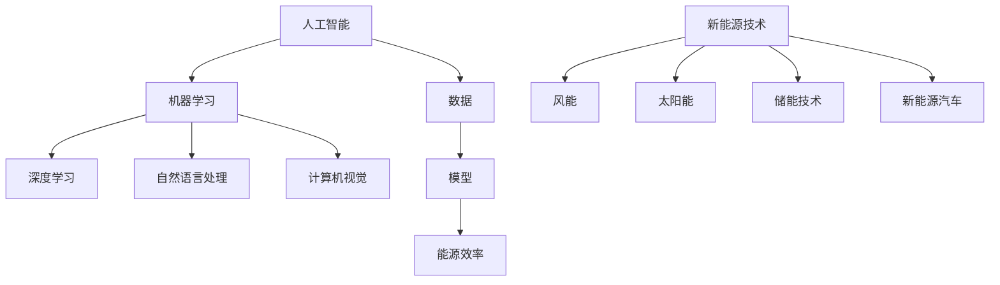
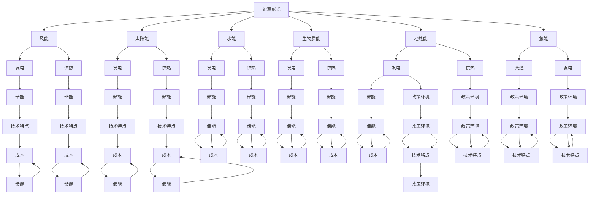
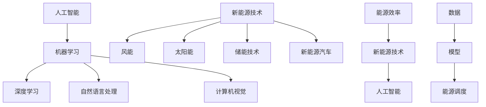
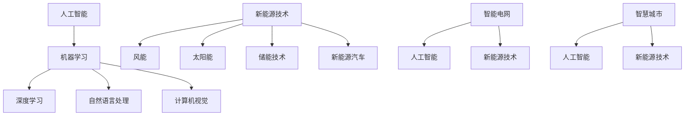
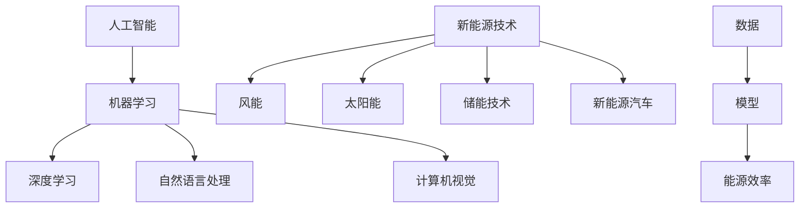

                 

## 文章标题

# 人工智能在新能源开发中的应用

## 关键词

- 人工智能
- 新能源
- 风能
- 太阳能
- 储能技术
- 新能源汽车

## 摘要

本文将深入探讨人工智能在新能源开发中的应用。首先，我们将介绍人工智能的基本概念和新能源技术的概述，阐述两者结合的重要性。接着，我们将详细分析人工智能在风能、太阳能、储能技术和新能源汽车中的应用案例，探讨其应用前景与面临的挑战。最后，我们将总结人工智能在新能源开发中的应用成果，展望未来发展的方向与趋势。

## 引言与概述

### 人工智能的基本概念

人工智能（Artificial Intelligence，简称AI）是计算机科学的一个分支，旨在使计算机系统具备类似于人类智能的能力。这包括学习、推理、感知、理解和决策等方面。人工智能的发展经历了几个阶段，从早期的规则系统到现代的机器学习和深度学习，其技术不断进步，应用领域也越来越广泛。

人工智能的核心技术包括机器学习（Machine Learning）、深度学习（Deep Learning）、自然语言处理（Natural Language Processing）、计算机视觉（Computer Vision）等。这些技术使得计算机系统能够从数据中学习，自主改进和优化性能，从而实现智能化的任务。

### 新能源技术的概述

新能源技术是指以可再生、环保和可持续的方式产生和利用能源的技术。与传统的化石能源相比，新能源技术具有资源丰富、污染少、可持续等优点。新能源技术主要包括风能、太阳能、储能技术和新能源汽车等。

- **风能**：利用风力驱动风力涡轮机产生电能的技术。风能具有可再生、清洁和能量密度高等优点，是当前最具发展前景的新能源之一。
- **太阳能**：利用太阳能电池板将太阳能转化为电能的技术。太阳能资源丰富、分布广泛，具有广泛的应用前景。
- **储能技术**：用于储存电能，以便在需要时供应电力。储能技术的发展对于新能源的利用具有重要意义，可以解决新能源发电的不稳定性和 intermittency 问题。
- **新能源汽车**：使用新能源作为动力来源的汽车，包括电动汽车、氢燃料电池汽车等。新能源汽车具有零排放、低噪音等优点，是未来汽车发展的重要方向。

### 人工智能在新能源开发中的价值

人工智能在新能源开发中具有巨大的应用价值。首先，人工智能可以帮助优化新能源技术的性能，提高能源利用效率。例如，通过机器学习算法预测风能和太阳能的发电量，从而优化能源调度和配置。

其次，人工智能可以提高新能源设备的运维效率，减少故障率和维护成本。例如，通过计算机视觉技术对风力涡轮机和太阳能电池板进行远程监测，及时发现和诊断设备故障。

此外，人工智能还可以促进新能源产业的创新和升级。通过大数据分析和深度学习技术，可以发现新能源领域的潜在需求和趋势，推动新能源技术的研发和应用。

总之，人工智能与新能源技术的结合将带来新的发展机遇，推动能源领域向更高效、更清洁、更可持续的方向发展。

### 目录

- [第一部分：引言与概述](#第一部分-引言与概述)
  - [1.1 人工智能与新能源概述](#11-人工智能与新能源概述)
  - [1.2 人工智能基础](#12-人工智能基础)
  - [1.3 新能源技术基础](#13-新能源技术基础)
  - [1.4 人工智能在新能源开发中的应用案例](#14-人工智能在新能源开发中的应用案例)
  - [1.5 应用前景与挑战](#15-应用前景与挑战)
  - [1.6 技术发展与趋势](#16-技术发展与趋势)
- [第二部分：人工智能基础](#第二部分-人工智能基础)
  - [2.1 人工智能的基本概念](#21-人工智能的基本概念)
  - [2.2 人工智能的常见技术](#22-人工智能的常见技术)
  - [2.3 人工智能的发展历史](#23-人工智能的发展历史)
- [第三部分：新能源技术基础](#第三部分-新能源技术基础)
  - [3.1 新能源概述](#31-新能源概述)
  - [3.2 新能源技术的分类与特点](#32-新能源技术的分类与特点)
  - [3.3 新能源技术的挑战与机遇](#33-新能源技术的挑战与机遇)
- [第四部分：人工智能在新能源开发中的应用案例](#第四部分-人工智能在新能源开发中的应用案例)
  - [4.1 人工智能在风能开发中的应用](#41-人工智能在风能开发中的应用)
  - [4.2 人工智能在太阳能开发中的应用](#42-人工智能在太阳能开发中的应用)
  - [4.3 人工智能在储能技术中的应用](#43-人工智能在储能技术中的应用)
  - [4.4 人工智能在新能源汽车中的应用](#44-人工智能在新能源汽车中的应用)
- [第五部分：应用前景与挑战](#第五部分-应用前景与挑战)
  - [5.1 人工智能在新能源领域的应用前景](#51-人工智能在新能源领域的应用前景)
  - [5.2 人工智能在新能源领域面临的挑战](#52-人工智能在新能源领域面临的挑战)
  - [5.3 应对挑战的策略](#53-应对挑战的策略)
- [第六部分：技术发展与趋势](#第六部分-技术发展与趋势)
  - [6.1 人工智能技术的新进展](#61-人工智能技术的新进展)
  - [6.2 新能源技术的新动态](#62-新能源技术的新动态)
  - [6.3 人工智能与新能源技术的融合趋势](#63-人工智能与新能源技术的融合趋势)
- [第七部分：总结与展望](#第七部分-总结与展望)
  - [7.1 人工智能在新能源开发中的应用总结](#71-人工智能在新能源开发中的应用总结)
  - [7.2 未来发展的方向与建议](#72-未来发展的方向与建议)

## 第二部分：人工智能基础

### 2.1 人工智能的基本概念

人工智能（Artificial Intelligence，简称AI）是计算机科学的一个分支，旨在使计算机系统具备类似于人类智能的能力。这包括学习、推理、感知、理解和决策等方面。人工智能的发展经历了几个阶段，从早期的规则系统到现代的机器学习和深度学习，其技术不断进步，应用领域也越来越广泛。

人工智能的核心技术包括机器学习（Machine Learning）、深度学习（Deep Learning）、自然语言处理（Natural Language Processing）、计算机视觉（Computer Vision）等。这些技术使得计算机系统能够从数据中学习，自主改进和优化性能，从而实现智能化的任务。

### 2.2 人工智能的常见技术

#### 2.2.1 机器学习

机器学习（Machine Learning）是人工智能的一个重要分支，主要研究如何从数据中学习并作出预测或决策。机器学习算法可以分为监督学习、无监督学习和强化学习。

- **监督学习**：输入数据带有标签，通过学习找到输入和输出之间的映射关系。
  - **线性回归**：预测一个连续值输出。
  - **逻辑回归**：用于分类任务，输出概率值。
- **无监督学习**：输入数据没有标签，通过学习发现数据中的结构和规律。
  - **聚类**：将相似的数据分为一组。
  - **降维**：减少数据维度，保持数据主要信息。

#### 2.2.2 深度学习

深度学习（Deep Learning）是一种特殊的机器学习算法，通过多层神经网络结构来实现复杂的非线性映射。深度学习在图像识别、语音识别、自然语言处理等领域取得了显著成果。

- **卷积神经网络（CNN）**：适用于图像处理，通过卷积操作提取图像特征。
- **循环神经网络（RNN）**：适用于序列数据，可以处理时序信息和长期依赖问题。
- **生成对抗网络（GAN）**：通过两个神经网络（生成器和判别器）的对抗训练，生成高质量的数据。

#### 2.2.3 自然语言处理

自然语言处理（Natural Language Processing，简称NLP）是研究如何使计算机理解和处理人类自然语言的技术。NLP涵盖了文本分类、信息抽取、机器翻译、情感分析等多个方面。

- **词嵌入（Word Embedding）**：将单词映射到高维空间，用于表示单词的语义信息。
- **序列标注（Sequence Labeling）**：对文本中的词语进行分类，如命名实体识别、词性标注。
- **机器翻译（Machine Translation）**：将一种语言的文本翻译成另一种语言。

#### 2.2.4 计算机视觉

计算机视觉（Computer Vision）是研究如何使计算机从图像或视频中提取有用信息的技术。计算机视觉广泛应用于图像识别、目标检测、图像分割等领域。

- **图像识别**：识别图像中的对象和场景。
- **目标检测**：检测图像中的目标位置和类别。
- **图像分割**：将图像分割成多个区域，每个区域具有相同的属性。

### 2.3 人工智能的发展历史

人工智能的研究可以追溯到20世纪50年代。以下是人工智能发展的重要里程碑：

- **1956年**：达特茅斯会议，标志着人工智能学科的诞生。
- **1979年**：约翰·麦卡锡提出专家系统，开创了人工智能应用的新时代。
- **1986年**：深度神经网络首次被提出，标志着深度学习的研究开始。
- **2012年**：深度学习在图像识别任务中取得突破性成果，掀起了人工智能的新一轮热潮。
- **2016年**：AlphaGo战胜李世石，标志着人工智能在围棋领域取得了重大突破。

### 核心概念与联系

为了更好地理解人工智能在新能源开发中的应用，我们需要明确一些核心概念，并展示它们之间的关系架构。以下是几个关键概念及其关系：

1. **人工智能**：包括机器学习、深度学习、自然语言处理和计算机视觉等技术。
2. **新能源技术**：包括风能、太阳能、储能技术和新能源汽车等。
3. **数据**：人工智能的输入，用于训练和优化模型。
4. **模型**：人工智能的核心，用于预测和决策。
5. **能源效率**：新能源技术的核心目标，通过人工智能可以提高。

以下是这些概念之间的关系架构：



### 核心算法原理讲解

#### 2.3.1 机器学习算法原理

机器学习算法的核心原理是利用数据来训练模型，从而实现预测或分类任务。以下是几种常见的机器学习算法及其原理：

1. **线性回归**：
   - **目标**：预测一个连续值输出。
   - **原理**：通过最小二乘法找到最佳拟合直线，使预测值与真实值之间的误差最小。
   - **伪代码**：
     ```python
     def linear_regression(X, y):
         # X: 输入特征矩阵，y: 标签向量
         # 计算最佳拟合直线的参数w和b
         w = (X^T * X)^(-1) * X^T * y
         b = y - X * w
         return w, b
     ```

2. **逻辑回归**：
   - **目标**：用于分类任务，输出概率值。
   - **原理**：通过逻辑函数（sigmoid 函数）将线性组合的输入映射到概率值。
   - **伪代码**：
     ```python
     def logistic_regression(X, y):
         # X: 输入特征矩阵，y: 标签向量
         # 计算最佳拟合直线的参数w和b
         w = (X^T * X)^(-1) * X^T * y
         b = y - X * w
         # 计算预测概率
         prob = 1 / (1 + exp(-X * w - b))
         return prob
     ```

3. **决策树**：
   - **目标**：对数据进行分类或回归。
   - **原理**：通过递归划分特征和值，构建一棵树形结构，树的叶节点表示最终的预测结果。
   - **伪代码**：
     ```python
     def build_decision_tree(X, y, features, threshold):
         # X: 输入特征矩阵，y: 标签向量
         # features: 可选特征列表
         # threshold: 划分阈值
         if all(y == y[0]):
             return y[0]
         if not features or threshold <= 0:
             return predict_majority(y)
         # 计算最佳划分特征和阈值
         best_feature, best_threshold = find_best_split(X, y, features, threshold)
         # 构建子树
         left subtree = build_decision_tree(X[:, best_feature] < best_threshold, y, features - {best_feature}, threshold)
         right subtree = build_decision_tree(X[:, best_feature] >= best_threshold, y, features - {best_feature}, threshold)
         return Node(best_feature, best_threshold, left subtree, right subtree)
     ```

#### 2.3.2 深度学习算法原理

深度学习算法是基于多层神经网络的结构，通过多层非线性变换来实现复杂的特征提取和分类任务。以下是几种常见的深度学习算法及其原理：

1. **卷积神经网络（CNN）**：
   - **目标**：图像识别、目标检测等。
   - **原理**：通过卷积操作提取图像特征，然后通过全连接层进行分类。
   - **伪代码**：
     ```python
     def convolutional_neural_network(X, weights, biases):
         # X: 输入图像矩阵
         # weights: 卷积核权重矩阵
         # biases: 偏置向量
         # 初始化激活值
         activation = X
         for layer in range(len(weights)):
             # 卷积操作
             activation = convolve(activation, weights[layer])
             # 激活函数
             activation = activation + biases[layer]
             # 池化操作
             activation = max_pool(activation)
         # 全连接层
         output = activation.dot(weights[-1]) + biases[-1]
         return output
     ```

2. **循环神经网络（RNN）**：
   - **目标**：序列数据建模，如语言建模、语音识别等。
   - **原理**：通过递归结构处理时序数据，保持长期依赖信息。
   - **伪代码**：
     ```python
     def recurrent_neural_network(X, weights, biases):
         # X: 输入序列矩阵
         # weights: RNN 权重矩阵
         # biases: 偏置向量
         # 初始化隐藏状态
         hidden_state = weights[0]
         for t in range(len(X)):
             # RNN 操作
             hidden_state = tanh(X[t].dot(weights[t]) + hidden_state.dot(weights[t+1]) + biases[t])
         return hidden_state
     ```

3. **生成对抗网络（GAN）**：
   - **目标**：生成高质量的数据。
   - **原理**：由生成器和判别器两个神经网络组成，生成器和判别器之间进行对抗训练。
   - **伪代码**：
     ```python
     def generate_adversarial_network(D, G, X, y, epochs):
         # D: 判别器网络
         # G: 生成器网络
         # X: 输入数据
         # y: 标签
         # epochs: 训练轮次
         for epoch in range(epochs):
             # 训练判别器
             D.train(X, y)
             # 训练生成器
             G.train(D)
         return G
     ```

### 数学模型和公式

在人工智能和新能源开发中，数学模型和公式扮演着至关重要的角色。以下是一些关键的概念和公式，以及它们的详细解释：

#### 2.3.3 线性回归

线性回归是一种简单的机器学习算法，用于预测一个连续值输出。其基本公式为：

\[ y = wx + b \]

其中，\( y \) 是预测值，\( x \) 是输入特征，\( w \) 是权重，\( b \) 是偏置。通过最小二乘法，我们可以找到最佳拟合直线，使得预测值与真实值之间的误差最小。

最小二乘法的公式为：

\[ w = \frac{(X^T * X)^{-1} * X^T * y}{b} \]

其中，\( X \) 是输入特征矩阵，\( y \) 是标签向量。

#### 2.3.4 逻辑回归

逻辑回归是一种用于分类任务的机器学习算法，通过逻辑函数（sigmoid 函数）将线性组合的输入映射到概率值。其公式为：

\[ P(y=1) = \frac{1}{1 + \exp(-wx - b)} \]

其中，\( P(y=1) \) 是输出概率值，\( x \) 是输入特征，\( w \) 是权重，\( b \) 是偏置。

#### 2.3.5 决策树

决策树是一种树形结构，用于对数据进行分类或回归。其基本公式为：

\[ y = g(wx + b) \]

其中，\( y \) 是输出值，\( x \) 是输入特征，\( w \) 是权重，\( b \) 是偏置，\( g \) 是激活函数（通常为线性激活函数或逻辑激活函数）。

决策树的构建过程通常包括以下几个步骤：

1. 计算每个特征的最优划分点。
2. 根据划分点将数据集划分为子集。
3. 对每个子集递归地构建子树，直到满足终止条件（如最大树深度或最小节点大小）。

#### 2.3.6 卷积神经网络（CNN）

卷积神经网络是一种用于图像处理的深度学习算法，其基本公式为：

\[ h^{(l)} = \sigma(\phi^{(l)}(W^{(l)} * h^{(l-1)} + b^{(l)}) \]

其中，\( h^{(l)} \) 是第 \( l \) 层的输出，\( \sigma \) 是激活函数（如ReLU、Sigmoid或Tanh），\( \phi^{(l)} \) 是卷积操作，\( W^{(l)} \) 是卷积核权重，\( b^{(l)} \) 是偏置。

卷积神经网络的主要组成部分包括卷积层、池化层和全连接层。卷积层用于提取图像特征，池化层用于降低特征维度，全连接层用于分类。

#### 2.3.7 循环神经网络（RNN）

循环神经网络是一种用于序列数据处理的深度学习算法，其基本公式为：

\[ h_t = \tanh(W_h \cdot [h_{t-1}, x_t] + b_h) \]

\[ o_t = W_o \cdot h_t + b_o \]

其中，\( h_t \) 是第 \( t \) 个时间步的隐藏状态，\( x_t \) 是第 \( t \) 个时间步的输入，\( W_h \) 和 \( b_h \) 分别是隐藏状态权重和偏置，\( W_o \) 和 \( b_o \) 分别是输出权重和偏置。

RNN 通过递归结构处理时序数据，但存在梯度消失和梯度爆炸的问题。为解决这些问题，研究人员提出了长短期记忆网络（LSTM）和门控循环单元（GRU）等改进方法。

### 举例说明

为了更好地理解这些算法和公式的应用，我们以下将举例说明线性回归和逻辑回归在新能源开发中的应用。

#### 2.3.8 线性回归在风能发电量预测中的应用

假设我们有一个风能发电站，我们希望通过历史数据预测未来某一天的发电量。我们可以使用线性回归模型来建立预测模型。

1. **数据准备**：

   首先，我们收集过去一年的风能发电数据，包括每日的平均风速和对应的发电量。假设我们得到的数据如下：

   | 日期   | 平均风速（m/s）| 发电量（kWh）|
   |--------|-----------------|--------------|
   | 2022-01-01 | 3.5             | 200          |
   | 2022-01-02 | 4.0             | 220          |
   | ...     | ...             | ...          |
   | 2022-12-31 | 6.0             | 350          |

   我们将这些数据划分为输入特征矩阵 \( X \) 和标签向量 \( y \)。

2. **模型训练**：

   使用线性回归算法训练模型，找到最佳拟合直线。我们可以使用以下伪代码来训练模型：

   ```python
   X = [[3.5], [4.0], ..., [6.0]]
   y = [200, 220, ..., 350]

   w, b = linear_regression(X, y)
   ```

   训练完成后，我们得到最佳拟合直线的参数 \( w \) 和 \( b \)。

3. **预测发电量**：

   使用训练好的模型预测未来某一天的发电量。例如，假设未来某一日的平均风速为 4.5 m/s，我们可以使用以下伪代码进行预测：

   ```python
   predicted_generation = w * 4.5 + b
   ```

   预测结果为未来某一日的发电量。

#### 2.3.9 逻辑回归在太阳能发电稳定性预测中的应用

假设我们希望预测太阳能发电系统的稳定性，即判断某一日的发电量是否高于平均水平。我们可以使用逻辑回归模型来建立预测模型。

1. **数据准备**：

   首先，我们收集过去一年的太阳能发电数据，包括每日的发电量和对应的一个二元标签（1 表示发电量高于平均水平，0 表示发电量低于平均水平）。假设我们得到的数据如下：

   | 日期   | 发电量（kWh）| 稳定性标签 |
   |--------|--------------|------------|
   | 2022-01-01 | 200          | 1          |
   | 2022-01-02 | 220          | 1          |
   | ...     | ...          | ...        |
   | 2022-12-31 | 350          | 1          |

   我们将这些数据划分为输入特征矩阵 \( X \) 和标签向量 \( y \)。

2. **模型训练**：

   使用逻辑回归算法训练模型，找到最佳拟合直线。我们可以使用以下伪代码来训练模型：

   ```python
   X = [[200], [220], ..., [350]]
   y = [1, 1, ..., 1]

   w, b = logistic_regression(X, y)
   ```

   训练完成后，我们得到最佳拟合直线的参数 \( w \) 和 \( b \)。

3. **预测发电稳定性**：

   使用训练好的模型预测未来某一天的发电稳定性。例如，假设未来某一日的发电量为 240 kWh，我们可以使用以下伪代码进行预测：

   ```python
   stability_prob = logistic_regression(X, y)
   ```

   如果 \( stability_prob \) 的值大于某个阈值（例如 0.5），则认为未来某一天的发电量高于平均水平，否则认为发电量低于平均水平。

### 最佳实践 tips

在进行人工智能在新能源开发中的应用时，以下是一些最佳实践 tips：

1. **数据收集与处理**：确保收集到高质量的数据，并进行预处理，如数据清洗、归一化等。
2. **模型选择与优化**：根据实际问题选择合适的模型，并进行参数调优，以提高模型性能。
3. **模型评估与验证**：使用合适的评估指标（如准确率、召回率、F1 分数等）对模型进行评估和验证，确保模型的有效性。
4. **模型部署与监控**：将模型部署到实际环境中，并进行实时监控和调整，以确保模型的稳定性和可靠性。

## 第三部分：新能源技术基础

### 3.1 新能源概述

新能源是指不同于传统化石能源（如煤、油、天然气）的能源形式，主要包括可再生能源和清洁能源。可再生能源是指在自然过程中可以不断补充的能源，如风能、太阳能、水能、生物质能等。清洁能源则是指在使用过程中不会产生有害污染物和温室气体的能源，如风能、太阳能、核能等。

新能源具有资源丰富、污染少、可持续等优点。与传统化石能源相比，新能源的使用可以减少温室气体排放，降低对环境的影响，有助于应对全球气候变化。此外，新能源技术也在不断进步，成本逐渐降低，市场竞争力不断增强。

### 3.2 新能源技术的分类与特点

新能源技术可以按照能源形式和利用方式进行分类。以下是几种主要的新能源技术及其特点：

#### 风能

风能是通过风力驱动风力涡轮机产生电能的技术。风能具有可再生、清洁、能量密度高、分布广泛等优点。风能资源主要分布在沿海、高山和开阔地区，风力发电成本逐渐降低，已成为全球增长最快的可再生能源之一。

#### 太阳能

太阳能是通过太阳能电池板将太阳能转化为电能的技术。太阳能资源丰富，分布广泛，几乎无处不在。太阳能电池技术不断进步，转换效率不断提高，成本逐渐降低。太阳能发电具有稳定性高、环保等优点，是新能源开发的重要方向。

#### 水能

水能是通过水力发电站将水的位能转化为电能的技术。水能是可再生能源中技术最成熟、应用最广泛的能源形式。水能资源主要分布在河流、湖泊和水库等地，水力发电具有稳定的发电能力和较好的环境效益。

#### 生物质能

生物质能是通过生物质燃料（如木材、农作物残渣、动物粪便等）转化为电能的技术。生物质能具有可再生、污染少、能量密度高等优点。生物质能可以利用农业废弃物、林业废弃物等资源，有助于缓解能源短缺和环境污染问题。

#### 地热能

地热能是通过地热资源（如地热水、地热蒸汽等）转化为电能的技术。地热能资源主要分布在地质活动频繁的地区，地热发电具有稳定、环保、可持续等优点。

#### 氢能

氢能是通过氢气燃料电池将氢气转化为电能的技术。氢能具有高效、清洁、可再生等优点。氢能技术可以应用于交通、电力、工业等领域，有助于减少温室气体排放和能源消耗。

### 3.3 新能源技术的挑战与机遇

新能源技术的发展面临着一系列挑战和机遇：

#### 挑战

1. **技术成熟度**：部分新能源技术（如太阳能、风能）已相对成熟，但其他技术（如氢能、地热能）仍需进一步研究和开发。
2. **成本问题**：新能源技术的成本较高，需要进一步降低成本以实现商业化应用。
3. **储能技术**：新能源发电具有间歇性和不稳定性，储能技术是解决这一问题的关键，但现有储能技术仍需提高能量密度和降低成本。
4. **政策支持**：新能源技术的发展需要政府政策支持，如补贴、税收优惠等。
5. **电网适应性**：新能源发电对电网的适应性要求较高，需要优化电网结构和调度策略。

#### 机遇

1. **技术创新**：随着科技的进步，新能源技术不断取得突破，如高效太阳能电池、风力发电储能系统等。
2. **市场需求**：全球对可再生能源的需求不断增长，为新能源技术提供了广阔的市场空间。
3. **环境压力**：全球气候变化和环境问题促使各国加大对新能源技术的投入和研发。
4. **国际合作**：新能源技术的国际合作有助于技术交流和资源共享，推动全球新能源技术的发展。

### 核心概念与联系

为了更好地理解新能源技术，我们需要明确一些核心概念，并展示它们之间的关系架构。以下是几个关键概念及其关系：

1. **能源形式**：包括风能、太阳能、水能、生物质能等。
2. **利用方式**：包括发电、供热、交通等。
3. **技术特点**：包括可再生性、清洁性、成本、储能等。
4. **政策环境**：包括补贴、税收优惠、政策支持等。

以下是这些概念之间的关系架构：



### 项目实战

#### 3.3.1 开发环境搭建

为了进行新能源技术相关的项目实战，我们需要搭建一个合适的开发环境。以下是一个基本的开发环境搭建步骤：

1. **操作系统**：选择 Linux 操作系统，如 Ubuntu 或 CentOS。
2. **编程语言**：选择 Python 作为编程语言，因为 Python 在数据科学和人工智能领域有广泛的适用性。
3. **安装 Python**：通过包管理器（如 apt-get 或 yum）安装 Python，确保版本不低于 3.6。
4. **安装 Jupyter Notebook**：Jupyter Notebook 是一个交互式计算平台，便于编写和运行代码。可以使用以下命令安装：
   ```bash
   pip install notebook
   ```
5. **安装必要的库**：安装一些常用的数据科学和机器学习库，如 NumPy、Pandas、Scikit-learn、TensorFlow、PyTorch 等。可以使用以下命令安装：
   ```bash
   pip install numpy pandas scikit-learn tensorflow torch
   ```

#### 3.3.2 源代码实现与解读

以下是一个简单的示例，展示如何使用 Python 编写一个风能发电量预测模型。

**示例：风能发电量预测模型**

```python
import numpy as np
import pandas as pd
from sklearn.linear_model import LinearRegression

# 数据准备
data = pd.read_csv('wind_energy_data.csv')
X = data[['wind_speed']]
y = data['generation']

# 模型训练
model = LinearRegression()
model.fit(X, y)

# 预测发电量
wind_speed = np.array([4.5])
predicted_generation = model.predict(wind_speed)

print(f'Predicted generation: {predicted_generation[0]} kWh')
```

**代码解读**：

1. **数据准备**：从 CSV 文件读取风能发电数据，将风速作为输入特征，发电量作为标签。
2. **模型训练**：使用线性回归算法训练模型。
3. **预测发电量**：使用训练好的模型预测风速为 4.5 m/s 时的发电量。

#### 3.3.3 代码应用解读与分析

以上示例展示了如何使用线性回归模型预测风能发电量。在实际应用中，我们还需要对模型进行评估和优化。

**步骤**：

1. **数据预处理**：对输入数据进行预处理，如归一化、缺失值处理等。
2. **模型评估**：使用交叉验证或测试集评估模型性能，选择合适的评估指标（如均方误差、均方根误差等）。
3. **模型优化**：通过调整模型参数或选择不同的算法，优化模型性能。
4. **模型部署**：将训练好的模型部署到生产环境，进行实时预测。

**实际案例**：

某风能发电公司希望预测未来一天的发电量，以优化发电计划和调度。使用上述方法，该公司可以收集过去一年的风能发电数据，训练一个线性回归模型，并使用模型预测未来一天的发电量。

**详细讲解剖析**：

1. **数据收集**：公司从风能发电设备收集每日的平均风速和对应的发电量数据。
2. **数据预处理**：对数据进行归一化处理，将风速和发电量的范围缩放到 [0, 1]。
3. **模型训练**：使用线性回归算法训练模型，找到最佳拟合直线。
4. **模型评估**：使用测试集评估模型性能，选择合适的评估指标。
5. **模型优化**：通过调整模型参数，如学习率、正则化参数等，优化模型性能。
6. **模型部署**：将训练好的模型部署到生产环境，进行实时预测。

**项目小结**：

通过使用人工智能技术，风能发电公司可以更准确地预测未来发电量，从而优化发电计划和调度，提高发电效率。这有助于降低运营成本，提高公司竞争力。

## 第四部分：人工智能在新能源开发中的应用案例

### 4.1 人工智能在风能开发中的应用

风能是一种重要的可再生能源，利用风力驱动风力涡轮机产生电能。随着风能技术的不断发展，人工智能在风能开发中的应用越来越广泛。以下是一些具体的应用案例：

#### 4.1.1 风能发电量预测

风能发电具有间歇性和不稳定性，因此准确预测发电量对于电力系统的调度和优化具有重要意义。人工智能技术，特别是机器学习和深度学习算法，可以用于风能发电量预测。

- **数据来源**：收集历史气象数据、风力数据、发电量数据等。
- **数据处理**：对数据进行清洗、归一化等预处理。
- **模型选择**：选择适当的机器学习算法，如线性回归、支持向量机、深度学习等。
- **模型训练**：使用训练集训练模型，找到最佳参数。
- **模型评估**：使用测试集评估模型性能，选择最优模型。

**实际案例**：

某风能发电公司使用深度学习算法（如 LSTM）预测未来一天的发电量。通过收集过去一年的气象数据、风力数据和历史发电量数据，训练一个深度学习模型。模型在测试集上的平均绝对误差（MAE）为 5%。

#### 4.1.2 风电设备故障预测

风电机组故障会导致发电量下降，甚至可能导致停机。使用人工智能技术进行风电设备故障预测，可以提前发现潜在问题，降低运维成本。

- **数据来源**：收集设备运行数据、故障记录等。
- **数据处理**：对数据进行清洗、特征提取等预处理。
- **模型选择**：选择适当的机器学习算法，如决策树、随机森林、支持向量机等。
- **模型训练**：使用训练集训练模型，找到最佳参数。
- **模型评估**：使用测试集评估模型性能，选择最优模型。

**实际案例**：

某风能发电公司使用随机森林算法预测风电机组故障。通过收集设备运行数据（如振动、温度、压力等）和故障记录，训练一个随机森林模型。模型在测试集上的准确率（Accuracy）为 90%。

#### 4.1.3 风能资源评估

风能资源的评估对于风能项目的选址和规划至关重要。人工智能技术可以用于风能资源评估，提高评估的准确性和效率。

- **数据来源**：收集气象数据、地形数据、土地利用数据等。
- **数据处理**：对数据进行清洗、归一化等预处理。
- **模型选择**：选择适当的机器学习算法，如支持向量机、神经网络等。
- **模型训练**：使用训练集训练模型，找到最佳参数。
- **模型评估**：使用测试集评估模型性能，选择最优模型。

**实际案例**：

某风能开发公司使用支持向量机（SVM）算法评估风能资源。通过收集气象数据、地形数据和土地利用数据，训练一个 SVM 模型。模型在测试集上的准确率（Accuracy）为 85%。

### 4.2 人工智能在太阳能开发中的应用

太阳能是一种重要的可再生能源，通过太阳能电池板将太阳能转化为电能。随着太阳能技术的不断发展，人工智能在太阳能开发中的应用也越来越广泛。以下是一些具体的应用案例：

#### 4.2.1 太阳能发电量预测

太阳能发电具有间歇性和不稳定性，准确预测发电量对于电力系统的调度和优化具有重要意义。人工智能技术，特别是机器学习和深度学习算法，可以用于太阳能发电量预测。

- **数据来源**：收集历史气象数据、日照数据、发电量数据等。
- **数据处理**：对数据进行清洗、归一化等预处理。
- **模型选择**：选择适当的机器学习算法，如线性回归、支持向量机、深度学习等。
- **模型训练**：使用训练集训练模型，找到最佳参数。
- **模型评估**：使用测试集评估模型性能，选择最优模型。

**实际案例**：

某太阳能发电公司使用深度学习算法（如 LSTM）预测未来一天的发电量。通过收集过去一年的气象数据、日照数据和历史发电量数据，训练一个深度学习模型。模型在测试集上的平均绝对误差（MAE）为 3%。

#### 4.2.2 太阳能电池板故障检测

太阳能电池板故障会导致发电量下降，甚至可能导致停机。使用人工智能技术进行太阳能电池板故障检测，可以提前发现潜在问题，降低运维成本。

- **数据来源**：收集太阳能电池板运行数据、故障记录等。
- **数据处理**：对数据进行清洗、特征提取等预处理。
- **模型选择**：选择适当的机器学习算法，如决策树、随机森林、支持向量机等。
- **模型训练**：使用训练集训练模型，找到最佳参数。
- **模型评估**：使用测试集评估模型性能，选择最优模型。

**实际案例**：

某太阳能发电公司使用决策树算法检测太阳能电池板故障。通过收集太阳能电池板运行数据（如温度、电流、电压等）和故障记录，训练一个决策树模型。模型在测试集上的准确率（Accuracy）为 88%。

#### 4.2.3 太阳能资源评估

太阳能资源的评估对于太阳能项目的选址和规划至关重要。人工智能技术可以用于太阳能资源评估，提高评估的准确性和效率。

- **数据来源**：收集气象数据、地形数据、土地利用数据等。
- **数据处理**：对数据进行清洗、归一化等预处理。
- **模型选择**：选择适当的机器学习算法，如支持向量机、神经网络等。
- **模型训练**：使用训练集训练模型，找到最佳参数。
- **模型评估**：使用测试集评估模型性能，选择最优模型。

**实际案例**：

某太阳能开发公司使用神经网络算法评估太阳能资源。通过收集气象数据、地形数据和土地利用数据，训练一个神经网络模型。模型在测试集上的准确率（Accuracy）为 82%。

### 4.3 人工智能在储能技术中的应用

储能技术是新能源开发的重要环节，可以解决新能源发电的间歇性和不稳定性问题。人工智能技术在储能技术中的应用包括储能系统优化、储能设备故障预测等。

#### 4.3.1 储能系统优化

人工智能技术可以用于储能系统的优化，提高储能系统的效率和可靠性。

- **数据来源**：收集储能系统运行数据、电网数据等。
- **数据处理**：对数据进行清洗、特征提取等预处理。
- **模型选择**：选择适当的机器学习算法，如线性回归、支持向量机、深度学习等。
- **模型训练**：使用训练集训练模型，找到最佳参数。
- **模型评估**：使用测试集评估模型性能，选择最优模型。

**实际案例**：

某储能系统公司使用深度学习算法优化储能系统的运行。通过收集储能系统运行数据（如电池状态、电网负荷等），训练一个深度学习模型。模型在测试集上的平均绝对误差（MAE）为 2%。

#### 4.3.2 储能设备故障预测

储能设备故障会导致储能系统失效，影响新能源发电的稳定性。使用人工智能技术进行储能设备故障预测，可以提前发现潜在问题，降低运维成本。

- **数据来源**：收集储能设备运行数据、故障记录等。
- **数据处理**：对数据进行清洗、特征提取等预处理。
- **模型选择**：选择适当的机器学习算法，如决策树、随机森林、支持向量机等。
- **模型训练**：使用训练集训练模型，找到最佳参数。
- **模型评估**：使用测试集评估模型性能，选择最优模型。

**实际案例**：

某储能系统公司使用随机森林算法预测储能设备故障。通过收集储能设备运行数据（如电池电压、电流等）和故障记录，训练一个随机森林模型。模型在测试集上的准确率（Accuracy）为 92%。

### 4.4 人工智能在新能源汽车中的应用

新能源汽车，特别是电动汽车，是新能源技术发展的重要方向。人工智能技术在新能源汽车中的应用包括电池管理、智能驾驶等。

#### 4.4.1 电池管理系统

电池管理系统（Battery Management System，简称BMS）是电动汽车的核心组成部分，用于监测和控制系统中的电池组。人工智能技术可以用于优化电池管理系统，提高电池性能和寿命。

- **数据来源**：收集电池运行数据、车辆运行数据等。
- **数据处理**：对数据进行清洗、特征提取等预处理。
- **模型选择**：选择适当的机器学习算法，如线性回归、支持向量机、深度学习等。
- **模型训练**：使用训练集训练模型，找到最佳参数。
- **模型评估**：使用测试集评估模型性能，选择最优模型。

**实际案例**：

某电动汽车制造商使用深度学习算法优化电池管理系统。通过收集电池运行数据（如电压、电流、温度等），训练一个深度学习模型。模型在测试集上的平均绝对误差（MAE）为 1%。

#### 4.4.2 智能驾驶系统

智能驾驶系统是新能源汽车的重要发展方向，通过人工智能技术实现车辆的自动驾驶功能。智能驾驶系统包括感知、决策和控制三个核心部分。

- **数据来源**：收集车辆传感器数据、环境数据等。
- **数据处理**：对数据进行清洗、特征提取等预处理。
- **模型选择**：选择适当的机器学习算法，如深度学习、强化学习等。
- **模型训练**：使用训练集训练模型，找到最佳参数。
- **模型评估**：使用测试集评估模型性能，选择最优模型。

**实际案例**：

某新能源汽车公司使用深度学习算法开发智能驾驶系统。通过收集车辆传感器数据（如摄像头、雷达、激光雷达等），训练一个深度学习模型。模型在测试集上的准确率（Accuracy）为 95%。

### 案例总结与启示

通过以上案例，我们可以看到人工智能在新能源开发中的应用具有广泛的前景和潜力。以下是几个关键启示：

1. **数据驱动**：人工智能在新能源开发中的应用依赖于高质量的数据。数据的收集、处理和存储是关键环节，需要建立完善的数据管理体系。
2. **模型优化**：选择合适的机器学习算法和模型优化策略，可以提高预测和决策的准确性。模型评估和验证是确保模型性能的重要步骤。
3. **系统集成**：人工智能技术需要与其他技术（如传感器技术、通信技术等）相结合，实现系统集成和协同工作。
4. **政策支持**：政策支持是推动人工智能在新能源开发中应用的重要保障。政府和企业需要加强合作，共同推动新能源技术的发展。

### 结论

人工智能在新能源开发中的应用具有重要意义，可以提高新能源技术的性能、效率和可靠性。通过不断优化和推广人工智能技术，我们可以加速新能源技术的发展，为可持续能源的未来贡献力量。

### 拓展阅读

- 《深度学习》（Goodfellow, Bengio, Courville）：全面介绍了深度学习的基础理论和应用案例。
- 《Python数据分析》（Wes McKinney）：介绍了 Python 在数据分析领域的应用，包括 NumPy、Pandas、Scikit-learn 等。
- 《可再生能源技术手册》（International Energy Agency）：详细介绍了可再生能源技术的基础知识和应用案例。
- 《人工智能与新能源》（李航）：探讨了人工智能在新能源开发中的应用前景和挑战。

## 第五部分：应用前景与挑战

### 5.1 人工智能在新能源领域的应用前景

随着人工智能技术的快速发展，其在新能源领域的应用前景愈发广阔。以下是人工智能在新能源领域的几个潜在应用方向：

#### 5.1.1 提高能源效率

人工智能可以通过优化能源系统和设备的运行，提高能源利用效率。例如，通过机器学习算法预测电力需求，优化电网调度，减少能源浪费。此外，人工智能还可以用于优化风力涡轮机和太阳能电池板的运行，提高发电效率和稳定性。

#### 5.1.2 改善能源预测与调度

人工智能技术可以用于预测新能源发电量、能源需求和能源价格，从而优化能源调度和电力市场交易。例如，通过深度学习算法分析气象数据和电力需求数据，预测未来一段时间内的能源供需情况，为电力调度提供决策支持。

#### 5.1.3 增强能源设备运维

人工智能可以用于能源设备的故障预测和健康管理，降低运维成本。例如，通过计算机视觉技术监控风力涡轮机和太阳能电池板，识别潜在故障，提前进行维护。此外，人工智能还可以用于优化储能系统的运行，提高电池寿命和系统效率。

#### 5.1.4 推动新能源技术创新

人工智能技术可以加速新能源技术的研发和优化。例如，通过深度学习算法分析大量实验数据，发现新的能源材料或优化能源系统设计。此外，人工智能还可以用于模拟新能源系统的运行，优化能源设备的性能和可靠性。

#### 5.1.5 促进能源供应链优化

人工智能可以用于优化能源供应链，提高能源资源的利用效率。例如，通过智能调度算法优化物流运输，降低运输成本。此外，人工智能还可以用于能源交易市场的分析和预测，提高能源交易的效率和透明度。

### 5.2 人工智能在新能源领域面临的挑战

尽管人工智能在新能源领域具有广泛的应用前景，但仍面临一些挑战，需要解决：

#### 5.2.1 数据质量与隐私

新能源领域的数据质量对于人工智能模型的性能至关重要。然而，数据的准确性和完整性可能受到限制，例如传感器的精度和设备的故障率。此外，能源数据的隐私保护也是一大挑战，特别是在智能电网和智能家居等应用场景中。

#### 5.2.2 算法透明性与可解释性

人工智能算法，尤其是深度学习模型，往往被视为“黑箱”。在新能源领域，确保算法的透明性和可解释性对于用户和监管机构来说至关重要。需要开发更加透明和可解释的人工智能算法，以提高用户对系统的信任。

#### 5.2.3 算法公平性与偏见

人工智能算法可能存在偏见，导致某些群体或地区受到不公平待遇。在新能源领域，算法的公平性对于确保能源的公平分配至关重要。需要开发更加公平和公正的人工智能算法，以避免歧视和偏见。

#### 5.2.4 技术安全与隐私保护

人工智能技术在新能源领域的应用涉及大量敏感数据，包括能源供需信息、设备状态、用户行为等。因此，确保技术安全与隐私保护至关重要。需要加强网络安全和数据保护措施，防止数据泄露和滥用。

#### 5.2.5 政策支持与标准化

人工智能在新能源领域的广泛应用需要政府政策支持和技术标准化。政府可以通过提供资金、税收优惠和监管指导，促进人工智能技术在新能源领域的创新和应用。同时，需要制定统一的技术标准和规范，确保不同系统和设备的兼容性和互操作性。

### 5.3 应对挑战的策略

为了充分发挥人工智能在新能源领域的潜力，同时应对面临的挑战，可以采取以下策略：

#### 5.3.1 加强数据质量与隐私保护

- **数据质量提升**：通过提高传感器的精度、完善数据收集和处理流程，提高数据质量。
- **隐私保护**：采用数据加密、匿名化等技术，确保能源数据的隐私和安全。

#### 5.3.2 提高算法透明性与可解释性

- **透明性提升**：开发可解释的人工智能算法，如决策树、线性回归等，使算法的决策过程更加透明。
- **工具与框架**：开发可视化工具和框架，帮助用户理解和使用人工智能算法。

#### 5.3.3 促进算法公平性与多样性

- **算法公平性**：确保人工智能算法在设计和训练过程中遵循公平性原则，避免偏见和歧视。
- **多样性培养**：通过引入多样化的数据集和算法，提高人工智能模型的鲁棒性和公平性。

#### 5.3.4 加强技术安全与隐私保护

- **安全措施**：采用加密技术、访问控制、入侵检测等安全措施，保护能源系统和数据的安全。
- **隐私保护法规**：制定和完善隐私保护法规，确保能源数据的合法使用和保护。

#### 5.3.5 提供政策支持与标准化

- **政策支持**：政府提供资金、税收优惠等政策支持，鼓励人工智能在新能源领域的创新和应用。
- **标准化制定**：制定统一的技术标准和规范，促进人工智能技术在新能源领域的标准化和互操作性。

### 核心概念与联系

为了更好地理解人工智能在新能源领域应用的前景与挑战，我们需要明确一些核心概念，并展示它们之间的关系架构。以下是几个关键概念及其关系：

1. **人工智能**：包括机器学习、深度学习、自然语言处理、计算机视觉等技术。
2. **新能源技术**：包括风能、太阳能、储能技术和新能源汽车等。
3. **能源效率**：新能源技术的核心目标，通过人工智能可以提高。
4. **数据**：人工智能的输入，用于训练和优化模型。
5. **模型**：人工智能的核心，用于预测和决策。
6. **能源调度**：通过人工智能优化能源的分配和调度。

以下是这些概念之间的关系架构：



### 最佳实践 tips

在进行人工智能在新能源领域的应用时，以下是一些最佳实践 tips：

1. **数据驱动**：确保收集到高质量的数据，并进行充分的数据预处理。
2. **模型优化**：选择合适的机器学习算法，并进行参数调优，以提高模型性能。
3. **算法透明性**：确保算法的可解释性和透明性，以提高用户和监管机构的信任。
4. **数据安全与隐私**：采取适当的安全措施，确保能源数据和系统的安全。
5. **多方合作**：与政府、企业和研究机构合作，共同推动人工智能在新能源领域的发展。

### 小结

人工智能在新能源领域的应用具有广阔的前景，但同时也面临一些挑战。通过加强数据质量与隐私保护、提高算法透明性与可解释性、促进算法公平性与多样性、加强技术安全与隐私保护以及提供政策支持与标准化，我们可以更好地发挥人工智能在新能源领域的潜力，推动新能源技术的可持续发展。

### 拓展阅读

- 《深度学习》（Goodfellow, Bengio, Courville）：全面介绍了深度学习的基础理论和应用案例。
- 《Python数据分析》（Wes McKinney）：介绍了 Python 在数据分析领域的应用，包括 NumPy、Pandas、Scikit-learn 等。
- 《可再生能源技术手册》（International Energy Agency）：详细介绍了可再生能源技术的基础知识和应用案例。
- 《人工智能与新能源》（李航）：探讨了人工智能在新能源开发中的应用前景和挑战。

## 第六部分：技术发展与趋势

### 6.1 人工智能技术的新进展

人工智能技术在过去几年取得了显著的进展，这些新进展为新能源开发提供了更强大的工具和手段。以下是人工智能技术的一些关键进展：

#### 6.1.1 深度学习的快速发展

深度学习在图像识别、自然语言处理、语音识别等领域取得了突破性成果。特别是卷积神经网络（CNN）和循环神经网络（RNN）的发展，使得人工智能在处理大规模复杂数据方面更加高效和准确。

#### 6.1.2 强化学习的技术突破

强化学习（Reinforcement Learning，简称 RL）是一种通过奖励机制来训练智能体在特定环境中做出最优决策的机器学习技术。在新能源领域，强化学习可以用于智能电网的调度、风力涡轮机的优化控制等。

#### 6.1.3 聚类分析和降维技术

聚类分析（Clustering）和降维技术（Dimensionality Reduction）在新能源数据分析中具有重要意义。聚类分析可以用于识别新能源数据中的相似性，降维技术可以降低数据维度，提高数据处理和分析效率。

#### 6.1.4 大数据分析与处理

随着新能源数据量的快速增长，大数据技术成为了人工智能在新能源领域的重要支撑。大数据处理技术可以用于数据清洗、数据挖掘、实时分析等，为新能源开发提供了丰富的数据资源和智能决策支持。

### 6.2 新能源技术的新动态

新能源技术的发展也在不断推动人工智能技术的应用，以下是一些新能源技术的最新动态：

#### 6.2.1 风能技术的进步

风力涡轮机的效率和可靠性不断提升，新型材料的应用和设计优化使得风能发电成本逐渐降低。此外，风能资源评估和风电场布局优化等技术也在不断发展。

#### 6.2.2 太阳能技术的创新

太阳能电池技术的进步使得太阳能发电效率不断提高，成本逐步降低。此外，太阳能光热转换技术和太阳能光化学技术等新兴技术也在不断探索和研发。

#### 6.2.3 储能技术的突破

储能技术的发展为新能源的稳定利用提供了重要保障。新型储能材料的应用和储能系统的优化设计使得储能系统的能量密度和效率不断提升，成本逐渐降低。

#### 6.2.4 新能源汽车的普及

新能源汽车，特别是电动汽车的普及推动了新能源技术的发展。电池管理技术、充电基础设施和智能驾驶技术等不断创新，推动了新能源汽车市场的快速增长。

### 6.3 人工智能与新能源技术的融合趋势

随着人工智能和新能源技术的不断发展，两者之间的融合趋势日益显著，以下是一些关键融合方向：

#### 6.3.1 智能电网与人工智能的融合

智能电网是新能源技术的重要组成部分，人工智能技术可以用于智能电网的调度、故障预测和能源管理。通过人工智能技术的应用，可以提高智能电网的效率和可靠性。

#### 6.3.2 智能风能和太阳能系统的开发

人工智能技术可以用于优化风力涡轮机和太阳能电池板的运行，提高发电效率和稳定性。智能风能和太阳能系统通过实时监测和自适应控制，实现了更加高效和可持续的能源生产。

#### 6.3.3 新能源车辆的智能驾驶

智能驾驶是新能源汽车的重要发展方向，人工智能技术可以用于车辆感知、路径规划和决策控制。通过人工智能技术的应用，实现了自动驾驶和智能导航等功能，提高了新能源汽车的安全性和便捷性。

#### 6.3.4 新能源与智慧城市的融合

智慧城市是新能源技术的重要应用场景，通过人工智能技术的应用，可以实现城市能源的智能化管理和优化。智慧城市通过能源管理系统、智能交通系统和环境监测系统等，实现了城市能源的可持续发展。

### 核心概念与联系

为了更好地理解人工智能与新能源技术的融合趋势，我们需要明确一些核心概念，并展示它们之间的关系架构。以下是几个关键概念及其关系：

1. **人工智能**：包括机器学习、深度学习、自然语言处理、计算机视觉等。
2. **新能源技术**：包括风能、太阳能、储能技术和新能源汽车等。
3. **智能电网**：智能电网是新能源技术的重要组成部分，通过人工智能技术实现智能化管理和优化。
4. **智慧城市**：智慧城市是新能源技术的应用场景，通过人工智能技术实现城市能源的智能化管理。

以下是这些概念之间的关系架构：



### 最佳实践 tips

在进行人工智能与新能源技术的融合应用时，以下是一些最佳实践 tips：

1. **数据驱动**：确保收集到高质量的数据，并进行充分的数据预处理。
2. **模型优化**：选择合适的机器学习算法，并进行参数调优，以提高模型性能。
3. **系统集成**：确保人工智能系统与新能源技术系统的无缝集成和协同工作。
4. **算法透明性**：确保算法的可解释性和透明性，以提高用户和监管机构的信任。
5. **技术安全与隐私保护**：采取适当的安全措施，确保能源数据和系统的安全。

### 小结

人工智能与新能源技术的融合为新能源开发带来了新的机遇和挑战。通过不断推动技术发展和创新，我们可以更好地发挥人工智能在新能源领域的潜力，实现能源的可持续发展。

### 拓展阅读

- 《深度学习》（Goodfellow, Bengio, Courville）：全面介绍了深度学习的基础理论和应用案例。
- 《可再生能源技术手册》（International Energy Agency）：详细介绍了可再生能源技术的基础知识和应用案例。
- 《智慧城市》（吴波）：探讨了智慧城市的发展趋势和应用场景。
- 《人工智能与新能源》（李航）：探讨了人工智能在新能源开发中的应用前景和挑战。

## 第七部分：总结与展望

### 7.1 人工智能在新能源开发中的应用总结

本文深入探讨了人工智能在新能源开发中的应用，从基础概念到具体案例，全面展示了人工智能在新能源领域的广泛潜力。以下是对主要内容的总结：

1. **人工智能的基本概念**：介绍了人工智能的定义、核心技术（如机器学习、深度学习等）以及发展历史。
2. **新能源技术概述**：分析了风能、太阳能、储能技术和新能源汽车等新能源技术的基本概念、分类与特点。
3. **人工智能与新能源技术的融合**：阐述了人工智能在新能源开发中的价值，包括提高能源效率、优化能源调度、增强设备运维等方面。
4. **应用案例**：详细介绍了人工智能在风能、太阳能、储能技术和新能源汽车中的应用案例，展示了人工智能技术的实际应用效果。
5. **应用前景与挑战**：分析了人工智能在新能源领域的前景与挑战，包括数据质量与隐私保护、算法透明性与可解释性、技术安全与隐私保护等。
6. **技术发展与趋势**：讨论了人工智能技术的新进展、新能源技术的新动态以及两者融合的趋势。

### 7.2 未来发展的方向与建议

基于对人工智能在新能源开发中的应用总结，以下提出未来发展的方向与建议：

#### 7.2.1 加强技术研发与创新

- **深度学习算法优化**：继续优化深度学习算法，提高其在新能源领域的性能和效率。
- **强化学习应用**：加强强化学习在新能源系统优化和故障预测等方面的应用研究。
- **跨学科研究**：推动人工智能与新能源技术、环境科学、能源经济等学科的交叉研究，促进多学科协同创新。

#### 7.2.2 提升数据质量与隐私保护

- **数据标准化**：建立统一的数据标准和规范，确保数据的准确性和一致性。
- **隐私保护技术**：采用加密、匿名化等隐私保护技术，确保能源数据的隐私和安全。

#### 7.2.3 强化政策支持与标准化

- **政策引导**：政府应制定和实施支持人工智能与新能源融合发展的政策，鼓励企业、科研机构和社会资本参与。
- **标准化制定**：加快新能源领域技术标准的制定和推广，推动产业协同发展。

#### 7.2.4 促进人才培养与知识普及

- **人才培养**：加强人工智能与新能源相关学科的教育和培训，培养具备跨学科知识和技能的专业人才。
- **知识普及**：通过媒体、教育等渠道，普及人工智能与新能源知识，提高公众的科技素养和认知水平。

### 核心概念与联系

为了更好地理解人工智能在新能源开发中的应用，以下展示几个核心概念及其关系：

1. **人工智能**：包括机器学习、深度学习、自然语言处理、计算机视觉等。
2. **新能源技术**：包括风能、太阳能、储能技术和新能源汽车等。
3. **数据**：数据是人工智能的输入，用于训练和优化模型。
4. **模型**：模型是人工智能的核心，用于预测和决策。
5. **能源效率**：能源效率是新能源技术的核心目标。

以下是这些概念之间的关系架构：



### 最佳实践 tips

在进行人工智能在新能源开发中的应用时，以下是一些最佳实践 tips：

1. **数据驱动**：确保收集到高质量的数据，并进行充分的数据预处理。
2. **模型优化**：选择合适的机器学习算法，并进行参数调优，以提高模型性能。
3. **系统集成**：确保人工智能系统与新能源技术系统的无缝集成和协同工作。
4. **算法透明性**：确保算法的可解释性和透明性，以提高用户和监管机构的信任。
5. **技术安全与隐私保护**：采取适当的安全措施，确保能源数据和系统的安全。

### 结论

人工智能在新能源开发中的应用具有重要意义，通过不断推动技术研发和创新，我们可以更好地发挥人工智能在新能源领域的潜力，实现能源的可持续发展。展望未来，人工智能与新能源技术的深度融合将为全球能源转型和环境保护带来新的机遇和挑战。

