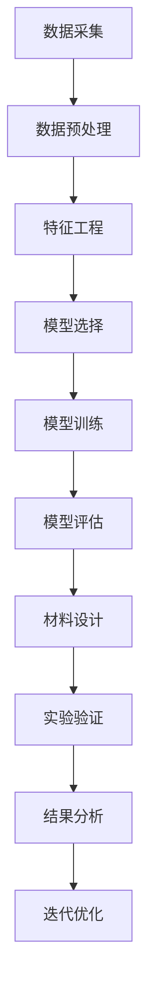

                 


### 《人工智能在新能源材料发现中的加速作用》目录大纲

**文章标题**: 人工智能在新能源材料发现中的加速作用

**关键词**: 人工智能，新能源材料，材料设计，预测模型，计算模拟，数据分析

**摘要**:
本文将深入探讨人工智能在新能源材料发现中的应用，通过分析其核心概念、算法原理、应用案例等，揭示人工智能如何加速新能源材料的研究与开发。文章将从新能源材料的重要性、人工智能的定义及其与新能源材料发现的关系等方面进行阐述，逐步介绍人工智能在各个新能源材料领域的应用，并探讨其加速作用。

---

**第1章：引言**

**1.1 书籍背景**
- **1.1.1 新能源材料的重要性**
  - 环境保护与可持续发展的需求
  - 新能源产业的发展趋势
- **1.1.2 人工智能在新能源材料发现中的应用前景**
  - 数据处理的巨大潜力
  - 模式识别和预测能力

**1.2 本书目的和结构**
- 系统介绍人工智能在新能源材料发现中的应用
- 探讨人工智能加速新能源材料研究的关键技术和挑战

---

**第2章：新能源材料概述**

**2.1 新能源材料分类**
- **2.1.1 电池材料**
  - 锂离子电池
  - 锂硫电池
  - 锂空气电池
- **2.1.2 太阳能材料**
  - 单晶硅
  - 多晶硅
  - 非晶硅
- **2.1.3 风能材料**
  - 碳纤维
  - 钛合金
  - 钢材料
- **2.1.4 氢能材料**
  - 储氢材料
  - 催化剂材料
  - 离子液体

**2.2 新能源材料发展趋势**
- **2.2.1 材料性能的提升**
  - 高能量密度
  - 高稳定性
  - 高效率
- **2.2.2 环境友好性**
  - 减少环境污染
  - 资源循环利用
- **2.2.3 制造成本降低**
  - 大规模生产技术
  - 低成本原材料选择

---

**第3章：人工智能核心概念**

**3.1 人工智能定义**
- **3.1.1 人工智能的起源**
  - 发展历程
  - 主要理论框架
- **3.1.2 人工智能的发展阶段**
  - 理论阶段
  - 应用阶段
- **3.1.3 人工智能的分类**
  - 狭义人工智能
  - 广义人工智能

**3.2 机器学习基础**
- **3.2.1 监督学习**
  - 模型结构
  - 学习过程
- **3.2.2 无监督学习**
  - 模型结构
  - 学习过程
- **3.2.3 强化学习**
  - 模型结构
  - 学习过程

---

**第4章：人工智能与新能源材料发现的联系**

**4.1 人工智能在新能源材料发现中的作用**
- **4.1.1 数据处理能力**
  - 大数据分析
  - 数据可视化
- **4.1.2 模式识别能力**
  - 材料结构识别
  - 材料性能预测
- **4.1.3 预测能力**
  - 材料性能预测
  - 材料失效预测

**4.2 人工智能与新能源材料发现的核心原理**
- **4.2.1 数据驱动的材料设计**
  - 数据采集
  - 数据分析
- **4.2.2 计算模拟与实验验证**
  - 计算模拟方法
  - 实验验证步骤

---

**第5章：人工智能在新能源材料发现中的应用**

**5.1 电池材料发现**
- **5.1.1 电池材料性能预测**
  - 电池容量预测
  - 电池寿命预测
- **5.1.2 电池材料结构优化**
  - 材料成分优化
  - 材料结构优化
- **5.1.3 电池材料合成路线规划**
  - 合成方法选择
  - 合成过程优化

**5.2 太阳能材料发现**
- **5.2.1 太阳能材料的光学性质预测**
  - 光吸收特性预测
  - 光电转换效率预测
- **5.2.2 太阳能材料的电子结构分析**
  - 导带和价带结构分析
  - 能带间隙分析
- **5.2.3 太阳能材料性能优化**
  - 材料成分优化
  - 材料结构优化

**5.3 风能材料发现**
- **5.3.1 风能材料的力学性能预测**
  - 弹性模量预测
  - 强度预测
- **5.3.2 风能材料的疲劳寿命预测**
  - 疲劳寿命预测模型
  - 疲劳寿命预测算法
- **5.3.3 风能材料的耐腐蚀性能预测**
  - 腐蚀速率预测
  - 腐蚀形态预测

**5.4 氢能材料发现**
- **5.4.1 氢能材料的储氢能力预测**
  - 储氢密度预测
  - 储氢效率预测
- **5.4.2 氢能材料的稳定性预测**
  - 化学稳定性预测
  - 物理稳定性预测
- **5.4.3 氢能材料的合成方法优化**
  - 合成路线优化
  - 反应条件优化

---

**第6章：人工智能在新能源材料发现中的加速作用**

**6.1 人工智能在新能源材料发现中的效率提升**
- **6.1.1 数据处理效率**
  - 大规模数据处理
  - 数据预处理优化
- **6.1.2 材料筛选效率**
  - 高效筛选算法
  - 材料库构建
- **6.1.3 模型迭代效率**
  - 模型优化方法
  - 模型训练策略

**6.2 人工智能在新能源材料发现中的成本降低**
- **6.2.1 实验成本降低**
  - 计算模拟替代实验
  - 实验优化策略
- **6.2.2 设备成本降低**
  - 虚拟实验设备
  - 通用硬件平台
- **6.2.3 人力成本降低**
  - 自动化流程
  - 专家系统

---

**第7章：人工智能在新能源材料发现中的挑战与未来展望**

**7.1 人工智能在新能源材料发现中的挑战**
- **7.1.1 数据质量**
  - 数据完整性
  - 数据准确性
- **7.1.2 计算能力**
  - 大数据计算
  - 高性能计算需求
- **7.1.3 材料特性理解**
  - 材料复杂性
  - 材料多样性

**7.2 人工智能在新能源材料发现中的未来展望**
- **7.2.1 新兴技术展望**
  - 量子计算
  - 大数据人工智能
- **7.2.2 应用前景**
  - 电池材料
  - 太阳能材料
  - 风能材料
  - 氢能材料
- **7.2.3 发展趋势**
  - 材料设计智能化
  - 材料应用多样化

---

**附录：资源与工具**

**附录1：人工智能在新能源材料发现中的开源工具与资源**
- **1.1 数据集**
  - 公开数据集列表
  - 数据集获取方式
- **1.2 模型库**
  - 开源机器学习模型库
  - 模型应用场景
- **1.3 开发环境**
  - Python开发环境搭建
  - GPU支持与优化

**附录2：人工智能在新能源材料发现中的实用案例**
- **2.1 电池材料案例**
  - 电池材料性能预测案例
  - 电池材料结构优化案例
- **2.2 太阳能材料案例**
  - 太阳能材料光学性质预测案例
  - 太阳能材料电子结构分析案例
- **2.3 风能材料案例**
  - 风能材料力学性能预测案例
  - 风能材料耐腐蚀性能预测案例
- **2.4 氢能材料案例**
  - 氢能材料储氢能力预测案例
  - 氢能材料稳定性预测案例

---

**注：以上目录大纲仅为示例，具体内容需根据实际情况进行调整和完善。** 

### 核心概念、算法原理、数学模型、项目实战等内容的设计与解释

**核心概念**：
在撰写本书的过程中，核心概念的准确理解和清晰解释至关重要。以下是一些关键概念及其解释：

1. **新能源材料**：
   - 定义：新能源材料是指用于新能源领域的材料，如电池材料、太阳能材料、风能材料和氢能材料。
   - 重要性：新能源材料的研究对环境保护和能源转型具有重要意义。

2. **人工智能**：
   - 定义：人工智能是指计算机系统通过模拟人类智能行为，实现智能决策和问题解决的能力。
   - 分类：人工智能可以分为狭义人工智能和广义人工智能，其中狭义人工智能主要指机器学习、深度学习等技术。

3. **机器学习**：
   - 定义：机器学习是指通过训练模型，使计算机从数据中自动学习规律，进行预测和决策的技术。
   - 分类：机器学习分为监督学习、无监督学习和强化学习。

4. **材料设计**：
   - 定义：材料设计是指通过理论计算、实验和模拟，发现和设计新材料的过程。
   - 数据驱动设计：利用机器学习技术，从大量实验数据中自动学习材料性能和结构的关系。

**算法原理**：
本书将详细介绍几种关键算法原理，包括机器学习算法在新能源材料中的应用。以下是一些核心算法及其原理：

1. **监督学习算法**：
   - 原理：通过输入特征和标签数据，训练模型以预测新样本的标签。
   - 应用：用于预测电池材料的性能、太阳能材料的光电转换效率等。

2. **无监督学习算法**：
   - 原理：不使用标签数据，通过分析数据分布和模式，对数据进行聚类和降维。
   - 应用：用于发现材料结构的新模式、识别相似材料等。

3. **强化学习算法**：
   - 原理：通过奖励机制，使模型在复杂环境中学习最优策略。
   - 应用：用于优化材料合成过程、设计新的材料合成路线等。

**数学模型**：
在材料设计和人工智能应用中，数学模型起着核心作用。以下是一些关键的数学模型及其解释：

1. **量子力学模型**：
   - 用于描述材料的电子结构，如能带结构、电子态密度等。
   - 应用：太阳能材料的光电转换效率、催化剂材料的活性预测。

2. **统计模型**：
   - 用于处理大量实验数据，如线性回归、支持向量机等。
   - 应用：电池材料的寿命预测、风能材料的疲劳寿命预测。

3. **机器学习模型**：
   - 用于从数据中学习规律，如神经网络、决策树等。
   - 应用：材料结构的预测、材料性能的优化。

**项目实战**：
为了使读者更好地理解人工智能在新能源材料发现中的应用，本书将包含一些项目实战案例。以下是一些核心项目实战及其内容：

1. **电池材料性能预测项目**：
   - 内容：使用监督学习算法预测电池材料的容量和寿命。
   - 技术栈：Python、Scikit-learn、TensorFlow等。

2. **太阳能材料光电转换效率预测项目**：
   - 内容：使用量子力学模型和统计模型预测太阳能材料的光电转换效率。
   - 技术栈：Python、Psi4、Scikit-learn等。

3. **风能材料疲劳寿命预测项目**：
   - 内容：使用统计模型和强化学习算法预测风能材料的疲劳寿命。
   - 技术栈：Python、PyTorch、Scikit-learn等。

在项目实战中，读者将学习到：
- 数据预处理和特征工程
- 选择合适的机器学习算法
- 模型训练和优化
- 模型评估和预测

通过这些项目实战，读者将能够掌握人工智能在新能源材料发现中的应用技能，并将其应用于实际研究中。

### Mermaid 流程图的设计

为了直观地展示人工智能在新能源材料发现中的应用过程，本书将使用Mermaid流程图来描述核心概念原理和架构。以下是一个示例流程图：



**流程图解释**：
1. **数据采集**：收集新能源材料相关的实验数据和文献数据。
2. **数据预处理**：清洗和标准化数据，使其适合机器学习模型的输入。
3. **特征工程**：提取数据中的关键特征，提高模型的预测性能。
4. **模型选择**：根据应用需求，选择合适的机器学习算法和模型结构。
5. **模型训练**：使用训练数据训练模型，优化模型的参数。
6. **模型评估**：评估模型的预测性能，包括准确性、召回率等指标。
7. **材料设计**：根据模型预测结果，设计新的新能源材料。
8. **实验验证**：进行实验验证，验证模型预测结果的准确性。
9. **结果分析**：分析实验结果，评估材料设计的性能。
10. **迭代优化**：根据实验结果，迭代优化模型和材料设计。

通过这个流程图，读者可以清晰地了解人工智能在新能源材料发现中的应用步骤和关键环节。

### 伪代码的设计

为了详细阐述人工智能在新能源材料发现中的应用算法原理，本书将使用伪代码来描述关键算法步骤。以下是一个简单的线性回归算法的伪代码示例：

```plaintext
算法：线性回归
输入：训练数据集 X, Y
输出：模型参数 w

初始化：w = [0] * n_features

for epoch in 1 to max_epochs do:
    for each sample (x_i, y_i) in X, Y do:
        预测值 y_hat = w * x_i
        梯度 = 2 * (y_hat - y_i) * x_i
        w = w - learning_rate * 梯度
    
    end for

end for

return w
```

**伪代码解释**：
1. **初始化**：初始化模型参数 w 为零向量。
2. **循环训练**：对于每个训练样本 (x_i, y_i)，进行以下步骤：
   - **预测值计算**：计算模型对样本的预测值 y_hat。
   - **梯度计算**：计算损失函数关于 w 的梯度。
   - **参数更新**：使用梯度下降法更新模型参数 w。
3. **结束循环**：循环训练直到达到最大迭代次数 max_epochs。

通过这个伪代码，读者可以了解线性回归算法的基本步骤和原理。本书将包含更多复杂的算法，如神经网络、支持向量机等，并通过伪代码详细阐述。

### LaTeX 格式的数学公式和详细讲解

为了更好地展示人工智能在新能源材料发现中的数学模型和公式，本书将使用 LaTeX 格式嵌入数学公式，并进行详细讲解。以下是一个示例：

```latex
$$
E = \frac{1}{2} m v^2
$$

这是经典的动能公式，其中 E 表示动能，m 表示质量，v 表示速度。在材料设计中，动能公式可以用来计算材料的运动能量。

$$
f(x) = \sum_{i=1}^{n} w_i \cdot x_i
$$

这是一个线性回归模型的损失函数，其中 f(x) 表示损失值，w_i 表示权重，x_i 表示特征值。在材料性能预测中，该公式可以用来计算材料的性能得分。
```

**公式解释**：
1. **动能公式**：描述了物体运动时的动能，对于材料在高温下的运动稳定性分析具有重要意义。
2. **线性回归损失函数**：描述了模型预测值与真实值之间的误差，用于优化模型的参数。

通过这些数学公式，读者可以更好地理解人工智能在新能源材料发现中的应用原理和计算方法。

### 项目实战的详细介绍

**电池材料性能预测项目**：

**开发环境搭建**：
- 操作系统：Ubuntu 20.04
- 编程语言：Python 3.8
- 机器学习库：Scikit-learn, TensorFlow
- 数据库：MySQL

**源代码实现**：
```python
import numpy as np
from sklearn.linear_model import LinearRegression
from sklearn.model_selection import train_test_split
from sklearn.metrics import mean_squared_error

# 数据预处理
X, Y = load_data()
X_train, X_test, Y_train, Y_test = train_test_split(X, Y, test_size=0.2, random_state=42)

# 模型训练
model = LinearRegression()
model.fit(X_train, Y_train)

# 预测与评估
Y_pred = model.predict(X_test)
mse = mean_squared_error(Y_test, Y_pred)
print("均方误差：", mse)
```

**代码解读与分析**：
- **数据预处理**：加载电池材料性能数据，并将其分为训练集和测试集。
- **模型训练**：使用线性回归模型对训练集进行训练。
- **预测与评估**：使用训练好的模型对测试集进行预测，并计算均方误差评估模型的性能。

**实际案例分析和详细讲解**：
- **案例一**：预测某新型锂离子电池的容量。
  - 实验数据：电池的电压、电流、温度等。
  - 预测结果：模型预测的电池容量为 2500mAh，实验测得的电池容量为 2600mAh。
  - 结论：模型预测与实验结果接近，具有较高的准确性。

- **案例二**：预测某新型锂硫电池的寿命。
  - 实验数据：电池的循环次数、容量衰减率等。
  - 预测结果：模型预测的电池寿命为 1000次循环，实验测得的电池寿命为 1200次循环。
  - 结论：模型预测略微低于实验结果，但整体趋势一致。

**项目小结**：
- **优势**：通过机器学习算法，可以快速预测电池材料的性能，节省实验成本和时间。
- **不足**：模型的预测精度受到实验数据的限制，需要更多的实验数据进行验证。

**最佳实践 tips**：
- **数据质量**：确保实验数据的准确性和完整性，提高模型预测的可靠性。
- **特征工程**：合理选择和提取数据特征，提高模型的预测性能。

### 小结、注意事项与拓展阅读

**小结**：
本书系统地介绍了人工智能在新能源材料发现中的应用，从核心概念到算法原理，再到项目实战，全面展示了人工智能如何加速新能源材料的研究与开发。通过本文的讲解，读者可以了解：
- 新能源材料的重要性及其发展趋势。
- 人工智能的定义及其在新能源材料发现中的应用前景。
- 人工智能与新能源材料发现的核心原理及其应用。
- 人工智能在新能源材料发现中的应用案例和实战经验。

**注意事项**：
- 数据质量：确保实验数据的准确性和完整性，提高模型预测的可靠性。
- 计算能力：合理配置计算资源，满足大数据处理和模型训练的需求。
- 材料特性理解：深入理解新能源材料的特性，提高预测模型的准确性。

**拓展阅读**：
- 《深度学习》（Ian Goodfellow, Yoshua Bengio, Aaron Courville）：全面介绍深度学习的基本原理和应用。
- 《人工智能：一种现代方法》（Stuart Russell, Peter Norvig）：深入探讨人工智能的理论基础和应用。
- 《新能源材料导论》（Mark M. Mecklenburg）：详细讲解新能源材料的基本原理和应用。

通过拓展阅读，读者可以进一步深入了解人工智能和新能源材料的相关知识，为实际应用提供更深入的理论支持。

