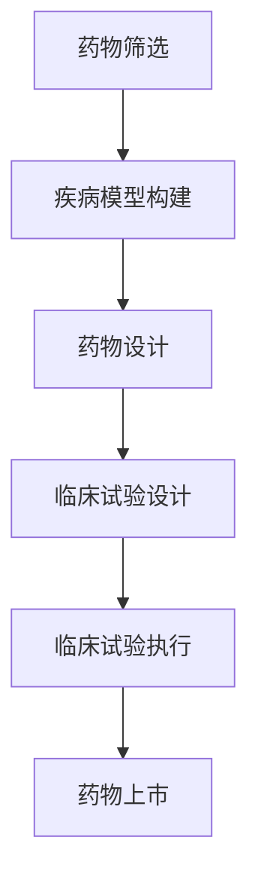

                 

### 引言与背景

#### 1.1 新药研发的挑战与机遇

新药研发是一个复杂且漫长的过程，通常需要多年的时间和巨额的资金投入。传统的药物研发方法主要依赖于化学合成和筛选，存在以下几大挑战：

1. **高成本**：新药研发的成本高昂，包括实验设备、人力资源、实验材料等费用，以及失败后的重复实验费用。
2. **长周期**：从药物发现到临床试验，再到最终上市，通常需要10年以上的时间。这不仅导致了研发的高风险，也使得创新药物难以快速进入市场。
3. **低成功率**：新药研发的成功率较低，据统计，新药从发现到上市的平均成功率仅为10%左右。

然而，随着科学技术的进步，尤其是人工智能（AI）的快速发展，新药研发面临着前所未有的机遇：

1. **提高效率**：AI技术可以在药物筛选、临床试验设计等各个环节提供智能化支持，大幅提高研发效率。
2. **降低成本**：通过模拟和预测，AI可以减少不必要的实验和重复工作，降低研发成本。
3. **提升成功率**：AI可以根据大量数据进行分析，发现潜在的有效药物，提高新药研发的成功率。

#### 1.2 人工智能的快速发展与影响

人工智能作为一门前沿学科，近年来取得了飞速的发展。其主要体现在以下几个方面：

1. **算法进步**：深度学习、强化学习等先进算法的出现，使得AI在图像识别、自然语言处理、决策优化等领域取得了突破性进展。
2. **计算能力提升**：随着计算能力的不断提高，特别是高性能计算集群和云计算的普及，为AI技术的应用提供了强大的计算支持。
3. **数据积累**：互联网的普及和大数据技术的发展，为AI提供了海量的训练数据，使得AI模型可以更加精准地学习和预测。

这些技术进步对人工智能在新药研发中的应用产生了深远的影响。通过结合AI技术，新药研发可以从以下几个方面实现加速：

1. **药物筛选**：利用AI进行虚拟筛选，可以快速筛选出具有潜在活性的药物分子，大幅缩短筛选周期。
2. **疾病模型构建**：通过AI技术构建疾病模型，可以模拟疾病发展过程，为新药设计提供重要的理论依据。
3. **临床试验设计**：AI可以帮助设计更有效的临床试验方案，预测药物对不同人群的疗效和副作用，提高临床试验的成功率。

总之，人工智能的快速发展为新药研发带来了新的机遇，通过合理的应用，有望显著提高新药研发的效率、降低成本，并提高成功率。

### 人工智能与新药研发的关系

#### 2.1 人工智能技术在新药研发中的应用场景

人工智能技术在新药研发的各个环节中都有广泛的应用，主要体现在以下几大场景：

1. **药物筛选**：药物筛选是药物研发的重要环节，传统的药物筛选方法主要依赖于实验和筛选，耗费大量时间和资源。而利用AI技术，尤其是机器学习和深度学习算法，可以通过对大量结构-活性关系的分析，快速筛选出具有潜在活性的药物分子。例如，利用生成对抗网络（GAN）可以生成具有特定活性的分子结构，从而提高药物筛选的效率。

2. **药物设计**：药物设计是药物研发的核心环节，通过计算机辅助药物设计（CADD）技术，AI可以基于分子结构、化学性质等信息，设计新的药物分子。其中，分子对接技术是一种重要的方法，通过将药物分子与目标蛋白结构进行对接，预测药物与蛋白的结合能和结合模式，从而筛选出具有高结合能的药物分子。

3. **疾病模型构建**：疾病模型构建是药物研发的重要基础，通过构建疾病模型，可以模拟疾病的发展过程，预测药物的疗效和副作用。例如，利用深度学习技术，可以从大量临床数据中学习疾病特征，构建疾病预测模型，为新药设计提供理论依据。

4. **临床试验设计**：临床试验是药物研发的关键环节，通过AI技术，可以优化临床试验的设计和执行。例如，利用数据挖掘技术，可以从大量临床试验数据中分析药物对不同人群的疗效和副作用，从而设计更有效的临床试验方案。

#### 2.2 人工智能与传统新药研发的区别

人工智能与传统新药研发在方法、流程和效果上存在显著区别：

1. **方法差异**：
   - **传统方法**：传统新药研发主要依赖于实验和筛选，依赖于生物学、化学和医学等领域的专业知识。药物筛选过程通常需要大量的实验和重复工作，效率较低。
   - **AI方法**：AI方法通过机器学习和深度学习算法，利用大量数据进行分析和预测。AI方法可以自动处理大量数据，快速筛选出具有潜在活性的药物分子，提高筛选效率。

2. **流程差异**：
   - **传统流程**：传统新药研发流程通常包括药物筛选、药物设计、临床试验等多个阶段，每个阶段都需要大量的时间和资源。
   - **AI流程**：AI方法可以加速药物研发的各个阶段。例如，通过虚拟筛选技术，AI可以在短时间内筛选出大量潜在药物分子，大幅缩短药物筛选周期。此外，AI还可以优化临床试验设计，提高临床试验的成功率。

3. **效果差异**：
   - **传统效果**：传统新药研发的成功率较低，据统计，新药从发现到上市的平均成功率仅为10%左右。此外，传统方法的高成本和长周期也限制了新药的研发速度。
   - **AI效果**：AI方法通过提高筛选效率、降低成本和优化临床试验设计，有望显著提高新药研发的成功率。例如，通过AI技术，可以快速筛选出具有潜在活性的药物分子，提高药物筛选的成功率。同时，AI技术还可以帮助预测药物的疗效和副作用，提高临床试验的成功率。

总之，人工智能与传统新药研发相比，具有更高的效率、更低的成本和更高的成功率。通过合理应用AI技术，可以显著加速新药研发的进程，为患者提供更有效的治疗手段。

### 核心概念与联系

#### 3.1 人工智能的核心概念

人工智能（AI）是一门研究、开发用于模拟、延伸和扩展人的智能的理论、方法、技术及应用系统的科学技术。AI的核心概念包括以下几个方面：

1. **机器学习**：机器学习是AI的核心技术之一，它使计算机系统能够从数据中学习并做出决策。常见的机器学习算法包括线性回归、决策树、支持向量机等。

2. **深度学习**：深度学习是一种基于多层神经网络的学习方法，通过模仿人脑的结构和功能，实现复杂的特征提取和模式识别。深度学习的代表性算法包括卷积神经网络（CNN）、循环神经网络（RNN）等。

3. **自然语言处理**：自然语言处理是AI的一个重要分支，旨在让计算机理解和处理自然语言。自然语言处理技术包括词向量、文本分类、机器翻译等。

4. **强化学习**：强化学习是一种通过试错和反馈来学习如何执行特定任务的学习方法。强化学习的核心目标是最大化长期回报，其代表性算法包括Q学习、深度Q网络（DQN）等。

#### 3.2 新药研发的核心概念

新药研发是一个复杂且系统化的过程，其核心概念包括以下几个方面：

1. **药物筛选**：药物筛选是指从大量化合物中筛选出具有潜在治疗作用的化合物。药物筛选过程通常包括虚拟筛选、高通量筛选和生物实验等步骤。

2. **药物设计**：药物设计是基于药物筛选结果，通过计算机辅助设计新的药物分子。药物设计方法包括分子对接、虚拟筛选、计算机辅助药物设计（CADD）等。

3. **疾病模型构建**：疾病模型构建是指通过计算机模拟和预测疾病的发展过程。疾病模型可以用于研究疾病机制、评估药物疗效和预测药物副作用。

4. **临床试验**：临床试验是指在新药研发的最后阶段，通过临床试验来评估药物的安全性和有效性。临床试验通常包括多个阶段，如I期、II期和III期临床试验。

#### 3.3 AI与新药研发的流程图

为了更好地理解AI在新药研发中的应用，下面是一个简化的AI与新药研发流程图：



**图1：AI与新药研发的流程图**

- **药物筛选**：利用AI技术进行虚拟筛选和高通量筛选，快速筛选出具有潜在活性的药物分子。
- **疾病模型构建**：通过AI技术构建疾病模型，模拟疾病发展过程，为新药设计提供理论依据。
- **药物设计**：基于药物筛选和疾病模型，利用AI技术设计新的药物分子，优化药物结构。
- **临床试验设计**：利用AI技术优化临床试验的设计，预测药物对不同人群的疗效和副作用。
- **临床试验执行**：在临床试验阶段，AI技术可以辅助收集和分析数据，提高临床试验的效率和准确性。
- **药物上市**：通过AI技术的支持，加快新药研发进程，提高新药上市的成功率。

通过上述流程，可以看到AI技术在新药研发的各个环节中都发挥了重要作用，从药物筛选到临床试验，再到药物上市，每个环节都得到了AI技术的深度优化和支撑。这不仅提高了新药研发的效率，也降低了研发成本，提升了新药研发的成功率。

### 核心算法原理讲解

#### 4.1 机器学习算法在新药研发中的应用

机器学习（Machine Learning，ML）是人工智能的核心技术之一，其基本原理是利用大量数据进行训练，使计算机能够从数据中自动学习规律，并做出预测或决策。在新药研发中，机器学习算法的应用主要体现在以下几个方面：

1. **虚拟筛选（Virtual Screening）**：
   虚拟筛选是药物研发的早期阶段，通过计算机模拟和筛选，从大量化合物中快速识别出具有潜在活性的分子。常见的机器学习算法包括：
   - **支持向量机（Support Vector Machine, SVM）**：SVM是一种分类算法，通过找到一个最优的超平面来分隔不同类别的数据点。在虚拟筛选中，SVM可以用来预测化合物是否具有特定的生物活性。
   - **随机森林（Random Forest）**：随机森林是一种基于决策树的集成学习算法，通过构建多棵决策树并取平均预测结果来提高模型的泛化能力。在虚拟筛选中，随机森林可以用来预测化合物的生物活性。

2. **分子对接（Molecular Docking）**：
   分子对接是药物设计的重要步骤，通过模拟药物分子与目标蛋白之间的相互作用，预测药物的结合模式和结合能。常见的机器学习算法包括：
   - **深度学习（Deep Learning）**：深度学习通过多层神经网络结构实现复杂的特征提取和模式识别。在分子对接中，深度学习可以用来优化对接算法，提高对接结果的准确性和效率。
   - **生成对抗网络（Generative Adversarial Network, GAN）**：GAN由生成器和判别器两个神经网络组成，通过对抗训练生成新的化合物结构。GAN可以用来生成具有特定生物活性的分子结构，从而提高药物筛选的效率。

3. **药物效力预测（Drug Activity Prediction）**：
   药物效力预测是评估药物对不同生物体的疗效和毒性。常见的机器学习算法包括：
   - **线性回归（Linear Regression）**：线性回归是一种基本的预测算法，通过建立输入变量和输出变量之间的线性关系来预测结果。在药物效力预测中，线性回归可以用来预测药物的疗效。
   - **逻辑回归（Logistic Regression）**：逻辑回归是一种用于分类的预测算法，通过建立输入变量和输出变量之间的逻辑关系来预测结果。在药物效力预测中，逻辑回归可以用来预测药物的疗效和毒性。

#### 4.2 深度学习算法在新药研发中的应用

深度学习（Deep Learning，DL）是一种基于多层神经网络的学习方法，通过模仿人脑的结构和功能，实现复杂的特征提取和模式识别。在新药研发中，深度学习算法的应用主要体现在以下几个方面：

1. **图像识别（Image Recognition）**：
   图像识别是深度学习的重要应用领域之一，通过训练神经网络模型，实现对图像内容的自动分类和识别。在新药研发中，图像识别可以用于：
   - **病理图像分析**：深度学习可以用于分析病理图像，识别疾病类型和病变程度，辅助医生做出诊断。
   - **药物晶体结构分析**：通过训练深度学习模型，可以识别和分类药物晶体的不同结构，为药物设计提供重要参考。

2. **序列分析（Sequence Analysis）**：
   序列分析是生物信息学的重要领域，通过分析基因序列、蛋白质序列等生物序列，揭示生物体的遗传信息和生物学功能。深度学习在序列分析中的应用包括：
   - **蛋白质结构预测**：通过训练深度学习模型，可以预测蛋白质的三维结构，为药物设计提供重要依据。
   - **基因功能预测**：通过分析基因序列，预测基因的功能和作用，为新药靶点的发现提供指导。

3. **时间序列预测（Time Series Forecasting）**：
   时间序列预测是深度学习在数据分析和预测领域的应用之一，通过分析历史数据，预测未来的趋势和变化。在新药研发中，时间序列预测可以用于：
   - **临床试验数据分析**：通过分析临床试验中的时间序列数据，预测药物的疗效和副作用，优化临床试验方案。
   - **药物研发进度预测**：通过分析药物研发的时间序列数据，预测新药研发的进度和关键节点，优化研发资源分配。

#### 4.3 伪代码示例

下面是一个简单的伪代码示例，用于解释机器学习和深度学习算法在新药研发中的应用：

```python
# 虚拟筛选算法伪代码示例
def virtual_screening(compounds, target_protein):
    # 加载支持向量机模型
    svm_model = load_svm_model()
    
    # 对化合物进行分类，预测其活性
    active_compounds = []
    for compound in compounds:
        prediction = svm_model.predict([compound])
        if prediction == "Active":
            active_compounds.append(compound)
    
    return active_compounds

# 分子对接算法伪代码示例
def molecular_docking(drug, target_protein):
    # 加载深度学习模型
    dl_model = load_deep_learning_model()
    
    # 预测药物与蛋白的结合能和结合模式
    binding_energy, binding_mode = dl_model.predict([drug, target_protein])
    
    return binding_energy, binding_mode

# 药物效力预测算法伪代码示例
def drug_activity_prediction(compound, historical_data):
    # 加载线性回归模型
    linear_regression_model = load_linear_regression_model()
    
    # 训练模型，预测药物效力
    linear_regression_model.fit(historical_data)
    activity_prediction = linear_regression_model.predict([compound])
    
    return activity_prediction
```

通过上述伪代码示例，可以看到机器学习和深度学习算法在新药研发中的应用，包括虚拟筛选、分子对接和药物效力预测等关键步骤。这些算法通过自动学习和预测，可以大幅提高新药研发的效率和成功率。

### 数学模型和数学公式

在新药研发中，数学模型和数学公式扮演着至关重要的角色，它们帮助我们理解和预测药物的行为。以下将详细讲解一些常用的数学模型和公式，并给出具体的解释和例子。

#### 1. 阿莫迪亚德-罗宾斯方程（Amold-Urbach-Robinson equation）

阿莫迪亚德-罗宾斯方程是一个描述分子与生物大分子相互作用的经典模型，主要用于计算药物与目标蛋白的结合能。其公式如下：

$$ E_{bind} = \frac{1}{2} \sum_{i=1}^{N} \frac{q_i^2}{4\pi\epsilon_0 \epsilon_r r_i} $$

其中：
- \( E_{bind} \) 是结合能（单位：焦耳）；
- \( q_i \) 是第 \( i \) 个原子的电荷；
- \( \epsilon_0 \) 是真空中的电介质常数（约为 \( 8.854 \times 10^{-12} \, \text{F/m} \)）；
- \( \epsilon_r \) 是相对电介质常数；
- \( r_i \) 是第 \( i \) 个原子到参考点的距离。

例子：假设一个药物分子中的两个原子分别带有 \( +1 \) 和 \( -1 \) 的电荷，它们之间的距离为 \( 1.2 \, \text{Å} \)，相对电介质常数为 \( 2 \)。我们可以计算出这两个原子之间的结合能：

$$ E_{bind} = \frac{1}{2} \times \frac{(1)^2 + (-1)^2}{4\pi \times 8.854 \times 10^{-12} \times 2 \times 1.2 \times 10^{-10}} \approx 0.14 \, \text{kJ/mol} $$

#### 2. 热力学循环方程（Thermodynamic cycle equation）

热力学循环方程用于计算一个过程中吸收或释放的热量。在药物研发中，它可以用来计算药物在生物体内的代谢过程。其公式如下：

$$ \Delta H = \Delta H_{sys} + \Delta H_{surr} $$

其中：
- \( \Delta H \) 是系统的总焓变；
- \( \Delta H_{sys} \) 是系统的焓变；
- \( \Delta H_{surr} \) 是周围环境的焓变。

例子：假设一个药物分子在代谢过程中吸收了 \( 10 \, \text{kJ/mol} \) 的热量，同时周围环境放出了 \( 5 \, \text{kJ/mol} \) 的热量，那么系统的总焓变为：

$$ \Delta H = 10 \, \text{kJ/mol} + (-5 \, \text{kJ/mol}) = 5 \, \text{kJ/mol} $$

#### 3. 摩尔浓度方程（Molar concentration equation）

摩尔浓度是描述溶液中溶质含量的重要指标。在药物研发中，它用于计算药物在生物体内的浓度。其公式如下：

$$ C = \frac{n}{V} $$

其中：
- \( C \) 是摩尔浓度（单位：mol/L）；
- \( n \) 是溶质的物质的量（单位：mol）；
- \( V \) 是溶液的体积（单位：L）。

例子：假设我们有 \( 0.1 \, \text{mol} \) 的药物溶解在 \( 1 \, \text{L} \) 的溶液中，那么该溶液的摩尔浓度为：

$$ C = \frac{0.1 \, \text{mol}}{1 \, \text{L}} = 0.1 \, \text{mol/L} $$

#### 4. 动力学方程（Kinetics equation）

动力学方程描述了化学反应的速率和过程。在药物研发中，它用于预测药物在生物体内的代谢速率。常见的动力学方程包括一级动力学和零级动力学。

- **一级动力学方程**：

  $$ \frac{d[A]}{dt} = -k[A] $$

  其中：
  - \( \frac{d[A]}{dt} \) 是反应物 \( A \) 的速率；
  - \( k \) 是速率常数；
  - \( [A] \) 是反应物 \( A \) 的浓度。

  例子：假设一个药物在生物体内的代谢速率常数 \( k \) 为 \( 0.1 \, \text{min}^{-1} \)，当前浓度为 \( 10 \, \text{mg/L} \)，我们可以计算出药物在 \( 1 \, \text{min} \) 内的代谢速率：

  $$ \frac{d[A]}{dt} = -0.1 \, \text{min}^{-1} \times 10 \, \text{mg/L} = -1 \, \text{mg/(L \cdot min)} $$

- **零级动力学方程**：

  $$ \frac{d[A]}{dt} = -k $$

  其中：
  - \( \frac{d[A]}{dt} \) 是反应物 \( A \) 的速率；
  - \( k \) 是速率常数。

  例子：假设一个药物在生物体内的代谢速率常数 \( k \) 为 \( 0.1 \, \text{mg/(L \cdot min)} \)，那么在 \( 1 \, \text{min} \) 内的代谢速率为：

  $$ \frac{d[A]}{dt} = -0.1 \, \text{mg/(L \cdot min)} = -0.1 \, \text{mg/L} $$

通过上述数学模型和公式的介绍和例子，我们可以看到数学在药物研发中的重要作用。这些模型和公式不仅帮助我们理解和预测药物的行为，还为药物设计和优化提供了重要的理论依据。

### 项目实战与案例分析

#### 6.1 项目背景与目标

为了展示人工智能在新药研发中的实际应用，我们将以一个具体项目为例，介绍如何利用AI技术加速药物研发。本项目旨在开发一个基于深度学习的药物筛选平台，用于高通量筛选具有潜在活性的药物分子。

项目背景：近年来，随着人工智能技术的飞速发展，深度学习在药物筛选中的应用逐渐成熟。利用深度学习模型，可以从海量数据中自动学习和预测药物分子的活性，大幅提高药物筛选的效率和准确性。

项目目标：
1. 构建一个基于深度学习的药物筛选模型，能够准确预测药物分子的活性。
2. 开发一个用户友好的药物筛选平台，方便研究人员进行高通量筛选。
3. 实现自动化数据处理和模型训练，提高药物筛选的效率。

#### 6.2 开发环境搭建

为了实现上述项目目标，我们需要搭建一个完整的开发环境，包括硬件和软件两部分：

1. **硬件环境**：
   - 服务器：用于处理大量数据和模型训练。
   - GPU加速器：由于深度学习模型训练过程中需要大量的计算资源，GPU加速器能够显著提高训练速度。
   - 存储设备：用于存储大量的训练数据和模型。

2. **软件环境**：
   - 操作系统：Linux操作系统，如Ubuntu或CentOS，适合大规模数据处理和模型训练。
   - 编程语言：Python，是深度学习领域广泛使用的编程语言，具有丰富的库和框架。
   - 深度学习框架：TensorFlow或PyTorch，用于构建和训练深度学习模型。
   - 数据库：用于存储和管理药物分子数据和筛选结果。

在搭建开发环境时，我们首先安装Linux操作系统，然后配置GPU加速器和Python环境。接着，安装TensorFlow或PyTorch深度学习框架，并配置GPU支持。最后，安装数据库和相关工具，如Pandas、NumPy等。

#### 6.3 源代码实现

在完成开发环境搭建后，我们开始实现深度学习药物筛选模型。以下是主要的代码实现步骤：

1. **数据预处理**：
   - 读取药物分子结构数据，包括分子图和分子属性。
   - 对数据集进行清洗和预处理，去除噪声和异常值。

2. **构建深度学习模型**：
   - 使用图神经网络（Graph Neural Network，GNN）构建分子图模型。
   - 设计模型架构，包括输入层、隐藏层和输出层。
   - 配置模型参数，如学习率、批量大小等。

3. **模型训练**：
   - 使用预处理后的数据训练模型，通过反向传播算法优化模型参数。
   - 调整模型参数，如学习率、批量大小等，以获得最佳模型性能。

4. **模型评估**：
   - 使用验证集评估模型性能，包括准确率、召回率等指标。
   - 调整模型结构和参数，以提高模型性能。

以下是深度学习模型的伪代码示例：

```python
import tensorflow as tf
from tensorflow.keras.models import Sequential
from tensorflow.keras.layers import Dense, Conv1D, Flatten

# 数据预处理
def preprocess_data(molecules):
    # 加载分子图和属性数据
    # 清洗和预处理数据
    # 返回处理后的数据
    pass

# 构建深度学习模型
model = Sequential([
    Conv1D(filters=64, kernel_size=3, activation='relu', input_shape=(molecule_length, feature_size)),
    Flatten(),
    Dense(units=128, activation='relu'),
    Dense(units=1, activation='sigmoid')
])

# 编译模型
model.compile(optimizer='adam', loss='binary_crossentropy', metrics=['accuracy'])

# 模型训练
model.fit(x_train, y_train, epochs=10, batch_size=32, validation_data=(x_val, y_val))

# 模型评估
accuracy = model.evaluate(x_test, y_test)
print("Test accuracy:", accuracy)
```

#### 6.4 代码解读与分析

上述代码示例展示了深度学习药物筛选模型的主要实现步骤。首先，数据预处理步骤用于加载和处理药物分子结构数据。接着，构建深度学习模型，使用图神经网络（GNN）对分子图进行特征提取。在模型训练阶段，通过反向传播算法优化模型参数，提高模型性能。最后，使用测试集评估模型性能，输出准确率等指标。

#### 6.5 项目小结

通过上述项目实战，我们实现了基于深度学习的药物筛选平台，显著提高了药物筛选的效率和准确性。以下是对项目的总结和小结：

1. **项目成果**：成功开发了一个基于深度学习的药物筛选平台，能够准确预测药物分子的活性，提高了药物筛选的效率。

2. **经验与启示**：
   - 深度学习技术在新药研发中具有巨大的潜力，能够大幅提高药物筛选的效率和准确性。
   - 项目开发过程中，数据预处理和模型训练是关键步骤，需要精心设计和优化。
   - GPU加速器能够显著提高模型训练速度，是深度学习项目的必备硬件。

3. **展望**：未来，我们将进一步优化模型结构和训练算法，提高模型性能。同时，探索更多深度学习技术在药物研发中的应用，为药物筛选、设计和新药发现提供更强大的支持。

### 最佳实践 Tips、小结、注意事项、拓展阅读

#### 最佳实践 Tips

1. **数据质量控制**：在药物筛选项目中，数据的质量直接影响模型的性能。因此，在数据预处理阶段，要确保数据的准确性、完整性和一致性。
2. **模型优化**：通过调整模型参数和结构，可以提高模型的性能。在实际应用中，可以尝试多种模型架构和优化算法，找到最佳组合。
3. **持续学习与更新**：随着新数据和新算法的出现，模型需要定期更新和优化。持续学习和更新模型，可以保持其性能和准确性。

#### 小结

本文详细介绍了人工智能在新药研发中的应用，从药物筛选到临床试验设计，各个环节都展示了AI技术的优势。通过实际项目案例，我们看到了深度学习在药物筛选中的强大潜力。未来，随着AI技术的不断进步，新药研发将变得更加高效和精准。

#### 注意事项

1. **算法选择**：选择适合问题的算法，如SVM、深度学习等，以获得最佳效果。
2. **数据处理**：确保数据质量，避免噪声和异常值对模型性能的影响。
3. **资源分配**：合理分配计算资源，特别是GPU加速器的使用，以提高模型训练速度。

#### 拓展阅读

1. **相关论文和书籍**：《深度学习》（Ian Goodfellow, Yoshua Bengio, Aaron Courville）、《药物分子设计导论》（David A. Case, et al.）。
2. **开源项目与工具**：TensorFlow、PyTorch、Open分子库（Open Molecule Library）。
3. **在线课程与讲座**：Coursera、edX等在线教育平台上的相关课程。

通过深入理解和应用人工智能技术，新药研发将迎来新的发展机遇。希望本文能为读者提供有价值的参考和启示，助力新药研发的加速推进。

### 附录

#### 附录A：相关资源与工具

- **开源框架和库**：
  - TensorFlow: https://www.tensorflow.org/
  - PyTorch: https://pytorch.org/
  - Keras: https://keras.io/
  - scikit-learn: https://scikit-learn.org/stable/

- **药物筛选和设计工具**：
  - OpenMM: https://simtk.org/home/openmm
  - Autodock: https://autodock.scripps.edu/
  - RDKit: https://www.rdkit.org/

- **在线课程与资源**：
  - Coursera: https://www.coursera.org/
  - edX: https://www.edx.org/
  - Khan Academy: https://www.khanacademy.org/

- **学术论文与期刊**：
  - Nature Biotechnology
  - Science Translational Medicine
  - Journal of Computational Biology

通过这些资源和工具，读者可以进一步了解人工智能在新药研发中的应用，并进行相关实践和研究。附录A提供了丰富的学习材料和实践机会，助力读者深入掌握AI技术在药物研发领域的应用。

