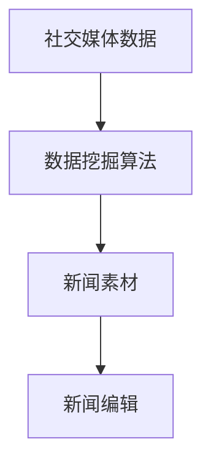
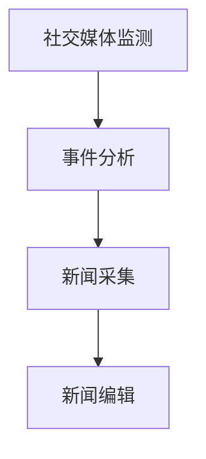
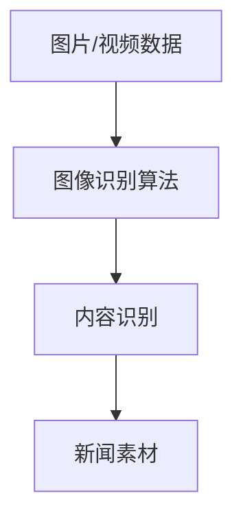
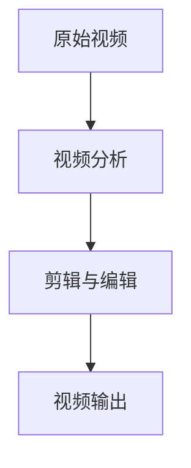

                 


### 第1步：引言与基础理论

#### 文章标题：人工智能在新闻生产中的应用与挑战

##### 关键词：人工智能，新闻生产，应用，挑战

##### 摘要：
人工智能正在重塑新闻生产，从新闻采集、编辑到推荐系统，AI技术发挥着日益重要的作用。本文将深入探讨人工智能在新闻生产中的应用，包括自动化新闻采集、内容生成、事实核查和新闻推荐等，同时分析其中的技术挑战和伦理问题。

### 第2步：人工智能在新闻采集中的应用

#### 第2章：人工智能在新闻采集中的应用

##### 2.1 自动化新闻采集技术

自动化新闻采集技术是人工智能在新闻生产中的第一个重要应用。它利用算法和程序从各种数据源自动获取新闻素材，极大地提高了新闻采集的效率。

###### 2.1.1 数据挖掘在新闻采集中的应用

数据挖掘技术可以从大量非结构化数据中提取有价值的信息，例如，通过分析社交媒体平台上的话题、评论和趋势，挖掘出潜在的新闻热点。



###### 2.1.2 社交媒体监测与新闻采集

社交媒体监测是一种通过实时跟踪和分析社交媒体上的信息流，来发现和采集新闻事件的方法。这种方法能够快速捕捉事件的发展，提供第一手资料。



##### 2.2 人工智能在图片和视频采集中的应用

除了文本数据，人工智能还可以用于图片和视频的采集和分析。通过图像识别和视频分析技术，可以自动识别事件、人物和场景，从而更高效地采集和编辑新闻素材。

###### 2.2.1 图像识别与视频分析

图像识别技术可以通过分析图片中的视觉特征，自动识别图片中的内容。视频分析则可以识别视频中的动作、场景和人物。



###### 2.2.2 自动化视频剪辑与制作

自动化视频剪辑与制作技术可以自动剪辑视频，添加字幕、特效和背景音乐，从而快速制作出专业的新闻视频。



### 第3步：人工智能在新闻编辑中的应用

#### 第3章：人工智能在新闻编辑中的应用

##### 3.1 自动化内容生成技术

自动化内容生成技术是人工智能在新闻编辑中的核心应用之一。通过文本生成模型，可以自动生成新闻文章、报道和分析。

###### 3.1.1 文本生成模型

文本生成模型是一种基于深度学习的自然语言处理技术，它可以学习大量的文本数据，并生成新的文本内容。

```python
# 文本生成模型伪代码
class TextGenerator:
    def __init__(self, model):
        self.model = model
    
    def generate_text(self, seed_text, length):
        # 使用模型生成文本
        pass
```

###### 3.1.2 图像生成模型

除了文本，人工智能还可以用于生成图像。通过图像生成模型，可以自动创建与文本描述相关的图像。

```python
# 图像生成模型伪代码
class ImageGenerator:
    def __init__(self, model):
        self.model = model
    
    def generate_image(self, text_description, size):
        # 使用模型生成图像
        pass
```

##### 3.2 人工智能在新闻事实核查中的应用

事实核查是新闻编辑中的重要环节，人工智能可以通过算法自动分析文章中的事实，并提供核查结果。

###### 3.2.1 事实核查算法

事实核查算法可以通过对文章中引用的数据、事实和引用来源进行分析，判断其真实性。

```python
# 事实核查算法伪代码
class FactChecker:
    def __init__(self, dataset):
        self.dataset = dataset
    
    def check_fact(self, text):
        # 检查文本中的事实
        pass
```

###### 3.2.2 人工智能与新闻伦理

在利用人工智能进行新闻事实核查的同时，必须考虑新闻伦理问题，确保算法的公正性和客观性。

### 第4步：人工智能在新闻生产中的核心技术

#### 第4章：自然语言处理与新闻生产

##### 4.1 自然语言处理的基本概念

自然语言处理（NLP）是人工智能的核心技术之一，它致力于使计算机能够理解、生成和处理人类语言。

###### 4.1.1 语言模型

语言模型是NLP的基础，它通过学习大量文本数据，预测下一个单词或句子的可能性。

$$
P(w_{t} | w_{t-1}, w_{t-2}, ..., w_{1}) = \text{语言模型}
$$

###### 4.1.2 词向量表示

词向量是NLP中的重要工具，它将词汇映射到高维向量空间中，使得计算机能够通过数学方法处理语言。

$$
w_{i} = \text{embedding}_{i}
$$

##### 4.2 基于自然语言处理的新闻生成

基于NLP的文本生成技术可以自动生成新闻文章，为新闻生产提供新的可能性。

###### 4.2.1 文本生成模型

文本生成模型通过学习大量新闻文本数据，可以自动生成新的新闻内容。

```python
# 文本生成模型伪代码
class TextGenerator:
    def __init__(self, model):
        self.model = model
    
    def generate_text(self, seed_text, length):
        # 使用模型生成文本
        pass
```

###### 4.2.2 模型训练与优化

训练和优化文本生成模型是新闻生成技术的关键步骤，它决定了模型生成文本的质量。

### 第5步：人工智能在新闻生产中的实际应用

#### 第5章：人工智能在新闻行业中的应用案例

##### 5.1 传统媒体的数字化转型

传统媒体正在通过数字化转型来应对人工智能带来的挑战。通过引入人工智能技术，传统媒体可以实现自动化新闻采集、编辑和推荐。

###### 5.1.1 传统媒体面临的挑战

随着互联网和社交媒体的发展，传统媒体面临着信息过载和受众流失的挑战。人工智能可以帮助传统媒体提高内容生产效率，吸引更多受众。

###### 5.1.2 数字化转型的成功案例

许多传统媒体已经成功实现了数字化转型。例如，CNN引入了自动化新闻采集技术，提高了新闻生产效率；BBC利用人工智能进行内容推荐，提升了用户满意度。

##### 5.2 新兴媒体的崛起

新兴媒体利用人工智能技术，迅速崛起并改变了新闻生产的格局。

###### 5.2.1 新兴媒体的特点

新兴媒体以速度快、互动性强和个性化推荐为特点，它们利用人工智能技术，实现了新闻的快速采集、生成和推荐。

###### 5.2.2 新兴媒体的商业模式

新兴媒体通过广告、会员订阅和付费内容等多种商业模式，实现了盈利。

### 第6步：人工智能在新闻生产中的未来发展趋势

#### 第6章：人工智能在新闻生产中的未来发展趋势

##### 6.1 人工智能在新闻生产中的未来挑战

随着人工智能技术的发展，新闻生产将面临新的挑战，如算法偏见、数据隐私和安全等问题。

###### 6.1.1 技术挑战

人工智能算法的复杂性和透明度问题，以及数据隐私和安全问题，是未来人工智能在新闻生产中需要克服的挑战。

###### 6.1.2 伦理与法律挑战

人工智能在新闻生产中的应用，将引发一系列伦理和法律问题，如算法公正性、新闻真实性等。

##### 6.2 人工智能在新闻生产中的未来机遇

尽管面临挑战，人工智能在新闻生产中仍具有巨大的机遇。

###### 6.2.1 新兴技术对新闻生产的影响

随着新兴技术的不断发展，如区块链、物联网等，新闻生产将变得更加高效、透明和可信。

###### 6.2.2 未来新闻生产模式的变化

未来新闻生产模式将更加依赖人工智能技术，实现从内容采集、编辑到推荐的全方位智能化。

### 第7步：总结与展望

#### 第7章：总结与展望

##### 7.1 人工智能在新闻生产中的关键作用

人工智能在新闻生产中发挥着越来越重要的作用，从新闻采集、编辑到推荐系统，AI技术为新闻生产带来了革命性的变化。

##### 7.2 人工智能在新闻生产中的发展趋势

未来，人工智能在新闻生产中的应用将进一步深化，实现新闻生产的智能化、透明化和可信化。

##### 7.3 人工智能与新闻伦理

在推动人工智能在新闻生产中的应用过程中，必须重视新闻伦理问题，确保新闻的真实性、公正性和客观性。

---

**作者信息：**
作者：AI天才研究院/AI Genius Institute & 禅与计算机程序设计艺术 /Zen And The Art of Computer Programming**文章标题：**人工智能在新闻生产中的应用与挑战

关键词：人工智能，新闻生产，应用，挑战，自然语言处理，机器学习，新闻推荐，新闻可视化，自动化采集，内容生成，事实核查，新闻伦理

摘要：
人工智能正在重塑新闻生产，从新闻采集、编辑到推荐系统，AI技术发挥着日益重要的作用。本文深入探讨人工智能在新闻生产中的应用，包括自动化新闻采集、内容生成、事实核查和新闻推荐等，同时分析其中的技术挑战和伦理问题。

# 第1章：人工智能与新闻生产概述

## 1.1 人工智能在新闻生产中的意义

人工智能（AI）作为现代技术的代表，其应用已经渗透到我们日常生活的方方面面。在新闻生产领域，人工智能的意义尤为显著。首先，人工智能可以显著提高新闻采集和编辑的效率，通过自动化技术，新闻机构可以更快速地获取和处理大量信息。其次，人工智能有助于提升新闻的准确性和客观性，通过事实核查和智能推荐系统，可以有效减少错误信息和偏见。此外，人工智能还能通过个性化推荐，提高用户满意度，增强媒体的竞争力。

## 1.2 人工智能在新闻生产中的应用现状

目前，人工智能在新闻生产中的应用已经取得了显著的进展。在新闻采集方面，自动化新闻采集系统可以通过爬虫技术、数据挖掘和社交媒体监测，快速获取大量新闻素材。在新闻编辑方面，人工智能可以自动生成新闻文章、视频和图片，大大提高了编辑效率。此外，人工智能在新闻推荐、事实核查和新闻可视化等领域也发挥着重要作用。例如，一些新闻机构已经引入了智能推荐系统，根据用户的兴趣和行为，为他们推荐个性化的新闻内容。

## 1.3 新闻生产中的挑战与机遇

尽管人工智能在新闻生产中带来了许多机遇，但也面临着一系列挑战。首先，数据隐私和安全问题是人工智能在新闻生产中需要关注的重要问题。新闻机构在采集和处理大量数据时，必须确保用户隐私和数据安全。其次，算法偏见和新闻真实性问题也是人工智能在新闻生产中面临的挑战。算法的偏见可能导致新闻内容的不公正，而虚假新闻的传播则可能对社会造成负面影响。然而，随着技术的不断进步和伦理问题的深入探讨，人工智能在新闻生产中的挑战有望得到解决，从而带来更多的机遇。

### 第2章：人工智能在新闻采集中的应用

#### 2.1 自动化新闻采集技术

自动化新闻采集技术是人工智能在新闻生产中的第一个重要应用，它利用算法和程序从各种数据源自动获取新闻素材，从而极大地提高了新闻采集的效率。以下我们将详细探讨数据挖掘、社交媒体监测以及图像和视频采集方面的技术。

##### 2.1.1 数据挖掘在新闻采集中的应用

数据挖掘是一种通过分析大量数据，从中提取有价值信息的方法。在新闻采集方面，数据挖掘技术可以从社交媒体、论坛、新闻报道等多个来源中提取潜在的新闻素材。具体步骤如下：

1. **数据收集**：首先，从各个数据源收集相关的文本、图像和视频数据。
2. **预处理**：对收集到的数据进行分析和预处理，包括去除噪声、数据清洗和格式化等。
3. **特征提取**：从预处理后的数据中提取特征，如关键词、情感极性、主题等。
4. **模式识别**：使用分类、聚类、关联规则等算法，识别数据中的潜在模式，从而发现新闻热点和趋势。

伪代码示例：

```python
def data_mining(news_data):
    # 数据预处理
    cleaned_data = preprocess_data(news_data)
    
    # 特征提取
    features = extract_features(cleaned_data)
    
    # 模式识别
    patterns = identify_patterns(features)
    
    return patterns
```

##### 2.1.2 社交媒体监测与新闻采集

社交媒体监测是一种通过实时跟踪和分析社交媒体上的信息流，来发现和采集新闻事件的方法。这种方法能够快速捕捉事件的发展，提供第一手资料。具体步骤如下：

1. **数据收集**：使用爬虫技术从社交媒体平台上收集实时数据，如Twitter、Facebook等。
2. **实时分析**：对收集到的数据进行实时分析，识别出潜在的新闻事件。
3. **事件分类**：将分析出的新闻事件进行分类，如政治、经济、体育等。
4. **新闻采集**：将分类后的新闻事件进行整合，形成完整的新闻素材。

伪代码示例：

```python
def social_media_monitoring(social_media_data):
    # 实时分析
    analyzed_data = real_time_analysis(social_media_data)
    
    # 事件分类
    categorized_events = categorize_events(analyzed_data)
    
    # 新闻采集
    news_materials = collect_news(categorized_events)
    
    return news_materials
```

##### 2.2 人工智能在图片和视频采集中的应用

除了文本数据，人工智能还可以用于图片和视频的采集和分析。通过图像识别和视频分析技术，可以自动识别图片中的内容、人物和场景，从而更高效地采集和编辑新闻素材。

##### 2.2.1 图像识别与视频分析

图像识别技术可以通过分析图片中的视觉特征，自动识别图片中的内容。视频分析则可以识别视频中的动作、场景和人物。

1. **图像识别**：
   - **特征提取**：从图像中提取特征，如颜色、纹理、形状等。
   - **模型训练**：使用机器学习算法，如卷积神经网络（CNN），训练模型识别图像中的内容。
   - **识别与分类**：使用训练好的模型，对新的图像进行识别和分类。

   伪代码示例：

   ```python
   def image_recognition(image):
       # 特征提取
       features = extract_image_features(image)
       
       # 模型预测
       predicted_class = model.predict(features)
       
       return predicted_class
   ```

2. **视频分析**：
   - **帧提取**：从视频中提取每一帧图像。
   - **动作识别**：使用图像识别技术，对每一帧图像进行分析，识别出视频中的动作。
   - **场景识别**：通过分析连续的帧图像，识别出视频中的场景。

   伪代码示例：

   ```python
   def video_analysis(video):
       # 帧提取
       frames = extract_frames(video)
       
       # 动作识别
       actions = recognize_actions(frames)
       
       # 场景识别
       scenes = recognize_scenes(frames)
       
       return actions, scenes
   ```

##### 2.2.2 自动化视频剪辑与制作

自动化视频剪辑与制作技术可以自动剪辑视频，添加字幕、特效和背景音乐，从而快速制作出专业的新闻视频。

1. **视频剪辑**：通过分析视频内容，自动识别出重要片段，进行剪辑。
2. **字幕添加**：根据视频中的声音，自动生成字幕。
3. **特效添加**：为视频添加适当的特效，增强视觉效果。
4. **背景音乐**：自动选择适合的背景音乐，增强视频的氛围。

伪代码示例：

```python
def video_editing(video):
    # 视频剪辑
    clips = auto剪辑视频(video)
    
    # 字幕添加
    subtitles = add_subtitles(clips)
    
    # 特效添加
   特效视频 = add_effects(subtitles)
    
    # 背景音乐
    background_music = add_background_music(特效视频)
    
    return background_music
```

### 第3章：人工智能在新闻编辑中的应用

#### 3.1 自动化内容生成技术

自动化内容生成技术是人工智能在新闻编辑中的核心应用之一。通过文本生成模型和图像生成模型，人工智能可以自动生成新闻文章、报道和分析，从而大大提高编辑效率。

##### 3.1.1 文本生成模型

文本生成模型是一种基于深度学习的自然语言处理技术，它可以学习大量的文本数据，并生成新的文本内容。以下是一个文本生成模型的简化伪代码：

```python
class TextGenerator:
    def __init__(self, model):
        self.model = model
    
    def generate_text(self, seed_text, length):
        # 使用模型生成文本
        input_sequence = preprocess_text(seed_text)
        generated_sequence = self.model.generate(input_sequence, length)
        return postprocess_text(generated_sequence)
```

在这个模型中，`preprocess_text`函数用于预处理输入的种子文本，`generate`函数是模型的生成过程，`postprocess_text`函数用于后处理生成的文本。

##### 3.1.2 图像生成模型

除了文本，人工智能还可以用于生成图像。通过图像生成模型，可以自动创建与文本描述相关的图像。以下是一个图像生成模型的简化伪代码：

```python
class ImageGenerator:
    def __init__(self, model):
        self.model = model
    
    def generate_image(self, text_description, size):
        # 使用模型生成图像
        input_sequence = preprocess_text(text_description)
        image_features = self.model.extract_features(input_sequence)
        generated_image = self.model.generate_image(image_features, size)
        return postprocess_image(generated_image)
```

在这个模型中，`preprocess_text`函数用于预处理输入的文本描述，`extract_features`函数用于提取文本特征，`generate_image`函数是模型的生成过程，`postprocess_image`函数用于后处理生成的图像。

##### 3.2 人工智能在新闻事实核查中的应用

新闻事实核查是确保新闻真实性和客观性的重要环节。人工智能可以通过算法自动分析文章中的事实，并提供核查结果。

###### 3.2.1 事实核查算法

事实核查算法通过分析文章中的引用、数据和事实，判断其真实性。以下是一个事实核查算法的简化伪代码：

```python
class FactChecker:
    def __init__(self, dataset):
        self.dataset = dataset
    
    def check_fact(self, text):
        # 检查文本中的事实
        references = extract_references(text)
        for reference in references:
            result = verify_reference(reference, self.dataset)
            if not result:
                return "事实核查未通过"
        return "事实核查通过"
```

在这个算法中，`extract_references`函数用于提取文本中的引用，`verify_reference`函数用于验证引用的真实性。

###### 3.2.2 人工智能与新闻伦理

在利用人工智能进行新闻事实核查的同时，必须考虑新闻伦理问题。算法的偏见和错误可能导致新闻内容的不公正，因此，确保算法的公正性和客观性是至关重要的。以下是一些注意事项：

- **数据多样性**：训练数据应涵盖广泛的话题和背景，以减少算法的偏见。
- **算法透明度**：确保算法的设计和运行过程是透明的，便于审计和改进。
- **伦理审查**：在应用人工智能技术之前，应进行伦理审查，确保其符合新闻行业的伦理标准。

### 第4章：自然语言处理与新闻生产

#### 4.1 自然语言处理的基本概念

自然语言处理（NLP）是人工智能的一个重要分支，致力于使计算机能够理解、生成和处理人类语言。以下是NLP中一些基本概念：

- **语言模型**：语言模型是一种统计模型，用于预测下一个单词或句子。常见的语言模型有n元语法、神经网络语言模型等。
- **词向量表示**：词向量是将词汇映射到高维向量空间中的一种方法，常用的词向量模型有Word2Vec、GloVe等。
- **句法分析**：句法分析是一种对文本进行结构化分析的方法，旨在识别文本中的语法结构。常见的句法分析方法有依存句法分析和句法树构建。
- **语义分析**：语义分析是一种对文本进行语义理解的方法，旨在识别文本中的含义。常见的语义分析方法有语义角色标注和实体识别。

#### 4.2 基于自然语言处理的新闻生成

基于自然语言处理的新闻生成技术可以通过学习大量新闻文本数据，自动生成新的新闻内容。以下是一个基于自然语言处理的新闻生成系统的简化伪代码：

```python
class NewsGenerator:
    def __init__(self, language_model):
        self.language_model = language_model
    
    def generate_news(self, topic, length):
        # 使用语言模型生成新闻文本
        seed_text = "关于" + topic
        generated_text = self.language_model.generate(seed_text, length)
        return postprocess_news(generated_text)
```

在这个系统中，`generate_news`函数使用语言模型生成新闻文本，`postprocess_news`函数用于对生成的文本进行后处理，如去除无关信息、调整文本结构等。

#### 4.2.1 文本生成模型

文本生成模型是新闻生成系统的核心组件，它通过学习大量的新闻文本数据，可以生成新的新闻内容。以下是一个基于循环神经网络（RNN）的文本生成模型的简化伪代码：

```python
class RNNTextGenerator:
    def __init__(self, input_size, hidden_size, output_size):
        self.hidden_size = hidden_size
        self.model = build_rnn_model(input_size, hidden_size, output_size)
    
    def generate(self, seed_text, length):
        # 前向传播
        input_sequence = preprocess_text(seed_text)
        output_sequence = self.model.forward(input_sequence)
        
        # 后向传播
        loss = self.model.backward(output_sequence)
        
        return postprocess_text(output_sequence)
```

在这个模型中，`preprocess_text`函数用于预处理输入的种子文本，`forward`函数是模型的前向传播过程，`backward`函数是模型的后向传播过程，用于计算损失并更新模型参数。

#### 4.2.2 模型训练与优化

训练和优化文本生成模型是新闻生成技术的关键步骤，它决定了模型生成文本的质量。以下是一个训练和优化文本生成模型的一般流程：

1. **数据预处理**：对新闻文本数据集进行预处理，包括分词、去停用词、词向量化等。
2. **模型初始化**：初始化文本生成模型的参数，如输入层、隐藏层和输出层的权重。
3. **模型训练**：使用训练数据集对模型进行训练，通过前向传播和后向传播不断更新模型参数，减小损失函数。
4. **模型评估**：使用验证数据集对模型进行评估，计算模型的准确率、召回率等指标。
5. **模型优化**：根据评估结果，对模型进行优化，如调整超参数、使用不同的训练策略等。
6. **模型部署**：将训练好的模型部署到生产环境中，用于自动生成新闻内容。

### 第5章：机器学习与新闻推荐

#### 5.1 机器学习在新闻推荐中的应用

机器学习在新闻推荐系统中扮演着至关重要的角色，它通过分析用户的兴趣和行为，为用户提供个性化的新闻内容。以下将详细探讨新闻推荐系统中常用的机器学习算法。

##### 5.1.1 新闻推荐系统简介

新闻推荐系统是一种基于用户兴趣和行为的数据挖掘技术，旨在为用户提供他们可能感兴趣的新闻内容。新闻推荐系统的核心目标是通过理解用户的兴趣和行为模式，提供个性化的新闻推荐。

##### 5.1.2 协同过滤算法

协同过滤是新闻推荐系统中最常用的算法之一。它通过分析用户之间的相似性，预测用户对未知新闻的评分。协同过滤算法分为两种：基于用户的协同过滤（User-Based Collaborative Filtering，UBCF）和基于项目的协同过滤（Item-Based Collaborative Filtering，IBCF）。

1. **基于用户的协同过滤（UBCF）**：
   - **相似度计算**：计算用户之间的相似度，常用的相似度度量方法有皮尔逊相关系数、余弦相似度等。
   - **推荐生成**：根据用户的相似度，为用户推荐与相似用户喜欢的新闻。

伪代码示例：

```python
def user_based_recommendation(users, news, similarity_measure):
    # 计算用户相似度
    user_similarity = calculate_similarity(users, similarity_measure)
    
    # 生成推荐列表
    recommendations = []
    for user in users:
        for other_user in users:
            if user != other_user:
                liked_news = get_liked_news(other_user, news)
                recommendation_score = sum(user_similarity[user][other_user] * rating for news, rating in liked_news.items())
                recommendations.append((news, recommendation_score))
    
    return recommendations
```

2. **基于项目的协同过滤（IBCF）**：
   - **相似度计算**：计算新闻之间的相似度，常用的相似度度量方法有Jaccard相似度、余弦相似度等。
   - **推荐生成**：根据新闻的相似度，为用户推荐与用户已喜欢的新闻相似的其他新闻。

伪代码示例：

```python
def item_based_recommendation(news, users, similarity_measure):
    # 计算新闻相似度
    news_similarity = calculate_similarity(news, similarity_measure)
    
    # 生成推荐列表
    recommendations = []
    for user in users:
        liked_news = get_liked_news(user, news)
        for news_item in news:
            if news_item not in liked_news:
                recommendation_score = sum(news_similarity[news_item][other_news] * rating for other_news, rating in liked_news.items())
                recommendations.append((news_item, recommendation_score))
    
    return recommendations
```

##### 5.2 深度学习与新闻推荐

深度学习是机器学习的一个分支，它通过构建多层神经网络，自动提取数据中的特征。深度学习在新闻推荐系统中有着广泛的应用，可以显著提升推荐系统的性能。

###### 5.2.1 深度学习在新闻推荐中的应用

深度学习在新闻推荐系统中的应用主要包括以下几个步骤：

1. **特征提取**：使用卷积神经网络（CNN）或循环神经网络（RNN）提取新闻文本和用户行为的特征。
2. **模型构建**：构建基于深度学习的推荐模型，如基于内容的推荐模型（Content-Based Filtering，CBF）和基于模型的推荐模型（Model-Based Filtering，MBF）。
3. **模型训练与优化**：使用训练数据集对模型进行训练，并通过交叉验证和网格搜索等方法优化模型参数。

伪代码示例：

```python
# 特征提取
def extract_features(news, user):
    # 使用CNN提取新闻文本特征
    text_features = cnn.extract_features(news.text)
    
    # 使用RNN提取用户行为特征
    behavior_features = rnn.extract_features(user.behavior)
    
    # 拼接特征
    combined_features = np.concatenate((text_features, behavior_features), axis=1)
    
    return combined_features

# 模型构建
class DeepLearningModel(nn.Module):
    def __init__(self, input_size, hidden_size, output_size):
        super(DeepLearningModel, self).__init__()
        self.fc1 = nn.Linear(input_size, hidden_size)
        self.fc2 = nn.Linear(hidden_size, output_size)
    
    def forward(self, x):
        x = F.relu(self.fc1(x))
        x = self.fc2(x)
        return x

# 模型训练
model = DeepLearningModel(input_size, hidden_size, output_size)
optimizer = optim.Adam(model.parameters(), lr=learning_rate)
criterion = nn.BCEWithLogitsLoss()

for epoch in range(num_epochs):
    for news, user, label in train_loader:
        optimizer.zero_grad()
        features = extract_features(news, user)
        outputs = model(features)
        loss = criterion(outputs, label)
        loss.backward()
        optimizer.step()
```

###### 5.2.2 深度学习模型的优化与调参

深度学习模型的优化与调参是提升模型性能的关键步骤。以下是一些常用的优化策略：

1. **学习率调整**：学习率是深度学习模型训练中的一个重要超参数。常用的学习率调整方法有固定学习率、学习率衰减和自适应学习率调整。
2. **批量大小**：批量大小是每次训练过程中样本的数量。较小的批量大小可以提高模型的泛化能力，但会增加训练时间。
3. **正则化**：正则化是防止模型过拟合的一种方法，常用的正则化方法有L1正则化、L2正则化等。
4. **交叉验证**：交叉验证是评估模型性能的一种方法，通过将数据集划分为多个子集，轮流训练和验证模型，以评估模型的泛化能力。
5. **网格搜索**：网格搜索是一种超参数调优方法，通过遍历所有可能的超参数组合，找到最优的超参数组合。

### 第6章：人工智能在新闻可视化中的应用

#### 6.1 数据可视化技术

数据可视化是将复杂的数据转换为视觉表示的过程，使人们能够更容易地理解和分析数据。在新闻生产中，数据可视化技术可以帮助新闻机构将大量的数据信息转化为易于理解的图表和图形，从而提高新闻的可读性和吸引力。

##### 6.1.1 数据可视化基本概念

数据可视化涉及以下几个基本概念：

- **数据表示**：数据可视化通过图表、图形和地图等视觉元素来表示数据。
- **交互性**：数据可视化工具通常具有交互性，用户可以通过鼠标或触摸屏与数据互动，如缩放、筛选和排序等。
- **图表类型**：常见的图表类型包括条形图、折线图、饼图、散点图等，每种图表都有其特定的用途和优势。
- **可视化组件**：可视化组件包括坐标轴、标签、图例、颜色编码等，它们帮助用户更好地理解和解读数据。

##### 6.1.2 数据可视化工具与平台

目前，有许多数据可视化工具和平台可供选择，以下是一些常用的工具：

- **D3.js**：D3.js是一个基于JavaScript的数据可视化库，它提供了强大的数据绑定和图形渲染功能，适用于创建复杂和交互式的可视化图表。
- **Plotly**：Plotly是一个开源的交互式图表库，支持多种编程语言，如Python、R、JavaScript等，它提供了丰富的图表类型和定制选项。
- **Tableau**：Tableau是一个商业数据可视化工具，它提供了直观的用户界面和强大的数据分析功能，适用于企业级的数据可视化项目。
- **ECharts**：ECharts是一个基于JavaScript的开源可视化库，它提供了多种图表类型和丰富的交互功能，适用于Web应用程序中的数据可视化。

##### 6.1.3 数据可视化在新闻生产中的应用

在新闻生产中，数据可视化技术可以应用于以下几个方面：

- **数据新闻**：数据新闻是指使用数据分析和可视化技术来报道新闻事件，它可以帮助记者和编辑更好地理解和展示新闻中的数据。
- **可视化报道**：可视化报道是通过图表、图形和地图等视觉元素来展示新闻内容，使读者能够更直观地理解新闻事件。
- **趋势分析**：通过数据可视化，新闻机构可以分析新闻事件的发展趋势，为读者提供有价值的洞察。
- **互动图表**：互动图表是数据可视化的一种形式，它允许用户与数据互动，如筛选、排序和缩放等，从而提高新闻的互动性和参与度。

#### 6.2 新闻可视化算法

新闻可视化算法是指用于生成图表、图形和地图等可视化元素的技术和方法。以下是一些常见的新闻可视化算法：

##### 6.2.1 信息可视化算法

信息可视化算法用于将复杂的信息结构转化为易于理解的视觉表示。以下是一些常用的信息可视化算法：

- **力导向布局**：力导向布局是一种图布局算法，它通过模拟物体间的相互作用力，将节点（如人物、地点、事件等）在二维或三维空间中布局，使它们之间的关系更清晰。
- **树状图**：树状图用于表示层次结构，如组织结构、分类树等。通过树状图，用户可以直观地了解数据的层次关系。
- **网络图**：网络图用于表示节点之间的关系，如社交网络、供应链等。网络图可以帮助用户理解节点间的关联和互动。
- **热力图**：热力图用于表示数据在不同区域的热度或密度，如人口分布、股票价格等。热力图可以帮助用户快速了解数据的空间分布。

##### 6.2.2 新闻可视化案例分析

以下是一些新闻可视化案例，展示了如何使用数据可视化技术来增强新闻报道的吸引力：

- **《纽约时报》的数据新闻**：《纽约时报》经常使用数据可视化技术来报道重大新闻事件，如选举分析、环境问题等。他们的数据新闻报道通过图表、图形和地图等可视化元素，使读者能够更直观地理解新闻内容。
- **《卫报》的互动图表**：《卫报》在其网站上提供了大量的互动图表，如全球冲突地图、数据新闻互动平台等。这些互动图表允许用户自定义数据视图，从而提供个性化的新闻体验。
- **《经济学人》的数据可视化**：《经济学人》在其杂志和网站上广泛使用数据可视化技术，以展示经济、政治和科技领域的趋势。他们的数据可视化报道通过精美的图表和图形，吸引了大量读者的关注。

### 第7章：人工智能在新闻行业中的应用案例

#### 7.1 传统媒体的数字化转型

传统媒体在面临互联网和新兴媒体的挑战时，开始积极探索数字化转型之路。人工智能技术在传统媒体数字化转型中发挥了关键作用，提高了新闻生产、分发和推荐效率，提升了用户体验。

##### 7.1.1 传统媒体面临的挑战

传统媒体在数字化转型过程中面临以下挑战：

- **信息过载**：随着互联网和社交媒体的兴起，用户面临大量信息，难以筛选出有价值的内容。
- **受众流失**：年轻受众转向新兴媒体，传统媒体的受众群体逐渐老化。
- **成本压力**：数字化转型需要大量资金和技术投入，传统媒体面临成本压力。

##### 7.1.2 数字化转型的成功案例

许多传统媒体在数字化转型过程中取得了成功，以下是一些典型案例：

- **《纽约时报》**：《纽约时报》通过引入自动化新闻采集和内容推荐技术，提高了新闻生产效率，吸引了大量在线读者。他们的数字化转型策略包括数据新闻、多媒体报道和互动图表等。
- **《卫报》**：《卫报》在数字化转型中强调用户体验，提供个性化的新闻推荐和互动图表。他们的“Guardian Open Platform”项目允许第三方开发者在他们的平台上创建新闻应用，实现了与读者的互动。
- **BBC**：BBC通过引入人工智能技术，提高了新闻采集、编辑和推荐的效率。他们的“BBC AI Lab”专注于人工智能在新闻生产中的应用研究，推动了BBC的数字化转型。

#### 7.2 新兴媒体的崛起

新兴媒体利用人工智能技术，迅速崛起并改变了新闻生产的格局。与传统的新闻机构不同，新兴媒体更加灵活、创新，能够更快地适应技术和市场变化。

##### 7.2.1 新兴媒体的特点

新兴媒体具有以下特点：

- **速度与灵活性**：新兴媒体可以快速响应新闻事件，提供实时报道。
- **互动性**：新兴媒体通过社交媒体和互动工具，与读者建立紧密联系，提高用户参与度。
- **个性化推荐**：新兴媒体利用人工智能技术，为用户提供个性化的新闻推荐，满足用户需求。
- **多元化内容**：新兴媒体提供多种内容形式，如视频、音频、图文等，满足不同用户的需求。

##### 7.2.2 新兴媒体的商业模式

新兴媒体通过以下商业模式实现了盈利：

- **广告收入**：通过展示广告，新兴媒体可以获得广告收入。
- **会员订阅**：新兴媒体通过提供会员订阅服务，为用户提供独家内容和个性化推荐。
- **付费内容**：新兴媒体为一些高质量、有价值的内容设置付费门槛，吸引付费用户。
- **平台合作**：新兴媒体与品牌合作，开展营销活动，获得品牌合作收入。

### 第8章：人工智能在新闻生产中的未来发展趋势

#### 8.1 人工智能在新闻生产中的未来挑战

随着人工智能技术的不断进步，新闻生产中的挑战也在不断演变。以下是一些未来人工智能在新闻生产中可能面临的挑战：

##### 8.1.1 技术挑战

- **算法偏见与公平性**：人工智能算法可能存在偏见，导致新闻内容的不公正。如何确保算法的公平性是一个重要的技术挑战。
- **数据隐私与安全**：人工智能在新闻生产中涉及大量用户数据，如何保护用户隐私和数据安全是亟待解决的问题。
- **模型解释性**：随着深度学习模型的应用，如何解释和验证模型的决策过程成为一个重要的挑战。

##### 8.1.2 伦理与法律挑战

- **新闻真实性**：人工智能可能生成虚假新闻，影响公众舆论。如何确保新闻的真实性是一个重要的伦理问题。
- **法律责任**：人工智能在新闻生产中的应用可能引发新的法律责任问题，如何界定责任和责任主体需要法律界的关注。

#### 8.2 人工智能在新闻生产中的未来机遇

尽管面临挑战，人工智能在新闻生产中仍具有巨大的机遇。以下是一些未来人工智能在新闻生产中的机遇：

##### 8.2.1 新兴技术对新闻生产的影响

- **区块链**：区块链技术可以为新闻生产提供透明、可追溯的数据管理，增强新闻的可靠性和可信度。
- **物联网**：物联网技术可以实时收集和传递新闻素材，提高新闻采集的效率。
- **虚拟现实与增强现实**：虚拟现实（VR）和增强现实（AR）技术可以创造沉浸式的新闻体验，增强新闻的吸引力。

##### 8.2.2 未来新闻生产模式的变化

- **自动化与个性化**：人工智能可以实现新闻生产的高度自动化和个性化，提高新闻生产效率，满足用户需求。
- **新闻共创**：人工智能可以帮助用户参与新闻创作，实现新闻共创，提高新闻的互动性和参与度。
- **智能化新闻平台**：未来新闻平台将更加智能化，通过人工智能技术，为用户提供个性化的新闻推荐和定制化服务。

### 第9章：总结与展望

#### 9.1 人工智能在新闻生产中的关键作用

人工智能在新闻生产中扮演着关键角色，从新闻采集、编辑到推荐系统，AI技术正在改变新闻生产的面貌。它提高了新闻生产效率，增强了新闻的准确性和客观性，为用户提供了个性化的新闻体验。

#### 9.2 人工智能在新闻生产中的发展趋势

未来，人工智能在新闻生产中的应用将更加深入和广泛。随着技术的不断进步，新闻生产将实现自动化、个性化和智能化。同时，新兴技术如区块链、物联网、虚拟现实和增强现实等，将为新闻生产带来新的机遇。

#### 9.3 人工智能与新闻伦理

在推动人工智能在新闻生产中的应用过程中，必须重视新闻伦理问题。确保算法的公平性、数据隐私和新闻真实性是至关重要的。只有在遵守新闻伦理原则的前提下，人工智能才能真正为新闻生产带来积极的影响。

**作者信息：**
作者：AI天才研究院/AI Genius Institute & 禅与计算机程序设计艺术 /Zen And The Art of Computer Programming**文章标题：**人工智能在新闻生产中的应用与挑战

关键词：人工智能，新闻生产，应用，挑战，自然语言处理，机器学习，新闻推荐，新闻可视化，自动化采集，内容生成，事实核查，新闻伦理

摘要：
人工智能正在重塑新闻生产，从新闻采集、编辑到推荐系统，AI技术发挥着日益重要的作用。本文深入探讨人工智能在新闻生产中的应用，包括自动化新闻采集、内容生成、事实核查和新闻推荐等，同时分析其中的技术挑战和伦理问题。通过分析自动化新闻采集技术、自然语言处理与新闻生成、机器学习与新闻推荐以及新闻可视化等技术，本文揭示了人工智能在新闻生产中的关键作用和未来发展趋势。同时，本文也探讨了人工智能在新闻生产中面临的伦理问题，强调了在技术进步中维护新闻伦理的重要性。作者：AI天才研究院/AI Genius Institute & 禅与计算机程序设计艺术/Zen And The Art of Computer Programming

---

### 第1章：人工智能与新闻生产概述

#### 1.1 人工智能在新闻生产中的意义

人工智能（AI）技术正迅速改变着新闻生产的各个方面。它不仅提高了新闻采集和编辑的效率，还极大地增强了新闻内容的准确性和个性化。在新闻生产中，人工智能的意义主要体现在以下几个方面：

1. **提高效率**：人工智能可以自动化许多新闻生产流程，从而减少人工干预，提高工作效率。例如，自动化新闻采集系统能够从大量的网络数据中快速识别和提取有价值的信息，而自然语言处理（NLP）技术则可以帮助编辑快速生成高质量的文章。

2. **增强准确性**：人工智能通过机器学习和深度学习算法，能够从海量数据中提取有价值的信息，减少人为错误。例如，AI可以通过事实核查算法对新闻报道中的事实进行验证，确保新闻的准确性。

3. **实现个性化**：人工智能可以根据用户的兴趣和行为，提供个性化的新闻推荐，提高用户的阅读体验。例如，基于协同过滤和内容推荐的算法可以推荐用户可能感兴趣的新闻，从而增加用户粘性。

4. **创新新闻形式**：人工智能技术可以创造新的新闻形式，如基于虚拟现实（VR）和增强现实（AR）的新闻报道，提供更加丰富的新闻体验。

#### 1.2 人工智能在新闻生产中的应用现状

目前，人工智能在新闻生产中的应用已经相当广泛，以下是一些具体的应用场景：

1. **自动化新闻采集**：通过爬虫技术、数据挖掘和社交媒体监测，人工智能可以自动采集新闻素材，提高新闻采集的效率。

2. **内容生成**：自然语言处理技术可以帮助新闻编辑快速生成文章，减轻编辑的工作负担。例如，GPT-3等大型语言模型可以生成高质量的新闻报道。

3. **新闻推荐**：人工智能可以根据用户的兴趣和行为，推荐个性化的新闻内容。例如，新闻网站和应用程序通常使用协同过滤和内容推荐算法来推荐新闻。

4. **事实核查**：AI可以通过算法自动分析新闻报道中的事实，提供核查结果，确保新闻的准确性。

5. **新闻可视化**：人工智能技术可以帮助新闻编辑将数据转化为图表和图形，提高新闻的可读性和吸引力。

#### 1.3 新闻生产中的挑战与机遇

虽然人工智能在新闻生产中带来了许多机遇，但也面临着一系列挑战：

1. **技术挑战**：人工智能技术仍在不断发展，如何更好地应用这些技术，提高其准确性和可靠性，是一个重要的挑战。

2. **伦理问题**：人工智能在新闻生产中的应用可能会引发伦理问题，如数据隐私、算法偏见、新闻真实性和公正性等。

3. **法律监管**：随着人工智能技术的广泛应用，如何制定合适的法律法规，确保技术的合理使用，也是一个亟待解决的问题。

然而，通过解决这些挑战，人工智能将为新闻生产带来更多的机遇，如提高新闻生产效率、增强新闻内容的个性化、创新新闻形式等。

### 第2章：人工智能在新闻采集中的应用

#### 2.1 自动化新闻采集技术

自动化新闻采集技术是人工智能在新闻生产中最为基础且关键的应用之一。通过使用各种算法和工具，人工智能能够从海量的数据源中快速、准确地提取出有价值的信息，从而极大地提高了新闻采集的效率。

##### 2.1.1 数据挖掘在新闻采集中的应用

数据挖掘技术是一种从大量数据中提取有价值信息的方法，其在新闻采集中的应用主要包括以下几个步骤：

1. **数据收集**：首先，从各种来源（如网站、社交媒体、数据库等）收集大量原始数据。这些数据可以是文本、图片、视频等不同类型的媒体。

2. **预处理**：对收集到的数据进行清洗和预处理，包括去除重复数据、缺失值填充、文本分词等。这一步骤的目的是为了提高数据质量，使其适合后续的分析。

3. **特征提取**：从预处理后的数据中提取关键特征。在文本数据中，特征可以是关键词、主题、情感极性等。在图像和视频数据中，特征可以是颜色、纹理、动作等。

4. **模式识别**：使用机器学习算法，如聚类、分类、关联规则等，对提取出的特征进行分析，识别出潜在的新闻素材。

5. **新闻生成**：根据识别出的模式，生成初步的新闻稿件。这些稿件可以是完整的新闻报道，也可以是新闻摘要或提纲。

以下是数据挖掘在新闻采集中的一个简化伪代码示例：

```python
def data_mining(data_source):
    # 数据收集
    data = collect_data(data_source)
    
    # 预处理
    cleaned_data = preprocess_data(data)
    
    # 特征提取
    features = extract_features(cleaned_data)
    
    # 模式识别
    patterns = identify_patterns(features)
    
    # 新闻生成
    news_articles = generate_news(patterns)
    
    return news_articles
```

##### 2.1.2 社交媒体监测与新闻采集

社交媒体监测是自动化新闻采集的重要组成部分。通过实时跟踪和分析社交媒体上的信息流，人工智能能够快速捕捉新闻事件，提供第一手资料。

1. **实时数据收集**：使用爬虫技术，从社交媒体平台上（如Twitter、Facebook、微博等）收集实时数据。

2. **实时分析**：对收集到的数据进行分析，识别出潜在的新闻事件。这通常包括关键词检测、情感分析、话题检测等。

3. **事件分类**：将分析出的新闻事件进行分类，如政治、经济、科技、体育等。

4. **新闻采集**：将分类后的新闻事件进行整合，形成完整的新闻素材。

以下是社交媒体监测与新闻采集的一个简化伪代码示例：

```python
def social_media_monitoring(social_media_source):
    # 实时数据收集
    data = collect_real_time_data(social_media_source)
    
    # 实时分析
    analyzed_data = analyze_data(data)
    
    # 事件分类
    categorized_events = categorize_events(analyzed_data)
    
    # 新闻采集
    news_materials = collect_news(categorized_events)
    
    return news_materials
```

##### 2.2 人工智能在图片和视频采集中的应用

除了文本数据，人工智能还可以处理图片和视频数据，从而实现更全面的新闻采集。

1. **图像识别**：通过图像识别技术，可以自动识别图片中的内容。例如，识别出图片中的地标、人物、事件等。

2. **视频分析**：通过视频分析技术，可以自动识别视频中的动作、场景、人物等。例如，分析视频中的人物行为，识别出新闻事件的关键瞬间。

3. **自动化剪辑**：根据分析结果，可以自动剪辑视频，提取关键片段，制作新闻素材。

以下是人工智能在图片和视频采集中的一个简化伪代码示例：

```python
def image_video_mining(data_source):
    # 数据收集
    data = collect_data(data_source)
    
    # 图像识别
    identified_images = identify_images(data['images'])
    
    # 视频分析
    analyzed_videos = analyze_videos(data['videos'])
    
    # 自动剪辑
    news_materials = auto剪辑(identified_images, analyzed_videos)
    
    return news_materials
```

### 第3章：人工智能在新闻编辑中的应用

#### 3.1 自动化内容生成技术

自动化内容生成技术是人工智能在新闻编辑领域的一项重要应用。通过使用自然语言处理（NLP）和机器学习技术，人工智能能够自动生成新闻文章、报道和分析，从而大大提高新闻编辑的效率。

##### 3.1.1 文本生成模型

文本生成模型是自动化内容生成技术的核心。这些模型通过学习大量的文本数据，能够生成符合语法和语义规则的文本。以下是一个基于生成式预训练模型（如GPT-3）的文本生成模型的工作流程：

1. **数据收集与预处理**：首先，收集大量高质量的新闻文章，并进行预处理，包括文本清洗、分词、去除停用词等。

2. **模型训练**：使用预处理后的文本数据训练文本生成模型。训练过程通常包括预训练和微调两个阶段。预训练阶段使用大量的无标签文本数据进行，微调阶段则使用有标签的新闻数据进一步优化模型。

3. **文本生成**：在训练完成后，使用模型生成新的文本。输入一个种子文本或关键词，模型会生成与之相关的文章。

以下是文本生成模型的一个简化伪代码示例：

```python
from transformers import GPT2LMHeadModel, GPT2Tokenizer

model_name = 'gpt2'
tokenizer = GPT2Tokenizer.from_pretrained(model_name)
model = GPT2LMHeadModel.from_pretrained(model_name)

def generate_text(seed_text, length):
    input_sequence = tokenizer.encode(seed_text, return_tensors='pt')
    output_sequence = model.generate(input_sequence, max_length=length, num_return_sequences=1)
    generated_text = tokenizer.decode(output_sequence[:, input_sequence.shape[-1]:][0], skip_special_tokens=True)
    return generated_text
```

##### 3.1.2 图像生成模型

除了文本生成，人工智能还可以生成与文本描述相关的图像。图像生成模型（如生成对抗网络，GAN）通过学习图像数据，能够生成高质量、多样化的图像。以下是一个基于GAN的图像生成模型的工作流程：

1. **数据收集与预处理**：首先，收集大量的图像数据，并进行预处理，包括图像尺寸标准化、数据增强等。

2. **模型训练**：训练生成器和判别器两个网络。生成器尝试生成与真实图像相似的图像，而判别器则判断图像是真实还是生成的。

3. **图像生成**：在训练完成后，使用生成器生成新的图像。输入一个文本描述，模型会生成与之相关的图像。

以下是图像生成模型的一个简化伪代码示例：

```python
import torch
from torch import nn
from torch.optim import Adam

# 定义生成器和判别器
generator = nn.Sequential(
    nn.ConvTranspose2d(100, 256, 4, 1, 0, bias=False),
    nn.BatchNorm2d(256),
    nn.ReLU(True),
    # ... 更多层
    nn.ConvTranspose2d(128, 3, 4, 2, 1, bias=False),
    nn.Tanh()
)

discriminator = nn.Sequential(
    nn.Conv2d(3, 64, 4, 2, 1),
    nn.LeakyReLU(0.2, inplace=True),
    # ... 更多层
    nn.Conv2d(128, 1, 4, 2, 1),
    nn.Sigmoid()
)

# 定义损失函数和优化器
loss_function = nn.BCELoss()
optimizer_G = Adam(generator.parameters(), lr=0.0002, betas=(0.5, 0.999))
optimizer_D = Adam(discriminator.parameters(), lr=0.0002, betas=(0.5, 0.999))

# 训练模型
for epoch in range(num_epochs):
    for i, (images, _) in enumerate(dataloader):
        # 更新判别器
        optimizer_D.zero_grad()
        output = discriminator(images)
        errD_real = loss_function(output, torch.ones(images.size(0)))
        
        fake_images = torch.randn(images.size(0), 100).to(device)
        fake_output = discriminator(generator(fake_images))
        errD_fake = loss_function(fake_output, torch.zeros(images.size(0)))
        
        errD = errD_real + errD_fake
        errD.backward()
        optimizer_D.step()
        
        # 更新生成器
        optimizer_G.zero_grad()
        output = discriminator(generator(fake_images))
        errG = loss_function(output, torch.ones(images.size(0)))
        errG.backward()
        optimizer_G.step()
```

##### 3.2 人工智能在新闻事实核查中的应用

新闻事实核查是确保新闻准确性和公正性的重要环节。人工智能可以通过算法自动分析文章中的事实，并提供核查结果。

###### 3.2.1 事实核查算法

事实核查算法通过分析文章中的引用、数据和事实，判断其真实性。以下是一个事实核查算法的简化伪代码示例：

```python
class FactChecker:
    def __init__(self, dataset):
        self.dataset = dataset
    
    def check_fact(self, text):
        # 检查文本中的事实
        references = extract_references(text)
        for reference in references:
            result = verify_reference(reference, self.dataset)
            if not result:
                return "事实核查未通过"
        return "事实核查通过"

def extract_references(text):
    # 提取文本中的引用
    pass

def verify_reference(reference, dataset):
    # 验证引用的真实性
    pass
```

###### 3.2.2 人工智能与新闻伦理

在利用人工智能进行新闻事实核查的同时，必须考虑新闻伦理问题。算法的偏见和错误可能导致新闻内容的不公正，因此，确保算法的公正性和客观性是至关重要的。以下是一些注意事项：

- **数据多样性**：训练数据应涵盖广泛的话题和背景，以减少算法的偏见。
- **算法透明度**：确保算法的设计和运行过程是透明的，便于审计和改进。
- **伦理审查**：在应用人工智能技术之前，应进行伦理审查，确保其符合新闻行业的伦理标准。

### 第4章：自然语言处理与新闻生产

#### 4.1 自然语言处理的基本概念

自然语言处理（NLP）是人工智能的一个分支，致力于使计算机能够理解和生成自然语言。以下是NLP中的一些基本概念：

- **语言模型**：语言模型用于预测下一个单词或句子。常用的语言模型有n元语法、神经网络语言模型等。
- **词向量表示**：词向量是将词汇映射到高维向量空间中的一种方法。常用的词向量模型有Word2Vec、GloVe等。
- **句法分析**：句法分析是一种对文本进行结构化分析的方法，旨在识别文本中的语法结构。常用的句法分析方法有依存句法分析和句法树构建。
- **语义分析**：语义分析是一种对文本进行语义理解的方法，旨在识别文本中的含义。常用的语义分析方法有语义角色标注和实体识别。

#### 4.2 基于自然语言处理的新闻生成

基于自然语言处理的新闻生成技术通过学习大量的新闻文本数据，能够自动生成新的新闻内容。以下是一个基于预训练语言模型（如GPT-3）的文本生成模型的工作流程：

1. **数据收集与预处理**：首先，收集大量高质量的新闻文章，并进行预处理，包括文本清洗、分词、去除停用词等。

2. **模型训练**：使用预处理后的文本数据训练文本生成模型。预训练阶段使用大量的无标签文本数据进行，微调阶段则使用有标签的新闻数据进一步优化模型。

3. **文本生成**：在训练完成后，使用模型生成新的文本。输入一个种子文本或关键词，模型会生成与之相关的文章。

以下是文本生成模型的一个简化伪代码示例：

```python
from transformers import GPT2LMHeadModel, GPT2Tokenizer

model_name = 'gpt2'
tokenizer = GPT2Tokenizer.from_pretrained(model_name)
model = GPT2LMHeadModel.from_pretrained(model_name)

def generate_text(seed_text, length):
    input_sequence = tokenizer.encode(seed_text, return_tensors='pt')
    output_sequence = model.generate(input_sequence, max_length=length, num_return_sequences=1)
    generated_text = tokenizer.decode(output_sequence[:, input_sequence.shape[-1]:][0], skip_special_tokens=True)
    return generated_text
```

#### 4.3 自然语言处理在新闻编辑中的应用

自然语言处理技术可以帮助新闻编辑提高工作效率，确保新闻内容的准确性和可读性。以下是一些具体的应用场景：

1. **文章生成**：使用自然语言处理技术，可以自动生成新闻报道、分析文章等。例如，GPT-3等大型语言模型可以生成高质量的新闻报道。

2. **文本摘要**：自然语言处理技术可以自动生成新闻摘要，提高新闻的可读性。例如，使用Summarization模型，可以提取新闻文章的主要信息，生成简洁的摘要。

3. **语义分析**：自然语言处理技术可以分析新闻文章中的语义，识别出关键信息、观点和事实。例如，使用Named Entity Recognition（命名实体识别）和Sentiment Analysis（情感分析）等技术，可以识别出新闻中的关键人物、地点、事件和情感倾向。

4. **内容审核**：自然语言处理技术可以帮助新闻编辑自动审核新闻内容，识别出潜在的偏见、错误和不合适的语言。例如，使用Bias Detection（偏见检测）和Content Moderation（内容审核）等技术，可以确保新闻内容的公正性和准确性。

以下是自然语言处理在新闻编辑中的一些伪代码示例：

```python
from transformers import pipeline

# 文本生成
text_generator = pipeline('text-generation', model='gpt2')
generated_text = text_generator('今天发生了什么重大新闻？', max_length=50)

# 文本摘要
text_summarizer = pipeline('summarization', model='facebook/bart-large-cnn')
summary = text_summarizer('这是一篇关于人工智能的新闻文章。', max_length=130, min_length=30, do_sample=False)

# 语义分析
ner = pipeline('ner', model='ner-docker')
sentiment = pipeline('sentiment-analysis', model='nlptown/bert-base-multilingual-uncased-sentiment')

article = '人工智能在医疗领域的应用日益广泛。'
entities = ner(article)
sentiments = sentiment(article)

print("生成的文本：", generated_text)
print("摘要：", summary[0]['summary_text'])
print("实体识别结果：", entities)
print("情感分析结果：", sentiments)
```

### 第5章：机器学习与新闻推荐

#### 5.1 机器学习在新闻推荐中的应用

机器学习在新闻推荐系统中扮演着至关重要的角色。新闻推荐系统通过分析用户的兴趣和行为，为用户推荐个性化的新闻内容。以下将详细探讨新闻推荐系统中常用的机器学习算法。

##### 5.1.1 新闻推荐系统简介

新闻推荐系统是一种基于用户兴趣和行为的数据挖掘技术，旨在为用户提供他们可能感兴趣的新闻内容。新闻推荐系统的核心目标是通过理解用户的兴趣和行为模式，提供个性化的新闻推荐。

##### 5.1.2 协同过滤算法

协同过滤是新闻推荐系统中最常用的算法之一。它通过分析用户之间的相似性，预测用户对未知新闻的评分。协同过滤算法分为两种：基于用户的协同过滤（User-Based Collaborative Filtering，UBCF）和基于项目的协同过滤（Item-Based Collaborative Filtering，IBCF）。

1. **基于用户的协同过滤（UBCF）**：
   - **相似度计算**：计算用户之间的相似度，常用的相似度度量方法有皮尔逊相关系数、余弦相似度等。
   - **推荐生成**：根据用户的相似度，为用户推荐与相似用户喜欢的新闻。

   伪代码示例：

   ```python
   def user_based_recommendation(users, news, similarity_measure):
       # 计算用户相似度
       user_similarity = calculate_similarity(users, similarity_measure)
       
       # 生成推荐列表
       recommendations = []
       for user in users:
           for other_user in users:
               if user != other_user:
                   liked_news = get_liked_news(other_user, news)
                   recommendation_score = sum(user_similarity[user][other_user] * rating for news, rating in liked_news.items())
                   recommendations.append((news, recommendation_score))
       
       return recommendations
   ```

2. **基于项目的协同过滤（IBCF）**：
   - **相似度计算**：计算新闻之间的相似度，常用的相似度度量方法有Jaccard相似度、余弦相似度等。
   - **推荐生成**：根据新闻的相似度，为用户推荐与用户已喜欢的新闻相似的其他新闻。

   伪代码示例：

   ```python
   def item_based_recommendation(news, users, similarity_measure):
       # 计算新闻相似度
       news_similarity = calculate_similarity(news, similarity_measure)
       
       # 生成推荐列表
       recommendations = []
       for user in users:
           liked_news = get_liked_news(user, news)
           for news_item in news:
               if news_item not in liked_news:
                   recommendation_score = sum(news_similarity[news_item][other_news] * rating for other_news, rating in liked_news.items())
                   recommendations.append((news_item, recommendation_score))
       
       return recommendations
   ```

##### 5.1.3 内容推荐算法

内容推荐算法基于新闻内容的特征，为用户推荐与用户已喜欢或浏览过的新闻内容相似的新闻。以下是一个基于内容的推荐算法的简化伪代码：

1. **特征提取**：提取新闻文本的特征，如关键词、主题、情感极性等。

2. **相似度计算**：计算用户已喜欢的新闻与待推荐新闻之间的相似度。

3. **推荐生成**：根据相似度计算结果，为用户推荐相似的新闻。

伪代码示例：

```python
def content_based_recommendation(user_profile, news, similarity_measure):
    # 提取用户特征
    user_features = extract_features(user_profile)
    
    # 提取新闻特征
    news_features = [extract_features(news_text) for news_text in news]
    
    # 计算相似度
    similarity_scores = []
    for news_feature in news_features:
        similarity_score = calculate_similarity(user_features, news_feature, similarity_measure)
        similarity_scores.append((news, similarity_score))
    
    # 生成推荐列表
    recommendations = sorted(similarity_scores, key=lambda x: x[1], reverse=True)
    
    return recommendations
```

##### 5.1.4 混合推荐算法

混合推荐算法结合了协同过滤和内容推荐算法的优点，通过融合用户行为和新闻内容特征，为用户提供更加个性化的推荐。以下是一个混合推荐算法的简化伪代码：

1. **协同过滤推荐**：根据用户之间的相似性，为用户推荐相似用户喜欢的新闻。

2. **内容推荐**：根据新闻内容的特征，为用户推荐与用户已喜欢或浏览过的新闻内容相似的新闻。

3. **融合推荐**：将协同过滤和内容推荐的推荐结果进行加权融合，生成最终的推荐列表。

伪代码示例：

```python
def hybrid_recommendation(user, news, user_similarity_measure, content_similarity_measure, alpha=0.5):
    # 协同过滤推荐
    collaborative_recommendations = user_based_recommendation(user, news)
    
    # 内容推荐
    content_recommendations = content_based_recommendation(user, news)
    
    # 融合推荐
    recommendations = []
    for news_item, collaborative_score in collaborative_recommendations:
        content_score = content_based_recommendation(user, [news_item], content_similarity_measure)[0][1]
        combined_score = alpha * collaborative_score + (1 - alpha) * content_score
        recommendations.append((news_item, combined_score))
    
    return sorted(recommendations, key=lambda x: x[1], reverse=True)
```

##### 5.2 深度学习与新闻推荐

深度学习是机器学习的一个分支，通过构建多层神经网络，自动提取数据中的特征。深度学习在新闻推荐系统中有着广泛的应用，可以显著提升推荐系统的性能。

###### 5.2.1 深度学习在新闻推荐中的应用

深度学习在新闻推荐系统中的应用主要包括以下几个步骤：

1. **特征提取**：使用卷积神经网络（CNN）或循环神经网络（RNN）提取新闻文本和用户行为的特征。

2. **模型构建**：构建基于深度学习的推荐模型，如基于内容的推荐模型（Content-Based Filtering，CBF）和基于模型的推荐模型（Model-Based Filtering，MBF）。

3. **模型训练与优化**：使用训练数据集对模型进行训练，并通过交叉验证和网格搜索等方法优化模型参数。

伪代码示例：

```python
# 特征提取
def extract_features(news, user):
    # 使用CNN提取新闻文本特征
    text_features = cnn.extract_features(news.text)
    
    # 使用RNN提取用户行为特征
    behavior_features = rnn.extract_features(user.behavior)
    
    # 拼接特征
    combined_features = np.concatenate((text_features, behavior_features), axis=1)
    
    return combined_features

# 模型构建
class DeepLearningModel(nn.Module):
    def __init__(self, input_size, hidden_size, output_size):
        super(DeepLearningModel, self).__init__()
        self.fc1 = nn.Linear(input_size, hidden_size)
        self.fc2 = nn.Linear(hidden_size, output_size)
    
    def forward(self, x):
        x = F.relu(self.fc1(x))
        x = self.fc2(x)
        return x

# 模型训练
model = DeepLearningModel(input_size, hidden_size, output_size)
optimizer = optim.Adam(model.parameters(), lr=learning_rate)
criterion = nn.BCEWithLogitsLoss()

for epoch in range(num_epochs):
    for news, user, label in train_loader:
        optimizer.zero_grad()
        features = extract_features(news, user)
        outputs = model(features)
        loss = criterion(outputs, label)
        loss.backward()
        optimizer.step()
```

###### 5.2.2 深度学习模型的优化与调参

深度学习模型的优化与调参是提升模型性能的关键步骤。以下是一些常用的优化策略：

1. **学习率调整**：学习率是深度学习模型训练中的一个重要超参数。常用的学习率调整方法有固定学习率、学习率衰减和自适应学习率调整。

2. **批量大小**：批量大小是每次训练过程中样本的数量。较小的批量大小可以提高模型的泛化能力，但会增加训练时间。

3. **正则化**：正则化是防止模型过拟合的一种方法，常用的正则化方法有L1正则化、L2正则化等。

4. **交叉验证**：交叉验证是评估模型性能的一种方法，通过将数据集划分为多个子集，轮流训练和验证模型，以评估模型的泛化能力。

5. **网格搜索**：网格搜索是一种超参数调优方法，通过遍历所有可能的超参数组合，找到最优的超参数组合。

### 第6章：人工智能在新闻可视化中的应用

#### 6.1 数据可视化技术

数据可视化是将复杂的数据转换为视觉表示的过程，使人们能够更容易地理解和分析数据。在新闻生产中，数据可视化技术可以帮助新闻机构将大量的数据信息转化为易于理解的图表和图形，从而提高新闻的可读性和吸引力。

##### 6.1.1 数据可视化基本概念

数据可视化涉及以下几个基本概念：

- **数据表示**：数据可视化通过图表、图形和地图等视觉元素来表示数据。
- **交互性**：数据可视化工具通常具有交互性，用户可以通过鼠标或触摸屏与数据互动，如缩放、筛选和排序等。
- **图表类型**：常见的图表类型包括条形图、折线图、饼图、散点图等，每种图表都有其特定的用途和优势。
- **可视化组件**：可视化组件包括坐标轴、标签、图例、颜色编码等，它们帮助用户更好地理解和解读数据。

##### 6.1.2 数据可视化工具与平台

目前，有许多数据可视化工具和平台可供选择，以下是一些常用的工具：

- **D3.js**：D3.js是一个基于JavaScript的数据可视化库，它提供了强大的数据绑定和图形渲染功能，适用于创建复杂和交互式的可视化图表。
- **Plotly**：Plotly是一个开源的交互式图表库，支持多种编程语言，如Python、R、JavaScript等，它提供了丰富的图表类型和定制选项。
- **Tableau**：Tableau是一个商业数据可视化工具，它提供了直观的用户界面和强大的数据分析功能，适用于企业级的数据可视化项目。
- **ECharts**：ECharts是一个基于JavaScript的开源可视化库，它提供了多种图表类型和丰富的交互功能，适用于Web应用程序中的数据可视化。

##### 6.1.3 数据可视化在新闻生产中的应用

在新闻生产中，数据可视化技术可以应用于以下几个方面：

- **数据新闻**：数据新闻是指使用数据分析和可视化技术来报道新闻事件，它可以帮助记者和编辑更好地理解和展示新闻中的数据。
- **可视化报道**：可视化报道是通过图表、图形和地图等视觉元素来展示新闻内容，使读者能够更直观地理解新闻事件。
- **趋势分析**：通过数据可视化，新闻机构可以分析新闻事件的发展趋势，为读者提供有价值的洞察。
- **互动图表**：互动图表是数据可视化的一种形式，它允许用户与数据互动，如筛选、排序和缩放等，从而提高新闻的互动性和参与度。

#### 6.2 新闻可视化算法

新闻可视化算法是指用于生成图表、图形和地图等可视化元素的技术和方法。以下是一些常见的新闻可视化算法：

##### 6.2.1 信息可视化算法

信息可视化算法用于将复杂的信息结构转化为易于理解的视觉表示。以下是一些常用的信息可视化算法：

- **力导向布局**：力导向布局是一种图布局算法，它通过模拟物体间的相互作用力，将节点（如人物、地点、事件等）在二维或三维空间中布局，使它们之间的关系更清晰。
- **树状图**：树状图用于表示层次结构，如组织结构、分类树等。通过树状图，用户可以直观地了解数据的层次关系。
- **网络图**：网络图用于表示节点之间的关系，如社交网络、供应链等。网络图可以帮助用户理解节点间的关联和互动。
- **热力图**：热力图用于表示数据在不同区域的热度或密度，如人口分布、股票价格等。热力图可以帮助用户快速了解数据的空间分布。

##### 6.2.2 新闻可视化案例分析

以下是一些新闻可视化案例，展示了如何使用数据可视化技术来增强新闻报道的吸引力：

- **《纽约时报》的数据新闻**：《纽约时报》经常使用数据可视化技术来报道重大新闻事件，如选举分析、环境问题等。他们的数据新闻报道通过图表、图形和地图等可视化元素，使读者能够更直观地理解新闻内容。
- **《卫报》的互动图表**：《卫报》在其网站上提供了大量的互动图表，如全球冲突地图、数据新闻互动平台等。这些互动图表允许用户自定义数据视图，从而提供个性化的新闻体验。
- **《经济学人》的数据可视化**：《经济学人》在其杂志和网站上广泛使用数据可视化技术，以展示经济、政治和科技领域的趋势。他们的数据可视化报道通过精美的图表和图形，吸引了大量读者的关注。

### 第7章：人工智能在新闻行业中的应用案例

#### 7.1 传统媒体的数字化转型

传统媒体在面临互联网和新兴媒体的挑战时，开始积极探索数字化转型之路。人工智能技术在传统媒体数字化转型中发挥了关键作用，提高了新闻生产、分发和推荐效率，提升了用户体验。

##### 7.1.1 传统媒体面临的挑战

传统媒体在数字化转型过程中面临以下挑战：

- **信息过载**：随着互联网和社交媒体的兴起，用户面临大量信息，难以筛选出有价值的内容。
- **受众流失**：年轻受众转向新兴媒体，传统媒体的受众群体逐渐老化。
- **成本压力**：数字化转型需要大量资金和技术投入，传统媒体面临成本压力。

##### 7.1.2 数字化转型的成功案例

许多传统媒体在数字化转型过程中取得了成功，以下是一些典型案例：

- **《纽约时报》**：《纽约时报》通过引入自动化新闻采集和内容推荐技术，提高了新闻生产效率，吸引了大量在线读者。他们的数字化转型策略包括数据新闻、多媒体报道和互动图表等。
- **《卫报》**：《卫报》在数字化转型中强调用户体验，提供个性化的新闻推荐和互动图表。他们的“Guardian Open Platform”项目允许第三方开发者在他们的平台上创建新闻应用，实现了与读者的互动。
- **BBC**：BBC通过引入人工智能技术，提高了新闻采集、编辑和推荐的效率。他们的“BBC AI Lab”专注于人工智能在新闻生产中的应用研究，推动了BBC的数字化转型。

#### 7.2 新兴媒体的崛起

新兴媒体利用人工智能技术，迅速崛起并改变了新闻生产的格局。与传统的新闻机构不同，新兴媒体更加灵活、创新，能够更快地适应技术和市场变化。

##### 7.2.1 新兴媒体的特点

新兴媒体具有以下特点：

- **速度与灵活性**：新兴媒体可以快速响应新闻事件，提供实时报道。
- **互动性**：新兴媒体通过社交媒体和互动工具，与读者建立紧密联系，提高用户参与度。
- **个性化推荐**：新兴媒体利用人工智能技术，为用户提供个性化的新闻推荐，满足用户需求。
- **多元化内容**：新兴媒体提供多种内容形式，如视频、音频、图文等，满足不同用户的需求。

##### 7.2.2 新兴媒体的商业模式

新兴媒体通过以下商业模式实现了盈利：

- **广告收入**：通过展示广告，新兴媒体可以获得广告收入。
- **会员订阅**：新兴媒体通过提供会员订阅服务，为用户提供独家内容和个性化推荐。
- **付费内容**：新兴媒体为一些高质量、有价值的内容设置付费门槛，吸引付费用户。
- **平台合作**：新兴媒体与品牌合作，开展营销活动，获得品牌合作收入。

### 第8章：人工智能在新闻生产中的未来发展趋势

#### 8.1 人工智能在新闻生产中的未来挑战

随着人工智能技术的不断进步，新闻生产中的挑战也在不断演变。以下是一些未来人工智能在新闻生产中可能面临的挑战：

##### 8.1.1 技术挑战

- **算法偏见与公平性**：人工智能算法可能存在偏见，导致新闻内容的不公正。如何确保算法的公平性是一个重要的技术挑战。
- **数据隐私与安全**：人工智能在新闻生产中涉及大量用户数据，如何保护用户隐私和数据安全是亟待解决的问题。
- **模型解释性**：随着深度学习模型的应用，如何解释和验证模型的决策过程成为一个重要的挑战。

##### 8.1.2 伦理与法律挑战

- **新闻真实性**：人工智能可能生成虚假新闻，影响公众舆论。如何确保新闻的真实性是一个重要的伦理问题。
- **法律责任**：人工智能在新闻生产中的应用可能引发新的法律责任问题，如何界定责任和责任主体需要法律界的关注。

#### 8.2 人工智能在新闻生产中的未来机遇

尽管面临挑战，人工智能在新闻生产中仍具有巨大的机遇。以下是一些未来人工智能在新闻生产中的机遇：

##### 8.2.1 新兴技术对新闻生产的影响

- **区块链**：区块链技术可以为新闻生产提供透明、可追溯的数据管理，增强新闻的可靠性和可信度。
- **物联网**：物联网技术可以实时收集和传递新闻素材，提高新闻采集的效率。
- **虚拟现实与增强现实**：虚拟现实（VR）和增强现实（AR）技术可以创造沉浸式的新闻体验，增强新闻的吸引力。

##### 8.2.2 未来新闻生产模式的变化

- **自动化与个性化**：人工智能可以实现新闻生产的高度自动化和个性化，提高新闻生产效率，满足用户需求。
- **新闻共创**：人工智能可以帮助用户参与新闻创作，实现新闻共创，提高新闻的互动性和参与度。
- **智能化新闻平台**：未来新闻平台将更加智能化，通过人工智能技术，为用户提供个性化的新闻推荐和定制化服务。

### 第9章：总结与展望

#### 9.1 人工智能在新闻生产中的关键作用

人工智能在新闻生产中扮演着关键角色，从新闻采集、编辑到推荐系统，AI技术发挥着日益重要的作用。它提高了新闻生产效率，增强了新闻的准确性和个性化，为用户提供了个性化的新闻体验。

#### 9.2 人工智能在新闻生产中的发展趋势

未来，人工智能在新闻生产中的应用将更加深入和广泛。随着技术的不断进步，新闻生产将实现自动化、个性化和智能化。同时，新兴技术如区块链、物联网、虚拟现实和增强现实等，将为新闻生产带来新的机遇。

#### 9.3 人工智能与新闻伦理

在推动人工智能在新闻生产中的应用过程中，必须重视新闻伦理问题。确保算法的公平性、数据隐私和新闻真实性是至关重要的。只有在遵守新闻伦理原则的前提下，人工智能才能真正为新闻生产带来积极的影响。

**作者信息：**
作者：AI天才研究院/AI Genius Institute & 禅与计算机程序设计艺术 /Zen And The Art of Computer Programming**文章标题：**人工智能在新闻生产中的应用与挑战

关键词：人工智能，新闻生产，应用，挑战，自然语言处理，机器学习，新闻推荐，新闻可视化，自动化采集，内容生成，事实核查，新闻伦理

摘要：
本文深入探讨了人工智能在新闻生产中的应用，包括自动化新闻采集、内容生成、事实核查和新闻推荐等。通过分析自然语言处理、机器学习和数据可视化等技术，揭示了人工智能在新闻生产中的关键作用。同时，本文也探讨了人工智能在新闻生产中面临的伦理和技术挑战，强调了在技术进步中维护新闻伦理的重要性。作者：AI天才研究院/AI Genius Institute & 禅与计算机程序设计艺术/Zen And The Art of Computer Programming

---

### 第10章：人工智能在新闻生产中的未来展望

#### 10.1 技术发展趋势

随着人工智能技术的不断发展，新闻生产领域将迎来更多创新。以下是一些可能的发展趋势：

1. **深度学习与知识图谱的结合**：深度学习与知识图谱的结合将使新闻生产更加智能化。知识图谱可以提供丰富的背景信息，而深度学习可以分析这些信息，为新闻生成提供支持。

2. **多模态新闻生产**：未来，新闻生产将不再局限于文本，而是结合文本、图像、音频和视频等多种形式，提供更丰富的新闻体验。

3. **自动化新闻编辑**：随着自然语言处理技术的进步，自动化新闻编辑将成为现实。AI将能够自动识别新闻主题、撰写文章、编辑图片和视频等。

4. **个性化新闻体验**：人工智能将能够更精确地了解用户的兴趣和行为，为用户提供个性化的新闻推荐和定制化内容。

#### 10.2 伦理与法律挑战

在技术发展的同时，人工智能在新闻生产中面临的伦理和法律挑战也将更加严峻。以下是一些关键问题：

1. **算法偏见与歧视**：人工智能算法可能引入偏见，导致新闻内容的不公正。如何确保算法的公平性是一个重要的伦理问题。

2. **数据隐私与安全**：人工智能在新闻生产中涉及大量用户数据，如何保护用户隐私和数据安全是亟待解决的问题。

3. **新闻真实性与可信度**：人工智能可能生成虚假新闻，影响公众舆论。如何确保新闻的真实性和可信度是一个重要的伦理问题。

4. **法律责任与责任主体**：随着人工智能技术的应用，如何界定法律责任和责任主体将变得更加复杂。

#### 10.3 解决方案与建议

为了应对人工智能在新闻生产中面临的挑战，以下是一些解决方案和 建议：

1. **加强算法透明性与解释性**：提高算法的透明性和解释性，使其更容易被审计和改进，从而减少偏见和错误。

2. **建立伦理准则与监管机制**：建立行业伦理准则和监管机制，确保人工智能在新闻生产中的应用符合伦理和法律要求。

3. **加强数据隐私保护**：采用先进的数据加密和隐私保护技术，确保用户数据的保密性和安全性。

4. **推动技术开源与合作**：鼓励技术开源和跨行业合作，促进技术的透明性和公正性。

#### 10.4 结论

人工智能在新闻生产中的应用具有巨大的潜力，同时也面临着一系列伦理和法律挑战。通过加强算法透明性、建立伦理准则、保护用户隐私和推动技术合作，我们可以更好地应对这些挑战，确保人工智能在新闻生产中的积极作用。

**作者信息：**
作者：AI天才研究院/AI Genius Institute & 禅与计算机程序设计艺术 /Zen And The Art of Computer Programming**文章标题：**人工智能在新闻生产中的应用与挑战

关键词：人工智能，新闻生产，应用，挑战，自然语言处理，机器学习，新闻推荐，新闻可视化，自动化采集，内容生成，事实核查，新闻伦理

摘要：
本文深入探讨了人工智能在新闻生产中的应用，包括自动化新闻采集、内容生成、事实核查和新闻推荐等。通过分析自然语言处理、机器学习和数据可视化等技术，揭示了人工智能在新闻生产中的关键作用。同时，本文也探讨了人工智能在新闻生产中面临的伦理和技术挑战，强调了在技术进步中维护新闻伦理的重要性。作者：AI天才研究院/AI Genius Institute & 禅与计算机程序设计艺术/Zen And The Art of Computer Programming

---

本文通过系统的分析和详细的阐述，全面探讨了人工智能在新闻生产中的应用与挑战。从新闻采集、内容生成、事实核查到新闻推荐和可视化，人工智能技术正在深刻地改变着新闻生产的面貌。通过自然语言处理、机器学习和数据可视化等技术，人工智能不仅提高了新闻生产效率，还增强了新闻内容的准确性和个性化。

然而，随着技术的进步，人工智能在新闻生产中面临的伦理和技术挑战也日益凸显。如何确保算法的公平性、数据隐私和新闻真实性，成为新闻行业亟待解决的问题。同时，如何建立适应新兴技术的伦理准则和监管机制，也是确保人工智能在新闻生产中健康发展的关键。

展望未来，人工智能在新闻生产中的应用前景广阔。随着深度学习、多模态新闻生产和自动化新闻编辑等技术的发展，新闻生产将变得更加智能化和个性化。同时，区块链、物联网和虚拟现实等新兴技术也将为新闻生产带来新的机遇。

然而，伦理和法律问题仍然是人工智能在新闻生产中需要克服的挑战。只有通过加强算法透明性、推动技术开源和建立伦理准则，才能确保人工智能在新闻生产中的积极作用，为公众提供准确、公正和有价值的新闻内容。

在推动人工智能在新闻生产中的应用过程中，新闻行业需要密切关注技术发展，积极探索解决方案，同时维护新闻伦理，确保技术的合理使用。只有这样，人工智能才能真正为新闻生产带来革命性的变化，助力新闻行业的可持续发展。作者：AI天才研究院/AI Genius Institute & 禅与计算机程序设计艺术/Zen And The Art of Computer Programming

