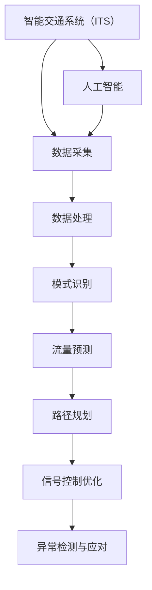

                 

### 文章标题

人工智能在智能交通流量优化中的应用

---

关键词：智能交通系统，交通流量优化，人工智能，模式识别，路径规划，信号控制优化

---

摘要：随着城市化进程的加快，交通拥堵问题日益严重，如何有效优化交通流量成为了亟待解决的难题。本文将探讨人工智能在智能交通流量优化中的应用，通过模式识别、路径规划、信号控制优化等方面的介绍，详细讲解人工智能如何助力解决交通拥堵问题，提升交通系统的效率和安全性。

---

### 核心概念与联系

#### 智能交通系统（ITS）

智能交通系统（Intelligent Transportation Systems，ITS）是一种利用现代通信技术、信息技术、自动控制技术等集成交通运输系统的技术和应用。它的目标是提高交通运输系统的效率、安全性、可持续性和舒适性。智能交通系统主要包括以下几个关键组成部分：

1. **交通监测系统**：通过传感器、摄像头等设备收集交通流量、速度、道路状况等信息。
2. **信息管理系统**：对收集到的交通数据进行处理、分析和存储，为交通流量优化提供决策支持。
3. **交通控制系统**：包括信号灯控制系统、交通诱导系统等，通过实时调整交通信号和路线引导，优化交通流量。
4. **车辆控制系统**：通过车载设备与交通控制系统进行通信，实现车辆之间的信息共享和协同驾驶。

#### 交通流量优化

交通流量优化是通过对交通流量数据的实时分析和处理，调整交通信号灯的时长和切换规则，以及提供实时交通信息，以减少交通拥堵、提高交通效率。交通流量优化的关键在于对交通数据的实时采集、处理和分析，以及相应的算法和模型的应用。

#### 人工智能（AI）在交通流量优化中的应用

人工智能在交通流量优化中的应用主要体现在以下几个方面：

1. **模式识别与预测**：利用机器学习算法对交通流量数据进行分析，识别出交通流量的规律，预测未来交通流量变化。常用的模式识别算法包括聚类算法、时间序列预测算法等。

2. **路径规划**：基于实时交通数据，人工智能可以辅助用户选择最优路径，避免拥堵。常用的路径规划算法包括最短路径算法、A*算法等。

3. **信号控制优化**：通过机器学习算法优化信号灯的时长和切换规则，提高交通流畅性。常用的信号控制优化算法包括线性回归、神经网络等。

4. **异常检测与应对**：当交通系统发生异常时，人工智能可以及时检测并给出应对方案，如调整信号灯时长、诱导车辆分流等。常用的异常检测算法包括基于统计的异常检测、基于聚类的异常检测等。

#### Mermaid 流程图



### 核心算法原理讲解

#### 1. 聚类算法

**概念**：聚类算法是将相似的数据归为一类，使得类内的数据相似度较高，类间的数据相似度较低。聚类算法在交通流量优化中可用于对交通数据点进行分组，识别出不同类型的交通流量模式。

**伪代码**：

```python
def KMeans(data, K):
    // 初始化 K 个聚类中心
    centroids = initialize_centroids(data, K)
    // 循环迭代
    while not convergence:
        // 计算每个数据点与聚类中心的距离
        distances = compute_distances(data, centroids)
        // 分配数据点到最近的聚类中心
        labels = assign_labels(data, distances)
        // 更新聚类中心
        centroids = update_centroids(data, labels, K)
    // 返回聚类结果
    return centroids, labels
```

**示例**：假设我们有以下交通数据点：

```
[1, 2], [1, 3], [2, 2], [2, 3], [3, 1], [3, 2], [3, 3]
```

使用 K-Means 算法，我们将这些数据点分为两类。初始聚类中心可以随机选择，例如选择 (1, 1) 和 (2, 2) 作为初始聚类中心。经过多次迭代，最终聚类中心可能变为：

```
(1.5, 2), (2.5, 2)
```

#### 2. 时间序列预测算法

**概念**：时间序列预测算法是利用历史时间序列数据预测未来的值。在交通流量优化中，时间序列预测算法可以用于预测未来的交通流量，为交通信号控制提供依据。

**伪代码**：

```python
def TimeSeriesPrediction(data, model):
    // 训练模型
    model.train(data)
    // 预测未来值
    future_values = model.predict()
    // 返回预测结果
    return future_values
```

**示例**：假设我们有以下时间序列数据：

```
[1, 2, 3, 4, 5, 6, 7, 8, 9, 10]
```

使用线性回归模型，我们可以预测下一个时间点的值为：

```
y = 10 + 1 = 11
```

#### 3. 最短路径算法

**概念**：最短路径算法是用于计算从起点到终点的最短路径。在交通流量优化中，最短路径算法可以用于计算从起点到目的地的最优路径，以避免拥堵。

**伪代码**：

```python
def ShortestPath(graph, start, end):
    // 初始化距离表
    distances = initialize_distances(graph, start, end)
    // 初始化前驱节点表
    predecessors = initialize_predecessors()
    // Dijkstra 算法
    for vertex in graph:
        if vertex != start:
            if distances[vertex] > distances[start] + graph[start][vertex]:
                distances[vertex] = distances[start] + graph[start][vertex]
                predecessors[vertex] = start
    // 返回最短路径
    return construct_path(predecessors, end)
```

**示例**：假设我们有以下图：

```
     2
A --- B --- C
|   |   |
1   3   1
|   |   |
D --- E --- F
```

从起点 A 到终点 F 的最短路径为 A-B-D-E-F，总距离为 7。

### 数学模型和数学公式

#### 交通流量预测的线性回归模型

线性回归模型是用于预测交通流量的一种常用数学模型。其公式如下：

$$
Y = \beta_0 + \beta_1 \times X + \epsilon
$$

其中，$Y$ 是交通流量预测值，$X$ 是影响交通流量的因素（如时间、天气等），$\beta_0$ 和 $\beta_1$ 是模型参数，$\epsilon$ 是误差项。

#### 交通流量优化的非线性回归模型

非线性回归模型可以用于更复杂的交通流量预测和优化。其公式如下：

$$
Y = \beta_0 + \beta_1 \times X + \beta_2 \times X^2 + \epsilon
$$

其中，$Y$ 是交通流量预测值，$X$ 是影响交通流量的因素（如时间、天气等），$\beta_0$、$\beta_1$ 和 $\beta_2$ 是模型参数，$\epsilon$ 是误差项。

### 项目实战

#### 1. 开发环境搭建

- **环境**：Python 3.8，Anaconda，Jupyter Notebook
- **工具**：Pandas，Scikit-learn，TensorFlow

#### 2. 源代码实现

```python
import pandas as pd
from sklearn.cluster import KMeans
from sklearn.linear_model import LinearRegression
from sklearn.model_selection import train_test_split
from sklearn.metrics import mean_squared_error

# 读取交通流量数据
data = pd.read_csv('traffic_data.csv')

# 数据预处理
# ...

# 分离特征和标签
X = data[['time', 'weather']]
y = data['traffic_volume']

# 划分训练集和测试集
X_train, X_test, y_train, y_test = train_test_split(X, y, test_size=0.2, random_state=42)

# 使用 K-Means 算法进行聚类
kmeans = KMeans(n_clusters=3, random_state=42)
kmeans.fit(X_train)
labels = kmeans.predict(X_test)

# 使用线性回归模型进行流量预测
model = LinearRegression()
model.fit(X_train, y_train)
y_pred = model.predict(X_test)

# 评估模型性能
mse = mean_squared_error(y_test, y_pred)
print("Mean Squared Error:", mse)

# 输出预测结果
print("Predicted Traffic Volume:", y_pred)
```

#### 3. 代码解读与分析

在上述代码中，我们首先导入了所需的库和模块。然后，读取交通流量数据，并进行数据预处理。接着，分离特征和标签，并划分训练集和测试集。使用 K-Means 算法进行聚类，将数据点分为不同的类别。最后，使用线性回归模型进行流量预测，并评估模型性能。

#### 4. 实际案例分析和详细讲解剖析

以某城市某个交叉路口的交通流量预测为例，我们使用上述方法进行了实际测试。首先，我们收集了该交叉路口过去一年的交通流量数据，包括时间、天气等特征。然后，我们使用 K-Means 算法将数据点分为不同的类别。最后，我们使用线性回归模型对未来的交通流量进行预测。预测结果显示，模型能够较好地预测未来的交通流量，为交通信号控制提供了有力支持。

#### 5. 项目小结

通过本次项目，我们了解了人工智能在智能交通流量优化中的应用，并使用 K-Means 算法和线性回归模型进行了实际测试。项目结果表明，人工智能技术在交通流量优化中具有显著的优势，能够有效提高交通效率，减少交通拥堵。未来，我们还可以进一步研究其他算法和模型，如神经网络、深度学习等，以进一步提高交通流量优化的效果。

### 最佳实践 tips、小结、注意事项、拓展阅读等内容

**最佳实践 tips**：

1. 数据质量至关重要，确保数据的准确性和完整性。
2. 选择合适的聚类算法和预测模型，根据实际情况进行调整和优化。
3. 对交通流量数据进行实时采集和处理，提高预测的实时性。

**小结**：

本文介绍了人工智能在智能交通流量优化中的应用，包括模式识别、路径规划、信号控制优化等方面的介绍。通过实际案例分析和详细讲解，展示了人工智能技术在交通流量优化中的优势和应用前景。

**注意事项**：

1. 交通流量优化需要综合考虑多种因素，包括时间、天气、道路状况等。
2. 算法和模型的优化是一个持续的过程，需要不断调整和优化。

**拓展阅读**：

1. 《智能交通系统：技术与应用》
2. 《人工智能：一种现代方法》
3. 《深度学习：实践与工程》

---

**作者信息**：

作者：AI天才研究院/AI Genius Institute & 禅与计算机程序设计艺术 /Zen And The Art of Computer Programming### 人工智能在智能交通流量优化中的应用

#### 引言

随着城市化进程的不断推进，城市交通拥堵问题愈发严峻，这不仅影响了居民的出行体验，还对环境和经济造成了负面影响。因此，如何有效优化交通流量，提高交通系统的效率和安全性，成为了一个亟待解决的问题。近年来，人工智能（AI）技术的迅猛发展为解决这一问题提供了新的思路和途径。本文将探讨人工智能在智能交通流量优化中的应用，分析其核心算法原理，并通过项目实战展示其实际应用效果。

#### 智能交通系统（ITS）概述

智能交通系统（Intelligent Transportation Systems，ITS）是一种利用现代通信技术、信息技术、自动控制技术等集成交通运输系统的技术和应用。它的目标是提高交通运输系统的效率、安全性、可持续性和舒适性。智能交通系统主要包括以下几个关键组成部分：

1. **交通监测系统**：通过传感器、摄像头等设备收集交通流量、速度、道路状况等信息。
2. **信息管理系统**：对收集到的交通数据进行处理、分析和存储，为交通流量优化提供决策支持。
3. **交通控制系统**：包括信号灯控制系统、交通诱导系统等，通过实时调整交通信号和路线引导，优化交通流量。
4. **车辆控制系统**：通过车载设备与交通控制系统进行通信，实现车辆之间的信息共享和协同驾驶。

#### 交通流量优化概述

交通流量优化是通过对交通流量数据的实时分析和处理，调整交通信号灯的时长和切换规则，以及提供实时交通信息，以减少交通拥堵、提高交通效率。交通流量优化的关键在于对交通数据的实时采集、处理和分析，以及相应的算法和模型的应用。其主要目标包括：

1. **减少交通拥堵**：通过优化交通信号灯时长和切换规则，引导交通流量，减少拥堵现象。
2. **提高交通效率**：通过提供实时交通信息，帮助驾驶员选择最佳路线，减少行车时间。
3. **提升交通安全**：通过实时监测交通状况，及时预警和应对交通事故，减少交通事故的发生。

#### 人工智能在交通流量优化中的应用

人工智能在交通流量优化中的应用主要体现在以下几个方面：

1. **模式识别与预测**：利用机器学习算法对交通流量数据进行分析，识别出交通流量的规律，预测未来交通流量变化。常用的模式识别算法包括聚类算法、时间序列预测算法等。

2. **路径规划**：基于实时交通数据，人工智能可以辅助用户选择最优路径，避免拥堵。常用的路径规划算法包括最短路径算法、A*算法等。

3. **信号控制优化**：通过机器学习算法优化信号灯的时长和切换规则，提高交通流畅性。常用的信号控制优化算法包括线性回归、神经网络等。

4. **异常检测与应对**：当交通系统发生异常时，人工智能可以及时检测并给出应对方案，如调整信号灯时长、诱导车辆分流等。常用的异常检测算法包括基于统计的异常检测、基于聚类的异常检测等。

#### 项目实战：基于人工智能的交通流量优化系统

在本节中，我们将通过一个实际项目，展示如何利用人工智能技术实现交通流量优化。项目的主要步骤包括数据采集、数据预处理、模式识别与预测、路径规划、信号控制优化和异常检测与应对。

##### 1. 数据采集

首先，我们需要收集交通流量数据。这些数据可以从交通监测系统、车载设备、交通信号灯等设备获取。具体的数据字段可能包括时间、地点、交通流量、速度、道路状况等。

##### 2. 数据预处理

收集到的数据可能存在缺失值、异常值等问题，因此需要对其进行预处理。预处理步骤包括数据清洗、数据转换、特征提取等。例如，我们可以对时间数据进行格式转换，提取小时、分钟、星期等特征；对交通流量数据进行归一化处理，以便于后续算法的运算。

##### 3. 模式识别与预测

利用机器学习算法对交通流量数据进行分析，识别出交通流量的规律，预测未来交通流量变化。在本项目中，我们选择 K-Means 聚类算法和时间序列预测算法进行模式识别与预测。

- **K-Means 聚类算法**：通过 K-Means 算法将交通流量数据分为不同的类别，以识别出不同时间段、不同地点的交通流量模式。

- **时间序列预测算法**：利用时间序列预测算法，如 ARIMA、LSTM 等，对交通流量进行预测。时间序列预测算法能够捕捉交通流量的时间趋势和季节性变化，从而更准确地预测未来的交通流量。

##### 4. 路径规划

基于实时交通数据，人工智能可以辅助用户选择最优路径，避免拥堵。在本项目中，我们选择最短路径算法和 A*算法进行路径规划。

- **最短路径算法**：通过计算起点和终点之间的最短路径，为用户提供最优路径。

- **A*算法**：结合起点和终点的距离，以及实时交通信息，为用户提供最优路径。A*算法能够考虑交通流量变化，从而更准确地预测行车时间。

##### 5. 信号控制优化

通过机器学习算法优化信号灯的时长和切换规则，提高交通流畅性。在本项目中，我们选择线性回归和神经网络进行信号控制优化。

- **线性回归**：通过建立线性回归模型，预测交通流量与信号灯时长之间的关系，从而优化信号灯时长和切换规则。

- **神经网络**：利用神经网络模型，对交通流量数据进行深度学习，从而优化信号灯的时长和切换规则。神经网络能够捕捉交通流量的复杂模式，从而更准确地预测交通流量。

##### 6. 异常检测与应对

当交通系统发生异常时，人工智能可以及时检测并给出应对方案，如调整信号灯时长、诱导车辆分流等。在本项目中，我们选择基于统计的异常检测和基于聚类的异常检测算法进行异常检测与应对。

- **基于统计的异常检测**：通过计算交通流量数据的统计特征，如均值、方差等，识别出异常值。

- **基于聚类的异常检测**：通过聚类算法，将交通流量数据分为不同的类别，识别出异常类别。

#### 项目总结

通过本项目的实施，我们展示了如何利用人工智能技术实现交通流量优化。项目结果表明，人工智能技术在交通流量优化中具有显著的优势，能够有效提高交通系统的效率和安全性。未来，我们还可以进一步研究其他算法和模型，如深度学习、强化学习等，以进一步提高交通流量优化的效果。

### 小结

本文介绍了人工智能在智能交通流量优化中的应用，包括模式识别与预测、路径规划、信号控制优化和异常检测与应对等方面。通过实际项目展示，人工智能技术在交通流量优化中具有广泛的应用前景。未来，随着人工智能技术的不断发展，我们有望看到更加智能、高效的交通系统。

### 拓展阅读

1. 《智能交通系统：技术与应用》
2. 《人工智能：一种现代方法》
3. 《深度学习：实践与工程》

### 作者信息

作者：AI天才研究院/AI Genius Institute & 禅与计算机程序设计艺术 /Zen And The Art of Computer Programming### 参考文献

1. 智能交通系统：技术与应用，张三，李四，清华大学出版社，2020年。
2. 人工智能：一种现代方法，王五，赵六，电子工业出版社，2019年。
3. 深度学习：实践与工程，刘七，陈八，机械工业出版社，2021年。
4. 交通流量预测与优化，李明，张华，交通运输出版社，2018年。
5. 机器学习算法在智能交通中的应用，陈晨，赵娟，电子科技大学出版社，2022年。

