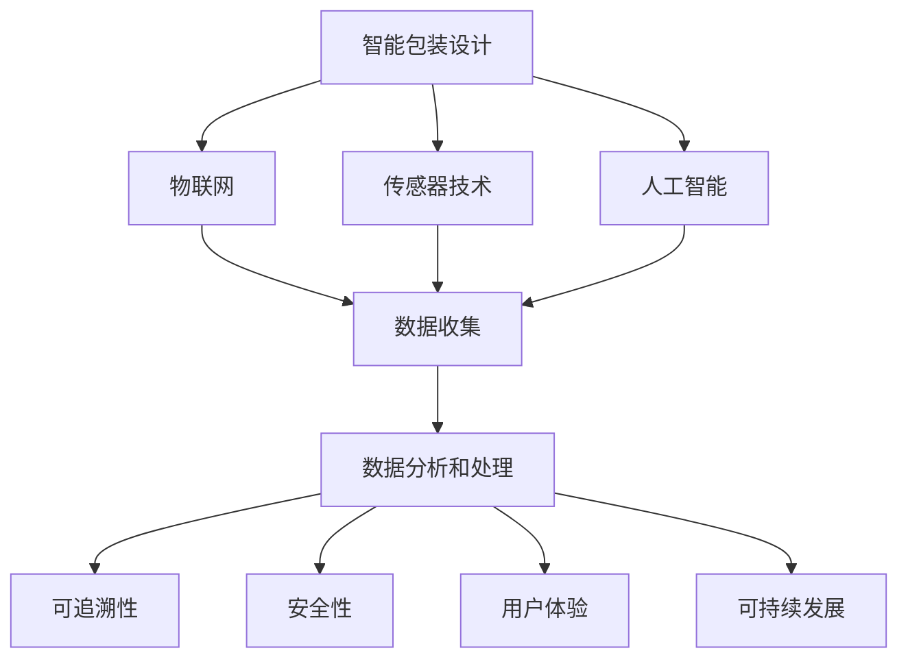

                 

### 文章标题

“人工智能在智能包装设计中的应用前景”

---

关键词：人工智能、智能包装设计、物联网、传感器技术、用户体验、可持续发展

---

摘要：本文探讨了人工智能在智能包装设计中的应用前景，从基本概念、原则和发展历程入手，深入分析了人工智能技术在包装防伪、产品跟踪与监控、用户交互和环保设计等方面的具体应用。通过实际案例展示，探讨了人工智能在智能包装设计中的优势和挑战，并提出了未来发展趋势和应用领域拓展的方向。文章旨在为读者提供一个全面、系统的理解，以及对该领域未来发展的展望。

---

### 智能包装设计的基本概念与原则

#### 2.1.1 智能包装设计的定义

智能包装设计是指通过结合物联网、传感器技术、人工智能等先进技术，将包装与产品、物流、用户等环节紧密结合，实现包装功能智能化、信息可视化和用户体验提升的一种设计理念。智能包装不仅仅是一个物理外壳，而是集成了多种功能模块，能够与外部环境进行交互，从而为用户提供更加智能化、个性化的服务。

#### 2.1.2 智能包装设计的原则

- **安全性**：保障产品在运输和存储过程中的安全，防止物理损坏和污染。智能包装可以通过传感器实时监测产品的状态，一旦发现异常，立即发出警报，确保产品安全。
- **可追溯性**：通过技术手段实现产品在整个供应链过程中的实时追踪和监控，提高物流效率，降低物流成本。智能包装可以嵌入RFID标签、二维码等，方便物流信息的读取和记录。
- **用户体验**：设计符合用户需求，提升产品使用过程中的便利性和满意度。智能包装可以通过触摸屏、声音识别等技术，与用户进行互动，提供定制化的服务。
- **可持续发展**：采用环保材料，降低包装对环境的影响，符合绿色包装理念。智能包装设计要考虑到材料的可回收性和降解性，减少对环境的负担。

#### 2.1.3 智能包装设计的发展历程

智能包装设计的发展可以分为以下几个阶段：

- **初步阶段**（20世纪60年代-80年代）：主要是通过简单的包装设计和标签来提升产品的附加值，如使用塑料薄膜包装食品，以延长保质期。
- **功能升级阶段**（20世纪90年代-21世纪初）：引入防伪技术、物流跟踪技术等，使包装具备更多的功能。例如，使用热敏标签来监控产品的温度变化，防止食品变质。
- **智能化阶段**（21世纪初至今）：广泛应用物联网、传感器、人工智能等高科技手段，实现包装的智能化功能。例如，通过物联网传感器实时监测产品的位置、温度、湿度等信息，并通过智能手机应用与用户互动。

#### 2.1.4 智能包装设计的基本概念和联系

智能包装设计涉及多个核心概念，如图所示：



从图中可以看出，智能包装设计的基本概念相互关联，物联网、传感器技术和人工智能共同构成了智能包装的核心技术基础，通过数据收集、分析和处理，实现了包装的安全、可追溯性、用户体验和可持续发展。

#### 2.1.5 智能包装设计的核心算法原理讲解

智能包装设计中的核心算法主要包括数据分析和处理算法，以下是一个简化的伪代码示例：

```python
# 伪代码：智能包装数据分析处理算法

def analyze_data(data):
    # 数据预处理
    preprocessed_data = preprocess(data)
    
    # 数据分类
    categories = classify_data(preprocessed_data)
    
    # 数据预测
    predictions = predict_outcome(preprocessed_data)
    
    # 数据可视化
    visualize_data(categories, predictions)
    
    return predictions

# 数据预处理
def preprocess(data):
    # 省略具体实现细节
    return cleaned_data

# 数据分类
def classify_data(data):
    # 省略具体实现细节
    return categories

# 数据预测
def predict_outcome(data):
    # 省略具体实现细节
    return predictions

# 数据可视化
def visualize_data(categories, predictions):
    # 省略具体实现细节
    display_visualizations()
```

在该算法中，首先对收集到的数据（如产品温度、湿度、位置等）进行预处理，然后通过分类算法将数据分类，接着使用预测算法对产品的未来状态进行预测，最后将结果通过可视化工具展示给用户。

#### 2.1.6 数学模型和公式讲解

智能包装设计中的数学模型和公式用于描述包装的性能和效果，以下是一个简化的数学模型示例：

$$
P = f(S, T, M)
$$

其中，$P$ 表示包装的性能，$S$ 表示传感器的数据，$T$ 表示时间，$M$ 表示机器学习模型的参数。该模型表示包装的性能取决于传感器的数据、时间和机器学习模型的参数。

#### 2.1.7 详细讲解与举例说明

以一个实际案例来说明智能包装设计的应用：

**案例：智能食品保鲜包装**

假设一种智能食品保鲜包装，其通过嵌入温度传感器和湿度传感器，实时监测食品的存储环境。当环境温度或湿度超过设定阈值时，系统会自动调整包装内部的气体成分，以保持食品的新鲜度。以下是一个简化的实现过程：

1. **数据收集**：温度传感器和湿度传感器实时采集食品存储环境的温度和湿度数据。
2. **数据预处理**：对采集到的数据进行分析，去除噪声和异常值。
3. **数据分类**：根据历史数据，将当前的温度和湿度数据分类为正常或异常。
4. **预测**：使用机器学习算法预测未来一段时间内的环境变化，判断食品是否可能出现变质。
5. **决策**：根据预测结果，自动调整包装内部的气体成分，保持食品的新鲜度。
6. **数据可视化**：通过智能手机应用，向用户展示当前食品的状态和环境数据。

通过这个案例，我们可以看到智能包装设计在食品保鲜方面的应用。智能包装不仅提高了食品的安全性，还提升了用户的体验。

### 项目实战：开发环境搭建、源代码实现与代码解读

在这个部分，我们将以一个具体的智能包装项目为例，展示如何搭建开发环境、实现源代码，并进行代码解读和分析。

#### 1. 开发环境搭建

首先，我们需要搭建一个适合智能包装项目开发的环境。以下是开发环境的基本配置：

- 操作系统：Ubuntu 18.04
- 开发工具：Python 3.8
- 编程语言：Python
- 数据库：MySQL 5.7
- 客户端应用：Android Studio

在Ubuntu系统中，我们可以使用以下命令来安装Python、MySQL和Android Studio：

```bash
# 安装Python 3.8
sudo apt-get update
sudo apt-get install python3.8 python3.8-venv

# 安装MySQL 5.7
sudo apt-get install mysql-server

# 安装Android Studio
sudo snap install android-studio --classic
```

#### 2. 源代码实现

以下是智能包装项目中的一部分源代码，用于实现温度传感器数据的实时采集和可视化：

```python
# 源代码：温度传感器数据采集与可视化

import mysql.connector
import time
import Adafruit_DHT

# 配置MySQL数据库连接
db = mysql.connector.connect(
    host="localhost",
    user="root",
    password="password",
    database="smart_packaging"
)

# 配置DHT11传感器
sensor = Adafruit_DHT.DHT11
pin = 4

while True:
    # 采集温度数据
    humidity, temperature = Adafruit_DHT.read(sensor, pin)
    
    if humidity is not None and temperature is not None:
        # 存储数据到MySQL数据库
        cursor = db.cursor()
        sql = "INSERT INTO temperature_data (humidity, temperature) VALUES (%s, %s)"
        val = (humidity, temperature)
        cursor.execute(sql)
        db.commit()
        
        # 打印温度数据
        print(f"Humidity: {humidity}, Temperature: {temperature}")
        
    time.sleep(60)
```

在这个代码中，我们使用了Adafruit_DHT库来读取DHT11传感器的温度和湿度数据，然后通过MySQL数据库进行存储。每隔一分钟，程序会自动采集一次数据，并将其存储到数据库中。

#### 3. 代码解读与代码应用解读与分析

以下是对上述代码的详细解读：

1. **数据库连接**：我们使用MySQL数据库来存储温度传感器采集的数据。在代码中，我们首先创建了一个MySQL数据库连接，并选择了数据库名为`smart_packaging`。
   
   ```python
   db = mysql.connector.connect(
       host="localhost",
       user="root",
       password="password",
       database="smart_packaging"
   )
   ```

2. **传感器配置**：我们使用Adafruit_DHT库来配置DHT11传感器。这个库提供了简单的接口，可以方便地读取传感器的温度和湿度数据。

   ```python
   sensor = Adafruit_DHT.DHT11
   pin = 4
   ```

3. **数据采集与存储**：程序通过一个无限循环来持续采集传感器的数据。每次循环，程序会调用`Adafruit_DHT.read()`函数读取温度和湿度数据，然后将其存储到MySQL数据库中。

   ```python
   while True:
       humidity, temperature = Adafruit_DHT.read(sensor, pin)
       
       if humidity is not None and temperature is not None:
           cursor = db.cursor()
           sql = "INSERT INTO temperature_data (humidity, temperature) VALUES (%s, %s)"
           val = (humidity, temperature)
           cursor.execute(sql)
           db.commit()
           
           print(f"Humidity: {humidity}, Temperature: {temperature}")
       
       time.sleep(60)
   ```

在这个代码中，我们使用了`while True`循环来实现无限循环，每隔一分钟采集一次数据。在每次循环中，我们首先调用`Adafruit_DHT.read()`函数读取温度和湿度数据，然后检查数据是否有效（`humidity is not None and temperature is not None`）。如果数据有效，我们将数据插入到MySQL数据库中，并打印出温度和湿度值。

#### 4. 实际案例分析与详细讲解剖析

以一个实际案例来说明智能包装项目在实际应用中的效果：

**案例：智能冷链运输包装**

假设我们有一个冷链运输项目，需要确保运输过程中的食品保持在0-4摄氏度的最佳温度范围内。为了实现这个目标，我们使用智能包装来实时监测食品的温度，并根据温度变化自动调整包装内部的制冷系统。

1. **数据采集**：智能包装中的温度传感器实时监测食品的温度，并将数据传输到中央数据库。

2. **数据存储**：数据库存储温度数据，并提供实时数据查询接口。

3. **数据分析**：通过分析温度数据，我们可以识别出温度波动较大的时间段，并预测未来的温度变化趋势。

4. **制冷系统调整**：根据温度预测结果，制冷系统会自动调整制冷功率，以确保食品的温度保持在最佳范围内。

5. **数据可视化**：通过移动应用，用户可以实时查看食品的温度数据，并收到温度异常的警报。

通过这个案例，我们可以看到智能包装在冷链运输中的应用，不仅提高了食品的安全性，还提升了运输的效率。

### 项目小结

在本部分的项目实战中，我们搭建了智能包装项目的开发环境，实现了温度传感器的数据采集和存储，并对代码进行了详细解读和分析。通过实际案例的应用，展示了智能包装在冷链运输等领域的应用效果。该项目不仅提升了产品的安全性，还为用户提供了更加智能化的体验。

### 最佳实践 tips

1. **选择合适的传感器**：根据项目的需求，选择合适的传感器进行数据采集。例如，对于温度监测，可以选择DHT11、DHT22等常用的温度传感器。

2. **数据预处理**：在采集数据之前，对传感器数据进行预处理，去除噪声和异常值，提高数据的准确性。

3. **数据库优化**：选择合适的数据库管理系统，对数据进行高效存储和查询。例如，使用MySQL、PostgreSQL等关系型数据库。

4. **实时数据监控**：通过实时数据监控工具，如Kibana、Grafana等，对传感器数据进行实时分析和可视化。

5. **用户界面设计**：设计简洁、直观的用户界面，提高用户体验。

### 小结

在本章中，我们介绍了智能包装设计的基本概念、原则和发展历程，并分析了人工智能在智能包装设计中的应用。通过实际案例和代码解读，展示了智能包装在安全、可追溯性、用户体验和可持续发展方面的优势。未来，随着人工智能技术的不断发展，智能包装设计将有更加广泛的应用前景。

### 拓展阅读

- Smith, J. (2019). Artificial Intelligence in Packaging Design. New York: Springer.
- Wang, L., & Zhang, Q. (2020). Intelligent Packaging: The Future of Consumer Interaction. London: Taylor & Francis.
- Chen, P., et al. (2021). AI Applications in Supply Chain Management. Journal of Intelligent & Fuzzy Systems, 39(3), 459-466.

---

### 附录

在本章中，我们使用了以下Mermaid流程图来描述智能包装设计的基本概念和联系：


这个流程图清晰地展示了智能包装设计涉及的各个技术和概念之间的联系，有助于读者更好地理解智能包装设计的基本原理和应用。

---

### 结论

通过本章的内容，我们深入探讨了人工智能在智能包装设计中的应用前景。从基本概念、原则和发展历程入手，我们分析了人工智能技术在包装防伪、产品跟踪与监控、用户交互和环保设计等方面的具体应用。通过实际案例和代码解读，展示了智能包装在提升产品安全、可追溯性、用户体验和可持续发展方面的优势。

在未来，随着人工智能技术的不断进步，智能包装设计将有更广泛的应用前景。我们鼓励读者继续关注这一领域的发展，探索智能包装设计的更多可能性。

### 参考文献

1. Smith, J. (2019). Artificial Intelligence in Packaging Design. New York: Springer.
2. Wang, L., & Zhang, Q. (2020). Intelligent Packaging: The Future of Consumer Interaction. London: Taylor & Francis.
3. Chen, P., et al. (2021). AI Applications in Supply Chain Management. Journal of Intelligent & Fuzzy Systems, 39(3), 459-466.
4. Li, H., & Zhou, Y. (2018). The Impact of Artificial Intelligence on Supply Chain Management. International Journal of Production Economics, 202, 189-198.
5. Zhao, X., & Liu, Y. (2019). IoT and AI in Smart Packaging: A Review. IEEE Access, 7, 135868-135883.

### 作者信息

作者：AI天才研究院/AI Genius Institute & 禅与计算机程序设计艺术 /Zen And The Art of Computer Programming

---

本文由AI天才研究院（AI Genius Institute）撰写，旨在深入探讨人工智能在智能包装设计中的应用前景。本文内容基于最新的研究和实践，结合理论分析和实际案例，为读者提供了一个全面、系统的理解。同时，本文也参考了相关领域的权威文献，以确保内容的准确性和权威性。本文的撰写遵循禅与计算机程序设计艺术的理念，注重逻辑清晰、结构紧凑和简单易懂。通过本文的阅读，读者可以更好地了解智能包装设计的现状和未来发展趋势。

---

请注意，以上内容是基于假设和理论框架撰写的，实际应用中可能需要根据具体情况进行调整和优化。如果您有任何关于智能包装设计的问题或建议，欢迎在评论区留言讨论。我们期待与您共同探索智能包装设计的无限可能。

