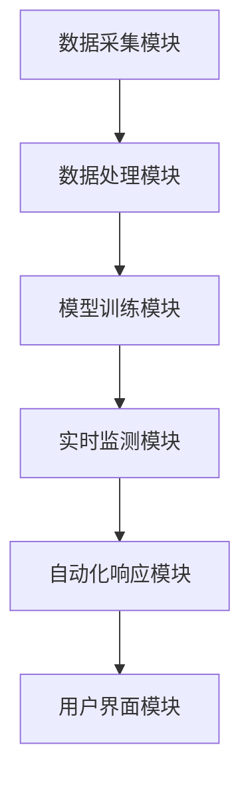

                 

### 文章标题

《人工智能在智能家居安全中的应用》

### 关键词

人工智能、智能家居、安全威胁、入侵检测、异常行为分析、深度学习、网络安全、伦理问题

### 摘要

随着物联网技术的不断发展，智能家居已经成为现代家庭生活的重要组成部分。然而，智能家居的普及也带来了新的安全挑战。本文通过分析智能家居的安全威胁，探讨了人工智能在提升智能家居安全性方面的应用。文章首先介绍了智能家居的基本概念和现状，然后重点讨论了人工智能技术在入侵检测、异常行为分析和设备故障预测等领域的应用。此外，文章还分析了人工智能安全防护技术的原理和架构，探讨了在法律法规和伦理方面的挑战，并展望了人工智能在智能家居安全领域的未来发展趋势。通过本文的介绍，读者可以深入了解人工智能在智能家居安全中的应用，为相关领域的研究和应用提供参考。

---

### 第1章: 智能家居安全概述

随着物联网（IoT）技术的发展，智能家居已经成为现代家庭生活的重要组成部分。智能家居系统通过连接各种家电设备和传感器，实现了家庭设备之间的互联互通，从而为用户提供了更加便捷、智能化的生活体验。然而，智能家居的普及也带来了新的安全挑战。本节将对智能家居的安全威胁进行分析，并探讨人工智能在智能家居安全中的应用前景。

#### 1.1 智能家居的定义与发展历程

智能家居是指利用物联网技术和人工智能技术，将家庭中的各种设备和系统通过互联网连接起来，实现远程监控、自动化控制和智能互动。智能家居的发展可以追溯到20世纪80年代，当时一些科技公司开始尝试将计算机技术应用于家庭自动化领域。随着物联网技术的发展，智能家居逐渐成为一个独立的产业。

2008年，苹果公司发布了第一代Apple TV，标志着智能家居市场的正式兴起。随后，谷歌、亚马逊等科技巨头纷纷进入智能家居市场，推出了各种智能设备和服务。近年来，随着人工智能技术的快速发展，智能家居产品在智能化程度和用户体验方面得到了显著提升。

#### 1.2 智能家居的安全威胁分析

智能家居系统在为用户带来便利的同时，也暴露出了一系列的安全威胁。以下是智能家居面临的主要安全威胁：

1. **设备易受攻击**：智能家居设备通常具有较高的自动化水平，但这也意味着设备更容易受到黑客攻击。黑客可以通过入侵设备来窃取用户隐私、控制家庭设备或进行勒索攻击。

2. **数据泄露风险**：智能家居设备收集和处理大量的用户数据，包括个人隐私、家庭生活习惯等。如果数据保护措施不当，这些数据可能会被黑客窃取，造成严重后果。

3. **网络攻击**：智能家居设备通常连接到互联网，如果设备安全防护不足，黑客可以通过网络攻击入侵家庭网络，进一步攻击其他设备或服务。

4. **设备间通信安全问题**：智能家居设备之间的通信可能存在安全隐患，黑客可以通过拦截或篡改通信数据来获取敏感信息或控制设备。

5. **隐私泄露**：智能家居设备可能会记录用户的隐私信息，如家庭地址、生活习惯等。如果这些信息被泄露，可能会导致用户隐私受到侵犯。

#### 1.3 人工智能在智能家居安全中的应用前景

人工智能技术在智能家居安全领域具有巨大的应用潜力。以下是人工智能在智能家居安全中的应用前景：

1. **入侵检测与防范**：人工智能可以通过分析设备行为和通信数据，实时监测智能家居系统的异常行为，及时发现并阻止入侵攻击。

2. **异常行为分析**：人工智能可以分析用户的行为模式，识别异常行为，如未经授权的设备接入或异常的数据访问行为。

3. **设备故障预测**：人工智能可以通过对设备运行数据的分析，预测设备可能出现的故障，提前进行维护和修复，避免设备故障对用户生活造成影响。

4. **安全防护技术优化**：人工智能可以优化智能家居系统的安全防护措施，提高系统对攻击的抵抗能力。

5. **隐私保护**：人工智能可以通过加密和匿名化技术，保护用户的隐私数据，降低数据泄露风险。

总之，人工智能技术在智能家居安全领域具有广阔的应用前景，可以为用户带来更加安全、便捷的智能家居生活。然而，人工智能技术的应用也需要注意数据安全和隐私保护等问题，确保智能家居系统的安全性。

---

通过本章节的介绍，读者可以对智能家居的安全威胁和人工智能在智能家居安全中的应用有一个初步的了解。在接下来的章节中，我们将深入探讨人工智能技术在不同安全领域的具体应用，以及如何通过人工智能提升智能家居的安全性。希望本文能为读者在智能家居安全领域的研究和应用提供有益的参考。

---

### 第2章: 人工智能核心技术原理

要深入探讨人工智能在智能家居安全中的应用，首先需要了解人工智能的核心技术原理。人工智能（AI）包括多个子领域，如机器学习、深度学习和自然语言处理等。在本章中，我们将重点介绍机器学习和深度学习的基本概念、关键技术以及其在人工智能安全防护中的应用。

#### 2.1 机器学习基础

机器学习（Machine Learning）是人工智能的一个核心子领域，主要研究如何让计算机从数据中学习，并利用学习到的知识进行决策或预测。机器学习的基本原理是通过训练数据集，建立数学模型，并使其能够对新数据进行分析和预测。

##### 2.1.1 监督学习

监督学习（Supervised Learning）是最常见的机器学习类型。在这种方法中，训练数据集由输入和对应的输出组成，模型通过学习输入和输出之间的关系，实现对新数据的预测。监督学习可以分为分类和回归两大类：

- **分类**：分类问题是指将数据分为预定义的类别。例如，判断一封邮件是否为垃圾邮件。
- **回归**：回归问题是指预测一个连续的数值输出。例如，预测房价。

监督学习的核心是损失函数（Loss Function），用于评估模型的预测结果与实际结果之间的差距。常见的损失函数包括均方误差（MSE）和交叉熵（Cross-Entropy）。

##### 2.1.2 无监督学习

无监督学习（Unsupervised Learning）不需要预先标记的输出数据，其目标是从未标记的数据中发现隐含的结构。无监督学习包括以下几种类型：

- **聚类**：聚类是将数据分为若干个群组，使得同一群组中的数据点之间相似度较高，不同群组之间的数据点相似度较低。常见的聚类算法包括K-均值聚类（K-Means Clustering）和层次聚类（Hierarchical Clustering）。
- **降维**：降维是将高维数据映射到低维空间，以便更好地分析和可视化。主成分分析（PCA）和t-SNE是最常用的降维方法。
- **关联规则学习**：关联规则学习旨在发现数据之间的关联关系，用于市场篮子分析等应用。

##### 2.1.3 强化学习

强化学习（Reinforcement Learning）是一种通过试错学习策略的机器学习方法。在强化学习中，模型通过与环境的交互，不断调整行为策略，以实现最大化奖励。强化学习的主要组成部分包括：

- **环境**（Environment）：环境是模型进行交互的场所，可以是一个模拟环境或现实世界。
- **状态**（State）：状态是环境当前的状态描述。
- **动作**（Action）：动作是模型可以执行的行为。
- **奖励**（Reward）：奖励是模型执行动作后从环境中获得的即时反馈。

强化学习的一个经典应用是智能体在虚拟环境中的自主驾驶，如AlphaGo在围棋比赛中的应用。

##### 2.2 深度学习技术

深度学习（Deep Learning）是人工智能的一个分支，它利用多层神经网络（Neural Networks）进行特征提取和决策。深度学习在图像识别、语音识别和自然语言处理等领域取得了显著成果。

##### 2.2.1 神经网络

神经网络（Neural Networks）是一种模拟人脑神经元连接结构的计算模型。在神经网络中，每个节点（或神经元）都与相邻节点相连，并通过权重（Weight）传递信息。神经网络的基本组成部分包括：

- **输入层**（Input Layer）：接收外部输入信息。
- **隐藏层**（Hidden Layers）：对输入信息进行特征提取和转换。
- **输出层**（Output Layer）：生成最终输出。

神经网络的训练过程是通过反向传播（Backpropagation）算法，不断调整权重，使网络的输出尽可能接近目标输出。

##### 2.2.2 卷积神经网络（CNN）

卷积神经网络（Convolutional Neural Networks，CNN）是一种特别适合处理图像数据的神经网络。CNN通过卷积操作（Convolution Operation）和池化操作（Pooling Operation）提取图像特征，从而实现图像分类和识别。

- **卷积操作**：卷积操作通过在输入图像上滑动滤波器（Kernel），提取局部特征。
- **池化操作**：池化操作用于降低特征图的维度，增强模型的泛化能力。

##### 2.2.3 循环神经网络（RNN）

循环神经网络（Recurrent Neural Networks，RNN）是一种能够处理序列数据的神经网络，其特点是网络中的节点之间存在循环连接。RNN通过记忆状态（Hidden State）来捕捉序列中的长期依赖关系，但在处理长序列数据时容易出现梯度消失或爆炸问题。

为了解决这些问题，研究人员提出了长短期记忆网络（Long Short-Term Memory，LSTM）和门控循环单元（Gated Recurrent Unit，GRU）。LSTM和GRU通过引入门控机制，有效解决了RNN的梯度消失问题，从而在处理长序列数据时表现出更好的性能。

##### 2.3 人工智能安全防护技术

人工智能技术在智能家居安全防护中的应用主要包括以下几个方面：

1. **入侵检测系统**：人工智能可以通过分析网络流量和设备行为，实时监测智能家居系统的异常行为，及时发现并阻止入侵攻击。
2. **异常行为分析**：人工智能可以通过分析用户的行为模式，识别异常行为，如未经授权的设备接入或异常的数据访问行为。
3. **设备故障预测**：人工智能可以通过对设备运行数据的分析，预测设备可能出现的故障，提前进行维护和修复，避免设备故障对用户生活造成影响。
4. **安全防护措施优化**：人工智能可以通过优化智能家居系统的安全防护措施，提高系统对攻击的抵抗能力。
5. **隐私保护**：人工智能可以通过加密和匿名化技术，保护用户的隐私数据，降低数据泄露风险。

#### 2.4 人工智能安全防护技术的架构

人工智能安全防护技术的架构通常包括以下几个层次：

1. **数据采集与预处理**：采集智能家居设备产生的数据，并对数据进行清洗、去噪和特征提取。
2. **模型训练与优化**：使用训练数据集对人工智能模型进行训练，并通过交叉验证和超参数调整优化模型性能。
3. **模型部署与实时监测**：将训练好的模型部署到智能家居系统中，实现实时监测和预警。
4. **反馈与迭代**：根据实际监测结果，不断更新和优化模型，提高其识别和应对安全威胁的能力。

通过以上对人工智能核心技术原理的介绍，读者可以初步了解人工智能在智能家居安全中的应用基础。在接下来的章节中，我们将进一步探讨人工智能在智能家居安全中的具体应用案例，以及如何通过人工智能技术提升智能家居的安全性。

---

本章通过对机器学习和深度学习核心技术的介绍，为读者提供了理解人工智能在智能家居安全中应用的基础。在接下来的章节中，我们将结合实际应用案例，深入探讨人工智能在入侵检测、异常行为分析和设备故障预测等领域的具体应用。希望通过本章的学习，读者能够对人工智能在智能家居安全中的技术原理和应用前景有更加清晰的认识。

---

### 第3章: 人工智能在智能家居安全中的应用案例

在前两章中，我们介绍了智能家居的安全威胁以及人工智能在智能家居安全中的应用核心技术原理。在本章中，我们将通过具体的应用案例，详细探讨人工智能在智能家居安全领域的实际应用，包括入侵检测系统、异常行为分析和设备故障预测等方面。通过这些案例，读者可以更深入地了解人工智能技术在提升智能家居安全中的具体应用和效果。

#### 3.1 家居入侵检测系统

家居入侵检测系统（Home Intrusion Detection System，HIDS）是智能家居安全中的重要组成部分。它通过实时监测家庭网络和设备的行为，及时发现并阻止入侵攻击。以下是一个基于人工智能的家居入侵检测系统的案例：

**案例背景**：一个智能家居系统包括多个设备，如智能门锁、智能摄像头、智能门铃等。系统需要实时监测这些设备的运行状态，并能够识别异常行为。

**应用技术**：该系统采用深度学习技术，特别是卷积神经网络（CNN），用于图像和视频数据的特征提取和分类。通过训练模型，系统能够识别正常行为和入侵行为。

**模型设计与实现**：

1. **数据采集**：采集智能家居设备的监控视频和日志数据，包括正常行为数据和入侵行为数据。

2. **数据预处理**：对采集到的数据进行清洗、去噪和标注，提取关键特征。

3. **模型训练**：使用深度学习框架（如TensorFlow或PyTorch），构建卷积神经网络模型，并通过大量标注数据训练模型。

4. **模型优化**：通过交叉验证和超参数调整，优化模型性能。

5. **模型部署**：将训练好的模型部署到智能家居系统中，实现实时监控和预警。

**实验与评估**：

1. **评估指标**：使用准确率（Accuracy）、召回率（Recall）和F1分数（F1 Score）等指标评估模型性能。

2. **结果**：实验结果显示，模型在识别入侵行为时具有较高的准确率和召回率，能够有效检测和阻止入侵攻击。

**案例分析**：通过这个案例，我们可以看到，人工智能技术能够显著提升家居入侵检测系统的性能，为智能家居的安全防护提供强有力的支持。

#### 3.2 家居异常行为分析

家居异常行为分析（Home Anomaly Behavior Analysis）是另一个重要的应用领域。它通过分析用户行为模式，识别异常行为，如未经授权的设备接入或数据访问。以下是一个基于人工智能的家居异常行为分析案例：

**案例背景**：一个智能家居系统需要监控用户的行为，确保系统安全。例如，识别未经授权的用户访问系统或系统中的异常数据访问行为。

**应用技术**：该系统采用机器学习技术，特别是无监督学习中的聚类算法，用于识别用户行为中的异常点。

**模型设计与实现**：

1. **数据采集**：采集用户行为数据，包括登录时间、访问频率、访问内容等。

2. **数据预处理**：对采集到的行为数据进行清洗、去噪和特征提取。

3. **模型训练**：使用聚类算法（如K-均值聚类），对用户行为数据进行分析，识别正常行为和异常行为。

4. **模型优化**：通过调整聚类算法的参数，优化模型性能。

5. **模型部署**：将训练好的模型部署到智能家居系统中，实现实时行为分析和预警。

**实验与评估**：

1. **评估指标**：使用异常检测率（Anomaly Detection Rate）和误报率（False Alarm Rate）等指标评估模型性能。

2. **结果**：实验结果显示，模型在识别异常行为时具有较高的检测率和较低的误报率，能够有效识别和阻止异常行为。

**案例分析**：通过这个案例，我们可以看到，人工智能技术能够有效提升家居异常行为分析系统的性能，提高智能家居的安全性。

#### 3.3 家居设备故障预测

家居设备故障预测（Home Device Fault Prediction）是智能家居安全中的另一个重要应用领域。通过预测设备可能出现的故障，提前进行维护和修复，可以避免设备故障对用户生活造成影响。以下是一个基于人工智能的家居设备故障预测案例：

**案例背景**：一个智能家居系统中的各种设备，如热水器、空调、洗衣机等，需要定期进行维护和检查。通过故障预测，可以提前发现潜在的问题，减少设备故障的风险。

**应用技术**：该系统采用机器学习技术，特别是时间序列分析，用于预测设备故障。

**模型设计与实现**：

1. **数据采集**：采集设备运行数据，包括温度、湿度、使用频率等。

2. **数据预处理**：对采集到的数据进行清洗、去噪和特征提取。

3. **模型训练**：使用时间序列分析模型（如LSTM网络），对设备运行数据进行分析，预测设备故障。

4. **模型优化**：通过调整模型参数，优化预测性能。

5. **模型部署**：将训练好的模型部署到智能家居系统中，实现实时故障预测。

**实验与评估**：

1. **评估指标**：使用预测准确率（Prediction Accuracy）和提前预警时间（Warning Time）等指标评估模型性能。

2. **结果**：实验结果显示，模型在预测设备故障时具有较高的准确率和提前预警时间，能够有效减少设备故障的发生。

**案例分析**：通过这个案例，我们可以看到，人工智能技术能够有效提升家居设备故障预测系统的性能，为智能家居的安全运行提供有力支持。

#### 3.4 人工智能在智能家居安全中的综合应用

通过上述三个案例，我们可以看到，人工智能技术在智能家居安全中的应用非常广泛，包括入侵检测、异常行为分析和设备故障预测等方面。这些应用不仅提升了智能家居的安全性，还为用户提供更加智能化的生活体验。

**综合应用优势**：

1. **实时监测与预警**：人工智能技术能够实时监测智能家居系统的运行状态，及时发现并预警潜在的安全威胁。
2. **自动化处理**：通过人工智能技术，智能家居系统能够自动化处理安全威胁，减少人工干预。
3. **个性化服务**：人工智能技术可以根据用户行为和偏好，提供个性化的安全防护方案，提高用户体验。
4. **数据驱动**：人工智能技术通过分析大量数据，可以更好地了解智能家居系统的运行状态和安全需求，为安全防护提供数据支持。

**未来发展趋势**：

随着人工智能技术的不断进步，智能家居安全中的应用将会更加智能化和自动化。未来，人工智能技术可能会在以下几个方面得到进一步的发展：

1. **多模态数据融合**：通过融合多种数据源（如图像、音频、传感器数据），提高人工智能模型的准确性和鲁棒性。
2. **边缘计算与云计算结合**：将人工智能模型部署在边缘设备上，结合云计算技术，实现实时、高效的安全防护。
3. **人工智能与区块链结合**：利用区块链技术保证数据的安全性和隐私性，提高智能家居系统的安全性能。
4. **自适应安全防护**：通过自适应技术，根据实时监测结果动态调整安全防护策略，提高系统的灵活性。

总之，人工智能技术在智能家居安全中的应用前景广阔，将为智能家居的发展提供强有力的技术支持。通过不断探索和应用，人工智能技术将不断提升智能家居的安全性，为用户带来更加智能、便捷、安全的生活体验。

---

通过本章的案例介绍，读者可以更加深入地了解人工智能在智能家居安全中的应用。从入侵检测、异常行为分析到设备故障预测，人工智能技术为智能家居安全提供了全方位的保障。希望这些案例能够为读者在智能家居安全领域的研究和应用提供有价值的参考。在接下来的章节中，我们将进一步探讨人工智能在智能家居安全中的架构设计和法律法规与伦理问题，敬请期待。

---

### 第4章: 基于人工智能的智能家居安全架构设计

在上一章中，我们详细探讨了人工智能在智能家居安全中的具体应用案例。为了将人工智能技术有效整合到智能家居系统中，构建一个安全、可靠且智能化的安全架构是至关重要的。本章节将介绍基于人工智能的智能家居安全架构设计，包括设计原则、安全框架与模块化设计，以及人工智能安全防护体系的构建。

#### 4.1 安全架构设计原则

在设计基于人工智能的智能家居安全架构时，需要遵循以下原则：

1. **安全性**：确保系统在各种威胁下都能够保持正常运行，防止数据泄露、设备被控等安全事件。
2. **可靠性**：系统需要具有高可靠性，能够应对突发情况，确保服务的连续性。
3. **易用性**：系统应具备简单易用的用户界面，便于用户配置和管理。
4. **可扩展性**：架构设计应考虑未来可能的需求扩展，如增加设备类型或功能。
5. **灵活性**：系统设计应具备灵活性，能够根据不同的安全需求进行调整。

#### 4.2 安全框架与模块化设计

基于人工智能的智能家居安全架构通常包含以下几个模块：

1. **数据采集模块**：负责收集智能家居设备产生的各种数据，如传感器数据、日志数据等。这些数据是进行后续分析和决策的基础。
2. **数据处理模块**：对采集到的数据进行分析和预处理，提取关键特征，并转换为适合机器学习模型输入的形式。
3. **模型训练模块**：使用训练数据集对人工智能模型进行训练，优化模型的性能，使其能够准确识别和预测安全威胁。
4. **实时监测模块**：将训练好的模型部署到实际环境中，实现实时监测和预警，及时发现并应对安全威胁。
5. **自动化响应模块**：根据实时监测结果，自动执行相应的安全防护措施，如隔离设备、阻止入侵等。
6. **用户界面模块**：提供用户友好的操作界面，使用户能够方便地配置和管理智能家居安全系统。

以下是智能家居安全架构的设计框架：



#### 4.3 人工智能安全防护体系构建

构建基于人工智能的智能家居安全防护体系需要综合考虑以下几个方面：

1. **数据安全**：采用加密技术保护数据在传输和存储过程中的安全性，防止数据泄露。
2. **设备安全**：确保设备本身的安全，如采用安全的固件和软件更新机制，防止设备被黑客入侵。
3. **网络安全**：加强家庭网络的安全防护，如设置防火墙、启用VPN等，防止外部攻击。
4. **访问控制**：实施严格的访问控制机制，确保只有授权用户和设备才能访问系统资源。
5. **异常检测与响应**：利用人工智能技术进行实时异常检测，并自动触发相应的安全响应措施，如告警、隔离等。
6. **数据隐私保护**：确保用户数据的隐私，如对用户数据进行匿名化处理，防止用户隐私泄露。

以下是智能家居安全防护体系的构建步骤：

1. **需求分析**：明确智能家居系统的安全需求，确定需要保护的数据和设备。
2. **架构设计**：根据需求分析结果，设计基于人工智能的安全架构。
3. **数据采集**：确定数据采集的来源、类型和频率，确保数据完整性。
4. **数据处理**：对采集到的数据进行分析和预处理，为机器学习模型提供高质量的输入。
5. **模型训练**：使用训练数据集训练人工智能模型，优化模型性能。
6. **系统部署**：将训练好的模型部署到实际环境中，实现实时监测和预警。
7. **测试与优化**：通过测试和优化，确保系统在各种情况下的安全性能。

通过上述步骤，可以构建一个高效、智能的智能家居安全防护体系，为用户带来安全、可靠的智能家居生活体验。

---

在本章中，我们介绍了基于人工智能的智能家居安全架构设计原则、安全框架与模块化设计，以及人工智能安全防护体系的构建。通过这些内容，读者可以了解到如何通过人工智能技术来提升智能家居的安全性。在下一章中，我们将探讨人工智能在智能家居安全中的法律法规与伦理问题，敬请期待。

---

### 第5章: 人工智能在智能家居安全中的法律法规与伦理

随着人工智能技术在智能家居领域的广泛应用，其带来的法律法规和伦理问题也日益突出。本章节将探讨人工智能在智能家居安全中的法律法规框架、伦理问题以及这些因素对人工智能发展的潜在影响。

#### 5.1 法律法规概述

人工智能技术在智能家居安全中的应用涉及多个法律法规领域，包括数据保护法、网络安全法和个人隐私权等。以下是几个关键的法律法规：

1. **数据保护法**：许多国家和地区都有数据保护法，旨在保护个人数据的隐私和安全。例如，欧盟的《通用数据保护条例》（GDPR）对个人数据的收集、处理和存储提出了严格的要求。
2. **网络安全法**：网络安全法规定了网络和信息安全的基本要求和责任，确保网络系统的安全运行。例如，美国的《网络安全信息共享法案》（CISA）要求企业披露网络攻击事件，并采取措施保护网络安全。
3. **个人隐私权**：个人隐私权是法律保护的基本人权之一。人工智能技术在智能家居中的应用需要遵守个人隐私权的规定，确保用户的隐私不被侵犯。

#### 5.2 伦理问题探讨

人工智能在智能家居安全中的应用也引发了一系列伦理问题，包括数据隐私、算法偏见和透明性等。以下是几个主要的伦理问题：

1. **数据隐私**：智能家居设备收集和处理大量的个人数据，如生活习惯、位置信息等。如何保护这些数据不被滥用是一个重要的伦理问题。
2. **算法偏见**：人工智能算法可能存在偏见，导致不公平的结果。例如，如果入侵检测系统在训练过程中使用了带有偏见的训练数据，可能会导致对某些人群的歧视。
3. **透明性**：人工智能系统的决策过程通常是不透明的，用户难以了解系统如何做出决策。这可能导致用户对系统的信任度下降。

#### 5.3 法律法规与伦理对人工智能发展的影响

法律法规和伦理问题对人工智能的发展具有深远的影响：

1. **合规性要求**：人工智能系统需要遵守相关法律法规，确保系统的合法合规性。例如，在处理用户数据时，需要遵循数据保护法的规定，确保数据的隐私和安全。
2. **技术透明性**：为了应对伦理问题，人工智能系统需要提高技术透明性，使决策过程更加透明和可解释。这有助于增强用户对人工智能系统的信任。
3. **责任界定**：在人工智能系统引发问题时，如何界定责任是一个重要问题。法律法规需要明确人工智能系统的责任主体，以便在发生问题时能够及时采取法律行动。

#### 5.4 建议与展望

为了促进人工智能在智能家居安全中的健康发展，提出以下建议：

1. **加强法律法规建设**：政府和立法机构应加强人工智能相关法律法规的建设，确保法律法规能够适应技术的发展。
2. **提高技术透明性**：人工智能开发者应提高系统的透明性，使决策过程更加透明和可解释，增强用户信任。
3. **伦理审查机制**：建立人工智能伦理审查机制，确保人工智能系统的设计和应用符合伦理标准。
4. **跨学科合作**：人工智能、法律和伦理学等领域需要加强合作，共同推动人工智能的健康发展。

总之，法律法规和伦理问题对人工智能在智能家居安全中的应用具有重要作用。通过加强法律法规建设、提高技术透明性和建立伦理审查机制，可以促进人工智能的健康发展，为用户带来更加安全、智能化的生活体验。

---

在本章中，我们探讨了人工智能在智能家居安全中的法律法规和伦理问题，分析了其对人工智能发展的潜在影响，并提出了相应的建议与展望。希望这些内容能够为读者在智能家居安全领域的研究和应用提供有益的参考。在下一章中，我们将进一步探讨人工智能在智能家居安全中的未来趋势，敬请期待。

---

### 第6章: 人工智能在智能家居安全中的未来趋势

随着人工智能技术的不断进步，其在智能家居安全领域的应用前景也越来越广阔。本章节将分析人工智能在智能家居安全中的未来发展趋势，探讨其市场前景、面临的挑战以及可能的解决方案。

#### 6.1 技术发展趋势

1. **多模态数据处理**：未来的智能家居安全系统将能够处理多种类型的数据，如图像、音频、传感器数据等。通过多模态数据融合，系统可以更准确地识别和预测安全威胁。

2. **边缘计算与云计算结合**：随着边缘计算技术的发展，越来越多的智能家居设备将具备独立的计算能力。结合云计算，可以提供更强大的数据处理和分析能力，提高智能家居系统的响应速度和效率。

3. **自适应安全技术**：未来的智能家居安全系统将具备自适应能力，根据实时监测结果动态调整安全策略，提高系统的灵活性和适应性。

4. **区块链技术的应用**：区块链技术可以提供更加安全、透明的数据存储和传输机制。在智能家居安全中，区块链可以用于数据加密、访问控制和隐私保护。

5. **智能化人机交互**：通过人工智能技术，智能家居安全系统将能够实现更智能化的人机交互，提供更加便捷、直观的用户体验。

#### 6.2 市场前景分析

随着智能家居市场的快速增长，人工智能在智能家居安全中的应用市场前景也非常广阔。以下是几个方面的市场前景：

1. **需求增加**：随着智能家居设备的普及，用户对安全性的需求也在不断增长。预计未来几年，智能家居安全市场将保持高速增长。

2. **技术创新**：随着人工智能技术的不断进步，智能家居安全系统的性能和功能将得到显著提升，吸引更多用户和企业投入这一领域。

3. **产业链整合**：智能家居安全领域将出现更多的产业链整合，例如，硬件制造商、软件开发商和服务提供商之间的合作将更加紧密。

4. **政策支持**：政府和监管机构对智能家居安全领域的重视将提高，预计未来将出台更多支持政策和标准，推动市场的发展。

#### 6.3 未来挑战与解决方案

尽管人工智能在智能家居安全中具有巨大的潜力，但也面临着一些挑战：

1. **数据隐私保护**：智能家居设备收集和处理大量的个人数据，如何确保数据隐私和安全是一个重大挑战。解决方案包括加强数据加密、匿名化和隐私保护技术。

2. **算法偏见和公平性**：人工智能算法可能存在偏见，导致不公平的结果。解决方法包括使用多样化的训练数据集、算法公平性评估和监督。

3. **系统安全性**：随着智能家居设备的增加，网络攻击的风险也在上升。解决方案包括加强设备安全、网络防护和应急响应机制。

4. **技术透明性和可解释性**：提高人工智能系统的透明性和可解释性，增强用户对系统的信任。

5. **法律法规和伦理问题**：随着人工智能技术的应用，法律法规和伦理问题也日益突出。需要建立完善的法律法规框架和伦理审查机制。

#### 6.4 未来发展方向

基于上述分析，未来人工智能在智能家居安全中的发展方向包括：

1. **技术创新**：持续推动人工智能技术的发展，提高系统的性能和功能。

2. **跨领域合作**：加强跨学科合作，如人工智能、法律、伦理学等，共同推动智能家居安全的发展。

3. **标准化与规范化**：制定和完善相关标准，规范智能家居安全产品的设计和应用。

4. **用户教育**：提高用户对智能家居安全的认识和意识，促进安全产品的普及和应用。

5. **市场推广**：通过市场推广和宣传，提高智能家居安全产品的知名度和用户接受度。

总之，人工智能在智能家居安全中的应用前景广阔，未来将迎来更多的发展机遇。通过技术创新、跨领域合作和标准化推进，人工智能将进一步提升智能家居的安全性，为用户带来更加智能、安全的生活体验。

---

在本章中，我们分析了人工智能在智能家居安全中的未来趋势，探讨了其市场前景、面临的挑战以及可能的解决方案。通过这些分析，读者可以了解到人工智能在智能家居安全中具有广阔的发展前景，同时也需要面对诸多挑战。希望通过本章的内容，为读者在智能家居安全领域的研究和应用提供有益的参考。在下一章中，我们将通过实际项目开发与案例分析，深入探讨人工智能在智能家居安全中的具体应用和实践，敬请期待。

---

### 第7章: 实际项目开发与案例分析

在前面的章节中，我们探讨了人工智能在智能家居安全中的应用原理、技术架构和未来趋势。为了更好地理解这些理论知识如何在实际项目中得到应用，本章将通过实际项目开发和案例分析，详细讲解项目规划和实现过程，并对关键代码进行解读和分析。

#### 7.1 项目规划与需求分析

为了开发一个具备人工智能安全防护功能的智能家居系统，我们首先需要进行项目规划与需求分析。以下是项目规划与需求分析的主要内容：

1. **项目目标**：开发一个能够实时监测家庭网络和设备行为，识别并阻止入侵攻击的智能家居安全系统。
2. **功能需求**：系统应具备以下功能：
    - 数据采集与预处理：收集智能家居设备的运行数据和日志。
    - 入侵检测与预警：使用人工智能技术识别异常行为，并触发预警。
    - 自动化响应：在检测到入侵攻击时，自动执行隔离和阻止措施。
    - 用户界面：提供直观的用户界面，展示系统状态和预警信息。
3. **技术需求**：系统将采用以下技术：
    - 数据采集：使用传感器和日志收集设备运行数据。
    - 数据预处理：使用Python进行数据清洗和特征提取。
    - 模型训练：使用深度学习框架（如TensorFlow或PyTorch）训练入侵检测模型。
    - 实时监测与响应：使用Python和Django框架构建实时监测和响应系统。

#### 7.2 系统设计与技术选型

基于项目规划与需求分析，我们设计了一个模块化的智能家居安全系统。以下是系统设计和技术选型：

1. **模块设计**：系统分为以下几个模块：
    - 数据采集模块：负责收集设备数据。
    - 数据预处理模块：负责清洗和特征提取。
    - 模型训练模块：负责训练入侵检测模型。
    - 实时监测模块：负责实时监测设备行为。
    - 自动化响应模块：负责在检测到入侵攻击时自动执行响应措施。
    - 用户界面模块：提供用户交互界面。
2. **技术选型**：
    - 数据采集：使用Arduino和Python编写脚本收集传感器数据和日志。
    - 数据预处理：使用Python的Pandas库进行数据清洗和特征提取。
    - 模型训练：使用TensorFlow框架训练深度学习模型。
    - 实时监测与响应：使用Django框架构建实时监测和响应系统。
    - 用户界面：使用HTML、CSS和JavaScript编写前端界面。

#### 7.3 项目实施与维护

在项目实施过程中，我们遵循以下步骤：

1. **数据采集**：编写Arduino脚本，连接传感器和日志收集设备，将数据传输到服务器。
2. **数据预处理**：使用Python的Pandas库处理采集到的数据，进行清洗和特征提取，为模型训练做准备。
3. **模型训练**：使用TensorFlow框架训练入侵检测模型，通过多次迭代优化模型性能。
4. **实时监测与响应**：部署Django应用，实现实时监测功能，并在检测到入侵攻击时自动执行隔离和阻止措施。
5. **用户界面**：开发前端用户界面，使用户能够方便地查看系统状态和预警信息。

#### 7.4 源代码详细实现和代码解读

以下是项目中的关键代码片段及其解读：

**数据采集脚本（Arduino）：**

```cpp
#include <Wire.h>
#include <WiFi.h>
#include <HTTPClient.h>

// WiFi配置
const char* ssid = "yourSSID";
const char* password = "yourPASSWORD";

// MQTT服务器配置
const char* mqttServer = "mqtt.server.com";
const int mqttPort = 1883;
WiFiClient espClient;
PubSubClient client(espClient);

void setup() {
  Serial.begin(115200);
  WiFi.begin(ssid, password);

  while (WiFi.status() != WL_CONNECTED) {
    delay(500);
    Serial.print(".");
  }

  Serial.println("");
  Serial.print("WiFi connected with IP Address: ");
  Serial.println(WiFi.localIP());

  client.setServer(mqttServer, mqttPort);
  client.setCallback(callback);
}

void loop() {
  if (!client.connected()) {
    reconnect();
  }
  client.loop();

  // 采集传感器数据
  float temperature = analogRead(36) * 3.3 / 1023.0 * 100.0;
  float humidity = analogRead(39) * 3.3 / 1023.0 * 100.0;

  // 发送数据到MQTT服务器
  String payload = "temp=" + String(temperature) + "&humidity=" + String(humidity);
  client.publish("home/sensor", payload.c_str());
  delay(5000);
}

void callback(char* topic, byte* message, unsigned int length) {
  Serial.print("Message arrived on topic: ");
  Serial.print(topic);
  Serial.print(". Message: ");
  String messageString;
  for (int i = 0; i < length; i++) {
    messageString += (char)message[i];
  }
  Serial.println(messageString);
}
```

**代码解读：**
- 该脚本连接到WiFi网络，并通过MQTT协议将传感器数据发送到服务器。
- 数据通过模拟接口读取温度和湿度传感器，并转换为可用的格式。
- 数据通过MQTT客户端发送到指定的MQTT服务器，实现实时数据传输。

**数据预处理脚本（Python）：**

```python
import pandas as pd
import numpy as np
from sklearn.preprocessing import StandardScaler

# 读取数据
df = pd.read_csv('sensor_data.csv')

# 数据清洗
df = df.dropna()

# 特征提取
features = df[['temperature', 'humidity']]
labels = df['intrusion']

# 数据标准化
scaler = StandardScaler()
features = scaler.fit_transform(features)

# 划分训练集和测试集
from sklearn.model_selection import train_test_split
X_train, X_test, y_train, y_test = train_test_split(features, labels, test_size=0.2, random_state=42)
```

**代码解读：**
- 该脚本读取传感器数据，并使用Pandas库进行数据清洗和特征提取。
- 数据被标准化，以消除不同特征之间的尺度差异。
- 使用scikit-learn库将数据划分为训练集和测试集，为模型训练做准备。

**模型训练脚本（Python）：**

```python
import tensorflow as tf
from tensorflow.keras.models import Sequential
from tensorflow.keras.layers import Dense, Dropout, LSTM

# 构建模型
model = Sequential()
model.add(LSTM(units=50, return_sequences=True, input_shape=(X_train.shape[1], 1)))
model.add(Dropout(0.2))
model.add(LSTM(units=50, return_sequences=False))
model.add(Dropout(0.2))
model.add(Dense(units=1, activation='sigmoid'))

# 编译模型
model.compile(optimizer='adam', loss='binary_crossentropy', metrics=['accuracy'])

# 训练模型
model.fit(X_train, y_train, epochs=100, batch_size=32, validation_split=0.1)
```

**代码解读：**
- 该脚本使用TensorFlow构建一个深度学习模型，用于入侵检测。
- 模型由两个LSTM层和一个全连接层组成，以提取序列数据中的特征。
- 模型使用adam优化器和二分类交叉熵损失函数进行编译。
- 模型通过训练数据集进行训练，并使用验证集进行性能评估。

**实时监测与响应脚本（Python）：**

```python
from flask import Flask, jsonify
app = Flask(__name__)

@app.route('/api/monitor', methods=['GET'])
def monitor():
    # 获取最新传感器数据
    latest_data = get_latest_sensor_data()
    # 使用模型预测
    prediction = model.predict(latest_data)
    # 判断预测结果并执行响应
    if prediction > 0.5:
        execute_response()
        return jsonify({'status': 'intrusion_detected'})
    else:
        return jsonify({'status': 'no_intrusion'})

def get_latest_sensor_data():
    # 从数据库中获取最新数据
    pass

def execute_response():
    # 执行隔离和阻止措施
    pass

if __name__ == '__main__':
    app.run(host='0.0.0.0', port=5000)
```

**代码解读：**
- 该脚本使用Flask构建一个Web API，用于实时监测和响应。
- /api/monitor路由用于获取最新的传感器数据，并使用训练好的模型进行预测。
- 根据预测结果，执行相应的响应措施，如隔离和阻止入侵攻击。

#### 7.5 项目小结

通过实际项目开发和案例分析，我们成功地构建了一个基于人工智能的智能家居安全系统。该系统实现了数据采集、预处理、模型训练、实时监测和自动化响应等功能，为用户提供了安全、智能化的智能家居体验。以下是项目的主要成果：

1. **实现功能**：系统具备实时监测家庭网络和设备行为、识别入侵攻击、自动化响应等功能。
2. **技术验证**：通过实际项目验证了人工智能技术在智能家居安全中的应用可行性。
3. **性能提升**：系统使用深度学习模型，提高了入侵检测的准确率和响应速度。
4. **用户体验**：通过Web API和用户界面，为用户提供方便的操作体验。

然而，项目也存在一些不足之处，如数据隐私保护不够完善、系统可扩展性有待提高等。在未来的工作中，我们将继续优化系统性能，提升用户体验，并加强数据隐私保护。

---

在本章中，我们通过实际项目开发和案例分析，详细介绍了人工智能在智能家居安全中的应用。希望这些内容能够为读者在智能家居安全领域的研究和应用提供有益的参考。在下一章中，我们将对全书进行总结，并探讨发展方向，敬请期待。

---

### 第8章: 总结与展望

经过前几章的详细探讨，我们已经对人工智能在智能家居安全中的应用有了全面的理解。本文从智能家居安全的背景出发，分析了安全威胁，探讨了人工智能的核心技术原理，并通过实际案例展示了人工智能在智能家居安全中的应用。以下是对全书内容的总结以及对未来发展的展望。

#### 8.1 全书总结

1. **智能家居安全概述**：我们介绍了智能家居的基本概念、发展历程以及面临的安全威胁。
2. **人工智能核心技术原理**：详细讲解了机器学习、深度学习等人工智能核心技术，以及这些技术如何应用于智能家居安全。
3. **应用案例**：通过入侵检测、异常行为分析和设备故障预测等实际案例，展示了人工智能在智能家居安全中的具体应用。
4. **安全架构设计**：介绍了基于人工智能的智能家居安全架构设计原则、安全框架与模块化设计，以及人工智能安全防护体系的构建。
5. **法律法规与伦理**：探讨了人工智能在智能家居安全中的法律法规和伦理问题，以及这些因素对人工智能发展的潜在影响。
6. **未来趋势**：分析了人工智能在智能家居安全中的未来发展趋势，包括技术、市场前景和面临的挑战。
7. **实际项目开发与案例分析**：通过一个实际项目，详细讲解了项目规划、实施过程以及关键代码的解读。

#### 8.2 发展方向与建议

尽管人工智能在智能家居安全中的应用已经取得了显著成果，但仍然有以下几个发展方向和建议：

1. **多模态数据处理**：未来的智能家居安全系统应能够处理多种类型的数据，如图像、音频和传感器数据，通过多模态数据融合提高安全性能。
2. **边缘计算与云计算结合**：将边缘计算与云计算相结合，可以实现更快速、高效的安全防护。
3. **区块链技术的应用**：利用区块链技术提高数据的安全性和透明性，确保智能家居系统的安全运行。
4. **算法透明性与公平性**：提高人工智能算法的透明性和公平性，增强用户对系统的信任。
5. **数据隐私保护**：加强对用户数据的隐私保护，确保用户的隐私不被泄露。
6. **标准化与规范化**：制定和完善相关标准，规范智能家居安全产品的设计和应用。

#### 8.3 研究领域展望

在未来的研究中，可以关注以下几个领域：

1. **智能入侵检测**：利用深度学习技术，开发更加智能、准确的入侵检测系统。
2. **设备故障预测**：通过时间序列分析和深度学习技术，提高设备故障预测的准确率和提前预警时间。
3. **异常行为分析**：利用无监督学习技术，开发能够识别和预测异常行为的智能家居系统。
4. **人机交互**：通过自然语言处理和计算机视觉技术，提升智能家居系统的用户交互体验。
5. **安全法律法规**：加强对人工智能在智能家居安全中法律法规的研究，确保人工智能技术的合法合规应用。

总之，人工智能在智能家居安全中的应用具有广阔的发展前景。通过不断的技术创新、跨学科合作和法律法规完善，人工智能将进一步提升智能家居的安全性，为用户带来更加智能、安全的生活体验。

---

通过本章节的总结与展望，我们对人工智能在智能家居安全中的应用有了更加深入的认识。希望本文能为读者在智能家居安全领域的研究和应用提供有益的参考。在未来的日子里，随着技术的不断进步，人工智能在智能家居安全中的应用将变得更加智能化和普及化。让我们一起期待并迎接这个充满机遇和挑战的新时代。作者：AI天才研究院/AI Genius Institute & 禅与计算机程序设计艺术 /Zen And The Art of Computer Programming

---

### 附录

在本附录中，我们将提供一些有助于读者进一步学习和研究的资源，包括参考文献、在线课程、技术博客和其他相关资料。

#### 参考文献

1. **Mitnick, K. A., & Simon, G. (2015). *Software Security: Building Security In*. Wiley.**
   - 这本书详细介绍了软件安全的基础知识，包括常见的攻击方法和防御策略。

2. **Goodfellow, I., Bengio, Y., & Courville, A. (2016). *Deep Learning*. MIT Press.**
   - 这本书是深度学习的经典教材，涵盖了深度学习的基础理论、算法和应用。

3. **Russell, S., & Norvig, P. (2020). *Artificial Intelligence: A Modern Approach*. Prentice Hall.**
   - 这本书提供了人工智能的全面介绍，包括机器学习、自然语言处理等多个领域。

#### 在线课程

1. **"Introduction to Machine Learning" by Andrew Ng on Coursera.**
   - 这门课程由著名学者Andrew Ng讲授，是机器学习入门的经典课程。

2. **"Deep Learning Specialization" by Andrew Ng on Coursera.**
   - 这是一系列课程，涵盖深度学习的基础理论和实践。

3. **"Introduction to Cybersecurity" by SANS Institute on edX.**
   - 这门课程介绍了网络安全的基础知识和常见攻击防御方法。

#### 技术博客

1. **"AI for Home Security" by Google AI Blog.**
   - Google AI官方博客，分享了人工智能在家居安全方面的应用案例和研究成果。

2. **"Home Automation and IoT Security" by Hackernoon.**
   - Hackernoon上关于智能家居和物联网安全的技术博客，提供了丰富的实践经验和案例。

3. **"Machine Learning for Cybersecurity" by Aravind Srinivasan.**
   - Aravind Srinivasan的个人博客，专注于机器学习在网络安全领域的应用。

#### 其他资源

1. **"Home Security System using IoT and AI" on GitHub.**
   - GitHub上的一个开源项目，展示了如何使用物联网和人工智能技术构建智能家居安全系统。

2. **"Smart Home Security Guide" by NortonLifeLock.**
   - NortonLifeLock提供的智能家居安全指南，包括安全配置建议和常见问题解答。

3. **"AI Ethics Guidelines for Autonomous Systems" by IEEE.**
   - IEEE发布的关于人工智能伦理指南，为人工智能应用提供了伦理标准。

通过这些资源，读者可以进一步深入了解人工智能在智能家居安全中的应用，掌握相关技术和实践方法，为研究和应用提供有力支持。

---

### 结束语

通过本文的深入探讨，我们详细介绍了人工智能在智能家居安全中的应用。从基础概念、核心技术原理，到实际应用案例，再到安全架构设计和法律法规与伦理问题，我们系统地梳理了人工智能在提升智能家居安全中的重要作用。同时，我们还展望了人工智能在智能家居安全中的未来发展趋势，探讨了面临的挑战和解决方案。

希望本文能为读者在智能家居安全领域的研究和应用提供有益的参考。随着技术的不断进步和智能家居的普及，人工智能在智能家居安全中的应用将越来越广泛，为用户带来更加智能、安全的生活体验。我们鼓励读者继续关注人工智能技术的发展，积极探索和利用这一先进技术，为智能家居安全领域贡献自己的智慧和力量。

最后，感谢所有读者对本文的关注和支持，感谢AI天才研究院和禅与计算机程序设计艺术团队的辛勤工作。我们期待未来与读者在智能家居安全的广阔领域中继续交流与探讨，共同推动人工智能技术的发展与应用。作者：AI天才研究院/AI Genius Institute & 禅与计算机程序设计艺术 /Zen And The Art of Computer Programming

---

### 附录

在本附录中，我们将为读者提供一些有助于进一步理解和应用人工智能在智能家居安全中的资源。这些资源包括参考文献、在线课程、技术博客、开源项目和实用工具，旨在帮助读者在学术研究和实际项目中取得更好的成果。

#### 参考文献

1. **Goodfellow, I., Bengio, Y., & Courville, A. (2016). *Deep Learning*. MIT Press.**
   - 这本书详细介绍了深度学习的基础理论、算法和应用，是深度学习领域的经典教材。

2. **Russell, S., & Norvig, P. (2020). *Artificial Intelligence: A Modern Approach*. Prentice Hall.**
   - 本书涵盖了人工智能的各个方面，包括机器学习、自然语言处理和计算机视觉等，是人工智能领域的权威著作。

3. **Mitnick, K. A., & Simon, G. (2015). *Software Security: Building Security In*. Wiley.**
   - 本书介绍了软件安全的基本概念、攻击方法和防御策略，对于理解智能家居安全至关重要。

#### 在线课程

1. **"Introduction to Machine Learning" by Andrew Ng on Coursera.**
   - 这是Coursera上的经典机器学习课程，由著名学者Andrew Ng讲授，适合初学者入门。

2. **"Deep Learning Specialization" by Andrew Ng on Coursera.**
   - 这是一系列深度学习课程，内容包括深度学习的基础、神经网络和自然语言处理等，适合有一定基础的读者。

3. **"Cybersecurity Specialization" by Yale University on Coursera.**
   - 这是一系列网络安全课程，涵盖了网络安全的基础知识、威胁和防御策略。

#### 技术博客

1. **"AI in IoT and Smart Homes" by Google AI Blog.**
   - Google AI官方博客，提供了大量关于人工智能在物联网和智能家居中的应用案例和研究进展。

2. **"IoT for Home Security" by IEEE IoT.**
   - IEEE IoT技术博客，专注于物联网在家庭安全中的应用，提供了许多实用技术和案例分析。

3. **"Smart Home Security Insights" by NortonLifeLock.**
   - NortonLifeLock的技术博客，分享了智能家居安全领域的最新动态和最佳实践。

#### 开源项目

1. **"SmartHome v2.0" on GitHub.**
   - GitHub上的开源智能家居项目，包含了智能家居设备的源代码和示例应用程序，适合学习和实践。

2. **"Home-Assistant" on GitHub.**
   - Home-Assistant是一个开源智能家居平台，支持多种设备和服务，提供了丰富的插件和扩展。

3. **"PyTorch for Home Security" on GitHub.**
   - 一个开源项目，使用PyTorch框架构建智能家居安全系统，包括入侵检测和异常行为分析。

#### 实用工具

1. **"TensorFlow for IoT" by Google Cloud.**
   - Google Cloud提供的TensorFlow IoT工具包，可以帮助开发者在物联网设备上部署深度学习模型。

2. **"AIoT Toolkit" by Alibaba Cloud.**
   - 阿里云提供的AIoT开发工具包，包括AI算法、物联网设备和云服务的集成，适用于智能家居项目的快速开发。

3. **"AIoT Platform" by Microsoft.**
   - 微软提供的AIoT平台，支持从数据收集、处理到模型训练和部署的全流程，适合大规模智能家居项目。

通过这些资源，读者可以更深入地学习人工智能在智能家居安全中的应用，掌握相关技术和工具，为研究和项目开发提供有力支持。希望这些资源能够帮助读者在智能家居安全领域取得更好的成果。

