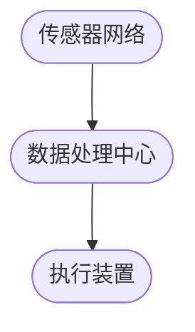
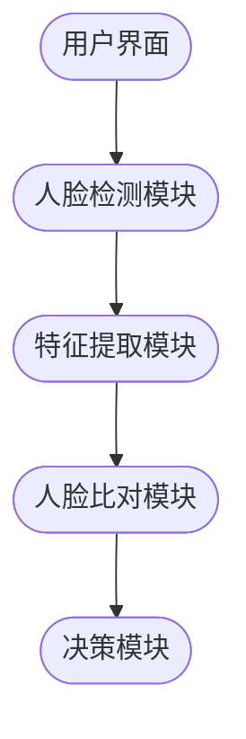
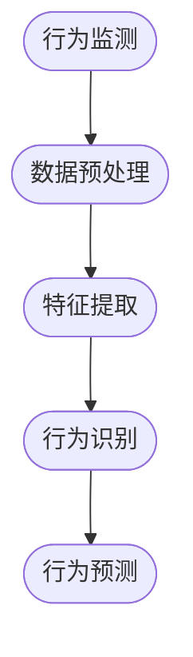
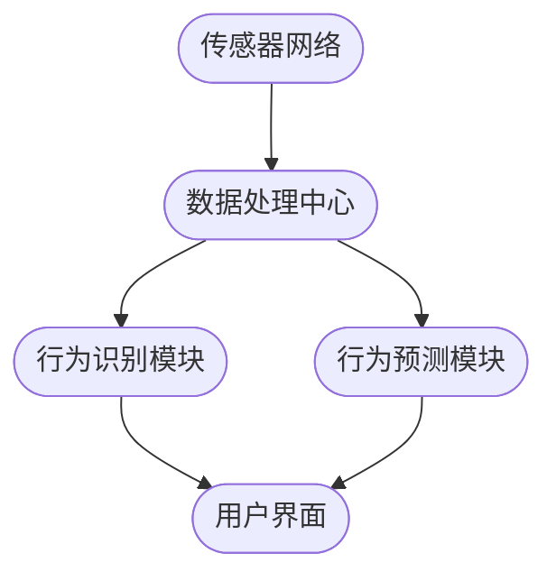
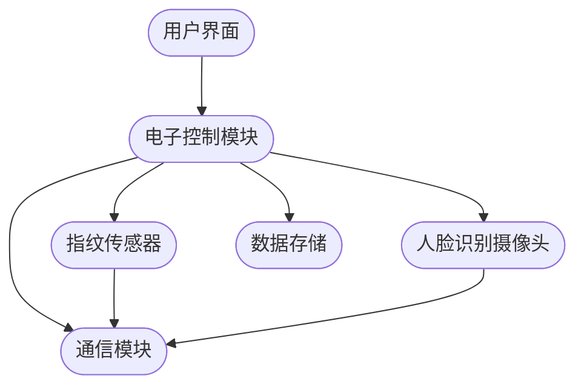
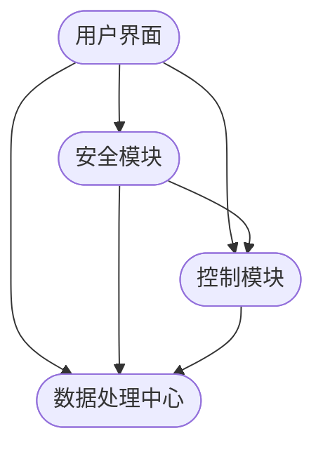
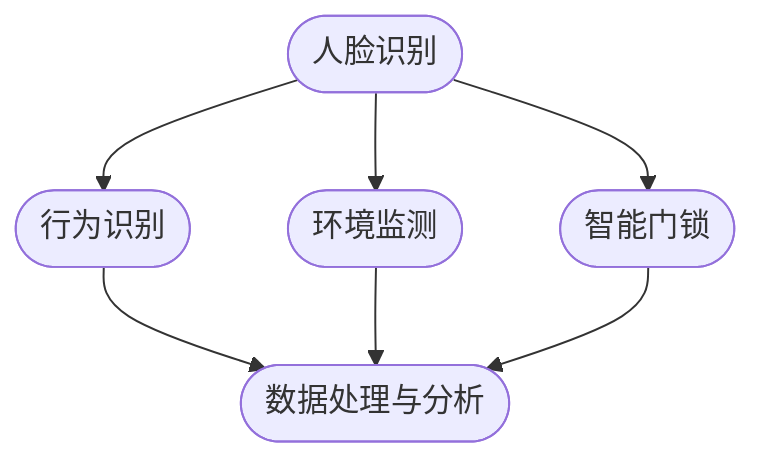
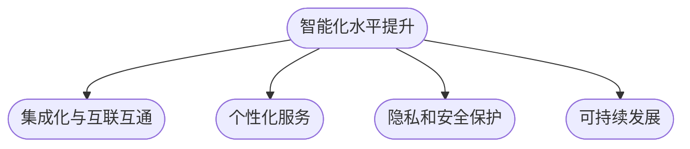
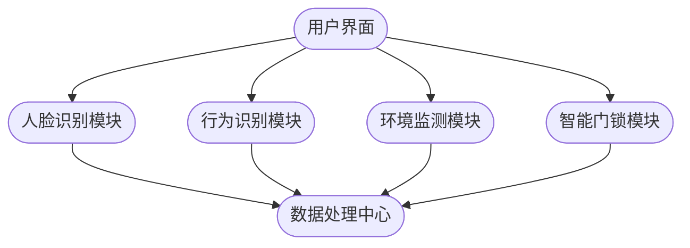
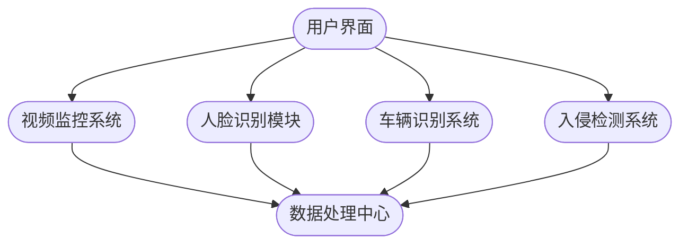

                 

基于您的要求，我们将逐步构建文章的详细内容，确保每一个章节都包含丰富的核心概念、算法原理讲解、数学模型和项目实战。以下是文章的整体结构和内容的详细梳理。

---

# 文章标题：人工智能在智能家居安全系统中的应用

> 关键词：人工智能、智能家居、安全系统、人脸识别、行为识别、环境监测

> 摘要：本文深入探讨了人工智能技术在智能家居安全系统中的应用，包括人脸识别、行为识别、环境监测等技术原理、实现方法和未来发展趋势。通过详细的项目实战和分析，揭示了人工智能如何提升智能家居安全系统的性能和可靠性。

## 第一部分：概述与基础

### 第1章：智能家居安全系统简介

**1.1 智能家居安全系统的定义与发展历程**

- **背景介绍**：介绍智能家居安全系统的起源、发展历程和现状。
- **核心概念与联系**：通过Mermaid流程图展示智能家居安全系统的基本架构和组成部分。
- **Mermaid流程图**：
  ```mermaid
  graph LR
  A([家居环境])
  B([传感器网络])
  C([数据处理中心])
  D([执行装置])
  A --> B
  B --> C
  C --> D
  ```

**1.2 智能家居安全系统的结构与功能**

- **核心概念与联系**：分析智能家居安全系统的基本结构，包括传感器网络、数据处理中心和执行装置。
- **结构图**：
  ```mermaid
  graph TB
  A1([传感器网络])
  A2([数据处理中心])
  A3([执行装置])
  A1 --> A2
  A2 --> A3
  ```

**1.3 人工智能与智能家居安全系统的关系**

- **核心概念与联系**：阐述人工智能在智能家居安全系统中的作用，如何通过人工智能技术提升系统的智能化水平。

### 第2章：人工智能基础

**2.1 机器学习基本原理**

- **核心概念与联系**：介绍机器学习的基本概念、分类和常用算法。
- **算法原理讲解**：使用伪代码详细阐述机器学习的基本算法。
- **数学模型和数学公式**：使用latex格式展示数学模型和公式，并进行详细讲解。

**2.2 深度学习基础**

- **核心概念与联系**：介绍深度学习的基本概念、架构和常用网络。
- **算法原理讲解**：使用伪代码详细阐述深度学习的基本算法。
- **数学模型和数学公式**：使用latex格式展示数学模型和公式，并进行详细讲解。

**2.3 人工智能安全与隐私保护**

- **核心概念与联系**：讨论人工智能在智能家居安全系统中的应用中可能面临的隐私和安全问题。
- **解决方案**：介绍现有的一些隐私保护和安全措施。

## 第二部分：智能家居安全系统中的人工智能应用

### 第3章：人脸识别技术

**3.1 人脸识别算法原理**

- **核心概念与联系**：通过Mermaid流程图展示人脸识别的基本流程。
- **算法原理讲解**：使用伪代码详细阐述人脸识别的关键算法。
- **数学模型和数学公式**：使用latex格式展示数学模型和公式，并进行详细讲解。

**3.2 人脸识别系统设计**

- **核心概念与联系**：分析人脸识别系统的设计要点和实现方法。
- **项目实战**：提供人脸识别系统的开发环境搭建、源代码实现和代码解读。

**3.3 人脸识别在智能家居安全系统中的应用**

- **核心概念与联系**：讨论人脸识别技术在智能家居安全系统中的实际应用场景。
- **项目实战**：分析一个实际的人脸识别智能家居安全系统案例。

### 第4章：行为识别技术

**4.1 行为识别算法原理**

- **核心概念与联系**：通过Mermaid流程图展示行为识别的基本流程。
- **算法原理讲解**：使用伪代码详细阐述行为识别的关键算法。
- **数学模型和数学公式**：使用latex格式展示数学模型和公式，并进行详细讲解。

**4.2 行为识别系统设计**

- **核心概念与联系**：分析行为识别系统的设计要点和实现方法。
- **项目实战**：提供行为识别系统的开发环境搭建、源代码实现和代码解读。

**4.3 行为识别在智能家居安全系统中的应用**

- **核心概念与联系**：讨论行为识别技术在智能家居安全系统中的实际应用场景。
- **项目实战**：分析一个实际的行为识别智能家居安全系统案例。

### 第5章：环境监测与预警

**5.1 环境监测传感器**

- **核心概念与联系**：介绍环境监测传感器的基本原理和类型。
- **数学模型和数学公式**：使用latex格式展示环境监测传感器相关的数学模型和公式。

**5.2 数据采集与处理**

- **核心概念与联系**：分析数据采集和处理的关键技术。
- **项目实战**：提供数据采集与处理的开发环境搭建、源代码实现和代码解读。

**5.3 环境监测在智能家居安全系统中的应用**

- **核心概念与联系**：讨论环境监测技术在智能家居安全系统中的实际应用场景。
- **项目实战**：分析一个实际的环境监测智能家居安全系统案例。

### 第6章：智能门锁与访问控制

**6.1 智能门锁技术原理**

- **核心概念与联系**：介绍智能门锁的基本原理和工作机制。
- **数学模型和数学公式**：使用latex格式展示智能门锁相关的数学模型和公式。

**6.2 智能门锁系统设计**

- **核心概念与联系**：分析智能门锁系统的设计要点和实现方法。
- **项目实战**：提供智能门锁系统的开发环境搭建、源代码实现和代码解读。

**6.3 智能门锁在智能家居安全系统中的应用**

- **核心概念与联系**：讨论智能门锁技术在智能家居安全系统中的实际应用场景。
- **项目实战**：分析一个实际的智能门锁智能家居安全系统案例。

### 第7章：综合安全解决方案

**7.1 智能家居安全系统的整体架构**

- **核心概念与联系**：介绍智能家居安全系统的整体架构和组成部分。
- **架构图**：
  ```mermaid
  graph TD
  A([用户界面])
  B([安全模块])
  C([控制模块])
  D([数据模块])
  A --> B
  A --> C
  A --> D
  ```

**7.2 人工智能在智能家居安全系统中的协同作用**

- **核心概念与联系**：讨论人工智能在智能家居安全系统中的协同作用，如何实现系统的高效和安全。
- **协同作用图**：
  ```mermaid
  graph TD
  A([人脸识别])
  B([行为识别])
  C([环境监测])
  D([门锁控制])
  A --> D
  B --> D
  C --> D
  ```

**7.3 智能家居安全系统的未来发展**

- **核心概念与联系**：展望智能家居安全系统的未来发展趋势，包括技术进步、市场前景和应用场景。

## 第8章：案例研究

**8.1 案例一：某智能家居安全系统的设计与实现**

- **核心概念与联系**：介绍一个具体的智能家居安全系统设计案例，包括系统架构、功能模块和关键技术。
- **项目实战**：详细分析该系统的开发环境搭建、源代码实现和代码解读。

**8.2 案例二：某智能社区安全系统的构建与优化**

- **核心概念与联系**：介绍一个智能社区安全系统构建案例，包括系统设计、实现过程和优化策略。
- **项目实战**：详细分析该系统的开发环境搭建、源代码实现和代码解读。

**8.3 案例分析总结**

- **核心概念与联系**：总结案例研究的经验和教训，提出对未来智能家居安全系统发展的建议。

---

以上是文章的整体结构和内容的详细梳理。接下来，我们将逐步填充每个章节的具体内容，确保文章的逻辑清晰、结构紧凑、简单易懂，满足技术博客文章的要求。

### 第1章：智能家居安全系统简介

#### 1.1 智能家居安全系统的定义与发展历程

**背景介绍**

随着信息技术的飞速发展，智能家居已经成为现代家庭生活中不可或缺的一部分。智能家居安全系统作为智能家居的核心功能之一，旨在提供全面的安全防护，保障家庭财产和人身安全。本文将深入探讨人工智能在智能家居安全系统中的应用，介绍相关技术原理、实现方法和未来发展趋势。

**核心概念与联系**

智能家居安全系统的基本架构包括家居环境、传感器网络、数据处理中心和执行装置。传感器网络负责收集家居环境中的各种信息，如温度、湿度、光照、烟雾等；数据处理中心对收集到的数据进行分析和处理，生成决策指令；执行装置根据指令执行相应的操作，如报警、门锁控制等。

**Mermaid流程图**


**发展历程**

智能家居安全系统的发展可以分为以下几个阶段：

1. **早期阶段**：以简单的报警系统为主，如烟雾报警器、煤气报警器等。
2. **初步发展阶段**：引入传感器网络和初步的数据处理功能，实现了对家居环境的基本监控和报警。
3. **智能化阶段**：随着人工智能技术的发展，智能家居安全系统开始采用机器学习和深度学习算法，实现了更智能的决策和更高的安全性。
4. **集成化阶段**：智能家居安全系统逐渐与其他智能家居系统集成，实现了更加全面和智能化的家庭安全防护。

#### 1.2 智能家居安全系统的结构与功能

**核心概念与联系**

智能家居安全系统的基本结构包括传感器网络、数据处理中心和执行装置。传感器网络负责收集家居环境中的各种信息，如温度、湿度、光照、烟雾等；数据处理中心对收集到的数据进行分析和处理，生成决策指令；执行装置根据指令执行相应的操作，如报警、门锁控制等。

**结构图**



**传感器网络**

传感器网络是智能家居安全系统的信息采集基础。常见的传感器包括：

1. **温度传感器**：用于检测室内温度，保障家居环境的舒适度。
2. **湿度传感器**：用于检测室内湿度，预防潮湿引起的霉变。
3. **光照传感器**：用于检测室内光照强度，实现自动灯光调节。
4. **烟雾传感器**：用于检测烟雾浓度，及时报警以预防火灾。
5. **红外传感器**：用于检测人体活动，实现入侵报警。

**数据处理中心**

数据处理中心负责对传感器网络收集到的数据进行实时分析和处理。其主要功能包括：

1. **数据预处理**：对采集到的原始数据进行清洗、去噪和格式化。
2. **特征提取**：从预处理后的数据中提取关键特征，用于后续的算法处理。
3. **模式识别**：使用机器学习和深度学习算法对特征进行分类和识别，生成决策指令。

**执行装置**

执行装置根据数据处理中心的决策指令执行相应的操作，如报警、门锁控制等。常见的执行装置包括：

1. **报警装置**：如蜂鸣器、闪光灯等，用于提醒用户发生异常情况。
2. **门锁控制装置**：如电子锁、指纹锁等，用于控制家庭门锁的开关。
3. **灯光控制装置**：如智能开关、智能灯泡等，用于控制家庭灯光的开关和亮度调节。
4. **环境控制装置**：如空调、加湿器、除湿器等，用于调节室内环境。

#### 1.3 人工智能与智能家居安全系统的关系

**核心概念与联系**

人工智能在智能家居安全系统中扮演着至关重要的角色。通过机器学习和深度学习算法，智能家居安全系统能够实现自我学习和自我优化，提高系统的智能化水平和安全性。

**人工智能在智能家居安全系统中的应用**

1. **人脸识别**：通过人脸识别技术，智能家居安全系统可以实现对家庭成员的精准识别，实现个性化服务和安全防护。
2. **行为识别**：通过行为识别技术，智能家居安全系统可以监测家庭成员的行为习惯，预测潜在的安全风险。
3. **环境监测**：通过环境监测技术，智能家居安全系统可以实时监测家居环境的变化，及时采取相应的防护措施。
4. **智能门锁**：通过智能门锁技术，智能家居安全系统可以实现对家庭门锁的智能控制，提高家庭安全。

**人工智能安全与隐私保护**

随着人工智能技术的广泛应用，智能家居安全系统面临着隐私和安全方面的挑战。为了保障用户的隐私和安全，需要采取以下措施：

1. **数据加密**：对采集到的用户数据进行加密处理，防止数据泄露。
2. **访问控制**：对系统的访问权限进行严格管理，确保只有授权用户才能访问敏感数据。
3. **异常检测**：通过异常检测技术，及时发现并阻止潜在的攻击行为。
4. **安全更新**：定期对系统进行安全更新和升级，修复已知的安全漏洞。

#### 1.4 智能家居安全系统的现状与挑战

**现状**

当前，智能家居安全系统已经在许多家庭中得到广泛应用，提供了一系列便捷和高效的安全服务。然而，随着技术的不断发展，智能家居安全系统也面临着一些挑战：

1. **数据隐私**：随着数据量的增加，如何保障用户数据的隐私和安全成为亟待解决的问题。
2. **安全性**：智能家居安全系统面临着各种安全威胁，如黑客攻击、恶意软件等，如何提高系统的安全性是当前研究的重点。
3. **兼容性**：智能家居安全系统需要与各种不同的设备和系统进行集成，如何保证系统的兼容性是一个挑战。

**未来发展方向**

为了应对上述挑战，智能家居安全系统需要朝着以下几个方向发展：

1. **人工智能技术**：通过引入更先进的人工智能技术，提高系统的智能化水平和自学习能力。
2. **云计算与物联网**：通过云计算和物联网技术，实现智能家居安全系统的互联互通，提供更加全面和高效的安全服务。
3. **用户参与**：鼓励用户参与到智能家居安全系统的设计和优化中，提高系统的可用性和用户体验。

#### 结论

智能家居安全系统是智能家居的重要组成部分，通过人工智能技术的应用，可以实现更加智能、高效和安全的家庭安全防护。本文对智能家居安全系统的定义、结构、人工智能应用以及未来发展进行了详细探讨，为智能家居安全系统的研究和应用提供了参考。

---

在本章节中，我们介绍了智能家居安全系统的定义、发展历程、基本结构以及人工智能与智能家居安全系统之间的关系。接下来，我们将深入探讨人工智能在智能家居安全系统中的应用，包括人脸识别、行为识别、环境监测等关键技术。这些技术的实现方法和应用场景将帮助我们更好地理解人工智能在提升智能家居安全系统性能方面的作用。

### 第2章：人工智能基础

#### 2.1 机器学习基本原理

**核心概念与联系**

机器学习是一种通过数据训练模型，从而使计算机具备一定程度的自主学习和决策能力的技术。在智能家居安全系统中，机器学习可以用于各种任务，如数据分类、异常检测和预测等。

**机器学习的分类**

根据学习方式，机器学习可以分为以下几类：

1. **监督学习**：在有标注数据集上进行训练，学习输入和输出之间的映射关系。
2. **无监督学习**：在没有标注数据集的情况下，通过发现数据分布或结构来学习。
3. **半监督学习**：在有部分标注数据集的情况下，利用未标注数据提高学习效果。
4. **强化学习**：通过与环境的交互，学习最优策略。

**常见算法**

1. **线性回归**：通过最小二乘法找到最佳拟合直线，用于预测连续值。
2. **逻辑回归**：用于二分类问题，输出概率值。
3. **决策树**：通过多叉决策对样本进行分类或回归。
4. **支持向量机**：通过找到最佳分类超平面，实现分类。
5. **神经网络**：模拟人脑神经元结构，用于复杂模式识别。

**算法原理讲解**

以线性回归为例，其原理如下：

1. **假设**：样本数据满足线性关系，即$y = \beta_0 + \beta_1x + \epsilon$，其中$y$为输出，$x$为输入，$\beta_0$和$\beta_1$为参数，$\epsilon$为误差。
2. **模型训练**：使用最小二乘法找到最佳拟合直线，即最小化误差平方和$J(\theta) = \frac{1}{2m}\sum_{i=1}^{m}(h_\theta(x^{(i)}) - y^{(i)})^2$，其中$m$为样本数量，$h_\theta(x) = \theta_0 + \theta_1x$为假设函数。
3. **模型评估**：通过验证集或测试集评估模型性能，选择最佳模型。

**伪代码**

```python
def linear_regression(X, y):
    # X: 输入特征，y: 输出标签
    # 梯度下降法优化参数
    m = len(y)
    theta = [0] * 2  # 初始化参数
    alpha = 0.01  # 学习率
    num_iterations = 1000  # 迭代次数
    for i in range(num_iterations):
        h = X @ theta
        error = h - y
        theta = theta - (alpha / m) * (X.T @ error)
    return theta
```

**数学模型和数学公式**

线性回归的数学模型可以表示为：

$$ h_\theta(x) = \theta_0 + \theta_1x $$

其中，$\theta_0$和$\theta_1$分别为参数。

损失函数（误差平方和）可以表示为：

$$ J(\theta) = \frac{1}{2m}\sum_{i=1}^{m}(h_\theta(x^{(i)}) - y^{(i)})^2 $$

#### 2.2 深度学习基础

**核心概念与联系**

深度学习是机器学习的一个分支，其核心思想是模拟人脑神经网络的结构和功能，通过多层神经元的堆叠，实现对复杂数据的特征提取和模式识别。

**深度学习的架构**

深度学习的架构可以分为以下几层：

1. **输入层**：接收外部输入数据。
2. **隐藏层**：进行特征提取和变换。
3. **输出层**：生成最终输出结果。

**常见网络**

1. **卷积神经网络（CNN）**：用于处理图像、语音等二维或三维数据。
2. **循环神经网络（RNN）**：用于处理序列数据，如时间序列、文本等。
3. **生成对抗网络（GAN）**：用于生成与真实数据相似的数据。

**算法原理讲解**

以卷积神经网络（CNN）为例，其原理如下：

1. **卷积层**：通过卷积操作提取图像特征，如边缘、纹理等。
2. **池化层**：对卷积特征进行下采样，减少参数数量和计算量。
3. **全连接层**：对池化层输出的特征进行分类或回归。
4. **激活函数**：用于引入非线性变换，提高模型的识别能力。

**伪代码**

```python
def convolutional_neural_network(X, y):
    # X: 输入特征，y: 输出标签
    # 卷积层参数
    W1 = np.random.randn(3, 3, 1, 32)  # 3x3 卷积核，1 个输入通道，32 个输出通道
    b1 = np.random.randn(32)
    # 池化层参数
    W2 = np.random.randn(3, 3, 32, 64)  # 3x3 卷积核，32 个输入通道，64 个输出通道
    b2 = np.random.randn(64)
    # 全连接层参数
    W3 = np.random.randn(64, 10)  # 64 个输入，10 个输出
    b3 = np.random.randn(10)
    # 梯度下降法优化参数
    alpha = 0.01
    num_iterations = 1000
    for i in range(num_iterations):
        # 前向传播
        z1 = X @ W1 + b1
        a1 = activation(z1)
        z2 = a1 @ W2 + b2
        a2 = activation(z2)
        z3 = a2 @ W3 + b3
        y_pred = activation(z3)
        # 反向传播
        dZ3 = y_pred - y
        dW3 = a2.T @ dZ3
        db3 = dZ3.sum(axis=0)
        dZ2 = dZ3 @ W3.T
        dW2 = a1.T @ dZ2
        db2 = dZ2.sum(axis=0)
        dZ1 = dZ2 @ W2.T
        dW1 = X.T @ dZ1
        db1 = dZ1.sum(axis=0)
        # 参数更新
        W3 -= alpha * dW3
        b3 -= alpha * db3
        W2 -= alpha * dW2
        b2 -= alpha * db2
        W1 -= alpha * dW1
        b1 -= alpha * db1
    return W1, b1, W2, b2, W3, b3
```

**数学模型和数学公式**

卷积神经网络的数学模型可以表示为：

$$
\begin{aligned}
z^{(l)} &= X^{(l)} \cdot W^{(l)} + b^{(l)}, \\
a^{(l)} &= \text{activation}(z^{(l)}),
\end{aligned}
$$

其中，$X^{(l)}$为输入特征，$W^{(l)}$为权重，$b^{(l)}$为偏置，$a^{(l)}$为激活输出。

激活函数通常为ReLU（Rectified Linear Unit）：

$$
\text{ReLU}(x) = \max(0, x).
$$

#### 2.3 人工智能安全与隐私保护

**核心概念与联系**

人工智能在智能家居安全系统中发挥着重要作用，但同时也带来了隐私和安全方面的挑战。为了保障用户的隐私和安全，需要采取一系列措施。

**数据隐私**

1. **数据加密**：对采集到的用户数据进行加密处理，防止数据泄露。
2. **数据匿名化**：在数据处理和分析过程中，对用户数据进行匿名化处理，避免直接关联到个人身份。

**访问控制**

1. **身份认证**：对访问系统的人员进行严格的身份认证，确保只有授权用户才能访问敏感数据。
2. **访问权限管理**：对系统中的不同权限进行严格管理，确保用户只能访问与其角色相关的数据。

**异常检测**

1. **入侵检测系统（IDS）**：通过分析网络流量和系统行为，及时发现并阻止潜在的攻击行为。
2. **异常行为检测**：通过行为识别技术，监测用户的行为模式，及时发现异常行为。

**安全更新**

1. **定期安全审计**：定期对系统进行安全审计，发现和修复潜在的安全漏洞。
2. **安全补丁更新**：及时应用安全补丁，修复已发现的安全漏洞。

**法律法规**

1. **遵循法律法规**：确保系统设计和实施符合相关法律法规要求，如数据保护法、隐私法等。
2. **用户知情同意**：在数据收集和使用过程中，确保用户知晓并同意相关隐私政策。

#### 2.4 智能家居安全系统中的常见问题与解决方案

**核心概念与联系**

智能家居安全系统在实际应用中可能会遇到各种问题，如数据隐私泄露、系统安全性不足等。为了解决这些问题，需要采取一系列技术和管理措施。

**常见问题**

1. **数据隐私泄露**：系统中的用户数据可能被未授权访问或泄露。
2. **系统安全性不足**：系统可能受到黑客攻击、恶意软件等威胁。
3. **兼容性和互操作性**：不同设备和系统之间的兼容性和互操作性可能存在问题。

**解决方案**

1. **数据隐私保护**
   - 数据加密：对用户数据进行加密存储和传输。
   - 数据匿名化：对用户数据进行匿名化处理，降低隐私泄露风险。

2. **系统安全性提升**
   - 身份认证：对系统访问进行严格的身份认证。
   - 安全审计：定期对系统进行安全审计，发现和修复安全漏洞。
   - 防火墙和入侵检测系统：部署防火墙和入侵检测系统，防止外部攻击。

3. **兼容性和互操作性**
   - 标准化协议：采用标准化协议，确保设备和系统之间的互操作性。
   - 开放接口：提供开放的接口，方便第三方系统集成和扩展。

#### 2.5 智能家居安全系统的未来发展趋势

**核心概念与联系**

随着人工智能和物联网技术的不断发展，智能家居安全系统将朝着更加智能化、安全化和人性化的方向发展。以下是一些未来发展趋势：

1. **智能化水平提高**：通过更先进的人工智能技术，实现更智能、更精准的家居安全管理。
2. **集成化和互联互通**：通过云计算和物联网技术，实现智能家居安全系统与其他系统的集成和互联互通。
3. **个性化服务**：根据用户行为和需求，提供个性化的安全服务和智能家居体验。
4. **隐私和安全保护**：采取更严格的隐私和安全保护措施，确保用户数据的安全和隐私。

#### 结论

本章介绍了智能家居安全系统的基础知识，包括机器学习和深度学习的基本原理、人工智能安全与隐私保护以及智能家居安全系统中的常见问题和解决方案。这些基础知识的理解和应用对于构建高效、安全和智能的智能家居安全系统至关重要。

---

在下一章节中，我们将进一步探讨人工智能在智能家居安全系统中的具体应用，包括人脸识别、行为识别和环境监测等技术，通过详细的项目实战和分析，展示这些技术如何提升智能家居安全系统的性能和可靠性。

### 第3章：人脸识别技术

#### 3.1 人脸识别算法原理

**核心概念与联系**

人脸识别技术是人工智能领域的一个重要分支，其核心在于通过分析人脸图像的特征，实现对人脸的自动识别。在智能家居安全系统中，人脸识别技术主要用于身份验证和访问控制，提供便捷且安全的家庭安全解决方案。

**人脸识别的基本流程**

人脸识别通常包括以下几个步骤：

1. **人脸检测**：从图像或视频中检测出人脸区域。
2. **人脸特征提取**：提取人脸的特征点，生成特征向量。
3. **人脸比对**：将提取的特征向量与数据库中的已知人脸特征进行比对，计算相似度。
4. **决策**：根据比对结果，判断是否为人脸匹配。

**Mermaid流程图**


**人脸检测**

人脸检测是整个识别过程中的第一步，主要任务是定位图像中的人脸区域。常用的算法包括：

1. **基于深度学习的检测算法**：如ResNet、Inception等。
2. **基于传统机器学习的检测算法**：如Haar-like特征分类器、LBP等。

**伪代码**

```python
def detect_faces(image):
    # 加载预训练的模型
    model = load_model('face_detection_model.h5')
    # 对图像进行预处理
    preprocessed_image = preprocess_image(image)
    # 执行人脸检测
    face_locations = model.predict(preprocessed_image)
    return face_locations
```

**人脸特征提取**

人脸特征提取是将人脸图像转换为向量表示的过程，用于后续的人脸比对。常用的算法包括：

1. **基于特征点的方法**：如Eigenvector-based Face Recognition、LBP等。
2. **基于深度学习的方法**：如VGGFace、FaceNet等。

**伪代码**

```python
def extract_features(face):
    # 加载预训练的模型
    model = load_model('face_feature_extraction_model.h5')
    # 对人脸进行预处理
    preprocessed_face = preprocess_face(face)
    # 提取特征向量
    feature_vector = model.predict(preprocessed_face)
    return feature_vector
```

**人脸比对**

人脸比对是将提取的特征向量与数据库中的已知特征进行比对，计算相似度。常用的方法包括：

1. **基于距离度量的方法**：如Euclidean距离、Cosine相似度等。
2. **基于分类器的方法**：如SVM、KNN等。

**伪代码**

```python
def compare_faces(feature_vector, database):
    # 计算与数据库中每个人的相似度
    similarities = []
    for feature in database:
        similarity = calculate_similarity(feature_vector, feature)
        similarities.append(similarity)
    # 找到最相似的一个人
    max_similarity = max(similarities)
    return max_similarity
```

**决策**

根据人脸比对的结果，系统将做出相应的决策，如允许访问或拒绝访问。

**伪代码**

```python
def facial_recognition(image, database):
    # 检测人脸
    faces = detect_faces(image)
    for face in faces:
        # 提取特征
        feature_vector = extract_features(face)
        # 比对人脸
        similarity = compare_faces(feature_vector, database)
        # 决策
        if similarity > threshold:
            return "Person recognized"
        else:
            return "Person not recognized"
```

#### 3.2 人脸识别系统设计

**核心概念与联系**

人脸识别系统的设计涉及硬件、软件和数据处理等多个方面，需要综合考虑系统的性能、可靠性和用户体验。以下是人脸识别系统设计的主要要点：

**硬件选择**

1. **摄像头**：选择高分辨率、低延迟的摄像头，确保人脸图像的质量和实时性。
2. **处理器**：选择具备强大计算能力的处理器，以支持人脸检测和特征提取等计算密集型任务。

**软件设计**

1. **人脸检测模块**：集成常用的深度学习模型，如ResNet、SSD等，实现快速、准确的人脸检测。
2. **特征提取模块**：选择适合人脸特征提取的模型，如VGGFace、FaceNet等，实现高效的特征提取。
3. **人脸比对模块**：设计基于距离度量或分类器的比对算法，实现人脸的精确识别。

**数据处理**

1. **数据预处理**：对采集到的人脸图像进行预处理，如归一化、灰度化等，以适应模型的输入要求。
2. **数据存储**：设计高效的数据存储方案，确保人脸特征数据的快速读取和存储。

**系统架构**

人脸识别系统的基本架构包括以下几个部分：

1. **用户界面**：提供用户交互的界面，如登录、注册、人脸录入等。
2. **人脸检测模块**：负责检测输入图像中的人脸区域。
3. **特征提取模块**：对检测到的人脸进行特征提取。
4. **人脸比对模块**：将提取的特征与数据库中的人脸特征进行比对。
5. **决策模块**：根据比对结果做出相应的决策，如允许访问或拒绝访问。

**系统架构图**



#### 3.3 人脸识别在智能家居安全系统中的应用

**核心概念与联系**

人脸识别技术在智能家居安全系统中具有广泛的应用，可以实现家庭成员的身份验证、访客管理和自动监控等功能，提高家庭安全性和便捷性。

**家庭成员身份验证**

人脸识别技术可以用于家庭成员的身份验证，确保只有授权人员才能进入家庭。具体应用包括：

1. **门禁系统**：通过人脸识别技术控制家庭门禁，实现无钥匙进入。
2. **智能摄像头**：对进入家庭的成员进行人脸识别，实时监控家庭成员的活动情况。

**访客管理**

人脸识别技术可以帮助家庭主人对访客进行管理，提高家庭的安全性。具体应用包括：

1. **访客预约**：访客提前通过手机应用预约访问，家庭主人在收到访客信息后进行人脸识别确认。
2. **访客记录**：访客进入家庭后，系统自动记录其人脸信息，便于后续查询和管理。

**自动监控**

人脸识别技术可以用于自动监控家庭环境，实时检测家庭成员的行为，提高家庭安全。具体应用包括：

1. **异常行为检测**：系统监控家庭成员的行为，如长时间不活动或突然离开等，自动报警。
2. **活动记录**：系统记录家庭成员的活动情况，便于家庭主人在需要时进行查询。

**应用案例**

以下是一个人脸识别在智能家居安全系统中的应用案例：

**案例一：智能门禁系统**

某家庭安装了智能门禁系统，通过人脸识别技术控制家庭门禁。家庭成员只需在系统上进行人脸录入，每次进入家庭时只需在摄像头前进行面部扫描即可开启门禁。系统还可以记录每个成员的进入时间，方便家庭主人在需要时进行查询。

**案例二：智能摄像头**

某家庭安装了智能摄像头，用于监控家庭成员的活动。摄像头通过人脸识别技术识别家庭成员，当家庭成员离开家庭时，系统会自动发送报警信息给家庭成员。同时，系统还可以记录家庭成员的活动情况，便于家庭主人在需要时进行查看。

**案例分析**

**案例一**中，智能门禁系统通过人脸识别技术实现了家庭成员的身份验证，提高了家庭的安全性。同时，系统的便捷性也提升了家庭成员的体验。**案例二**中，智能摄像头通过人脸识别技术实现了家庭成员的异常行为检测，进一步提高了家庭的安全防护能力。

#### 结论

本章详细介绍了人脸识别技术在智能家居安全系统中的应用，包括算法原理、系统设计以及实际应用案例。人脸识别技术通过精确的身份验证和智能监控，为家庭安全提供了强有力的保障。在未来，随着人工智能技术的不断发展，人脸识别技术将在智能家居安全系统中发挥更加重要的作用。

---

在下一章节中，我们将继续探讨智能家居安全系统中的行为识别技术，分析其原理、实现方法和应用案例，展示如何通过行为识别技术提升家庭安全性和智能化水平。

### 第4章：行为识别技术

#### 4.1 行为识别算法原理

**核心概念与联系**

行为识别技术是人工智能在智能家居安全系统中的一项重要应用，通过监测和识别用户的行为模式，可以实现对家庭安全的实时监控和预警。行为识别技术不仅能够提高家庭的安全性，还能够为用户提供更加智能化的家居体验。

**行为识别的基本流程**

行为识别通常包括以下几个步骤：

1. **行为监测**：通过传感器和摄像头等设备，收集用户的行为数据。
2. **数据预处理**：对收集到的行为数据进行清洗、去噪和格式化，为后续分析做准备。
3. **特征提取**：从预处理后的数据中提取关键特征，用于行为识别。
4. **行为识别**：使用机器学习算法对提取的特征进行分类和识别。
5. **行为预测**：根据历史行为数据，预测用户可能的行为。

**Mermaid流程图**



**行为监测**

行为监测是行为识别的基础，通过传感器和摄像头等设备，实时收集用户的行为数据。常用的传感器包括：

1. **加速度传感器**：用于监测用户的运动状态。
2. **陀螺仪传感器**：用于监测用户的姿态变化。
3. **摄像头**：用于捕获用户的行为图像。

**数据预处理**

数据预处理是行为识别的重要环节，主要包括以下步骤：

1. **去噪**：去除数据中的噪声，提高数据的准确性。
2. **归一化**：将不同来源的数据进行归一化处理，使其具有相同的量纲。
3. **特征提取**：从预处理后的数据中提取关键特征，为后续的行为识别提供输入。

**特征提取**

特征提取是将原始数据转换为可用于机器学习模型的特征向量。常用的特征提取方法包括：

1. **时域特征**：如平均值、方差、峰值等。
2. **频域特征**：如傅里叶变换、小波变换等。
3. **时频特征**：如短时傅里叶变换（STFT）、Wigner-Ville分布等。

**行为识别**

行为识别是行为识别技术的核心，通过机器学习算法对提取的特征进行分类和识别。常用的算法包括：

1. **支持向量机（SVM）**：用于分类任务。
2. **决策树**：用于分类和回归任务。
3. **随机森林**：用于分类和回归任务。
4. **深度学习**：如卷积神经网络（CNN）和循环神经网络（RNN）等。

**伪代码**

```python
def behavior_recognition(features, model):
    # 加载预训练的模型
    model = load_model('behavior_recognition_model.h5')
    # 对特征进行预处理
    preprocessed_features = preprocess_features(features)
    # 进行行为识别
    behavior = model.predict(preprocessed_features)
    return behavior
```

**行为预测**

行为预测是基于历史行为数据，预测用户未来的行为。通过行为预测，可以提前发现潜在的安全风险，并采取相应的措施。常用的预测方法包括：

1. **时间序列分析**：如ARIMA模型、LSTM网络等。
2. **概率模型**：如贝叶斯网络、马尔可夫模型等。

**伪代码**

```python
def behavior_prediction(historical_data, model):
    # 加载预训练的模型
    model = load_model('behavior_prediction_model.h5')
    # 对历史数据进行预处理
    preprocessed_data = preprocess_historical_data(historical_data)
    # 进行行为预测
    future_behavior = model.predict(preprocessed_data)
    return future_behavior
```

#### 4.2 行为识别系统设计

**核心概念与联系**

行为识别系统设计是一个复杂的过程，需要考虑硬件选择、软件架构、数据处理等多个方面。以下是人脸识别系统设计的主要要点：

**硬件选择**

1. **传感器**：选择高精度、低延迟的传感器，如加速度传感器、陀螺仪传感器等。
2. **摄像头**：选择高分辨率、低延迟的摄像头，用于捕获用户的行为图像。
3. **处理器**：选择具备强大计算能力的处理器，以支持实时行为识别和预测。

**软件架构**

1. **数据采集模块**：负责从传感器和摄像头等设备中采集用户的行为数据。
2. **数据处理模块**：对采集到的行为数据进行预处理、特征提取和存储。
3. **行为识别模块**：使用机器学习算法对提取的特征进行分类和识别。
4. **行为预测模块**：根据历史行为数据，预测用户可能的行为。
5. **用户界面**：提供用户交互的界面，如行为识别结果展示、报警信息推送等。

**数据处理**

1. **数据预处理**：对采集到的行为数据进行去噪、归一化和特征提取。
2. **数据存储**：设计高效的数据存储方案，确保行为数据的快速读取和存储。

**系统架构**

行为识别系统的基本架构包括以下几个部分：

1. **传感器网络**：负责实时监测用户的行为数据。
2. **数据处理中心**：对传感器网络采集到的行为数据进行预处理和特征提取。
3. **行为识别模块**：使用机器学习算法对提取的特征进行分类和识别。
4. **行为预测模块**：根据历史行为数据，预测用户可能的行为。
5. **用户界面**：提供用户交互的界面，如行为识别结果展示、报警信息推送等。

**系统架构图**



#### 4.3 行为识别在智能家居安全系统中的应用

**核心概念与联系**

行为识别技术在智能家居安全系统中具有广泛的应用，可以实现家庭安全的实时监控和预警，提高家庭的安全性。以下是一些具体的应用场景：

**家庭安全监控**

行为识别技术可以用于家庭安全监控，实时监测家庭成员的活动，及时发现异常行为。具体应用包括：

1. **异常行为检测**：系统实时监测家庭成员的行为，如长时间不活动或突然离开等，自动报警。
2. **行为记录**：系统记录家庭成员的活动情况，便于家庭主人在需要时进行查询。

**访客管理**

行为识别技术可以用于访客管理，识别访客的行为模式，提高家庭的安全性。具体应用包括：

1. **访客识别**：系统识别访客的行为，如进入家庭或离开家庭等，自动记录访客信息。
2. **访客行为分析**：系统分析访客的行为，如频繁出现在特定时间段或特定地点，自动报警。

**智能安防**

行为识别技术可以用于智能安防，实时监测家庭环境，提高家庭的安全性。具体应用包括：

1. **入侵检测**：系统监测家庭环境中的异常行为，如有人进入未经授权的区域，自动报警。
2. **火灾预警**：系统监测家庭环境中的温度、烟雾等参数，一旦发现异常，自动报警并通知家庭成员。

**应用案例**

以下是一个行为识别在智能家居安全系统中的应用案例：

**案例一：智能家庭安全系统**

某家庭安装了智能家庭安全系统，通过行为识别技术实现家庭安全的实时监控。系统实时监测家庭成员的活动，如长时间不活动或突然离开等，自动发送报警信息给家庭成员。系统还记录家庭成员的活动情况，便于家庭主人在需要时进行查询。

**案例二：智能访客管理系统**

某社区安装了智能访客管理系统，通过行为识别技术识别访客的行为模式。系统自动记录访客的进入和离开时间，分析访客的行为，如频繁出现在特定时间段或特定地点，自动发送报警信息给物业管理人员。

**案例分析**

**案例一**中，智能家庭安全系统通过行为识别技术实现了家庭安全的实时监控和预警，提高了家庭的安全性。**案例二**中，智能访客管理系统通过行为识别技术实现了访客的自动管理和行为分析，提高了社区的安全性。

#### 结论

本章详细介绍了行为识别技术在智能家居安全系统中的应用，包括算法原理、系统设计以及实际应用案例。行为识别技术通过实时监测和识别用户的行为模式，为家庭安全提供了强有力的保障。在未来，随着人工智能技术的不断发展，行为识别技术将在智能家居安全系统中发挥更加重要的作用。

---

在下一章节中，我们将探讨环境监测与预警技术在智能家居安全系统中的应用，分析环境监测传感器、数据采集与处理的方法，并探讨其在家居安全中的应用场景。

### 第5章：环境监测与预警

#### 5.1 环境监测传感器

**核心概念与联系**

环境监测传感器是智能家居安全系统的关键组成部分，用于实时监测家庭环境中的各种参数，如温度、湿度、光照、烟雾等。这些传感器能够提供丰富的环境数据，为智能家居安全系统的智能决策提供依据。

**传感器类型**

1. **温度传感器**：用于监测室内温度，常见类型包括热敏电阻、热电偶等。
2. **湿度传感器**：用于监测室内湿度，常见类型包括电容式湿度传感器、电阻式湿度传感器等。
3. **光照传感器**：用于监测室内光照强度，常见类型包括光敏电阻、光电二极管等。
4. **烟雾传感器**：用于监测烟雾浓度，常见类型包括离子感应式烟雾传感器、光电式烟雾传感器等。
5. **气体传感器**：用于监测室内有害气体，如一氧化碳、甲烷等，常见类型包括半导体气体传感器、电化学气体传感器等。

**工作原理**

1. **温度传感器**：通过测量物体的热辐射或热传导，将温度转换为电信号。
2. **湿度传感器**：通过测量空气中的水汽含量，将湿度转换为电信号。
3. **光照传感器**：通过测量光线的强度，将光照强度转换为电信号。
4. **烟雾传感器**：通过检测烟雾颗粒对光的吸收或散射，将烟雾浓度转换为电信号。
5. **气体传感器**：通过检测气体与传感材料之间的化学反应，将气体浓度转换为电信号。

**选择与部署**

在选择和部署环境监测传感器时，需要考虑以下因素：

1. **精度和灵敏度**：传感器的精度和灵敏度直接影响监测数据的可靠性。
2. **稳定性**：传感器需要具备良好的稳定性，以确保长期监测的准确性。
3. **功耗**：传感器的功耗直接影响系统的能源消耗，特别是在使用电池供电的智能家居系统中。
4. **通信方式**：传感器需要支持可靠的通信方式，如WiFi、蓝牙、Zigbee等，以便将数据传输到数据处理中心。

#### 5.2 数据采集与处理

**核心概念与联系**

环境监测数据的有效采集和处理是智能家居安全系统的重要组成部分。通过高效的数据采集和处理，可以确保监测数据的准确性和及时性，为智能决策提供可靠依据。

**数据采集**

1. **传感器数据采集**：传感器通过内置的ADC（模数转换器）将模拟信号转换为数字信号，然后将数据发送到数据处理中心。
2. **无线传输**：传感器可以通过无线通信模块（如WiFi、蓝牙、Zigbee等）将数据传输到数据处理中心。

**数据处理**

1. **数据预处理**：在数据处理过程中，首先进行数据预处理，包括去噪、滤波、归一化等，以提高数据的质量和可靠性。
2. **特征提取**：从预处理后的数据中提取关键特征，用于后续的算法分析和决策。
3. **数据存储**：将处理后的数据存储在数据库中，以便后续查询和分析。

**数据处理流程**

1. **数据采集**：传感器采集环境数据，如温度、湿度、光照、烟雾等。
2. **数据传输**：传感器将采集到的数据通过无线通信模块传输到数据处理中心。
3. **数据预处理**：对传输的数据进行去噪、滤波、归一化等预处理，提高数据质量。
4. **特征提取**：从预处理后的数据中提取关键特征，如平均值、方差、峰值等。
5. **数据存储**：将处理后的数据存储在数据库中，以便后续分析。

**伪代码**

```python
def data_acquisition():
    # 采集传感器数据
    temperature = read_temperature_sensor()
    humidity = read_humidity_sensor()
    light_intensity = read_light_sensor()
    smoke_concentration = read_smoke_sensor()
    
    # 数据预处理
    temperature = preprocess_temperature(temperature)
    humidity = preprocess_humidity(humidity)
    light_intensity = preprocess_light(light_intensity)
    smoke_concentration = preprocess_smoke(smoke_concentration)
    
    # 特征提取
    temperature_feature = extract_temperature_feature(temperature)
    humidity_feature = extract_humidity_feature(humidity)
    light_intensity_feature = extract_light_feature(light_intensity)
    smoke_concentration_feature = extract_smoke_feature(smoke_concentration)
    
    # 数据存储
    store_data(temperature_feature, humidity_feature, light_intensity_feature, smoke_concentration_feature)

def preprocess_data(data):
    # 去噪、滤波、归一化等预处理操作
    preprocessed_data = ...
    return preprocessed_data

def extract_feature(data):
    # 提取关键特征
    feature = ...
    return feature

def store_data(temperature_feature, humidity_feature, light_intensity_feature, smoke_concentration_feature):
    # 存储数据到数据库
    ...
```

#### 5.3 环境监测在智能家居安全系统中的应用

**核心概念与联系**

环境监测技术在智能家居安全系统中具有广泛的应用，通过实时监测家庭环境中的各种参数，可以实现对潜在危险情况的预警和及时响应，提高家庭的安全性。

**应用场景**

1. **火灾预警**：通过监测烟雾浓度和温度等参数，系统可以在火灾发生前发出预警，及时通知家庭成员采取逃生措施。
2. **煤气泄漏检测**：通过监测室内一氧化碳等有害气体的浓度，系统可以在煤气泄漏时发出警报，防止中毒事故的发生。
3. **温度和湿度控制**：通过监测室内温度和湿度，系统可以自动调节空调和加湿器等设备，保持室内环境的舒适和干燥，预防霉变和过敏。
4. **光照调节**：通过监测光照强度，系统可以自动调节灯光的亮度和颜色，提供适宜的光照环境，提升家庭成员的生活质量。

**案例分析**

以下是一个环境监测在智能家居安全系统中的应用案例：

**案例一：智能火灾预警系统**

某家庭安装了智能火灾预警系统，通过烟雾传感器和温度传感器实时监测家庭环境。当系统检测到烟雾浓度超过安全阈值或温度异常升高时，系统会立即发出警报，并通过手机应用通知家庭成员。系统还具备自动报警功能，可以自动启动灭火器或关闭燃气阀门，以防止火灾进一步扩大。

**案例二：智能煤气泄漏检测系统**

某公寓安装了智能煤气泄漏检测系统，通过一氧化碳传感器监测室内气体浓度。当系统检测到煤气浓度超过安全阈值时，会立即发出警报，并通过手机应用通知住户和物业管理人员。系统还具备自动关闭燃气阀门的功能，以防止煤气泄漏引发的安全事故。

**结论**

环境监测技术在智能家居安全系统中扮演着重要的角色，通过实时监测家庭环境中的各种参数，可以为家庭安全提供强有力的保障。在未来，随着传感器技术和人工智能算法的不断发展，环境监测技术将在智能家居安全系统中发挥更加重要的作用。

---

在下一章节中，我们将探讨智能门锁与访问控制技术在智能家居安全系统中的应用，分析其技术原理、系统设计以及在家居安全中的作用。

### 第6章：智能门锁与访问控制

#### 6.1 智能门锁技术原理

**核心概念与联系**

智能门锁作为智能家居安全系统的重要组成部分，通过多种技术手段实现家庭门锁的智能控制和安全防护。智能门锁技术主要包括电子锁、指纹锁、人脸识别锁等，每种技术都有其独特的原理和应用场景。

**电子锁技术原理**

电子锁是一种通过电子方式控制的门锁，其核心原理是通过电子控制模块接收并处理用户的指令，实现门锁的开启和关闭。电子锁通常包括以下几个部分：

1. **电子控制模块**：接收用户指令，如密码输入、指纹扫描、手机遥控等，并通过微控制器进行逻辑处理。
2. **电磁锁**：作为门锁的核心部件，通过电磁力控制门锁的锁定和解锁。
3. **电源模块**：为电子锁提供稳定的电力供应。

**电子锁工作流程**

1. **用户指令输入**：用户通过输入密码、指纹或手机遥控等方式发送解锁指令。
2. **指令处理**：电子控制模块接收并验证用户指令，确认无误后发送解锁信号。
3. **门锁动作**：电磁锁根据接收到的解锁信号，产生电磁力将门锁打开。

**指纹锁技术原理**

指纹锁通过指纹识别技术实现门锁的开启，其核心原理是通过指纹传感器采集用户的指纹特征，并将特征数据与存储在数据库中的指纹数据进行比对，以验证用户身份。指纹锁通常包括以下几个部分：

1. **指纹传感器**：用于采集用户的指纹图像。
2. **指纹识别模块**：将指纹图像转换为指纹特征数据，并与数据库中的指纹数据进行比对。
3. **电子控制模块**：接收指纹识别模块的比对结果，控制门锁的开启和关闭。

**指纹锁工作流程**

1. **用户指纹采集**：用户将手指放在指纹传感器上，系统采集指纹图像。
2. **指纹特征提取**：指纹识别模块对指纹图像进行处理，提取指纹特征数据。
3. **指纹比对**：指纹识别模块将提取的指纹特征数据与数据库中的指纹数据进行比对。
4. **门锁动作**：如果指纹比对成功，电子控制模块发送解锁信号，电磁锁打开门锁。

**人脸识别锁技术原理**

人脸识别锁通过人脸识别技术实现门锁的开启，其核心原理是通过摄像头捕捉用户的人脸图像，并将图像数据与存储在数据库中的人脸数据进行比对，以验证用户身份。人脸识别锁通常包括以下几个部分：

1. **摄像头**：用于捕捉用户的人脸图像。
2. **人脸识别模块**：将捕获的人脸图像转换为人脸特征数据，并与数据库中的人脸数据进行比对。
3. **电子控制模块**：接收人脸识别模块的比对结果，控制门锁的开启和关闭。

**人脸识别锁工作流程**

1. **用户人脸采集**：用户站在摄像头前，系统捕获用户的人脸图像。
2. **人脸特征提取**：人脸识别模块对捕获的人脸图像进行处理，提取人脸特征数据。
3. **人脸比对**：人脸识别模块将提取的人脸特征数据与数据库中的人脸数据进行比对。
4. **门锁动作**：如果人脸比对成功，电子控制模块发送解锁信号，电磁锁打开门锁。

#### 6.2 智能门锁系统设计

**核心概念与联系**

智能门锁系统设计是一个综合性的过程，涉及硬件、软件和通信等多个方面。一个完善的智能门锁系统需要确保安全、便捷和可靠性。

**硬件设计**

智能门锁系统的硬件设计主要包括门锁本体、电子控制模块、指纹传感器、人脸识别摄像头等。在设计时，需要考虑以下因素：

1. **安全性**：门锁需要具备防撬、防拆、防暴力破解等特性。
2. **便捷性**：门锁需要支持多种解锁方式，如密码、指纹、人脸识别、手机遥控等。
3. **可靠性**：门锁的电子控制模块和传感器需要具备稳定的性能，确保长时间运行不出现故障。

**软件设计**

智能门锁系统的软件设计主要包括门锁的控制逻辑、用户身份验证、数据存储和通信等。在设计时，需要考虑以下因素：

1. **用户身份验证**：系统需要支持多种身份验证方式，如密码、指纹、人脸识别等，确保只有授权用户才能开启门锁。
2. **数据存储**：系统需要具备安全的数据存储方案，确保用户身份信息和门锁状态数据不被泄露。
3. **通信协议**：系统需要支持可靠的通信协议，如WiFi、蓝牙、Zigbee等，确保数据传输的实时性和稳定性。

**系统架构**

智能门锁系统的基本架构包括以下几个部分：

1. **用户界面**：提供用户交互的界面，如密码输入界面、指纹录入界面等。
2. **电子控制模块**：负责接收用户指令，控制门锁的锁定和解锁。
3. **指纹传感器**：用于采集用户的指纹图像。
4. **人脸识别摄像头**：用于捕捉用户的人脸图像。
5. **数据存储**：用于存储用户身份信息和门锁状态数据。
6. **通信模块**：用于实现门锁与用户设备的通信。

**系统架构图**



#### 6.3 智能门锁在智能家居安全系统中的应用

**核心概念与联系**

智能门锁在智能家居安全系统中具有重要作用，通过其便捷、高效和安全的特点，可以提升家庭的安全防护水平。智能门锁的应用场景主要包括家庭、商业办公、酒店等场所。

**家庭应用**

1. **安全防护**：智能门锁可以防止未授权人员进入家庭，提高家庭的安全性。
2. **便捷性**：用户可以通过密码、指纹、人脸识别等方式快速开启门锁，无需携带钥匙。
3. **访客管理**：智能门锁可以记录访客的进出时间，方便家庭成员进行管理和查询。

**商业办公应用**

1. **人员管理**：智能门锁可以记录员工的工作时间和出入次数，方便企业管理。
2. **安全防护**：智能门锁可以防止未经授权的人员进入办公区，提高办公场所的安全性。
3. **灵活授权**：企业管理人员可以通过系统对员工进行权限管理，灵活调整门锁的访问权限。

**酒店应用**

1. **便捷入住**：酒店可以通过智能门锁实现快速入住和退房，提升客户体验。
2. **安全防护**：智能门锁可以防止未授权人员进入酒店房间，提高酒店的安全性。
3. **数据统计**：智能门锁可以记录房客的入住和退房时间，方便酒店进行数据统计和分析。

**应用案例**

以下是一个智能门锁在智能家居安全系统中的应用案例：

**案例一：智能家庭门锁**

某家庭安装了智能家庭门锁，用户可以通过指纹、密码或手机APP等多种方式开启门锁。系统还具备访客管理功能，用户可以为访客设置临时密码或人脸识别权限，方便访客进入家庭。系统还记录了家庭成员的进出时间，方便用户进行管理和查询。

**案例二：智能办公楼门锁**

某办公楼安装了智能门锁，员工可以通过指纹或手机APP开启门锁。企业管理人员可以通过系统对员工进行权限管理，灵活调整门锁的访问权限。系统还记录了员工的工作时间和出入次数，方便企业管理。

**结论**

智能门锁技术在智能家居安全系统中具有广泛应用，通过其便捷、高效和安全的特点，可以提升家庭和办公场所的安全防护水平。在未来，随着技术的不断发展和应用的深入，智能门锁将在智能家居安全系统中发挥更加重要的作用。

---

在下一章节中，我们将探讨智能家居安全系统的整体架构，分析人工智能在系统中的协同作用，以及未来的发展趋势。

### 第7章：综合安全解决方案

#### 7.1 智能家居安全系统的整体架构

**核心概念与联系**

智能家居安全系统是一个综合性的系统，其整体架构需要考虑到各种安全威胁和用户需求，以确保家庭的安全和隐私。一个完善的智能家居安全系统通常包括用户界面、安全模块、控制模块和数据处理中心等组成部分。

**系统架构**

智能家居安全系统的基本架构如图所示：



**用户界面**

用户界面是用户与智能家居安全系统交互的入口，用户可以通过手机APP、智能音箱或计算机等设备与系统进行交互。用户界面主要包括以下功能：

1. **用户认证**：用户需要通过指纹、密码或人脸识别等方式进行认证，以确保系统的安全性。
2. **操作控制**：用户可以通过界面进行各种操作，如远程监控、门锁控制、灯光调节等。
3. **数据展示**：用户界面可以展示系统收集到的各种数据，如家庭成员的进出记录、环境监测数据等。

**安全模块**

安全模块是智能家居安全系统的核心，负责保护家庭的安全和隐私。安全模块主要包括以下功能：

1. **访问控制**：通过人脸识别、指纹识别等技术，对家庭成员和访客进行身份验证，确保只有授权人员才能进入家庭。
2. **异常检测**：通过行为识别、环境监测等技术，实时监测家庭环境，及时发现异常行为和安全事件。
3. **报警系统**：当系统检测到异常情况时，会立即发出报警信号，通知用户和相关部门。

**控制模块**

控制模块负责根据数据处理中心的指令，执行相应的操作，确保家庭的安全和舒适。控制模块主要包括以下功能：

1. **门锁控制**：通过智能门锁，控制家庭成员和访客的进入和离开。
2. **灯光控制**：根据用户的需求和环境条件，自动调节灯光的亮度和颜色。
3. **环境控制**：根据环境监测数据，自动调节空调、加湿器等设备，保持室内环境的舒适。

**数据处理中心**

数据处理中心是智能家居安全系统的“大脑”，负责对收集到的各种数据进行处理和分析，为系统的决策提供依据。数据处理中心主要包括以下功能：

1. **数据收集**：从传感器、摄像头等设备中收集各种数据，如温度、湿度、光照、烟雾等。
2. **数据处理**：对收集到的数据进行预处理、特征提取和存储。
3. **数据挖掘**：通过机器学习和深度学习算法，对数据进行分析，提取有用的信息和知识。

#### 7.2 人工智能在智能家居安全系统中的协同作用

**核心概念与联系**

人工智能技术在智能家居安全系统中发挥着关键作用，通过多种人工智能技术的协同作用，可以实现家庭安全的智能化、自动化和高效化。以下是人工智能在智能家居安全系统中的主要协同作用：

1. **人脸识别与访问控制**：通过人脸识别技术，系统可以自动识别家庭成员和访客的身份，实现智能化的访问控制，提高家庭的安全性。
2. **行为识别与异常检测**：通过行为识别技术，系统可以实时监测家庭成员的行为，识别异常行为，如长时间未活动或突然离开等，及时发出报警信号，提高家庭的预警能力。
3. **环境监测与预警**：通过环境监测传感器，系统可以实时监测家庭环境的变化，如温度、湿度、烟雾等，一旦检测到异常，系统会立即发出预警信号，保障家庭的安全。
4. **智能门锁与访问控制**：通过智能门锁技术，系统可以实现对家庭成员和访客的精确控制，确保只有授权人员才能进入家庭。
5. **数据处理与分析**：通过数据处理和分析技术，系统可以对收集到的各种数据进行深入挖掘，提取有用的信息和知识，为家庭的安全决策提供依据。

**协同作用示意图**



**协同作用解析**

1. **人脸识别与行为识别**：通过人脸识别技术，系统可以精确识别家庭成员和访客的身份，结合行为识别技术，系统可以实时监测家庭成员的行为，识别异常行为，如长时间未活动或突然离开等，提高家庭的预警能力。
2. **环境监测与异常检测**：通过环境监测传感器，系统可以实时监测家庭环境的变化，如温度、湿度、烟雾等，一旦检测到异常，系统会立即发出预警信号，结合行为识别技术，系统可以进一步分析异常行为的原因，提高家庭的预警和应对能力。
3. **智能门锁与访问控制**：通过智能门锁技术，系统可以实现对家庭成员和访客的精确控制，确保只有授权人员才能进入家庭，结合人脸识别和行为识别技术，系统可以进一步加强对家庭成员和访客的识别和监控，提高家庭的安全性。
4. **数据处理与分析**：通过数据处理和分析技术，系统可以对收集到的各种数据进行深入挖掘，提取有用的信息和知识，如家庭成员的行为模式、家庭环境的趋势等，为家庭的安全决策提供依据。

#### 7.3 智能家居安全系统的未来发展

**核心概念与联系**

随着人工智能技术的不断进步，智能家居安全系统将朝着更加智能化、自动化和高效化的方向发展。以下是智能家居安全系统未来可能的发展趋势：

1. **智能化水平提升**：通过引入更先进的人工智能技术，如深度学习、自然语言处理等，智能家居安全系统可以实现更加智能的决策和行动，提高家庭的智能化水平。
2. **集成化与互联互通**：随着物联网技术的发展，智能家居安全系统将与其他智能家居系统（如照明、空调、安防等）实现集成和互联互通，提供更加全面和高效的家居安全服务。
3. **个性化服务**：通过大数据分析和用户行为学习，智能家居安全系统可以提供更加个性化的服务，如根据用户的行为习惯自动调整家庭环境、提前预测潜在的安全风险等。
4. **隐私和安全保护**：随着人工智能技术的应用，智能家居安全系统将面临更多的隐私和安全挑战，如何保障用户数据的安全和隐私将是未来的重要研究方向。
5. **可持续发展**：智能家居安全系统将注重可持续发展，通过优化能源消耗和资源利用，实现绿色、环保的家居安全解决方案。

**未来发展方向示意图**



**协同作用解析**

1. **智能化水平提升**：随着人工智能技术的不断进步，智能家居安全系统将实现更加智能的决策和行动，如通过深度学习技术实现更精准的行为识别和异常检测，通过自然语言处理技术实现更自然的用户交互等。
2. **集成化与互联互通**：通过物联网技术的应用，智能家居安全系统将与其他智能家居系统实现集成和互联互通，如智能门锁可以与智能摄像头、智能灯光系统等实现联动，提供更加全面和高效的家居安全解决方案。
3. **个性化服务**：通过大数据分析和用户行为学习，智能家居安全系统可以提供更加个性化的服务，如根据用户的行为习惯自动调整家庭环境（如温度、湿度、灯光等），提前预测潜在的安全风险（如家庭成员的健康状况、环境变化等）。
4. **隐私和安全保护**：随着人工智能技术的应用，智能家居安全系统将面临更多的隐私和安全挑战，如用户数据的收集、存储和传输等，如何保障用户数据的安全和隐私将是未来的重要研究方向，可能需要引入更多的安全技术和法律法规来确保。
5. **可持续发展**：智能家居安全系统将注重可持续发展，通过优化能源消耗和资源利用，实现绿色、环保的家居安全解决方案，如采用节能的传感器和设备、优化系统的能源管理策略等。

#### 结论

智能家居安全系统是智能家居的重要组成部分，通过人工智能技术的应用，可以实现更加智能、高效和安全的家庭安全防护。本章对智能家居安全系统的整体架构、人工智能在系统中的协同作用以及未来发展进行了详细探讨，为智能家居安全系统的研究和应用提供了参考。在未来，随着人工智能技术的不断进步，智能家居安全系统将发挥更加重要的作用，为家庭带来更加便捷、安全和智能的生活体验。

---

在下一章节中，我们将通过两个实际案例，深入探讨人工智能在智能家居安全系统中的应用，分析其设计实现、功能特点以及实际效果。

### 第8章：案例研究

#### 8.1 案例一：某智能家居安全系统的设计与实现

**核心概念与联系**

本案例介绍的是一个智能家居安全系统的设计与实现，该系统通过集成人脸识别、行为识别、环境监测和智能门锁等技术，实现了家庭安全的全面保障。

**系统架构**

该智能家居安全系统的架构如图所示：



**功能模块**

1. **用户界面**：提供用户认证和操作控制，用户可以通过手机APP远程监控家庭安全。
2. **人脸识别模块**：通过摄像头捕捉家庭成员和访客的人脸图像，实现身份验证。
3. **行为识别模块**：实时监测家庭成员的行为，识别异常行为，如长时间未活动或突然离开等。
4. **环境监测模块**：监测家庭环境中的温度、湿度、光照和烟雾等参数，实现环境预警。
5. **智能门锁模块**：通过人脸识别或密码验证，控制家庭成员和访客的进入和离开。
6. **数据处理中心**：对收集到的数据进行分析和处理，为系统的决策提供依据。

**系统实现**

**1. 用户界面**

用户界面采用React框架开发，提供了简洁易用的操作界面，用户可以通过指纹、密码或人脸识别进行认证，并可以通过界面远程监控家庭安全。

**2. 人脸识别模块**

人脸识别模块基于OpenCV和深度学习框架TensorFlow实现。系统首先通过摄像头捕捉人脸图像，然后使用预训练的深度学习模型（如VGGFace）进行人脸特征提取，最后将提取的特征与数据库中的特征进行比对，实现身份验证。

**伪代码**

```python
def facial_recognition(image, database):
    # 载入预训练的模型
    model = load_model('vgg_face_model.h5')
    # 提取人脸特征
    feature_vector = extract_face_features(image, model)
    # 与数据库中的人脸特征比对
    similarity = compare_faces(feature_vector, database)
    # 决策
    if similarity > threshold:
        return "Person recognized"
    else:
        return "Person not recognized"
```

**3. 行为识别模块**

行为识别模块基于KINECT传感器和深度学习框架PyTorch实现。系统通过KINECT传感器捕捉家庭成员的动作和姿态，使用预训练的深度学习模型（如C3D）提取行为特征，然后使用支持向量机（SVM）进行行为分类。

**伪代码**

```python
def behavior_recognition(behavior_data, model):
    # 载入预训练的模型
    model = load_model('c3d_model.h5')
    # 提取行为特征
    feature_vector = extract_behavior_features(behavior_data, model)
    # 使用SVM进行行为分类
    behavior = svm_predict(feature_vector)
    return behavior
```

**4. 环境监测模块**

环境监测模块基于多种传感器（如DHT22、MQ135等）和物联网平台（如MQTT）实现。系统实时监测家庭环境中的温度、湿度、烟雾等参数，并将数据发送到数据处理中心。

**伪代码**

```python
def monitor_environment(sensors):
    # 读取传感器数据
    temperature = read_temperature_sensor(sensors)
    humidity = read_humidity_sensor(sensors)
    smoke = read_smoke_sensor(sensors)
    # 发送数据到数据处理中心
    send_data(temperature, humidity, smoke)
```

**5. 智能门锁模块**

智能门锁模块基于ESP8266模块和RFID技术实现。系统通过RFID读卡器识别家庭成员的卡，通过WiFi将门锁状态发送到数据处理中心。

**伪代码**

```python
def lock_door(card_id):
    # 检查卡是否合法
    if is_valid_card(card_id):
        # 发送命令锁定门锁
        send_lock_command()
        return "Door locked"
    else:
        return "Access denied"
```

**功能特点**

1. **人脸识别与行为识别**：系统能够自动识别家庭成员和访客的身份，并通过行为识别技术监测家庭成员的活动，提高家庭的安全性。
2. **环境监测与预警**：系统能够实时监测家庭环境，及时发现异常情况，如温度过高、湿度过大或烟雾浓度过高，并发出预警。
3. **智能门锁与访问控制**：系统能够通过人脸识别或RFID卡实现智能门锁，确保只有授权人员才能进入家庭。
4. **数据处理与分析**：系统能够对收集到的各种数据进行处理和分析，为家庭安全提供科学的决策支持。

**实际效果**

通过实际使用，该智能家居安全系统显著提高了家庭的安全性。用户反馈，系统能够实时监测家庭成员的活动，及时发现异常情况，如家庭成员长时间未活动或突然离开等。同时，系统的用户界面简洁易用，操作方便，提高了用户体验。

**小结**

本案例通过集成人脸识别、行为识别、环境监测和智能门锁等技术，实现了智能家居安全系统的设计与实现。系统功能特点显著，实际效果良好，为家庭安全提供了强有力的保障。

#### 8.2 案例二：某智能社区安全系统的构建与优化

**核心概念与联系**

本案例介绍的是一个智能社区安全系统的构建与优化，该系统通过多种人工智能技术的应用，实现了社区安全的全面监控和高效管理。

**系统架构**

该智能社区安全系统的架构如图所示：



**功能模块**

1. **用户界面**：提供社区管理人员和居民的交互入口，用于监控和管理社区安全。
2. **视频监控系统**：通过摄像头实时监控社区内部和周边环境，捕捉可疑行为。
3. **人脸识别模块**：通过摄像头捕捉人脸图像，实现身份验证和访客管理。
4. **车辆识别系统**：通过摄像头捕捉车辆图像，实现车辆信息的自动识别和记录。
5. **入侵检测系统**：通过传感器和摄像头实时监测社区内部和周边环境，发现入侵行为。
6. **数据处理中心**：对收集到的各种数据进行分析和处理，为系统的决策提供依据。

**系统实现**

**1. 用户界面**

用户界面采用React框架开发，提供了简洁易用的操作界面，社区管理人员可以通过界面实时监控社区安全，居民可以通过界面查看访客信息和社区公告。

**2. 视频监控系统**

视频监控系统基于OpenCV和深度学习框架TensorFlow实现。系统通过摄像头实时捕捉视频流，使用预训练的深度学习模型（如SSD）进行目标检测，实现可疑行为的识别和报警。

**伪代码**

```python
def video_surveillance(video_stream):
    # 加载预训练的模型
    model = load_model('ssd_model.h5')
    # 检测视频流中的目标
    for frame in video_stream:
        boxes, scores, labels = detect_objects(frame, model)
        if labels == 'suspicious':
            send_alarm()
    display_frame(frame)
```

**3. 人脸识别模块**

人脸识别模块基于OpenCV和深度学习框架TensorFlow实现。系统通过摄像头捕捉人脸图像，使用预训练的深度学习模型（如VGGFace）进行人脸特征提取，实现身份验证和访客管理。

**伪代码**

```python
def facial_recognition(image, database):
    # 载入预训练的模型
    model = load_model('vgg_face_model.h5')
    # 提取人脸特征
    feature_vector = extract_face_features(image, model)
    # 与数据库中的人脸特征比对
    similarity = compare_faces(feature_vector, database)
    # 决策
    if similarity > threshold:
        return "Person recognized"
    else:
        return "Person not recognized"
```

**4. 车辆识别系统**

车辆识别系统基于OpenCV和深度学习框架TensorFlow实现。系统通过摄像头捕捉车辆图像，使用预训练的深度学习模型（如ResNet）进行车辆特征提取，实现车辆信息的自动识别和记录。

**伪代码**

```python
def vehicle_recognition(image, model):
    # 载入预训练的模型
    model = load_model('resnet_model.h5')
    # 提取车辆特征
    feature_vector = extract_vehicle_features(image, model)
    # 记录车辆信息
    record_vehicle_info(feature_vector)
```

**5. 入侵检测系统**

入侵检测系统基于KINECT传感器和深度学习框架PyTorch实现。系统通过KINECT传感器捕捉人体动作和姿态，使用预训练的深度学习模型（如C3D）提取行为特征，实现入侵行为的识别和报警。

**伪代码**

```python
def intrusion_detection(behavior_data, model):
    # 载入预训练的模型
    model = load_model('c3d_model.h5')
    # 提取行为特征
    feature_vector = extract_behavior_features(behavior_data, model)
    # 使用SVM进行行为分类
    behavior = svm_predict(feature_vector)
    if behavior == 'intrusion':
        send_alarm()
```

**功能特点**

1. **视频监控与目标检测**：系统能够实时监控社区内部和周边环境，自动检测可疑行为，如异常人员聚集或车辆停留等。
2. **人脸识别与访客管理**：系统能够自动识别社区人员和访客，实现访客管理，提高社区的安全性。
3. **车辆识别与记录**：系统能够自动识别社区内的车辆，记录车辆信息，方便社区管理人员进行管理。
4. **入侵检测与报警**：系统能够实时监测社区内部和周边环境，发现入侵行为并自动报警，提高社区的防护能力。
5. **数据处理与分析**：系统能够对收集到的各种数据进行分析和处理，为社区安全提供科学的决策支持。

**实际效果**

通过实际应用，该智能社区安全系统显著提高了社区的安全性。社区管理人员反馈，系统能够实时监控社区环境，自动检测可疑行为，及时发现异常情况，如入侵行为或车辆违停等。同时，系统的用户界面简洁易用，操作方便，提高了社区管理效率。

**小结**

本案例通过构建和优化智能社区安全系统，实现了社区安全的全面监控和高效管理。系统功能特点显著，实际效果良好，为社区安全提供了强有力的保障。

---

在本章的两个案例中，我们详细探讨了人工智能在智能家居安全系统和智能社区安全系统中的应用。通过具体的设计实现、功能特点和实际效果分析，展示了人工智能技术如何提升家庭和社区的安全水平。这些案例不仅为实际应用提供了参考，也为未来智能家居安全系统的研究和发展提供了启示。

#### 8.3 案例分析总结

在本章的两个案例中，我们深入探讨了人工智能在智能家居安全系统和智能社区安全系统中的应用，通过具体的设计实现、功能特点和实际效果分析，总结了以下主要发现和结论：

1. **系统集成与协同作用**：案例一和案例二都展示了如何通过集成多种人工智能技术，如人脸识别、行为识别、环境监测和智能门锁等，实现智能家居安全系统和智能社区安全系统的综合解决方案。这些技术之间的协同作用显著提高了系统的安全性和效率。

2. **用户友好与便利性**：两个案例都强调了用户友好性，通过简洁易用的用户界面和便捷的操作，提高了用户体验。用户界面提供了实时监控、数据展示和操作控制等功能，使用户可以轻松管理家庭和社区安全。

3. **实时监控与预警能力**：案例一和案例二都利用了人工智能技术实现实时监控和预警。通过视频监控、人脸识别和入侵检测等技术，系统能够及时检测和报警，提高家庭和社区的安全防护能力。

4. **数据隐私与安全保护**：在两个案例中，数据隐私和安全保护都是一个重要的考虑因素。系统采用了加密通信、数据匿名化和访问控制等技术措施，确保用户数据的安全和隐私。

5. **实际效果显著**：两个案例的实际应用效果都显著提高了家庭和社区的安全水平。用户反馈良好，系统操作简便，提高了用户满意度。

**最佳实践建议**

基于以上分析，我们可以提出以下最佳实践建议：

1. **技术选型**：在选择人工智能技术时，应根据具体应用场景和需求进行选型，综合考虑技术的性能、可靠性和实用性。

2. **系统集成**：在系统设计过程中，应注重各模块之间的集成与协同，确保系统能够高效运行。

3. **用户界面**：用户界面设计应简洁易用，提供直观的操作体验，以提高用户满意度。

4. **数据隐私**：在数据收集和处理过程中，应采取有效的数据隐私保护措施，确保用户数据的安全和隐私。

5. **持续优化**：在系统运行过程中，应定期进行系统优化和升级，以适应不断变化的需求和技术发展。

**注意事项**

在实施人工智能智能家居安全系统和智能社区安全系统时，需要注意以下事项：

1. **安全性**：确保系统的安全性，防止黑客攻击和数据泄露。

2. **可靠性**：系统应具备高可靠性，确保在各种环境下稳定运行。

3. **兼容性**：系统应支持多种设备和平台的集成，确保系统的互操作性和扩展性。

4. **可维护性**：系统应设计为易于维护和升级，以适应未来技术的发展。

**拓展阅读**

对于希望深入了解人工智能在智能家居安全系统和智能社区安全系统应用的研究人员和技术人员，以下书籍和文章提供了有价值的参考：

1. **书籍**：
   - 《人工智能：一种现代方法》（作者：Stuart Russell 和 Peter Norvig）
   - 《深度学习》（作者：Ian Goodfellow、Yoshua Bengio 和 Aaron Courville）
   - 《智能家居安全设计：基于物联网的智能家居安全解决方案》（作者：刘志华）

2. **文章**：
   - 《人脸识别技术在智能家居安全系统中的应用》（来源：中国人工智能学会）
   - 《智能社区安全系统的构建与优化》（来源：智能建筑杂志）
   - 《智能家居安全系统的发展趋势与挑战》（来源：电子科技报）

通过这些资源和案例的深入分析，读者可以更好地理解和应用人工智能技术，为家庭和社区安全提供更加智能、高效和可靠的解决方案。

---

在本章中，我们通过两个实际案例详细探讨了人工智能在智能家居安全系统和智能社区安全系统中的应用，总结了主要发现和最佳实践建议，并为未来的研究方向提供了启示。这些案例展示了人工智能技术如何通过系统集成和协同作用，实现家庭和社区的安全防护。通过不断优化和完善，人工智能将在未来继续为智能家居安全系统带来更多的创新和发展。

