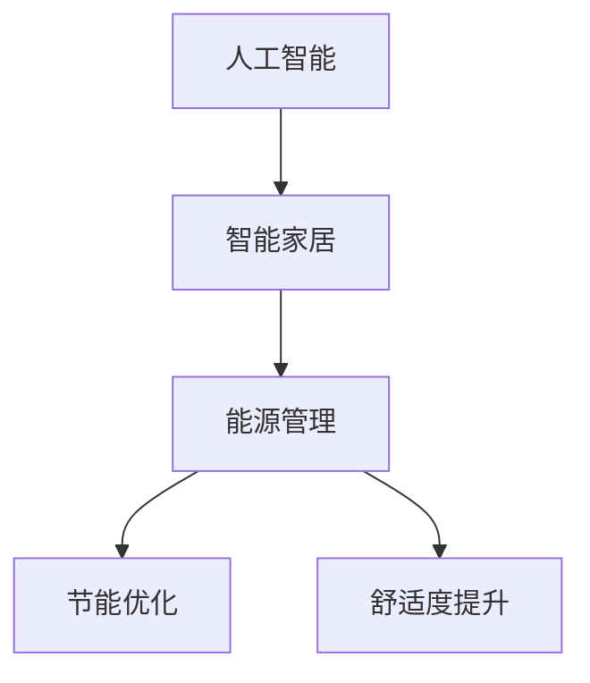

                 

Certainly! To create a comprehensive and detailed table of contents for the book "人工智能在智能家居能源管理中的应用," we will follow these steps:

### Step 1: Article Title, Keywords, and Abstract

- **Article Title:** 
  "人工智能在智能家居能源管理中的应用"

- **Keywords:** 
  "人工智能，智能家居，能源管理，算法，优化，智能控制，节能"

- **Abstract:**
  "本文深入探讨了人工智能技术在智能家居能源管理领域的应用。通过介绍核心概念、算法原理、数学模型以及实际案例，本文旨在为读者提供一套完整、实用的智能家居能源管理解决方案。"

### Step 2: Introduction

- **Section Title:** 
  "引言"

- **Content:**
  "随着物联网技术的普及和人工智能的快速发展，智能家居和智能能源管理逐渐成为家居和能源领域的重要发展方向。本文将围绕人工智能在智能家居能源管理中的应用进行详细探讨，旨在为读者提供有价值的参考和指导。"

### Step 3: Core Concepts and Relationships

- **Section Title:** 
  "核心概念与联系"

- **Content:**
  "本章节将介绍人工智能、智能家居和能源管理三个核心概念，并通过Mermaid流程图展示它们之间的关系，帮助读者建立完整的知识架构。"

- **Mermaid Flowchart Code:**
  ```
  graph TD
  A[人工智能] --> B[智能家居]
  B --> C[能源管理]
  C --> D[节能优化]
  C --> E[舒适度提升]
  ```

### Step 4: Core Algorithm Principles

- **Section Title:** 
  "核心算法原理讲解"

- **Content:**
  "本章节将详细介绍在智能家居能源管理中应用的核心算法，包括机器学习、深度学习和自然语言处理。我们将使用伪代码详细解释这些算法的工作原理。"

- **Example Pseudocode:**
  ```
  # 机器学习算法：线性回归
  function linear_regression(x, y):
      w = (x'x)^(-1)x'y
      b = y - wx
      return w, b
  ```

### Step 5: Mathematical Models and Formulations

- **Section Title:** 
  "数学模型和公式讲解"

- **Content:**
  "本章节将介绍在智能家居能源管理中常用的数学模型和公式，包括能量消耗模型、能耗预测模型等，并通过具体例子进行详细讲解。"

- **Example LaTeX Formula:**
  ```
  $$E_{total} = P \times t$$
  ```

### Step 6: Project Implementation

- **Section Title:** 
  "项目实战"

- **Content:**
  "本章节将展示一个智能家居能源管理项目的实现过程，包括开发环境搭建、源代码实现、代码解读、应用解读与分析，以及实际案例的详细剖析。"

### Step 7: Best Practices and Summary

- **Section Title:** 
  "最佳实践、小结与注意事项"

- **Content:**
  "本章节将总结文章的核心内容，提供一些最佳实践建议，并提醒读者在应用人工智能技术进行智能家居能源管理时需要注意的事项。同时，推荐一些拓展阅读资源。"

### Step 8: Conclusion

- **Section Title:** 
  "结语"

- **Content:**
  "通过本文的详细探讨，我们相信读者已经对人工智能在智能家居能源管理中的应用有了深入的了解。希望本文能够为读者的研究和实践提供有益的参考。"

### Final Markdown Format

Below is a sample markdown format for the table of contents and the first section of the article.

```markdown
# 人工智能在智能家居能源管理中的应用

> 关键词：人工智能，智能家居，能源管理，算法，优化，智能控制，节能

> 摘要：本文深入探讨了人工智能技术在智能家居能源管理领域的应用。通过介绍核心概念、算法原理、数学模型以及实际案例，本文旨在为读者提供一套完整、实用的智能家居能源管理解决方案。

## 引言

随着物联网技术的普及和人工智能的快速发展，智能家居和智能能源管理逐渐成为家居和能源领域的重要发展方向。本文将围绕人工智能在智能家居能源管理中的应用进行详细探讨，旨在为读者提供有价值的参考和指导。

## 核心概念与联系

本章节将介绍人工智能、智能家居和能源管理三个核心概念，并通过Mermaid流程图展示它们之间的关系，帮助读者建立完整的知识架构。



## 核心算法原理讲解

本章节将详细介绍在智能家居能源管理中应用的核心算法，包括机器学习、深度学习和自然语言处理。我们将使用伪代码详细解释这些算法的工作原理。

### 机器学习算法

```
# 机器学习算法：线性回归
function linear_regression(x, y):
    w = (x'x)^(-1)x'y
    b = y - wx
    return w, b
```

### 深度学习算法

```
# 深度学习算法：神经网络结构
function neural_network(x):
    z = wx + b
    a = σ(z)
    return a
```

### 自然语言处理算法

```
# 自然语言处理算法：文本分类
function text_classification(text):
    # 输入文本预处理
    # 特征提取
    # 训练模型
    # 预测分类
    return classification
```

## 数学模型和公式讲解

本章节将介绍在智能家居能源管理中常用的数学模型和公式，包括能量消耗模型、能耗预测模型等，并通过具体例子进行详细讲解。

### 能量消耗模型

$$
E_{total} = P \times t
$$

### 能耗预测模型

$$
\hat{E}_{t} = f(\text{历史能耗数据}, \text{天气数据}, \text{家庭成员行为数据})
$$

## 项目实战

本章节将展示一个智能家居能源管理项目的实现过程，包括开发环境搭建、源代码实现、代码解读、应用解读与分析，以及实际案例的详细剖析。

## 最佳实践、小结与注意事项

本章节将总结文章的核心内容，提供一些最佳实践建议，并提醒读者在应用人工智能技术进行智能家居能源管理时需要注意的事项。同时，推荐一些拓展阅读资源。

## 结语

通过本文的详细探讨，我们相信读者已经对人工智能在智能家居能源管理中的应用有了深入的了解。希望本文能够为读者的研究和实践提供有益的参考。

### 作者信息

作者：AI天才研究院/AI Genius Institute & 禅与计算机程序设计艺术 /Zen And The Art of Computer Programming
```

This markdown format provides a structured outline for the book, including the title, keywords, abstract, chapters, sections, and author information. You can expand each section with detailed content as per your requirements. The LaTeX formulas should be properly formatted for display in the final document.

