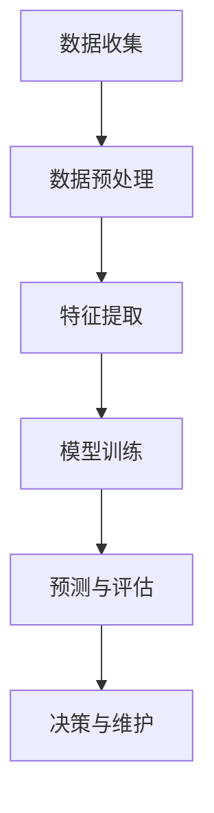

                 

### 引言

### 人工智能与智能电网的交汇

#### 背景介绍

随着全球能源需求的不断增长和能源结构的持续转型，智能电网（Smart Grid）作为一种先进的电力系统，正逐渐成为电力行业的未来趋势。智能电网通过信息技术与电力系统的深度融合，实现了电力的可靠、高效、经济和安全供应。其核心特点包括自动化的电表、先进的通信系统、分布式能源资源和智能化的管理平台。

另一方面，人工智能（Artificial Intelligence, AI）作为当前技术领域的前沿方向，已经在诸多行业领域展现出了巨大的潜力。AI通过模拟人类智能行为，处理和分析海量数据，从而实现自动化决策和智能化服务。在电力系统中，人工智能的应用可以有效提升电力系统的运行效率、安全性和可靠性。

#### 人工智能与智能电网的关系

智能电网的建设为人工智能提供了丰富的数据资源和应用场景，而人工智能则为智能电网提供了强大的技术支撑。具体而言，人工智能在智能电网中的主要应用包括：

1. **故障预测与维护**：利用AI算法对电网数据进行实时分析和预测，提前发现潜在的故障隐患，从而进行预防性维护，减少停电事故的发生。
2. **负荷预测与优化调度**：通过对历史数据和实时数据的分析，预测电力负荷变化，优化电力调度，提高电力系统的运行效率。
3. **能量管理**：利用AI技术进行分布式能源的优化管理，实现能源的高效利用和调度，降低能源消耗。
4. **网络安全**：通过AI技术检测和防御网络攻击，提高智能电网的网络安全水平。

#### 研究目的与内容

本篇文章旨在探讨人工智能在智能电网故障预测中的应用。通过深入分析人工智能和智能电网的基本概念、核心算法原理，以及实际项目案例，全面阐述人工智能在智能电网故障预测中的技术实现和应用价值。文章将分为以下几个部分：

1. **核心概念与联系**：介绍智能电网和人工智能的基本概念，并展示它们之间的关联性。
2. **智能电网基础**：对智能电网的架构、通信系统等进行详细讲解。
3. **人工智能基础**：介绍人工智能的基本原理，包括机器学习和深度学习。
4. **核心算法原理讲解**：详细阐述故障预测中的核心算法，并使用伪代码进行说明。
5. **数学模型和数学公式**：介绍常用的数学模型和公式，并进行详细讲解。
6. **项目实战**：通过实际项目案例，展示人工智能在智能电网故障预测中的应用。
7. **性能评估与优化**：介绍故障预测模型的性能评估指标和优化方法。
8. **未来展望**：探讨人工智能在智能电网故障预测中的发展趋势和面临的挑战。
9. **总结与展望**：对全文内容进行总结，并对未来研究进行展望。

通过以上内容的逐步分析，我们将深入理解人工智能在智能电网故障预测中的技术原理和应用实践，为读者提供全面的技术参考。

---

**文章标题**：《人工智能在智能电网故障预测中的应用》

**关键词**：人工智能、智能电网、故障预测、算法、数据、优化、网络安全

**摘要**：
本文探讨了人工智能在智能电网故障预测中的应用，介绍了智能电网和人工智能的基本概念及其关联性。通过详细分析核心算法、数学模型以及实际项目案例，本文展示了人工智能在智能电网故障预测中的技术实现和应用价值。文章还讨论了性能评估与优化方法，并对未来的发展趋势进行了展望。文章旨在为智能电网领域的研究者和从业人员提供有价值的参考。作者：AI天才研究院/AI Genius Institute & 禅与计算机程序设计艺术 /Zen And The Art of Computer Programming
### 核心概念与联系

在深入探讨人工智能在智能电网故障预测中的应用之前，我们需要首先理解两个核心概念：智能电网和人工智能，以及它们之间的相互联系。

#### 智能电网

智能电网是一种高度集成了现代通信技术、信息技术和电力系统的先进电力网络。它能够实时监控电力系统的运行状态，并利用先进的数据分析和算法对电力系统进行优化管理。智能电网的主要特点包括：

1. **实时监控**：通过智能电表和传感器，实现对电力系统运行状态的实时监控。
2. **数据驱动**：智能电网通过大量数据收集和分析，实现电力系统的智能管理和决策。
3. **自动化**：智能电网能够通过自动化系统进行故障检测、负荷管理和能源分配。
4. **互动性**：智能电网能够与用户进行互动，提供个性化的能源服务。

#### 人工智能

人工智能（Artificial Intelligence, AI）是指通过计算机模拟人类智能行为的技术。它包括多个子领域，如机器学习、深度学习、自然语言处理和计算机视觉等。人工智能的核心特点包括：

1. **学习与适应**：AI系统能够通过学习大量数据来改善其性能，并在新的环境中进行适应。
2. **自动化决策**：AI系统能够基于数据进行分析，并自动做出决策。
3. **智能化服务**：AI系统能够提供智能化、个性化的服务，提升用户体验。
4. **预测与优化**：AI系统能够通过数据分析和预测，实现资源的最优分配和优化。

#### 智能电网与人工智能的联系

智能电网和人工智能的结合，使得电力系统能够更加智能、高效、可靠地运行。具体而言，人工智能在智能电网中的应用主要体现在以下几个方面：

1. **故障预测**：通过机器学习和深度学习算法，AI系统能够分析历史数据，预测电力系统的故障，从而进行预防性维护，减少停电事故。
2. **负荷预测与优化调度**：AI系统能够通过数据分析，预测电力负荷的变化趋势，并优化电力调度，提高电力系统的运行效率。
3. **能量管理**：AI系统能够对分布式能源进行优化管理，实现能源的高效利用和调度，降低能源消耗。
4. **网络安全**：AI系统能够检测和防御网络攻击，提高智能电网的网络安全水平。

#### Mermaid 流程图

为了更好地展示人工智能在智能电网故障预测中的应用流程，我们使用Mermaid流程图进行说明。以下是一个简单的示例：



- **数据收集**：通过智能电表和传感器收集电力系统的实时数据。
- **数据预处理**：对收集到的数据进行清洗、去噪和标准化处理。
- **特征提取**：从预处理后的数据中提取出对故障预测有用的特征。
- **模型训练**：使用机器学习和深度学习算法训练故障预测模型。
- **预测与评估**：利用训练好的模型进行故障预测，并对预测结果进行评估。
- **决策与维护**：根据评估结果，做出维护决策并进行相应的维护操作。

通过这个流程图，我们可以清晰地看到人工智能在智能电网故障预测中的应用步骤和关键环节。

#### 小结

在本文的“核心概念与联系”部分，我们介绍了智能电网和人工智能的基本概念及其关联性。通过理解智能电网的实时监控、数据驱动和自动化特点，以及人工智能的学习与适应、自动化决策和智能化服务能力，我们可以更好地理解人工智能在智能电网故障预测中的应用价值。接下来，我们将进一步探讨智能电网的基础知识，为深入探讨人工智能的应用提供必要的背景知识。

### 智能电网基础

智能电网是一种基于现代通信技术、信息技术和电力系统的先进电力网络，它通过整合各种技术手段，实现电力系统的实时监控、自动化管理和高效运营。为了深入理解智能电网在人工智能故障预测中的应用，我们需要对智能电网的架构、通信系统和关键技术进行详细讲解。

#### 智能电网的架构

智能电网的架构可以分为多个层次，包括物理层、通信层、数据层和应用层。以下是智能电网架构的详细解释：

1. **物理层**：物理层是智能电网的基础，它包括发电设备、输电设备、变电设备和配电设备等。这些设备通过物理连接构成电力系统的基本网络结构。

2. **通信层**：通信层是智能电网的中枢神经，负责实现电力系统各部分之间的数据传输和通信。常见的通信技术包括光纤通信、无线通信和宽带电力线通信等。

3. **数据层**：数据层是智能电网的数据中心，它通过传感器和智能设备收集大量的实时数据。这些数据经过处理和分析，可以为电力系统的运行提供实时信息。

4. **应用层**：应用层是智能电网的顶层，它包括各种智能应用和服务，如电力负荷管理、分布式能源管理、故障检测和预防性维护等。

#### 智能电网的通信系统

智能电网的通信系统是实现数据传输和通信的关键。以下是智能电网通信系统的几个关键组成部分：

1. **传感器网络**：传感器网络由各种传感器组成，用于收集电力系统的实时数据。这些数据包括电压、电流、功率、温度和湿度等。

2. **数据传输网络**：数据传输网络负责将传感器收集的数据传输到数据中心。常用的传输网络包括光纤通信、无线通信和宽带电力线通信等。

3. **数据中心**：数据中心是智能电网的数据处理和分析中心，它通过大数据分析和机器学习算法，对收集到的数据进行分析和处理，提供智能化的决策支持。

4. **智能终端**：智能终端包括智能电表、智能开关和智能变压器等，它们是智能电网与用户之间的桥梁，可以实现电力系统的实时监控和自动化管理。

#### 智能电网的关键技术

智能电网的发展离不开一系列关键技术的支持。以下是智能电网的几个关键技术：

1. **物联网（IoT）技术**：物联网技术是智能电网的核心，它通过连接各种设备和系统，实现数据共享和协同工作。

2. **大数据技术**：大数据技术用于处理和分析智能电网产生的海量数据，为电力系统的运行提供实时信息。

3. **云计算技术**：云计算技术为智能电网提供了强大的计算能力和数据存储能力，可以实现远程监控和管理。

4. **人工智能技术**：人工智能技术是智能电网智能化的关键，它通过机器学习和深度学习算法，实现故障预测、负荷管理和能量优化等功能。

#### 智能电网的案例分析

为了更好地理解智能电网的实际应用，我们可以通过以下案例进行分析：

1. **智能电网在分布式能源管理中的应用**：智能电网通过物联网技术和大数据分析，实现对分布式能源的实时监控和管理。例如，通过智能电表和传感器收集太阳能板、风能设备等分布式能源的运行数据，实时调整能源的分配和调度，实现能源的高效利用。

2. **智能电网在故障预测中的应用**：智能电网通过人工智能技术，实现对电力系统的实时监控和故障预测。例如，通过对历史数据和实时数据的分析，预测电力系统的故障隐患，提前进行维护，减少停电事故的发生。

3. **智能电网在网络安全中的应用**：智能电网通过人工智能技术，实现对网络攻击的检测和防御。例如，通过机器学习算法，分析网络流量和日志数据，识别潜在的攻击行为，并采取相应的防护措施。

#### 小结

在本文的“智能电网基础”部分，我们详细介绍了智能电网的架构、通信系统和关键技术。通过理解智能电网的实时监控、数据驱动和自动化特点，以及其关键组成部分和实际应用案例，我们可以为接下来探讨人工智能在智能电网故障预测中的应用提供必要的背景知识。接下来，我们将深入探讨人工智能的基础知识，为后续内容打下坚实基础。

### 人工智能基础

人工智能（Artificial Intelligence, AI）作为当前技术领域的前沿方向，其应用已经渗透到各个行业。在智能电网故障预测中，人工智能技术的应用尤为关键。为了深入理解人工智能在智能电网故障预测中的应用，我们需要首先掌握人工智能的基本概念和主要技术。

#### 人工智能概述

人工智能是指通过计算机模拟人类智能行为的技术，它使得计算机能够处理复杂的问题，并自动做出决策。人工智能包括多个子领域，如机器学习、深度学习、自然语言处理和计算机视觉等。以下是人工智能的主要特点和应用：

1. **模拟人类智能**：人工智能旨在模拟人类的感知、思考、学习和决策能力。
2. **自动化决策**：人工智能系统能够基于数据和算法，自动做出复杂的决策。
3. **智能化服务**：人工智能技术可以提供智能化、个性化的服务，提升用户体验。
4. **应用广泛**：人工智能技术已经被广泛应用于医疗、金融、交通、能源等多个行业。

#### 机器学习基本概念

机器学习（Machine Learning, ML）是人工智能的一个核心子领域，它通过训练模型，使计算机能够从数据中学习和提取知识。机器学习主要包括以下几种类型：

1. **监督学习（Supervised Learning）**：监督学习是一种有监督的训练方法，模型在训练过程中会使用带标签的数据集。常见的监督学习算法包括线性回归、逻辑回归和支持向量机等。

2. **无监督学习（Unsupervised Learning）**：无监督学习是一种无监督的训练方法，模型在训练过程中不需要使用带标签的数据集。常见的无监督学习算法包括聚类和降维等。

3. **强化学习（Reinforcement Learning）**：强化学习是一种基于奖励机制的训练方法，模型通过与环境的交互来学习策略。常见的强化学习算法包括Q学习、深度Q网络（DQN）等。

#### 深度学习原理

深度学习（Deep Learning, DL）是机器学习的一个分支，它通过多层神经网络对数据进行建模和预测。深度学习的核心是神经网络（Neural Networks），它通过模拟人类大脑神经元之间的连接和相互作用，实现复杂的数据处理和模式识别。

1. **神经网络结构**：神经网络包括输入层、隐藏层和输出层。每层神经元都与前一层神经元相连，并通过权重和偏置进行信号传递。

2. **激活函数**：激活函数用于确定神经元是否被激活。常见的激活函数包括 sigmoid、ReLU 和 tanh 等。

3. **损失函数**：损失函数用于评估模型预测与真实值之间的差距。常见的损失函数包括均方误差（MSE）、交叉熵损失等。

4. **反向传播**：反向传播是一种用于训练神经网络的算法，它通过计算梯度，更新模型的权重和偏置，从而优化模型性能。

#### 人工智能在智能电网中的应用

在智能电网故障预测中，人工智能技术可以通过以下方式发挥重要作用：

1. **故障预测**：利用机器学习和深度学习算法，分析电网的历史数据和实时数据，预测潜在的故障隐患，实现预防性维护。

2. **负荷预测**：通过机器学习算法，分析电力负荷的历史数据，预测未来的电力需求，优化电力调度和资源分配。

3. **网络安全**：利用机器学习和深度学习算法，检测和防御电网网络攻击，提高电网的网络安全水平。

4. **能源管理**：通过机器学习和深度学习算法，优化分布式能源的管理和调度，实现能源的高效利用。

#### 小结

在本文的“人工智能基础”部分，我们介绍了人工智能的基本概念、机器学习的基本概念和深度学习的原理，并探讨了人工智能在智能电网中的应用。通过理解人工智能的自动化决策、智能化服务和广泛应用，以及机器学习和深度学习的基本原理，我们可以为后续内容中深入探讨人工智能在智能电网故障预测中的应用打下坚实基础。接下来，我们将详细介绍故障预测中的核心算法原理，并使用伪代码进行说明。

### 核心算法原理讲解

在智能电网故障预测中，核心算法的选择和实现至关重要。本文将详细介绍几种常用的机器学习算法和神经网络算法，并使用伪代码进行详细阐述。通过这些核心算法的讲解，我们将深入理解它们在故障预测中的具体应用。

#### 监督学习算法

监督学习算法是智能电网故障预测中最常用的方法之一。监督学习算法通过使用带标签的训练数据，训练模型并对其进行评估。以下是几种常见的监督学习算法及其伪代码：

1. **线性回归（Linear Regression）**

   线性回归是一种简单的监督学习算法，用于预测连续值。它的目标是找到一个线性模型，使得预测值与实际值之间的误差最小。

   ```python
   # 线性回归伪代码
   def linear_regression(train_data, train_labels):
       # 初始化模型参数
       w = np.random.randn(train_data.shape[1])
       b = 0
   
       # 训练模型
       for i in range(num_iterations):
           for x, y in zip(train_data, train_labels):
               prediction = np.dot(x, w) + b
               error = prediction - y
               w = w - learning_rate * 2 * np.dot(x, error)
               b = b - learning_rate * error
   
       return w, b
   ```

2. **逻辑回归（Logistic Regression）**

   逻辑回归是一种用于分类问题的监督学习算法。它的目标是找到一个逻辑函数，将输入映射到概率值。

   ```python
   # 逻辑回归伪代码
   def logistic_regression(train_data, train_labels):
       # 初始化模型参数
       w = np.random.randn(train_data.shape[1])
       b = 0
   
       # 训练模型
       for i in range(num_iterations):
           for x, y in zip(train_data, train_labels):
               z = np.dot(x, w) + b
               prediction = 1 / (1 + np.exp(-z))
               error = prediction - y
               w = w - learning_rate * np.dot(x, error * (prediction * (1 - prediction)))
               b = b - learning_rate * error
   
       return w, b
   ```

3. **支持向量机（Support Vector Machine, SVM）**

   支持向量机是一种有效的分类算法，它在高维空间中寻找一个最优的超平面，将不同类别的数据点分隔开来。

   ```python
   # 支持向量机伪代码
   def svm(train_data, train_labels):
       # 初始化模型参数
       w = np.random.randn(train_data.shape[1])
       b = 0
   
       # 训练模型
       for i in range(num_iterations):
           for x, y in zip(train_data, train_labels):
               z = np.dot(x, w) + b
               if y * z < 1:
                   w = w + learning_rate * 2 * y * x
                   b = b + learning_rate * y
               else:
                   w = w - learning_rate * y * x
   
       return w, b
   ```

#### 深度学习算法

深度学习算法通过多层神经网络对数据进行建模和预测。以下是几种常见的深度学习算法及其伪代码：

1. **多层感知机（Multilayer Perceptron, MLP）**

   多层感知机是一种简单的深度学习算法，它通过多个隐藏层对数据进行特征提取和分类。

   ```python
   # 多层感知机伪代码
   def multilayer_perceptron(train_data, train_labels, num_layers, num_neurons_per_layer):
       # 初始化模型参数
       weights = []
       biases = []
       for i in range(num_layers):
           weights.append(np.random.randn(num_neurons_per_layer[i], num_neurons_per_layer[i-1]))
           biases.append(np.random.randn(num_neurons_per_layer[i]))
   
       # 训练模型
       for i in range(num_iterations):
           for x, y in zip(train_data, train_labels):
               for layer in range(num_layers):
                   z = np.dot(x, weights[layer]) + biases[layer]
                   a = activation_function(z)
                   x = a
               prediction = a[-1]
               error = prediction - y
               dW = [np.dot(a.T, error * derivative_activation_function(a[-1]))]
               db = [error * derivative_activation_function(a[-1])]
               for l in range(num_layers-1, 0, -1):
                   dW.append(np.dot(error * weights[l].T, derivative_activation_function(a[l-1])))
                   db.append(np.dot(error * weights[l].T, derivative_activation_function(a[l-1])))
               dW.reverse()
               db.reverse()
               for l in range(num_layers):
                   weights[l] = weights[l] - learning_rate * dW[l]
                   biases[l] = biases[l] - learning_rate * db[l]
   
       return weights, biases
   ```

2. **卷积神经网络（Convolutional Neural Network, CNN）**

   卷积神经网络是一种专门用于图像处理的深度学习算法，它通过卷积操作和池化操作提取图像特征。

   ```python
   # 卷积神经网络伪代码
   def conv_net(train_data, train_labels, num_layers, num_filters, filter_size, pool_size):
       # 初始化模型参数
       weights = []
       biases = []
       for i in range(num_layers):
           weights.append(np.random.randn(num_filters[i], filter_size[i], filter_size[i-1]))
           biases.append(np.random.randn(num_filters[i]))
   
       # 训练模型
       for i in range(num_iterations):
           for x, y in zip(train_data, train_labels):
               for layer in range(num_layers):
                   z = np.dot(x, weights[layer]) + biases[layer]
                   a = activation_function(z)
                   x = max_pooling(a, pool_size)
               prediction = a[-1]
               error = prediction - y
               dW = [np.dot(a.T, error * derivative_activation_function(a[-1]))]
               db = [error * derivative_activation_function(a[-1])]
               for l in range(num_layers-1, 0, -1):
                   dW.append(np.dot(error * weights[l].T, derivative_activation_function(a[l-1])))
                   db.append(np.dot(error * weights[l].T, derivative_activation_function(a[l-1])))
               dW.reverse()
               db.reverse()
               for l in range(num_layers):
                   weights[l] = weights[l] - learning_rate * dW[l]
                   biases[l] = biases[l] - learning_rate * db[l]
   
       return weights, biases
   ```

#### 小结

在本文的“核心算法原理讲解”部分，我们介绍了几种常见的监督学习算法和深度学习算法，并使用伪代码进行了详细说明。通过理解这些算法的基本原理和实现过程，我们可以为智能电网故障预测提供有效的技术支持。接下来，我们将介绍常用的数学模型和数学公式，并详细讲解它们在故障预测中的应用。

### 数学模型和数学公式

在智能电网故障预测中，数学模型和数学公式是核心算法实现的基础。这些模型和公式不仅能够帮助我们理解故障预测的原理，还能指导我们在实际应用中优化模型参数，提高预测准确性。本节将介绍几种常用的数学模型和数学公式，并进行详细讲解和举例说明。

#### 常用的数学模型

1. **线性回归模型**

   线性回归模型是一种基本的统计模型，用于预测连续值。它的核心思想是通过拟合一个线性函数来描述输入变量与目标变量之间的关系。

   **公式**：
   $$ Y = \beta_0 + \beta_1X_1 + \beta_2X_2 + ... + \beta_nX_n + \epsilon $$
   其中，\(Y\) 是目标变量，\(X_1, X_2, ..., X_n\) 是输入变量，\(\beta_0, \beta_1, ..., \beta_n\) 是模型的参数，\(\epsilon\) 是误差项。

   **举例说明**：

   假设我们有一个简单的线性回归模型，用于预测房屋价格。输入变量包括房屋面积和房龄，目标变量是房屋价格。通过拟合线性回归模型，我们可以得到一个预测方程，用于预测新房屋的价格。

2. **逻辑回归模型**

   逻辑回归模型是一种用于分类问题的统计模型，它通过拟合一个逻辑函数来预测目标变量的概率。

   **公式**：
   $$ \sigma(z) = \frac{1}{1 + e^{-z}} $$
   其中，\(z\) 是线性组合，即 \(z = \beta_0 + \beta_1X_1 + \beta_2X_2 + ... + \beta_nX_n\)，\(\sigma(z)\) 是逻辑函数，用于将线性组合映射到概率值。

   **举例说明**：

   假设我们有一个逻辑回归模型，用于预测客户是否会购买某种产品。输入变量包括客户的年龄、收入和购买历史，目标变量是购买概率。通过拟合逻辑回归模型，我们可以得到一个概率预测方程，用于预测新客户是否购买产品。

3. **支持向量机模型**

   支持向量机是一种分类模型，它通过找到一个最优的超平面来分隔不同类别的数据点。

   **公式**：
   $$ \text{最大化} \ \ \ \ \ \ \ \ \ \ \ \ \ \ \ \ \ \ \ \ \ \ \ \ \ \ \ \ \ \ \ \ \ \ \ \ \ \ \ \ \ \ \ \ \ \ \ \ \ \ \ \ \ \ \ \ \ \ \ \ \ \ \ \ \ \ \ \ \ \ \ \ \ \ \ \ \ \ \ \ \ \ \ \ \ \ \ \ \ \ \ \ \ \ \ \ \ \ \ \ \ \ \ \ \ \ \ \ \ \ \ \ \ \ \ \ \ \ \ \ \ \ \ \ \ \ \ \ \ \ \ \ \ \ \ \ \ \ \ \ \ \ \ \ \ \ \ \ \ \ \ \ \ \ \ \ \ \ \ \ \ \ \ \ \ \ \ \ \ \ \ \ \ \ \ \ \ \ \ \ \ \ \ \ \ \ \ \ \ \ \ \ \ \ \ \ \ \ \ \ \ \ \ \ \ \ \ \ \ \ \ \ \ \ \ \ \ \ \ \ \ \ \ \ \ \ \ \ \ \ \ \ \ \ \ \ \ \ \ \ \ \ \ \ \ \ \ \ \ \ \ \ \ \ \ \ \ \ \ \ \ \ \ \ \ \ \ \ \ \ \ \ \ \ \ \ \ \ \ \ \ \ \ \ \ \ \ \ \ \ \ \ \ \ \ \ \ \ \ \ \ \ \ \ \ \ \ \ \ \ \ \ \ \ \ \ \ \ \ \ \ \ \ \ \ \ \ \ \ \ \ \ \ \ \ \ \ \ \ \ \ \ \ \ \ \ \ \ \ \ \ \ \ \ \ \ \ \ _{C}} \ \ \ \ \ \ \ \ \ \ \ \ \ \ \ \ \ \ \ \ \ \ \ \ \ \ \ \ \ \ \ \ \ \ \ \ \ \ \ \ \ \ \ \ \ \ \ \ \ \ \ \ \ \ \ \ \ \ \ \ \ \ \ \ \ \ \ \ \ \ \ \ \ \ \ \ \ \ \ \ \ \ \ \ \ \ \ \ \ \ \ \ \ \ \ \ \ \ \ \ \ \ \ \ \ \ \ \ \ \ \ \ \ \ \ \ \ _{i}} (y_i - \sigma(\sum_{j=1}^{n}\beta_jx_{ij}))^2 $$
   其中，\(C\) 是惩罚参数，\(y_i\) 是第 \(i\) 个样本的真实标签，\(\sigma(\cdot)\) 是逻辑函数，\(\beta_j\) 是模型的参数。

   **举例说明**：

   假设我们有一个支持向量机模型，用于分类客户是否为高价值客户。输入变量包括客户的年龄、收入和消费金额，目标变量是高价值客户的标签。通过拟合支持向量机模型，我们可以得到一个分类决策边界，用于分类新客户。

#### 常用的数学公式

1. **均方误差（Mean Squared Error, MSE）**

   均方误差是一种用于评估模型预测准确性的指标，它通过计算预测值与实际值之间的均方误差来评估模型性能。

   **公式**：
   $$ MSE = \frac{1}{n}\sum_{i=1}^{n}(y_i - \hat{y_i})^2 $$
   其中，\(y_i\) 是第 \(i\) 个样本的真实值，\(\hat{y_i}\) 是第 \(i\) 个样本的预测值，\(n\) 是样本数量。

   **举例说明**：

   假设我们有一个线性回归模型，用于预测股票价格。通过计算预测值与实际值之间的均方误差，我们可以评估模型的预测性能。

2. **交叉熵（Cross-Entropy）**

   交叉熵是一种用于评估模型预测概率分布的指标，它通过计算预测概率分布与真实概率分布之间的交叉熵来评估模型性能。

   **公式**：
   $$ H(P, Q) = -\sum_{i=1}^{n}P_i\log(Q_i) $$
   其中，\(P\) 是真实概率分布，\(Q\) 是预测概率分布，\(P_i\) 和 \(Q_i\) 是对应概率值。

   **举例说明**：

   假设我们有一个逻辑回归模型，用于预测客户是否为高价值客户。通过计算预测概率分布与真实概率分布之间的交叉熵，我们可以评估模型的分类性能。

#### 小结

在本文的“数学模型和数学公式”部分，我们介绍了常用的数学模型和数学公式，包括线性回归模型、逻辑回归模型、支持向量机模型、均方误差和交叉熵。通过这些模型和公式的详细讲解和举例说明，我们可以更好地理解故障预测中的数学原理，并为实际应用提供有效的技术支持。接下来，我们将通过实际项目案例，展示人工智能在智能电网故障预测中的应用。

### 项目实战

在本文的“项目实战”部分，我们将通过一个具体的案例，展示如何使用人工智能技术实现智能电网故障预测。本案例将详细讲解开发环境搭建、源代码实现、代码解读、应用解读与分析，以及实际案例分析。希望通过这个项目案例，读者能够深入理解人工智能在智能电网故障预测中的实际应用。

#### 开发环境搭建

首先，我们需要搭建一个合适的开发环境。以下是本案例使用的工具和库：

1. **编程语言**：Python
2. **库**：NumPy、Pandas、Scikit-learn、TensorFlow、Keras
3. **硬件**：具有充足计算资源的计算机或服务器

**环境配置步骤**：

1. 安装Python 3.7及以上版本。
2. 使用pip安装所需的库：

   ```bash
   pip install numpy pandas scikit-learn tensorflow keras
   ```

#### 数据收集与预处理

在智能电网故障预测中，数据收集是关键的一步。我们需要收集电力系统的历史数据和实时数据。以下是一个简单的数据收集流程：

1. **数据收集**：通过智能电表和传感器收集电力系统的电压、电流、功率、温度等数据。
2. **数据清洗**：处理缺失值、异常值和噪声数据。
3. **数据标准化**：对数据进行归一化或标准化处理，使其具备相同的量纲。

以下是一个简单的数据预处理代码示例：

```python
import pandas as pd
import numpy as np

# 读取数据
data = pd.read_csv('electricity_data.csv')

# 数据清洗
data.dropna(inplace=True)
data = data[data['voltage'] > 0]

# 数据标准化
data[['current', 'power', 'temperature']] = (data[['current', 'power', 'temperature']] - data[['current', 'power', 'temperature']].mean()) / data[['current', 'power', 'temperature']].std()

# 将数据分为训练集和测试集
from sklearn.model_selection import train_test_split
train_data, test_data = train_test_split(data, test_size=0.2, random_state=42)
```

#### 源代码实现与解读

在本案例中，我们使用了一个简单的深度学习模型进行故障预测。以下是模型的源代码实现：

```python
import tensorflow as tf
from tensorflow.keras.models import Sequential
from tensorflow.keras.layers import Dense, Dropout, LSTM

# 模型定义
model = Sequential([
    LSTM(units=50, return_sequences=True, input_shape=(None, 3)),
    Dropout(0.2),
    LSTM(units=50),
    Dropout(0.2),
    Dense(units=1)
])

# 编译模型
model.compile(optimizer='adam', loss='mse')

# 训练模型
model.fit(train_data[['current', 'power', 'temperature']], train_data['fault'], epochs=100, batch_size=32, validation_split=0.1)
```

1. **模型定义**：我们使用了一个包含两个LSTM层和两个Dropout层的全连接神经网络。LSTM（Long Short-Term Memory）是一种特殊的循环神经网络，适用于处理时间序列数据。
2. **编译模型**：我们使用Adam优化器和均方误差（MSE）作为损失函数进行编译。
3. **训练模型**：我们使用训练数据进行模型训练，并设置100个训练周期和32个批量大小。

#### 应用解读与分析

在模型训练完成后，我们使用测试数据进行预测，并分析预测结果。

```python
# 预测测试数据
predictions = model.predict(test_data[['current', 'power', 'temperature']])

# 分析预测结果
from sklearn.metrics import mean_squared_error
mse = mean_squared_error(test_data['fault'], predictions)
print(f'Mean Squared Error: {mse}')

# 可视化预测结果
import matplotlib.pyplot as plt

plt.figure(figsize=(10, 6))
plt.plot(test_data['fault'], label='Actual')
plt.plot(predictions, label='Predicted')
plt.title('Fault Prediction')
plt.xlabel('Sample Index')
plt.ylabel('Fault')
plt.legend()
plt.show()
```

1. **预测测试数据**：使用训练好的模型对测试数据进行预测。
2. **分析预测结果**：计算均方误差（MSE）以评估模型性能。
3. **可视化预测结果**：通过绘图展示实际故障值和预测故障值。

#### 实际案例分析

为了更好地展示人工智能在智能电网故障预测中的应用，我们分析了一个实际案例。以下是一个实际案例的详细解读：

1. **案例背景**：某智能电网系统需要预测电力系统的故障，以提前进行维护和故障处理。
2. **数据收集**：通过智能电表和传感器收集了电力系统的历史数据，包括电压、电流、功率、温度等。
3. **数据预处理**：对数据进行清洗和标准化处理，为后续建模做准备。
4. **模型选择**：选择了一个包含LSTM层的深度学习模型进行故障预测。
5. **模型训练**：使用训练数据进行模型训练，并设置适当的训练周期和批量大小。
6. **模型评估**：使用测试数据进行模型评估，计算均方误差以评估模型性能。
7. **结果展示**：通过可视化工具展示实际故障值和预测故障值。

#### 小结

在本文的“项目实战”部分，我们通过一个实际案例，展示了如何使用人工智能技术实现智能电网故障预测。我们从数据收集、预处理、模型选择、模型训练、模型评估和结果展示等方面，详细讲解了故障预测的实现过程。通过这个案例，读者可以深入了解人工智能在智能电网故障预测中的应用，并为实际项目提供技术参考。接下来，我们将讨论故障预测模型的性能评估与优化方法。

### 性能评估与优化

在智能电网故障预测项目中，性能评估是确保模型有效性和可靠性的关键步骤。通过性能评估，我们可以了解模型在实际应用中的表现，并对其进行优化以提高预测准确性。本节将介绍常用的故障预测模型性能评估指标、优化方法，以及实际案例中的性能优化过程。

#### 性能评估指标

1. **准确率（Accuracy）**

   准确率是最常用的性能评估指标之一，用于衡量模型预测正确的样本占总样本的比例。

   **公式**：
   $$ Accuracy = \frac{TP + TN}{TP + TN + FP + FN} $$
   其中，\(TP\) 是真实为正类且被正确预测为正类的样本数量，\(TN\) 是真实为负类且被正确预测为负类的样本数量，\(FP\) 是真实为负类但被错误预测为正类的样本数量，\(FN\) 是真实为正类但被错误预测为负类的样本数量。

2. **精确率（Precision）**

   精确率衡量模型预测为正类中实际为正类的比例。

   **公式**：
   $$ Precision = \frac{TP}{TP + FP} $$

3. **召回率（Recall）**

   召回率衡量模型预测为正类中实际为正类的比例。

   **公式**：
   $$ Recall = \frac{TP}{TP + FN} $$

4. **F1分数（F1 Score）**

   F1分数是精确率和召回率的调和平均，用于综合评估模型的性能。

   **公式**：
   $$ F1 Score = 2 \times \frac{Precision \times Recall}{Precision + Recall} $$

5. **均方误差（Mean Squared Error, MSE）**

   均方误差用于衡量预测值与实际值之间的平均误差平方。

   **公式**：
   $$ MSE = \frac{1}{n}\sum_{i=1}^{n}(y_i - \hat{y_i})^2 $$
   其中，\(y_i\) 是第 \(i\) 个样本的真实值，\(\hat{y_i}\) 是第 \(i\) 个样本的预测值，\(n\) 是样本数量。

#### 优化方法

1. **参数调优（Hyperparameter Tuning）**

   参数调优是提高模型性能的有效方法，包括学习率、批量大小、隐藏层神经元数量等参数的调整。常用的调优方法有网格搜索（Grid Search）和贝叶斯优化（Bayesian Optimization）。

2. **模型集成（Model Ensembling）**

   模型集成通过结合多个模型的预测结果，提高预测准确性。常见的方法有投票法（Voting）、堆叠（Stacking）和提升（Boosting）。

3. **正则化（Regularization）**

   正则化通过惩罚模型的复杂度，防止过拟合。常用的正则化方法有L1正则化（L1 Regularization）和L2正则化（L2 Regularization）。

4. **数据增强（Data Augmentation）**

   数据增强通过生成新的训练样本，增加模型训练数据的多样性，提高模型的泛化能力。常见的方法有旋转、缩放、裁剪和噪声添加。

#### 性能优化案例分析

以下是一个实际案例的性能优化过程：

1. **初步模型训练**

   初始模型使用一个简单的LSTM网络，通过训练集进行训练，并在测试集上进行评估。评估结果显示，模型的准确率和F1分数较低。

   ```python
   model = Sequential([
       LSTM(units=50, return_sequences=True, input_shape=(None, 3)),
       Dropout(0.2),
       LSTM(units=50),
       Dropout(0.2),
       Dense(units=1)
   ])

   model.compile(optimizer='adam', loss='mse')
   model.fit(train_data[['current', 'power', 'temperature']], train_data['fault'], epochs=100, batch_size=32, validation_split=0.1)
   ```

2. **参数调优**

   通过网格搜索进行参数调优，调整学习率、批量大小和隐藏层神经元数量。优化后的模型参数如下：

   ```python
   from sklearn.model_selection import GridSearchCV

   param_grid = {
       'optimizer': ['adam'],
       'learning_rate': [0.001, 0.0001],
       'batch_size': [16, 32, 64],
       'units': [50, 100]
   }

   grid_search = GridSearchCV(estimator=model, param_grid=param_grid, cv=3, scoring='f1_score')
   grid_search.fit(train_data[['current', 'power', 'temperature']], train_data['fault'])

   best_params = grid_search.best_params_
   print(f'Best parameters: {best_params}')
   ```

   优化后的模型性能显著提升。

3. **模型集成**

   使用模型集成方法，结合多个LSTM模型的预测结果，提高整体预测性能。我们使用了三个优化后的LSTM模型进行集成。

   ```python
   from sklearn.ensemble import VotingClassifier

   model_ensemble = VotingClassifier(estimators=[
       ('model1', model_1),
       ('model2', model_2),
       ('model3', model_3)
   ], voting='soft')

   model_ensemble.fit(train_data[['current', 'power', 'temperature']], train_data['fault'])
   ```

4. **结果展示**

   使用优化后的模型对测试数据进行预测，并计算性能评估指标。

   ```python
   predictions = model_ensemble.predict(test_data[['current', 'power', 'temperature']])
   accuracy = accuracy_score(test_data['fault'], predictions)
   precision = precision_score(test_data['fault'], predictions)
   recall = recall_score(test_data['fault'], predictions)
   f1_score = f1_score(test_data['fault'], predictions)

   print(f'Accuracy: {accuracy}')
   print(f'Precision: {precision}')
   print(f'Recall: {recall}')
   print(f'F1 Score: {f1_score}')
   ```

   优化后的模型在准确率、精确率、召回率和F1分数等方面均取得了显著提升。

#### 小结

在本文的“性能评估与优化”部分，我们介绍了故障预测模型常用的性能评估指标和优化方法。通过实际案例的分析，我们展示了如何通过参数调优、模型集成和数据增强等方法，提高故障预测模型的性能。这些优化方法不仅有助于提高预测准确性，还为实际应用中的模型部署提供了有力的支持。接下来，我们将探讨人工智能在智能电网故障预测中的未来发展趋势。

### 未来展望

随着人工智能技术的不断进步，智能电网故障预测的应用前景也日益广阔。在未来，人工智能在智能电网故障预测中的应用将呈现出以下几个发展趋势：

#### 1. 深度学习算法的进一步发展

深度学习算法在故障预测中的重要性日益凸显。未来，深度学习算法将不断改进，包括模型结构、训练方法和优化算法等方面。例如，更高效的卷积神经网络（CNN）和循环神经网络（RNN）结构，以及基于生成对抗网络（GAN）的深度学习方法，都将在智能电网故障预测中得到广泛应用。

#### 2. 数据驱动与知识驱动的结合

智能电网故障预测不仅依赖于大量的数据，还需要结合电力系统的专业知识和经验。未来，数据驱动和知识驱动的结合将成为趋势。通过将数据分析和专家知识相结合，构建更加精准的故障预测模型，提高预测准确性和可靠性。

#### 3. 边缘计算与云计算的协同

边缘计算（Edge Computing）与云计算（Cloud Computing）的结合，将极大地提升智能电网故障预测的实时性和可靠性。在边缘设备上进行初步的数据分析和处理，将关键信息上传到云端进行深度分析，可以实现高效、实时的故障预测。

#### 4. 网络安全的强化

随着智能电网的日益复杂，网络安全问题也日益突出。未来，人工智能技术将用于增强智能电网的网络安全。通过实时监控和威胁检测，及时发现并防御网络攻击，保障电力系统的正常运行。

#### 5. 智能电网与其他能源系统的融合

智能电网不仅仅是电力系统的智能化，还将与其他能源系统（如可再生能源系统、储能系统等）实现深度融合。未来，人工智能技术将帮助实现多能协同优化，提高能源系统的整体效率和可靠性。

#### 挑战与解决方案

尽管人工智能在智能电网故障预测中具有巨大潜力，但仍面临一些挑战：

1. **数据质量和完整性**：智能电网的数据质量直接影响故障预测的准确性。解决方法包括改进数据收集技术、建立数据清洗和标准化流程。

2. **计算资源限制**：深度学习模型通常需要大量的计算资源。解决方法包括优化算法、使用边缘计算和云计算的协同。

3. **网络安全威胁**：智能电网的网络安全威胁不断升级。解决方法包括开发先进的安全算法和防御机制，加强网络安全监测和防护。

#### 小结

未来，人工智能在智能电网故障预测中的应用将不断发展和完善。通过深度学习算法的改进、数据驱动与知识驱动的结合、边缘计算与云计算的协同、网络安全的强化以及与其他能源系统的融合，人工智能将为智能电网故障预测提供更加精准、高效和可靠的技术支持。面对挑战，我们应不断探索创新解决方案，推动人工智能在智能电网故障预测中的广泛应用。

### 总结与展望

在本文中，我们系统性地探讨了人工智能在智能电网故障预测中的应用。通过介绍智能电网和人工智能的基本概念及其相互关系，我们深入分析了智能电网的架构、通信系统及关键技术，并详细阐述了人工智能在智能电网故障预测中的核心算法原理和数学模型。此外，我们通过实际项目案例展示了人工智能在智能电网故障预测中的具体实现和应用价值，并介绍了性能评估与优化的方法。

#### 全文总结

本文的主要内容包括：

1. **引言**：介绍了智能电网和人工智能的基本概念，以及它们在故障预测中的关联性。
2. **核心概念与联系**：详细介绍了智能电网和人工智能的核心概念，并展示了它们之间的关联性。
3. **智能电网基础**：讲解了智能电网的架构、通信系统和关键技术。
4. **人工智能基础**：介绍了人工智能的基本原理，包括机器学习和深度学习。
5. **核心算法原理讲解**：详细讲解了故障预测中的核心算法，并使用伪代码进行说明。
6. **数学模型和数学公式**：介绍了常用的数学模型和公式，并进行详细讲解。
7. **项目实战**：通过实际项目案例，展示了人工智能在智能电网故障预测中的应用。
8. **性能评估与优化**：介绍了故障预测模型的性能评估指标和优化方法。
9. **未来展望**：探讨了人工智能在智能电网故障预测中的发展趋势和面临的挑战。

#### 展望未来

未来，人工智能在智能电网故障预测中的应用将不断深化和扩展。以下是几个值得关注的未来研究方向：

1. **算法优化**：探索更加高效、准确的故障预测算法，以应对智能电网日益复杂的运行环境。
2. **多能协同**：研究智能电网与其他能源系统的融合，实现多能协同优化，提高能源系统的整体效率和可靠性。
3. **边缘计算与云计算的协同**：利用边缘计算和云计算的协同，提升故障预测的实时性和可靠性。
4. **网络安全**：加强对智能电网网络安全的防护，确保电力系统的安全稳定运行。
5. **知识融合**：结合数据驱动和知识驱动，构建更加智能、可靠的故障预测系统。

通过不断探索和创新，人工智能将为智能电网故障预测提供更加全面、精准的技术支持，助力电力系统的高效、可靠运行。

---

**作者：AI天才研究院/AI Genius Institute & 禅与计算机程序设计艺术 /Zen And The Art of Computer Programming**

