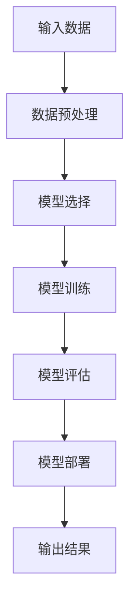
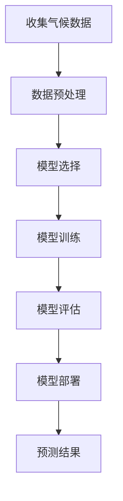
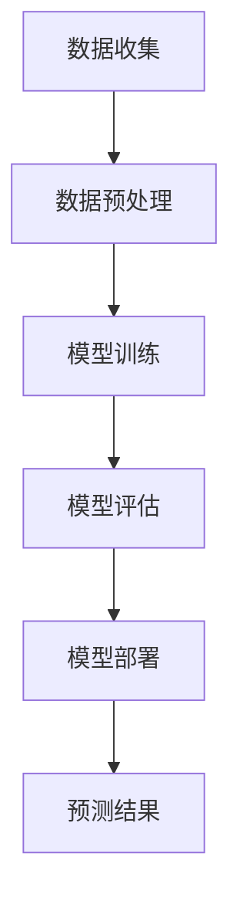

                 

### 文章标题：人工智能在气候变化预测中的应用

> 关键词：人工智能、气候变化、预测模型、深度学习、机器学习

> 摘要：本文探讨了人工智能在气候变化预测中的应用，首先介绍了人工智能的基本概念和其在各领域的应用，随后深入分析了人工智能在气候变化预测中的核心算法原理、数学模型以及实际应用。通过具体的项目实战，展示了人工智能如何通过数据收集、模型训练和预测准确性提升等方面，为气候变化预测提供科学依据。最后，总结了人工智能在气候变化预测中的优势与挑战，并对未来的研究方向提出了展望。

## 目录

### 第1章 引言

#### 1.1 人工智能与气候变化预测

##### 1.1.1 人工智能的快速发展和其在各领域的应用

人工智能（Artificial Intelligence，AI）作为计算机科学的一个分支，旨在研究、开发用于模拟、延伸和扩展人类智能的理论、方法、技术及应用系统。自20世纪50年代起，人工智能经历了多次发展浪潮，从最初的规则推理、知识表示，到后来的机器学习、深度学习，再到现在的自然语言处理、计算机视觉等领域，人工智能已经取得了显著的进展。

在人工智能的发展历程中，机器学习和深度学习成为了最具影响力的两个分支。机器学习是一种通过算法让计算机从数据中学习模式、规律和知识的方法，而深度学习则是在机器学习的基础上，通过多层神经网络进行特征学习和模式识别。随着计算能力和数据资源的不断提升，人工智能在各个领域展现出了强大的应用潜力。

##### 1.1.2 气候变化预测的重要性

气候变化是当今全球面临的一项重大挑战。随着人类活动的加剧，大气中的温室气体浓度不断升高，导致全球气温逐渐上升，极端天气事件频发，海平面上升等一系列环境问题。气候变化对生态系统、农业生产、水资源管理、人类健康等方面产生了深远的影响。因此，准确预测气候变化趋势，制定有效的应对策略，成为各国政府、科研机构和环保组织的重要任务。

气候变化预测涉及多个学科领域，包括气象学、海洋学、生态学、地理学等。传统的气候变化预测方法主要基于物理模型和统计方法，通过对大量气象、海洋和生态数据的分析和模拟，预测未来气候的趋势。然而，这些方法往往受到数据质量、模型精度等因素的限制，预测结果存在一定的误差。

##### 1.1.3 人工智能在气候变化预测中的独特优势

人工智能在气候变化预测中具有独特的优势。首先，人工智能能够处理大规模、多维度的数据，通过机器学习和深度学习算法，从数据中发现潜在的模式和规律，从而提高预测的准确性和可靠性。其次，人工智能可以自动调整和优化模型参数，降低人为干预的风险，提高预测的自动化水平。此外，人工智能还可以通过跨学科的数据融合和分析，为气候变化预测提供更全面、更准确的科学依据。

本章主要内容包括：

1. 介绍人工智能的基本概念和其在各领域的应用。
2. 阐述气候变化预测的重要性以及传统方法的局限性。
3. 分析人工智能在气候变化预测中的独特优势。
4. 为后续章节的内容奠定基础。

### 第2章 人工智能基础

#### 2.1 人工智能概述

人工智能（Artificial Intelligence，AI）是一种模拟、延伸和扩展人类智能的技术和系统。人工智能的核心目标是让计算机具备类似人类的感知、理解、推理、决策和创造能力。人工智能的研究领域涵盖了计算机科学、认知科学、神经科学、心理学等多个学科，涉及到的技术和方法包括机器学习、深度学习、自然语言处理、计算机视觉等。

##### 2.1.1 人工智能的定义和发展历程

人工智能的定义多种多样，其中最具代表性的定义是：“人工智能是研究、开发用于模拟、延伸和扩展人类智能的理论、方法、技术及应用系统的一门学科。”人工智能的发展历程可以分为以下几个阶段：

1. **早期探索阶段（1956年-1974年）**：1956年，达特茅斯会议提出了人工智能的概念，标志着人工智能学科的诞生。在此期间，研究人员主要致力于构建能够模拟人类思维过程的智能系统。

2. **技术萌芽阶段（1974年-1980年）**：随着计算机性能的提升，人工智能开始进入技术萌芽阶段。这一阶段的研究主要集中在知识表示、推理和规划等领域。

3. **低谷期（1980年-1993年）**：由于人工智能在实际应用中的困难，以及计算资源的限制，人工智能研究进入了一个相对低谷的时期。

4. **复兴期（1993年-2012年）**：随着机器学习和深度学习等技术的发展，人工智能开始进入复兴期。在这一阶段，人工智能在图像识别、语音识别、自然语言处理等领域取得了显著的进展。

5. **快速发展期（2012年至今）**：随着大数据、云计算和深度学习技术的兴起，人工智能进入了一个快速发展的阶段。人工智能在各个领域展现出强大的应用潜力，如自动驾驶、智能医疗、智能金融等。

##### 2.1.2 人工智能的核心技术和应用领域

人工智能的核心技术包括机器学习、深度学习、自然语言处理、计算机视觉等。这些技术在不同领域有着广泛的应用：

1. **机器学习**：机器学习是一种通过算法让计算机从数据中学习模式、规律和知识的方法。机器学习主要应用于图像识别、语音识别、推荐系统等领域。

2. **深度学习**：深度学习是机器学习的一个分支，通过多层神经网络进行特征学习和模式识别。深度学习在图像识别、语音识别、自然语言处理等领域取得了显著的成果。

3. **自然语言处理**：自然语言处理是人工智能的一个分支，旨在让计算机理解和处理自然语言。自然语言处理主要应用于机器翻译、情感分析、语音识别等领域。

4. **计算机视觉**：计算机视觉是人工智能的一个分支，旨在让计算机理解和解释图像和视频。计算机视觉主要应用于图像识别、目标检测、自动驾驶等领域。

##### 2.1.3 人工智能的发展趋势

人工智能的发展趋势主要体现在以下几个方面：

1. **算法和模型的优化**：研究人员不断探索新的算法和模型，以提高人工智能的准确性和效率。

2. **跨学科的融合**：人工智能与其他学科，如医学、生物学、物理学等，不断融合，推动人工智能在各个领域的应用。

3. **人工智能与物联网的结合**：人工智能与物联网的结合，将推动智能家居、智能城市、智能交通等领域的发展。

4. **伦理和安全性**：随着人工智能的广泛应用，伦理和安全性问题日益突出，需要制定相关法规和标准，确保人工智能的安全和可靠。

#### 2.2 机器学习基础

机器学习是一种通过算法让计算机从数据中学习模式、规律和知识的方法。机器学习主要分为监督学习、无监督学习和强化学习三种类型。

##### 2.2.1 监督学习

监督学习是一种通过已知的输入和输出数据，训练模型，从而预测新的输入数据的类型的方法。监督学习的主要任务是找到一个最优的决策边界，将数据分为不同的类别。

1. **线性回归**：线性回归是一种简单的监督学习算法，用于预测连续的输出值。线性回归模型的数学表达式为：

   $$ y = \beta_0 + \beta_1 \cdot x $$

   其中，$y$ 为输出值，$x$ 为输入值，$\beta_0$ 和 $\beta_1$ 为模型参数。

2. **逻辑回归**：逻辑回归是一种用于预测分类结果的监督学习算法。逻辑回归模型的数学表达式为：

   $$ P(y=1) = \frac{1}{1 + e^{-(\beta_0 + \beta_1 \cdot x)}} $$

   其中，$P(y=1)$ 为输出值为1的概率，$e$ 为自然对数的底数，$\beta_0$ 和 $\beta_1$ 为模型参数。

##### 2.2.2 无监督学习

无监督学习是一种没有明确输入和输出数据，通过数据自身的特征，发现数据之间的模式或结构的方法。无监督学习主要分为聚类和降维两种类型。

1. **K-均值聚类**：K-均值聚类是一种基于距离度量的无监督学习算法，用于将数据分为 $K$ 个聚类。K-均值聚类的主要步骤如下：

   - 初始阶段：随机选择 $K$ 个中心点。
   - 迭代阶段：计算每个数据点与中心点的距离，将数据点分配到最近的中心点。
   - 更新阶段：重新计算每个聚类的新中心点，并重复迭代过程，直到聚类中心点不再发生变化。

2. **主成分分析**：主成分分析是一种降维算法，通过将数据投影到新的坐标系中，保留主要信息，去除冗余信息。主成分分析的主要步骤如下：

   - 计算协方差矩阵。
   - 计算协方差矩阵的特征值和特征向量。
   - 选择最大的 $K$ 个特征值对应的特征向量，作为新坐标系的基底。
   - 将数据投影到新坐标系中，实现降维。

##### 2.2.3 强化学习

强化学习是一种通过不断尝试和反馈，找到最优策略的方法。强化学习的主要目标是使代理人（Agent）在某个环境中获得最大的累积奖励。

1. **Q-学习**：Q-学习是一种基于值函数的强化学习算法，通过学习状态-动作值函数，找到最优策略。Q-学习的主要步骤如下：

   - 初始化 Q-值表。
   - 在某个状态下，选择一个动作，并执行该动作。
   - 根据执行结果，更新 Q-值表。
   - 重复上述过程，直到找到最优策略。

2. **策略梯度**：策略梯度是一种基于策略的强化学习算法，通过优化策略函数，找到最优策略。策略梯度的主要步骤如下：

   - 初始化策略函数。
   - 在某个状态下，选择一个动作，并执行该动作。
   - 计算策略梯度和策略损失函数。
   - 更新策略函数，并重复上述过程，直到找到最优策略。

#### 2.3 深度学习基础

深度学习是一种通过多层神经网络进行特征学习和模式识别的方法。深度学习在图像识别、语音识别、自然语言处理等领域取得了显著的成果。

##### 2.3.1 深度学习的定义和原理

深度学习（Deep Learning，DL）是机器学习的一个分支，通过多层神经网络进行特征学习和模式识别。深度学习的基本原理是模拟人脑中的神经网络，通过层层提取特征，从而实现对复杂数据的建模和预测。

1. **神经元模型**：深度学习的基础是神经元模型，也称为人工神经元。神经元模型由输入层、输出层和中间层组成。每个神经元接收多个输入信号，通过加权求和后，再经过激活函数处理，输出一个结果。

2. **多层神经网络**：多层神经网络是由多个神经元层组成的神经网络，包括输入层、隐藏层和输出层。输入层接收外部输入，隐藏层进行特征提取和变换，输出层进行分类或预测。

3. **反向传播算法**：反向传播算法是一种用于训练神经网络的算法，通过不断调整网络中的权重和偏置，使网络的输出结果更接近期望值。反向传播算法的基本步骤如下：

   - 前向传播：将输入数据输入到神经网络中，逐层计算输出值。
   - 计算损失函数：计算网络输出值与期望值之间的误差，选择合适的损失函数，如均方误差（MSE）或交叉熵（Cross-Entropy）。
   - 反向传播：根据损失函数的梯度，逐层反向传播误差，更新网络中的权重和偏置。
   - 重复上述过程，直到网络输出结果满足预期。

##### 2.3.2 神经网络和深度学习模型

1. **卷积神经网络（Convolutional Neural Network，CNN）**：卷积神经网络是一种专门用于处理图像数据的神经网络，通过卷积层、池化层和全连接层，实现对图像的逐层提取和特征变换。

2. **循环神经网络（Recurrent Neural Network，RNN）**：循环神经网络是一种专门用于处理序列数据的神经网络，通过循环结构，实现对序列数据的逐层提取和特征变换。

3. **长短时记忆网络（Long Short-Term Memory，LSTM）**：长短时记忆网络是循环神经网络的一种变体，通过引入记忆单元，解决了循环神经网络在处理长序列数据时的梯度消失和梯度爆炸问题。

4. **生成对抗网络（Generative Adversarial Network，GAN）**：生成对抗网络是一种用于生成数据的神经网络，由生成器和判别器两个神经网络组成，通过对抗训练，使生成器生成的数据越来越接近真实数据。

##### 2.3.3 深度学习的关键技术和应用

1. **数据预处理**：深度学习对数据质量要求较高，因此需要对数据进行预处理，包括数据清洗、数据增强和归一化等。

2. **模型选择**：根据应用场景和数据特点，选择合适的深度学习模型，如卷积神经网络、循环神经网络等。

3. **模型训练**：通过反向传播算法，对深度学习模型进行训练，调整网络中的权重和偏置，使网络输出结果更接近期望值。

4. **模型评估**：通过交叉验证、准确率、召回率等指标，评估深度学习模型的性能。

5. **模型部署**：将训练好的深度学习模型部署到实际应用场景中，如自动驾驶、智能医疗等。

#### 2.4 Mermaid流程图：人工智能架构

### 第3章 气候变化预测的基础

#### 3.1 气候变化概述

气候变化是指地球气候系统中长期的变化，包括温度、降水、风向、海平面等指标的变动。气候变化可以分为自然因素引起的气候变化和人类活动引起的气候变化。

自然因素引起的气候变化包括火山爆发、太阳辐射、地球轨道变化等。这些因素在地质历史时期导致了多次大规模的气候变化，如冰期和间冰期的交替。

人类活动引起的气候变化主要是由于温室气体排放导致的全球变暖。工业革命以来，人类大量使用化石燃料，导致二氧化碳等温室气体浓度不断升高，使地球温度逐渐上升。气候变化对生态系统、农业生产、水资源管理、人类健康等方面产生了深远的影响。

#### 3.2 气候变化预测的重要性

气候变化预测对于制定应对气候变化的政策和措施具有重要意义。首先，通过气候变化预测，可以提前了解未来气候的变化趋势，为制定长期规划提供科学依据。其次，气候变化预测可以帮助各国政府、科研机构和环保组织评估气候变化对生态系统、农业生产、水资源管理、人类健康等方面的影响，从而制定有效的应对策略。此外，气候变化预测还可以帮助企业和个人调整生产和生活方式，降低气候变化带来的风险。

#### 3.3 气候模型与预测方法

气候模型是一种用于模拟和预测气候变化趋势的数学模型。气候模型可以分为物理模型和统计模型两种类型。

物理模型是基于物理原理，通过描述大气、海洋、生态系统等过程，构建的数学模型。物理模型具有较高的物理精确性，但需要大量的计算资源和数据支持。

统计模型是基于历史数据和观测结果，通过统计分析方法，建立预测模型。统计模型相对简单，但可能受到数据质量和模型参数选择的影响。

常见的气候模型包括全球气候模型（GCM）、区域气候模型（RCM）和海洋大气耦合模型（OAC）等。全球气候模型可以模拟全球范围的气候变化，但模型分辨率较低，难以模拟局部地区的气候变化。区域气候模型具有较高的分辨率，可以模拟局部地区的气候变化，但可能受到模型参数选择和数据质量的影响。海洋大气耦合模型结合了全球气候模型和区域气候模型的特点，可以同时模拟全球和区域气候变化。

常见的预测方法包括：

1. **时间序列分析**：通过分析历史气候数据的时间序列，建立预测模型，预测未来气候的变化趋势。

2. **回归分析**：通过建立输入变量与输出变量之间的回归关系，预测未来气候的变化趋势。

3. **机器学习**：通过机器学习算法，从大量历史气候数据中学习模式和规律，建立预测模型。

4. **深度学习**：通过深度学习算法，从大量历史气候数据中提取特征，建立预测模型。

#### 3.4 Mermaid流程图：气候变化预测流程

### 第4章 人工智能在气候变化预测中的应用

#### 4.1 人工智能在气候模型中的应用

人工智能在气候模型中的应用主要体现在以下几个方面：

1. **模型改进**：通过机器学习和深度学习算法，可以改进现有的气候模型，提高模型的准确性和预测能力。例如，通过训练深度学习模型，可以更好地模拟大气、海洋和生态系统的相互作用，提高全球气候模型的精度。

2. **模型训练**：人工智能可以自动化地训练气候模型，减少人为干预，提高模型的训练效率。通过大规模数据和计算资源，人工智能可以快速训练出高精度的气候模型。

3. **模型预测**：人工智能可以自动化地预测未来气候的变化趋势，为政策制定和应对气候变化提供科学依据。例如，通过深度学习模型，可以预测未来几十年内全球温度的变化趋势，为各国政府制定应对气候变化的政策提供参考。

#### 4.2 人工智能在数据收集与分析中的应用

人工智能在数据收集与分析中的应用主要体现在以下几个方面：

1. **数据收集**：通过人工智能技术，可以自动化地收集各种气候数据，如气象数据、海洋数据、生态数据等。例如，利用卫星遥感技术，可以实时监测全球气候数据，为气候模型提供丰富的数据支持。

2. **数据处理**：人工智能可以自动化地处理大量气候数据，进行数据清洗、数据增强和归一化等操作。通过机器学习和深度学习算法，可以提取气候数据中的有用信息，为气候模型提供高质量的数据输入。

3. **数据挖掘**：通过人工智能技术，可以挖掘气候数据中的潜在规律和模式，为气候变化预测提供科学依据。例如，通过分析历史气候数据，可以发现某些地区的气候变化趋势，为气候模型提供重要的参考。

#### 4.3 人工智能在预测准确性提升中的应用

人工智能在预测准确性提升中的应用主要体现在以下几个方面：

1. **模型融合**：通过人工智能技术，可以将多个预测模型进行融合，提高整体预测准确性。例如，将深度学习模型与统计模型进行融合，可以弥补各自模型的不足，提高预测的准确性。

2. **特征提取**：通过人工智能技术，可以从大量气候数据中提取有用的特征，提高预测模型的预测能力。例如，通过深度学习算法，可以从卫星遥感数据中提取大气、海洋和生态系统的特征，为气候模型提供更丰富的特征信息。

3. **自适应调整**：人工智能可以自动化地调整模型参数，优化模型性能。例如，通过强化学习算法，可以动态调整气候模型的参数，使其在不同条件下都能保持较高的预测准确性。

#### 4.4 Mermaid流程图：人工智能在气候变化预测中的实际应用

### 第5章 核心算法原理讲解

#### 5.1 机器学习算法在气候变化预测中的应用

机器学习算法在气候变化预测中的应用主要包括以下几个方面：

1. **监督学习算法**：监督学习算法可以用于建立输入变量与输出变量之间的映射关系，从而预测未来气候的变化趋势。常见的监督学习算法包括线性回归、逻辑回归、决策树、支持向量机等。

2. **无监督学习算法**：无监督学习算法可以用于数据降维、聚类和关联规则挖掘，从而发现气候数据中的潜在规律和模式。常见的无监督学习算法包括K-均值聚类、主成分分析、关联规则挖掘等。

3. **集成学习算法**：集成学习算法可以结合多个基础模型的优点，提高整体预测性能。常见的集成学习算法包括随机森林、梯度提升树等。

#### 5.2 深度学习算法在气候变化预测中的应用

深度学习算法在气候变化预测中的应用主要体现在以下几个方面：

1. **卷积神经网络（CNN）**：卷积神经网络可以用于图像识别和图像处理，从而对卫星遥感数据进行处理，提取气候特征。常见的卷积神经网络结构包括LeNet、AlexNet、VGG、ResNet等。

2. **循环神经网络（RNN）**：循环神经网络可以用于处理序列数据，从而对时间序列数据进行分析和预测。常见

