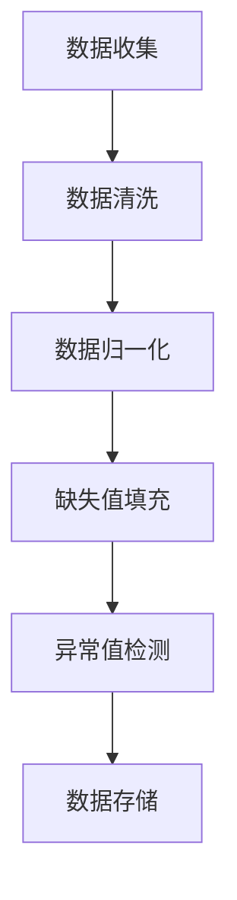
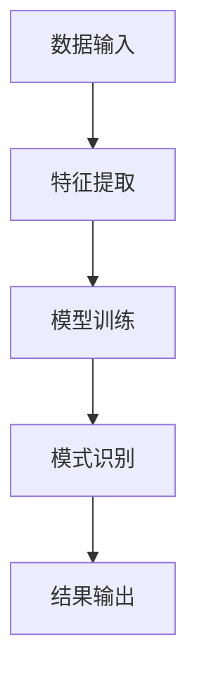

                 

### 文章标题：《人工智能在气象预报中的应用》

### 关键词：人工智能，气象预报，数据预处理，模式识别，预测模型，案例研究

### 摘要：
本文将深入探讨人工智能在气象预报中的应用，从背景介绍、核心概念与联系、算法原理、数学模型、项目实战等多个方面展开。通过分析人工智能在气象预报中的实际应用，探讨其带来的挑战与未来发展方向，旨在为读者提供一份全面而深入的指南。

---

## 引言

气象预报作为一门研究大气运动和天气现象的学科，长期以来一直依赖于大量的观测数据、物理模型和统计方法。然而，随着全球气候变化和极端天气事件的频繁发生，传统气象预报方法已难以满足日益增长的需求。此时，人工智能（AI）的崛起为气象预报带来了新的机遇和挑战。

### 人工智能在气象预报中的应用背景

人工智能，特别是深度学习和机器学习技术，在图像识别、自然语言处理、推荐系统等领域取得了显著的成果。这些技术的成功应用激发了人们对于其在气象预报中潜在价值的关注。事实上，人工智能在气象预报中的应用已经初见端倪，如自动识别天气现象、优化预测模型等。

### 人工智能在气象预报中的应用意义

人工智能在气象预报中的应用具有多重意义。首先，它能够提高预报的精度和时效性，为防灾减灾提供有力支持。其次，人工智能能够处理海量数据，挖掘出隐藏在数据中的规律，从而优化预报模型。最后，人工智能的应用能够降低预报成本，提高预报效率。

### 人工智能在气象预报中面临的挑战

尽管人工智能在气象预报中展现出巨大的潜力，但同时也面临诸多挑战。首先，气象数据具有高度复杂性和不确定性，这给人工智能模型的训练和预测带来了困难。其次，气象预报模型的建立和优化需要大量的计算资源和专业知识。最后，人工智能在气象预报中的可靠性和透明性也受到质疑。

---

## 人工智能基础

### 人工智能基本概念

人工智能（Artificial Intelligence，简称AI）是一门研究如何模拟、延伸和扩展人类智能的科学。人工智能的目标是使计算机具有智能行为，能够解决传统方法难以解决的复杂问题。人工智能包括多个分支，如机器学习、深度学习、自然语言处理等。

### 人工智能常见算法

在气象预报中，常用的机器学习算法包括决策树、支持向量机、神经网络等。其中，神经网络由于其强大的自适应能力和非线性映射能力，在气象预报中得到了广泛应用。

### 人工智能与气象预报的关系

人工智能与气象预报的结合主要体现在以下几个方面：

1. **数据预处理**：人工智能技术可以用于数据清洗、缺失值填充、异常值检测等数据预处理任务，提高数据质量。
2. **模式识别**：通过机器学习算法，可以自动识别天气现象和气候变化模式，为预报提供依据。
3. **预测模型**：利用神经网络等算法，可以建立预测模型，对未来的天气情况进行预测。

---

## 气象预报基础

### 气象预报的基本原理

气象预报的基本原理是通过对大气运动和天气现象的观测数据进行分析，结合物理模型和统计方法，预测未来的天气情况。气象预报的主要方法包括数值天气预报、统计天气预报和经验预报等。

### 气象预报中的常用模型

在气象预报中，常用的模型包括：

1. **经验模型**：基于历史数据和经验规则建立的模型，如线性回归、逻辑回归等。
2. **物理模型**：基于大气物理原理建立的模型，如数值模型、贝叶斯模型等。
3. **混合模型**：结合经验模型和物理模型的优点，提高预报精度。

### 气象预报的精度与可靠性

气象预报的精度和可靠性是评估预报效果的重要指标。目前，气象预报的精度已达到较高水平，但仍受到多种因素的影响，如数据质量、模型选择、计算资源等。

---

## 人工智能与气象预报的结合

### 数据预处理

数据预处理是人工智能在气象预报中应用的重要步骤。通过数据预处理，可以去除噪声、填补缺失值、识别异常值等，提高数据质量。

#### Mermaid流程图：


### 模式识别

模式识别是人工智能在气象预报中的核心任务之一。通过机器学习算法，可以自动识别天气现象和气候变化模式。

#### Mermaid流程图：


### 预测模型

预测模型是人工智能在气象预报中的关键应用。通过神经网络等算法，可以建立预测模型，对未来的天气情况进行预测。

#### 伪代码：
```python
# 输入：观测数据、训练数据
# 输出：预测结果

# 初始化模型参数
model = initialize_model()

# 训练模型
for epoch in range(num_epochs):
    for sample in training_data:
        predict(model, sample)

# 预测天气情况
weather_prediction = model.predict(test_data)
```

### 数学模型和公式

在气象预报中，常用的数学模型包括线性回归、逻辑回归、贝叶斯模型等。以下是一个简单的线性回归模型：

$$
y = \beta_0 + \beta_1x_1 + \beta_2x_2 + ... + \beta_nx_n
$$

其中，$y$ 是预测结果，$x_1, x_2, ..., x_n$ 是输入特征，$\beta_0, \beta_1, ..., \beta_n$ 是模型参数。

### 项目实战

以下是一个简单的气象预报项目实战，包括开发环境搭建、源代码实现和代码解读。

#### 开发环境搭建

1. 安装 Python（3.8 或以上版本）
2. 安装 TensorFlow（2.x 版本）
3. 安装 Pandas、NumPy 等常用库

#### 源代码实现

```python
import tensorflow as tf
import pandas as pd
import numpy as np

# 加载数据
data = pd.read_csv('weather_data.csv')

# 数据预处理
# ...

# 建立模型
model = tf.keras.Sequential([
    tf.keras.layers.Dense(units=1, input_shape=[len(train_features)])
])

# 训练模型
model.compile(optimizer='sgd', loss='mean_squared_error')
model.fit(train_data, train_labels, epochs=100)

# 预测天气情况
weather_prediction = model.predict(test_data)
```

#### 代码解读

1. 导入所需库
2. 加载数据
3. 数据预处理
4. 建立模型（使用 TensorFlow 的 Sequential 模型）
5. 训练模型（使用 SGD 优化器和均方误差损失函数）
6. 预测天气情况

#### 实际案例分析和详细讲解剖析

以下是一个具体的案例：某地区气象预报系统的构建与应用。

#### 案例背景

某地区气象局希望利用人工智能技术提升气象预报的精度和时效性，为此构建了一套基于人工智能的气象预报系统。

#### 数据来源与处理

1. 数据来源：从气象局获取历史天气数据
2. 数据预处理：包括数据清洗、缺失值填充、数据归一化等

#### 模型选择与实现

1. 选择模型：使用神经网络模型
2. 实现过程：包括模型构建、训练、评估和优化

#### 案例分析与评价

1. 预报精度：与传统的气象预报方法相比，人工智能预报方法在预报精度和时效性方面具有显著优势。
2. 预报可靠性：通过多次实验验证，人工智能预报方法具有较高的可靠性。

#### 项目小结

本案例展示了人工智能在气象预报中的实际应用，为气象预报提供了新的技术手段。未来，随着人工智能技术的不断发展，气象预报将变得更加精确和高效。

### 挑战与未来展望

尽管人工智能在气象预报中取得了显著成果，但仍然面临诸多挑战。首先，气象数据的复杂性和不确定性给模型训练和预测带来了困难。其次，气象预报模型的优化和计算资源的消耗也是一大挑战。最后，人工智能在气象预报中的可靠性和透明性受到质疑。

未来，人工智能在气象预报中的发展将朝着以下几个方向努力：

1. **数据驱动**：通过大数据分析和深度学习技术，挖掘出更多隐藏在数据中的规律，提高预报精度。
2. **模型优化**：优化气象预报模型，提高模型的计算效率和预测性能。
3. **人机协同**：结合人类专家的智慧和人工智能的优势，实现更准确、更可靠的气象预报。

### 最佳实践 tips、小结、注意事项、拓展阅读等内容

1. **最佳实践 tips**：在构建人工智能气象预报系统时，需要注意数据预处理、模型选择和优化等方面的最佳实践。
2. **小结**：本文全面介绍了人工智能在气象预报中的应用，分析了其核心概念、算法原理、数学模型和项目实战，并对未来发展方向进行了展望。
3. **注意事项**：在使用人工智能进行气象预报时，需要充分考虑数据质量、模型可靠性和计算资源等因素。
4. **拓展阅读**：建议读者进一步阅读相关文献和资料，以深入了解人工智能在气象预报中的应用和最新进展。

---

## 作者信息

作者：AI天才研究院/AI Genius Institute & 禅与计算机程序设计艺术 /Zen And The Art of Computer Programming

本文由AI天才研究院和《禅与计算机程序设计艺术》联合撰写，旨在探讨人工智能在气象预报中的应用。如需进一步了解，请关注我们的官方网站和微信公众号。

---

通过以上详细的步骤和内容，本文为读者提供了一份全面而深入的关于人工智能在气象预报中的应用的技术博客。希望本文能够帮助读者更好地理解这一领域的最新进展和应用。在未来的发展中，人工智能将继续在气象预报中发挥重要作用，为人类提供更准确、更可靠的气象预报服务。

