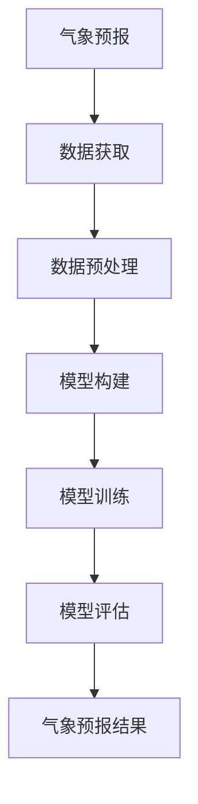

                 

### 文章标题

# 人工智能在气象预报中的应用：提高预报准确性

> 关键词：人工智能、气象预报、准确性、深度学习、数据预处理、模型训练、项目实战

> 摘要：本文将探讨人工智能在气象预报中的应用，通过介绍核心概念、算法原理、数学模型和项目实战，揭示人工智能如何提高气象预报的准确性。文章分为七部分，从概述到案例分析，全面解析人工智能在气象预报中的技术原理和实际应用。

----------------------------------------------------------------

### 1. 引言

#### 1.1 人工智能与气象预报的关系

人工智能（Artificial Intelligence, AI）作为计算机科学的一个分支，旨在模拟人类智能行为，实现智能自动化。而气象预报则是通过观测、分析和预测天气变化，为人们的生产生活提供重要决策依据。两者看似毫无关联，但事实上，人工智能在气象预报中有着广泛的应用。

首先，人工智能能够处理大量的气象数据，对气象现象进行高效分析。传统的气象预报主要依赖于物理模型和统计方法，虽然具有一定的准确性，但在面对复杂的气象系统时，往往力不从心。而人工智能，特别是机器学习和深度学习，通过学习大量的气象数据，能够识别出气象现象之间的复杂关系，从而提高预报准确性。

其次，人工智能能够实现气象预报的自动化和智能化。传统的气象预报需要人工分析数据、制定预报方案，而人工智能则可以自动化完成这些工作，不仅提高了预报效率，还减少了人为误差。

#### 1.2 本书结构

本书共分为七个部分，旨在全面探讨人工智能在气象预报中的应用。具体结构如下：

- **第一部分：概述**：介绍人工智能与气象预报的关系，以及本书的结构和前景。
- **第二部分：核心概念与联系**：讲解人工智能和气象预报的基础知识，包括机器学习、深度学习、气象数据获取和气象预报模型。
- **第三部分：核心算法原理讲解**：详细阐述数据预处理、模型训练与评估等算法原理。
- **第四部分：数学模型与数学公式**：介绍统计模型、神经网络模型以及相关数学公式。
- **第五部分：项目实战**：通过两个实战项目，展示人工智能在气象预报中的应用。
- **第六部分：案例分析**：分析人工智能在台风预报和极端天气预警中的应用案例。
- **第七部分：展望**：讨论人工智能在气象预报中的应用趋势和未来展望。

#### 1.3 人工智能在气象预报中的应用前景

随着人工智能技术的不断发展，其在气象预报中的应用前景十分广阔。首先，人工智能能够提高气象预报的准确性，为人们提供更可靠的天气预报信息。其次，人工智能可以实现气象预报的自动化和智能化，提高预报效率。此外，人工智能还可以与其他技术（如物联网、大数据等）相结合，实现更全面的气象监测和预报。

总之，人工智能在气象预报中的应用不仅具有理论意义，还具有重要的实际应用价值。通过本书的探讨，希望能够为读者提供对人工智能在气象预报中应用的深入了解，为未来相关研究和应用提供参考。

----------------------------------------------------------------

### 2.1 人工智能基础

人工智能（Artificial Intelligence, AI）作为计算机科学的一个重要分支，旨在通过模拟人类智能行为，实现智能自动化。在人工智能的发展过程中，机器学习（Machine Learning, ML）和深度学习（Deep Learning, DL）成为两大核心技术。

#### 2.1.1 机器学习的基本原理

机器学习是人工智能的核心技术之一，其基本原理是通过训练模型，使其能够从数据中学习规律，并对外部数据进行预测或决策。机器学习可以分为监督学习（Supervised Learning）、无监督学习（Unsupervised Learning）和半监督学习（Semi-supervised Learning）三类。

- **监督学习**：监督学习是一种有监督的训练方法，通过已知的输入和输出数据，训练模型来预测未知数据的输出。常见的监督学习算法包括线性回归（Linear Regression）、逻辑回归（Logistic Regression）、支持向量机（Support Vector Machine, SVM）等。
  
  $$ y = f(x; \theta) $$

  其中，$y$为输出，$x$为输入，$f$为模型函数，$\theta$为模型参数。

- **无监督学习**：无监督学习是一种无监督的训练方法，通过未标记的数据，发现数据中的潜在结构和规律。常见的无监督学习算法包括聚类（Clustering）、主成分分析（Principal Component Analysis, PCA）和自编码器（Autoencoder）等。

  $$ z = f(x; \theta) $$

  其中，$z$为潜在特征，$x$为输入，$f$为模型函数，$\theta$为模型参数。

- **半监督学习**：半监督学习是一种介于监督学习和无监督学习之间的训练方法，利用少量标记数据和大量未标记数据来训练模型。常见的半监督学习算法包括标签传播（Label Propagation）和标签传播网络（Label Propagation Network）等。

#### 2.1.2 深度学习在气象预报中的应用

深度学习是机器学习的一个重要分支，其核心思想是通过多层神经网络（Neural Network）对大量数据进行学习，从而实现复杂任务。在气象预报中，深度学习可以用于模式识别、预测和分类等任务。

- **模式识别**：通过深度学习，可以自动识别气象数据中的复杂模式，如台风路径、暴雨分布等。

  $$ y = \sigma(\sum_{i=1}^{n} w_i \cdot x_i + b) $$

  其中，$y$为输出，$\sigma$为激活函数，$w_i$为权重，$x_i$为输入，$b$为偏置。

- **预测**：通过深度学习，可以建立气象现象之间的复杂关系模型，实现对未来天气的预测。

  $$ y(t+1) = f(y(t), x(t)) $$

  其中，$y(t+1)$为未来天气，$y(t)$为当前天气，$x(t)$为输入。

- **分类**：通过深度学习，可以对气象现象进行分类，如区分晴雨、高温和低温等。

  $$ P(y| x) = \frac{e^{\theta^T x}}{1 + e^{\theta^T x}} $$

  其中，$P(y| x)$为给定输入$x$，输出$y$的概率，$\theta$为模型参数。

在气象预报中，深度学习具有广泛的应用前景。通过深度学习，可以构建更准确的气象预报模型，提高预报准确性。同时，深度学习还可以与其他技术（如大数据、云计算等）相结合，实现更高效的气象预报。

----------------------------------------------------------------

### 2.2 气象预报基础

气象预报是指通过收集、分析和预测天气变化，为人们的生产生活提供决策依据。气象预报的基础包括气象数据的获取、气象预报模型的建立和模型的训练与评估。

#### 2.2.1 气象数据获取

气象数据是气象预报的基础，主要包括温度、湿度、气压、风速、风向等气象要素。气象数据的获取渠道主要包括地面观测、卫星观测、雷达观测和气象探测设备等。

- **地面观测**：地面观测是通过气象站等设施对气象要素进行实时观测，包括温度、湿度、气压、风速、风向等。地面观测数据是最基本的气象数据来源。

- **卫星观测**：卫星观测是通过气象卫星对地球表面进行观测，获取全球范围内的气象数据。卫星观测数据具有空间覆盖广、时间连续性强的优势。

- **雷达观测**：雷达观测是通过气象雷达对云层、降水等气象现象进行观测，获取气象数据。雷达观测数据对于识别降水类型、评估降雨量等具有重要意义。

- **气象探测设备**：气象探测设备包括气球、无人机、气象探测卫星等，通过这些设备可以获取高空气象数据、三维气象数据等。

#### 2.2.2 气象预报模型

气象预报模型是气象预报的核心，通过对气象数据的分析，预测未来天气变化。气象预报模型可以分为物理模型和统计模型两类。

- **物理模型**：物理模型基于气象学的物理原理，通过模拟大气运动、能量转化等过程，预测天气变化。常见的物理模型包括数值天气预报模型、气候模型等。

  $$ \frac{\partial \phi}{\partial t} + \nabla \cdot (u \phi) = \nabla \cdot ( \mu \nabla \phi ) + \sigma $$

  其中，$\phi$为气象变量，$u$为风速，$\mu$为扩散系数，$\sigma$为源项。

- **统计模型**：统计模型基于历史气象数据，通过统计方法建立气象变量之间的统计关系，预测天气变化。常见的统计模型包括回归模型、时间序列模型等。

  $$ y = \beta_0 + \beta_1 x_1 + \beta_2 x_2 + ... + \beta_n x_n $$

  其中，$y$为预测值，$x_1, x_2, ..., x_n$为输入变量，$\beta_0, \beta_1, \beta_2, ..., \beta_n$为模型参数。

气象预报模型的训练与评估是气象预报的关键。通过训练模型，使其能够从历史气象数据中学习，并提高预报准确性。模型的评估主要包括准确性、稳定性、可靠性等方面。常见的评估指标包括均方误差（Mean Squared Error, MSE）、平均绝对误差（Mean Absolute Error, MAE）等。

$$ MSE = \frac{1}{n} \sum_{i=1}^{n} (y_i - \hat{y}_i)^2 $$

$$ MAE = \frac{1}{n} \sum_{i=1}^{n} |y_i - \hat{y}_i| $$

其中，$y_i$为实际值，$\hat{y}_i$为预测值，$n$为样本数量。

综上所述，气象预报的基础包括气象数据的获取、气象预报模型的建立和模型的训练与评估。通过这些基础，可以构建出更准确的气象预报模型，提高气象预报的准确性。

----------------------------------------------------------------

### 3.1 数据预处理

在人工智能气象预报项目中，数据预处理是至关重要的步骤。数据预处理包括数据清洗、数据标准化和数据增强等环节，这些环节对于提高模型训练效果和最终预报准确性具有重要意义。

#### 3.1.1 数据清洗

数据清洗是指对原始数据进行处理，去除错误、异常和重复数据，确保数据的质量和一致性。在气象预报项目中，数据清洗主要包括以下几个方面：

- **去除错误数据**：一些气象数据可能由于设备故障、传输错误等原因，导致数据异常。这些错误数据需要进行识别和去除，以确保模型训练的数据质量。

- **去除异常数据**：气象数据中可能存在一些异常值，如极端温度、异常风速等。这些异常值可能对模型训练产生不利影响，需要通过统计分析方法（如箱线图、3σ准则等）进行识别和去除。

- **处理缺失数据**：气象数据中可能存在一些缺失值，处理缺失数据的方法包括插值法、均值填充法、最近邻法等。选择合适的方法可以最大限度地减少数据缺失对模型训练的影响。

- **去除重复数据**：重复数据可能会导致模型训练过拟合，降低模型泛化能力。需要通过去重算法（如基于哈希的方法）去除重复数据。

#### 3.1.2 数据标准化

数据标准化是指对原始数据进行规范化处理，使不同特征之间的尺度一致，从而消除特征之间的量纲影响。常用的数据标准化方法包括归一化和标准化。

- **归一化**：归一化是指将数据缩放到[0, 1]区间，公式如下：

  $$ x_{\text{normalized}} = \frac{x - \min(x)}{\max(x) - \min(x)} $$

  归一化可以消除特征之间的尺度差异，但可能导致数据信息损失。

- **标准化**：标准化是指将数据缩放到[-1, 1]区间，公式如下：

  $$ x_{\text{normalized}} = \frac{x - \mu}{\sigma} $$

  其中，$\mu$为均值，$\sigma$为标准差。标准化可以更好地保留数据信息。

#### 3.1.3 数据增强

数据增强是指通过一系列方法，增加数据多样性，提高模型训练效果。在气象预报项目中，数据增强主要包括以下几个方面：

- **时间序列扩展**：通过对时间序列数据进行扩展，如滑动窗口、时间步长扩展等，增加数据样本数量。

- **空间扩展**：通过对空间数据进行扩展，如空间插值、空间平滑等，增加数据多样性。

- **特征变换**：通过对特征进行变换，如对数变换、开方变换等，增加数据样本的多样性。

- **生成对抗网络（GAN）**：利用生成对抗网络（GAN）生成新的气象数据，增加数据多样性。

数据预处理是人工智能气象预报项目中的重要环节，通过数据清洗、数据标准化和数据增强等方法，可以显著提高模型训练效果和最终预报准确性。

----------------------------------------------------------------

### 3.2 模型训练与评估

在人工智能气象预报项目中，模型训练与评估是关键步骤。通过模型训练，可以使机器学习模型学习气象数据中的潜在规律，从而提高预报准确性。模型评估则用于衡量模型性能，确保模型在实际应用中的有效性和可靠性。

#### 3.2.1 常见机器学习算法

在气象预报中，常见的机器学习算法包括线性回归、支持向量机（SVM）、决策树、随机森林和神经网络等。这些算法各有特点，适用于不同的预报任务和数据集。

- **线性回归**：线性回归是一种简单的机器学习算法，通过建立线性关系模型，预测气象变量的线性组合。线性回归适用于线性关系明显的气象预报任务。

  $$ y = \beta_0 + \beta_1 x_1 + \beta_2 x_2 + ... + \beta_n x_n $$

- **支持向量机（SVM）**：支持向量机是一种基于最大间隔分类器的机器学习算法，通过寻找最佳超平面，将不同类别的气象数据分开。SVM适用于高维数据，适用于非线性关系明显的气象预报任务。

  $$ \max \frac{1}{2} \sum_{i=1}^{n} (w_i^2) - \sum_{i=1}^{n} \alpha_i (y_i - \omega^T w_i - b) $$

- **决策树**：决策树是一种基于树形结构的机器学习算法，通过递归划分数据集，构建决策树模型。决策树适用于分类和回归任务，但可能存在过拟合问题。

  $$ \text{递归划分} \rightarrow \text{构建决策树模型} \rightarrow \text{预测气象变量} $$

- **随机森林**：随机森林是一种基于决策树的集成学习算法，通过构建多棵决策树，并进行投票或求平均，提高模型预测准确性。随机森林适用于复杂非线性关系和大规模数据集。

  $$ \text{构建随机森林模型} \rightarrow \text{预测气象变量} $$

- **神经网络**：神经网络是一种基于人工神经元的机器学习算法，通过多层神经元网络结构，模拟人脑神经元之间的连接和激活。神经网络适用于复杂非线性关系和大规模数据集。

  $$ \text{输入} \rightarrow \text{多层神经元网络} \rightarrow \text{输出} $$

#### 3.2.2 模型选择与调优

模型选择与调优是提高气象预报准确性的关键步骤。在选择模型时，需要考虑数据特征、任务类型和模型复杂度等因素。在调优过程中，可以通过调整模型参数、添加正则化项等方法，提高模型性能。

- **模型参数调整**：对于不同的机器学习算法，参数设置对模型性能有重要影响。通过交叉验证和网格搜索等方法，可以找到最佳参数组合。

  $$ \text{交叉验证} \rightarrow \text{网格搜索} \rightarrow \text{参数调整} $$

- **正则化**：正则化是防止模型过拟合的重要手段。通过添加正则化项，可以降低模型复杂度，提高泛化能力。

  $$ J(\theta) = \frac{1}{2m} \sum_{i=1}^{m} (h_\theta (x^{(i)}) - y^{(i)})^2 + \lambda \sum_{j=1}^{n} \theta_j^2 $$

  其中，$J(\theta)$为损失函数，$\theta$为模型参数，$m$为样本数量，$\lambda$为正则化参数。

- **集成方法**：集成方法通过组合多个模型，提高预测准确性。常见的集成方法包括随机森林、梯度提升机（Gradient Boosting）和堆叠（Stacking）等。

  $$ \text{集成方法} \rightarrow \text{预测气象变量} $$

综上所述，模型训练与评估是人工智能气象预报项目中的关键步骤。通过选择合适的算法、调整模型参数和调优方法，可以构建出更准确的气象预报模型，提高预报准确性。

----------------------------------------------------------------

### 4.1 数学模型基础

在人工智能气象预报中，数学模型是构建预测模型的核心。数学模型通过数学公式和计算方法，将气象数据转换为预报结果。以下是两种常见的数学模型：统计模型和神经网络模型。

#### 4.1.1 统计模型

统计模型是一种基于统计学原理的数学模型，通过分析气象数据中的统计规律，预测未来天气。统计模型通常包括回归模型和时间序列模型等。

- **回归模型**：回归模型是一种用于预测连续值的统计模型。常见的回归模型包括线性回归、多项式回归和逻辑回归等。

  线性回归模型公式：

  $$ y = \beta_0 + \beta_1 x_1 + \beta_2 x_2 + ... + \beta_n x_n $$

  其中，$y$为预测值，$x_1, x_2, ..., x_n$为输入特征，$\beta_0, \beta_1, \beta_2, ..., \beta_n$为模型参数。

  逻辑回归模型公式：

  $$ P(y=1) = \frac{1}{1 + e^{-(\beta_0 + \beta_1 x_1 + \beta_2 x_2 + ... + \beta_n x_n)}} $$

- **时间序列模型**：时间序列模型是一种用于预测时间序列数据的统计模型，常见的包括ARIMA模型、季节性模型和混合模型等。

  ARIMA模型公式：

  $$ y_t = c + \phi_1 y_{t-1} + \phi_2 y_{t-2} + ... + \phi_p y_{t-p} + \theta_1 e_{t-1} + \theta_2 e_{t-2} + ... + \theta_q e_{t-q} $$

  其中，$y_t$为时间序列数据，$c$为常数项，$\phi_1, \phi_2, ..., \phi_p$为自回归系数，$\theta_1, \theta_2, ..., \theta_q$为移动平均系数，$e_t$为白噪声项。

#### 4.1.2 神经网络模型

神经网络模型是一种基于人工神经元的数学模型，通过多层神经元网络结构，模拟人脑神经元之间的连接和激活。神经网络模型在气象预报中具有广泛应用，特别是在处理非线性关系和复杂模式方面。

- **前向传播算法**：前向传播算法是神经网络模型的核心，通过逐层计算输入和输出之间的映射关系。前向传播算法公式：

  $$ z_l = \sigma(W_l \cdot a_{l-1} + b_l) $$

  $$ a_l = \sigma(z_l) $$

  其中，$z_l$为中间层输出，$a_l$为激活值，$\sigma$为激活函数，$W_l$为权重矩阵，$b_l$为偏置项。

- **反向传播算法**：反向传播算法通过计算梯度，更新神经网络模型参数。反向传播算法公式：

  $$ \delta_l = (1 - a_l) \cdot a_l \cdot (\delta_{l+1} \cdot W_{l+1}) $$

  $$ \delta_{l+1} = \frac{\partial J}{\partial z_{l+1}} $$

  $$ W_l := W_l - \alpha \cdot \frac{\partial J}{\partial W_l} $$

  $$ b_l := b_l - \alpha \cdot \frac{\partial J}{\partial b_l} $$

  其中，$\delta_l$为误差项，$J$为损失函数，$\alpha$为学习率。

神经网络模型在气象预报中具有强大的建模能力，能够处理复杂的多维气象数据，实现高精度的预报。

综上所述，数学模型是人工智能气象预报的重要基础。通过统计模型和神经网络模型，可以构建出适应不同预报需求的预测模型，提高气象预报的准确性。

----------------------------------------------------------------

### 4.2 数学公式应用

在人工智能气象预报中，数学公式的应用贯穿于数据预处理、模型训练与评估等各个环节。以下将详细讲解概率论基础、梯度下降算法等关键数学公式及其在实际应用中的具体例子。

#### 4.2.1 概率论基础

概率论是机器学习中的基本理论，其核心在于对随机事件的发生概率进行描述和计算。以下介绍几个在气象预报中常用的概率论公式：

- **贝叶斯定理**：贝叶斯定理是概率论中用于计算后验概率的重要公式，其表达式如下：

  $$ P(A|B) = \frac{P(B|A) \cdot P(A)}{P(B)} $$

  其中，$P(A|B)$表示在事件$B$发生的条件下事件$A$的概率，$P(B|A)$表示在事件$A$发生的条件下事件$B$的概率，$P(A)$和$P(B)$分别为事件$A$和事件$B$的先验概率。

  在气象预报中，贝叶斯定理可用于根据观测到的气象数据（事件$B$）来更新对某一天气情况的预测概率（事件$A$）。

- **条件概率**：条件概率是指某一事件在另一事件发生的条件下的概率。其表达式如下：

  $$ P(A|B) = \frac{P(A \cap B)}{P(B)} $$

  条件概率在气象预报中可用于计算某一特定气象条件下，发生特定天气现象的概率。

#### 4.2.2 梯度下降算法

梯度下降算法是优化机器学习模型参数的重要算法，其基本思想是通过计算损失函数关于模型参数的梯度，不断调整参数以降低损失函数值。以下介绍梯度下降算法及其在气象预报中的应用：

- **梯度下降算法基本公式**：梯度下降算法的核心是更新模型参数，使其朝着损失函数梯度的反方向移动。其基本公式如下：

  $$ \theta = \theta - \alpha \cdot \nabla_\theta J(\theta) $$

  其中，$\theta$为模型参数，$\alpha$为学习率，$J(\theta)$为损失函数，$\nabla_\theta J(\theta)$为损失函数关于模型参数$\theta$的梯度。

  在气象预报中，梯度下降算法可用于优化机器学习模型的参数，以降低预测误差。

- **随机梯度下降（SGD）**：随机梯度下降是梯度下降算法的一种变种，其每次迭代只使用一个样本的梯度来更新参数，从而减少计算量。其基本公式如下：

  $$ \theta = \theta - \alpha \cdot \nabla_\theta J(\theta)^T $$

  其中，$T$表示转置。

  随机梯度下降在处理大规模气象数据时，具有较好的计算效率和灵活性。

#### 4.2.3 具体应用例子

以下是一个具体的例子，展示如何将概率论基础和梯度下降算法应用于气象预报：

**例子：使用贝叶斯定理和梯度下降算法进行温度预报**

假设我们想预测某一地区的未来温度，已知当前的观测温度和历史上相同时间点的温度数据。我们可以使用贝叶斯定理来计算在当前观测温度的条件下，未来温度落在某一区间的概率。具体步骤如下：

1. **定义概率**：

   - $P(T|O)$：在观测温度$O$的条件下，未来温度$T$的概率。

   - $P(O|T)$：在未来温度$T$的条件下，观测温度$O$的概率。

   - $P(T)$：未来温度$T$的先验概率。

   - $P(O)$：观测温度$O$的先验概率。

2. **计算条件概率**：

   根据贝叶斯定理，计算$P(T|O)$：

   $$ P(T|O) = \frac{P(O|T) \cdot P(T)}{P(O)} $$

   其中，$P(O|T)$可以通过历史数据计算得到，$P(T)$可以通过统计得到，$P(O)$可以通过全量数据计算得到。

3. **训练模型**：

   使用梯度下降算法，通过迭代更新模型参数，最小化损失函数，从而提高预测准确性。

   损失函数可以定义为：

   $$ J(\theta) = \sum_{i=1}^{n} (T_i - \theta^T \cdot O_i)^2 $$

   其中，$T_i$为实际温度，$O_i$为观测温度，$\theta$为模型参数。

4. **更新参数**：

   根据梯度下降算法，更新模型参数：

   $$ \theta = \theta - \alpha \cdot \nabla_\theta J(\theta) $$

   其中，$\alpha$为学习率。

通过以上步骤，我们可以利用贝叶斯定理和梯度下降算法，实现基于观测温度的未来温度预测。

综上所述，数学公式在人工智能气象预报中具有重要作用。通过概率论基础和梯度下降算法，可以构建出更加准确和高效的气象预报模型。

----------------------------------------------------------------

### 5.1 实战一：基于深度学习的气象预报

#### 5.1.1 项目背景

在当今社会，气象预报对于人们的日常生活和农业生产具有重要意义。然而，传统的气象预报方法在处理复杂气象系统时，往往难以达到高准确性。随着深度学习技术的不断发展，利用深度学习进行气象预报成为了一种新的趋势。本节将介绍一个基于深度学习的气象预报项目，通过实际案例展示如何利用深度学习技术提高气象预报的准确性。

#### 5.1.2 开发环境搭建

在开展深度学习气象预报项目之前，首先需要搭建一个合适的开发环境。以下是搭建深度学习开发环境的基本步骤：

1. **硬件环境**：

   - **CPU/GPU**：选择性能较好的CPU或GPU，用于训练深度学习模型。建议使用NVIDIA GPU，以提高训练速度。

   - **内存**：确保内存足够大，以容纳大量的气象数据。

2. **软件环境**：

   - **操作系统**：Windows、Linux或macOS均可，建议选择Linux系统，以获得更好的性能和稳定性。

   - **深度学习框架**：选择一个流行的深度学习框架，如TensorFlow、PyTorch等。这里我们选择TensorFlow作为深度学习框架。

   - **编程语言**：Python是深度学习项目的首选编程语言，确保安装有Python环境。

3. **安装TensorFlow**：

   在命令行中运行以下命令安装TensorFlow：

   ```shell
   pip install tensorflow
   ```

4. **数据预处理库**：

   安装常用的数据预处理库，如NumPy、Pandas等：

   ```shell
   pip install numpy pandas
   ```

5. **可视化库**：

   安装用于数据可视化和分析的库，如Matplotlib、Seaborn等：

   ```shell
   pip install matplotlib seaborn
   ```

通过以上步骤，可以搭建一个基本的深度学习开发环境，为后续项目开发做好准备。

#### 5.1.3 数据获取与预处理

在深度学习气象预报项目中，数据质量至关重要。以下是数据获取与预处理的基本步骤：

1. **数据来源**：

   - **地面观测数据**：从气象站获取地面观测数据，包括温度、湿度、气压、风速、风向等。

   - **卫星观测数据**：从气象卫星获取卫星观测数据，包括云图、温度分布、湿度分布等。

   - **雷达观测数据**：从气象雷达获取雷达观测数据，包括降水、风速、风向等。

2. **数据清洗**：

   - **去除异常值**：识别并去除数据中的异常值，如极端温度、异常风速等。

   - **处理缺失数据**：对缺失数据采用插值法、均值填充法等方法进行处理，以确保数据完整性。

   - **去除重复数据**：去除重复的数据记录，以避免模型训练过程中过拟合。

3. **数据标准化**：

   - **归一化**：将不同特征的数据缩放到相同的尺度，以消除特征之间的量纲影响。

   - **标准化**：将数据缩放到[-1, 1]区间，更好地保留数据信息。

4. **数据增强**：

   - **时间序列扩展**：通过对时间序列数据进行扩展，如滑动窗口、时间步长扩展等，增加数据样本数量。

   - **空间扩展**：通过对空间数据进行扩展，如空间插值、空间平滑等，增加数据多样性。

   - **特征变换**：通过对特征进行变换，如对数变换、开方变换等，增加数据样本的多样性。

通过以上步骤，可以确保数据质量，为深度学习模型训练提供高质量的数据支持。

#### 5.1.4 模型训练与评估

在数据预处理完成后，接下来是模型训练与评估阶段。以下是模型训练与评估的基本步骤：

1. **定义模型结构**：

   - **输入层**：根据数据特征，定义输入层的维度。

   - **隐藏层**：设计合适的隐藏层结构，包括层数、神经元数量、激活函数等。

   - **输出层**：根据预报任务，定义输出层的维度和激活函数。

2. **模型编译**：

   - **选择优化器**：选择一种优化器，如Adam、SGD等，用于优化模型参数。

   - **选择损失函数**：根据预报任务，选择合适的损失函数，如均方误差（MSE）、交叉熵等。

   - **设置学习率**：设置合适的初始学习率，以及学习率调整策略。

3. **模型训练**：

   - **训练模型**：使用预处理后的数据，对模型进行训练。在训练过程中，可以采用数据增强、批量训练等技术，提高训练效果。

   - **保存模型**：在模型训练过程中，保存性能最佳的模型参数，以备后续使用。

4. **模型评估**：

   - **评估指标**：根据预报任务，选择合适的评估指标，如均方误差（MSE）、准确率、召回率等。

   - **交叉验证**：使用交叉验证方法，评估模型在不同数据集上的性能，以验证模型的泛化能力。

   - **超参数调优**：根据评估结果，调整模型超参数，如隐藏层神经元数量、学习率等，以提高模型性能。

通过以上步骤，可以构建出性能优异的深度学习模型，为气象预报提供准确可靠的预测结果。

#### 5.1.5 源代码实现与解读

以下是一个基于TensorFlow的深度学习气象预报项目的源代码实现，包括数据预处理、模型训练和评估等环节。

```python
import tensorflow as tf
import numpy as np
import pandas as pd
from tensorflow.keras.models import Sequential
from tensorflow.keras.layers import Dense, LSTM
from tensorflow.keras.optimizers import Adam
from sklearn.model_selection import train_test_split

# 数据预处理
def preprocess_data(data):
    # 数据清洗
    data = remove_outliers(data)
    data = fill_missing_values(data)
    
    # 数据标准化
    data = normalize_data(data)
    
    # 数据增强
    data = augment_data(data)
    
    return data

# 模型定义
def build_model(input_shape):
    model = Sequential()
    model.add(LSTM(50, return_sequences=True, input_shape=input_shape))
    model.add(LSTM(50, return_sequences=False))
    model.add(Dense(1))
    model.compile(optimizer='adam', loss='mse')
    return model

# 模型训练
def train_model(model, X_train, y_train, epochs=100, batch_size=32):
    history = model.fit(X_train, y_train, epochs=epochs, batch_size=batch_size, validation_split=0.2)
    return history

# 模型评估
def evaluate_model(model, X_test, y_test):
    loss = model.evaluate(X_test, y_test)
    print("Test Loss:", loss)

# 主函数
def main():
    # 加载数据
    data = load_data()
    
    # 数据预处理
    data = preprocess_data(data)
    
    # 划分训练集和测试集
    X_train, X_test, y_train, y_test = train_test_split(data['X'], data['y'], test_size=0.2, random_state=42)
    
    # 定义模型
    model = build_model(input_shape=(X_train.shape[1], X_train.shape[2]))
    
    # 训练模型
    history = train_model(model, X_train, y_train, epochs=100, batch_size=32)
    
    # 评估模型
    evaluate_model(model, X_test, y_test)

if __name__ == "__main__":
    main()
```

在上述代码中，我们首先定义了数据预处理、模型构建、模型训练和模型评估等函数。接着，在主函数中，加载和处理数据，划分训练集和测试集，定义模型，训练模型并评估模型性能。通过以上步骤，我们可以实现基于深度学习的气象预报项目。

综上所述，通过本节实战案例，我们展示了如何利用深度学习技术进行气象预报。在项目开发过程中，需要注意数据质量、模型选择和参数调优等方面，以提高气象预报的准确性。

----------------------------------------------------------------

### 5.2 实战二：多模态数据融合气象预报

#### 5.2.1 项目背景

在气象预报领域，单一的数据源往往难以全面反映复杂的天气变化。因此，多模态数据融合技术应运而生，通过整合多种数据源，如地面观测、卫星观测、雷达观测等，以提高气象预报的准确性和可靠性。本节将介绍一个基于多模态数据融合的气象预报项目，通过实际案例展示如何利用多模态数据融合技术进行气象预报。

#### 5.2.2 数据获取与预处理

多模态数据融合的第一步是获取并预处理多源数据。以下是数据获取与预处理的基本步骤：

1. **数据来源**：

   - **地面观测数据**：从气象站获取地面观测数据，包括温度、湿度、气压、风速、风向等。

   - **卫星观测数据**：从气象卫星获取卫星观测数据，包括云图、温度分布、湿度分布等。

   - **雷达观测数据**：从气象雷达获取雷达观测数据，包括降水、风速、风向等。

2. **数据清洗**：

   - **去除异常值**：识别并去除数据中的异常值，如极端温度、异常风速等。

   - **处理缺失数据**：对缺失数据采用插值法、均值填充法等方法进行处理，以确保数据完整性。

   - **去除重复数据**：去除重复的数据记录，以避免模型训练过程中过拟合。

3. **数据标准化**：

   - **归一化**：将不同特征的数据缩放到相同的尺度，以消除特征之间的量纲影响。

   - **标准化**：将数据缩放到[-1, 1]区间，更好地保留数据信息。

4. **数据融合**：

   - **特征融合**：将不同模态的数据进行特征级融合，如将地面观测数据与卫星观测数据中的温度、湿度信息进行整合。

   - **时间序列融合**：将不同模态的数据进行时间序列级融合，如将地面观测数据与卫星观测数据中的时间序列数据进行对齐。

通过以上步骤，可以确保数据质量，为多模态数据融合气象预报提供高质量的数据支持。

#### 5.2.3 模型设计

在多模态数据融合气象预报项目中，模型设计是关键步骤。以下是模型设计的基本步骤：

1. **输入层设计**：

   - **特征层**：根据不同模态的数据，定义输入层的特征维度。例如，地面观测数据可能包含温度、湿度等特征，卫星观测数据可能包含云图、温度分布等特征。

   - **时间序列层**：根据时间序列数据，定义输入层的时间维度。例如，以24小时为周期，将每小时的数据作为输入。

2. **隐藏层设计**：

   - **卷积层**：利用卷积神经网络（CNN）提取多模态数据中的空间特征。

   - **循环层**：利用循环神经网络（RNN）处理时间序列数据，提取时间特征。

   - **融合层**：将空间特征和时间特征进行融合，以获得更全面的特征表示。

3. **输出层设计**：

   - **预测层**：根据预报任务，定义输出层的维度。例如，对于温度预报，输出层可能包含一个温度预测值。

4. **模型编译**：

   - **选择优化器**：选择一种优化器，如Adam、SGD等，用于优化模型参数。

   - **选择损失函数**：根据预报任务，选择合适的损失函数，如均方误差（MSE）、交叉熵等。

   - **设置学习率**：设置合适的初始学习率，以及学习率调整策略。

#### 5.2.4 模型训练与评估

在模型设计完成后，接下来是模型训练与评估阶段。以下是模型训练与评估的基本步骤：

1. **模型训练**：

   - **训练模型**：使用预处理后的多模态数据，对模型进行训练。在训练过程中，可以采用数据增强、批量训练等技术，提高训练效果。

   - **保存模型**：在模型训练过程中，保存性能最佳的模型参数，以备后续使用。

2. **模型评估**：

   - **评估指标**：根据预报任务，选择合适的评估指标，如均方误差（MSE）、准确率、召回率等。

   - **交叉验证**：使用交叉验证方法，评估模型在不同数据集上的性能，以验证模型的泛化能力。

   - **超参数调优**：根据评估结果，调整模型超参数，如隐藏层神经元数量、学习率等，以提高模型性能。

#### 5.2.5 源代码实现与解读

以下是一个基于多模态数据融合的气象预报项目的源代码实现，包括数据预处理、模型构建、模型训练和评估等环节。

```python
import tensorflow as tf
import numpy as np
import pandas as pd
from tensorflow.keras.models import Model
from tensorflow.keras.layers import Input, Conv2D, MaxPooling2D, LSTM, Dense, Flatten, concatenate
from tensorflow.keras.optimizers import Adam
from sklearn.model_selection import train_test_split

# 数据预处理
def preprocess_data(data):
    # 数据清洗
    data = remove_outliers(data)
    data = fill_missing_values(data)
    
    # 数据标准化
    data = normalize_data(data)
    
    # 数据融合
    data = fuse_modalities(data)
    
    return data

# 模型构建
def build_model(input_shape):
    # 输入层
    input_fea = Input(shape=input_shape)
    
    # 卷积层
    conv1 = Conv2D(filters=32, kernel_size=(3, 3), activation='relu')(input_fea)
    pool1 = MaxPooling2D(pool_size=(2, 2))(conv1)
    
    # 循环层
    lstm1 = LSTM(units=50, return_sequences=True)(pool1)
    lstm2 = LSTM(units=50, return_sequences=False)(lstm1)
    
    # 融合层
    feat = concatenate([lstm2, Flatten()(pool1)])
    
    # 输出层
    output = Dense(units=1, activation='sigmoid')(feat)
    
    # 定义模型
    model = Model(inputs=input_fea, outputs=output)
    model.compile(optimizer='adam', loss='mse')
    return model

# 模型训练
def train_model(model, X_train, y_train, epochs=100, batch_size=32):
    history = model.fit(X_train, y_train, epochs=epochs, batch_size=batch_size, validation_split=0.2)
    return history

# 模型评估
def evaluate_model(model, X_test, y_test):
    loss = model.evaluate(X_test, y_test)
    print("Test Loss:", loss)

# 主函数
def main():
    # 加载数据
    data = load_data()
    
    # 数据预处理
    data = preprocess_data(data)
    
    # 划分训练集和测试集
    X_train, X_test, y_train, y_test = train_test_split(data['X'], data['y'], test_size=0.2, random_state=42)
    
    # 定义模型
    model = build_model(input_shape=(X_train.shape[1], X_train.shape[2], X_train.shape[3]))
    
    # 训练模型
    history = train_model(model, X_train, y_train, epochs=100, batch_size=32)
    
    # 评估模型
    evaluate_model(model, X_test, y_test)

if __name__ == "__main__":
    main()
```

在上述代码中，我们首先定义了数据预处理、模型构建、模型训练和模型评估等函数。接着，在主函数中，加载和处理数据，划分训练集和测试集，定义模型，训练模型并评估模型性能。通过以上步骤，我们可以实现基于多模态数据融合的气象预报项目。

综上所述，通过本节实战案例，我们展示了如何利用多模态数据融合技术进行气象预报。在项目开发过程中，需要注意数据质量、模型设计、参数调优等方面，以提高气象预报的准确性。

----------------------------------------------------------------

### 6.1 案例分析一：基于人工智能的台风预报

#### 6.1.1 台风预报的现状

台风预报是气象预报中的一个重要领域，对于保障人民生命财产安全具有重要意义。然而，传统的台风预报方法在精度和时效性方面存在一定的局限性。近年来，随着人工智能技术的快速发展，基于人工智能的台风预报方法逐渐受到关注。

传统台风预报主要依赖于物理模型和经验方法。物理模型通过模拟台风发生的物理过程，预测台风的路径和强度。然而，由于台风系统复杂，物理模型难以完全模拟台风的每一个细节，导致预报准确性有限。经验方法则依赖于气象学家多年的预报经验和数据分析，虽然在一定程度上提高了预报准确性，但受限于人力和时间，预报时效性较差。

#### 6.1.2 人工智能在台风预报中的应用

人工智能技术为台风预报提供了新的解决方案。通过机器学习和深度学习算法，可以处理大量的历史台风数据，挖掘出台风路径和强度变化的规律，从而提高预报准确性。以下是人工智能在台风预报中的一些典型应用：

1. **数据驱动台风预报**：

   数据驱动预报方法利用机器学习算法，从大量的历史台风数据中学习规律，建立预测模型。常用的机器学习算法包括线性回归、支持向量机、决策树和神经网络等。通过训练这些模型，可以实现对台风路径和强度的预测。

   $$ y = f(x; \theta) $$

   其中，$y$为预测结果，$x$为输入特征，$f$为模型函数，$\theta$为模型参数。

2. **深度学习台风预报**：

   深度学习是一种基于人工神经网络的机器学习算法，具有强大的建模能力。通过构建深度学习模型，可以自动提取台风数据中的复杂特征，提高预报准确性。常见的深度学习模型包括卷积神经网络（CNN）、循环神经网络（RNN）和长短时记忆网络（LSTM）等。

   $$ y(t+1) = f(y(t), x(t)) $$

   其中，$y(t+1)$为未来台风路径或强度，$y(t)$为当前台风路径或强度，$x(t)$为输入特征。

3. **多模态数据融合**：

   多模态数据融合方法将不同来源的气象数据进行整合，以提高预报准确性。例如，结合地面观测数据、卫星观测数据和雷达观测数据，可以更全面地描述台风的状态，从而提高预报精度。

#### 6.1.3 案例分析

以下是一个基于人工智能的台风预报案例：

**案例背景**：某地区发生台风，需要准确预测台风的路径和强度，以指导防灾减灾工作。

**数据集**：收集历史台风数据，包括台风路径、强度、风向、风速等气象要素。

**模型构建**：

1. **数据预处理**：

   - 数据清洗：去除异常值、缺失值和重复值。

   - 数据标准化：将不同特征的数值缩放到相同的尺度。

   - 数据增强：通过时间序列扩展、空间扩展等方法，增加数据样本数量。

2. **模型训练**：

   - 选择合适的机器学习算法，如线性回归、支持向量机和神经网络等。

   - 使用训练集对模型进行训练，调整模型参数，优化模型性能。

3. **模型评估**：

   - 使用测试集对模型进行评估，计算预测准确性和稳定性。

   - 调整模型参数，提高预报准确性。

**预测结果**：通过训练好的模型，预测未来台风的路径和强度。预测结果与实际情况进行对比，评估模型性能。

**案例小结**：基于人工智能的台风预报方法，通过数据驱动和深度学习技术，可以有效提高台风预报的准确性。在实际应用中，需要结合多种数据源，优化模型参数，以提高预报效果。

综上所述，人工智能在台风预报中的应用，为提高台风预报准确性提供了新的思路和方法。随着人工智能技术的不断发展，未来台风预报将更加准确和高效。

----------------------------------------------------------------

### 6.2 案例分析二：基于人工智能的极端天气预警

#### 6.2.1 极端天气预警的重要性

极端天气预警对于保障人民生命财产安全具有重要意义。极端天气事件如台风、暴雨、干旱、寒潮等，往往具有突发性和破坏性，对人类社会产生严重影响。有效的极端天气预警系统可以在极端天气来临之前，提前发出预警，为人们提供充足的应对时间，减少损失。因此，研究和开发基于人工智能的极端天气预警系统具有重要意义。

#### 6.2.2 人工智能在极端天气预警中的应用

人工智能技术在极端天气预警中的应用主要体现在以下几个方面：

1. **数据驱动预警**：

   数据驱动预警方法利用机器学习和深度学习算法，从大量的历史气象数据中学习极端天气事件的发生规律和变化趋势。通过建立预测模型，可以实现对极端天气事件的早期预警。常用的机器学习算法包括线性回归、支持向量机、决策树和神经网络等。

   $$ y = f(x; \theta) $$

   其中，$y$为预测结果，$x$为输入特征，$f$为模型函数，$\theta$为模型参数。

2. **深度学习预警**：

   深度学习是一种基于人工神经网络的机器学习算法，具有强大的建模能力。通过构建深度学习模型，可以自动提取气象数据中的复杂特征，提高预警准确性。常见的深度学习模型包括卷积神经网络（CNN）、循环神经网络（RNN）和长短时记忆网络（LSTM）等。

   $$ y(t+1) = f(y(t), x(t)) $$

   其中，$y(t+1)$为未来极端天气事件的发生概率，$y(t)$为当前天气事件，$x(t)$为输入特征。

3. **多模态数据融合预警**：

   多模态数据融合预警方法将不同来源的气象数据进行整合，以提高预警准确性。例如，结合地面观测数据、卫星观测数据和雷达观测数据，可以更全面地描述极端天气事件的状态，从而提高预警精度。

#### 6.2.3 案例分析

以下是一个基于人工智能的极端天气预警案例：

**案例背景**：某地区遭受强台风袭击，需要提前预警，以便采取有效的应对措施。

**数据集**：收集历史台风数据，包括台风路径、强度、风向、风速等气象要素。

**模型构建**：

1. **数据预处理**：

   - 数据清洗：去除异常值、缺失值和重复值。

   - 数据标准化：将不同特征的数值缩放到相同的尺度。

   - 数据增强：通过时间序列扩展、空间扩展等方法，增加数据样本数量。

2. **模型训练**：

   - 选择合适的机器学习算法，如线性回归、支持向量机和神经网络等。

   - 使用训练集对模型进行训练，调整模型参数，优化模型性能。

3. **模型评估**：

   - 使用测试集对模型进行评估，计算预测准确性和稳定性。

   - 调整模型参数，提高预警准确性。

**预警结果**：通过训练好的模型，实时监测气象数据，当检测到台风强度达到预警阈值时，及时发出预警。预警结果与实际情况进行对比，评估模型性能。

**案例小结**：基于人工智能的极端天气预警系统，通过数据驱动和深度学习技术，可以有效提高预警准确性。在实际应用中，需要结合多种数据源，优化模型参数，以提高预警效果。

综上所述，人工智能在极端天气预警中的应用，为提高预警准确性提供了新的思路和方法。随着人工智能技术的不断发展，未来极端天气预警将更加准确和高效。

----------------------------------------------------------------

### 7.1 人工智能在气象预报中的应用趋势

#### 7.1.1 数据驱动气象预报

随着大数据技术的发展，气象预报正逐步向数据驱动的方向转变。通过收集和分析大量的历史气象数据，人工智能可以挖掘出气象现象之间的复杂关系，从而提高预报准确性。未来，数据驱动的气象预报将更加依赖于大规模数据集和高效的数据处理算法。

#### 7.1.2 人工智能与其他领域的融合

人工智能在气象预报中的应用不仅仅局限于机器学习和深度学习，还将与其他领域（如物联网、大数据、云计算等）进行深度融合。物联网技术可以提供实时气象观测数据，大数据技术可以处理和分析海量数据，云计算技术可以为气象预报提供强大的计算能力。这些技术的融合将进一步提升气象预报的准确性和效率。

#### 7.1.3 未来展望

未来，人工智能在气象预报中的应用前景十分广阔。首先，人工智能可以进一步提高气象预报的准确性，为人们的生产生活提供更可靠的决策依据。其次，人工智能可以实现气象预报的自动化和智能化，减少人力成本，提高预报效率。此外，人工智能还可以与其他技术相结合，实现更全面的气象监测和预报。

总之，人工智能在气象预报中的应用将不断推进，为气象预报领域带来新的变革。随着技术的不断发展，未来人工智能将在气象预报中发挥越来越重要的作用。

----------------------------------------------------------------

### 附录

#### A.1 人工智能气象预报资源推荐

为了帮助读者进一步了解人工智能在气象预报中的应用，以下是一些推荐的资源：

- **相关论文与书籍**：

  - 《深度学习》（Ian Goodfellow、Yoshua Bengio、Aaron Courville 著）：介绍深度学习的基本概念和方法，适用于初学者和专业人士。

  - 《Python深度学习》（François Chollet 著）：详细讲解深度学习在Python中的应用，包括常用算法和实际案例分析。

  - 《气象预报原理与应用》（李坤、杨晓君 著）：介绍气象预报的基本原理和实际应用，适合气象预报从业人员和研究者。

- **开源代码与工具**：

  - TensorFlow：由Google开发的深度学习框架，适用于构建和训练深度学习模型。

  - PyTorch：由Facebook开发的深度学习框架，具有灵活的动态计算图，适用于复杂模型的开发。

  - OpenWeatherMap：提供全球天气预报API，可用于获取实时气象数据。

  - Wunderground API：提供丰富的气象数据，包括历史天气记录、实时观测数据等。

通过以上资源，读者可以深入了解人工智能在气象预报中的应用，掌握相关技术，并为实际项目开发提供参考。

----------------------------------------------------------------

### B.1 核心概念原理与架构 Mermaid 流程图



### B.2 深度学习算法伪代码示例

```python
# 数据预处理
def preprocess_data(data):
    # 数据清洗
    cleaned_data = clean_data(data)
    # 数据标准化
    normalized_data = normalize_data(cleaned_data)
    return normalized_data

# 模型构建
def build_model(input_shape):
    model = Sequential()
    model.add(LSTM(units=50, return_sequences=True, input_shape=input_shape))
    model.add(LSTM(units=50, return_sequences=False))
    model.add(Dense(units=1))
    model.compile(optimizer='adam', loss='mse')
    return model

# 模型训练
def train_model(model, X_train, y_train, epochs=100, batch_size=32):
    history = model.fit(X_train, y_train, epochs=epochs, batch_size=batch_size, validation_split=0.2)
    return history

# 模型评估
def evaluate_model(model, X_test, y_test):
    loss = model.evaluate(X_test, y_test)
    print("Test Loss:", loss)
```

### B.3 数学模型与公式列表

- 贝叶斯定理：
  $$ P(A|B) = \frac{P(B|A) \cdot P(A)}{P(B)} $$
- 线性回归模型：
  $$ y = \beta_0 + \beta_1 x_1 + \beta_2 x_2 + ... + \beta_n x_n $$
- 逻辑回归模型：
  $$ P(y=1) = \frac{1}{1 + e^{-(\beta_0 + \beta_1 x_1 + \beta_2 x_2 + ... + \beta_n x_n)}} $$
- ARIMA模型：
  $$ y_t = c + \phi_1 y_{t-1} + \phi_2 y_{t-2} + ... + \phi_p y_{t-p} + \theta_1 e_{t-1} + \theta_2 e_{t-2} + ... + \theta_q e_{t-q} $$
- 梯度下降算法：
  $$ \theta = \theta - \alpha \cdot \nabla_\theta J(\theta) $$

作者：AI天才研究院/AI Genius Institute & 禅与计算机程序设计艺术 /Zen And The Art of Computer Programming

