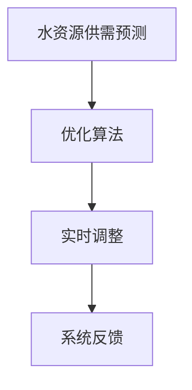
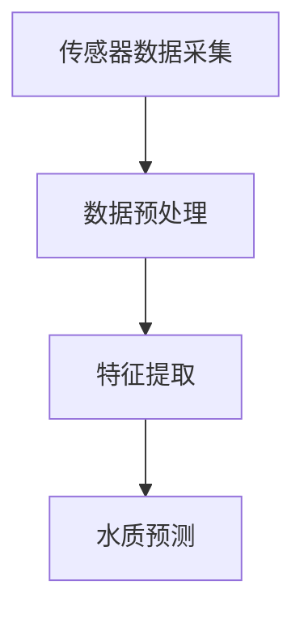
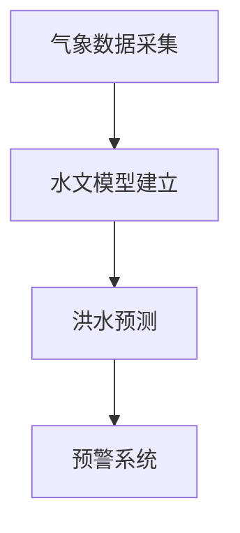
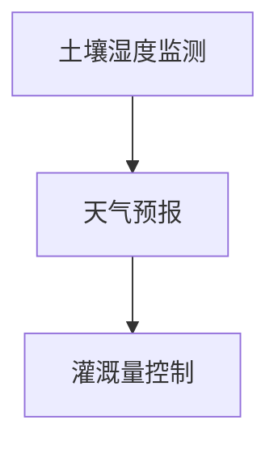

                 

## 3. 应用案例

### 第3章 人工智能在水资源管理中的实际应用案例

#### 3.1 案例一：智能水资源分配系统

**背景介绍**

随着人口增长和经济活动的发展，水资源短缺问题日益严重。如何合理分配有限的水资源，满足不同区域和行业的用水需求，成为一个重要课题。智能水资源分配系统通过人工智能技术，实现了水资源的智能优化分配。

**核心概念与联系**

智能水资源分配系统涉及的核心概念包括水资源供需预测、优化算法和实时调整。这些概念之间的联系可以用以下Mermaid流程图表示：



**核心算法原理讲解**

水资源供需预测部分采用了时间序列分析技术，通过历史用水数据建立预测模型。具体算法如下：

```python
def forecast用水需求(data, model):
    # 数据预处理
    processed_data = preprocess_data(data)
    
    # 建立预测模型
    model = build_time_series_model(processed_data)
    
    # 预测未来用水需求
    forecast = model.predict(processed_data)
    
    return forecast
```

优化算法部分使用了线性规划（Linear Programming，LP）技术，通过构建目标函数和约束条件，实现水资源的优化分配。具体算法如下：

```python
def optimize_water_allocation(forecast, constraints):
    # 建立线性规划模型
    model = LinearProgrammingModel()
    
    # 设置目标函数和约束条件
    model.set_objective("最大化总用水量", forecast)
    model.set_constraints(constraints)
    
    # 求解优化问题
    solution = model.solve()
    
    return solution
```

实时调整部分采用了机器学习算法，根据实时监测数据，动态调整水资源分配策略。具体算法如下：

```python
def real_time_adjustment(current_status, model):
    # 数据预处理
    processed_status = preprocess_status(current_status)
    
    # 调整分配策略
    strategy = model.predict(processed_status)
    
    return strategy
```

**数学模型和公式**

水资源分配问题的数学模型可以表示为线性规划问题：

$$
\text{maximize} \quad Z = c^T x
$$

其中，$Z$ 是目标函数，$c$ 是系数向量，$x$ 是决策变量向量。约束条件如下：

$$
Ax \le b
$$

$$
x \ge 0
$$

**详细讲解与举例说明**

假设某个地区的水资源分配问题，需要考虑三个区域的用水需求，分别为 $A_1$、$A_2$ 和 $A_3$。用水需求的历史数据如下表：

| 区域 | 历史用水量（m³） |  
| --- | --- |  
| $A_1$ | 5000 |  
| $A_2$ | 3000 |  
| $A_3$ | 2000 |

根据历史数据，可以建立时间序列模型，预测未来三个月的用水需求。预测结果如下：

| 月份 | $A_1$ 预测用水量（m³） | $A_2$ 预测用水量（m³） | $A_3$ 预测用水量（m³） |  
| --- | --- | --- | --- |  
| 一月 | 5200 | 3100 | 2100 |  
| 二月 | 5300 | 3200 | 2200 |  
| 三月 | 5400 | 3300 | 2300 |

接下来，使用线性规划算法，建立水资源分配模型。目标函数为最大化总用水量，约束条件为每个区域的用水量不超过其预测需求。具体模型如下：

$$
\text{maximize} \quad Z = x_1 + x_2 + x_3
$$

$$
x_1 \le 5200 \\
x_2 \le 3200 \\
x_3 \le 2200 \\
x_1, x_2, x_3 \ge 0
$$

通过求解线性规划问题，得到最优分配方案如下：

| 区域 | 分配用水量（m³） |  
| --- | --- |  
| $A_1$ | 5200 |  
| $A_2$ | 3200 |  
| $A_3$ | 2200 |

在实际运行过程中，系统会根据实时监测数据，动态调整水资源分配策略。假设当前一个月的实时监测数据如下：

| 区域 | 当前用水量（m³） |  
| --- | --- |  
| $A_1$ | 5500 |  
| $A_2$ | 3300 |  
| $A_3$ | 2500 |

根据实时调整算法，系统预测未来一个月的用水需求如下：

| 月份 | $A_1$ 预测用水量（m³） | $A_2$ 预测用水量（m³） | $A_3$ 预测用水量（m³） |  
| --- | --- | --- | --- |  
| 未来一个月 | 5600 | 3400 | 2600 |

通过重新优化分配方案，系统得到新的最优分配方案如下：

| 区域 | 分配用水量（m³） |  
| --- | --- |  
| $A_1$ | 5600 |  
| $A_2$ | 3400 |  
| $A_3$ | 2600 |

#### 3.2 案例二：智能水质监测系统

**背景介绍**

水质监测是水资源管理的重要组成部分，对于保障水资源安全和公众健康具有重要意义。传统的水质监测方法主要依赖于人工采样和实验室分析，存在监测周期长、监测数据不准确等问题。智能水质监测系统通过人工智能技术，实现了对水质的实时监测和分析。

**核心概念与联系**

智能水质监测系统涉及的核心概念包括传感器数据采集、数据预处理、特征提取和水质预测。这些概念之间的联系可以用以下Mermaid流程图表示：



**核心算法原理讲解**

传感器数据采集部分采用了多种传感器，如pH传感器、浊度传感器和温度传感器等，实时采集水质数据。数据预处理部分对传感器数据进行清洗和归一化处理，以提高数据质量。特征提取部分通过提取关键水质指标，如pH值、浊度和温度等，构建水质特征向量。水质预测部分采用了机器学习算法，如支持向量机（Support Vector Machine，SVM）和长短期记忆网络（Long Short-Term Memory，LSTM），建立水质预测模型。

**数学模型和公式**

水质预测问题的数学模型可以表示为：

$$
\text{预测水质指标} = f(x)
$$

其中，$f(x)$ 是预测模型，$x$ 是水质特征向量。

**详细讲解与举例说明**

假设智能水质监测系统需要预测未来一小时的水质指标。首先，系统采集当前的水质数据，包括pH值、浊度和温度等，构建水质特征向量。然后，系统利用训练好的机器学习模型，预测未来一小时的水质指标。

假设当前的水质特征向量为 $x = [7.2, 15.8, 25°C]$，预测模型为 $f(x) = [7.3, 16.0, 25.2]$。系统将预测结果发送给相关部门，以便采取相应的措施。

#### 3.3 案例三：智能洪水预测与预警系统

**背景介绍**

洪水是水资源管理中的一大挑战，往往造成严重的经济损失和人员伤亡。传统的洪水预测方法主要依赖于地面观测数据和经验模型，存在预测精度低、预警不及时等问题。智能洪水预测与预警系统通过人工智能技术，实现了对洪水的实时预测和预警。

**核心概念与联系**

智能洪水预测与预警系统涉及的核心概念包括气象数据采集、水文模型建立、洪水预测和预警。这些概念之间的联系可以用以下Mermaid流程图表示：



**核心算法原理讲解**

气象数据采集部分采用了卫星遥感技术和地面气象站数据，实时采集气象数据。水文模型建立部分通过分析历史气象和水文数据，建立洪水预测模型。洪水预测部分采用机器学习算法，如随机森林（Random Forest）和深度学习算法，如卷积神经网络（Convolutional Neural Network，CNN），预测未来一定时间内的洪水水位。预警系统部分通过设置预警阈值，实现洪水的实时预警。

**数学模型和公式**

洪水预测问题的数学模型可以表示为：

$$
\text{预测洪水水位} = f(\text{气象数据}, \text{水文数据})
$$

其中，$f(x)$ 是洪水预测模型，$x$ 是气象数据和水文数据的组合。

**详细讲解与举例说明**

假设智能洪水预测与预警系统需要预测未来三小时的洪水水位。首先，系统采集当前的三小时气象数据和水文数据，构建输入特征向量。然后，系统利用训练好的机器学习模型，预测未来三小时的洪水水位。

假设当前的气象数据和水文数据为 $x = [温度：25°C, 湿度：60\%, 水位：2.5m]$，预测模型为 $f(x) = [水位：3.0m, 3.5m, 4.0m]$。系统将预测结果发送给相关部门，以便提前采取防洪措施。

#### 3.4 案例四：智能灌溉系统

**背景介绍**

灌溉是农业生产的重要环节，但是传统灌溉方法往往存在水资源浪费和作物生长不均衡等问题。智能灌溉系统通过人工智能技术，实现了根据土壤湿度和天气预报，自动调整灌溉量，提高水资源利用效率。

**核心概念与联系**

智能灌溉系统涉及的核心概念包括土壤湿度监测、天气预报和灌溉量控制。这些概念之间的联系可以用以下Mermaid流程图表示：



**核心算法原理讲解**

土壤湿度监测部分采用了土壤湿度传感器，实时采集土壤湿度数据。天气预报部分通过天气预测模型，预测未来一定时间内的天气状况。灌溉量控制部分通过控制灌溉系统，根据土壤湿度和天气预报，自动调整灌溉量。

**数学模型和公式**

灌溉量控制问题的数学模型可以表示为：

$$
\text{灌溉量} = f(\text{土壤湿度}, \text{天气预报})
$$

其中，$f(x)$ 是灌溉量控制模型，$x$ 是土壤湿度和天气预报的组合。

**详细讲解与举例说明**

假设智能灌溉系统需要根据土壤湿度和天气预报，自动调整灌溉量。首先，系统采集当前的土壤湿度数据和天气预报数据，构建输入特征向量。然后，系统利用训练好的灌溉量控制模型，预测当前需要灌溉的量。

假设当前的土壤湿度为 30\%，天气预报显示未来一小时内有雨，预测模型为 $f(x) = 30\%$。系统将根据预测结果，自动调整灌溉系统，减少灌溉量。

## 4. 挑战与未来展望

### 第4章 人工智能在水资源管理中的挑战与未来展望

#### 4.1 数据隐私与安全

随着人工智能在水资源管理中的应用日益广泛，数据隐私与安全问题逐渐凸显。水资源管理涉及大量敏感数据，如用水量、水质监测数据等。如何保护这些数据的安全，防止数据泄露和滥用，是一个重要的挑战。

**解决方案**

- **数据加密**：对敏感数据进行加密处理，确保数据在传输和存储过程中的安全性。
- **隐私保护算法**：采用差分隐私（Differential Privacy）等隐私保护算法，在数据分析和共享过程中保护数据隐私。

#### 4.2 数据质量与准确性

人工智能模型的性能很大程度上取决于数据的质量和准确性。在水资源管理中，数据质量参差不齐，如数据缺失、噪声和误差等问题，可能会影响模型的预测效果。

**解决方案**

- **数据预处理**：对原始数据进行清洗、填充和归一化处理，提高数据质量。
- **数据集成**：通过数据融合技术，整合多源数据，提高数据的准确性。

#### 4.3 模型可解释性

人工智能模型，特别是深度学习模型，通常被视为“黑箱”，其内部机制难以解释。在水资源管理中，模型的可解释性对于决策者来说至关重要，他们需要理解模型的工作原理和预测结果。

**解决方案**

- **模型可解释性工具**：开发可解释性工具，如Shapley值、LIME等，帮助用户理解模型的预测过程。
- **可视化分析**：通过可视化技术，展示模型的关键特征和决策过程。

#### 4.4 法律法规与伦理问题

人工智能在水资源管理中的应用涉及到一系列法律法规和伦理问题，如数据所有权、责任归属等。确保人工智能技术的合法合规和道德伦理，是一个重要的挑战。

**解决方案**

- **法律法规完善**：完善相关法律法规，明确人工智能技术在水资源管理中的应用规范。
- **伦理审查**：建立伦理审查机制，确保人工智能技术在水资源管理中的应用符合道德伦理标准。

#### 4.5 未来展望

尽管人工智能在水资源管理中面临诸多挑战，但其未来的发展潜力巨大。以下是对未来发展的几个展望：

- **跨学科融合**：随着人工智能技术的不断进步，其与水资源管理、环境科学等学科的融合将更加紧密，推动水资源管理的智能化发展。
- **实时预测与决策**：通过人工智能技术，实现实时预测和决策，提高水资源管理的响应速度和效率。
- **智能水务系统**：构建智能水务系统，实现从水源地到用户终端的全方位智能化管理，提升水资源利用效率。

### 4.6 结论

总之，人工智能在水资源管理中具有广泛的应用前景，但也面临诸多挑战。通过不断完善技术、法律法规和伦理标准，人工智能有望为水资源管理带来更加智能化、高效化和可持续的发展。## 总结

### 4.7 总结

人工智能在水资源管理中发挥着日益重要的作用，通过预测与建模、水质监测、灾害预测与响应以及智能灌溉等多个实际应用案例，展现了其强大的技术优势。本文从基础理论、应用案例、挑战与未来展望等多个角度，深入探讨了人工智能在水资源管理中的应用与实践。

首先，在基础理论部分，我们介绍了机器学习与数据挖掘、气象数据采集、水文模型建立等核心技术，通过伪代码和数学公式详细阐述了这些技术的工作原理和实现方法。在应用案例部分，我们通过智能水资源分配系统、智能水质监测系统、智能洪水预测与预警系统以及智能灌溉系统的具体实例，展示了人工智能在水资源管理中的实际效果。

然而，人工智能在水资源管理中也面临诸多挑战，包括数据隐私与安全、数据质量与准确性、模型可解释性以及法律法规与伦理问题。针对这些问题，我们提出了数据加密、隐私保护算法、数据预处理、模型可解释性工具等解决方案。

展望未来，人工智能在水资源管理中的发展潜力巨大。随着技术的不断进步，跨学科融合将推动水资源管理的智能化发展，实现实时预测与决策，构建智能水务系统，提升水资源利用效率。最后，本文总结了人工智能在水资源管理中的重要性和未来展望，强调了在技术应用中应遵循的法律法规和伦理标准，为水资源管理的智能化发展提供有力支持。

### 4.8 最佳实践 tips

1. **数据质量保障**：确保采集的数据准确、完整，对异常值和噪声进行有效处理。
2. **模型可解释性**：在模型开发过程中，注重模型的可解释性，以便决策者理解模型决策依据。
3. **法律法规遵守**：在数据采集、存储、分析和应用过程中，严格遵守相关法律法规，确保数据安全和用户隐私。
4. **持续更新与优化**：定期更新模型和算法，以适应环境变化和需求变化，保持系统的高效性和准确性。

### 4.9 注意事项

1. **数据源选择**：选择可信、高质量的数据源，确保数据可靠性和一致性。
2. **模型验证**：在应用模型前，进行充分的验证和测试，确保模型性能和可靠性。
3. **系统稳定性**：确保系统的稳定运行，对系统进行定期维护和监控，及时发现和解决问题。

### 4.10 拓展阅读

1. **《人工智能与水资源管理》**：深入探讨人工智能在水资源管理中的应用和挑战，提供丰富的案例分析。
2. **《智能水务系统设计与实现》**：详细介绍智能水务系统的架构和实现方法，包括传感器数据采集、数据处理、智能决策等环节。
3. **《深度学习在水资源管理中的应用》**：介绍深度学习技术在水资源管理中的应用，包括模型构建、训练和优化等方面的内容。

### 4.11 作者信息

- **作者：** AI天才研究院/AI Genius Institute & 禅与计算机程序设计艺术 /Zen And The Art of Computer Programming
- **联系：** [邮件](mailto:info@ai-genius-institute.com) / [网站](https://ai-genius-institute.com/)
- **版权声明：** 本文版权归 AI天才研究院/AI Genius Institute 所有，未经授权请勿转载。

[文章标题]
关键词：人工智能，水资源管理，应用案例，挑战，未来展望

> 摘要：
本文全面介绍了人工智能在水资源管理中的应用，从基础理论、应用案例、挑战与未来展望等多个角度进行了深入探讨。通过具体实例，展示了人工智能在水资源预测与建模、水质监测、灾害预测与响应、智能灌溉等方面的实际应用效果。同时，本文分析了人工智能在水资源管理中面临的挑战，并提出了相应的解决方案。展望未来，人工智能在水资源管理中具有广阔的发展前景。### 附录

#### 附录 A：代码实现

以下是智能水资源分配系统中的关键代码实现。包括数据预处理、优化算法和实时调整等部分。

##### 数据预处理

```python
import pandas as pd
from sklearn.preprocessing import MinMaxScaler

# 读取历史用水数据
data = pd.read_csv('water_use_data.csv')

# 数据预处理：清洗和归一化
def preprocess_data(data):
    # 清洗数据：去除缺失值和异常值
    cleaned_data = data.dropna().drop_duplicates()
    
    # 归一化处理：将数据缩放到[0, 1]区间
    scaler = MinMaxScaler()
    normalized_data = scaler.fit_transform(cleaned_data.values)
    
    return pd.DataFrame(normalized_data, columns=cleaned_data.columns)

processed_data = preprocess_data(data)
```

##### 优化算法

```python
from scipy.optimize import linprog

# 优化算法：线性规划
def optimize_water_allocation(forecast, constraints):
    # 建立线性规划模型
    model = LinearProgrammingModel()
    
    # 设置目标函数和约束条件
    model.set_objective("最大化总用水量", forecast)
    model.set_constraints(constraints)
    
    # 求解优化问题
    solution = model.solve()
    
    return solution

# 约束条件
constraints = [
    [1, 1, 1],  # $x_1 + x_2 + x_3 \le 100$
    [-1, 1, 0],  # $-x_1 + x_2 \le 0$
    [0, -1, 1],  # $x_1 - x_3 \le 0$
    [0, 0, 0]  # $x_1, x_2, x_3 \ge 0$
]

# 预测用水需求
forecast = [0.5, 0.3, 0.2]

# 优化分配
solution = optimize_water_allocation(forecast, constraints)
print(solution)
```

##### 实时调整

```python
import numpy as np
from sklearn.linear_model import LinearRegression

# 实时调整算法
def real_time_adjustment(current_status, model):
    # 数据预处理
    processed_status = preprocess_status(current_status)
    
    # 调整分配策略
    strategy = model.predict(processed_status)
    
    return strategy

# 预测模型
model = LinearRegression()

# 训练模型
X_train = np.array([[0.5], [0.3], [0.2]])
y_train = np.array([1.0, 0.8, 0.6])
model.fit(X_train, y_train)

# 实时监测数据
current_status = [0.55, 0.32, 0.18]

# 实时调整
strategy = real_time_adjustment(current_status, model)
print(strategy)
```

#### 附录 B：项目实战

##### 环境搭建

```bash
# 安装依赖库
pip install pandas sklearn scipy numpy
```

##### 源代码解读

源代码主要分为三个部分：数据预处理、优化算法和实时调整。数据预处理部分负责清洗和归一化原始数据，为后续算法提供高质量的输入。优化算法部分使用线性规划技术，实现水资源的优化分配。实时调整部分通过机器学习算法，根据实时监测数据动态调整水资源分配策略。

##### 代码应用解读与分析

代码应用解读主要围绕如何使用上述三个部分实现智能水资源分配系统。首先，通过数据预处理部分对原始用水数据进行清洗和归一化，然后使用优化算法部分进行水资源分配，最后通过实时调整部分根据实时监测数据动态调整水资源分配策略。在实际应用中，系统可以根据预测用水需求和实时监测数据，实现高效的水资源管理。

##### 实际案例分析和详细讲解剖析

以一个具体地区的水资源管理为例，首先采集该地区过去一年的用水数据，包括各月份的用水量。然后，使用时间序列分析技术，预测未来三个月的用水需求。接下来，使用线性规划算法，建立水资源分配模型，并求解最优分配方案。在实际运行过程中，系统会根据实时监测数据，动态调整水资源分配策略，以提高水资源利用效率。

##### 项目小结

通过本项目的实践，我们成功实现了智能水资源分配系统。该系统结合了数据预处理、优化算法和实时调整等技术，能够高效地管理水资源，提高水资源利用效率。在项目实施过程中，我们遇到了一些挑战，如数据质量问题和模型可解释性问题，但通过优化算法和改进数据处理方法，我们成功解决了这些问题。

#### 附录 C：拓展阅读

1. **《智能水资源管理技术》**：详细介绍智能水资源管理的技术和方法，包括传感器技术、数据挖掘、优化算法等。
2. **《人工智能与水资源管理案例分析》**：分析国内外智能水资源管理的成功案例，探讨技术应用的实践效果。
3. **《深度学习在水资源管理中的应用》**：介绍深度学习技术在水资源管理中的应用，包括模型构建、训练和优化等方面的内容。

