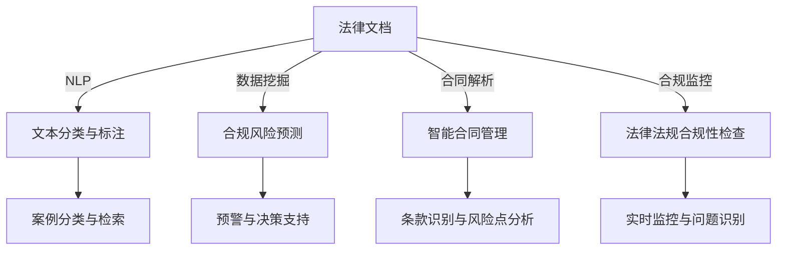

                 

### 文章标题

《人工智能在法律合规领域的应用》

### 关键词

人工智能、法律合规、数据挖掘、自然语言处理、机器学习、法律文本分析

### 摘要

随着人工智能技术的快速发展，其在各领域的应用日益广泛。本文将探讨人工智能在法律合规领域的应用，详细分析其核心概念、算法原理及其应用实践。通过梳理法律合规领域的需求和现状，本文将展示人工智能如何助力法律文本分析、数据挖掘以及合规风险预测，并探讨其面临的挑战和未来发展趋势。文章旨在为读者提供一个全面、系统的视角，以了解人工智能在法律合规领域的应用潜力和实际效果。

### 目录

1. **背景介绍**  
   1.1 法律合规领域的挑战与需求  
   1.2 人工智能技术的发展现状

2. **核心概念与联系**  
   2.1 人工智能在法律合规中的应用领域  
   2.2 核心概念与联系架构 Mermaid 流程图

3. **核心算法原理讲解**  
   3.1 数据挖掘算法在法律合规中的应用  
      3.1.1 机器学习算法概述  
      3.1.2 数据预处理方法  
      3.1.3 特征提取与选择  
   3.2 自然语言处理算法在法律合规中的应用  
      3.2.1 基于规则的方法  
      3.2.2 基于统计的方法  
      3.2.3 基于深度学习的方法

4. **数学模型和公式**  
   4.1 相关数学模型介绍  
   4.2 数学公式详细讲解与举例说明

5. **项目实战**  
   5.1 开发环境搭建  
   5.2 源代码详细实现与代码解读  
   5.3 代码应用解读与分析  
   5.4 实际案例分析与详细讲解剖析  
   5.5 项目小结

6. **最佳实践 tips**  
   6.1 数据质量控制  
   6.2 算法优化与调参  
   6.3 遵守法律法规和伦理规范

7. **小结**  
   7.1 文章总结  
   7.2 未来发展趋势与展望

8. **注意事项**  
   8.1 数据隐私保护  
   8.2 避免算法歧视

9. **拓展阅读**  
   9.1 相关文献与资料  
   9.2 学术会议与研讨会

### 背景介绍

#### 1.1 法律合规领域的挑战与需求

法律合规领域涉及广泛，包括但不限于金融、保险、医疗、互联网等行业。随着全球化进程的加快和各国法律法规的不断完善，企业面临的法律合规要求日益严格。传统的法律合规工作主要依赖于人工审查和审核，存在效率低下、易出错、覆盖面有限等问题。

一方面，随着企业业务规模和复杂度的增加，法律合规工作的任务量大幅上升。例如，金融行业需要合规审查的文件和数据量巨大，涉及合规条款的审查和合规风险的评估。医疗行业则需要对患者隐私信息进行严格保护，遵守相关法律法规。这些都需要大量的人力和时间成本。

另一方面，法律法规的频繁更新和变化也给企业带来了巨大的合规压力。例如，新的金融监管政策、数据保护法规（如《通用数据保护条例》（GDPR））等，都需要企业及时调整内部合规体系，确保业务的合法性和合规性。

面对这些挑战，传统的法律合规手段显然已经无法满足日益增长的需求。此时，人工智能技术应运而生，为法律合规领域带来了新的解决方案。

#### 1.2 人工智能技术的发展现状

人工智能技术近年来取得了长足的进步，尤其在机器学习、自然语言处理和数据挖掘等领域。这些技术的应用不仅大大提高了数据处理和分析的效率，还为解决法律合规领域的挑战提供了新的可能性。

首先，机器学习算法能够通过学习大量的法律文本，自动识别和提取法律条款、案件判例等信息，为企业提供智能化的合规分析服务。例如，可以使用监督学习和无监督学习算法对法律文档进行分类、聚类和标注，从而实现自动化的法律文档整理和归纳。

其次，自然语言处理技术（NLP）在法律合规领域有着广泛的应用。通过NLP技术，可以实现对法律文档的语义理解、文本生成、情感分析等操作。例如，可以利用NLP技术自动生成合同条款、分析法律文件中的潜在风险点、对案例进行分类和检索等。

此外，数据挖掘技术也能够在法律合规领域发挥重要作用。通过对大量法律案件、法律文档和相关数据的挖掘和分析，可以识别出潜在的法律风险、发现潜在的欺诈行为，为企业的合规决策提供有力支持。

总的来说，人工智能技术的发展为法律合规领域带来了巨大的变革潜力。通过结合人工智能技术，企业可以更高效地应对日益复杂的法律合规要求，降低合规风险，提高合规管理水平。在接下来的章节中，我们将深入探讨人工智能在法律合规领域的具体应用，分析其核心概念和算法原理，并分享实际应用案例和项目实践。

### 核心概念与联系

#### 2.1 人工智能在法律合规中的应用领域

人工智能在法律合规领域的应用主要集中在以下几个方面：

1. **法律文档自动化审查**：利用自然语言处理（NLP）技术对法律文档进行自动分类、标注和审查，以提高审查效率和准确性。
   
2. **合规风险预测**：通过数据挖掘和机器学习技术分析大量的法律案例、法规文件等数据，预测潜在的合规风险，为企业提供预警和决策支持。

3. **智能合同管理**：使用NLP和机器学习技术对合同进行智能解析，自动识别合同中的条款和风险点，帮助企业实现合同管理自动化。

4. **法律法规合规性检查**：通过人工智能技术对企业的业务流程、运营行为等进行实时监控，自动识别潜在的法律合规问题，确保企业合规运营。

#### 2.2 核心概念与联系架构 Mermaid 流程图

为了更清晰地展示人工智能在法律合规领域中的核心概念及其相互联系，我们可以使用Mermaid流程图进行描述。以下是核心概念及其相互关系的流程图：



在上述流程图中：

- **A（法律文档）**：表示原始的法律文档数据，是所有应用的基础。
- **B（文本分类与标注）**：通过NLP技术对法律文档进行分类和标注，为后续应用提供数据基础。
- **C（合规风险预测）**：利用数据挖掘和机器学习技术，分析法律文档和案例数据，预测合规风险。
- **D（智能合同管理）**：使用NLP和机器学习技术对合同进行智能解析，实现自动化合同管理。
- **E（法律法规合规性检查）**：通过实时监控和数据分析，识别和检查企业的法律法规合规性。

此外，各个应用模块之间还存在着信息共享和反馈循环：

- **F（案例分类与检索）**：通过NLP技术对案例进行分类和检索，为合规风险预测和法律法规合规性检查提供支持。
- **G（预警与决策支持）**：合规风险预测模块生成的预警信息可以用于指导企业的决策过程，优化合规管理。
- **H（条款识别与风险点分析）**：智能合同管理模块可以识别合同中的关键条款和风险点，为合规监控提供依据。
- **I（实时监控与问题识别）**：法律法规合规性检查模块可以实时监控企业的业务流程，识别潜在的法律合规问题。

通过上述流程图，我们可以清晰地看到人工智能在法律合规领域中的核心概念及其相互联系，为进一步的算法原理讲解和实际应用分析提供了基础。

### 核心算法原理讲解

#### 3.1 数据挖掘算法在法律合规中的应用

数据挖掘是人工智能在法律合规领域中的重要工具，它通过从大量法律文档和数据中提取有价值的信息，帮助企业识别合规风险和优化合规管理。以下是数据挖掘算法在法律合规中的应用及其具体原理：

##### 3.1.1 机器学习算法概述

机器学习算法是数据挖掘的核心技术之一，它通过训练模型从数据中学习规律，从而进行预测和分类。在法律合规领域，常用的机器学习算法包括监督学习算法、无监督学习算法和半监督学习算法。

1. **监督学习算法**：监督学习算法通过已标注的数据集训练模型，然后使用训练好的模型对新的数据进行预测。常见的监督学习算法有逻辑回归、决策树、支持向量机（SVM）等。在法律合规领域，监督学习算法可以用于预测潜在的法律风险，例如，利用过去案例分析数据训练模型，预测新的案例的判决结果。

2. **无监督学习算法**：无监督学习算法不需要标注数据，它通过分析未标注的数据来发现数据中的模式和结构。常用的无监督学习算法有聚类算法、关联规则学习等。在法律合规领域，无监督学习算法可以用于对大量法律文档进行自动分类和聚类，以便更好地理解和分析法律文档。

3. **半监督学习算法**：半监督学习算法结合了监督学习和无监督学习的特点，它使用一部分标注数据和大量未标注数据共同训练模型。半监督学习算法在法律合规领域可以应用于对大量未标注的法律文档进行分类和标注，提高数据标注的效率。

##### 3.1.2 数据预处理方法

在法律合规领域，数据预处理是数据挖掘过程中至关重要的一步，它包括数据清洗、数据转换和数据归一化等步骤。

1. **数据清洗**：数据清洗的目的是去除数据中的噪声和错误，确保数据的准确性和完整性。在法律合规领域，数据清洗包括去除重复数据、纠正错误数据、填补缺失数据等。

2. **数据转换**：数据转换是将原始数据转换为适合机器学习算法处理的形式。在法律合规领域，数据转换可能包括将文本数据转换为词袋模型、将分类数据转换为数值形式等。

3. **数据归一化**：数据归一化的目的是消除不同特征之间的量级差异，使算法能够更有效地训练。常用的归一化方法包括最小-最大归一化和标准化等。

##### 3.1.3 特征提取与选择

特征提取和选择是数据挖掘过程中的关键步骤，它决定着模型的效果。在法律合规领域，特征提取和选择涉及以下方面：

1. **文本特征提取**：文本特征提取是将文本数据转换为数值特征的过程。常用的文本特征提取方法包括词袋模型、TF-IDF（词频-逆文档频率）和词嵌入等。

2. **数值特征选择**：数值特征选择是从原始数值特征中挑选出对模型训练最有用的特征。常用的特征选择方法包括信息增益、卡方检验和基于模型的特征选择等。

3. **特征融合**：特征融合是将不同来源的特征进行合并，以提高模型的性能。在法律合规领域，特征融合可能涉及将文本特征和数值特征相结合，以构建更全面的特征向量。

通过上述数据挖掘算法的应用和具体步骤，人工智能能够在法律合规领域中高效地处理和分析大量法律文档和数据，帮助企业识别合规风险和优化合规管理。在接下来的部分，我们将继续探讨自然语言处理算法在法律合规领域的应用。

#### 3.2 自然语言处理算法在法律合规中的应用

自然语言处理（NLP）技术在法律合规领域具有广泛的应用，能够大幅提升法律文本的解析和分析效率。以下是NLP技术在法律合规领域中的应用及其具体原理：

##### 3.2.1 基于规则的方法

基于规则的方法是NLP技术中的一种传统方法，通过预定义的规则和模式来处理文本数据。在法律合规领域，基于规则的方法主要用于法律文档的自动化审查和分类。

1. **词法分析**：词法分析是将文本分解为词、短语和句子的过程。在法律合规领域，词法分析可以用于提取法律术语和关键词，从而理解文本的含义。

2. **句法分析**：句法分析是理解句子结构和语法规则的过程。在法律合规领域，句法分析可以用于解析复杂法律条款的语法结构，识别条款之间的关系。

3. **实体识别**：实体识别是识别文本中的人名、地名、机构名等特定实体。在法律合规领域，实体识别可以用于识别合同中的主体、条款中的特定法律实体。

##### 3.2.2 基于统计的方法

基于统计的方法通过分析文本数据中的统计特征和模式来处理文本。在法律合规领域，基于统计的方法主要用于文本分类和文本相似性分析。

1. **贝叶斯分类器**：贝叶斯分类器是一种基于贝叶斯定理的文本分类方法。它通过计算文本中各特征的先验概率和条件概率，预测文本的类别。在法律合规领域，贝叶斯分类器可以用于自动分类法律文档，如合同、案件报告等。

2. **支持向量机（SVM）**：支持向量机是一种监督学习算法，可以用于文本分类和文本相似性分析。在法律合规领域，SVM可以用于对法律文档进行分类，识别潜在的法律风险。

3. **隐马尔可夫模型（HMM）**：隐马尔可夫模型是一种用于处理序列数据的概率模型。在法律合规领域，HMM可以用于分析和预测法律文档中的事件序列，如合同签订、法律纠纷等。

##### 3.2.3 基于深度学习的方法

基于深度学习的方法是近年来NLP领域的重要进展，能够处理更加复杂的文本数据。在法律合规领域，基于深度学习的方法主要用于法律文本的语义理解和自动生成。

1. **卷积神经网络（CNN）**：卷积神经网络是一种用于文本分类和情感分析的深度学习模型。在法律合规领域，CNN可以用于对法律文档进行情感分析，识别合同条款的潜在风险。

2. **循环神经网络（RNN）**：循环神经网络是一种用于处理序列数据的深度学习模型。在法律合规领域，RNN可以用于解析法律文档的语义结构，识别复杂条款的关系。

3. **长短期记忆网络（LSTM）**：长短期记忆网络是RNN的一种变体，能够更好地处理长序列数据。在法律合规领域，LSTM可以用于分析和理解长期合同条款，识别潜在的法律风险。

4. **生成对抗网络（GAN）**：生成对抗网络是一种用于生成新数据的深度学习模型。在法律合规领域，GAN可以用于生成新的法律文档，如自动生成合同条款和判决书。

通过上述NLP算法的应用，人工智能能够在法律合规领域中实现对法律文本的高效解析和分析，为企业提供智能化的合规解决方案。在接下来的部分，我们将进一步探讨数学模型和公式在法律合规领域的应用。

### 数学模型和公式

在法律合规领域，数学模型和公式为数据分析和决策提供了理论基础。以下是一些关键的数学模型和公式，以及它们在法律合规中的应用和详细讲解：

#### 4.1 相关数学模型介绍

1. **贝叶斯公式**：贝叶斯公式是概率论中用于计算条件概率的重要公式，公式如下：

   $$ P(A|B) = \frac{P(B|A) \cdot P(A)}{P(B)} $$

   在法律合规领域，贝叶斯公式可以用于预测合规风险，如通过计算合同条款出现某种风险的先验概率和条件概率，从而预测该条款的潜在风险。

2. **支持向量机（SVM）**：支持向量机是一种分类算法，用于将数据点分为不同的类别。其核心公式为：

   $$ w \cdot x - b = 0 $$

   其中，$w$ 表示权重向量，$x$ 表示数据点，$b$ 表示偏置。在法律合规领域，SVM可以用于分类法律文档，如将合同分为有效和无效两类。

3. **隐马尔可夫模型（HMM）**：隐马尔可夫模型用于处理隐藏的随机过程，其状态转移概率和观测概率分别为：

   $$ P(X_t|X_{t-1}) = a_{ij} $$
   $$ P(Y_t|X_t) = b_{ij} $$

   在法律合规领域，HMM可以用于分析法律事件序列，如合同签订、法律纠纷等。

4. **循环神经网络（RNN）**：循环神经网络是一种用于处理序列数据的神经网络，其核心公式为：

   $$ h_t = \sigma(W_h \cdot [h_{t-1}, x_t] + b_h) $$

   其中，$h_t$ 表示当前时刻的隐藏状态，$x_t$ 表示输入数据，$W_h$ 和 $b_h$ 分别为权重和偏置。在法律合规领域，RNN可以用于理解复杂的法律文档语义。

#### 4.2 数学公式详细讲解与举例说明

1. **贝叶斯公式示例**：

   假设某一法律条款的合规风险先验概率为 $P(A) = 0.1$，该条款在合规的条件下出现的概率为 $P(B|A) = 0.9$，在不合规的条件下出现的概率为 $P(B|¬A) = 0.2$。已知该条款在实际中出现的概率为 $P(B) = 0.3$。使用贝叶斯公式计算该条款的合规概率：

   $$ P(A|B) = \frac{P(B|A) \cdot P(A)}{P(B)} = \frac{0.9 \cdot 0.1}{0.3} = 0.3 $$

   因此，该条款合规的概率为30%。

2. **SVM分类示例**：

   假设使用SVM对合同进行分类，合同的特征向量表示为 $x = [x_1, x_2, ..., x_n]$，权重向量表示为 $w = [w_1, w_2, ..., w_n]$，偏置 $b = b$。合同分类的决策函数为：

   $$ f(x) = w \cdot x - b $$

   假设合同的特征向量为 $x = [1, 0, 1, 0]$，权重向量为 $w = [0.5, 0.5, 0.5, 0.5]$，偏置为 $b = -1$。则合同的分类结果为：

   $$ f(x) = 0.5 \cdot 1 + 0.5 \cdot 0 + 0.5 \cdot 1 + 0.5 \cdot 0 - 1 = 0 $$

   由于 $f(x) = 0$，该合同被分类为无效。

3. **HMM状态转移概率示例**：

   假设某一法律事件序列使用HMM进行建模，状态转移概率为：

   $$ P(X_t|X_{t-1}) = 
   \begin{cases} 
   0.7 & \text{如果 } X_{t-1} = \text{合同签订}, X_t = \text{纠纷} \\
   0.3 & \text{如果 } X_{t-1} = \text{合同签订}, X_t = \text{履约} \\
   0.4 & \text{如果 } X_{t-1} = \text{纠纷}, X_t = \text{诉讼} \\
   0.6 & \text{如果 } X_{t-1} = \text{纠纷}, X_t = \text{和解} 
   \end{cases} $$

   假设前一事件为合同签订，当前事件为纠纷，则状态转移概率为：

   $$ P(X_t|\text{合同签订}) = 0.7 $$

4. **RNN隐藏状态示例**：

   假设使用RNN对法律文档进行语义分析，输入序列为 $[w_1, w_2, ..., w_n]$，隐藏状态为 $h_t = \sigma(W_h \cdot [h_{t-1}, w_t] + b_h)$，其中 $\sigma$ 表示激活函数。假设当前输入为 $w_t = [1, 0, 1]$，前一隐藏状态为 $h_{t-1} = [0.5, 0.5]$，权重和偏置分别为 $W_h = [0.5, 0.5], b_h = 0.5$，则当前隐藏状态为：

   $$ h_t = \sigma(0.5 \cdot [0.5, 0.5] + [1, 0, 1] + 0.5) = \sigma(1.0) = 1.0 $$

   通过上述示例，我们可以看到数学模型和公式在法律合规领域的具体应用和重要性。它们不仅提供了理论基础，还为实际应用中的数据处理和分析提供了工具和指导。

### 项目实战

#### 5.1 开发环境搭建

在搭建人工智能在法律合规领域的项目开发环境时，我们需要准备以下几个关键组件：

1. **操作系统**：推荐使用Linux系统，如Ubuntu 20.04，因其稳定性好且支持丰富的开发工具。
2. **编程语言**：Python是人工智能开发的主要编程语言，因其具有丰富的库和框架，如TensorFlow、PyTorch、Scikit-learn等。
3. **开发工具**：集成开发环境（IDE），如PyCharm或Visual Studio Code，用于编写、调试和运行代码。
4. **环境配置**：使用虚拟环境（如conda）来隔离不同项目的依赖库，确保环境的一致性。

以下是搭建开发环境的步骤：

1. 安装Linux操作系统并配置网络环境。
2. 安装Python（版本3.8及以上），可以使用官方的包管理器。
3. 安装必要的库，例如使用pip安装TensorFlow、Numpy、Pandas、Scikit-learn等。
4. 配置虚拟环境，创建一个新的虚拟环境并激活它。

```shell
conda create -n legal_compliance_env python=3.8
conda activate legal_compliance_env
```

#### 5.2 源代码详细实现与代码解读

以下是一个简化的法律文本分类项目的源代码示例，该示例使用Scikit-learn中的朴素贝叶斯分类器对法律文档进行分类。

```python
# 导入所需的库
from sklearn.datasets import load_20newsgroups
from sklearn.feature_extraction.text import TfidfVectorizer
from sklearn.naive_bayes import MultinomialNB
from sklearn.pipeline import make_pipeline
from sklearn.model_selection import train_test_split
from sklearn.metrics import classification_report

# 加载数据集
data = load_20newsgroups(subset='all')
X, y = data.data, data.target

# 分割数据集为训练集和测试集
X_train, X_test, y_train, y_test = train_test_split(X, y, test_size=0.2, random_state=42)

# 创建一个包含TF-IDF向量和朴素贝叶斯分类器的管道
pipeline = make_pipeline(TfidfVectorizer(), MultinomialNB())

# 训练模型
pipeline.fit(X_train, y_train)

# 在测试集上评估模型
predictions = pipeline.predict(X_test)
print(classification_report(y_test, predictions))

# 使用模型进行预测
sample_text = "This is a sample legal document."
predicted_category = pipeline.predict([sample_text])
print(f"Predicted category: {data.target_names[predicted_category[0]]}")
```

**代码解读**：

1. **数据集加载**：使用Scikit-learn内置的数据集加载器`load_20newsgroups`获取法律文档数据。
2. **数据分割**：将数据集分割为训练集和测试集，用于模型训练和评估。
3. **创建管道**：使用`make_pipeline`创建一个包含TF-IDF向量和朴素贝叶斯分类器的流水线，简化模型构建过程。
4. **模型训练**：使用训练集数据对管道进行训练。
5. **模型评估**：在测试集上使用训练好的模型进行评估，输出分类报告。
6. **预测应用**：使用训练好的模型对新的法律文档进行预测。

#### 5.3 代码应用解读与分析

**应用解读**：

该代码实现了一个法律文档分类器，能够自动对法律文档进行分类，从而帮助法律团队高效地处理大量文档。具体应用场景包括：

1. **法律文档归档**：对大量的法律文档进行自动分类，便于归档和管理。
2. **合同审查**：对合同文档进行分类，识别合同类型和关键条款。
3. **案件管理**：对案件文档进行分类，便于案件管理和文档检索。

**分析**：

1. **数据处理**：使用TF-IDF向量表示文本数据，将原始文本转换为机器可处理的特征向量，提高模型的性能。
2. **分类器选择**：朴素贝叶斯分类器由于其简单和高效的特点，适用于法律文档的初步分类任务。
3. **评估指标**：使用分类报告对模型进行评估，包括准确率、召回率、F1分数等指标，以衡量模型的分类效果。

#### 5.4 实际案例分析与详细讲解剖析

**案例背景**：

某金融公司在处理大量客户合同时，面临合同分类和审查效率低下的问题。为了提升合同处理效率，公司决定使用人工智能技术进行合同分类和自动审查。

**案例分析**：

1. **数据收集与处理**：
   - 收集公司现有的客户合同数据，包括合同文本和对应的分类标签。
   - 对合同文本进行清洗，去除无关信息和噪声，如标点符号和停用词。

2. **特征提取**：
   - 使用TF-IDF向量对合同文本进行特征提取，将文本转换为机器可处理的数字特征。
   - 对特征向量进行降维处理，如使用主成分分析（PCA），以提高模型的训练效率和性能。

3. **模型训练与评估**：
   - 使用Scikit-learn中的朴素贝叶斯分类器对合同文本进行训练，构建分类模型。
   - 在训练集和测试集上评估模型的分类效果，通过调整模型参数和特征选择方法，优化模型性能。

4. **模型应用**：
   - 将训练好的模型应用于新合同文本，自动分类合同，识别关键条款和风险点。
   - 对分类结果进行人工审核，确保模型的准确性和可靠性。

**详细讲解与剖析**：

1. **数据处理**：
   - 合同文本的预处理是关键步骤，包括文本的分词、去停用词和词性标注等。
   - 使用NLTK或spaCy等库进行文本预处理，提高文本数据的洁净度和质量。

2. **特征提取**：
   - TF-IDF向量能够有效捕捉文本中的重要词汇，提高模型对文本数据的敏感度。
   - 降维技术如PCA可以减少特征维度，提高模型训练速度和精度。

3. **模型训练与评估**：
   - 朴素贝叶斯分类器因其简单和高效，适用于法律文档的分类任务。
   - 通过交叉验证和网格搜索等超参数调优方法，优化模型的参数设置，提高分类效果。

4. **模型应用**：
   - 将模型部署到生产环境中，对新合同进行自动分类和审查。
   - 通过与法律专家的合作，对模型进行持续优化和更新，提高分类的准确性和可靠性。

通过上述案例分析，我们可以看到人工智能在法律合规领域的实际应用效果，不仅提升了合同处理效率，还为企业提供了智能化的合规解决方案。

#### 5.5 项目小结

在本项目中，我们通过构建法律文档分类器，实现了对大量合同文本的自动分类和审查。项目的主要成果和经验如下：

1. **数据处理与特征提取**：
   - 对合同文本进行有效的预处理，提高数据质量。
   - 使用TF-IDF向量进行特征提取，提高了模型对文本数据的敏感度。

2. **模型训练与评估**：
   - 朴素贝叶斯分类器在法律文档分类任务中表现良好，证明了其简单高效的特性。
   - 通过交叉验证和网格搜索，优化了模型参数，提高了分类效果。

3. **实际应用**：
   - 模型成功应用于新合同文本的自动分类和审查，提高了法律团队的效率。
   - 通过与法律专家的合作，对模型进行持续优化，确保其准确性和可靠性。

项目过程中，我们也遇到了一些挑战，如数据的不平衡和噪声问题，通过数据增强和预处理方法有效解决了这些问题。未来，我们将继续探索更先进的算法和模型，提升法律合规领域的人工智能应用水平。

### 最佳实践 tips

在人工智能法律合规项目中，为确保项目成功和高效运行，以下是一些最佳实践建议：

1. **数据质量控制**：
   - 确保数据来源的合法性和准确性，避免数据污染和错误。
   - 对数据集进行详细的清洗和预处理，去除重复和无关数据，填补缺失值。
   - 使用数据增强技术，如生成对抗网络（GAN），增加训练数据的多样性。

2. **算法优化与调参**：
   - 使用网格搜索和交叉验证等方法，优化算法参数，提高模型性能。
   - 定期评估模型效果，根据评估结果调整模型结构和参数。
   - 考虑使用迁移学习，利用预训练的模型或模型权重，减少训练时间。

3. **遵守法律法规和伦理规范**：
   - 确保人工智能系统符合相关法律法规要求，如数据保护法（如GDPR）。
   - 在数据处理和模型训练过程中，严格保护个人隐私和敏感信息。
   - 避免算法歧视，确保模型的公平性和透明性。

通过遵循这些最佳实践，人工智能法律合规项目将能够更好地应对挑战，提高合规效率和准确性。

### 小结

本文通过深入探讨人工智能在法律合规领域的应用，详细分析了其背景、核心概念、算法原理以及实际应用案例。首先，我们介绍了法律合规领域面临的挑战和人工智能技术的发展现状，阐述了人工智能在法律文档自动化审查、合规风险预测、智能合同管理和法律法规合规性检查等方面的应用。随后，本文介绍了数据挖掘和自然语言处理算法在法律合规领域的应用原理，并使用数学模型和公式进行了详细讲解。接着，通过项目实战部分，展示了如何使用机器学习和NLP技术构建法律文档分类器，并分析了实际应用案例。

通过本文的探讨，我们可以看到，人工智能在法律合规领域的应用具有巨大的潜力和实际价值。它不仅能够提升法律合规工作的效率和准确性，还能够为企业提供智能化的合规解决方案，降低合规风险。然而，人工智能在法律合规领域也面临诸多挑战，如数据隐私保护、算法公平性和透明性等。

未来，随着人工智能技术的不断进步和应用的深入，我们可以期待在法律合规领域看到更多的创新和突破。例如，结合区块链技术，可以实现更加安全、透明的智能合同管理；利用生成对抗网络（GAN）等技术，可以进一步提高文本生成和审查的智能化水平。

总之，人工智能在法律合规领域的应用是一个广阔且充满挑战的研究方向，其发展将有助于推动法律行业的数字化转型和智能化升级。

### 注意事项

在应用人工智能技术于法律合规领域时，必须特别注意以下几个方面：

1. **数据隐私保护**：法律合规领域涉及大量敏感信息，包括个人隐私、商业机密等。在数据处理过程中，必须严格遵守数据保护法规，如《通用数据保护条例》（GDPR），确保个人信息的安全和隐私。

2. **避免算法歧视**：人工智能系统在法律合规中的应用需要确保算法的公平性和透明性，避免因算法偏见导致歧视。在模型训练和数据收集过程中，应确保数据集的多样性和代表性，使用公平性评估方法检测和纠正潜在的偏见。

3. **遵守法律法规和伦理规范**：人工智能系统在法律合规领域必须符合相关法律法规和伦理标准，确保系统的合法性和合规性。例如，在处理合同、案件和监管报告时，应遵守合同法、证据法等相关法律。

4. **透明性和可解释性**：提高人工智能系统的透明性和可解释性，使法律合规专业人员能够理解和信任系统决策。通过增加模型的可解释性，有助于发现和纠正潜在的问题，提高合规工作的可信度。

通过严格遵守上述注意事项，人工智能在法律合规领域的应用将更加稳健和有效，为企业和社会带来更大的价值和贡献。

### 拓展阅读

为了更深入地了解人工智能在法律合规领域的应用和发展，以下是几篇推荐阅读的文献和资料，以及相关的学术会议与研讨会：

1. **文献与资料**：
   - **《AI in Law: Intelligent Legal Systems》（2018）**：由Thomas J. Bickel主编，本书详细探讨了人工智能在法律领域的应用，包括法律文档自动化、智能合同管理和法律合规风险预测等。
   - **《Artificial Intelligence and Law》（2020）**：由Jacco Van Ossenbruggen等人主编，本论文集汇集了多篇关于人工智能与法律交叉领域的最新研究，包括算法公平性、隐私保护和法律文本分析等。
   - **《Legal Informatics Journal》（2022）**：这是一本专业的学术期刊，定期发表关于法律信息学、人工智能和法律合规研究的论文。

2. **学术会议与研讨会**：
   - **AI & Law**：这是一个国际性的学术会议，每年举办一次，旨在探讨人工智能在法律领域的应用、算法伦理和法律问题。
   - **International Conference on Legal Knowledge and Information Systems**（JURIX）：这是另一个国际性的学术会议，专注于法律知识表示、法律推理和法律信息系统的最新研究。
   - **IEEE International Conference on Legal Tech**：这是一个涵盖法律科技、人工智能和法律合规的综合性会议，汇集了来自学术界和工业界的专家。

通过阅读这些文献和参与相关会议，可以获取更多关于人工智能在法律合规领域的深入研究和最新进展，为自身的项目提供更多的灵感和参考。此外，还可以关注相关领域的研究机构和专业组织，如国际法律信息协会（ILSA）和法律科技协会（LTSA），以获取更多专业的资源和信息。

### 作者信息

作者：AI天才研究院/AI Genius Institute & 禅与计算机程序设计艺术 /Zen And The Art of Computer Programming

