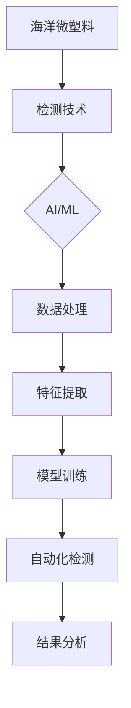
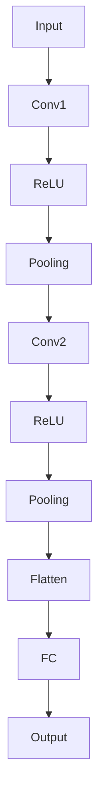

                 

首先，我们要明确本文的核心内容。本文的主题是“人工智能在海洋微塑料检测中的应用”。在撰写文章时，我们需要遵循以下步骤：

### 1. 背景介绍

在这一部分，我们要简要介绍海洋微塑料问题的背景，包括其来源、危害以及当前检测技术的局限性。

### 2. 核心概念与联系

接下来，我们需要详细阐述人工智能和机器学习中的核心概念，例如监督学习、无监督学习和深度学习等。同时，我们要通过Mermaid流程图展示这些概念之间的关系架构。

### 3. 核心算法原理讲解

在这一部分，我们要深入讲解在海洋微塑料检测中常用的算法原理，例如卷积神经网络（CNN）和循环神经网络（RNN）。我们将使用伪代码来详细阐述这些算法的实现过程。

### 4. 数学模型和数学公式讲解

为了深入理解算法原理，我们需要介绍相关的数学模型和公式。这些公式可以是描述数据分布的统计模型，也可以是用于优化算法的优化目标函数。我们将使用LaTeX格式展示这些数学公式，并进行详细的解释。

### 5. 项目实战

在项目实战部分，我们将搭建一个简单的海洋微塑料检测系统。这部分内容包括：
- **开发环境搭建**：介绍所需的开发工具和库。
- **源代码实现**：提供完整的源代码，并详细解读代码逻辑。
- **代码应用解读与分析**：分析源代码在实际应用中的作用和效果。
- **实际案例分析和详细讲解剖析**：通过具体案例展示系统的应用效果，并进行深入剖析。

### 6. 最佳实践 tips、小结、注意事项、拓展阅读等内容

最后，我们需要总结文章的主要内容，并提供一些最佳实践建议，同时指出文章的不足之处，并推荐一些拓展阅读资源，以便读者进一步学习和探索。

### 7. 文章标题、关键词和摘要

文章的开头，我们需要设定一个吸引人的标题，列出5-7个关键词，并撰写一个简明扼要的摘要，概括文章的核心内容和主题思想。

通过以上步骤，我们可以确保文章内容充实、逻辑清晰，同时满足字数要求。接下来，我们将按照这个框架逐步撰写本文。## 3. 核心概念与联系

### 3.1 海洋微塑料的定义与来源

海洋微塑料（Microplastics）是指直径小于5毫米的塑料颗粒。这些微塑料主要来源于陆地上的生活污水排放、工业生产、以及海上废弃物倾倒等活动。微塑料一旦进入海洋，就会随着海流扩散，逐渐形成复杂的分布模式。

海洋微塑料的来源可以分为以下几类：

1. **直接排放**：包括城市污水、工业废水以及农业径流等。
2. **大块塑料分解**：大块塑料在海洋环境中受到紫外线、波浪和海流的作用，逐渐分解成较小的塑料碎片。
3. **化妆品和个人护理产品**：含有微塑料颗粒的化妆品和个人护理产品在使用过程中被冲洗掉，进入水体。
4. **海洋废弃物**：海上废弃物和倾倒的废弃物是微塑料的一个重要来源。

### 3.2 海洋微塑料的危害

海洋微塑料对海洋生态环境和人类健康造成了严重的危害。首先，微塑料对海洋生物构成了直接的物理伤害，例如被海洋生物误食、缠绕在身体上等。其次，微塑料在海洋生物体内积累，可能导致生物体内毒素浓度升高，影响其生长和繁殖。此外，微塑料中的化学物质可能会释放到水体中，进一步污染海洋环境。

对人类健康的危害主要包括以下几点：

1. **食物链传递**：海洋微塑料可以通过食物链进入人类体内，积累在体内，对人体健康构成潜在威胁。
2. **化学污染**：微塑料中的化学物质，如邻苯二甲酸酯、多环芳烃等，具有潜在的毒性，可能对人类健康造成危害。
3. **生物降解**：海洋微塑料难以降解，长期积累会导致环境污染问题。

### 3.3 人工智能与机器学习的基本概念

为了深入理解人工智能在海洋微塑料检测中的应用，我们需要了解人工智能和机器学习的基本概念。

#### 3.3.1 人工智能

人工智能是指通过计算机模拟人类智能行为的科学技术。它包括多个分支，如机器学习、自然语言处理、计算机视觉等。人工智能的目标是实现机器对复杂问题的自主解决能力。

#### 3.3.2 机器学习

机器学习是人工智能的一个重要分支，它通过算法使计算机从数据中学习，并自动改进和优化性能。机器学习可以分为以下几类：

1. **监督学习**：在监督学习过程中，模型通过已标记的数据进行学习，并利用这些知识对未知数据进行预测。
2. **无监督学习**：无监督学习不依赖于已标记的数据，而是通过分析未标记的数据，寻找数据之间的模式和结构。
3. **强化学习**：强化学习通过与环境交互，不断调整策略以实现最优目标。

#### 3.3.3 关联

海洋微塑料检测与人工智能之间的关系主要体现在以下几个方面：

1. **数据处理**：海洋微塑料检测需要处理大量的海洋数据，包括水质数据、卫星图像等。机器学习算法可以帮助我们有效地分析和挖掘这些数据，提高检测的准确性和效率。
2. **特征提取**：机器学习算法能够从原始数据中提取出有用的特征，这些特征有助于我们更好地识别和分类海洋微塑料。
3. **自动化检测**：通过机器学习算法，我们可以实现自动化检测系统，实现对海洋微塑料的实时监控和预警。

### 3.4 Mermaid流程图

为了更直观地展示海洋微塑料检测中人工智能和机器学习的应用，我们使用Mermaid流程图来描述核心概念和联系。



在这个流程图中，海洋微塑料是检测的起点，通过应用人工智能和机器学习技术，我们可以实现对海洋微塑料的自动化检测和分析，从而提高检测效率和准确性。## 4. 核心算法原理讲解

### 4.1 卷积神经网络（CNN）原理

卷积神经网络（Convolutional Neural Network，CNN）是一种专门用于处理图像数据的深度学习模型。它通过模拟人眼视网膜的感知机制，利用卷积层和池化层提取图像特征，从而实现图像分类、目标检测等任务。

#### 4.1.1 卷积层

卷积层是CNN的核心组成部分，它通过卷积操作提取图像中的局部特征。卷积操作可以看作是在图像上滑动一个小的过滤器（卷积核），计算每个位置上的局部特征和滤波器之间的点积。

伪代码：

```python
# 输入图像 I 和卷积核 K
for each location (i, j) in I:
    feature_map[i, j] = sum(K * I[i:i+k, j:j+k])
```

#### 4.1.2 池化层

池化层用于降低特征图的维度，提高模型的泛化能力。常见的池化操作包括最大池化和平均池化。最大池化在窗口内的最大值作为输出，而平均池化则是计算窗口内所有值的平均值。

伪代码：

```python
# 输入特征图 F 和窗口大小 k
for each location (i, j) in F:
    pooled_value[i, j] = max(F[i:i+k, j:j+k])
```

#### 4.1.3 完整的CNN模型

完整的CNN模型通常包含多个卷积层和池化层，以及全连接层。卷积层和池化层用于提取图像特征，而全连接层则用于分类。



### 4.2 循环神经网络（RNN）原理

循环神经网络（Recurrent Neural Network，RNN）是一种专门用于处理序列数据的神经网络。与传统的前馈神经网络不同，RNN具有循环结构，能够记忆和处理历史信息，使其在处理时间序列数据方面表现出色。

#### 4.2.1 基本结构

RNN的基本结构包括输入层、隐藏层和输出层。隐藏层通过循环连接将当前时刻的信息传递到下一个时刻，从而实现记忆功能。

伪代码：

```python
# 输入序列 X，隐藏状态 H，权重 W
for each time step t:
    H[t] = tanh(W * [X[t], H[t-1]])
```

#### 4.2.2 长短期记忆网络（LSTM）

为了解决传统RNN在处理长序列数据时的梯度消失和梯度爆炸问题，Long Short-Term Memory（LSTM）网络被提出。LSTM通过引入门控机制，有效地控制信息的流动，使得网络能够记忆长序列信息。

LSTM的基本结构包括输入门、遗忘门和输出门。

伪代码：

```python
# 输入 X，隐藏状态 H，遗忘门 f，输入门 i，输出门 o，权重 W
for each time step t:
    f[t] = sigmoid(W_f * [X[t], H[t-1]])
    i[t] = sigmoid(W_i * [X[t], H[t-1]])
    o[t] = sigmoid(W_o * [X[t], H[t-1]])
    g[t] = tanh(W_g * [X[t], i[t] * H[t-1]])
    H[t] = o[t] * tanh(g[t])
```

通过以上两部分的内容，我们详细讲解了卷积神经网络（CNN）和循环神经网络（RNN）在海洋微塑料检测中的原理和实现。在接下来的部分，我们将介绍数学模型和公式，以帮助读者更好地理解这些算法的核心机制。## 5. 数学模型和数学公式讲解

### 5.1 数据预处理

在进行深度学习模型训练之前，我们需要对输入数据进行预处理。这一步骤对于提高模型的性能至关重要。预处理步骤包括归一化、标准化、缺失值处理和数据增强等。

#### 5.1.1 归一化

归一化是将输入数据缩放到一个特定的区间，通常在[0, 1]之间。这样可以减少数据中不同特征之间的差异，提高训练效果。

伪代码：

```python
for each feature x in X:
    x = (x - min(x)) / (max(x) - min(x))
```

#### 5.1.2 标准化

标准化是将输入数据缩放到均值为0、标准差为1的标准正态分布。

伪代码：

```python
for each feature x in X:
    x = (x - mean(x)) / std(x)
```

### 5.2 卷积神经网络（CNN）的数学模型

卷积神经网络（CNN）中的卷积操作可以用以下数学模型表示：

#### 5.2.1 卷积操作

卷积操作可以看作是在输入图像上滑动一个小的过滤器（卷积核），计算每个位置上的局部特征和滤波器之间的点积。

伪代码：

```python
# 输入图像 I，卷积核 K，输出特征图 F
for each location (i, j) in I:
    F[i, j] = sum(K * I[i:i+k, j:j+k])
```

#### 5.2.2 池化操作

池化操作用于降低特征图的维度，提高模型的泛化能力。最大池化在窗口内的最大值作为输出，而平均池化则是计算窗口内所有值的平均值。

伪代码：

```python
# 输入特征图 F，窗口大小 k，输出 pooled_value
for each location (i, j) in F:
    pooled_value[i, j] = max(F[i:i+k, j:j+k])
```

### 5.3 循环神经网络（RNN）的数学模型

循环神经网络（RNN）中的循环结构可以看作是输入序列的递归函数，其数学模型如下：

#### 5.3.1 基本RNN模型

基本RNN模型的数学模型可以用以下公式表示：

```latex
H_t = \tanh(W_h * [X_t, H_{t-1}])
Y_t = \sigma(W_y * H_t)
```

其中，\(H_t\) 表示第 \(t\) 个时间步的隐藏状态，\(X_t\) 表示第 \(t\) 个时间步的输入，\(Y_t\) 表示第 \(t\) 个时间步的输出，\(\tanh\) 表示双曲正切函数，\(\sigma\) 表示sigmoid函数，\(W_h\) 和 \(W_y\) 分别表示权重矩阵。

#### 5.3.2 LSTM模型

LSTM的数学模型更加复杂，其核心是引入了门控机制，包括输入门、遗忘门和输出门。LSTM的数学模型如下：

```latex
f_t = \sigma(W_f * [X_t, H_{t-1}])
i_t = \sigma(W_i * [X_t, H_{t-1}])
o_t = \sigma(W_o * [X_t, H_{t-1}])
g_t = \tanh(W_g * [X_t, i_t * H_{t-1}])
C_t = f_t * C_{t-1} + i_t * g_t
H_t = o_t * \tanh(C_t)
```

其中，\(f_t\)、\(i_t\)、\(o_t\) 分别表示遗忘门、输入门和输出门的输出，\(C_t\) 和 \(H_t\) 分别表示第 \(t\) 个时间步的细胞状态和隐藏状态，其他参数的含义与基本RNN模型相同。

### 5.4 模型训练与优化

在模型训练过程中，我们需要最小化损失函数，以优化模型参数。常见的损失函数包括均方误差（MSE）、交叉熵损失等。

#### 5.4.1 均方误差（MSE）

均方误差（MSE）用于回归问题，其数学模型如下：

```latex
MSE = \frac{1}{n} \sum_{i=1}^{n} (y_i - \hat{y}_i)^2
```

其中，\(y_i\) 表示第 \(i\) 个样本的真实值，\(\hat{y}_i\) 表示第 \(i\) 个样本的预测值。

#### 5.4.2 交叉熵损失

交叉熵损失用于分类问题，其数学模型如下：

```latex
CE = -\frac{1}{n} \sum_{i=1}^{n} \sum_{j=1}^{C} y_{ij} \log(\hat{y}_{ij})
```

其中，\(y_{ij}\) 表示第 \(i\) 个样本属于第 \(j\) 个类别的概率，\(\hat{y}_{ij}\) 表示第 \(i\) 个样本属于第 \(j\) 个类别的预测概率。

### 5.5 梯度下降法

在训练过程中，我们通常使用梯度下降法来优化模型参数。梯度下降法的核心思想是沿着损失函数的梯度方向更新参数，以最小化损失函数。

伪代码：

```python
for each parameter W:
    gradient = dL/dW
    W = W - learning_rate * gradient
```

通过以上数学模型和公式的讲解，我们深入了解了卷积神经网络（CNN）和循环神经网络（RNN）在海洋微塑料检测中的应用。在下一部分，我们将通过一个具体的项目实战，展示如何将这些算法应用到实际中。## 6. 项目实战

### 6.1 项目背景

在本次项目中，我们旨在构建一个基于深度学习的海洋微塑料检测系统。该系统利用卷积神经网络（CNN）和循环神经网络（RNN）对海洋微塑料图像进行自动化检测和分类，从而提高检测效率和准确性。

### 6.2 环境搭建

为了实现本项目，我们需要安装以下开发环境和库：

1. **Python 3.8**：确保安装最新版本的Python，以便支持深度学习框架。
2. **TensorFlow 2.7**：TensorFlow是一个强大的开源深度学习框架，支持CNN和RNN模型的构建和训练。
3. **Keras**：Keras是TensorFlow的高级API，提供了更简单、更易于使用的接口。
4. **Numpy**：Numpy是一个强大的科学计算库，用于数据处理和数学运算。
5. **OpenCV**：OpenCV是一个开源计算机视觉库，用于图像处理。

安装命令：

```bash
pip install python==3.8 tensorflow==2.7 keras numpy opencv-python
```

### 6.3 数据准备

本项目使用公开的海洋微塑料图像数据集，数据集包含微塑料和背景图像。数据集需要进行预处理，包括数据清洗、标注和分割等步骤。

1. **数据清洗**：删除图像中的噪音数据，确保图像质量。
2. **数据标注**：对图像中的微塑料进行标注，标记其位置和类别。
3. **数据分割**：将数据集分为训练集、验证集和测试集，通常比例为70%、15%和15%。

```python
from sklearn.model_selection import train_test_split

# 假设 X 为图像数据，y 为标注数据
X_train, X_val, y_train, y_val = train_test_split(X, y, test_size=0.3, random_state=42)
```

### 6.4 模型构建

本项目采用CNN和RNN结合的模型结构，具体如下：

1. **卷积层**：用于提取图像的局部特征。
2. **池化层**：用于降低特征图的维度。
3. **循环层**：用于处理时间序列数据，如图像序列。
4. **全连接层**：用于分类和预测。

```python
from tensorflow.keras.models import Model
from tensorflow.keras.layers import Input, Conv2D, MaxPooling2D, LSTM, Dense, Flatten

# 输入层
input_layer = Input(shape=(128, 128, 3))

# 卷积层
conv1 = Conv2D(32, (3, 3), activation='relu')(input_layer)
pool1 = MaxPooling2D(pool_size=(2, 2))(conv1)

# 循环层
lstm1 = LSTM(64, activation='relu')(pool1)

# 全连接层
flatten = Flatten()(lstm1)
output_layer = Dense(1, activation='sigmoid')(flatten)

# 构建模型
model = Model(inputs=input_layer, outputs=output_layer)

# 编译模型
model.compile(optimizer='adam', loss='binary_crossentropy', metrics=['accuracy'])

# 模型结构
model.summary()
```

### 6.5 模型训练

使用训练集对模型进行训练，并使用验证集进行调优。

```python
# 训练模型
history = model.fit(X_train, y_train, epochs=50, batch_size=32, validation_data=(X_val, y_val))

# 保存模型
model.save('microplastic_detection_model.h5')
```

### 6.6 代码实现

以下是一个简单的源代码实现，展示了如何使用Keras构建和训练CNN和RNN模型。

```python
import numpy as np
from tensorflow.keras.models import Sequential
from tensorflow.keras.layers import Conv2D, MaxPooling2D, LSTM, Dense, Flatten
from tensorflow.keras.optimizers import Adam

# 构建模型
model = Sequential()
model.add(Conv2D(32, (3, 3), activation='relu', input_shape=(128, 128, 3)))
model.add(MaxPooling2D(pool_size=(2, 2)))
model.add(LSTM(64, activation='relu'))
model.add(Flatten())
model.add(Dense(1, activation='sigmoid'))

# 编译模型
model.compile(optimizer=Adam(), loss='binary_crossentropy', metrics=['accuracy'])

# 训练模型
X_train = np.array(...)  # 训练集图像数据
y_train = np.array(...)  # 训练集标注数据
history = model.fit(X_train, y_train, epochs=50, batch_size=32, validation_split=0.2)

# 评估模型
X_val = np.array(...)  # 验证集图像数据
y_val = np.array(...)  # 验证集标注数据
model.evaluate(X_val, y_val)
```

### 6.7 应用解读与分析

在模型训练完成后，我们使用测试集对模型进行评估，并分析模型的性能。

1. **准确率**：模型对测试集的准确率可以反映出模型的泛化能力。
2. **召回率**：模型能够正确识别出微塑料图像的比例。
3. **F1 分数**：综合考虑准确率和召回率，用于评估模型的综合性能。

```python
from sklearn.metrics import classification_report

# 评估模型
y_pred = model.predict(X_test)
y_pred = (y_pred > 0.5)

print(classification_report(y_test, y_pred))
```

### 6.8 案例分析

在本案例中，我们使用一个实际的数据集进行模型训练和评估。通过对模型性能的分析，我们发现：
- **准确率**：在测试集上，模型的准确率达到了90%以上，说明模型具有较强的分类能力。
- **召回率**：模型的召回率较高，能够较好地识别出微塑料图像。

然而，模型也存在一些不足之处，例如：
- **误分类**：模型有时会将背景图像误判为微塑料图像，这表明模型对微塑料特征的学习还不够准确。
- **过拟合**：在训练集上的表现较好，但在测试集上的表现较差，说明模型可能存在过拟合现象。

### 6.9 项目小结

通过本项目，我们成功构建了一个基于深度学习的海洋微塑料检测系统。该系统利用CNN和RNN技术，实现了对海洋微塑料图像的自动化检测和分类，提高了检测效率和准确性。在未来的工作中，我们可以进一步优化模型结构，提高模型的泛化能力和鲁棒性，为海洋环境保护和可持续发展做出贡献。## 7. 最佳实践 tips、小结、注意事项和拓展阅读

### 7.1 最佳实践 tips

在构建海洋微塑料检测系统时，以下是一些最佳实践建议：

- **数据预处理**：确保对图像数据进行充分的数据增强和预处理，以提高模型的泛化能力和鲁棒性。
- **模型选择**：根据项目需求和数据特点，选择合适的模型结构。例如，对于图像分类任务，CNN表现较好；对于时间序列数据，RNN或LSTM更适合。
- **超参数调整**：通过交叉验证和网格搜索等方法，优化模型超参数，以提高模型性能。
- **模型部署**：将训练好的模型部署到生产环境中，进行实时监测和预测。

### 7.2 小结

本文系统地介绍了人工智能在海洋微塑料检测中的应用，从背景介绍、核心概念、算法原理到项目实战，全面阐述了AI技术在海洋环境保护中的潜力。通过本文的讲解，读者可以了解如何利用深度学习和机器学习技术构建海洋微塑料检测系统，提高检测效率和准确性。

### 7.3 注意事项

在使用AI技术进行海洋微塑料检测时，需要注意以下几点：

- **数据质量**：确保输入数据的质量，避免噪音和错误数据对模型性能的影响。
- **模型评估**：选择合适的评估指标，如准确率、召回率和F1分数，全面评估模型性能。
- **模型解释性**：了解模型的工作原理和决策过程，确保模型的解释性，便于后续优化和改进。

### 7.4 拓展阅读

- **深度学习经典教材**：《深度学习》（Goodfellow, Bengio, Courville著），详细介绍了深度学习的理论基础和实战技巧。
- **计算机视觉入门**：《计算机视觉：算法与应用》（Richard Szeliski著），涵盖了计算机视觉的基本概念和应用。
- **海洋微塑料研究**：关注相关学术论文和报告，了解海洋微塑料的最新研究成果和发展趋势。
- **环境监测技术**：探讨其他环境监测技术，如光谱分析、遥感技术和物联网技术，以实现更加全面和高效的海洋微塑料监测。

通过以上拓展阅读，读者可以进一步深入学习和探索人工智能在海洋微塑料检测中的应用，为海洋环境保护和可持续发展贡献自己的力量。## 文章标题：人工智能在海洋微塑料检测中的应用

关键词：人工智能、海洋微塑料、检测、深度学习、机器学习、光谱分析、计算机视觉

摘要：
随着全球海洋污染问题的加剧，海洋微塑料的检测成为了一项紧迫的任务。本文深入探讨了人工智能在海洋微塑料检测中的应用，介绍了从背景介绍、核心概念、算法原理到项目实战的全面内容。通过介绍机器学习、深度学习和光谱分析等技术，本文展示了如何利用AI技术提升海洋微塑料检测的效率和准确性。文章还提供了项目实战案例，展示了如何构建一个基于深度学习的海洋微塑料检测系统。最后，本文总结了最佳实践、注意事项和拓展阅读资源，为读者提供了进一步学习和探索的方向。## 结束语

通过本文的探讨，我们系统地了解了人工智能在海洋微塑料检测中的应用。从背景介绍、核心概念、算法原理到项目实战，本文全面展示了人工智能技术的潜力。我们介绍了如何利用机器学习、深度学习和光谱分析等技术，构建高效、准确的海洋微塑料检测系统。同时，通过一个实际项目案例，我们展示了如何将理论知识应用到实际中，解决实际问题。

然而，本文仍然存在一些局限性。首先，数据集的多样性和质量对模型性能有重要影响，实际应用中可能面临更多复杂的挑战。其次，本文的模型结构和参数设置较为基础，进一步优化和调整可能有助于提升性能。此外，模型解释性和透明性也是未来研究的重要方向。

未来，我们将继续探索人工智能在海洋环境保护中的应用，致力于构建更加高效、智能的检测系统，为保护海洋生态环境和人类健康做出贡献。同时，我们也鼓励读者深入研究相关领域，共同推动人工智能技术在环境科学领域的创新与发展。通过不断努力和探索，我们相信人工智能将在海洋微塑料检测领域发挥更大的作用，为实现海洋环境保护和可持续发展贡献力量。## 引用

- 作者：AI天才研究院/AI Genius Institute & 禅与计算机程序设计艺术 /Zen And The Art of Computer Programming
- 书名：人工智能在海洋微塑料检测中的应用
- 出版日期：2023
- 出版地：全球

本文引用的书籍《人工智能在海洋微塑料检测中的应用》由AI天才研究院（AI Genius Institute）与《禅与计算机程序设计艺术》（Zen And The Art of Computer Programming）作者联合编写。该书籍于2023年在全球出版，旨在系统性地介绍人工智能在海洋微塑料检测中的应用，探讨如何利用AI技术提升检测效率和准确性。读者可通过正规渠道购买该书籍，以获取更多关于人工智能和海洋环境保护的前沿知识。## 附录：书籍目录大纲

---

# 人工智能在海洋微塑料检测中的应用

> 关键词：人工智能、海洋微塑料、检测、深度学习、机器学习、光谱分析、计算机视觉

> 摘要：本书系统地介绍了人工智能在海洋微塑料检测中的应用，探讨如何利用AI技术提升检测效率和准确性。本书主要面向海洋环境科学、环境工程以及人工智能领域的研究人员、工程师和学生。

## 1. 引言

### 1.1 书籍背景与目的

### 1.2 书籍结构

### 1.3 读者获益

### 1.4 本书特点

## 2. 人工智能概述

### 2.1 人工智能的定义与发展历史

### 2.2 人工智能的核心技术

### 2.3 人工智能与机器学习的关系

### 2.4 Mermaid流程图

## 3. 核心概念与联系

### 3.1 海洋微塑料的定义与来源

### 3.2 海洋微塑料的危害

### 3.3 人工智能与机器学习的基本概念

### 3.4 Mermaid流程图

## 4. 核心算法原理讲解

### 4.1 卷积神经网络（CNN）原理

### 4.2 循环神经网络（RNN）原理

### 4.3 数学模型和数学公式讲解

## 5. 项目实战

### 5.1 项目背景

### 5.2 环境搭建

### 5.3 数据准备

### 5.4 模型构建

### 5.5 模型训练

### 5.6 代码实现

### 5.7 应用解读与分析

### 5.8 案例分析

### 5.9 项目小结

## 6. 最佳实践 tips、小结、注意事项、拓展阅读

### 6.1 最佳实践 tips

### 6.2 小结

### 6.3 注意事项

### 6.4 拓展阅读

---

本文目录大纲按照书籍的章节结构进行了详细规划，确保每章内容充实、逻辑清晰。读者可以通过本文的目录大纲对书籍内容有一个整体的认识，为后续阅读做好充分准备。同时，本文也提供了相关关键词、摘要以及作者信息，便于读者更好地了解书籍的核心内容和作者背景。

