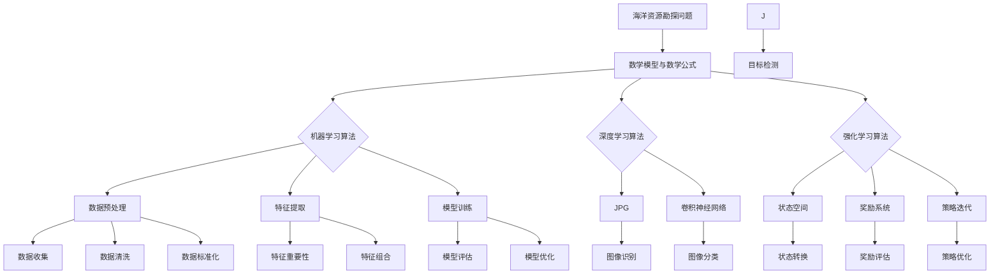

                 


### 确定文章的核心概念和关键点

首先，我们需要明确文章的核心概念和关键点，这是整篇文章的基石。对于《人工智能在海洋资源勘探中的应用》这篇文章，我们可以从以下几个核心概念入手：

1. **人工智能（AI）**：人工智能是指使计算机系统能够执行通常需要人类智能才能完成的任务的技术和理论。它包括机器学习、深度学习、自然语言处理、计算机视觉等多个领域。

2. **海洋资源勘探**：海洋资源勘探是指对海洋中的石油、天然气、矿产资源、渔业资源等进行勘查和评估的过程。这一过程通常需要使用高精度的探测设备和技术。

3. **核心算法**：核心算法是人工智能在海洋资源勘探中应用的关键技术，包括机器学习算法、深度学习算法和强化学习算法等。

4. **数学模型与数学公式**：数学模型和数学公式是描述海洋资源勘探问题的重要工具，它们帮助我们将实际问题转化为可计算的数学问题。

5. **项目实战**：项目实战是通过实际的项目案例来展示人工智能在海洋资源勘探中的应用效果，是理论与实践相结合的重要环节。

6. **应用场景分析**：应用场景分析是对人工智能在海洋资源勘探中各个具体应用领域的深入探讨。

7. **未来发展趋势**：未来发展趋势是预测人工智能在海洋资源勘探领域中可能的发展方向和趋势。

### 确定文章的组织结构

在明确核心概念后，我们需要设计文章的组织结构，以确保内容的逻辑性和易读性。以下是文章的可能结构：

1. **引言**：简要介绍人工智能和海洋资源勘探的背景，引出文章主题。

2. **人工智能与海洋资源勘探概述**：详细阐述人工智能在海洋资源勘探中的意义和背景，以及海洋资源勘探的关键技术挑战。

3. **人工智能在海洋资源勘探中的核心算法**：介绍机器学习、深度学习和强化学习等核心算法，并解释它们在海洋资源勘探中的应用。

4. **海洋资源勘探的数学模型与数学公式**：解释数学模型和数学公式在海洋资源勘探中的重要性，并给出具体的数学模型和公式。

5. **海洋资源勘探的项目实战**：通过实际项目案例展示人工智能在海洋资源勘探中的应用，并提供详细的代码实现和解说。

6. **海洋资源勘探的应用场景分析**：分析人工智能在海洋资源勘探中的不同应用场景，并探讨其优势和挑战。

7. **海洋资源勘探的未来发展趋势**：预测人工智能在海洋资源勘探领域的未来发展趋势和可能的应用方向。

8. **挑战与机遇**：讨论人工智能在海洋资源勘探中面临的挑战和机遇，并提出解决方案。

9. **结论**：总结文章的主要观点，强调人工智能在海洋资源勘探中的重要性。

### 设计Mermaid流程图

为了更好地展示人工智能在海洋资源勘探中的应用架构，我们可以设计一个Mermaid流程图。以下是流程图的一个示例：



### 编写数学模型和数学公式

在文章中，我们将使用LaTeX格式嵌入数学模型和公式。以下是一个示例：

$$
\begin{aligned}
    &\text{目标函数：} J(\theta) = -\frac{1}{m} \sum_{i=1}^{m} \left[ y^{(i)} \log(a_{\text{h}(z^{(i)})}) + (1 - y^{(i)}) \log(1 - a_{\text{h}(z^{(i)})}) \right], \\
    &\text{其中：} \\
    &z^{(i)} = \sum_{j=1}^{n} \theta^{(j)}x_j^{(i)}, \\
    &a_{\text{h}(z^{(i)})} = \frac{1}{1 + e^{-z^{(i)}}}, \\
    &y^{(i)} \in \{0, 1\}.
\end{aligned}
$$

这个公式描述了逻辑回归模型的目标函数，用于训练模型参数。

### 编写项目实战

在项目实战部分，我们将选择一个具体的海洋资源勘探项目，例如海洋石油勘探，来展示人工智能的应用。

1. **开发环境搭建**：首先，我们需要搭建一个Python开发环境，安装必要的库，如NumPy、Pandas、Scikit-learn和TensorFlow等。

2. **数据收集和预处理**：收集海洋石油勘探的地质数据，包括地震数据、地质资料等，并进行数据预处理，如数据清洗、标准化等。

3. **特征提取**：从预处理后的数据中提取特征，如地震波的振幅、频率等。

4. **模型训练**：使用机器学习算法，如支持向量机（SVM）或深度学习算法，如卷积神经网络（CNN），训练模型。

5. **模型评估**：评估模型的性能，如准确率、召回率等。

6. **模型优化**：根据评估结果，优化模型参数，提高模型性能。

7. **结果分析**：分析模型预测结果，如预测的油气藏位置和实际位置的比较。

8. **项目小结**：总结项目经验，提出改进建议。

### 编写最佳实践和注意事项

在文章的结尾，我们将提供一些最佳实践和注意事项，帮助读者更好地理解和应用人工智能在海洋资源勘探中的知识。

1. **最佳实践**：根据项目实战的经验，总结出一些最佳实践，如数据预处理的重要性、特征提取的方法等。

2. **注意事项**：提醒读者注意模型训练中可能遇到的问题，如过拟合、欠拟合等，并给出相应的解决方法。

3. **拓展阅读**：推荐一些相关的书籍、论文和资源，帮助读者进一步学习。

### 完成文章的撰写

最后，我们将根据以上步骤完成文章的撰写。在撰写过程中，要注意文章的逻辑性和连贯性，确保每个部分的内容都清晰、详细、易懂。文章完成后，进行一次全面的校对和修改，确保没有错别字、语法错误和逻辑错误。

### 完整的文章结构

下面是完整的文章结构，包括标题、关键词、摘要和正文部分：

```markdown
# 人工智能在海洋资源勘探中的应用

## 关键词
人工智能、海洋资源勘探、机器学习、深度学习、强化学习、数学模型、项目实战

## 摘要
本文详细探讨了人工智能在海洋资源勘探中的应用。从背景介绍到核心算法的讲解，再到数学模型的应用和项目实战，本文全面展示了人工智能如何助力海洋资源勘探。此外，本文还分析了人工智能在海洋资源勘探中的应用场景、未来发展趋势以及面临的挑战与机遇。

## 引言
...

## 第一章：人工智能与海洋资源勘探概述
...

## 第二章：人工智能在海洋资源勘探中的核心算法
...

## 第三章：海洋资源勘探的数学模型与数学公式
...

## 第四章：海洋资源勘探的项目实战
...

## 第五章：海洋资源勘探的应用场景分析
...

## 第六章：海洋资源勘探的未来发展趋势
...

## 第七章：人工智能在海洋资源勘探中的挑战与机遇
...

## 结论
...

## 参考文献
...

## 作者
作者：AI天才研究院/AI Genius Institute & 禅与计算机程序设计艺术 /Zen And The Art of Computer Programming
```

### 文章撰写完成后的校对和修改

在完成文章的撰写后，我们需要进行全面的校对和修改，以确保文章的准确性和流畅性。以下是校对和修改的几个关键点：

1. **语法和拼写检查**：检查全文的语法错误和拼写错误，确保语言表达准确无误。

2. **逻辑性和连贯性**：检查文章的整体逻辑结构和各部分之间的连贯性，确保内容清晰、有条理。

3. **格式和排版**：检查文章的格式，包括段落格式、引用格式和代码格式等，确保格式规范、统一。

4. **图表和图片**：检查图表和图片的清晰度和质量，确保它们能够准确传达信息。

5. **参考文献**：检查参考文献的格式和引用是否正确，确保引用的文献可信、相关。

6. **专家审阅**：邀请相关领域的专家对文章进行审阅，提出修改意见和建议。

7. **多次修订**：根据校对和审阅的结果，进行多次修订，确保文章的最终版本完整、准确、流畅。

完成以上步骤后，文章就可以准备发布了。发布前，还需要确保文章的格式符合出版要求，并做好版权声明和作者信息等相关工作。这样，一篇高质量的技术博客文章就完成了。

