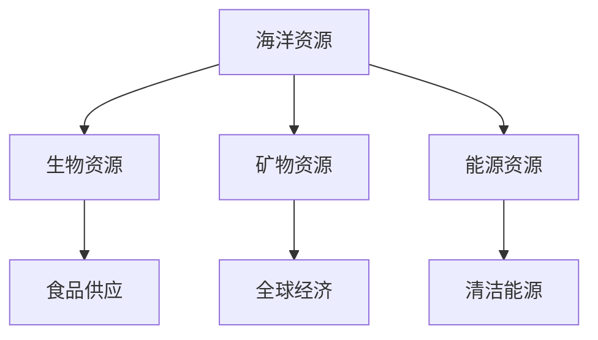
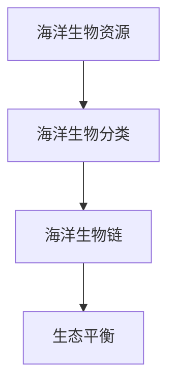
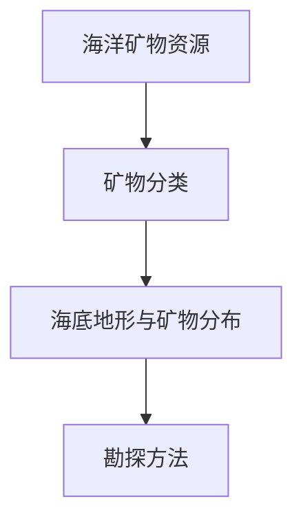
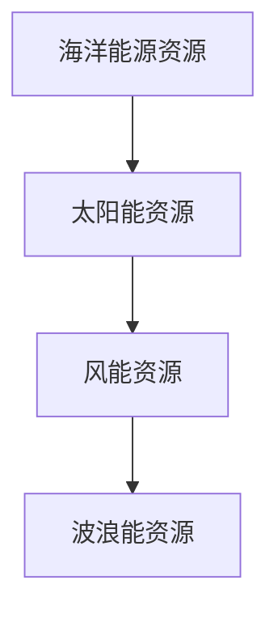

                 

# 文章标题

> 关键词：人工智能、海洋资源勘探、应用、算法、深度学习、数学模型

> 摘要：
本文旨在探讨人工智能在海洋资源勘探中的应用，从背景、核心概念、算法原理、数学模型等多个维度，详细解析了人工智能如何赋能海洋资源勘探，提升勘探效率和准确性。文章涵盖了海洋生物资源、海洋矿物资源、海洋能源资源等勘探领域，通过具体的算法和数学模型分析，展示了人工智能在海洋资源勘探中的潜力和前景。

---

## 第1章 引言

### 1.1 海洋资源勘探的背景

#### 1.1.1 海洋资源的重要性

海洋占地球表面积的71%，蕴藏着丰富的资源，包括生物资源、矿物资源和能源资源。这些资源对于人类的生存和发展具有极其重要的意义。例如，海洋生物资源是许多国家食品供应的重要来源；海洋矿物资源如石油、天然气和金属矿产，对于全球经济具有巨大价值；海洋能源资源如太阳能、风能和波浪能，则为人类提供了清洁的能源选择。

**Mermaid 流程图：**



### 1.2 人工智能在海洋资源勘探中的应用现状

#### 1.2.1 人工智能技术的基本概念

人工智能（AI）是一种模拟人类智能的技术，包括机器学习、深度学习、数据挖掘等多个子领域。机器学习是一种通过数据训练模型，让模型具备自主学习和决策能力的技术。深度学习是机器学习的一种，通过多层神经网络对数据进行处理，实现更加复杂的模式识别和预测。

#### 1.2.2 人工智能在海洋资源勘探中的应用场景

- **海洋生物资源勘探**：利用人工智能进行生物种群分布预测、生态监测和渔业资源评估。
- **海洋矿物资源勘探**：通过人工智能分析地质数据，提高矿物资源的勘探效率和准确性。
- **海洋能源资源勘探**：利用人工智能进行海洋能源的评估和预测，如太阳能、风能和波浪能。

## 第2章 海洋资源勘探中的核心概念与联系

### 2.1 海洋资源类型

#### 2.1.1 海洋生物资源

海洋生物资源包括海洋鱼类、贝类、藻类等。这些资源是许多国家食品供应的重要来源，同时也是海洋生态系统的重要组成部分。

**Mermaid 流程图：**



#### 2.1.2 海洋矿物资源

海洋矿物资源包括石油、天然气、金属矿产等。这些资源是现代工业的重要原材料，对于全球经济的发展具有重要意义。

**Mermaid 流程图：**



#### 2.1.3 海洋能源资源

海洋能源资源包括太阳能、风能和波浪能等。这些资源为人类提供了清洁、可再生的能源选择，有助于减少对化石燃料的依赖。

**Mermaid 流程图：**



### 2.2 人工智能与海洋资源勘探的联系

#### 2.2.1 数据收集与处理

在海洋资源勘探中，数据收集与处理是至关重要的环节。人工智能技术可以有效地处理大量复杂的数据，提高勘探的效率和准确性。

**伪代码：**

```python
def data_collection():
    # 收集海洋资源勘探数据
    pass

def data_preprocessing(data):
    # 数据清洗和预处理
    pass
```

#### 2.2.2 数据分析与建模

人工智能技术可以基于大量的勘探数据进行数据分析和建模，从而实现对海洋资源的精确评估和预测。

**伪代码：**

```python
def data_analysis(data):
    # 数据分析
    pass

def model_building():
    # 建立预测模型
    pass
```

## 第3章 人工智能在海洋资源勘探中的核心算法原理

### 3.1 机器学习算法

#### 3.1.1 监督学习算法

监督学习算法是一种基于已有数据（特征和标签）进行训练的算法，通过学习已有数据的特征和规律，预测新数据的标签。

**伪代码：**

```python
def supervised_learning(data, labels):
    # 训练监督学习模型
    pass
```

#### 3.1.2 无监督学习算法

无监督学习算法是一种不需要标签数据进行训练的算法，通过学习数据本身的分布和特征，发现数据中的潜在结构。

**伪代码：**

```python
def unsupervised_learning(data):
    # 训练无监督学习模型
    pass
```

### 3.2 深度学习算法

#### 3.2.1 神经网络

神经网络是一种模拟生物神经系统的计算模型，通过多层神经元的连接，实现对复杂数据的高效处理。

**伪代码：**

```python
def neural_network(input_data):
    # 前向传播
    pass

def backward_propagation(output, expected_output):
    # 反向传播
    pass
```

#### 3.2.2 卷积神经网络（CNN）

卷积神经网络是一种专门用于图像和视频处理的深度学习模型，通过卷积和池化操作，实现对图像特征的提取和分类。

**伪代码：**

```python
def convolutional_neural_network(input_data):
    # 卷积操作
    pass

def max_pooling(output):
    # 最大池化操作
    pass
```

### 3.3 集成学习方法

#### 3.3.1 随机森林

随机森林是一种基于决策树集成的机器学习算法，通过随机选取特征和样本子集，构建多个决策树，并进行集成预测。

**伪代码：**

```python
def random_forest(data, labels):
    # 训练随机森林模型
    pass
```

#### 3.3.2 Boosting方法

Boosting方法是一种基于集成学习的算法，通过反复训练弱学习器，并将其组合成一个强学习器，提高预测的准确性。

**伪代码：**

```python
def boosting(data, labels):
    # 训练提升树模型
    pass
```

## 第4章 数学模型与数学公式

### 4.1 海洋资源勘探的数学模型

海洋资源勘探的数学模型主要包括地质统计模型、地球物理模型和海洋生物学模型等。以下是一些典型的数学公式：

#### 地质统计模型

$$
\mu = \frac{1}{n}\sum_{i=1}^{n}X_i
$$

$$
\sigma^2 = \frac{1}{n-1}\sum_{i=1}^{n}(X_i - \mu)^2
$$

其中，$\mu$表示均值，$\sigma^2$表示方差，$X_i$表示第$i$个观测值。

#### 地球物理模型

$$
V_p = \frac{V_s}{\sqrt{1-v^2}}
$$

其中，$V_p$表示纵波速度，$V_s$表示横波速度，$v$表示泊松比。

#### 海洋生物学模型

$$
N = \frac{Z^3}{3\pi}
$$

其中，$N$表示体积，$Z$表示长度。

以上数学模型和公式在海洋资源勘探中具有重要的应用价值，通过这些模型和公式，可以更好地理解海洋资源的分布和特征，从而提高勘探的准确性和效率。

