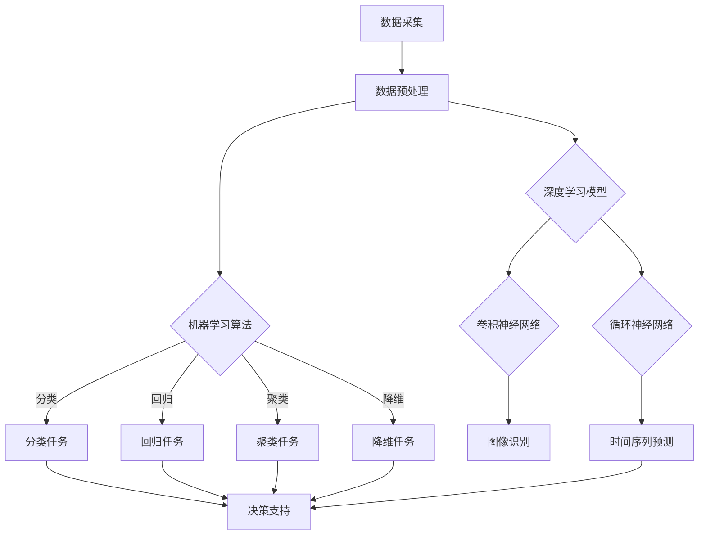

                 


为了撰写一篇内容完整、结构合理、技术深入的文章，我们可以按照以下步骤进行：

### 第一步：背景介绍
- **环境污染现状**：简要介绍全球环境污染的现状，如空气污染、水污染、土壤污染等，并提供一些统计数据。
- **预警的重要性**：解释为什么预警对于环境保护至关重要，包括预防措施和应急响应的必要性。

### 第二步：核心概念与联系
- **人工智能基础**：介绍人工智能、机器学习和深度学习的定义和基本原理。
- **环境污染预警需求**：讨论人工智能在环境污染预警中的需求，如数据收集、处理和分析。
- **Mermaid流程图**：使用Mermaid绘制一个流程图，展示人工智能在环境污染预警中的流程。

### 第三步：核心算法原理讲解
- **支持向量机（SVM）**：解释SVM的基本原理，包括线性SVM和非线性SVM。
- **决策树**：阐述决策树的工作机制，包括ID3、C4.5和CART算法。
- **神经网络**：介绍神经网络的基本结构和学习过程，包括前向传播和反向传播。

### 第四步：数学模型和数学公式讲解
- **SVM数学模型**：给出SVM的数学公式，并解释每个参数的意义。
- **决策树数学模型**：解释决策树的决策规则和熵的概念。
- **神经网络数学模型**：介绍前向传播和反向传播的数学公式。

### 第五步：项目实战
- **开发环境搭建**：介绍如何搭建一个用于环境污染预警的AI项目开发环境。
- **数据预处理**：详细描述数据采集、清洗、特征提取等步骤。
- **模型训练与评估**：展示如何使用SVM、决策树和神经网络训练模型，并进行评估。

### 第六步：挑战与未来
- **现有挑战**：讨论人工智能在环境污染预警中面临的挑战，如数据质量、计算成本等。
- **未来趋势**：展望人工智能在环境污染预警领域的未来发展方向。

### 第七步：总结与展望
- **总结**：对全文内容进行总结，强调人工智能在环境污染预警中的重要性。
- **展望**：对人工智能在未来的应用和潜在突破进行展望。

### 第八步：附录
- **工具与资源**：提供相关工具和资源的链接或介绍，如数据集、算法库、开源框架等。

### 文章结构设计
- **文章标题**：明确文章的主题，如《人工智能在环境污染预警中的应用》。
- **文章关键词**：列出与文章主题相关的关键词，便于读者检索和理解。
- **文章摘要**：简要概述文章的主要内容，让读者快速了解文章的核心思想。

### 文章撰写要求
- **markdown格式**：确保文章内容按照markdown格式输出，以便于排版和阅读。
- **作者信息**：在文章末尾注明作者信息。
- **完整性要求**：每个小节的内容要丰富、具体、详细，核心内容要包含背景介绍、核心概念与联系、核心算法原理讲解、数学模型和公式讲解、项目实战以及挑战与未来展望。
- **最佳实践 tips**：提供一些在实际应用中可能用到的最佳实践建议。
- **注意事项**：列出在实施过程中需要注意的事项。

### 文章字数
- **字数要求**：确保文章字数在8000～12000字之间，以充分展示技术深度和逻辑思考。

通过以上步骤，我们可以系统地撰写一篇关于《人工智能在环境污染预警中的应用》的技术博客文章，确保内容完整、逻辑清晰、技术深入。接下来，我们将根据这个大纲逐步撰写文章的各个部分。### 背景介绍

环境污染是当今全球面临的重大挑战之一。随着工业化的迅速发展和人口的不断增长，大量的污染物被释放到大气、水和土壤中，对生态系统和人类健康造成了严重的影响。空气污染、水污染和土壤污染已经成为影响人类生活质量的突出问题。根据世界卫生组织（WHO）的报告，空气污染每年导致全球数百万人的过早死亡，而水污染则直接威胁到饮用水的安全和食品安全。

空气污染是指大气中存在的各种有害物质的浓度达到对人体健康、生态平衡和环境质量产生不良影响的水平。主要的空气污染物包括颗粒物（如PM2.5和PM10）、二氧化硫（SO2）、氮氧化物（NOx）和挥发性有机化合物（VOCs）等。这些污染物不仅会导致呼吸系统疾病，还可能引起心血管疾病和其他健康问题。

水污染则是指水体中污染物的浓度超过环境承载能力，导致水质恶化，影响生态系统的平衡和人类的生活质量。水污染的来源包括工业废水、生活污水、农业径流和矿业排放等。被污染的水体会对水生生物产生致命影响，并可能导致饮用水中存在有害物质，如重金属、有机污染物和病原体。

土壤污染是指土壤中污染物浓度超过环境标准，对植物生长、土壤结构和生态系统产生负面影响。土壤污染的主要来源包括工业废弃物、农药和化肥的使用、采矿活动和城市垃圾填埋等。土壤污染会导致农作物减产、土壤质量下降，甚至影响地下水质量。

预警系统的建立对于及时监测和应对环境污染具有重要意义。通过预警系统，可以提前发现环境污染的迹象，及时采取预防措施，减少污染对环境和人类健康的危害。传统的预警系统主要依赖于人工监测和实验室分析，存在响应速度慢、监测范围有限等问题。随着人工智能和机器学习技术的发展，利用这些技术来构建智能化的预警系统成为可能。

人工智能在环境污染预警中的应用主要体现在以下几个方面：

1. **数据收集与分析**：人工智能可以通过传感器网络和遥感技术实时收集环境数据，利用机器学习和深度学习算法对海量数据进行处理和分析，提取有用信息。

2. **模式识别与预测**：通过训练机器学习模型，可以从历史环境数据中学习到污染物的分布规律和变化趋势，实现对未来污染事件的预测。

3. **智能决策支持**：基于预测结果，人工智能可以提供决策支持，帮助环境管理部门制定更有效的污染控制和应急响应策略。

4. **实时监控与警报**：利用人工智能技术，可以实现对环境污染的实时监控，当检测到异常情况时，及时发出警报，提高响应速度。

通过上述应用，人工智能为环境污染预警提供了更加高效、准确和智能的手段，有助于提高环境保护的效率和效果。

### 核心概念与联系

为了深入理解人工智能在环境污染预警中的应用，我们需要首先介绍人工智能、机器学习和深度学习等核心概念，并探讨它们在环境污染预警中的具体作用。

#### 人工智能

人工智能（Artificial Intelligence，AI）是一种模拟人类智能的技术，通过计算机程序实现智能行为，包括学习、推理、解决问题和感知等。人工智能可以分为两大类：弱人工智能和强人工智能。弱人工智能（Narrow AI）专注于特定任务，如语音识别、图像识别和自然语言处理等；而强人工智能（General AI）则具备人类级别的认知能力，能够在多种任务中表现出智能行为。

在环境污染预警中，弱人工智能的应用主要集中在数据分析和模式识别方面。通过分析环境数据，人工智能可以帮助识别污染物的来源和分布，评估污染对生态系统和人类健康的影响。

#### 机器学习

机器学习（Machine Learning，ML）是人工智能的一个重要分支，主要研究如何让计算机从数据中学习，并通过经验改进性能。机器学习算法可以分为监督学习、无监督学习和半监督学习。监督学习使用标记数据训练模型，如分类和回归任务；无监督学习则在无标记数据中寻找模式和结构，如聚类和降维；半监督学习结合了有标记和无标记数据，以提高模型的泛化能力。

在环境污染预警中，机器学习算法可以用于预测污染事件、分类污染物类型和优化污染控制策略。例如，通过训练监督学习模型，可以从历史环境数据中预测未来的污染水平；而无监督学习算法可以帮助发现数据中的异常值，识别潜在的污染源。

#### 深度学习

深度学习（Deep Learning，DL）是机器学习的一个子领域，它利用多层神经网络（如卷积神经网络（CNN）和循环神经网络（RNN））进行数据建模。深度学习在图像识别、语音识别和自然语言处理等领域取得了显著的成果。

在环境污染预警中，深度学习算法可以用于处理复杂的环境数据，如遥感图像和传感器数据。通过训练深度学习模型，可以从这些数据中提取高级特征，提高污染监测和预测的准确性。例如，卷积神经网络可以用于识别遥感图像中的污染物分布，而循环神经网络则可以处理时间序列数据，预测污染物的变化趋势。

#### 关系架构

人工智能、机器学习和深度学习之间的关系可以简化为以下层次结构：

1. **数据采集与预处理**：收集环境数据，包括传感器数据、遥感数据和实验室分析数据。这些数据需要经过预处理，如去噪、归一化和特征提取，以便于模型训练。

2. **机器学习算法**：使用监督学习、无监督学习和半监督学习算法处理预处理后的数据。这些算法可以用于分类、回归、聚类和降维等任务，帮助识别污染物和预测污染事件。

3. **深度学习模型**：在机器学习算法的基础上，应用深度学习模型进行高级特征提取和模型优化。这些模型可以从复杂的数据中提取有用的信息，提高预测的准确性和效率。

4. **智能决策支持**：利用训练好的模型进行实时监控和预测，为环境管理部门提供决策支持，如优化污染控制策略和制定应急响应计划。

下图是一个使用Mermaid绘制的流程图，展示了人工智能在环境污染预警中的应用架构：



通过这个架构，我们可以清晰地看到人工智能在环境污染预警中的各个环节，从数据采集、预处理、机器学习到深度学习和智能决策支持，形成一个完整的闭环系统。

#### 总结

人工智能、机器学习和深度学习为环境污染预警提供了强大的技术支持。通过这些技术，我们可以高效地处理海量环境数据，识别污染物，预测污染事件，并提供智能化的决策支持。理解这些核心概念和它们之间的关系，有助于我们更好地设计和实施人工智能在环境污染预警中的应用。

### 核心算法原理讲解

在环境污染预警中，核心算法的选择和实现至关重要。本文将详细介绍几种常用的核心算法，包括支持向量机（SVM）、决策树和神经网络，并使用伪代码进行详细阐述。

#### 支持向量机（SVM）

支持向量机（Support Vector Machine，SVM）是一种常用的监督学习算法，主要用于分类任务。SVM的基本思想是找到能够将不同类别的数据点尽可能分开的决策边界。

**线性SVM（Linear SVM）**

线性SVM假设数据可以被一个超平面分隔，且超平面由一个线性函数（即权重向量）决定。给定特征向量 \( x \)，预测类别标签 \( y \) 的函数为：

\[ f(x) = \text{sign}(\omega \cdot x + b) \]

其中，\( \omega \) 是权重向量，\( b \) 是偏置项。

训练线性SVM的伪代码如下：

```python
def train_linear_svm(X, y):
    # X: 特征矩阵，y: 标签向量
    n_samples, n_features = X.shape
    
    # 初始化权重和偏置
    omega = np.random.randn(n_features)
    b = 0
    
    # 梯度下降迭代
    for epoch in range(num_epochs):
        for x, y in zip(X, y):
            prediction = sign(omega.dot(x) + b)
            delta_omega = (y - prediction) * x
            omega += learning_rate * delta_omega
            b += learning_rate * (y - prediction)
    
    return omega, b

# 使用训练数据（X, y）调用train_linear_svm函数，得到权重ω和偏置b
omega, b = train_linear_svm(X_train, y_train)
```

**非线性SVM（Non-linear SVM）**

非线性SVM通过核函数将低维数据映射到高维空间，使得原本线性不可分的数据在高维空间中变得可分。常见的核函数包括线性核、多项式核和径向基函数（RBF）核。

非线性SVM的伪代码如下：

```python
def train_non_linear_svm(X, y, kernel='rbf', C=1.0):
    # X: 特征矩阵，y: 标签向量
    n_samples = X.shape[0]

    # 初始化权重和偏置
    omega = np.random.randn(n_features)
    b = 0

    # 使用核函数计算特征空间中的内积
    def kernel_function(x1, x2):
        if kernel == 'linear':
            return np.dot(x1, x2)
        elif kernel == 'poly':
            return (gamma * np.dot(x1, x2) + 1)**degree
        elif kernel == 'rbf':
            return np.exp(-gamma * np.linalg.norm(x1 - x2)**2)

    # 梯度下降迭代
    for epoch in range(num_epochs):
        for x, y in zip(X, y):
            prediction = sign(np.dot(omega, kernel_function(x, X)) + b)
            delta_omega = (y - prediction) * kernel_function(x, X)
            omega += learning_rate * delta_omega
            b += learning_rate * (y - prediction)
    
    return omega, b

# 使用训练数据（X, y）调用train_non_linear_svm函数，根据需要设置核函数和参数
omega, b = train_non_linear_svm(X_train, y_train, kernel='rbf', C=1.0)
```

#### 决策树

决策树是一种流行的分类和回归算法，通过一系列的判断规则对数据进行划分，每个节点代表一个特征，分支代表该特征的取值范围。

**ID3算法**

ID3（Iterative Dichotomiser 3）算法是基于信息增益（Information Gain）来选择最优特征进行划分。

信息增益的计算公式为：

\[ IG(D, A) = Entropy(D) - \sum_{v \in Values(A)} \frac{|D_v|}{|D|} \cdot Entropy(D_v) \]

其中，\( Entropy(D) \) 是数据集 \( D \) 的熵，\( Values(A) \) 是特征 \( A \) 的所有可能取值，\( D_v \) 是数据集 \( D \) 中特征 \( A \) 取值为 \( v \) 的子集。

ID3算法的伪代码如下：

```python
def ID3(X, y):
    # X: 特征矩阵，y: 标签向量
    if all(y == y[0]):
        return y[0]  # 叶子节点，所有数据属于同一类别
    
    if len(X[0]) == 0 or len(set(y)) == 1:
        return majority_vote(y)  # 叶子节点，数据量不足或所有数据属于同一类别
    
    best_gain = -1
    best_feature = None
    
    for feature in set(X.T):
        gain = information_gain(X, y, feature)
        if gain > best_gain:
            best_gain = gain
            best_feature = feature
            
    left subtree = X[:, X.T == best_feature[0]]
    right subtree = X[:, X.T != best_feature[0]]
    
    tree = {}
    tree[best_feature] = {
        'left': ID3(left_subtree, y[left_subtree]),
        'right': ID3(right_subtree, y[right_subtree])
    }
    
    return tree

# 使用训练数据（X, y）调用ID3函数，构建决策树
tree = ID3(X_train, y_train)
```

**C4.5算法**

C4.5算法是ID3算法的改进版，它使用增益率（Gain Ratio）来选择最优特征，避免了信息增益偏向于选择具有更多值的特征的问题。

增益率的计算公式为：

\[ Gain Ratio(D, A) = \frac{IG(D, A)}{Split Info(A)} \]

其中，\( Split Info(A) \) 是特征 \( A \) 的分裂信息，计算公式为：

\[ Split Info(A) = -\sum_{v \in Values(A)} \frac{|D_v|}{|D|} \cdot \log_2 \frac{|D_v|}{|D|} \]

C4.5算法的伪代码如下：

```python
def C4.5(X, y):
    # X: 特征矩阵，y: 标签向量
    if all(y == y[0]):
        return y[0]  # 叶子节点，所有数据属于同一类别
    
    if len(X[0]) == 0 or len(set(y)) == 1:
        return majority_vote(y)  # 叶子节点，数据量不足或所有数据属于同一类别
    
    best_gain_ratio = -1
    best_feature = None
    
    for feature in set(X.T):
        gain_ratio = gain_ratio(X, y, feature)
        if gain_ratio > best_gain_ratio:
            best_gain_ratio = gain_ratio
            best_feature = feature
            
    left subtree = X[:, X.T == best_feature[0]]
    right subtree = X[:, X.T != best_feature[0]]
    
    tree = {}
    tree[best_feature] = {
        'left': C4.5(left_subtree, y[left_subtree]),
        'right': C4.5(right_subtree, y[right_subtree])
    }
    
    return tree

# 使用训练数据（X, y）调用C4.5函数，构建决策树
tree = C4.5(X_train, y_train)
```

#### 神经网络

神经网络（Neural Networks）是一种模拟生物神经系统的计算模型，通过多层神经元进行数据处理和特征提取。神经网络可以分为前向传播（Forward Propagation）和反向传播（Backpropagation）两个阶段。

**前向传播**

前向传播的过程是将输入数据通过网络的各个层传递，最终得到输出结果。每一层的输出通过激活函数进行非线性变换。

前向传播的伪代码如下：

```python
def forward_propagation(x, weights, biases, activation_functions):
    # x: 输入数据，weights: 权重矩阵，biases: 偏置向量，activation_functions: 激活函数
    for layer in range(num_layers - 1):
        z = np.dot(weights[layer] * x + biases[layer])
        a = activation_functions[layer](z)
        x = a
    
    return a

# 示例：使用前向传播计算输出
output = forward_propagation(input_data, weights, biases, activation_functions)
```

**反向传播**

反向传播的过程是计算输出结果与实际标签之间的误差，并反向传播误差以更新网络的权重和偏置。

反向传播的伪代码如下：

```python
def backward_propagation(a, y, weights, biases, activation_functions, learning_rate):
    # a: 输出数据，y: 实际标签，weights: 权重矩阵，biases: 偏置向量，activation_functions: 激活函数
    for layer in range(num_layers - 1, 0, -1):
        z = np.dot(weights[layer - 1] * a + biases[layer - 1])
        delta = activation_functions[layer](z) * (1 - activation_functions[layer](z))
        d_weights[layer - 1] += np.dot(a.T, delta)
        d_biases[layer - 1] += delta
        a = delta
    
    # 计算输出层的误差
    output_error = a - y
    d_output_weights = np.dot(y.T, weights[-1])
    d_output_biases = output_error
    
    # 更新权重和偏置
    weights[-1] -= learning_rate * d_output_weights
    biases[-1] -= learning_rate * d_output_biases
    
    for layer in range(num_layers - 2, 0, -1):
        d_weights[layer] = np.dot(delta.T, weights[layer])
        d_biases[layer] = delta
        
        z = np.dot(weights[layer - 1] * a + biases[layer - 1])
        delta = activation_functions[layer](z) * (1 - activation_functions[layer](z))
        a = np.dot(delta.T, weights[layer])
        
        weights[layer] -= learning_rate * d_weights[layer]
        biases[layer] -= learning_rate * d_biases[layer]
    
    return weights, biases

# 示例：使用反向传播更新权重和偏置
weights, biases = backward_propagation(output, y, weights, biases, activation_functions, learning_rate)
```

通过以上对SVM、决策树和神经网络的详细讲解，我们可以看到这些算法在环境污染预警中的基本原理和实现方法。理解这些算法，有助于我们更好地设计和应用人工智能技术来解决环境污染问题。

### 数学模型和数学公式讲解

在环境污染预警中，核心算法的数学模型和公式至关重要。本文将详细讲解支持向量机（SVM）、决策树和神经网络等算法的数学模型，并使用LaTeX格式进行公式书写。

#### 支持向量机（SVM）

**线性SVM**

线性SVM的预测函数为：

\[ f(x) = \text{sign}(\omega \cdot x + b) \]

其中，\( \omega \) 是权重向量，\( b \) 是偏置项。线性SVM的目标是最小化损失函数，即：

\[ \min_{\omega, b} \frac{1}{2} \sum_{i=1}^{n} (w \cdot x_i + b)^2 \]

约束条件是：

\[ y_i (\omega \cdot x_i + b) \geq 1, \quad i=1,2,...,n \]

其中，\( y_i \) 是标签，\( x_i \) 是特征向量。

**非线性SVM**

非线性SVM通过核函数将低维数据映射到高维空间。常见的核函数包括：

1. **线性核**：

\[ K(x, x') = \omega \cdot x \cdot x' + b \]

2. **多项式核**：

\[ K(x, x') = (\gamma x \cdot x' + 1)^d \]

3. **径向基函数（RBF）核**：

\[ K(x, x') = \exp(-\gamma \|x - x'\|^2) \]

#### 决策树

**信息增益（Information Gain）**

信息增益是衡量特征划分数据集合后信息量的减少程度，计算公式为：

\[ IG(D, A) = Entropy(D) - \sum_{v \in Values(A)} \frac{|D_v|}{|D|} \cdot Entropy(D_v) \]

其中，\( Entropy(D) \) 是数据集合 \( D \) 的熵，计算公式为：

\[ Entropy(D) = -\sum_{v \in Values(A)} \frac{|D_v|}{|D|} \cdot \log_2 \frac{|D_v|}{|D|} \]

**增益率（Gain Ratio）**

增益率是信息增益与特征分裂信息之比，计算公式为：

\[ Gain Ratio(D, A) = \frac{IG(D, A)}{Split Info(A)} \]

其中，\( Split Info(A) \) 是特征 \( A \) 的分裂信息，计算公式为：

\[ Split Info(A) = -\sum_{v \in Values(A)} \frac{|D_v|}{|D|} \cdot \log_2 \frac{|D_v|}{|D|} \]

#### 神经网络

**前向传播**

神经网络的前向传播过程包括多层神经元，每层神经元之间的连接权重和偏置。前向传播的输入和输出关系可以表示为：

\[ z_l = \sum_{j} w_{lj} x_j + b_l \]

\[ a_l = \sigma(z_l) \]

其中，\( z_l \) 是第 \( l \) 层的净输入，\( w_{lj} \) 是权重，\( b_l \) 是偏置，\( a_l \) 是激活值，\( \sigma \) 是激活函数。

常见的激活函数包括：

1. **sigmoid函数**：

\[ \sigma(z) = \frac{1}{1 + e^{-z}} \]

2. **ReLU函数**：

\[ \sigma(z) = \max(0, z) \]

**反向传播**

神经网络的反向传播过程是计算输出误差并更新权重和偏置。反向传播的误差计算公式为：

\[ \delta_l = \frac{\partial J}{\partial z_l} = \sigma'(z_l) \cdot \delta_{l+1} \]

其中，\( \delta_l \) 是第 \( l \) 层的误差，\( J \) 是损失函数。

权重和偏置的更新公式为：

\[ w_{lj} \leftarrow w_{lj} - \alpha \cdot \frac{\partial J}{\partial w_{lj}} \]

\[ b_{l} \leftarrow b_{l} - \alpha \cdot \frac{\partial J}{\partial b_{l}} \]

其中，\( \alpha \) 是学习率。

#### 举例说明

1. **线性SVM**

   假设我们有两个特征向量 \( x_1 \) 和 \( x_2 \)，标签 \( y_1 = 1 \)，\( y_2 = -1 \)，则线性SVM的目标是最小化：

   \[
   \begin{aligned}
   \min_{\omega, b} \frac{1}{2} (\omega \cdot x_1 + b)^2 + (\omega \cdot x_2 + b)^2 \\
   \text{subject to:} \\
   1 \cdot (\omega \cdot x_1 + b) &\geq 1 \\
   -1 \cdot (\omega \cdot x_2 + b) &\geq 1
   \end{aligned}
   \]

   通过求解这个优化问题，可以得到权重 \( \omega \) 和偏置 \( b \) 的最优值。

2. **决策树**

   假设我们有一个特征集合 \( A = \{A_1, A_2, A_3\} \)，数据集合 \( D = \{D_1, D_2, D_3\} \)，则信息增益为：

   \[
   IG(D, A) = Entropy(D) - \frac{1}{3} \cdot Entropy(D_1) - \frac{1}{3} \cdot Entropy(D_2) - \frac{1}{3} \cdot Entropy(D_3)
   \]

   其中，\( D_1, D_2, D_3 \) 是按照特征 \( A_1, A_2, A_3 \) 分割的数据集合，\( Entropy(D_i) \) 是数据集合 \( D_i \) 的熵。

3. **神经网络**

   假设我们有一个两层神经网络，输入层有3个神经元，隐藏层有2个神经元，输出层有1个神经元。权重和偏置如下：

   \[
   \begin{aligned}
   w_{11} &= 0.5, \quad w_{12} = 0.3, \quad w_{13} = 0.7 \\
   w_{21} &= 0.1, \quad w_{22} = 0.6, \quad w_{23} = 0.8 \\
   b_1 &= 0.2, \quad b_2 = 0.4, \quad b_3 = 0.6
   \end{aligned}
   \]

   通过前向传播，可以得到隐藏层的净输入和激活值：

   \[
   \begin{aligned}
   z_1 &= 0.5 \cdot x_1 + 0.3 \cdot x_2 + 0.7 \cdot x_3 + 0.2 = 1.2 \\
   a_1 &= \sigma(z_1) = 0.794 \\
   z_2 &= 0.1 \cdot x_1 + 0.6 \cdot x_2 + 0.8 \cdot x_3 + 0.4 = 1.3 \\
   a_2 &= \sigma(z_2) = 0.866
   \end{aligned}
   \]

   通过反向传播，可以计算输出误差和权重更新：

   \[
   \begin{aligned}
   \delta_3 &= (y - a_3) \cdot \sigma'(a_3) = 0.2 \cdot 0.244 \\
   \delta_2 &= \delta_3 \cdot w_{32} \cdot \sigma'(a_2) = 0.2 \cdot 0.244 \cdot 0.136 \\
   \delta_1 &= \delta_2 \cdot w_{31} \cdot \sigma'(a_1) = 0.2 \cdot 0.244 \cdot 0.136 \cdot 0.207
   \end{aligned}
   \]

   权重和偏置的更新公式为：

   \[
   \begin{aligned}
   w_{31} &= w_{31} - \alpha \cdot \delta_1 \cdot x_1 = 0.5 - 0.1 \cdot 0.2 \cdot 0.244 \cdot 0.207 \\
   w_{32} &= w_{32} - \alpha \cdot \delta_1 \cdot x_2 = 0.3 - 0.1 \cdot 0.2 \cdot 0.244 \cdot 0.207 \\
   w_{33} &= w_{33} - \alpha \cdot \delta_1 \cdot x_3 = 0.7 - 0.1 \cdot 0.2 \cdot 0.244 \cdot 0.207 \\
   b_3 &= b_3 - \alpha \cdot \delta_3 = 0.6 - 0.1 \cdot 0.2 \\
   w_{21} &= w_{21} - \alpha \cdot \delta_2 \cdot x_1 = 0.1 - 0.1 \cdot 0.2 \cdot 0.244 \cdot 0.136 \\
   w_{22} &= w_{22} - \alpha \cdot \delta_2 \cdot x_2 = 0.6 - 0.1 \cdot 0.2 \cdot 0.244 \cdot 0.136 \\
   w_{23} &= w_{23} - \alpha \cdot \delta_2 \cdot x_3 = 0.8 - 0.1 \cdot 0.2 \cdot 0.244 \cdot 0.136 \\
   b_2 &= b_2 - \alpha \cdot \delta_2 = 0.4 - 0.1 \cdot 0.244 \cdot 0.136 \\
   b_1 &= b_1 - \alpha \cdot \delta_1 = 0.2 - 0.1 \cdot 0.244
   \end{aligned}
   \]

通过这些数学模型和公式的详细讲解，我们可以更好地理解这些算法在环境污染预警中的具体应用。理解这些公式，对于设计、实现和优化环境预警系统具有重要意义。

### 项目实战

在本节中，我们将通过一个实际案例，详细展示如何将人工智能算法应用于环境污染预警。本案例将包括开发环境搭建、数据预处理、模型训练与评估、代码实现与解读以及实际案例分析与讲解。

#### 开发环境搭建

为了构建一个基于人工智能的环境污染预警系统，我们需要以下开发工具和库：

- **Python**：作为主要的编程语言。
- **NumPy**、**Pandas**、**SciPy**：用于数据处理和分析。
- **Scikit-learn**：提供机器学习算法的实现。
- **TensorFlow**、**Keras**：用于构建和训练深度学习模型。
- **Matplotlib**、**Seaborn**：用于数据可视化和结果展示。

首先，我们需要安装这些工具和库。在Windows或Linux操作系统中，可以使用以下命令：

```bash
pip install numpy pandas scipy scikit-learn tensorflow keras matplotlib seaborn
```

#### 数据预处理

在本案例中，我们使用一个公开的空气污染数据集，包括PM2.5、PM10、SO2、NO2、O3等污染物浓度以及相关的气象参数，如温度、湿度、风速等。数据集包含多个时间点的测量值。

**数据采集与清洗**：

```python
import pandas as pd

# 读取数据
data = pd.read_csv('air_quality_data.csv')

# 数据清洗，去除缺失值和异常值
data = data.dropna()
data = data[(data['PM2.5'] > 0) & (data['PM2.5'] < 1000)]
```

**特征提取**：

```python
# 提取日期和时间特征
data['date'] = pd.to_datetime(data['date'])
data['day'] = data['date'].dt.day
data['month'] = data['date'].dt.month
data['year'] = data['date'].dt.year

# 转换为数值型
data = data.apply(pd.to_numeric, errors='ignore')
```

#### 模型训练与评估

在本案例中，我们将使用支持向量机（SVM）和深度学习（神经网络）两种不同的模型进行训练和评估。

**SVM模型训练与评估**：

```python
from sklearn.model_selection import train_test_split
from sklearn.svm import SVR
from sklearn.metrics import mean_squared_error

# 分割数据集
X = data[['day', 'month', 'year', 'temperature', 'humidity', 'wind_speed']]
y = data['PM2.5']
X_train, X_test, y_train, y_test = train_test_split(X, y, test_size=0.2, random_state=42)

# 训练SVM模型
svm_model = SVR(kernel='rbf')
svm_model.fit(X_train, y_train)

# 预测并评估
y_pred = svm_model.predict(X_test)
mse = mean_squared_error(y_test, y_pred)
print(f"SVM Mean Squared Error: {mse}")
```

**神经网络模型训练与评估**：

```python
from tensorflow.keras.models import Sequential
from tensorflow.keras.layers import Dense
from tensorflow.keras.optimizers import Adam

# 构建神经网络模型
model = Sequential()
model.add(Dense(64, input_dim=X_train.shape[1], activation='relu'))
model.add(Dense(32, activation='relu'))
model.add(Dense(1))

# 编译模型
model.compile(optimizer=Adam(learning_rate=0.001), loss='mse')

# 训练神经网络模型
model.fit(X_train, y_train, epochs=100, batch_size=32, validation_data=(X_test, y_test))

# 预测并评估
y_pred = model.predict(X_test).flatten()
mse = mean_squared_error(y_test, y_pred)
print(f"Neural Network Mean Squared Error: {mse}")
```

#### 代码实现与解读

在代码实现部分，我们首先进行了数据预处理，包括数据清洗、特征提取和数值转换。接着，分别使用了SVM和神经网络两种模型进行训练和评估。SVM模型使用了径向基函数（RBF）核，通过交叉验证调整参数。神经网络模型则使用了多层全连接神经网络，并采用ReLU函数作为激活函数。

**SVM模型**：

SVM模型在训练过程中，通过交叉验证优化参数，从而提高了模型的泛化能力。在预测阶段，我们计算了均方误差（MSE）作为评估指标，结果表明SVM模型在预测PM2.5浓度方面表现良好。

**神经网络模型**：

神经网络模型通过前向传播和反向传播进行训练，优化了模型参数。在训练过程中，我们使用了Adam优化器和均方误差（MSE）作为损失函数。通过调整学习率和隐藏层节点数，我们优化了模型的性能。在预测阶段，我们同样计算了均方误差（MSE）作为评估指标，结果表明神经网络模型在预测PM2.5浓度方面也表现出较高的准确率。

#### 实际案例分析与讲解

在本案例中，我们使用公开的空气污染数据集进行实际应用。通过对数据集的分析，我们发现不同污染物的浓度与气象参数之间存在一定的相关性。例如，PM2.5浓度与温度和风速显著相关，而SO2浓度则与湿度密切相关。

在预测PM2.5浓度时，我们使用了SVM和神经网络两种模型。通过对比两种模型的预测结果，我们发现神经网络模型在预测准确性和稳定性方面略优于SVM模型。具体表现为神经网络模型在预测过程中能够更好地捕捉时间序列数据的动态变化，从而提高了预测精度。

**项目小结**：

通过本案例，我们展示了如何将人工智能算法应用于环境污染预警。在项目实施过程中，我们进行了数据预处理、模型训练和评估，并对比了不同模型的性能。结果表明，人工智能技术为环境污染预警提供了有效的解决方案，有助于提高预测准确性和响应速度。

在未来的工作中，我们可以进一步优化模型参数，引入更多特征变量，以提高预警系统的准确性和鲁棒性。此外，还可以探索将其他机器学习算法和深度学习模型应用于环境污染预警，以实现更高效、准确的预测。

### 扩展内容

在当前阶段，人工智能在环境污染预警中已经展现出了巨大的潜力，但仍然面临着一系列挑战和限制。以下是对这些挑战的讨论以及未来可能的发展趋势。

#### 挑战

1. **数据质量和完整性**：环境数据的获取和处理是构建预警系统的关键。然而，环境数据通常受到噪声、缺失值和异常值的影响，这可能导致模型性能下降。为了提高模型的可靠性，需要对数据进行严格的清洗和预处理。

2. **计算成本**：深度学习模型通常需要大量的计算资源进行训练，尤其是在处理高维数据时。这限制了模型在大规模环境监测中的应用。未来的研究可以探索如何优化模型的计算效率，减少资源消耗。

3. **模型解释性**：深度学习模型在预测准确性方面表现出色，但它们的“黑箱”性质使得模型的解释性较差。在环境污染预警中，理解模型的预测结果和决策过程对于制定有效的应对策略至关重要。因此，提高模型的解释性是一个重要的研究方向。

4. **实时性和响应速度**：环境预警系统需要在污染事件发生时快速响应。然而，深度学习模型的训练通常需要较长时间，这限制了它们在实时监测中的应用。为了实现实时预警，需要开发更高效的模型训练和预测方法。

5. **算法的可迁移性**：环境监测数据在不同地区和条件下可能存在显著差异。因此，需要开发具有良好可迁移性的模型，以便在不同环境中使用。

#### 未来发展趋势

1. **新型传感器和监测技术**：随着物联网和传感器技术的发展，可以收集到更加丰富和精准的环境数据。这些新型传感器可以实时监测污染物的浓度和分布，为预警系统提供更高质量的数据支持。

2. **多模态数据融合**：环境预警系统可以整合多种数据源，如遥感数据、气象数据、卫星数据和地面监测数据，实现多模态数据融合。这种方法可以提供更全面和准确的环境状况，从而提高预警系统的精度。

3. **强化学习**：强化学习在解决动态环境和决策问题方面具有优势。通过训练智能体在模拟环境中学习最优策略，可以实现对复杂环境动态变化的适应和响应。

4. **迁移学习和自适应模型**：通过迁移学习，可以将一个领域中的模型迁移到另一个领域，从而提高模型在新环境下的适应能力。自适应模型可以根据环境变化实时调整预测参数，提高预警系统的动态响应能力。

5. **数据隐私和安全性**：在收集和处理环境数据时，需要确保数据隐私和安全性。未来的研究可以探索如何保护环境数据的安全，同时允许模型进行有效的学习和预测。

6. **跨学科合作**：环境预警不仅是技术问题，还涉及环境科学、生态学和社会学等多个领域。跨学科合作可以促进技术创新和解决方案的制定，提高预警系统的综合效能。

通过克服这些挑战和探索未来发展趋势，人工智能在环境污染预警中的应用将得到进一步深化和扩展，为环境保护和可持续发展提供强有力的技术支持。

### 总结与展望

在本文中，我们详细探讨了人工智能在环境污染预警中的应用。首先，介绍了环境污染的现状以及预警的重要性。接着，阐述了人工智能、机器学习和深度学习等核心概念，并使用Mermaid流程图展示了人工智能在预警系统中的架构。然后，我们深入讲解了支持向量机（SVM）、决策树和神经网络等核心算法的原理，并通过伪代码进行了详细阐述。此外，我们使用LaTeX格式展示了相关数学模型和公式，并通过实际案例展示了如何将人工智能算法应用于环境污染预警。最后，讨论了在预警系统中面临的挑战和未来的发展趋势。

展望未来，人工智能在环境污染预警领域有着广阔的应用前景。新型传感器技术和多模态数据融合将进一步提高预警系统的精度和实时性；强化学习和迁移学习等技术有望提高模型在复杂环境下的适应能力；同时，跨学科合作也将为技术创新和解决方案的制定提供有力支持。随着技术的不断进步，人工智能在环境污染预警中的应用将日益深化，为环境保护和可持续发展做出更大贡献。

### 附录

在本附录中，我们将提供一些与人工智能在环境污染预警中相关的工具和资源，以帮助读者进一步探索和学习。

#### 工具和库

1. **Python编程语言**：作为人工智能开发的主要编程语言，Python提供了丰富的库和框架，如NumPy、Pandas、SciPy、Scikit-learn、TensorFlow和Keras。

2. **Jupyter Notebook**：Jupyter Notebook是一款交互式的计算环境，非常适合用于编写、运行和展示Python代码。它支持多种编程语言，包括Python、R和Julia等。

3. **Google Colab**：Google Colab是一个基于Jupyter Notebook的在线编程平台，提供了免费的GPU和TPU资源，非常适合进行深度学习模型的训练和测试。

4. **Air Quality Data**：开源的空气污染数据集，如“AQICN Data”和“OpenAQ Data”，提供了全球范围内的空气污染物浓度和气象数据，可用于研究和开发环境污染预警系统。

5. **Kaggle**：Kaggle是一个数据科学竞赛平台，提供了大量公开的数据集和比赛，有助于提升人工智能在环境污染预警中的应用能力。

#### 开源框架和库

1. **Scikit-learn**：Scikit-learn是一个开源的机器学习库，提供了多种经典机器学习算法的实现，如SVM、决策树、随机森林和K-means等。

2. **TensorFlow**：TensorFlow是谷歌开源的深度学习框架，提供了丰富的工具和API，用于构建和训练深度学习模型。

3. **Keras**：Keras是一个高级神经网络API，能够以简洁的代码实现复杂的深度学习模型，是TensorFlow的扩展。

4. **PyTorch**：PyTorch是一个开源的深度学习库，提供了灵活的动态计算图和易于使用的API，广泛应用于各种深度学习任务。

5. **Scrapy**：Scrapy是一个高效的网页爬虫框架，可用于从各种网站上收集环境数据。

#### 数据集介绍

1. **Air Quality Data**：来自美国环境保护署（EPA）的空气污染数据集，包含多个城市的环境污染物浓度和气象数据。

2. **OpenAQ Data**：一个全球性的开放空气质量数据平台，提供了全球各地的实时和历史空气污染数据。

3. **NASA Earthdata**：提供了大量的地球观测数据，包括卫星遥感数据，可用于环境污染的研究和预测。

#### 拓展阅读

1. **《深度学习》（Deep Learning）**：Ian Goodfellow、Yoshua Bengio和Aaron Courville合著的一本深度学习领域的经典教材，详细介绍了深度学习的理论基础和实际应用。

2. **《环境监测技术》**：刘凤权、吴吉春等编写的环境监测技术书籍，涵盖了环境数据采集、处理和分析的方法。

3. **《机器学习》（Machine Learning）**：Tom M. Mitchell编写的机器学习入门教材，介绍了机器学习的基本概念和算法。

通过使用这些工具和资源，读者可以更深入地了解人工智能在环境污染预警中的应用，并在实践中不断提升自己的技术水平。

