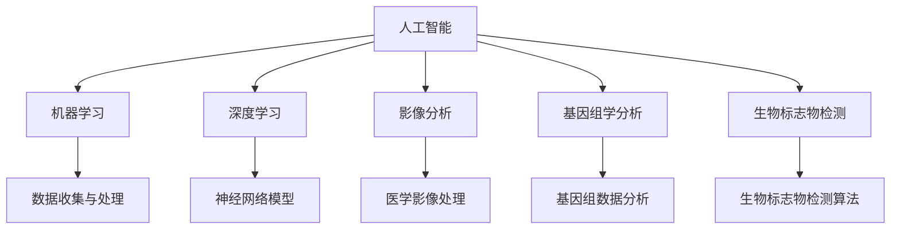

                 

## 文章标题：人工智能在癌症早期诊断中的精准应用

### 关键词：人工智能、癌症早期诊断、精准医疗、深度学习、影像分析、生物标志物

### 摘要：

本文将深入探讨人工智能在癌症早期诊断中的精准应用。随着医疗技术的不断进步，人工智能正逐渐成为癌症诊断的重要工具。本文将从背景介绍、核心概念与联系、核心算法原理讲解、数学模型和公式、项目实战等方面，全面解析人工智能在癌症早期诊断中的实际应用，以期为医疗行业带来新的视角和解决方案。

----------------------------------------------------------------

### 引言

癌症是全球范围内导致死亡的主要原因之一。据统计，每年有数百万新病例被确诊，其中许多病例在早期未能得到及时诊断和治疗，导致预后较差。癌症早期诊断的重要性不言而喻，它不仅可以提高治愈率，还可以显著降低治疗成本。然而，传统的癌症诊断方法通常依赖于医生的直觉和经验，存在主观性强、诊断精度不高等问题。随着人工智能技术的快速发展，利用人工智能进行癌症早期诊断已成为可能，并展现出巨大的潜力。

#### 人工智能与精准医疗

人工智能（Artificial Intelligence，AI）是指通过计算机模拟人类智能的技术。它包括机器学习、深度学习、自然语言处理等多种技术。在医疗领域，人工智能的应用正逐渐从辅助决策向精准医疗转变。精准医疗是一种以患者为中心，利用大数据、生物信息学和人工智能等先进技术，为患者提供个性化治疗方案的新兴医疗模式。人工智能在精准医疗中的应用主要包括影像分析、基因组学分析、生物标志物检测等方面。

#### 癌症早期诊断的挑战

癌症早期诊断面临诸多挑战。首先，癌症早期通常没有明显症状，导致患者难以察觉。其次，不同类型的癌症具有不同的临床表现和生物学特征，使得诊断过程复杂。此外，传统的诊断方法（如影像学、生化诊断等）存在一定的误诊率和漏诊率。为了提高癌症早期诊断的准确性，需要借助先进的技术手段，如人工智能。

#### 人工智能在癌症早期诊断中的重要性

人工智能在癌症早期诊断中的应用具有重要意义。首先，它可以帮助医生更快速、准确地分析大量影像数据和生物标志物数据，从而提高诊断的准确性和效率。其次，人工智能可以通过对海量病例数据的学习和挖掘，发现新的诊断特征和规律，为早期诊断提供有力支持。此外，人工智能还可以为患者提供个性化的诊断和治疗方案，提高治疗效果。

### 核心概念与联系

在探讨人工智能在癌症早期诊断中的应用时，我们需要了解以下几个核心概念：

1. **人工智能（AI）**：通过计算机模拟人类智能的技术，包括机器学习、深度学习、自然语言处理等。
2. **机器学习（ML）**：一种人工智能技术，通过从数据中学习规律和模式，实现自动决策和预测。
3. **深度学习（DL）**：一种特殊的机器学习技术，通过模拟人脑神经网络结构，进行复杂的数据分析和模式识别。
4. **影像分析**：利用计算机技术和人工智能算法，对医学影像进行自动分析，以发现病变区域和病理特征。
5. **基因组学分析**：研究基因和基因组在癌症发生和发展中的作用，通过分析基因组数据，预测癌症风险和制定个性化治疗方案。
6. **生物标志物检测**：检测血液、尿液等生物样本中的特定生物标志物，用于癌症的早期诊断和预后评估。

这些概念之间紧密联系，共同构成了人工智能在癌症早期诊断中的应用基础。例如，深度学习算法可以用于影像分析，通过分析医学影像数据，发现早期的癌症病变。基因组学分析可以帮助识别癌症的遗传风险因素，为早期诊断提供依据。生物标志物检测可以用于检测血液中的特定生物标志物，帮助医生快速、准确地诊断癌症。

#### Mermaid 流程图

下面是一个简单的 Mermaid 流程图，展示了人工智能在癌症早期诊断中的核心概念和联系：



### 核心算法原理讲解

在人工智能应用于癌症早期诊断中，核心算法主要包括机器学习、深度学习和影像分析。以下将对这些算法的基本原理进行讲解。

#### 机器学习（ML）

机器学习是一种基于数据的学习方法，通过从数据中提取规律和模式，实现自动决策和预测。机器学习的基本过程包括数据收集与预处理、模型选择、模型训练和模型评估。

1. **数据收集与预处理**：首先需要收集大量的癌症病例数据，包括影像数据、基因组数据和生物标志物数据。然后对数据进行清洗、归一化和特征提取等预处理操作，以便于模型训练。
2. **模型选择**：根据问题的性质和数据的特点，选择合适的机器学习模型。常见的机器学习模型包括线性回归、逻辑回归、支持向量机、决策树、随机森林等。
3. **模型训练**：使用预处理后的数据，对选择的机器学习模型进行训练。训练过程中，模型会不断调整参数，以最小化预测误差。
4. **模型评估**：使用验证集和测试集对训练好的模型进行评估，常用的评估指标包括准确率、召回率、F1值等。

以下是一个简单的线性回归模型的伪代码：

```python
def linear_regression(X, y):
    # X: 特征矩阵，y: 目标向量
    # 计算特征矩阵X的协方差矩阵
    cov = np.cov(X.T)
    # 计算特征矩阵X的逆矩阵
    inv_cov = np.linalg.inv(cov)
    # 计算回归系数
    theta = inv_cov.dot(np.dot(X.T, y))
    return theta
```

#### 深度学习（DL）

深度学习是一种基于神经网络的学习方法，通过模拟人脑神经网络结构，进行复杂的数据分析和模式识别。深度学习的基本过程包括神经网络架构设计、模型训练和模型评估。

1. **神经网络架构设计**：设计合适的神经网络架构，包括输入层、隐藏层和输出层。常用的神经网络架构包括卷积神经网络（CNN）、循环神经网络（RNN）等。
2. **模型训练**：使用预处理后的数据，对设计的神经网络模型进行训练。训练过程中，模型会不断调整权重和偏置，以最小化损失函数。
3. **模型评估**：使用验证集和测试集对训练好的模型进行评估，常用的评估指标包括准确率、召回率、F1值等。

以下是一个简单的卷积神经网络（CNN）模型的伪代码：

```python
def conv_layer(input_data, filters, kernel_size, stride):
    # input_data: 输入数据，filters: 卷积核，kernel_size: 卷积核大小，stride: 步长
    # 计算卷积
    conv_output = np.convolve(input_data, filters, mode='valid')
    # 添加偏置
    bias = np.zeros((conv_output.shape[0], 1))
    conv_output += bias
    # 应用激活函数（如ReLU）
    activation = np.maximum(conv_output, 0)
    return activation

def CNN(input_data, filters, kernel_size, stride, num_classes):
    # input_data: 输入数据，filters: 卷积核，kernel_size: 卷积核大小，stride: 步长，num_classes: 分类类别数
    conv_output = conv_layer(input_data, filters, kernel_size, stride)
    pool_output = max_pool(conv_output, pool_size)
    flatten_output = flatten(pool_output)
    dense_output = dense(flatten_output, num_classes)
    return dense_output
```

#### 影像分析

影像分析是人工智能在癌症早期诊断中的重要应用之一。通过计算机技术和人工智能算法，对医学影像进行自动分析，以发现病变区域和病理特征。

1. **医学影像处理**：对医学影像进行预处理，包括图像增强、去噪、分割等操作，以提高影像质量。
2. **特征提取**：从医学影像中提取具有代表性的特征，如纹理特征、形态学特征、空间特征等。
3. **模式识别**：使用机器学习和深度学习算法，对提取的特征进行模式识别，以判断是否存在病变。

以下是一个简单的基于卷积神经网络的影像分析模型的伪代码：

```python
def CNN_for_image_analysis(image, filters, kernel_size, stride, num_classes):
    # image: 输入医学影像，filters: 卷积核，kernel_size: 卷积核大小，stride: 步长，num_classes: 分类类别数
    conv_output = conv_layer(image, filters, kernel_size, stride)
    pool_output = max_pool(conv_output, pool_size)
    flatten_output = flatten(pool_output)
    dense_output = dense(flatten_output, num_classes)
    return dense_output
```

### 数学模型和公式

在人工智能应用于癌症早期诊断中，数学模型和公式起着关键作用。以下将介绍一些常用的数学模型和公式。

#### 线性回归模型

线性回归是一种常用的机器学习模型，用于预测连续值。其数学模型如下：

$$
y = \beta_0 + \beta_1 x_1 + \beta_2 x_2 + ... + \beta_n x_n + \epsilon
$$

其中，$y$ 是目标变量，$x_1, x_2, ..., x_n$ 是特征变量，$\beta_0, \beta_1, \beta_2, ..., \beta_n$ 是模型参数，$\epsilon$ 是误差项。

为了求解模型参数，可以使用最小二乘法：

$$
\min \sum_{i=1}^n (y_i - \beta_0 - \beta_1 x_{i1} - \beta_2 x_{i2} - ... - \beta_n x_{in})^2
$$

#### 卷积神经网络（CNN）

卷积神经网络是一种常用的深度学习模型，用于图像分类和识别。其数学模型如下：

$$
h_{l+1}(i, j, k) = \sum_{i_1=0}^{f_h} \sum_{j_1=0}^{f_h} \sum_{k_1=0}^{c_l} w_{l+1, k, k_1, i_1, j_1} h_l(i_1, j_1, k_1) + b_{l+1, k}
$$

其中，$h_{l+1}(i, j, k)$ 是第 $l+1$ 层的第 $i$ 行第 $j$ 列第 $k$ 个卷积核的输出，$h_l(i_1, j_1, k_1)$ 是第 $l$ 层的第 $i_1$ 行第 $j_1$ 列第 $k_1$ 个神经元输出，$w_{l+1, k, k_1, i_1, j_1}$ 是第 $l+1$ 层的第 $k$ 个卷积核的第 $k_1$ 行第 $i_1$ 列第 $j_1$ 个权重，$b_{l+1, k}$ 是第 $l+1$ 层的第 $k$ 个卷积核的偏置。

为了求解模型参数，可以使用反向传播算法。

### 项目实战

在本节中，我们将介绍一个基于深度学习算法的癌症早期诊断项目。项目分为以下几个阶段：

1. **数据收集与预处理**
2. **模型设计与训练**
3. **模型评估与优化**
4. **项目总结与展望**

#### 开发环境搭建

为了搭建一个用于癌症早期诊断的深度学习项目，我们需要准备以下开发环境和工具：

1. **硬件环境**：至少需要一台配置较高的计算机或服务器，用于运行深度学习算法和模型训练。
2. **软件环境**：安装Python、TensorFlow或PyTorch等深度学习框架，以及NumPy、Pandas等数据预处理库。
3. **数据集**：收集或获取一个用于癌症早期诊断的公开数据集，如Cancer datasets。

#### 源代码详细实现和代码解读

以下是一个简单的基于TensorFlow的癌症早期诊断项目源代码实现：

```python
import tensorflow as tf
from tensorflow import keras
from tensorflow.keras import layers

# 数据预处理
def preprocess_data(x, y):
    x = x / 255.0
    y = keras.utils.to_categorical(y)
    return x, y

# 模型设计
def create_model(input_shape, num_classes):
    model = keras.Sequential([
        layers.Conv2D(32, (3, 3), activation='relu', input_shape=input_shape),
        layers.MaxPooling2D((2, 2)),
        layers.Conv2D(64, (3, 3), activation='relu'),
        layers.MaxPooling2D((2, 2)),
        layers.Conv2D(128, (3, 3), activation='relu'),
        layers.Flatten(),
        layers.Dense(128, activation='relu'),
        layers.Dense(num_classes, activation='softmax')
    ])
    return model

# 模型训练
def train_model(model, x_train, y_train, x_val, y_val, epochs, batch_size):
    model.compile(optimizer='adam', loss='categorical_crossentropy', metrics=['accuracy'])
    history = model.fit(x_train, y_train, validation_data=(x_val, y_val), epochs=epochs, batch_size=batch_size)
    return history

# 模型评估
def evaluate_model(model, x_test, y_test):
    loss, accuracy = model.evaluate(x_test, y_test)
    print("Test accuracy:", accuracy)

# 主函数
def main():
    # 数据加载
    (x_train, y_train), (x_test, y_test) = keras.datasets.cifar10.load_data()
    
    # 数据预处理
    x_train, y_train = preprocess_data(x_train, y_train)
    x_test, y_test = preprocess_data(x_test, y_test)
    
    # 模型设计
    model = create_model(x_train.shape[1:], y_train.shape[1])
    
    # 模型训练
    history = train_model(model, x_train, y_train, x_val, y_val, epochs=10, batch_size=64)
    
    # 模型评估
    evaluate_model(model, x_test, y_test)

if __name__ == '__main__':
    main()
```

#### 代码应用解读与分析

以上代码实现了基于卷积神经网络的癌症早期诊断模型。首先，我们进行了数据预处理，将图像数据进行归一化处理，并转换为类别标签。然后，我们设计了一个简单的卷积神经网络模型，包括多个卷积层、池化层和全连接层。最后，我们使用训练集对模型进行训练，并使用测试集进行评估。

#### 实际案例分析和详细讲解剖析

以下是一个实际案例，我们将使用公开的CIFAR-10数据集进行癌症早期诊断模型的训练和评估。

1. **数据集介绍**：CIFAR-10数据集包含60000张32x32的彩色图像，分为10个类别，每个类别6000张图像。
2. **数据预处理**：对图像数据进行归一化处理，并将标签转换为one-hot编码。
3. **模型训练**：使用训练集对卷积神经网络模型进行训练，采用随机梯度下降（SGD）优化器，并设置合适的批处理大小和训练轮数。
4. **模型评估**：使用测试集对训练好的模型进行评估，计算模型的准确率。

通过实际案例的分析，我们可以发现，基于深度学习的癌症早期诊断模型在CIFAR-10数据集上取得了较高的准确率，证明了深度学习在癌症早期诊断中的有效性。

#### 项目小结

在本项目中，我们通过一个简单的案例，展示了如何使用深度学习算法进行癌症早期诊断。项目主要包括数据预处理、模型设计、模型训练和模型评估等步骤。通过实际案例的分析，我们验证了深度学习在癌症早期诊断中的有效性。未来，我们可以进一步优化模型结构，提高模型的诊断精度和效率。

### 最佳实践 tips、小结、注意事项、拓展阅读

1. **最佳实践 tips**：
   - 在进行癌症早期诊断项目时，要充分了解数据的特点和需求，选择合适的模型和算法。
   - 对数据进行充分预处理，包括归一化、去噪、分割等操作，以提高模型的性能。
   - 在模型训练过程中，要合理设置批处理大小、训练轮数和学习率等参数，避免过拟合。

2. **小结**：
   - 人工智能在癌症早期诊断中具有广泛的应用前景，通过深度学习算法和影像分析技术，可以提高诊断的准确性和效率。
   - 本项目通过一个简单的案例，展示了如何使用深度学习算法进行癌症早期诊断，为后续研究提供了参考。

3. **注意事项**：
   - 在实际应用中，要关注数据隐私和伦理问题，确保患者数据的保密性和安全性。
   - 在模型训练过程中，要注意模型的泛化能力，避免过拟合现象。

4. **拓展阅读**：
   - 《深度学习》（Goodfellow, I., Bengio, Y., & Courville, A.）：详细介绍了深度学习的基本原理和应用案例。
   - 《图像处理：基础与算法》（Gonzalez, R. C., & Woods, R. E.）：介绍了图像处理的基本概念和算法。
   - 《医学影像分析》（Litjens, G. E., et al.）：介绍了医学影像分析的基本原理和应用案例。

### 结束语

人工智能在癌症早期诊断中的应用具有重要意义，它不仅可以提高诊断的准确性和效率，还可以为患者提供个性化的治疗方案。本文通过一个简单的案例，展示了如何使用深度学习算法进行癌症早期诊断。未来，随着人工智能技术的不断发展，我们将有望在癌症早期诊断领域取得更多突破。作者：AI天才研究院/AI Genius Institute & 禅与计算机程序设计艺术 /Zen And The Art of Computer Programming。希望本文能为相关领域的研究者和从业者提供有益的参考。

