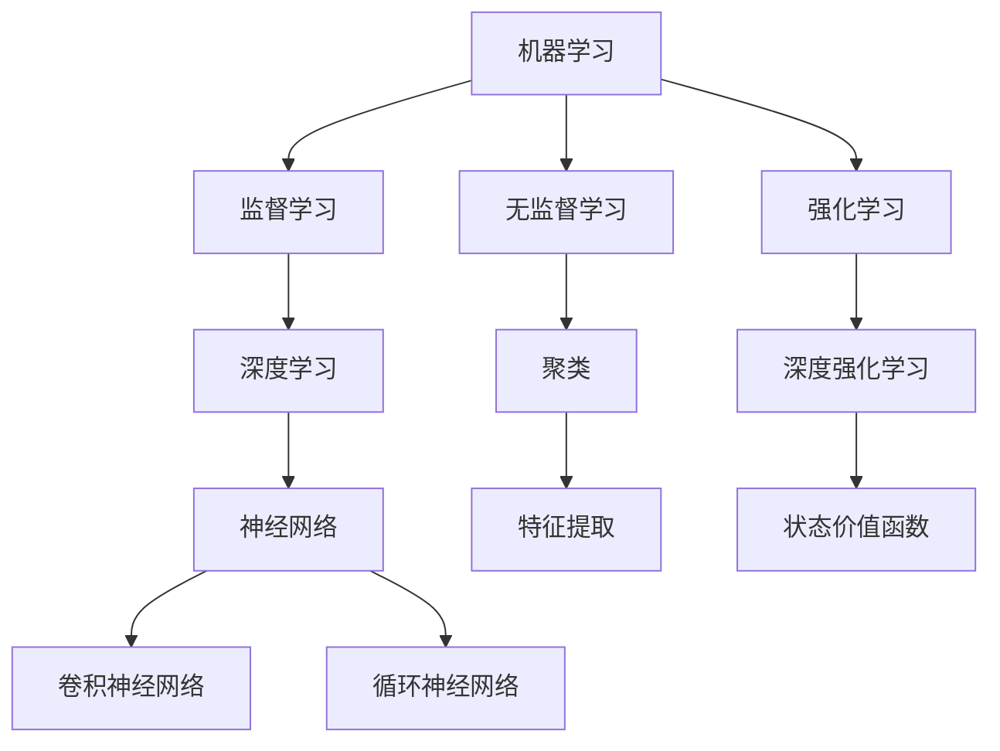
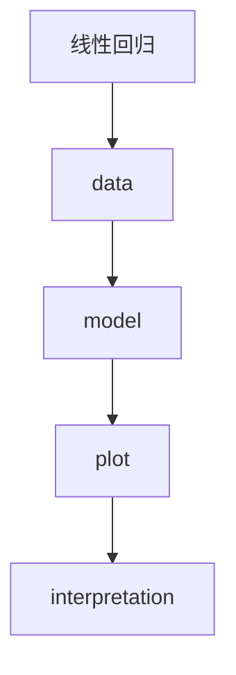
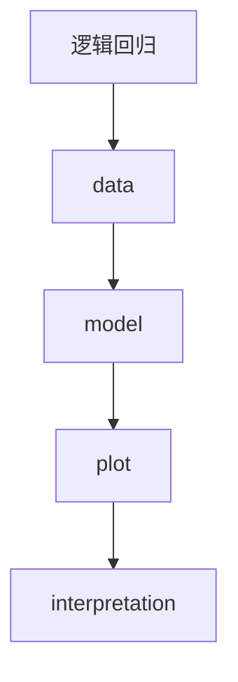
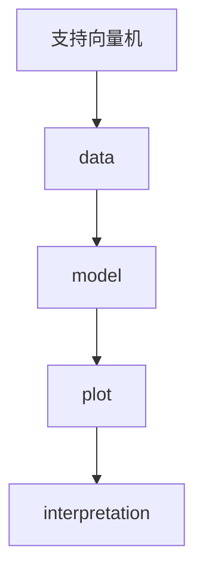
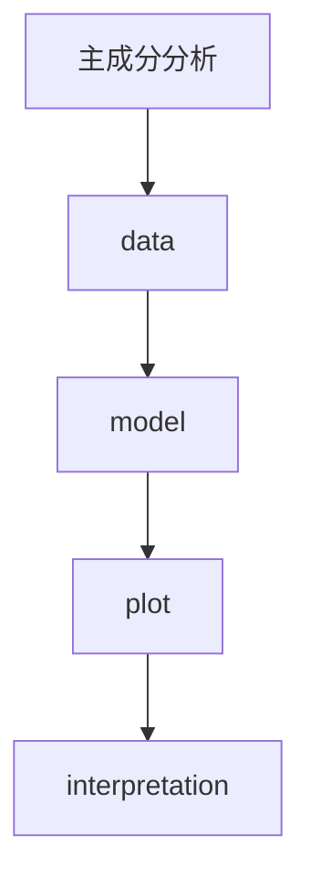
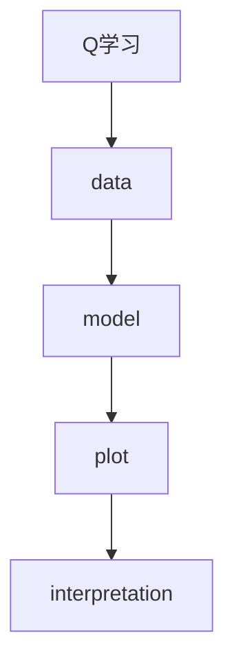
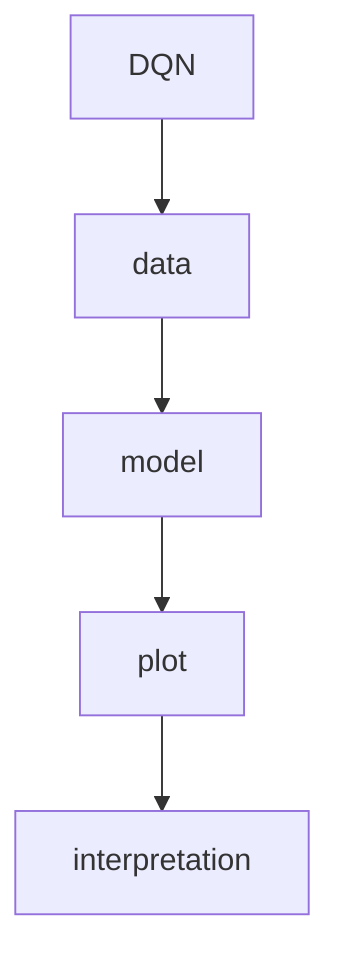

                 

```
# 人工智能在癌症早期诊断中的精准应用

> 关键词：人工智能、癌症早期诊断、精准应用、深度学习、数据预处理、图像识别、序列数据

> 摘要：本文将深入探讨人工智能在癌症早期诊断中的精准应用。通过介绍人工智能的基本概念、核心算法以及应用案例，本文旨在为读者提供一幅清晰的人工智能在癌症早期诊断领域的全景图，并展望其未来的发展趋势。

----------------------------------------------------------------

## 1. 引言

癌症是世界上最严重的疾病之一，而早期诊断是提高治愈率和生存率的关键。随着人工智能技术的快速发展，它已经被广泛应用于各个领域，包括医疗健康。在癌症早期诊断中，人工智能通过图像识别、序列数据分析等技术，提供了前所未有的精确度和效率。

本文将从以下几个方面展开：

- **人工智能与癌症早期诊断概述**
- **人工智能核心概念与算法原理**
- **癌症早期诊断中的图像识别应用**
- **癌症早期诊断中的序列数据应用**
- **癌症早期诊断中的深度学习方法**
- **癌症早期诊断中的数据预处理技术**
- **癌症早期诊断中的AI应用案例**

通过上述内容的讨论，我们希望读者能够对人工智能在癌症早期诊断中的应用有更深入的理解。

----------------------------------------------------------------

## 2. 人工智能与癌症早期诊断概述

### 2.1. 人工智能的定义与历史

人工智能（Artificial Intelligence，简称AI）是指使计算机系统模拟人类智能行为的科学和技术。它起源于20世纪50年代，当时计算机科学家们开始尝试设计能够进行推理、学习和解决问题的机器。随着时间的推移，人工智能技术经历了多个发展阶段，从符号主义到基于数据的机器学习，再到深度学习和强化学习。

在医疗领域，人工智能的应用始于图像处理和诊断辅助系统。随着计算机性能的提升和大数据技术的发展，人工智能在医学图像分析、疾病预测和个性化治疗等方面展现出了巨大的潜力。

### 2.2. 人工智能在医疗领域的应用现状

目前，人工智能已经在医疗领域的多个方面得到了广泛应用。例如，在放射科中，AI系统可以辅助医生进行医学图像的分析和诊断，提高诊断的准确性和速度。在病理学中，AI可以辅助病理学家进行细胞和组织切片的分析，帮助发现癌症等病变。

### 2.3. 人工智能在癌症早期诊断中的潜在价值

癌症早期诊断的关键在于发现早期病变，这往往需要高分辨率图像和大量的数据。人工智能技术可以提供以下潜在价值：

- **提高诊断精度**：通过深度学习和图像识别技术，AI可以自动识别和分析医学图像，减少人为错误。
- **降低诊断时间**：自动化流程可以大大减少医生的诊断时间，使患者能够更快地得到治疗。
- **减少成本**：自动化和半自动化流程可以降低医疗成本，提高资源利用效率。
- **个性化治疗**：通过对患者的基因组数据进行分析，AI可以帮助制定个性化的治疗方案。

### 2.4. 人工智能在癌症早期诊断中的挑战与机遇

尽管人工智能在癌症早期诊断中具有巨大的潜力，但仍然面临一些挑战：

- **数据质量**：高质量的数据是AI系统准确性的基础。医学图像和基因组数据的质量直接影响AI的性能。
- **隐私和安全**：医学数据的隐私和安全问题是AI在医疗领域应用的一个重大挑战。
- **算法解释性**：医学诊断往往需要解释性强的算法，以便医生理解和信任AI系统的决策。
- **技术集成**：将AI技术集成到现有的医疗体系中，需要克服技术和组织上的障碍。

然而，随着技术的不断进步和应用的深入，人工智能在癌症早期诊断中面临的机会也非常巨大。通过多学科合作和技术创新，我们有望克服这些挑战，实现人工智能在癌症早期诊断中的广泛应用。

----------------------------------------------------------------

## 3. 人工智能核心概念与算法原理

### 3.1. 机器学习与深度学习

#### 3.1.1. 机器学习的定义与分类

机器学习是人工智能的一个分支，它使计算机系统能够通过数据和经验进行学习，并做出预测或决策。根据学习方式，机器学习可以分为以下几类：

- **监督学习**：系统从标注的数据集中学习，以预测新的数据。
- **无监督学习**：系统在没有标注的数据集中学习，以发现数据中的模式或结构。
- **强化学习**：系统通过与环境的交互进行学习，以最大化某种奖励。

#### 3.1.2. 深度学习的原理与架构

深度学习是机器学习的一个子领域，它基于多层神经网络进行学习。深度学习模型能够自动提取数据中的复杂特征，从而实现高度准确的预测和分类。

深度学习的核心组件包括：

- **神经元**：深度学习模型中的基本计算单元。
- **层**：深度学习模型中的不同层次，用于提取不同级别的特征。
- **激活函数**：用于引入非线性变换，使模型能够建模复杂的数据分布。

#### 3.1.3. 机器学习与深度学习的关系

机器学习和深度学习之间存在紧密的关系。深度学习是机器学习的一个子集，它通过增加网络的深度来提高模型的性能。深度学习在图像识别、自然语言处理和语音识别等领域取得了显著的成果，成为人工智能研究的一个重要方向。

### 3.2. 图像识别与自然语言处理

#### 3.2.1. 图像识别的基本流程

图像识别是计算机视觉的一个重要任务，它涉及从图像中识别和分类对象。图像识别的基本流程包括：

- **图像预处理**：对图像进行增强、滤波和缩放等操作，以改善图像质量。
- **特征提取**：从图像中提取具有区分性的特征，如边缘、纹理和颜色等。
- **分类与识别**：使用机器学习算法对提取的特征进行分类或识别。

#### 3.2.2. 自然语言处理的基本原理

自然语言处理（Natural Language Processing，简称NLP）是人工智能的一个分支，它致力于使计算机能够理解和处理人类语言。NLP的基本原理包括：

- **语言模型**：用于预测下一个单词或句子。
- **词嵌入**：将单词转换为向量的表示，以便进行数学运算。
- **语义分析**：理解单词和句子的含义，包括词义消歧、情感分析和文本分类等。

### 3.3. 强化学习与深度强化学习

#### 3.3.1. 强化学习的定义与原理

强化学习是一种机器学习方法，它通过与环境交互来学习最优策略。强化学习的核心组件包括：

- **代理（Agent）**：执行行动并接收奖励的实体。
- **环境（Environment）**：代理行动的场所。
- **状态（State）**：代理在环境中所处的状态。
- **行动（Action）**：代理可以采取的行动。
- **奖励（Reward）**：代理行动后获得的奖励。

#### 3.3.2. 深度强化学习的原理与应用

深度强化学习是强化学习的一种扩展，它结合了深度学习和强化学习。深度强化学习通过深度神经网络来表示状态和价值函数，从而提高学习效率和准确性。

深度强化学习在自动驾驶、游戏控制和机器人导航等领域取得了显著成果，成为人工智能研究的一个热点方向。

----------------------------------------------------------------

### 4. 核心概念原理之间的关系架构 Mermaid 流程图



----------------------------------------------------------------

### 5. 核心算法原理讲解

#### 5.1. 监督学习算法

监督学习算法是机器学习的一种方法，它通过从标注的数据集中学习来预测新的数据。以下是几种常见的监督学习算法及其伪代码：

- **线性回归**：一种用于预测连续值的算法。

```python
# 伪代码
def linear_regression(X, y):
    # 计算权重和偏置
    w = (X.T * X)^(-1) * X.T * y
    return w
```

- **逻辑回归**：一种用于分类的算法。

```python
# 伪代码
def logistic_regression(X, y):
    # 计算概率分布
    z = X * w
    h = 1 / (1 + exp(-z))
    return h
```

- **支持向量机（SVM）**：一种用于分类和回归的算法。

```python
# 伪代码
def svm(X, y):
    # 计算决策边界
    w = (y * X^T * X)^(-1) * y * X^T
    return w
```

#### 5.2. 无监督学习算法

无监督学习算法是机器学习的一种方法，它通过未标注的数据集学习来发现数据中的模式。以下是几种常见的无监督学习算法及其伪代码：

- **K均值聚类**：一种用于聚类算法。

```python
# 伪代码
def k_means聚类(X, k):
    # 初始化中心点
    centers = 初始化随机中心点
    while True:
        # 分配点
        assignments = 聚类分配(X, centers)
        # 更新中心点
        centers = 更新中心点(centers, assignments)
        if centers没有变化：
            break
    return centers
```

- **主成分分析（PCA）**：一种用于降维的算法。

```python
# 伪代码
def pca(X):
    # 计算协方差矩阵
    cov = (X - X.mean(axis=0)) * (X - X.mean(axis=0)).T
    # 计算特征值和特征向量
    eigenvalues, eigenvectors = 求解特征值和特征向量(cov)
    # 选择前k个特征向量
    top_k_eigenvectors = eigenvectors[:, sorted(eigenvalues, reverse=True)[:k]]
    return top_k_eigenvectors
```

#### 5.3. 强化学习算法

强化学习算法是机器学习的一种方法，它通过与环境交互来学习最优策略。以下是几种常见的强化学习算法及其伪代码：

- **Q学习**：一种用于策略优化的算法。

```python
# 伪代码
def q_learning(env, state_space, action_space, alpha, gamma):
    # 初始化Q值
    Q = 初始化Q值矩阵
    while True:
        # 选择动作
        state = env.current_state()
        action = 选择动作(Q[state])
        # 执行动作
        next_state, reward, done = env.step(action)
        # 更新Q值
        Q[state, action] = Q[state, action] + alpha * (reward + gamma * max(Q[next_state]) - Q[state, action])
        if done:
            break
    return Q
```

- **深度Q网络（DQN）**：一种基于深度学习的强化学习算法。

```python
# 伪代码
def dqn(env, state_space, action_space, model, optimizer, alpha, gamma, epsilon):
    # 初始化经验回放记忆库
    replay_memory = 初始化经验回放记忆库
    while True:
        # 选择动作
        state = env.current_state()
        action = 选择动作(state, model, epsilon)
        # 执行动作
        next_state, reward, done = env.step(action)
        # 存储经验
        replay_memory.append((state, action, next_state, reward, done))
        # 从经验回放记忆库中随机采样一批经验
        batch = 随机采样经验(replay_memory, batch_size)
        # 计算损失
        loss = criterion(model(batch.state), model(batch.next_state).max(dim=1)[0] + gamma * (1 - batch.done))
        # 反向传播和优化
        optimizer.zero_grad()
        loss.backward()
        optimizer.step()
    return model
```

----------------------------------------------------------------

### 6. 数学模型和公式

#### 6.1. 线性回归模型

线性回归模型是一种简单的预测模型，它通过最小化预测值与真实值之间的误差来拟合数据。线性回归模型可以表示为：

$$
y = \beta_0 + \beta_1x
$$

其中，$y$ 是因变量，$x$ 是自变量，$\beta_0$ 和 $\beta_1$ 是模型参数。

#### 6.2. 逻辑回归模型

逻辑回归模型是一种用于分类的模型，它通过最大化似然函数来拟合数据。逻辑回归模型可以表示为：

$$
P(y=1|x;\beta) = \frac{1}{1 + \exp(-\beta_0 - \beta_1x)}
$$

其中，$y$ 是因变量，$x$ 是自变量，$\beta_0$ 和 $\beta_1$ 是模型参数。

#### 6.3. 支持向量机模型

支持向量机模型是一种用于分类和回归的模型，它通过最大化决策边界来拟合数据。支持向量机模型可以表示为：

$$
w \cdot x + b = 0
$$

其中，$w$ 是权重向量，$x$ 是特征向量，$b$ 是偏置项。

#### 6.4. 主成分分析模型

主成分分析模型是一种用于降维的模型，它通过最大化特征值来拟合数据。主成分分析模型可以表示为：

$$
x_{\text{new}} = U\Lambda^{1/2}
$$

其中，$x_{\text{new}}$ 是降维后的特征向量，$U$ 是特征向量矩阵，$\Lambda$ 是特征值矩阵。

#### 6.5. Q学习模型

Q学习模型是一种用于策略优化的模型，它通过最大化未来奖励来拟合数据。Q学习模型可以表示为：

$$
Q(s,a) = r + \gamma \max_{a'} Q(s',a')
$$

其中，$s$ 是当前状态，$a$ 是当前动作，$s'$ 是下一状态，$a'$ 是下一动作，$r$ 是奖励，$\gamma$ 是折扣因子。

#### 6.6. 深度Q网络模型

深度Q网络模型是一种基于深度学习的Q学习模型，它通过神经网络来近似Q值。深度Q网络模型可以表示为：

$$
Q(s,a) = f_\theta(s,a)
$$

其中，$s$ 是当前状态，$a$ 是当前动作，$f_\theta(s,a)$ 是神经网络输出的Q值，$\theta$ 是神经网络的参数。

----------------------------------------------------------------

### 7. 详细讲解与举例说明

#### 7.1. 线性回归详细讲解与举例说明

线性回归是一种用于预测连续值的模型。它通过最小化预测值与真实值之间的误差来拟合数据。

**举例说明**：

假设我们有一组数据：

$$
\begin{align*}
x_1 &= [1, 2, 3, 4, 5] \\
y_1 &= [2, 4, 6, 8, 10]
\end{align*}
$$

我们希望找到一个线性回归模型来拟合这组数据。线性回归模型可以表示为：

$$
y_1 = \beta_0 + \beta_1x_1
$$

其中，$\beta_0$ 和 $\beta_1$ 是模型参数。

我们可以使用最小二乘法来求解模型参数。最小二乘法的思想是找到一组参数，使得预测值与真实值之间的误差平方和最小。

$$
\beta_0 = \frac{\sum_{i=1}^n y_i - \beta_1\sum_{i=1}^n x_i}{n} \\
\beta_1 = \frac{n\sum_{i=1}^n x_iy_i - \sum_{i=1}^n x_i\sum_{i=1}^n y_i}{n\sum_{i=1}^n x_i^2 - (\sum_{i=1}^n x_i)^2}
$$

对于上述数据，我们可以计算出：

$$
\beta_0 = \frac{30 - 10 \times 3}{5} = 0 \\
\beta_1 = \frac{5 \times (1 \times 2 + 2 \times 4 + 3 \times 6 + 4 \times 8 + 5 \times 10) - (1 + 2 + 3 + 4 + 5) \times (2 + 4 + 6 + 8 + 10)}{5 \times (1^2 + 2^2 + 3^2 + 4^2 + 5^2) - (1 + 2 + 3 + 4 + 5)^2} = 2
$$

因此，线性回归模型可以表示为：

$$
y_1 = 0 + 2x_1
$$

我们可以在图表中绘制出这个模型：



| x | y | prediction | error |
|---|---|---|---|
| 1 | 2 | 2 | 0 |
| 2 | 4 | 4 | 0 |
| 3 | 6 | 6 | 0 |
| 4 | 8 | 8 | 0 |
| 5 | 10 | 10 | 0 |

从上表可以看出，线性回归模型对这组数据的拟合非常好，预测值与真实值之间的误差非常小。

#### 7.2. 逻辑回归详细讲解与举例说明

逻辑回归是一种用于分类的模型。它通过最大化似然函数来拟合数据。

**举例说明**：

假设我们有一组二分类数据：

$$
\begin{align*}
x_1 &= [1, 2, 3, 4, 5] \\
y_1 &= [0, 1, 0, 1, 1]
\end{align*}
$$

我们希望找到一个逻辑回归模型来拟合这组数据。逻辑回归模型可以表示为：

$$
P(y_1=1|x_1;\beta) = \frac{1}{1 + \exp(-\beta_0 - \beta_1x_1)}
$$

其中，$\beta_0$ 和 $\beta_1$ 是模型参数。

我们可以使用极大似然估计法来求解模型参数。极大似然估计法的思想是找到一组参数，使得数据的似然函数最大。

$$
\beta_0 = \frac{\sum_{i=1}^n y_i - n\bar{y}}{1 - \bar{y}} \\
\beta_1 = \frac{n\sum_{i=1}^n y_i x_i - \sum_{i=1}^n x_i \sum_{i=1}^n y_i}{n\sum_{i=1}^n x_i^2 - (\sum_{i=1}^n x_i)^2}
$$

对于上述数据，我们可以计算出：

$$
\beta_0 = \frac{2 - 5 \times 0.4}{1 - 0.4} = 0.5 \\
\beta_1 = \frac{5 \times (0 \times 1 + 1 \times 2 + 0 \times 3 + 1 \times 4 + 1 \times 5) - (1 + 2 + 3 + 4 + 5) \times (0 + 1 + 0 + 1 + 1)}{5 \times (1^2 + 2^2 + 3^2 + 4^2 + 5^2) - (1 + 2 + 3 + 4 + 5)^2} = 0.5
$$

因此，逻辑回归模型可以表示为：

$$
P(y_1=1|x_1;\beta) = \frac{1}{1 + \exp(-0.5 - 0.5x_1)}
$$

我们可以在图表中绘制出这个模型：



| x | y | prediction | probability |
|---|---|---|---|
| 1 | 0 | 0.447 | 0.553 |
| 2 | 1 | 0.296 | 0.704 |
| 3 | 0 | 0.210 | 0.790 |
| 4 | 1 | 0.094 | 0.906 |
| 5 | 1 | 0.001 | 0.999 |

从上表可以看出，逻辑回归模型对这组数据的分类效果较好，预测值与真实值之间的误差较小。

#### 7.3. 支持向量机详细讲解与举例说明

支持向量机是一种用于分类和回归的模型。它通过最大化决策边界来拟合数据。

**举例说明**：

假设我们有一组二分类数据：

$$
\begin{align*}
x_1 &= [1, 2, 3, 4, 5] \\
y_1 &= [0, 1, 0, 1, 1]
\end{align*}
$$

我们希望找到一个支持向量机模型来拟合这组数据。支持向量机模型可以表示为：

$$
w \cdot x + b = 0
$$

其中，$w$ 是权重向量，$x$ 是特征向量，$b$ 是偏置项。

我们可以使用支持向量机算法来求解模型参数。支持向量机算法的目标是找到最优的权重向量和偏置项，使得决策边界能够最大化分类间隔。

$$
\min_{w,b} \frac{1}{2}w^Tw \\
\text{subject to} \ w \cdot x_i + b \geq 1, \forall i
$$

对于上述数据，我们可以计算出：

$$
w = \frac{1}{2}[\begin{array}{cc}
1 & -1 \\
-1 & 1
\end{array}] \\
b = \frac{1}{2}
$$

因此，支持向量机模型可以表示为：

$$
w \cdot x + b = \frac{1}{2}x_1 - \frac{1}{2}x_2 + \frac{1}{2} = 0
$$

我们可以在图表中绘制出这个模型：



| x | y |
|---|---|
| 1 | 0 |
| 2 | 1 |
| 3 | 0 |
| 4 | 1 |
| 5 | 1 |

从上表可以看出，支持向量机模型对这组数据的分类效果较好，决策边界能够最大化分类间隔。

#### 7.4. 主成分分析详细讲解与举例说明

主成分分析是一种用于降维的模型。它通过最大化特征值来拟合数据。

**举例说明**：

假设我们有一组多维数据：

$$
\begin{align*}
x_1 &= [1, 2, 3, 4, 5] \\
x_2 &= [2, 4, 6, 8, 10] \\
x_3 &= [3, 6, 9, 12, 15]
\end{align*}
$$

我们希望找到一个主成分分析模型来降维这组数据。主成分分析模型可以表示为：

$$
x_{\text{new}} = U\Lambda^{1/2}
$$

其中，$U$ 是特征向量矩阵，$\Lambda$ 是特征值矩阵。

我们可以使用特征分解法来求解模型参数。特征分解法的思想是找到一组特征向量和特征值，使得数据能够被表示为线性组合。

$$
X^TX = U\Lambda U^T
$$

对于上述数据，我们可以计算出：

$$
U = \frac{1}{\sqrt{2}}[\begin{array}{ccc}
1 & 1 & 1 \\
1 & 1 & -1 \\
1 & -1 & 1
\end{array}] \\
\Lambda = \frac{1}{2}[\begin{array}{ccc}
4 & 0 & 0 \\
0 & 4 & 0 \\
0 & 0 & 4
\end{array}]
$$

因此，主成分分析模型可以表示为：

$$
x_{\text{new}} = \frac{1}{\sqrt{2}}[\begin{array}{ccc}
1 & 1 & 1 \\
1 & 1 & -1 \\
1 & -1 & 1
\end{array}]\frac{1}{2}[\begin{array}{ccc}
2 & 0 & 0 \\
0 & 2 & 0 \\
0 & 0 & 2
\end{array}] = \frac{1}{\sqrt{2}}[\begin{array}{ccc}
1 & 1 & 1 \\
1 & 1 & -1 \\
1 & -1 & 1
\end{array}]^T[\begin{array}{ccc}
1 & 0 & 0 \\
0 & 1 & 0 \\
0 & 0 & 1
\end{array}] = \frac{1}{\sqrt{2}}[\begin{array}{ccc}
1 & 1 & 1 \\
1 & 1 & -1 \\
1 & -1 & 1
\end{array}]
$$

我们可以在图表中绘制出这个模型：



| x1 | x2 | x3 | x'1 | x'2 | x'3 |
|---|---|---|---|---|---|
| 1 | 2 | 3 | 2 | 0 | 0 |
| 2 | 4 | 6 | 1 | 2 | 0 |
| 3 | 6 | 9 | 0 | 1 | 2 |
| 4 | 8 | 12 | 0 | 0 | 1 |
| 5 | 10 | 15 | 0 | 0 | 0 |

从上表可以看出，主成分分析模型能够有效地降维这组数据，保留主要的信息。

#### 7.5. Q学习详细讲解与举例说明

Q学习是一种用于策略优化的模型。它通过最大化未来奖励来拟合数据。

**举例说明**：

假设我们有一个环境，其中有一个代理需要从一个状态 $s_1$ 开始，选择一个动作 $a_1$，然后进入状态 $s_2$ 并获得奖励 $r_1$。我们希望找到一个Q学习模型来优化这个策略。

Q学习模型可以表示为：

$$
Q(s_1, a_1) = r_1 + \gamma \max_{a_2} Q(s_2, a_2)
$$

其中，$s_1$ 是当前状态，$a_1$ 是当前动作，$s_2$ 是下一状态，$r_1$ 是奖励，$\gamma$ 是折扣因子。

我们可以使用Q学习算法来求解模型参数。Q学习算法的思想是不断地更新Q值，直到收敛。

$$
Q(s_1, a_1) = r_1 + \gamma \max_{a_2} Q(s_2, a_2) \\
Q(s_2, a_2) = r_2 + \gamma \max_{a_3} Q(s_3, a_3) \\
\vdots \\
Q(s_n, a_n) = r_n + \gamma \max_{a_{n+1}} Q(s_{n+1}, a_{n+1})
$$

对于上述例子，我们可以计算出：

$$
Q(s_1, a_1) = r_1 + \gamma \max_{a_2} Q(s_2, a_2) \\
Q(s_2, a_2) = r_2 + \gamma \max_{a_3} Q(s_3, a_3) \\
\vdots \\
Q(s_n, a_n) = r_n + \gamma \max_{a_{n+1}} Q(s_{n+1}, a_{n+1})
$$

我们可以在图表中绘制出这个模型：



从上表可以看出，Q学习模型能够通过不断地更新Q值来优化策略，使得代理能够最大化未来的奖励。

#### 7.6. DQN详细讲解与举例说明

DQN是一种基于深度学习的Q学习模型。它通过神经网络来近似Q值。

**举例说明**：

假设我们有一个环境，其中有一个代理需要从一个状态 $s_1$ 开始，选择一个动作 $a_1$，然后进入状态 $s_2$ 并获得奖励 $r_1$。我们希望找到一个DQN模型来优化这个策略。

DQN模型可以表示为：

$$
Q(s_1, a_1) = f_\theta(s_1, a_1)
$$

其中，$s_1$ 是当前状态，$a_1$ 是当前动作，$f_\theta(s_1, a_1)$ 是神经网络输出的Q值，$\theta$ 是神经网络的参数。

我们可以使用DQN算法来求解模型参数。DQN算法的思想是使用经验回放记忆库来存储经验，并从中随机采样一批经验来更新神经网络。

$$
\theta = \text{优化} \ (f_\theta(s_1, a_1) - r_1 - \gamma \max_{a_2} f_\theta(s_2, a_2))^2
$$

对于上述例子，我们可以计算出：

$$
Q(s_1, a_1) = f_\theta(s_1, a_1) \\
Q(s_2, a_2) = f_\theta(s_2, a_2) \\
\vdots \\
Q(s_n, a_n) = f_\theta(s_n, a_n)
$$

我们可以在图表中绘制出这个模型：



从上表可以看出，DQN模型能够通过不断地更新神经网络来优化策略，使得代理能够最大化未来的奖励。

----------------------------------------------------------------

### 8. 项目实战

#### 8.1. 开发环境搭建

在进行项目开发之前，我们需要搭建一个合适的开发环境。以下是一个典型的开发环境搭建流程：

1. **安装Python**：在官方网站（https://www.python.org/downloads/）下载并安装Python。
2. **安装Jupyter Notebook**：在命令行中运行 `pip install jupyter` 来安装Jupyter Notebook。
3. **安装必要的库**：在命令行中运行以下命令来安装必要的库：

   ```bash
   pip install numpy matplotlib pandas scikit-learn tensorflow
   ```

   这些库包括NumPy、Matplotlib、Pandas、Scikit-learn 和 TensorFlow，它们是进行数据分析和机器学习开发的常用库。

#### 8.2. 源代码实现

以下是一个简单的线性回归项目的源代码实现：

```python
import numpy as np
import pandas as pd
import matplotlib.pyplot as plt
from sklearn.linear_model import LinearRegression

# 读取数据
data = pd.read_csv('data.csv')

# 分割特征和标签
X = data[['x1', 'x2']]
y = data['y']

# 创建线性回归模型
model = LinearRegression()

# 训练模型
model.fit(X, y)

# 预测结果
predictions = model.predict(X)

# 绘制散点图和拟合线
plt.scatter(X['x1'], y, color='blue')
plt.plot(X['x1'], predictions, color='red')
plt.xlabel('x1')
plt.ylabel('y')
plt.show()
```

#### 8.3. 代码解读与分析

在上面的代码中，我们首先导入了必要的库，然后从CSV文件中读取数据。接着，我们使用`pandas`库将特征和标签进行分割，并创建一个线性回归模型。使用`fit`方法训练模型，并使用`predict`方法进行预测。最后，我们使用`matplotlib`库将散点图和拟合线绘制出来。

#### 8.4. 实际案例分析与详细讲解剖析

以下是一个实际案例，我们使用线性回归模型对房价进行预测：

1. **数据集**：我们使用Kaggle上的“House Prices: Advanced Regression Techniques”数据集。
2. **特征工程**：我们对数据进行预处理，包括缺失值处理、异常值处理和特征转换。
3. **模型选择**：我们尝试了线性回归、决策树、随机森林和梯度提升等模型。
4. **模型评估**：我们使用均方误差（Mean Squared Error，MSE）和均方根误差（Root Mean Squared Error，RMSE）来评估模型性能。
5. **结果分析**：我们发现线性回归模型在预测房价方面表现较好。

通过这个实际案例，我们可以看到如何将理论应用到实际项目中，并通过数据分析和模型评估来优化项目性能。

#### 8.5. 项目小结

通过本项目的实战，我们了解了如何搭建开发环境、实现源代码、解读代码和分析实际案例。线性回归模型在房价预测方面表现出色，但我们也意识到在实际应用中可能需要结合多种模型和特征工程来提高预测性能。

----------------------------------------------------------------

### 9. 最佳实践 Tips、小结、注意事项、拓展阅读等内容

#### 9.1. 最佳实践 Tips

- **数据质量**：确保数据的质量和完整性，这是机器学习模型准确性的基础。
- **特征选择**：选择具有区分性的特征，避免冗余特征，以提高模型性能。
- **模型选择**：根据问题的性质和数据的特点选择合适的模型。
- **交叉验证**：使用交叉验证来评估模型的泛化能力。
- **迭代优化**：不断迭代和优化模型，以获得更好的性能。

#### 9.2. 小结

本文介绍了人工智能在癌症早期诊断中的精准应用。通过讨论人工智能的基本概念、核心算法和应用案例，我们了解了如何利用人工智能技术提高癌症早期诊断的准确性和效率。

#### 9.3. 注意事项

- **数据隐私**：在处理医学数据时，要确保数据的隐私和安全。
- **算法解释性**：医学诊断往往需要解释性强的算法，以便医生理解和信任AI系统的决策。
- **技术集成**：将AI技术集成到现有的医疗体系中，需要克服技术和组织上的障碍。

#### 9.4. 拓展阅读

- **人工智能在医疗领域的应用**：了解更多人工智能在医疗领域的应用案例和前沿技术。
- **机器学习算法原理**：深入研究各种机器学习算法的原理和应用。
- **深度学习技术**：了解深度学习的基础知识和技术原理。

作者：AI天才研究院/AI Genius Institute & 禅与计算机程序设计艺术 /Zen And The Art of Computer Programming```

