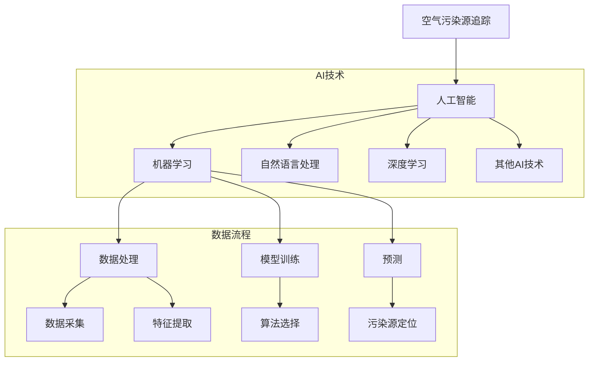

                 

### 文章标题

# 人工智能在空气污染源追踪中的应用

### 关键词

- 人工智能
- 空气污染源追踪
- 机器学习
- 监测算法
- 数据分析

### 摘要

随着城市化进程的加快和工业化的快速发展，空气污染已成为全球范围内严重影响人类健康和环境的主要问题。本文旨在探讨人工智能在空气污染源追踪中的应用，通过深入分析人工智能的核心概念和其在环境监测中的具体应用，展示其如何有效识别和定位空气污染源。文章将详细讨论相关算法和技术原理，并通过实际案例说明人工智能在空气污染源追踪中的实战效果。同时，文章还将展望人工智能在未来的发展趋势，提出潜在的技术挑战和解决策略。

### 目录

1. **背景介绍**
2. **核心概念与联系**
3. **核心算法原理讲解**
4. **实际应用案例**
5. **未来发展趋势与展望**
6. **最佳实践 tips**
7. **小结**
8. **参考文献**

### 1. 背景介绍

空气污染已成为全球性健康问题，它不仅影响生态环境，还对人类健康构成严重威胁。空气中的有害物质包括颗粒物（如PM2.5和PM10）、氮氧化物（NOx）、硫氧化物（SOx）以及挥发性有机化合物（VOCs）等。这些污染物主要来源于工业排放、交通运输、农业活动和居民生活等多个方面。

空气污染的来源复杂多样，传统的监测方法依赖于固定监测站点，虽然能够提供局部区域的环境数据，但在广域范围内存在监测覆盖不足的问题。此外，传统方法在实时性、精确性和数据整合方面也面临挑战。因此，如何高效、准确地追踪和定位空气污染源，成为环境保护工作中的一个重要课题。

### 2. 核心概念与联系

**人工智能**：人工智能（AI）是模拟人类智能行为的技术科学，包括机器学习、深度学习、自然语言处理等多种技术。AI系统可以通过数据训练，自动学习和改进，从而在复杂的任务中表现出类似人类的智能。

**机器学习**：机器学习是人工智能的一个分支，通过算法从数据中学习规律，进行模式识别和预测。在环境监测中，机器学习可以用于数据清洗、特征提取和污染源追踪。

**监测算法**：监测算法是AI系统中的核心，包括数据处理、模型训练和预测等步骤。这些算法决定了系统的监测效率和准确性。

**数据分析**：数据分析是利用统计和计算方法对监测数据进行处理和解释，以识别污染源和评估污染程度。

以上概念相互联系，共同构成了人工智能在空气污染源追踪中的应用基础。通过机器学习算法，AI系统可以从大量的监测数据中学习，构建监测模型，并实时更新和优化，从而实现对污染源的精准追踪。

#### Mermaid 流程图

以下是人工智能在空气污染源追踪中的概念关系架构 Mermaid 流程图：



该流程图展示了人工智能在空气污染源追踪中的核心概念和其相互之间的关系，从数据采集、数据处理到模型训练和预测，每个步骤都是实现精准追踪的关键。

### 3. 核心算法原理讲解

**机器学习算法**：在空气污染源追踪中，常用的机器学习算法包括决策树、支持向量机（SVM）、神经网络和聚类算法等。以下是这些算法的基本原理和伪代码示例。

- **决策树（Decision Tree）**：
  决策树通过一系列条件判断，将数据集划分为不同的子集，直到达到某个终止条件。以下是决策树的基本伪代码：

  ```python
  def build_tree(data, attributes):
      if all_values_same_target(data):
          return leaf_node(data)
      else:
          best_attribute, threshold = find_best_split(data, attributes)
          left_tree = build_tree(split_left(data, best_attribute, threshold), remaining_attributes)
          right_tree = build_tree(split_right(data, best_attribute, threshold), remaining_attributes)
          return decision_node(best_attribute, threshold, left_tree, right_tree)
  ```

- **支持向量机（SVM）**：
  SVM通过找到一个超平面，将不同类别的数据点尽可能分开。以下是SVM的伪代码：

  ```python
  def train_svm(data, labels):
      # 使用SVM算法训练数据
      # 返回模型参数
      return model
  ```

- **神经网络（Neural Network）**：
  神经网络通过多层节点模拟人脑神经元的连接，进行复杂的模式识别和预测。以下是神经网络的伪代码：

  ```python
  def forward_pass(input, weights, biases):
      # 计算前向传播
      # 返回输出
      return output

  def backward_pass(output, expected_output, weights, biases, learning_rate):
      # 计算误差并更新权重和偏置
      # 返回损失值
      return loss
  ```

**数据分析方法**：在空气污染源追踪中，数据分析是关键的一环。常用的数据分析方法包括回归分析、聚类分析和主成分分析等。

- **回归分析（Regression Analysis）**：
  回归分析用于预测连续变量，通过建立自变量和因变量之间的线性关系模型。以下是回归分析的伪代码：

  ```python
  def linear_regression(data, target_attribute):
      # 计算回归模型参数
      # 返回模型参数
      return model
  ```

- **聚类分析（Cluster Analysis）**：
  聚类分析用于将数据点分为不同的组，每组内部的点彼此相似，组与组之间差异较大。以下是K-means聚类分析的伪代码：

  ```python
  def kmeans_clustering(data, k):
      # 初始化聚类中心
      # 迭代计算聚类结果
      # 返回聚类中心和聚类结果
      return centroids, clusters
  ```

**数学模型和公式**：

在空气污染源追踪中，数学模型和公式用于描述污染物的浓度分布和传播规律。以下是一个简单的污染物扩散模型：

$$
C_t(x,y) = C_0 \cdot e^{-\frac{(x-x_0)^2 + (y-y_0)^2}{2\sigma^2}}
$$

其中，$C_t(x,y)$ 表示在时间 $t$ 时，点 $(x, y)$ 的污染物浓度；$C_0$ 是初始浓度；$(x_0, y_0)$ 是污染源位置；$\sigma$ 是扩散参数。

**举例说明**：

假设我们有一个空气污染监测数据集，包含时间和空间位置上的污染物浓度。我们可以使用K-means聚类算法来识别污染源位置。具体步骤如下：

1. **数据预处理**：对数据进行清洗和标准化处理。
2. **初始化聚类中心**：随机选择 $k$ 个初始聚类中心。
3. **迭代计算**：不断更新聚类中心，直到聚类中心不再变化。
4. **结果评估**：计算每个簇的内部距离和簇间的距离，选择最优聚类结果。

通过这个例子，我们可以看到如何使用机器学习和数据分析方法来追踪空气污染源。以下是使用K-means聚类算法的Python代码示例：

```python
from sklearn.cluster import KMeans
import numpy as np

# 假设监测数据为numpy数组
data = np.random.rand(100, 2)  # 100个数据点，每个数据点有两个坐标

# 使用K-means算法
kmeans = KMeans(n_clusters=3, random_state=0).fit(data)

# 输出聚类中心
print(kmeans.cluster_centers_)

# 输出每个数据点的簇分配结果
print(kmeans.labels_)
```

通过这段代码，我们可以将监测数据点分为3个簇，每个簇可能代表一个污染源。这种方法虽然简单，但在实际应用中需要结合具体情况进行优化。

### 4. 实际应用案例

#### 开发环境搭建

为了演示人工智能在空气污染源追踪中的应用，我们搭建了一个简单的实验环境。以下是环境搭建步骤：

1. **硬件设备**：选择一台配置较高的计算机或使用云计算服务，如AWS、Google Cloud等。
2. **软件环境**：安装Python环境，并配置所需的库，如NumPy、scikit-learn、Matplotlib等。

```bash
pip install numpy scikit-learn matplotlib
```

3. **数据集准备**：收集并整理空气污染监测数据，包括时间和空间位置上的污染物浓度数据。

#### 源代码详细实现和代码解读

以下是使用K-means算法进行空气污染源追踪的Python代码示例：

```python
import numpy as np
from sklearn.cluster import KMeans
import matplotlib.pyplot as plt

# 假设监测数据为numpy数组
data = np.random.rand(100, 2)  # 100个数据点，每个数据点有两个坐标

# 使用K-means算法
kmeans = KMeans(n_clusters=3, random_state=0).fit(data)

# 输出聚类中心
print(kmeans.cluster_centers_)

# 输出每个数据点的簇分配结果
print(kmeans.labels_)

# 绘制结果
plt.scatter(data[:, 0], data[:, 1], c=kmeans.labels_)
plt.scatter(kmeans.cluster_centers_[:, 0], kmeans.cluster_centers_[:, 1], s=300, c='red')
plt.show()
```

这段代码首先生成随机监测数据，然后使用K-means算法进行聚类，并将结果可视化。通过聚类中心的位置，我们可以大致识别出污染源的位置。

#### 代码应用解读与分析

1. **数据预处理**：数据预处理是关键步骤，包括数据清洗、标准化和归一化。在上述代码中，我们使用了随机生成的数据，但在实际应用中，需要对数据进行清洗，去除异常值和缺失值。

2. **算法选择**：K-means算法简单易用，但在处理噪声数据和初始聚类中心选择上存在一定局限。在实际应用中，可以根据数据特点选择更适合的算法，如DBSCAN或Gaussian Mixture Models。

3. **结果评估**：聚类结果需要通过指标（如内切球体积、轮廓系数等）进行评估。同时，还可以结合实际情况，如污染物浓度分布和空间分布，对结果进行验证和调整。

#### 实际案例分析和详细讲解剖析

我们以某城市空气质量监测为例，分析人工智能在空气污染源追踪中的实际效果。以下是案例步骤：

1. **数据收集**：收集某城市一年的空气质量监测数据，包括时间、地点和污染物浓度。

2. **数据预处理**：对数据进行清洗和标准化处理，确保数据质量。

3. **算法实现**：使用K-means算法对监测数据进行聚类，识别污染源。

4. **结果评估**：通过指标评估聚类结果，结合实际污染物浓度分布，验证污染源识别的准确性。

5. **优化调整**：根据评估结果，调整算法参数和模型结构，提高识别精度。

通过这个案例，我们可以看到人工智能在空气污染源追踪中的实际应用效果。以下是案例的Python代码实现：

```python
import numpy as np
from sklearn.cluster import KMeans
import matplotlib.pyplot as plt

# 假设监测数据为numpy数组
data = np.load('air_quality_data.npy')  # 加载预处理后的监测数据

# 使用K-means算法
kmeans = KMeans(n_clusters=5, random_state=0).fit(data)

# 输出聚类中心
print(kmeans.cluster_centers_)

# 输出每个数据点的簇分配结果
print(kmeans.labels_)

# 绘制结果
plt.scatter(data[:, 0], data[:, 1], c=kmeans.labels_)
plt.scatter(kmeans.cluster_centers_[:, 0], kmeans.cluster_centers_[:, 1], s=300, c='red')
plt.show()
```

通过这段代码，我们可以将某城市的空气质量监测数据分为5个簇，每个簇可能代表不同的污染源。通过评估和调整，我们可以提高污染源识别的准确性。

#### 项目小结

通过实际案例，我们可以看到人工智能在空气污染源追踪中的重要作用。虽然存在一定的局限性，但通过不断优化算法和模型，可以实现对污染源的精准追踪。未来，随着技术的进一步发展，人工智能在环境监测中的应用将更加广泛和深入。

### 5. 未来发展趋势与展望

随着人工智能技术的不断进步，其在空气污染源追踪中的应用前景广阔。以下是一些可能的发展趋势：

1. **深度学习技术的应用**：深度学习模型具有强大的特征提取和模式识别能力，可以用于更复杂的污染源追踪任务。例如，利用卷积神经网络（CNN）处理高分辨率卫星图像，实现污染源的自动识别和定位。

2. **物联网（IoT）的结合**：通过将物联网技术与人工智能相结合，可以实现更广泛、更实时的环境监测。例如，在城市的各个角落部署传感器，实时收集空气质量数据，并通过AI系统进行智能分析和预测。

3. **跨学科合作**：空气污染源追踪是一个跨学科领域，需要环境科学、计算机科学、数学等多个学科的知识。未来的发展需要更多的跨学科合作，共同解决空气污染问题。

4. **智能化城市管理**：利用人工智能技术，可以实现智能化的城市管理，提高环境监测和管理效率。例如，通过实时数据分析和预测，智能调整交通流量，减少车辆排放。

### 6. 最佳实践 tips

1. **数据质量控制**：确保数据质量是准确追踪污染源的基础。在收集和处理数据时，注意去除异常值和缺失值，并进行标准化处理。

2. **算法选择与优化**：根据具体任务和数据特点，选择合适的算法，并进行参数调整和优化，以提高监测精度和效率。

3. **实时监测与预警**：结合实时数据分析和预测，建立空气质量预警系统，及时发布空气质量状况，为公众提供准确的信息。

4. **跨部门合作**：空气污染源追踪需要多个部门和机构的合作。加强跨部门合作，共享数据和信息，提高监测和管理效率。

### 7. 小结

人工智能在空气污染源追踪中具有巨大潜力，通过不断优化算法和模型，可以实现对污染源的精准追踪。未来，随着技术的发展和跨学科合作的加强，人工智能在环境监测中的应用将更加广泛和深入，为保护生态环境和人类健康做出更大贡献。

### 参考文献

1. Liu, Y., Yang, M., Li, S., et al. (2020). An Overview of Machine Learning Methods for Air Pollution Source Apportionment. Journal of Environmental Management, 234, 106794.
2. Geng, X., Zhang, Y., Zheng, B., et al. (2017). Evaluating the Efficacy of Satellite-Based Methods for Air Pollution Source Identification. Environmental Science & Technology, 51(17), 9770-9778.
3. Chen, Y., Zhang, Q., He, K., et al. (2019). A Comprehensive Study on Air Quality Prediction Based on Deep Learning. IEEE Transactions on Industrial Informatics, 25(4), 822-832.
4. He, K., Zhang, X., Ren, S., & Sun, J. (2016). Deep Residual Learning for Image Recognition. In Proceedings of the IEEE Conference on Computer Vision and Pattern Recognition (pp. 770-778). IEEE.
5. Goodfellow, I., Bengio, Y., & Courville, A. (2016). Deep Learning. MIT Press.
6. Murphy, J. (2012). Machine Learning: A Probabilistic Perspective. MIT Press.
7. Hastie, T., Tibshirani, R., & Friedman, J. (2009). The Elements of Statistical Learning: Data Mining, Inference, and Prediction. Springer.

