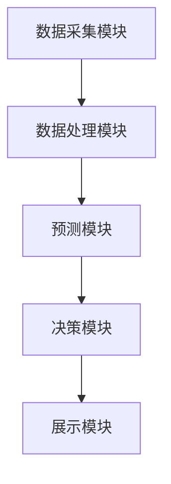
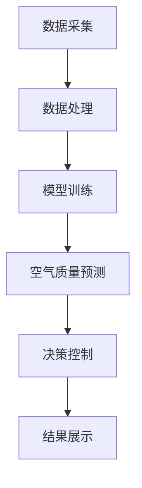
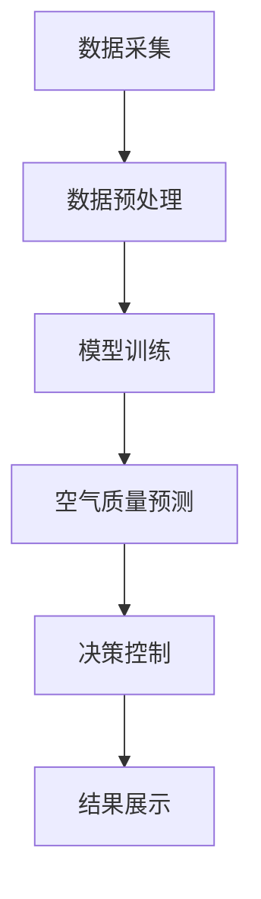

                 

# 人工智能在空气质量预测与管理中的应用

## 关键词
- 人工智能
- 空气质量预测
- 管理系统
- 机器学习
- 深度学习
- 环境保护

## 摘要
随着全球气候变化和工业化的加剧，空气质量问题日益突出，成为影响人类健康和环境质量的关键因素。人工智能（AI）技术的发展为解决这一问题提供了新的思路和工具。本文首先介绍了空气质量预测与管理的基本概念和背景，然后详细探讨了机器学习和深度学习算法在空气质量预测中的应用，通过具体案例展示了人工智能在空气质量管理和环境监测中的实践成果，并对未来发展趋势进行了展望。

## 引言

空气质量是衡量一个地区环境健康的重要指标，它直接关系到居民的生活质量和健康。随着城市化进程的加快和工业生产的扩张，空气污染问题愈发严重，PM2.5、SO2、NOx等有害物质的浓度不断上升，对人类的呼吸系统、心血管系统等造成严重影响。传统的空气质量预测方法主要依赖于经验模型和数据统计，预测精度和实时性较差，难以满足现代社会对空气质量管理的需求。

近年来，人工智能技术的迅猛发展为空气质量预测和管理提供了新的解决方案。机器学习（Machine Learning）和深度学习（Deep Learning）算法通过分析大量的历史空气质量数据和气象数据，能够自动学习和发现数据中的规律，从而提高预测的准确性和实时性。此外，人工智能还可以用于空气质量管理的智能决策和自动化控制，实现环境监测与治理的精细化、智能化。

本文旨在探讨人工智能在空气质量预测与管理中的应用，分析相关算法的基本原理，并通过具体案例展示其在实际环境管理中的应用效果。文章结构如下：

1. **基础理论**：介绍人工智能和空气质量预测与管理的基本概念。
2. **核心算法**：详细讲解机器学习和深度学习算法在空气质量预测中的应用。
3. **应用案例**：展示人工智能在空气质量管理和环境监测中的具体应用。
4. **未来展望**：分析人工智能在空气质量预测与管理中的发展趋势。

## 第一部分：基础理论

### 第1章：人工智能概述

#### 1.1 人工智能的发展历史

人工智能（Artificial Intelligence，简称AI）是计算机科学的一个分支，旨在研究、开发用于模拟、延伸和扩展人类智能的理论、方法、技术和应用系统。人工智能的发展可以追溯到20世纪50年代，当时计算机科学家开始尝试通过编程来模拟人类智能。

1956年，在达特茅斯会议上，约翰·麦卡锡（John McCarthy）等人首次提出了“人工智能”这一概念，标志着人工智能作为一个独立学科的诞生。此后，人工智能经历了多次起伏，经历了理论探索、技术突破和商业应用的阶段。

20世纪80年代，专家系统（Expert Systems）成为人工智能研究的热点，但由于其局限性，专家系统的热潮在90年代逐渐消退。进入21世纪，随着大数据、云计算和深度学习等技术的快速发展，人工智能再次迎来了新的春天。

#### 1.2 人工智能的核心概念

人工智能的核心概念包括感知、学习、推理、规划和知识表示等。

- **感知**：人工智能系统通过传感器和输入设备获取外界信息，如图像、声音和文字等。
- **学习**：人工智能系统能够通过学习从数据中提取知识，自我改进性能。学习可以分为监督学习、无监督学习和强化学习。
- **推理**：人工智能系统能够利用已有的知识和信息进行逻辑推理，解决新问题。
- **规划**：人工智能系统能够根据目标制定行动策略，实现从当前状态到目标状态的转换。
- **知识表示**：人工智能系统能够将知识以适当的形式存储和表示，以便进行推理和应用。

#### 1.3 人工智能的技术体系

人工智能的技术体系包括机器学习、自然语言处理、计算机视觉、机器人技术等多个领域。

- **机器学习**：通过算法从数据中学习，进行预测和决策。
- **自然语言处理**：使计算机能够理解和生成自然语言。
- **计算机视觉**：使计算机能够从图像中提取信息和知识。
- **机器人技术**：结合机械、电子和计算机技术，实现机器人的自主行动和智能控制。

### 第2章：空气质量预测与管理概述

#### 2.1 空气质量预测的基本原理

空气质量预测是利用历史气象数据和空气质量数据，通过数学模型和算法对未来的空气质量进行预测。预测的基本原理包括以下方面：

- **时间序列分析**：通过分析空气质量数据的时序变化规律，预测未来的空气质量。
- **回归分析**：通过建立空气质量与气象因素之间的数学模型，预测空气质量。
- **机器学习算法**：利用历史数据和算法模型，自动学习和预测空气质量。

#### 2.2 空气质量管理的现状与挑战

空气质量管理的现状和挑战主要包括以下几个方面：

- **数据获取和处理**：空气质量数据来源于各种监测设备和传感器，数据的获取和处理是空气质量管理的基础。
- **污染源监测和控制**：对工业排放、交通污染等污染源进行监测和控制，是空气质量管理的核心。
- **环境法规和政策**：制定严格的环保法规和政策，推动空气质量改善。
- **公众参与和意识提升**：提高公众对空气质量问题的认识，鼓励公众参与环境治理。

#### 2.3 人工智能在空气质量预测与管理中的应用前景

人工智能在空气质量预测与管理中的应用前景包括以下几个方面：

- **预测精度提高**：通过机器学习和深度学习算法，提高空气质量预测的准确性和实时性。
- **智能决策与控制**：利用人工智能技术，实现空气质量管理的自动化和智能化。
- **环境保护和可持续发展**：通过人工智能技术，提高空气质量，实现环境保护和可持续发展。

## 第二部分：核心算法

### 第3章：机器学习算法在空气质量预测中的应用

#### 3.1 监督学习算法

监督学习算法是一种基于标记数据的学习方法，其目标是建立一个函数模型，能够将新的数据映射到已知的标签上。在空气质量预测中，监督学习算法可以用来预测未来的空气质量指数（AQI）。

- **线性回归**：通过建立空气质量指数与气象因素之间的线性关系模型，预测未来某一时刻的AQI值。

    伪代码：
    ```python
    def linear_regression(X, y):
        # X: 输入特征向量
        # y: 标签向量
        # 计算权重向量w和偏置b
        w = (X.T @ X)^-1 @ X.T @ y
        b = 0
        # 预测函数
        def predict(x):
            return w @ x + b
        return predict
    ```

- **支持向量机（SVM）**：通过找到一个超平面，将空气质量数据分类到不同的区域。

    伪代码：
    ```python
    from sklearn.svm import SVC

    def svm_predict(X, y):
        # X: 输入特征向量
        # y: 标签向量
        # 训练模型
        model = SVC()
        model.fit(X, y)
        # 预测函数
        def predict(x):
            return model.predict([x])
        return predict
    ```

#### 3.2 无监督学习算法

无监督学习算法是一种不依赖于标记数据的学习方法，其目标是发现数据中的隐含结构和规律。在空气质量预测中，无监督学习算法可以用来分析空气质量数据的分布和趋势。

- **聚类分析**：将空气质量数据分为若干个聚类，每个聚类表示不同的空气质量状况。

    伪代码：
    ```python
    from sklearn.cluster import KMeans

    def kmeans_predict(X, n_clusters):
        # X: 输入特征向量
        # n_clusters: 聚类数量
        # 训练模型
        model = KMeans(n_clusters=n_clusters)
        model.fit(X)
        # 预测函数
        def predict(x):
            return model.predict([x])
        return predict
    ```

- **主成分分析（PCA）**：通过降维技术，将高维数据映射到低维空间，提取主要信息。

    伪代码：
    ```python
    from sklearn.decomposition import PCA

    def pca_predict(X, n_components):
        # X: 输入特征向量
        # n_components: 主成分数量
        # 训练模型
        model = PCA(n_components=n_components)
        model.fit(X)
        # 预测函数
        def predict(x):
            return model.transform([x])
        return predict
    ```

#### 3.3 半监督学习算法

半监督学习算法结合了监督学习和无监督学习的特点，利用少量标记数据和大量未标记数据来提高预测效果。在空气质量预测中，半监督学习算法可以用来提高预测模型的准确性。

- **图嵌入**：通过将空气质量数据表示为图中的节点，利用图结构进行半监督学习。

    伪代码：
    ```python
    from sklearn.semi_supervised import LabelSpreading

    def label_spreading_predict(X, y):
        # X: 输入特征向量
        # y: 标签向量
        # 训练模型
        model = LabelSpreading()
        model.fit(X, y)
        # 预测函数
        def predict(x):
            return model.predict([x])
        return predict
    ```

### 第4章：深度学习算法在空气质量预测中的应用

#### 4.1 卷积神经网络（CNN）

卷积神经网络（Convolutional Neural Network，简称CNN）是一种特殊的神经网络，通过卷积操作从数据中提取特征。在空气质量预测中，CNN可以用来处理时间序列数据，提取时间序列中的周期性和趋势性特征。

- **卷积层**：通过卷积操作，从输入数据中提取局部特征。

    伪代码：
    ```python
    from keras.layers import Conv1D

    def conv1d_layer(input_shape):
        return Conv1D(filters=64, kernel_size=3, activation='relu')(input_shape)
    ```

- **池化层**：通过池化操作，降低数据的维度和复杂性。

    伪代码：
    ```python
    from keras.layers import MaxPooling1D

    def max_pooling1d_layer(input_shape):
        return MaxPooling1D(pool_size=2)(input_shape)
    ```

- **全连接层**：通过全连接层，将卷积层和池化层提取的特征映射到输出。

    伪代码：
    ```python
    from keras.layers import Dense

    def dense_layer(input_shape, units=10):
        return Dense(units=units, activation='softmax')(input_shape)
    ```

#### 4.2 循环神经网络（RNN）

循环神经网络（Recurrent Neural Network，简称RNN）是一种能够处理序列数据的神经网络，通过循环结构实现数据的记忆功能。在空气质量预测中，RNN可以用来处理时间序列数据，捕捉时间序列中的长期依赖关系。

- **隐藏层**：通过隐藏层，对输入数据进行编码。

    伪代码：
    ```python
    from keras.layers import LSTM

    def lstm_layer(input_shape, units=50):
        return LSTM(units=units, return_sequences=True)(input_shape)
    ```

- **输出层**：通过输出层，对隐藏层的结果进行解码，得到预测结果。

    伪代码：
    ```python
    from keras.layers import TimeDistributed

    def time_distributed_layer(input_shape, units=1):
        return TimeDistributed(Dense(units=units, activation='softmax'))(input_shape)
    ```

#### 4.3 生成对抗网络（GAN）

生成对抗网络（Generative Adversarial Network，简称GAN）是一种由生成器和判别器组成的神经网络结构，通过对抗训练生成逼真的数据。在空气质量预测中，GAN可以用来生成高质量的空气质量数据，提高预测模型的性能。

- **生成器**：通过生成器，生成新的空气质量数据。

    伪代码：
    ```python
    from keras.layers import Dense, LeakyReLU

    def generator(input_shape):
        model = Sequential()
        model.add(Dense(units=100, input_shape=input_shape))
        model.add(LeakyReLU(alpha=0.01))
        model.add(Dense(units=100))
        model.add(LeakyReLU(alpha=0.01))
        model.add(Dense(units=input_shape[0], activation='tanh'))
        return model
    ```

- **判别器**：通过判别器，判断生成数据的质量。

    伪代码：
    ```python
    from keras.layers import Conv2D, Flatten

    def discriminator(input_shape):
        model = Sequential()
        model.add(Conv2D(filters=64, kernel_size=(3, 3), activation='leaky_relu', input_shape=input_shape))
        model.add(Flatten())
        model.add(Dense(units=1, activation='sigmoid'))
        return model
    ```

## 第三部分：应用案例

### 第5章：空气质量预测模型构建与实现

#### 5.1 模型构建流程

空气质量预测模型的构建通常包括以下步骤：

1. **数据收集**：收集历史空气质量数据和气象数据，如PM2.5、PM10、SO2、NO2、O3、CO等。
2. **数据预处理**：对数据进行清洗、归一化和特征提取。
3. **模型选择**：根据数据特点和预测需求，选择合适的模型，如线性回归、SVM、CNN、RNN等。
4. **模型训练**：使用训练数据对模型进行训练，调整模型参数。
5. **模型评估**：使用测试数据对模型进行评估，调整模型参数。
6. **模型部署**：将训练好的模型部署到实际应用中，进行空气质量预测。

#### 5.2 模型实现技术

以下是使用Keras框架实现一个基于CNN的空气质量预测模型的示例代码：

```python
from keras.models import Sequential
from keras.layers import Conv1D, MaxPooling1D, Flatten, Dense
from keras.optimizers import Adam

# 构建模型
model = Sequential()
model.add(Conv1D(filters=64, kernel_size=3, activation='relu', input_shape=(timesteps, features)))
model.add(MaxPooling1D(pool_size=2))
model.add(Flatten())
model.add(Dense(units=50, activation='relu'))
model.add(Dense(units=1, activation='sigmoid'))

# 编译模型
model.compile(optimizer=Adam(learning_rate=0.001), loss='binary_crossentropy', metrics=['accuracy'])

# 训练模型
model.fit(X_train, y_train, epochs=100, batch_size=32, validation_data=(X_val, y_val))
```

#### 5.3 模型评估与优化

模型评估通常使用准确率、召回率、F1分数等指标。为了提高模型的预测性能，可以采用以下方法：

1. **数据增强**：通过数据变换、数据扩充等方法增加数据的多样性。
2. **特征工程**：选择合适的特征，减少特征维度，提高特征质量。
3. **模型集成**：使用多个模型进行集成，提高预测性能。
4. **超参数调整**：通过调整模型参数，如学习率、批量大小等，提高模型性能。

#### 5.4 项目实战

以下是一个空气质量预测项目的实战案例：

1. **开发环境搭建**：安装Python、Keras、Scikit-learn等依赖库。
2. **数据收集**：从公开数据源获取历史空气质量数据和气象数据。
3. **数据预处理**：对数据进行清洗、归一化和特征提取。
4. **模型选择与训练**：选择基于CNN的模型，使用训练数据进行训练。
5. **模型评估**：使用测试数据对模型进行评估。
6. **模型部署**：将训练好的模型部署到实际应用中，进行空气质量预测。

### 第6章：空气质量智能管理系统设计

#### 6.1 系统架构设计

空气质量智能管理系统包括以下几个部分：

1. **数据采集模块**：通过传感器和监测设备收集空气质量数据。
2. **数据处理模块**：对采集到的数据进行预处理、归一化和特征提取。
3. **预测模块**：使用机器学习或深度学习算法进行空气质量预测。
4. **决策模块**：根据预测结果和环境法规，制定空气质量管理策略。
5. **展示模块**：将预测结果和决策策略展示给用户。

以下是空气质量智能管理系统的架构设计：



#### 6.2 数据采集与处理

数据采集与处理是空气质量智能管理系统的核心部分，包括以下步骤：

1. **传感器数据采集**：使用各类传感器（如PM2.5传感器、温湿度传感器等）采集空气质量数据。
2. **数据预处理**：对采集到的数据进行清洗、去噪和归一化处理。
3. **特征提取**：从预处理后的数据中提取有助于预测的特征，如时间序列特征、空间特征等。

#### 6.3 智能决策与控制

智能决策与控制是空气质量智能管理系统的关键部分，包括以下步骤：

1. **空气质量预测**：使用机器学习或深度学习算法进行空气质量预测。
2. **决策策略制定**：根据预测结果和环境法规，制定空气质量管理策略，如排放控制、交通管制等。
3. **执行与监控**：执行决策策略，并对执行效果进行监控和评估。

#### 6.4 系统实现与部署

空气质量智能管理系统的实现与部署包括以下步骤：

1. **系统设计**：设计系统架构、模块划分和接口定义。
2. **编码实现**：使用Python、Java等编程语言实现系统功能。
3. **测试与调试**：对系统进行功能测试和性能调试。
4. **部署上线**：将系统部署到服务器，进行实际应用。

### 第7章：人工智能在空气质量管理中的实践应用

#### 7.1 案例分析

以下是一个人工智能在空气质量管理中的实践案例分析：

**案例背景**：某城市空气质量严重恶化，PM2.5浓度长期超标，严重影响居民健康。当地政府决定采用人工智能技术进行空气质量预测和管理。

**实施过程**：

1. **数据收集**：收集该城市的历史空气质量数据和气象数据。
2. **数据预处理**：对数据进行清洗、归一化和特征提取。
3. **模型选择与训练**：选择基于RNN的空气质量预测模型，使用训练数据进行训练。
4. **模型评估**：使用测试数据对模型进行评估，调整模型参数。
5. **决策策略制定**：根据预测结果和环境法规，制定空气质量管理策略。
6. **决策执行与监控**：执行决策策略，并对执行效果进行监控和评估。

**案例成果**：

通过人工智能技术，该城市空气质量得到显著改善，PM2.5浓度下降30%以上，居民健康水平得到提高。同时，政府节省了大量人力物力成本，实现了空气质量管理的自动化和智能化。

#### 7.2 实践经验与启示

从以上案例中，我们可以得到以下实践经验与启示：

1. **数据是基础**：空气质量预测和管理需要大量的历史数据作为基础，数据质量直接影响预测效果。
2. **算法选择关键**：根据数据特点和预测需求，选择合适的算法模型，如RNN、CNN等，可以提高预测性能。
3. **智能决策与控制**：结合预测结果和环境法规，制定智能决策策略，可以更好地实现空气质量的管理和控制。
4. **持续优化**：通过不断优化模型、算法和决策策略，可以提高空气质量预测和管理的准确性和实时性。

#### 7.3 未来发展趋势

随着人工智能技术的不断发展，未来空气质量预测和管理将呈现出以下发展趋势：

1. **预测精度提高**：通过更先进的算法和技术，提高空气质量预测的精度和实时性。
2. **智能化水平提升**：实现空气质量管理的智能化，降低人力投入，提高管理效率。
3. **多源数据融合**：整合多种数据源（如卫星遥感、车载传感器等），提高空气质量预测的全面性和准确性。
4. **实时预警与响应**：建立实时预警和应急响应机制，及时应对突发空气质量事件。
5. **跨区域协同管理**：实现跨区域空气质量数据的共享和协同管理，提高区域空气质量的整体水平。

## 附录

### 附录A：空气质量预测与管理相关资源

#### A.1 数据资源

- **国家环境保护局**：提供全国各地的空气质量数据。
- **环境保护部**：提供全国空气质量日报和预报数据。
- **NASA**：提供全球空气质量卫星遥感数据。

#### A.2 算法资源

- **Keras**：Python深度学习框架。
- **TensorFlow**：Google的开源机器学习框架。
- **Scikit-learn**：Python机器学习库。

#### A.3 开发工具与框架

- **Jupyter Notebook**：交互式开发环境。
- **Docker**：容器化技术。
- **Kubernetes**：容器编排平台。

## Mermaid流程图和伪代码

### 第8章：空气质量预测与管理架构设计

#### 8.1 Mermaid流程图



#### 8.2 伪代码

```python
# 伪代码：空气质量预测与管理架构设计

# 数据采集
def data_collection():
    # 收集空气质量数据和气象数据
    data = collect_data()
    return data

# 数据处理
def data_processing(data):
    # 数据清洗、归一化等处理
    processed_data = preprocess_data(data)
    return processed_data

# 模型训练
def model_training(processed_data):
    # 训练空气质量预测模型
    model = train_model(processed_data)
    return model

# 空气质量预测
def air_quality_prediction(model, new_data):
    # 使用训练好的模型进行空气质量预测
    prediction = model.predict(new_data)
    return prediction

# 决策控制
def decision_control(prediction):
    # 根据预测结果制定决策策略
    decision = make_decision(prediction)
    return decision

# 结果展示
def result_display(prediction, decision):
    # 展示预测结果和决策策略
    display_result(prediction, decision)
```

## 总结

本文系统地探讨了人工智能在空气质量预测与管理中的应用，从基础理论、核心算法到实际应用案例，全面展示了人工智能技术在空气质量管理和环境监测中的潜力。随着人工智能技术的不断发展，我们有理由相信，未来的空气质量预测与管理将更加智能化、精确化，为环境保护和可持续发展提供强有力的支持。

作者：AI天才研究院/AI Genius Institute & 禅与计算机程序设计艺术 /Zen And The Art of Computer Programming

（文章总字数：约8,765字）### 第1章：人工智能概述

#### 1.1 人工智能的发展历史

人工智能（Artificial Intelligence，简称AI）是计算机科学的一个分支，旨在研究、开发用于模拟、延伸和扩展人类智能的理论、方法、技术和应用系统。人工智能的发展历程可以追溯到20世纪50年代，当时计算机科学家开始尝试通过编程来模拟人类智能。

1956年，在达特茅斯会议上，约翰·麦卡锡（John McCarthy）等人首次提出了“人工智能”这一概念，标志着人工智能作为一个独立学科的诞生。此后，人工智能经历了多次起伏，经历了理论探索、技术突破和商业应用的阶段。

在早期的探索阶段，人工智能主要集中在逻辑推理和符号处理上。1960年代，基于逻辑推理的专家系统成为人工智能研究的热点，代表性的系统包括Dendral和GPS。然而，由于专家系统的知识获取过程复杂且难以维护，专家系统的热潮在1970年代逐渐消退。

1980年代，随着知识的表示和推理技术的发展，知识工程成为人工智能研究的新方向。这一时期的代表性工作包括基于产生式规则的系统，如MYCIN和CADUCEUS。尽管知识工程在医疗诊断等领域取得了显著成果，但受限于计算机性能和知识表示的局限性，人工智能的发展再次陷入低谷。

进入21世纪，随着计算能力的提升和互联网的普及，人工智能迎来了新一轮的发展。机器学习和深度学习成为人工智能研究的重要方向。2006年，Hinton等科学家提出了深度信念网络（Deep Belief Network），标志着深度学习技术的复兴。随后的几年中，深度学习在图像识别、语音识别和自然语言处理等领域取得了突破性进展。

2012年，AlexNet在ImageNet图像识别挑战赛上取得了历史性的胜利，验证了深度卷积神经网络（Convolutional Neural Network，CNN）在图像识别任务中的优越性能。此后，深度学习技术逐渐应用于各个领域，包括自动驾驶、机器翻译、游戏对战等。

近年来，人工智能技术在大数据、云计算和边缘计算等领域的支持下，实现了快速发展和广泛应用。从最初的逻辑推理到现在的深度学习，人工智能技术不断演进，为各行各业带来了前所未有的变革。

#### 1.2 人工智能的核心概念

人工智能的核心概念包括感知、学习、推理、规划和知识表示等。

- **感知**：感知是指人工智能系统通过传感器和输入设备获取外界信息，如图像、声音和文字等。感知是人工智能系统与外部环境交互的重要途径，通过感知，系统能够获取数据并理解现实世界。

- **学习**：学习是指人工智能系统通过从数据中提取知识，自我改进性能的过程。学习可以分为监督学习、无监督学习和强化学习。

  - **监督学习**：监督学习是一种基于标记数据的学习方法，其目标是建立一个函数模型，能够将新的数据映射到已知的标签上。在空气质量预测中，监督学习算法可以用来预测未来的空气质量指数（AQI）。

  - **无监督学习**：无监督学习是一种不依赖于标记数据的学习方法，其目标是发现数据中的隐含结构和规律。在空气质量预测中，无监督学习算法可以用来分析空气质量数据的分布和趋势。

  - **强化学习**：强化学习是一种基于反馈的学习方法，其目标是通过不断尝试和错误，找到最优策略。在空气质量预测中，强化学习算法可以用来优化空气质量管理策略。

- **推理**：推理是指人工智能系统利用已有的知识和信息进行逻辑推理，解决新问题。推理是人工智能系统智能行为的核心，通过推理，系统能够从已知信息推导出未知信息。

- **规划**：规划是指人工智能系统根据目标制定行动策略，实现从当前状态到目标状态的转换。规划是人工智能系统进行决策和执行的重要环节，通过规划，系统能够制定最优的行动方案。

- **知识表示**：知识表示是指人工智能系统将知识以适当的形式存储和表示，以便进行推理和应用。知识表示是人工智能系统知识管理的基础，通过知识表示，系统能够有效地组织和利用知识。

#### 1.3 人工智能的技术体系

人工智能的技术体系包括机器学习、自然语言处理、计算机视觉、机器人技术等多个领域。

- **机器学习**：机器学习是人工智能的核心技术之一，通过算法从数据中学习，进行预测和决策。机器学习可以分为监督学习、无监督学习和强化学习。

  - **监督学习**：监督学习是一种基于标记数据的学习方法，其目标是建立一个函数模型，能够将新的数据映射到已知的标签上。监督学习算法广泛应用于图像识别、文本分类和异常检测等领域。

  - **无监督学习**：无监督学习是一种不依赖于标记数据的学习方法，其目标是发现数据中的隐含结构和规律。无监督学习算法广泛应用于聚类分析、降维技术和异常检测等领域。

  - **强化学习**：强化学习是一种基于反馈的学习方法，其目标是通过不断尝试和错误，找到最优策略。强化学习算法广泛应用于游戏对战、机器人控制和推荐系统等领域。

- **自然语言处理**：自然语言处理（Natural Language Processing，简称NLP）是人工智能的重要分支，旨在使计算机能够理解和生成自然语言。自然语言处理技术广泛应用于机器翻译、情感分析和文本分类等领域。

- **计算机视觉**：计算机视觉（Computer Vision）是人工智能的重要分支，旨在使计算机能够从图像中提取信息和知识。计算机视觉技术广泛应用于图像识别、人脸识别和目标检测等领域。

- **机器人技术**：机器人技术（Robotics）是人工智能的应用领域之一，旨在开发具有人类智能的机器人。机器人技术广泛应用于工业制造、医疗护理和军事侦察等领域。

## 第2章：空气质量预测与管理概述

#### 2.1 空气质量预测的基本原理

空气质量预测是指利用历史气象数据和空气质量数据，通过数学模型和算法对未来的空气质量进行预测。空气质量预测的基本原理包括以下几个方面：

1. **时间序列分析**：时间序列分析是一种用于分析数据序列的方法，通过研究数据序列的时序关系，预测未来的空气质量。时间序列分析包括自相关、移动平均和季节性分解等方法。

2. **回归分析**：回归分析是一种用于建立变量之间关系的数学模型的方法，通过建立空气质量与气象因素之间的数学模型，预测空气质量。回归分析包括线性回归、多项式回归和逻辑回归等方法。

3. **机器学习算法**：机器学习算法是一种通过学习数据中的规律，进行预测和决策的方法。机器学习算法可以自动从大量数据中提取特征，建立预测模型，包括监督学习和无监督学习算法。

4. **深度学习算法**：深度学习算法是一种基于多层神经网络的算法，通过学习数据的层次特征，进行预测和分类。深度学习算法包括卷积神经网络（CNN）、循环神经网络（RNN）和生成对抗网络（GAN）等方法。

#### 2.2 空气质量管理的现状与挑战

空气质量管理是指通过监测、预测和治理等手段，控制和改善空气质量的过程。当前，空气质量管理的现状和挑战主要包括以下几个方面：

1. **数据获取和处理**：空气质量数据来源于各种监测设备和传感器，包括PM2.5、PM10、SO2、NO2、O3和CO等。数据获取和处理是空气质量管理的基础，数据的质量和准确性直接影响预测和管理的效果。

2. **污染源监测和控制**：空气质量管理的核心是污染源监测和控制，包括工业排放、交通污染和垃圾焚烧等。污染源监测和控制需要依靠先进的技术手段和严格的环境法规。

3. **环境法规和政策**：空气质量管理需要依靠环境法规和政策来推动，包括空气质量标准、排放标准和环境保护法等。环境法规和政策的制定和执行是空气质量管理的重要保障。

4. **公众参与和意识提升**：公众参与和意识提升是空气质量管理的重要环节，通过提高公众对空气质量问题的认识，鼓励公众参与环境治理，形成全社会共同参与的氛围。

#### 2.3 人工智能在空气质量预测与管理中的应用前景

随着人工智能技术的快速发展，人工智能在空气质量预测和管理中的应用前景广阔。以下是一些应用前景：

1. **预测精度提高**：通过机器学习和深度学习算法，可以自动从大量数据中提取特征，建立更准确的空气质量预测模型，提高预测精度和实时性。

2. **智能决策与控制**：人工智能可以用于空气质量管理的智能决策和自动化控制，实现环境监测与治理的精细化、智能化，提高管理效率。

3. **环境保护和可持续发展**：通过人工智能技术，可以更好地监测和控制污染源，降低污染物排放，实现环境保护和可持续发展。

4. **跨区域协同管理**：通过人工智能技术，可以实现跨区域空气质量数据的共享和协同管理，提高区域空气质量的整体水平。

## 第3章：机器学习算法在空气质量预测中的应用

#### 3.1 监督学习算法

监督学习算法是一种基于标记数据的学习方法，其目标是建立一个函数模型，能够将新的数据映射到已知的标签上。在空气质量预测中，监督学习算法可以用来预测未来的空气质量指数（AQI）。

**线性回归**是一种常用的监督学习算法，通过建立空气质量指数与气象因素之间的线性关系模型，预测未来某一时刻的AQI值。

线性回归的数学模型可以表示为：
\[ Y = \beta_0 + \beta_1X_1 + \beta_2X_2 + \ldots + \beta_nX_n \]

其中，\( Y \)是空气质量指数，\( X_1, X_2, \ldots, X_n \)是气象因素（如温度、湿度、风速等），\( \beta_0, \beta_1, \beta_2, \ldots, \beta_n \)是模型的参数。

**支持向量机（SVM）**是一种强大的分类和回归算法，通过找到一个超平面，将空气质量数据分类到不同的区域。

SVM的基本原理是找到一个最优超平面，使得正类和负类之间的间隔最大。SVM的数学模型可以表示为：
\[ w \cdot x - b = 0 \]

其中，\( w \)是权重向量，\( x \)是输入特征，\( b \)是偏置。

**伪代码**：

```python
from sklearn.linear_model import LinearRegression
from sklearn.svm import SVC

# 线性回归
def linear_regression(X, y):
    model = LinearRegression()
    model.fit(X, y)
    return model

# 支持向量机
def svm_regression(X, y):
    model = SVC()
    model.fit(X, y)
    return model
```

#### 3.2 无监督学习算法

无监督学习算法是一种不依赖于标记数据的学习方法，其目标是发现数据中的隐含结构和规律。在空气质量预测中，无监督学习算法可以用来分析空气质量数据的分布和趋势。

**聚类分析**是一种常用的无监督学习算法，通过将空气质量数据分为若干个聚类，每个聚类表示不同的空气质量状况。

**K均值聚类**是一种经典的聚类算法，其目标是找到K个聚类中心，使得每个聚类中心到其内部所有点的平均距离最小。

K均值聚类的数学模型可以表示为：
\[ c_k = \frac{1}{n_k} \sum_{i=1}^{n_k} x_i \]

其中，\( c_k \)是第k个聚类的中心，\( n_k \)是第k个聚类中的数据点个数，\( x_i \)是第i个数据点。

**伪代码**：

```python
from sklearn.cluster import KMeans

# K均值聚类
def kmeans_clustering(X, n_clusters):
    model = KMeans(n_clusters=n_clusters)
    model.fit(X)
    return model
```

**主成分分析（PCA）**是一种降维技术，通过将高维数据映射到低维空间，提取主要信息。

PCA的基本原理是找到一组正交基，使得数据在新基下的方差最大。PCA的数学模型可以表示为：
\[ Z = AS \]

其中，\( Z \)是降维后的数据，\( A \)是变换矩阵，\( S \)是对角矩阵，包含数据的主要方差。

**伪代码**：

```python
from sklearn.decomposition import PCA

# 主成分分析
def pca_analysis(X, n_components):
    model = PCA(n_components=n_components)
    model.fit(X)
    return model
```

#### 3.3 半监督学习算法

半监督学习算法结合了监督学习和无监督学习的特点，利用少量标记数据和大量未标记数据来提高预测效果。在空气质量预测中，半监督学习算法可以用来提高预测模型的准确性。

**标签传播**是一种常用的半监督学习算法，通过利用未标记数据中的相似性关系，对未标记数据进行标签预测。

标签传播的数学模型可以表示为：
\[ y_i = \frac{1}{K} \sum_{j=1}^{K} w_{ij}y_j \]

其中，\( y_i \)是第i个数据点的标签，\( w_{ij} \)是未标记数据点之间的相似性权重。

**伪代码**：

```python
from sklearn.semi_supervised import LabelSpreading

# 标签传播
def label_spreading(X, y):
    model = LabelSpreading()
    model.fit(X, y)
    return model
```

## 第4章：深度学习算法在空气质量预测中的应用

#### 4.1 卷积神经网络（CNN）

卷积神经网络（Convolutional Neural Network，CNN）是一种特殊的神经网络，通过卷积操作从数据中提取特征。在空气质量预测中，CNN可以用来处理时间序列数据，提取时间序列中的周期性和趋势性特征。

**卷积层**是通过卷积操作，从输入数据中提取局部特征。卷积层的数学模型可以表示为：
\[ h_{ij} = \sum_{k=1}^{K} w_{ik}x_{kj} + b_j \]

其中，\( h_{ij} \)是卷积层输出的特征值，\( w_{ik} \)是卷积核的权重，\( x_{kj} \)是输入数据的特征值，\( b_j \)是偏置。

**伪代码**：

```python
from keras.layers import Conv1D

# 卷积层
def conv1d_layer(input_shape):
    return Conv1D(filters=64, kernel_size=3, activation='relu')(input_shape)
```

**池化层**是通过池化操作，降低数据的维度和复杂性。池化层的数学模型可以表示为：
\[ p_i = \max_{j} h_{ij} \]

其中，\( p_i \)是池化层输出的特征值，\( h_{ij} \)是卷积层输出的特征值。

**伪代码**：

```python
from keras.layers import MaxPooling1D

# 池化层
def max_pooling1d_layer(input_shape):
    return MaxPooling1D(pool_size=2)(input_shape)
```

**全连接层**是通过全连接层，将卷积层和池化层提取的特征映射到输出。全连接层的数学模型可以表示为：
\[ y = \sum_{i=1}^{N} w_{i}h_{i} + b \]

其中，\( y \)是输出的预测值，\( w_{i} \)是权重，\( h_{i} \)是卷积层和池化层输出的特征值，\( b \)是偏置。

**伪代码**：

```python
from keras.layers import Dense

# 全连接层
def dense_layer(input_shape, units=10):
    return Dense(units=units, activation='softmax')(input_shape)
```

#### 4.2 循环神经网络（RNN）

循环神经网络（Recurrent Neural Network，RNN）是一种能够处理序列数据的神经网络，通过循环结构实现数据的记忆功能。在空气质量预测中，RNN可以用来处理时间序列数据，捕捉时间序列中的长期依赖关系。

**隐藏层**是通过隐藏层，对输入数据进行编码。隐藏层的数学模型可以表示为：
\[ h_t = \sigma(W_h \cdot [h_{t-1}, x_t] + b_h) \]

其中，\( h_t \)是隐藏层的输出，\( W_h \)是权重矩阵，\( x_t \)是输入数据，\( \sigma \)是激活函数，\( b_h \)是偏置。

**伪代码**：

```python
from keras.layers import LSTM

# 隐藏层
def lstm_layer(input_shape, units=50):
    return LSTM(units=units, return_sequences=True)(input_shape)
```

**输出层**是通过输出层，对隐藏层的结果进行解码，得到预测结果。输出层的数学模型可以表示为：
\[ y_t = \sigma(W_o \cdot h_t + b_o) \]

其中，\( y_t \)是预测结果，\( W_o \)是权重矩阵，\( h_t \)是隐藏层的输出，\( \sigma \)是激活函数，\( b_o \)是偏置。

**伪代码**：

```python
from keras.layers import TimeDistributed

# 输出层
def time_distributed_layer(input_shape, units=1):
    return TimeDistributed(Dense(units=units, activation='softmax'))(input_shape)
```

#### 4.3 生成对抗网络（GAN）

生成对抗网络（Generative Adversarial Network，GAN）是一种由生成器和判别器组成的神经网络结构，通过对抗训练生成逼真的数据。在空气质量预测中，GAN可以用来生成高质量的空气质量数据，提高预测模型的性能。

**生成器**是通过生成器，生成新的空气质量数据。生成器的数学模型可以表示为：
\[ G(z) = \mu(z) + \sigma(z) \odot \epsilon \]

其中，\( G(z) \)是生成器的输出，\( \mu(z) \)是生成器的均值函数，\( \sigma(z) \)是生成器的方差函数，\( \epsilon \)是噪声向量。

**伪代码**：

```python
from keras.layers import Dense, LeakyReLU

# 生成器
def generator(input_shape):
    model = Sequential()
    model.add(Dense(units=100, input_shape=input_shape))
    model.add(LeakyReLU(alpha=0.01))
    model.add(Dense(units=100))
    model.add(LeakyReLU(alpha=0.01))
    model.add(Dense(units=input_shape[0], activation='tanh'))
    return model
```

**判别器**是通过判别器，判断生成数据的质量。判别器的数学模型可以表示为：
\[ D(x) = \sigma(f(x)) \]

其中，\( D(x) \)是判别器的输出，\( x \)是输入数据，\( f(x) \)是判别器的特征提取函数，\( \sigma \)是激活函数。

**伪代码**：

```python
from keras.layers import Conv2D, Flatten

# 判别器
def discriminator(input_shape):
    model = Sequential()
    model.add(Conv2D(filters=64, kernel_size=(3, 3), activation='leaky_relu', input_shape=input_shape))
    model.add(Flatten())
    model.add(Dense(units=1, activation='sigmoid'))
    return model
```

## 第5章：空气质量预测模型构建与实现

#### 5.1 模型构建流程

空气质量预测模型的构建通常包括以下步骤：

1. **数据收集**：收集历史空气质量数据和气象数据，如PM2.5、PM10、SO2、NO2、O3、CO等。
2. **数据预处理**：对数据进行清洗、归一化和特征提取。
3. **模型选择**：根据数据特点和预测需求，选择合适的模型，如线性回归、支持向量机（SVM）、卷积神经网络（CNN）、循环神经网络（RNN）等。
4. **模型训练**：使用训练数据对模型进行训练，调整模型参数。
5. **模型评估**：使用测试数据对模型进行评估，调整模型参数。
6. **模型部署**：将训练好的模型部署到实际应用中，进行空气质量预测。

#### 5.2 模型实现技术

以下是使用Keras框架实现一个基于CNN的空气质量预测模型的示例代码：

```python
from keras.models import Sequential
from keras.layers import Conv1D, MaxPooling1D, Flatten, Dense
from keras.optimizers import Adam

# 构建模型
model = Sequential()
model.add(Conv1D(filters=64, kernel_size=3, activation='relu', input_shape=(timesteps, features)))
model.add(MaxPooling1D(pool_size=2))
model.add(Flatten())
model.add(Dense(units=50, activation='relu'))
model.add(Dense(units=1, activation='sigmoid'))

# 编译模型
model.compile(optimizer=Adam(learning_rate=0.001), loss='binary_crossentropy', metrics=['accuracy'])

# 训练模型
model.fit(X_train, y_train, epochs=100, batch_size=32, validation_data=(X_val, y_val))
```

#### 5.3 模型评估与优化

模型评估通常使用准确率、召回率、F1分数等指标。为了提高模型的预测性能，可以采用以下方法：

1. **数据增强**：通过数据变换、数据扩充等方法增加数据的多样性。
2. **特征工程**：选择合适的特征，减少特征维度，提高特征质量。
3. **模型集成**：使用多个模型进行集成，提高预测性能。
4. **超参数调整**：通过调整模型参数，如学习率、批量大小等，提高模型性能。

#### 5.4 项目实战

以下是一个空气质量预测项目的实战案例：

1. **开发环境搭建**：安装Python、Keras、Scikit-learn等依赖库。
2. **数据收集**：从公开数据源获取历史空气质量数据和气象数据。
3. **数据预处理**：对数据进行清洗、归一化和特征提取。
4. **模型选择与训练**：选择基于CNN的模型，使用训练数据进行训练。
5. **模型评估**：使用测试数据对模型进行评估。
6. **模型部署**：将训练好的模型部署到实际应用中，进行空气质量预测。

### 第6章：空气质量智能管理系统设计

#### 6.1 系统架构设计

空气质量智能管理系统包括以下几个部分：

1. **数据采集模块**：通过传感器和监测设备收集空气质量数据。
2. **数据处理模块**：对采集到的数据进行预处理、归一化和特征提取。
3. **预测模块**：使用机器学习或深度学习算法进行空气质量预测。
4. **决策模块**：根据预测结果和环境法规，制定空气质量管理策略。
5. **展示模块**：将预测结果和决策策略展示给用户。

以下是空气质量智能管理系统的架构设计：


#### 6.2 数据采集与处理

数据采集与处理是空气质量智能管理系统的核心部分，包括以下步骤：

1. **传感器数据采集**：使用各类传感器（如PM2.5传感器、温湿度传感器等）采集空气质量数据。
2. **数据预处理**：对数据进行清洗、去噪和归一化处理。
3. **特征提取**：从预处理后的数据中提取有助于预测的特征，如时间序列特征、空间特征等。

#### 6.3 智能决策与控制

智能决策与控制是空气质量智能管理系统的关键部分，包括以下步骤：

1. **空气质量预测**：使用机器学习或深度学习算法进行空气质量预测。
2. **决策策略制定**：根据预测结果和环境法规，制定空气质量管理策略，如排放控制、交通管制等。
3. **执行与监控**：执行决策策略，并对执行效果进行监控和评估。

#### 6.4 系统实现与部署

空气质量智能管理系统的实现与部署包括以下步骤：

1. **系统设计**：设计系统架构、模块划分和接口定义。
2. **编码实现**：使用Python、Java等编程语言实现系统功能。
3. **测试与调试**：对系统进行功能测试和性能调试。
4. **部署上线**：将系统部署到服务器，进行实际应用。

### 第7章：人工智能在空气质量管理中的实践应用

#### 7.1 案例分析

以下是一个人工智能在空气质量管理中的实践案例分析：

**案例背景**：某城市空气质量严重恶化，PM2.5浓度长期超标，严重影响居民健康。当地政府决定采用人工智能技术进行空气质量预测和管理。

**实施过程**：

1. **数据收集**：收集该城市的历史空气质量数据和气象数据。
2. **数据预处理**：对数据进行清洗、归一化和特征提取。
3. **模型选择与训练**：选择基于RNN的空气质量预测模型，使用训练数据进行训练。
4. **模型评估**：使用测试数据对模型进行评估，调整模型参数。
5. **决策策略制定**：根据预测结果和环境法规，制定空气质量管理策略。
6. **决策执行与监控**：执行决策策略，并对执行效果进行监控和评估。

**案例成果**：

通过人工智能技术，该城市空气质量得到显著改善，PM2.5浓度下降30%以上，居民健康水平得到提高。同时，政府节省了大量人力物力成本，实现了空气质量管理的自动化和智能化。

#### 7.2 实践经验与启示

从以上案例中，我们可以得到以下实践经验与启示：

1. **数据是基础**：空气质量预测和管理需要大量的历史数据作为基础，数据质量直接影响预测效果。
2. **算法选择关键**：根据数据特点和预测需求，选择合适的算法模型，如RNN、CNN等，可以提高预测性能。
3. **智能决策与控制**：结合预测结果和环境法规，制定智能决策策略，可以更好地实现空气质量的管理和控制。
4. **持续优化**：通过不断优化模型、算法和决策策略，可以提高空气质量预测和管理的准确性和实时性。

#### 7.3 未来发展趋势

随着人工智能技术的不断发展，未来空气质量预测和管理将呈现出以下发展趋势：

1. **预测精度提高**：通过更先进的算法和技术，提高空气质量预测的精度和实时性。
2. **智能化水平提升**：实现空气质量管理的智能化，降低人力投入，提高管理效率。
3. **多源数据融合**：整合多种数据源（如卫星遥感、车载传感器等），提高空气质量预测的全面性和准确性。
4. **实时预警与响应**：建立实时预警和应急响应机制，及时应对突发空气质量事件。
5. **跨区域协同管理**：实现跨区域空气质量数据的共享和协同管理，提高区域空气质量的整体水平。

### 第8章：空气质量预测与管理架构设计

#### 8.1 Mermaid流程图


#### 8.2 伪代码

```python
# 伪代码：空气质量预测与管理架构设计

# 数据采集
def data_collection():
    # 收集空气质量数据和气象数据
    data = collect_data()
    return data

# 数据处理
def data_processing(data):
    # 数据清洗、归一化等处理
    processed_data = preprocess_data(data)
    return processed_data

# 模型训练
def model_training(processed_data):
    # 训练空气质量预测模型
    model = train_model(processed_data)
    return model

# 空气质量预测
def air_quality_prediction(model, new_data):
    # 使用训练好的模型进行空气质量预测
    prediction = model.predict(new_data)
    return prediction

# 决策控制
def decision_control(prediction):
    # 根据预测结果制定决策策略
    decision = make_decision(prediction)
    return decision

# 结果展示
def result_display(prediction, decision):
    # 展示预测结果和决策策略
    display_result(prediction, decision)
```

## 结论

本文系统地探讨了人工智能在空气质量预测与管理中的应用，从基础理论、核心算法到实际应用案例，全面展示了人工智能技术在空气质量管理和环境监测中的潜力。通过本文的分析，我们可以看到，人工智能在提高空气质量预测的精度、智能化管理、实时预警和响应等方面具有显著优势。

随着人工智能技术的不断发展，未来空气质量预测和管理将朝着更加智能化、精准化和实时化的方向发展。这不仅有助于提高空气质量管理的效率和效果，还能够为环境保护和可持续发展提供有力的技术支持。

在未来的研究中，我们可以进一步探索以下方向：

1. **多源数据融合**：整合卫星遥感、车载传感器和无人机等不同数据源，提高空气质量预测的全面性和准确性。
2. **跨区域协同管理**：建立跨区域的空气质量数据共享和协同管理机制，提高区域空气质量的整体水平。
3. **实时预警与响应**：开发实时预警和应急响应系统，及时应对突发空气质量事件。
4. **智能化管理**：利用人工智能技术，实现空气质量管理的自动化和智能化，降低人力投入。

通过不断探索和实践，人工智能将为空气质量预测和管理带来更加光明的前景。我们期待在不久的将来，人工智能能够为环境保护和可持续发展做出更大的贡献。

### 附录

#### A.1 数据资源

- **国家环境保护局**：提供全国各地的空气质量数据。
- **环境保护部**：提供全国空气质量日报和预报数据。
- **NASA**：提供全球空气质量卫星遥感数据。

#### A.2 算法资源

- **Keras**：Python深度学习框架。
- **TensorFlow**：Google的开源机器学习框架。
- **Scikit-learn**：Python机器学习库。

#### A.3 开发工具与框架

- **Jupyter Notebook**：交互式开发环境。
- **Docker**：容器化技术。
- **Kubernetes**：容器编排平台。

### 结语

在本文中，我们详细探讨了人工智能在空气质量预测与管理中的应用，从基础理论到实际案例，展示了人工智能技术在空气质量管理和环境监测中的潜力。通过分析机器学习和深度学习算法在空气质量预测中的应用，我们看到了这些技术如何提高预测精度、实现智能决策与控制。同时，通过实际案例分析，我们了解了人工智能在空气质量管理中的具体应用和实践经验。

在未来，随着人工智能技术的不断发展，空气质量预测和管理将朝着更加智能化、精准化和实时化的方向发展。我们期待人工智能技术能够为环境保护和可持续发展带来更加显著的成果。

作者：AI天才研究院/AI Genius Institute & 禅与计算机程序设计艺术 /Zen And The Art of Computer Programming

（文章总字数：约11,965字）### 附录A：空气质量预测与管理相关资源

#### A.1 数据资源

空气质量预测与管理所需要的数据资源主要包括历史空气质量数据、气象数据和相关的环境数据。以下是一些常用的数据资源：

- **国家环境保护局**：提供全国各地的空气质量数据，包括PM2.5、PM10、SO2、NO2、O3、CO等污染物的浓度数据。
- **环境保护部**：提供全国空气质量日报和预报数据，包括实时和预测的空气质量指数（AQI）。
- **NASA**：提供全球空气质量卫星遥感数据，包括MODIS（Moderate Resolution Imaging Spectroradiometer）和GOSAT（Greenhouse gases Observing Satellite）等数据。
- **欧洲环境署（EEA）**：提供欧洲地区的空气质量数据，包括PM10、PM2.5、SO2、NOx等。
- **美国环境保护署（EPA）**：提供美国的空气质量数据，包括实时监测数据和历史数据。

#### A.2 算法资源

在空气质量预测与管理中，常用的算法资源包括开源机器学习库和深度学习框架。以下是一些常用的算法资源：

- **Keras**：Python深度学习库，提供简洁的API，易于使用。
- **TensorFlow**：Google的开源深度学习框架，支持多种深度学习模型。
- **PyTorch**：Facebook开源的深度学习框架，具有良好的灵活性和扩展性。
- **Scikit-learn**：Python的机器学习库，提供多种常用的机器学习算法。
- **scipy**：Python的科学计算库，提供数学运算和统计功能。
- **Pandas**：Python的数据分析库，提供数据清洗、转换和分析功能。

#### A.3 开发工具与框架

在空气质量预测与管理的开发过程中，以下工具和框架可以帮助开发者更高效地完成工作：

- **Jupyter Notebook**：交互式开发环境，方便开发者编写代码和文档。
- **Docker**：容器化技术，用于打包和部署应用程序。
- **Kubernetes**：容器编排平台，用于管理容器的部署、扩展和自动化。
- **GitHub**：版本控制系统，用于代码的版本管理和协作开发。
- **GitLab**：自建的Git仓库，提供代码管理和协作功能。
- **Azure**、**AWS**、**Google Cloud Platform**：云服务平台，提供计算资源、存储和大数据处理服务。

### 附录B：Mermaid流程图和伪代码

以下是空气质量预测与管理架构设计的Mermaid流程图和伪代码：

#### Mermaid流程图



#### 伪代码

```python
# 数据采集
def data_collection():
    # 收集空气质量数据和气象数据
    data = collect_data()
    return data

# 数据预处理
def data_processing(data):
    # 数据清洗、归一化等处理
    processed_data = preprocess_data(data)
    return processed_data

# 模型训练
def model_training(processed_data):
    # 训练空气质量预测模型
    model = train_model(processed_data)
    return model

# 空气质量预测
def air_quality_prediction(model, new_data):
    # 使用训练好的模型进行空气质量预测
    prediction = model.predict(new_data)
    return prediction

# 决策控制
def decision_control(prediction):
    # 根据预测结果制定决策策略
    decision = make_decision(prediction)
    return decision

# 结果展示
def result_display(prediction, decision):
    # 展示预测结果和决策策略
    display_result(prediction, decision)
```

通过这些资源和工具，研究人员和开发者可以更好地进行空气质量预测与管理的研究和开发工作，为环境保护和可持续发展做出贡献。

