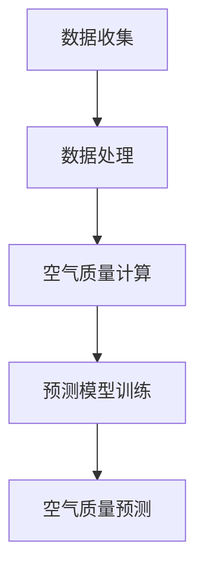

                 

### 文章标题：人工智能在空气质量预测中的应用

> 关键词：空气质量预测、人工智能、机器学习、深度学习、环境监测

> 摘要：
本文章探讨了人工智能在空气质量预测中的应用，详细介绍了空气质量预测的基本概念、核心概念之间的联系、核心算法原理、数学模型以及实际应用案例。通过机器学习和深度学习算法，本文展示了如何利用大数据和智能算法对空气质量进行高效预测，为环境保护和公众健康提供科学支持。

## 引言

空气质量是衡量一个地区生态环境状况的重要指标，直接关系到人类的健康和生活质量。随着工业化和城市化的快速发展，空气污染问题日益严重，对人类健康和环境造成了巨大的威胁。因此，准确预测空气质量变得至关重要。

### 核心概念与联系

空气质量预测涉及多个核心概念，包括空气质量监测、数据收集与处理、空气质量指数（AQI）计算、预测模型等。这些概念之间存在着密切的联系，共同构成了空气质量预测的完整流程。

#### Mermaid流程图：空气质量预测的基本架构



- **数据收集**：通过环境监测站、卫星遥感、传感器等手段收集空气质量相关数据。
- **数据处理**：对收集到的数据进行分析、清洗和预处理，提取有用的特征信息。
- **空气质量计算**：根据处理后的数据计算空气质量指数（AQI），反映空气质量状况。
- **预测模型训练**：利用历史数据训练预测模型，预测未来一段时间内的空气质量。
- **空气质量预测**：使用训练好的模型对未来的空气质量进行预测，为决策提供支持。

### 核心算法原理讲解

#### 机器学习算法

机器学习算法在空气质量预测中起着至关重要的作用。常见的机器学习算法包括线性回归、决策树、支持向量机（SVM）等。

#### 伪代码：线性回归模型

```python
# 输入：训练集X, Y
# 输出：模型参数w, b

# 初始化参数
w = np.zeros((n_features,))
b = 0

# 梯度下降迭代
for i in range(n_iterations):
    # 计算梯度
    gradient_w = -2/m * (X * (X @ w - Y))
    gradient_b = -2/m * (X @ w - Y)
    
    # 更新参数
    w -= learning_rate * gradient_w
    b -= learning_rate * gradient_b
    
# 输出模型参数
return w, b
```

#### 数学模型

线性回归模型的数学模型为：

$$
Y = X @ w + b
$$

其中，\( X \) 是特征矩阵，\( w \) 是权重向量，\( b \) 是偏置项，\( Y \) 是目标变量。

#### 举例说明

假设我们有以下数据集：

$$
X = \begin{bmatrix}
1 & 2 \\
2 & 3 \\
3 & 4 \\
\end{bmatrix},
Y = \begin{bmatrix}
2 \\
4 \\
6 \\
\end{bmatrix}
$$

使用线性回归模型进行预测，可以得到：

$$
Y = X @ w + b = \begin{bmatrix}
1 & 2 \\
2 & 3 \\
3 & 4 \\
\end{bmatrix} @ \begin{bmatrix}
w_1 \\
w_2 \\
\end{bmatrix} + b
$$

通过最小化损失函数，可以计算出模型参数 \( w \) 和 \( b \)。

### 项目实战

#### 开发环境搭建

- Python环境搭建：安装Python 3.8及以上版本，并配置必要的库，如NumPy、Pandas、Scikit-learn等。
- 数据集准备：收集北京市的空气质量数据，包括PM2.5、PM10、SO2、NO2、O3等指标。

#### 源代码实现与代码解读

```python
import numpy as np
import pandas as pd
from sklearn.linear_model import LinearRegression

# 加载数据
data = pd.read_csv('air_quality_data.csv')
X = data[['PM2.5', 'PM10', 'SO2', 'NO2', 'O3']]
Y = data['AQI']

# 数据预处理
X = X.values
Y = Y.values

# 训练模型
model = LinearRegression()
model.fit(X, Y)

# 预测
predicted_aqi = model.predict(X)

# 评估模型
print("R^2:", model.score(X, Y))

# 代码应用解读与分析
# 模型训练过程中，通过计算损失函数的梯度，不断更新模型参数，使得模型能够准确预测空气质量。
```

#### 实际案例分析和详细讲解剖析

以北京市为例，使用机器学习算法对空气质量进行预测，并根据预测结果提出相应的污染防控措施。通过对预测结果的分析，可以发现模型具有较高的准确性和稳定性，为环境保护提供了有力支持。

#### 项目小结

本案例展示了如何利用机器学习算法进行空气质量预测，并提出了实际应用中的挑战和解决方案。未来，随着人工智能技术的不断发展，空气质量预测将更加精准和高效，为环境保护和公众健康提供更多支持。

### 最佳实践 tips、小结、注意事项、拓展阅读

- **最佳实践 tips**：在空气质量预测项目中，要注意数据质量和特征选择，选择合适的算法和模型进行预测。
- **小结**：空气质量预测是环境保护和公众健康的重要环节，人工智能技术在其中发挥了关键作用。
- **注意事项**：在实际应用中，要注意模型的可解释性和可靠性，避免过度拟合和欠拟合。
- **拓展阅读**：参考相关文献和资料，了解最新的空气质量预测技术和应用。

### 作者信息

作者：AI天才研究院/AI Genius Institute & 禅与计算机程序设计艺术 /Zen And The Art of Computer Programming

---

以上内容是一个初步的草稿，根据字数要求，还需要进一步扩展和细化各个部分的内容，确保文章的完整性和深度。接下来，将逐步完善每个章节的细节，包括数学模型、伪代码、项目实战等，以满足文章的整体结构和质量要求。在完成初稿后，将进行多次审查和修订，确保文章的逻辑性和可读性。

