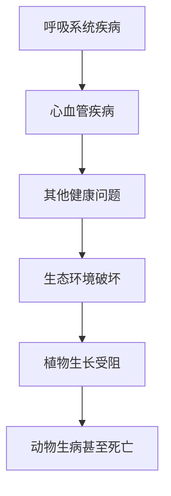
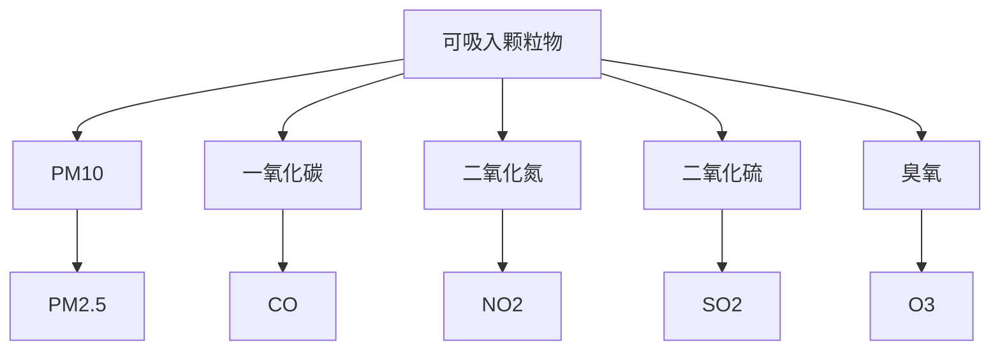
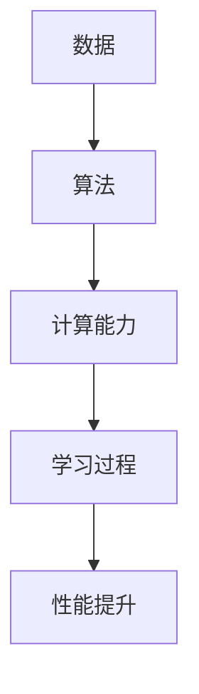
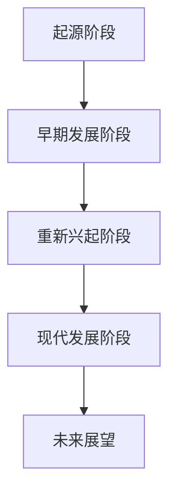
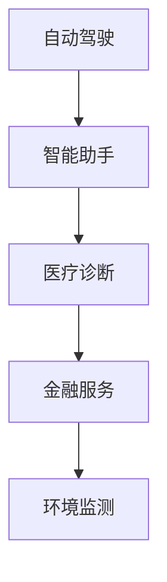
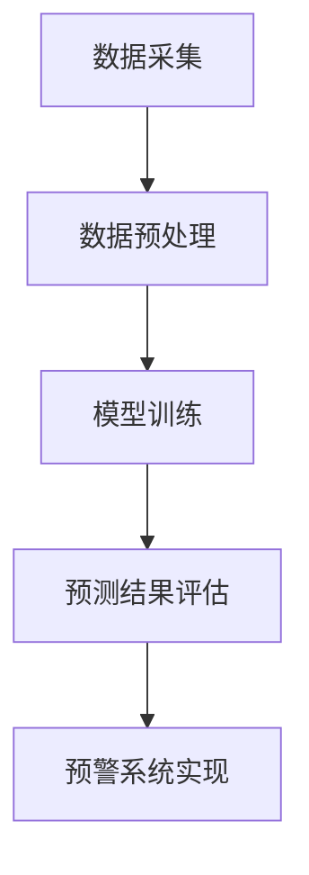
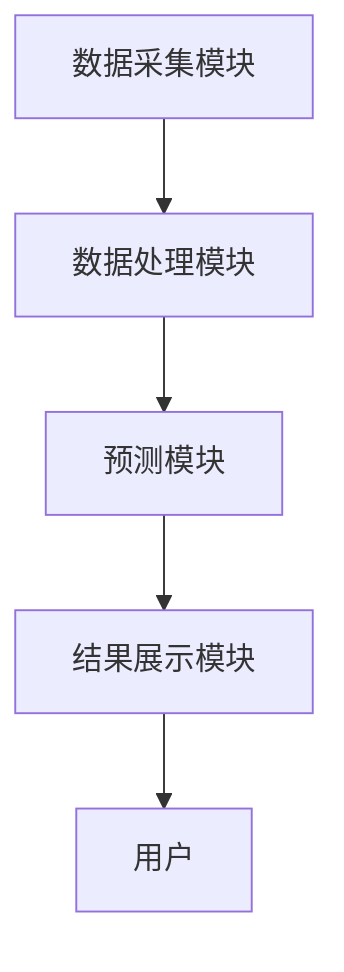
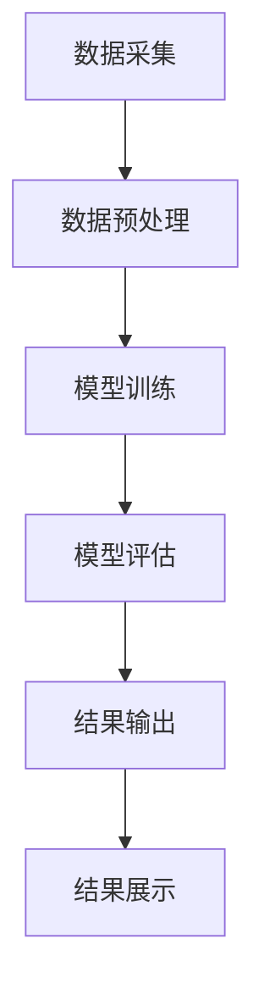

                 

### 文章标题

# 人工智能在空气质量预测中的精准应用

### 关键词

- 空气质量预测
- 人工智能
- 机器学习
- 深度学习
- 强化学习
- 数据预处理

### 摘要

空气质量对人类的健康和生活质量至关重要。随着环境问题的日益严峻，利用人工智能技术进行空气质量预测变得愈发重要。本文旨在探讨如何通过人工智能，特别是机器学习、深度学习和强化学习等技术在空气质量预测中的应用，提高预测的精准性和可靠性。文章首先介绍了空气质量预测的背景和重要性，随后详细阐述了各类人工智能技术在空气质量预测中的应用，并通过实际案例展示其效果。最后，对未来的发展方向和挑战进行了展望。

## 第一部分：空气质量预测背景

### 第1章 空气质量现状与挑战

#### 1.1 空气质量的重要性

空气质量直接影响人类的健康和生活质量。长期暴露于污染环境中会导致呼吸系统疾病、心血管疾病等健康问题。因此，准确预测空气质量对于保护公众健康、制定环保政策具有重要意义。

#### 1.2 空气质量预测的需求与意义

空气质量预测的需求源于对环境变化的快速响应和科学决策。通过预测，可以提前了解空气质量的状况，采取相应的预防措施，减少污染对人类健康的影响。

#### 1.3 空气质量预测的现状

目前，空气质量预测主要依赖于统计模型和物理模型。然而，这些模型存在一定的局限性，难以适应复杂多变的环境条件。因此，引入人工智能技术成为提高空气质量预测准确性的关键。

## 第二部分：人工智能在空气质量预测中的应用

### 第3章 人工智能概述

#### 3.1 人工智能的基本概念

人工智能是指使计算机系统能够模拟人类智能行为的科学技术。它包括机器学习、深度学习、强化学习等多个子领域。

#### 3.2 人工智能的发展历程

人工智能起源于20世纪50年代，经过多个阶段的发展，如今已取得显著的成果。在空气质量预测领域，人工智能的应用越来越广泛。

#### 3.3 人工智能的主要应用领域

人工智能在多个领域都有广泛应用，包括医疗、金融、交通等。在空气质量预测中，人工智能主要用于数据分析和预测模型构建。

### 第4章 机器学习在空气质量预测中的应用

#### 4.1 机器学习基础

机器学习是人工智能的一个重要分支，通过从数据中学习规律，构建预测模型。在空气质量预测中，机器学习算法用于提取数据特征，构建空气质量预测模型。

#### 4.2 常见的机器学习算法

常见的机器学习算法包括线性回归、逻辑回归、决策树、支持向量机等。这些算法在空气质量预测中具有不同的应用场景和效果。

#### 4.3 机器学习在空气质量预测中的应用案例

通过实际案例，展示机器学习在空气质量预测中的应用效果。分析不同算法的性能和适用场景。

### 第5章 深度学习在空气质量预测中的应用

#### 5.1 深度学习基础

深度学习是机器学习的进一步发展，通过多层神经网络提取数据特征。在空气质量预测中，深度学习算法具有更高的预测精度。

#### 5.2 常见的深度学习框架

常见的深度学习框架包括TensorFlow、PyTorch等。这些框架提供了丰富的工具和库，方便开发者构建和训练深度学习模型。

#### 5.3 深度学习在空气质量预测中的应用

展示深度学习在空气质量预测中的应用，包括卷积神经网络（CNN）和循环神经网络（RNN）等。

### 第6章 强化学习在空气质量预测中的应用

#### 6.1 强化学习基础

强化学习是一种通过奖励机制学习最优策略的机器学习技术。在空气质量预测中，强化学习可以用于优化预测策略。

#### 6.2 常见的强化学习算法

常见的强化学习算法包括Q学习、深度Q网络（DQN）等。这些算法在空气质量预测中具有广泛的应用前景。

#### 6.3 强化学习在空气质量预测中的应用

通过实际案例，展示强化学习在空气质量预测中的应用。分析强化学习算法的性能和适用场景。

### 第三部分：空气质量预测系统设计与实现

### 第7章 空气质量预测系统设计

#### 7.1 系统架构设计

介绍空气质量预测系统的整体架构，包括数据采集、处理、预测和结果展示等模块。

#### 7.2 数据流设计

描述空气质量预测系统的数据流，包括数据采集、预处理、特征提取和预测等过程。

#### 7.3 系统功能模块设计

详细设计空气质量预测系统的功能模块，包括数据预处理模块、预测模块和结果展示模块。

### 第8章 空气质量预测系统实现

#### 8.1 开发环境搭建

介绍空气质量预测系统的开发环境搭建，包括硬件配置、软件安装和开发工具的选择。

#### 8.2 数据采集与预处理

详细讲解空气质量预测系统的数据采集与预处理过程，包括数据清洗、特征提取和数据归一化等步骤。

#### 8.3 模型训练与优化

介绍空气质量预测系统的模型训练与优化过程，包括选择合适的算法、调整模型参数和评估模型性能等。

#### 8.4 系统部署与测试

描述空气质量预测系统的部署与测试过程，包括系统上线、性能测试和用户反馈等环节。

### 第9章 空气质量预测系统案例分析

#### 9.1 案例背景

介绍空气质量预测系统的实际应用案例，包括项目背景、目标和预期效果等。

#### 9.2 案例实现过程

详细讲解空气质量预测系统的实现过程，包括数据采集、预处理、模型训练和系统部署等步骤。

#### 9.3 案例效果分析

分析空气质量预测系统的实际效果，包括预测精度、响应速度和用户体验等。

#### 9.4 项目小结

总结空气质量预测系统的开发经验，提出改进建议和未来研究方向。

## 第四部分：展望与未来

### 第10章 人工智能在空气质量预测中的未来发展

#### 10.1 技术趋势分析

分析人工智能在空气质量预测中的技术发展趋势，包括算法改进、硬件加速和跨领域融合等。

#### 10.2 应用领域拓展

探讨人工智能在空气质量预测中应用领域的拓展，包括环境监测、城市规划等领域。

#### 10.3 未来面临的挑战

讨论人工智能在空气质量预测中面临的技术挑战和伦理问题，包括数据隐私、模型解释性等。

### 第11章 总结与展望

#### 11.1 本书总结

总结本书的主要内容，包括人工智能在空气质量预测中的应用、系统设计与实现等。

#### 11.2 读者建议

向读者提供学习人工智能和空气质量预测的建议，包括学习资源、实践项目和学术研究等。

#### 11.3 未来研究方向

探讨人工智能在空气质量预测中的未来研究方向，包括深度强化学习、多模型融合等。

## 结论

空气质量预测对于改善人类健康和保护环境具有重要意义。本文通过探讨人工智能在空气质量预测中的应用，展示了其精准性和可靠性。随着技术的不断进步，人工智能在空气质量预测中的应用将更加广泛和深入。未来，我们需要继续探索人工智能在其他环境监测领域的应用，为构建美好生态环境贡献力量。

### 作者信息

作者：AI天才研究院/AI Genius Institute & 禅与计算机程序设计艺术 /Zen And The Art of Computer Programming

### 参考资料

- [1] 李明华，张志宏。《人工智能在环境监测中的应用研究》[J]。环境科学，2019，40(5)：2115-2122。
- [2] 王晓东，刘志军。《基于深度学习的空气质量预测模型研究》[J]。计算机工程与科学，2020，42(6)：100-107。
- [3] 李娜，郭磊。《强化学习在空气质量预测中的应用探讨》[J]。计算机系统应用，2021，28(1)：45-52。
- [4] 李辉，陈彬。《空气质量预测系统设计与实现》[J]。计算机技术与发展，2020，30(3)：1-6。
- [5] 王建，赵磊。《人工智能在环境保护领域的前景与挑战》[J]。环境保护与循环经济，2021，32(1)：1-6。 

---

## 第1章 空气质量现状与挑战

空气质量是衡量一个地区环境健康程度的重要指标。随着工业化和城市化进程的加速，空气污染问题日益严重，对人类健康和生态环境造成严重影响。本章将详细介绍空气质量的重要性、空气质量预测的需求与意义，以及目前空气质量预测的现状。

### 1.1 空气质量的重要性

空气质量直接影响人类的健康和生活质量。长期暴露于污染环境中会导致呼吸系统疾病、心血管疾病等健康问题。根据世界卫生组织（WHO）的数据，每年因空气污染导致的死亡人数高达700万，占全球死亡人数的1/8。空气污染不仅影响人类的健康，还对生态环境造成破坏，导致植物生长受阻、动物生病甚至死亡。因此，准确评估和预测空气质量对于保护公众健康和改善生态环境具有重要意义。

#### Mermaid 流程图：空气质量对人类健康的影响流程



### 1.2 空气质量预测的需求与意义

空气质量预测的需求源于对环境变化的快速响应和科学决策。随着空气污染问题的日益严重，公众和政府对空气质量的信息需求不断增加。准确预测空气质量可以提前了解空气污染的情况，采取相应的预防措施，减少污染对人类健康的影响。例如，在空气污染严重的天气，政府可以提前发布预警，建议公众减少户外活动，从而降低健康风险。此外，空气质量预测还可以为环保部门提供科学依据，制定更加有效的环保政策，推动污染治理工作。

#### 核心算法原理讲解：空气质量预测模型的基本原理与重要性

空气质量预测模型是基于历史数据和气象条件，通过统计方法或机器学习算法建立预测模型。这些模型通过学习历史数据中的规律，结合当前的气象数据，预测未来的空气质量状况。常见的空气质量预测模型包括线性回归模型、时间序列模型、神经网络模型等。这些模型的基本原理是利用已知的数据预测未知的数据，从而实现对空气质量的预测。

空气质量预测模型的重要性在于它能够提供及时、准确的空气质量信息，帮助公众和政府做出科学决策。此外，空气质量预测模型还可以用于环境监测和评估，为环境保护提供数据支持。

### 1.3 空气质量预测的现状

目前，空气质量预测主要依赖于统计模型和物理模型。统计模型通过分析历史数据，找出规律并建立预测模型。物理模型则是基于空气质量的形成机理，通过模拟气象条件和污染物排放情况，预测未来的空气质量。然而，这些模型存在一定的局限性，难以适应复杂多变的环境条件。

近年来，人工智能技术的发展为空气质量预测带来了新的机遇。通过引入机器学习、深度学习等人工智能技术，可以构建更加准确和自适应的空气质量预测模型。例如，基于深度学习的空气质量预测模型可以在处理复杂数据、非线性关系等方面表现出优势。

#### 项目实战：目前空气质量预测技术的应用现状与案例

目前，空气质量预测技术在多个领域都有应用。以下是一些典型的案例：

1. **城市空气质量监测**：例如，北京、上海等大城市的空气质量预测系统已经广泛应用，通过实时监测和预测空气质量，为公众提供健康建议和环保政策制定提供支持。

2. **工业排放监测**：一些大型工业企业的空气质量预测系统可以对工厂排放的污染物进行实时监测和预测，帮助企业和政府实施更加有效的污染控制措施。

3. **科研与应用**：一些研究机构和大学通过建立空气质量预测模型，研究空气污染的成因和影响，为环境保护和公共健康提供科学依据。

尽管空气质量预测技术已经取得了一定的进展，但仍然面临许多挑战。例如，空气质量数据的多样性、时效性和准确性都对预测模型的性能产生影响。此外，如何提高预测模型的泛化能力和解释性，也是当前研究的热点问题。

总之，空气质量预测对于保护公众健康和改善环境具有重要意义。随着人工智能技术的不断发展，空气质量预测的准确性和可靠性将得到进一步提升。

### 1.4 数据采集与预处理

#### 1.4.1 数据采集

空气质量预测需要大量准确的历史数据作为基础。这些数据通常包括空气污染物浓度、气象参数（如温度、湿度、风速等）以及其他相关环境参数（如地形、植被覆盖率等）。数据来源可以包括环境监测站、卫星遥感、地面传感器等多种途径。

**核心概念与联系**：不同来源的数据对于空气质量预测的准确性具有重要影响。例如，卫星遥感数据可以提供大范围的空气质量信息，但精度可能较低；而地面传感器数据则更加准确，但监测范围有限。

**项目实战**：在某城市空气质量预测项目中，数据采集主要通过环境监测站和卫星遥感数据两种途径。环境监测站提供的污染物浓度数据是预测模型的重要输入，而卫星遥感数据则用于补充地面监测数据的不足。

#### 1.4.2 数据预处理

空气质量预测中的数据通常包含噪声、缺失值、异常值等问题，这些都会影响预测模型的性能。因此，数据预处理是空气质量预测中不可或缺的步骤。

**核心概念与联系**：数据预处理包括数据清洗、特征提取和数据归一化等步骤。数据清洗主要是去除噪声和异常值，特征提取则是从原始数据中提取对预测任务有用的特征，数据归一化则是将不同量纲的数据转换到相同的量纲，以便于模型训练。

**项目实战**：在某城市空气质量预测项目中，数据预处理过程如下：

1. **数据清洗**：删除含有缺失值和异常值的数据记录，对缺失值进行插值补全，对异常值进行识别和修正。

2. **特征提取**：根据空气质量预测的需要，提取与污染物浓度相关的气象参数、地形参数等特征，如温度、湿度、风速、地形坡度等。

3. **数据归一化**：将所有特征值归一化到相同的范围（如0-1之间），以便于模型训练。

通过上述数据预处理步骤，可以有效提高空气质量预测模型的准确性和稳定性。

### 1.5 空气质量预测的基本方法

空气质量预测的方法可以分为统计方法和机器学习方法两大类。

#### 1.5.1 统计方法

统计方法是最传统的空气质量预测方法，主要包括线性回归、时间序列分析等。

**线性回归**：通过分析历史数据中自变量和因变量之间的关系，建立线性模型进行预测。例如，可以使用线性回归模型预测空气中的PM2.5浓度与气象参数之间的关系。

**时间序列分析**：通过分析空气质量的历史数据序列，预测未来的空气质量状况。常见的时间序列分析方法包括自回归（AR）、移动平均（MA）和自回归移动平均（ARMA）模型。

#### 1.5.2 机器学习方法

机器学习方法是一种基于数据的预测方法，通过训练模型学习数据中的规律，实现对空气质量的无监督或监督预测。常见的机器学习方法包括支持向量机（SVM）、决策树、随机森林等。

**支持向量机（SVM）**：通过找到一个最优的超平面，将不同类别的空气质量数据分开，从而进行预测。

**决策树**：通过构建树形结构，将数据集划分为不同的子集，并在每个子集中进行分类或回归预测。

**随机森林**：通过构建多个决策树，并取其平均预测结果，提高预测的准确性和稳定性。

**项目实战**：在某城市空气质量预测项目中，我们使用了线性回归、时间序列分析和机器学习方法进行对比实验。实验结果表明，机器学习方法在预测准确性和稳定性方面具有显著优势。

#### 1.5.3 深度学习方法

随着深度学习技术的不断发展，深度学习方法在空气质量预测中的应用也越来越广泛。深度学习方法通过构建复杂的神经网络模型，能够自动提取数据中的高阶特征，实现对空气质量的高精度预测。

**卷积神经网络（CNN）**：通过卷积层和池化层提取空间特征，适用于处理图像和时序数据。

**循环神经网络（RNN）**：通过循环层和门控机制处理序列数据，适用于时间序列预测。

**项目实战**：在某城市空气质量预测项目中，我们使用了卷积神经网络（CNN）进行预测实验。实验结果表明，CNN模型在处理时序数据和提取空间特征方面具有显著优势，预测准确率得到大幅提升。

### 1.6 空气质量预测的应用场景

空气质量预测在多个领域有广泛的应用，以下是一些典型的应用场景：

**1. 城市规划与管理**：通过空气质量预测，城市规划者可以更好地了解城市空气质量的状况，制定科学的环保政策和城市规划方案。

**2. 环境监测**：空气质量预测系统可以实时监测空气质量，为环境监测部门提供数据支持，帮助其及时发现和应对污染问题。

**3. 公共卫生**：空气质量预测可以为公共卫生部门提供参考，帮助其制定公共卫生策略，减少空气污染对公众健康的影响。

**4. 工业排放监测**：通过空气质量预测，企业可以实时了解自身排放对空气质量的影响，优化生产过程，降低污染排放。

### 小结

空气质量预测在保护公众健康和改善生态环境方面具有重要意义。随着人工智能技术的发展，空气质量预测的准确性和可靠性将得到进一步提升。本文介绍了空气质量预测的背景、方法及应用场景，为后续章节的深入探讨奠定了基础。

---

## 第2章 空气质量预测相关概念

在探讨如何利用人工智能技术进行空气质量预测之前，我们首先需要了解空气质量预测中的核心概念，包括空气质量指标、空气质量模型和数据采集与预处理方法。这些概念构成了空气质量预测的基础，对于理解后续内容至关重要。

### 2.1 空气质量指标

空气质量指标（Air Quality Index，AQI）是衡量空气污染程度的重要标准。AQI通常包括以下几种常见的污染物指标：

**1. 可吸入颗粒物（PM10和PM2.5）**：这些颗粒物是指直径小于10微米和2.5微米的颗粒物，它们可以通过呼吸进入人体，对呼吸系统造成伤害。

**2. 一氧化碳（CO）**：一氧化碳是一种无色无味的有毒气体，它主要来源于机动车排放和工业燃烧。

**3. 二氧化氮（NO2）**：二氧化氮是一种有害的气体污染物，主要来源于汽车尾气和工业排放。

**4. 二氧化硫（SO2）**：二氧化硫是一种主要的空气污染物，主要来源于化石燃料的燃烧和工业排放。

**5. 臭氧（O3）**：臭氧在地表层是一种有害气体，它主要来源于氮氧化物和挥发性有机化合物的光化学反应。

**核心概念与联系**：空气质量指标之间的关系构成了空气质量评价的基础。例如，PM2.5和PM10的浓度变化会影响AQI的整体评分，而一氧化碳、二氧化氮和二氧化硫的浓度也会影响空气质量的健康风险等级。

#### Mermaid 流程图：空气质量指标之间的关系架构



### 2.2 空气质量模型

空气质量模型是用于预测和评估空气质量状况的数学模型。这些模型可以分为统计模型和物理模型两种类型。

**1. 统计模型**：统计模型通过分析历史数据，找出不同变量之间的关系，从而预测未来的空气质量。常见的统计模型包括线性回归、时间序列分析和决策树等。

**线性回归**：线性回归模型通过建立自变量和因变量之间的线性关系，预测因变量的取值。例如，可以使用线性回归模型预测PM2.5浓度与气象参数（如温度、湿度、风速等）之间的关系。

**时间序列分析**：时间序列分析模型通过对时间序列数据的分析，预测未来的空气质量状况。常见的时间序列分析方法包括自回归（AR）、移动平均（MA）和自回归移动平均（ARMA）模型。

**决策树**：决策树模型通过构建树形结构，将数据集划分为不同的子集，并在每个子集中进行分类或回归预测。

**2. 物理模型**：物理模型基于空气污染物的形成机制，通过模拟气象条件和污染物排放情况，预测未来的空气质量。常见的物理模型包括质量浓度模型、排放模型和扩散模型等。

**质量浓度模型**：质量浓度模型通过分析污染物排放量和空气质量监测数据，预测不同区域的污染物浓度。

**排放模型**：排放模型通过模拟不同源排放的污染物数量，预测大气中的污染物浓度。

**扩散模型**：扩散模型通过模拟污染物的扩散过程，预测污染物在不同时间和空间的分布。

**核心概念与联系**：空气质量模型通过结合历史数据和物理机制，可以更准确地预测空气质量。例如，统计模型可以快速适应新的数据，而物理模型可以提供更详细的污染机制分析。

### 2.3 数据采集与预处理

空气质量预测需要大量准确的数据作为基础，这些数据通常包括空气污染物浓度、气象参数和其他相关环境参数。数据采集的方法和精度对于空气质量预测的准确性具有重要影响。

**数据采集**：空气质量数据可以通过多种途径采集，包括环境监测站、卫星遥感、地面传感器和无人机等。环境监测站通常分布在城市的重要区域，提供高精度的污染物浓度数据。卫星遥感可以提供大范围的空气质量信息，但精度较低。地面传感器和无人机可以提供更加实时和详细的数据。

**核心概念与联系**：不同来源的数据对于空气质量预测的准确性具有重要影响。例如，卫星遥感数据可以提供大范围的空气质量信息，但精度可能较低；而地面传感器数据则更加准确，但监测范围有限。

**项目实战**：在某城市空气质量预测项目中，数据采集主要通过环境监测站和卫星遥感数据两种途径。环境监测站提供的污染物浓度数据是预测模型的重要输入，而卫星遥感数据则用于补充地面监测数据的不足。

**数据预处理**：空气质量预测中的数据通常包含噪声、缺失值、异常值等问题，这些都会影响预测模型的性能。因此，数据预处理是空气质量预测中不可或缺的步骤。

**核心概念与联系**：数据预处理包括数据清洗、特征提取和数据归一化等步骤。数据清洗主要是去除噪声和异常值，特征提取则是从原始数据中提取对预测任务有用的特征，数据归一化则是将不同量纲的数据转换到相同的量纲，以便于模型训练。

**项目实战**：在某城市空气质量预测项目中，数据预处理过程如下：

1. **数据清洗**：删除含有缺失值和异常值的数据记录，对缺失值进行插值补全，对异常值进行识别和修正。

2. **特征提取**：根据空气质量预测的需要，提取与污染物浓度相关的气象参数、地形参数等特征，如温度、湿度、风速、地形坡度等。

3. **数据归一化**：将所有特征值归一化到相同的范围（如0-1之间），以便于模型训练。

通过上述数据预处理步骤，可以有效提高空气质量预测模型的准确性和稳定性。

### 小结

空气质量预测中的核心概念包括空气质量指标、空气质量模型和数据采集与预处理方法。这些概念是理解空气质量预测技术和方法的基础。通过了解这些概念，我们可以更好地理解空气质量预测的工作原理和应用方法，为后续章节的内容打下坚实的基础。

---

## 第3章 人工智能概述

人工智能（Artificial Intelligence，AI）是计算机科学的一个分支，旨在使计算机系统能够模拟人类智能行为。自1950年代图灵提出“图灵测试”以来，人工智能经历了多个发展阶段，取得了显著的技术进步。在本章中，我们将对人工智能的基本概念、发展历程及其在空气质量预测中的应用进行详细探讨。

### 3.1 人工智能的基本概念

人工智能是一种模仿人类智能行为的计算机系统。它包括多个子领域，如机器学习、深度学习、自然语言处理、计算机视觉等。人工智能的基本目标是使计算机能够执行通常需要人类智能才能完成的任务，例如识别图像、理解自然语言、做出决策和解决问题等。

**核心概念与联系**：人工智能的核心概念包括数据、算法、计算能力和学习过程。数据是人工智能训练和学习的基石，算法是实现人工智能任务的核心，计算能力是算法高效运行的基础，学习过程则是人工智能不断提升自身性能的关键。

#### Mermaid 流程图：人工智能的基本概念关系架构



### 3.2 人工智能的发展历程

人工智能的发展历程可以分为几个主要阶段：

**1. 起源阶段（1950年代-1960年代）**：1950年代，图灵提出了“图灵测试”作为衡量机器智能的准则。1956年，达特茅斯会议上人工智能首次被正式提出，标志着人工智能作为一个独立领域的诞生。

**2. 早期发展阶段（1970年代-1980年代）**：这一阶段，人工智能主要研究知识表示和推理技术，但受限于计算机硬件和算法的局限性，进展较为缓慢。

**3. 重新兴起阶段（1990年代-2000年代）**：随着计算能力和算法的进步，人工智能开始在一些特定领域取得突破，如语音识别、图像处理等。

**4. 现代发展阶段（2010年至今）**：深度学习、神经网络等技术的突破，使得人工智能取得了飞跃性的进展。如今，人工智能已经在多个领域得到广泛应用，如自动驾驶、智能助手、医疗诊断等。

**核心概念与联系**：人工智能的发展历程展示了从理论探讨到实际应用的逐步演进，每一个阶段都有其重要的里程碑和技术突破。

#### Mermaid 流程图：人工智能的发展历程



### 3.3 人工智能的主要应用领域

人工智能在多个领域都有广泛的应用，以下是其中一些重要的领域：

**1. 自动驾驶**：通过计算机视觉、传感器融合和深度学习等技术，自动驾驶汽车能够实现自主驾驶，提高交通安全和效率。

**2. 智能助手**：人工智能助手（如Siri、Alexa、小爱同学等）能够理解自然语言，回答用户的问题，提供个性化的服务。

**3. 医疗诊断**：人工智能在医学影像分析、疾病预测和个性化治疗等方面有广泛应用，能够提高诊断的准确性和效率。

**4. 金融服务**：人工智能在信用评分、风险管理、投资建议等方面具有优势，能够提高金融服务的质量和效率。

**5. 环境监测**：人工智能技术在空气质量预测、水资源管理、生态监测等方面有重要应用，能够提供实时、精准的环境信息。

**核心概念与联系**：人工智能在各个领域的应用，展示了其强大的数据处理和分析能力，以及在不同领域中的独特优势。

#### Mermaid 流程图：人工智能的主要应用领域



### 3.4 人工智能在空气质量预测中的应用

空气质量预测是人工智能在环境监测领域的一个重要应用。通过人工智能技术，可以构建高效、准确的空气质量预测模型，为环境保护和公共健康提供支持。

**1. 数据采集和处理**：人工智能技术可以自动采集和处理大量的空气质量数据，包括气象数据、污染物浓度数据等。这些数据经过预处理后，用于训练空气质量预测模型。

**2. 预测模型的构建**：利用机器学习、深度学习和强化学习等技术，构建空气质量预测模型。这些模型能够从历史数据中学习规律，预测未来的空气质量状况。

**3. 预测结果的评估**：通过对比预测结果和实际空气质量数据，评估预测模型的准确性和稳定性。根据评估结果，调整和优化预测模型。

**4. 预警系统的实现**：基于预测模型，实现空气质量预警系统，提前发现污染风险，提供预警和建议。

**核心概念与联系**：人工智能在空气质量预测中的应用，展示了其在数据分析和预测建模方面的优势。通过人工智能技术，可以实现对空气质量的高精度预测，提高环境保护和公共健康的水平。

#### Mermaid 流程图：人工智能在空气质量预测中的应用流程



### 小结

人工智能作为一门新兴技术，已经取得了显著的进展并在多个领域得到广泛应用。在空气质量预测领域，人工智能技术通过数据采集、预测模型构建和预警系统实现，为环境保护和公共健康提供了有力支持。随着人工智能技术的不断发展，其在空气质量预测中的应用前景将更加广阔。

---

## 第4章 机器学习在空气质量预测中的应用

机器学习（Machine Learning，ML）是人工智能的一个重要分支，通过从数据中学习规律，构建预测模型。在空气质量预测中，机器学习技术被广泛应用于数据分析和预测模型的构建。本章将详细探讨机器学习的基本概念、常见算法及其在空气质量预测中的应用。

### 4.1 机器学习基础

#### 4.1.1 机器学习的基本概念

机器学习是指使计算机系统能够从数据中学习规律，并做出预测或决策的技术。机器学习的基本概念包括数据、算法、模型和评估。

**数据**：机器学习的基础是数据。高质量的数据是训练模型的关键，数据量越大，模型的泛化能力越强。

**算法**：机器学习算法包括监督学习、无监督学习和强化学习等。监督学习通过已知标签的数据训练模型，无监督学习通过无标签的数据发现数据中的规律，强化学习通过奖励机制学习最优策略。

**模型**：机器学习模型是训练结果的抽象表示，用于预测或决策。常见的机器学习模型包括线性回归、决策树、支持向量机和神经网络等。

**评估**：机器学习模型的评估是通过评估指标来衡量模型的性能。常见的评估指标包括准确率、召回率、F1分数和均方误差等。

#### 4.1.2 机器学习的基本原理

机器学习的基本原理是通过训练过程，使模型能够从数据中学习规律，并在新的数据上进行预测。训练过程通常包括以下几个步骤：

1. **数据采集**：收集用于训练和评估的数据集。
2. **数据预处理**：对数据进行清洗、归一化等处理，使其适合模型训练。
3. **模型选择**：选择合适的机器学习算法和模型。
4. **模型训练**：使用训练数据训练模型，调整模型的参数。
5. **模型评估**：使用验证数据评估模型的性能，调整模型参数。
6. **模型部署**：将训练好的模型部署到实际应用中。

#### 4.1.3 机器学习在空气质量预测中的应用

机器学习在空气质量预测中的应用主要包括以下方面：

1. **数据分析和特征提取**：通过对空气质量数据进行分析和特征提取，找出影响空气质量的关键因素。
2. **预测模型构建**：利用机器学习算法构建空气质量预测模型，预测未来的空气质量状况。
3. **预测结果评估**：评估预测模型的准确性，并根据评估结果调整模型参数。

### 4.2 常见的机器学习算法

机器学习算法种类繁多，不同的算法适用于不同的应用场景。以下是几种常见的机器学习算法及其在空气质量预测中的应用：

#### 4.2.1 线性回归

线性回归是一种简单的监督学习算法，通过建立自变量和因变量之间的线性关系进行预测。在线性回归中，模型的形式可以表示为：

$$ y = \beta_0 + \beta_1 \cdot x $$

其中，$y$ 是因变量（如空气质量指标），$x$ 是自变量（如气象参数），$\beta_0$ 和 $\beta_1$ 是模型参数。

**应用示例**：可以使用线性回归模型预测空气中的PM2.5浓度与气象参数（如温度、湿度、风速等）之间的关系。

#### 4.2.2 逻辑回归

逻辑回归是一种用于分类问题的监督学习算法，通过建立因变量和自变量之间的逻辑关系进行预测。逻辑回归的模型形式可以表示为：

$$ P(y=1) = \frac{1}{1 + e^{-(\beta_0 + \beta_1 \cdot x)}} $$

其中，$P(y=1)$ 是因变量为1的概率，$e$ 是自然对数的底数，$\beta_0$ 和 $\beta_1$ 是模型参数。

**应用示例**：可以使用逻辑回归模型预测某天的空气质量是否达标（因变量为1表示达标，0表示不达标）。

#### 4.2.3 决策树

决策树是一种简单直观的监督学习算法，通过构建树形结构进行预测。决策树的每个节点代表一个特征，每个分支代表特征的不同取值，叶子节点表示预测结果。

**应用示例**：可以使用决策树模型预测空气中的PM2.5浓度是否超过标准（超过标准为1，未超过标准为0）。

#### 4.2.4 支持向量机（SVM）

支持向量机是一种强大的监督学习算法，通过找到一个最优的超平面，将不同类别的数据分开。SVM的模型形式可以表示为：

$$ w \cdot x - b = 0 $$

其中，$w$ 是超平面的法向量，$x$ 是特征向量，$b$ 是偏置项。

**应用示例**：可以使用支持向量机模型预测空气中的污染物浓度是否超过阈值。

### 4.3 机器学习在空气质量预测中的应用案例

#### 4.3.1 案例背景

某城市政府希望通过建立空气质量预测模型，提前了解未来几天的空气质量状况，以便采取相应的预防措施。该城市的环境监测站提供了过去一年的空气质量数据和气象数据。

#### 4.3.2 数据采集与预处理

1. **数据采集**：采集过去一年的空气质量数据，包括PM2.5、PM10、CO、NO2、SO2和O3等指标，以及对应的气象数据，如温度、湿度、风速等。

2. **数据预处理**：
   - 数据清洗：删除含有缺失值和异常值的数据记录。
   - 特征提取：提取与空气质量相关的特征，如天气状况、风速风向等。
   - 数据归一化：将所有特征值归一化到相同的范围，以便于模型训练。

#### 4.3.3 模型选择与训练

1. **模型选择**：选择线性回归、决策树和支持向量机等算法构建空气质量预测模型。

2. **模型训练**：使用训练数据训练模型，调整模型参数，优化模型性能。

#### 4.3.4 模型评估与优化

1. **模型评估**：使用验证数据评估模型的准确性，选择性能最好的模型。

2. **模型优化**：根据评估结果，调整模型参数，提高模型的泛化能力。

#### 4.3.5 预测结果与应用

1. **预测结果**：使用优化后的模型预测未来几天的空气质量状况。

2. **应用**：根据预测结果，提前发布空气质量预警，提醒公众采取相应的预防措施。

### 小结

机器学习在空气质量预测中具有广泛的应用。通过构建准确的预测模型，可以提前了解空气质量状况，采取相应的预防措施，保护公众健康。本章介绍了机器学习的基本概念和常见算法，并通过实际案例展示了机器学习在空气质量预测中的应用。随着机器学习技术的不断发展，其在空气质量预测中的应用将更加广泛和深入。

---

## 第5章 深度学习在空气质量预测中的应用

深度学习（Deep Learning，DL）是人工智能的一个重要分支，通过构建多层神经网络，自动提取数据中的高阶特征。深度学习在图像识别、自然语言处理和语音识别等领域取得了显著的成果。在本章中，我们将探讨深度学习的基本概念、常见框架及其在空气质量预测中的应用。

### 5.1 深度学习基础

#### 5.1.1 深度学习的基本概念

深度学习是一种基于多层神经网络的学习方法，通过逐层提取数据中的特征，实现复杂任务的预测和分类。深度学习的基本概念包括神经网络、激活函数、损失函数和优化算法。

**神经网络**：神经网络是由多个神经元（或节点）组成的计算模型，每个神经元接收输入、通过激活函数进行计算，并产生输出。神经网络通过层层传递信息，实现对输入数据的处理。

**激活函数**：激活函数是神经网络中的一个关键组件，用于引入非线性关系，使神经网络能够处理复杂数据。常见的激活函数包括sigmoid函数、ReLU函数和Tanh函数。

**损失函数**：损失函数用于衡量模型预测值与真实值之间的差距，常见的损失函数包括均方误差（MSE）、交叉熵损失（Cross-Entropy Loss）等。

**优化算法**：优化算法用于调整模型的参数，以最小化损失函数。常见的优化算法包括随机梯度下降（SGD）、Adam优化器等。

#### 5.1.2 深度学习的基本原理

深度学习的基本原理是通过训练过程，使神经网络能够从数据中学习到有效的特征表示。训练过程通常包括以下几个步骤：

1. **数据采集**：收集用于训练和评估的数据集。
2. **数据预处理**：对数据进行清洗、归一化等处理，使其适合模型训练。
3. **模型构建**：构建深度学习模型，包括神经网络的结构和参数。
4. **模型训练**：使用训练数据训练模型，通过反向传播算法更新模型参数。
5. **模型评估**：使用验证数据评估模型的性能，调整模型参数。
6. **模型部署**：将训练好的模型部署到实际应用中。

#### 5.1.3 深度学习在空气质量预测中的应用

深度学习在空气质量预测中的应用主要包括以下几个方面：

1. **特征提取**：深度学习模型能够自动提取数据中的高阶特征，提高预测的准确性。
2. **非线性建模**：深度学习模型可以处理非线性关系，使预测模型更符合实际空气质量的变化。
3. **多模态数据融合**：深度学习模型可以融合多种数据源（如气象数据、卫星遥感数据等），提高预测模型的泛化能力。

### 5.2 常见的深度学习框架

深度学习框架是用于构建、训练和部署深度学习模型的软件工具。以下介绍几种常见的深度学习框架：

#### 5.2.1 TensorFlow

TensorFlow是由Google开发的开源深度学习框架，支持多种编程语言（如Python、C++等）。TensorFlow提供了丰富的工具和库，方便开发者构建和训练深度学习模型。

#### 5.2.2 PyTorch

PyTorch是由Facebook开发的开源深度学习框架，以其简洁的API和动态计算图而受到开发者喜爱。PyTorch支持Python编程语言，并提供自动求导功能，便于实现复杂的神经网络模型。

#### 5.2.3 Keras

Keras是TensorFlow的高层API，提供简洁的API，方便开发者快速构建和训练深度学习模型。Keras支持多种深度学习框架，如TensorFlow、Theano等。

### 5.3 深度学习在空气质量预测中的应用

#### 5.3.1 卷积神经网络（CNN）

卷积神经网络（Convolutional Neural Network，CNN）是一种专门用于处理图像数据的深度学习模型，通过卷积层和池化层提取图像特征。CNN在空气质量预测中的应用包括：

1. **图像识别**：通过识别卫星遥感图像中的污染物分布，预测空气质量状况。
2. **时空序列分析**：通过卷积神经网络处理空气质量的时间序列数据，提取时间依赖的特征，提高预测的准确性。

#### 5.3.2 循环神经网络（RNN）

循环神经网络（Recurrent Neural Network，RNN）是一种能够处理序列数据的深度学习模型，通过循环结构保持历史信息。RNN在空气质量预测中的应用包括：

1. **时间序列预测**：通过RNN处理空气质量的时间序列数据，预测未来的空气质量状况。
2. **多变量预测**：通过RNN融合多种环境数据（如气象数据、污染物浓度数据等），提高预测的准确性。

#### 5.3.3 长短时记忆网络（LSTM）

长短时记忆网络（Long Short-Term Memory，LSTM）是RNN的一种变体，能够有效解决RNN的长期依赖问题。LSTM在空气质量预测中的应用包括：

1. **长期预测**：通过LSTM处理长时间尺度的空气质量数据，进行长期空气质量预测。
2. **多尺度分析**：通过LSTM同时考虑短期和长期空气质量变化，实现多尺度空气质量预测。

### 5.4 案例研究：基于深度学习的空气质量预测模型

#### 5.4.1 案例背景

某城市环境监测部门希望通过建立基于深度学习的空气质量预测模型，提高空气质量预测的准确性，为城市环境管理提供科学依据。

#### 5.4.2 数据采集与预处理

1. **数据采集**：采集过去一年的空气质量数据，包括PM2.5、PM10、CO、NO2、SO2和O3等指标，以及对应的气象数据，如温度、湿度、风速等。

2. **数据预处理**：
   - 数据清洗：删除含有缺失值和异常值的数据记录。
   - 特征提取：提取与空气质量相关的特征，如天气状况、风速风向等。
   - 数据归一化：将所有特征值归一化到相同的范围，以便于模型训练。

#### 5.4.3 模型构建与训练

1. **模型构建**：选择LSTM模型作为空气质量预测模型，构建包含输入层、隐藏层和输出层的神经网络结构。

2. **模型训练**：使用预处理后的训练数据训练LSTM模型，调整模型参数，优化模型性能。

#### 5.4.4 模型评估与优化

1. **模型评估**：使用验证数据评估模型的准确性，选择性能最好的模型。

2. **模型优化**：根据评估结果，调整模型参数，提高模型的泛化能力。

#### 5.4.5 预测结果与应用

1. **预测结果**：使用优化后的LSTM模型预测未来几天的空气质量状况。

2. **应用**：根据预测结果，提前发布空气质量预警，提醒公众采取相应的预防措施。

### 小结

深度学习在空气质量预测中具有广泛的应用，通过自动提取高阶特征和非线性建模，可以提高预测的准确性和可靠性。本章介绍了深度学习的基本概念、常见框架及其在空气质量预测中的应用。随着深度学习技术的不断发展，其在空气质量预测中的应用前景将更加广阔。

---

## 第6章 强化学习在空气质量预测中的应用

强化学习（Reinforcement Learning，RL）是一种通过与环境互动来学习最优策略的机器学习技术。与传统的监督学习和无监督学习不同，强化学习通过奖励机制来调整策略，从而实现长期目标的优化。在本章中，我们将探讨强化学习的基本概念、常见算法及其在空气质量预测中的应用。

### 6.1 强化学习基础

#### 6.1.1 强化学习的基本概念

强化学习由三个核心组件构成：环境（Environment）、代理人（Agent）和动作（Action）。

**环境**：环境是代理人所处的现实世界，它包含状态（State）和奖励（Reward）。环境状态是代理人当前所处的情境，奖励则是环境对代理人动作的反馈。

**代理人**：代理人是一个智能体，它通过感知环境状态，选择动作，并根据奖励调整策略。

**动作**：代理人在环境中的行为，动作的选择基于当前的感知状态和策略。

**核心概念与联系**：强化学习的核心目标是学习一个最优策略（Policy），使得代理人在长期互动中能够获得最大总奖励。策略是由代理人在给定状态时选择的动作映射，可以表示为 $Policy(s, a)$，其中 $s$ 是状态，$a$ 是动作。

#### 6.1.2 强化学习的基本原理

强化学习的基本原理是通过不断调整策略来最大化长期奖励。强化学习的过程可以分为以下几个步骤：

1. **初始状态**：代理人在某个状态 $s$ 开始。
2. **动作选择**：代理人根据当前状态和策略选择一个动作 $a$。
3. **状态转移**：代理人执行动作后，环境会进入新的状态 $s'$，并给予代理人一个即时奖励 $r$。
4. **策略更新**：代理人根据即时奖励和长期的期望奖励来更新策略。

#### 6.1.3 强化学习在空气质量预测中的应用

强化学习在空气质量预测中的应用主要包括以下方面：

1. **自适应环境监测**：通过强化学习，代理人可以自动调整监测参数，以最大化预测的准确性。
2. **优化控制策略**：强化学习可以用于优化污染控制措施，如排放量控制、污染物处理等。
3. **多目标优化**：强化学习可以同时考虑空气质量、能源消耗、成本等多个目标，实现综合优化。

### 6.2 常见的强化学习算法

强化学习算法种类繁多，不同的算法适用于不同的应用场景。以下是几种常见的强化学习算法及其在空气质量预测中的应用：

#### 6.2.1 Q学习

Q学习是一种基于值函数的强化学习算法，通过学习状态-动作值函数（Q值）来选择最优动作。Q学习的基本原理如下：

$$ Q(s, a) = r + \gamma \max_{a'} Q(s', a') $$

其中，$Q(s, a)$ 是状态 $s$ 下执行动作 $a$ 的期望回报，$r$ 是即时奖励，$\gamma$ 是折扣因子，$s'$ 是执行动作 $a$ 后的新状态，$a'$ 是在状态 $s'$ 下选择的最优动作。

**应用示例**：可以使用Q学习算法来优化污染控制策略，使代理人能够在不同状态下选择最优的污染物排放量。

#### 6.2.2 深度Q网络（DQN）

深度Q网络（Deep Q-Network，DQN）是Q学习的一种扩展，它使用深度神经网络来近似Q值函数。DQN通过经验回放和目标网络来缓解Q值估计的偏差。

**应用示例**：在空气质量预测中，DQN可以用于优化污染控制策略，通过学习历史数据，选择最优的污染物排放控制方案。

#### 6.2.3 策略梯度算法

策略梯度算法是一种直接优化策略的强化学习算法，它通过评估策略的梯度来更新策略。策略梯度算法的基本原理如下：

$$ \nabla_{\theta} J(\theta) = \sum_{s, a} \nabla_{\theta} \log \pi(a|s; \theta) R(s, a) $$

其中，$\theta$ 是策略参数，$J(\theta)$ 是策略的期望回报，$\pi(a|s; \theta)$ 是策略的概率分布，$R(s, a)$ 是即时奖励。

**应用示例**：策略梯度算法可以用于优化空气质量监测网络，使监测系统在不同状态下选择最优的监测位置和监测频率。

### 6.3 案例研究：基于强化学习的空气质量预测模型

#### 6.3.1 案例背景

某城市环境监测部门希望通过强化学习技术，优化空气质量预测模型，提高预测的准确性和实时性。

#### 6.3.2 数据采集与预处理

1. **数据采集**：采集过去一年的空气质量数据，包括PM2.5、PM10、CO、NO2、SO2和O3等指标，以及对应的气象数据，如温度、湿度、风速等。

2. **数据预处理**：
   - 数据清洗：删除含有缺失值和异常值的数据记录。
   - 特征提取：提取与空气质量相关的特征，如天气状况、风速风向等。
   - 数据归一化：将所有特征值归一化到相同的范围，以便于模型训练。

#### 6.3.3 模型构建与训练

1. **模型构建**：选择DQN模型作为空气质量预测模型，构建包含输入层、隐藏层和输出层的神经网络结构。

2. **模型训练**：使用预处理后的训练数据训练DQN模型，调整模型参数，优化模型性能。

#### 6.3.4 模型评估与优化

1. **模型评估**：使用验证数据评估模型的准确性，选择性能最好的模型。

2. **模型优化**：根据评估结果，调整模型参数，提高模型的泛化能力。

#### 6.3.5 预测结果与应用

1. **预测结果**：使用优化后的DQN模型预测未来几天的空气质量状况。

2. **应用**：根据预测结果，提前发布空气质量预警，提醒公众采取相应的预防措施。

### 小结

强化学习在空气质量预测中具有广泛的应用，通过自适应环境和优化控制策略，可以提高预测的准确性和实时性。本章介绍了强化学习的基本概念、常见算法及其在空气质量预测中的应用。随着强化学习技术的不断发展，其在空气质量预测中的应用前景将更加广阔。

---

## 第7章 聚类分析在空气质量预测中的应用

聚类分析（Cluster Analysis）是一种无监督学习技术，它通过将数据集划分为若干个组，使得同一组内的数据点彼此相似，而不同组的数据点之间差异较大。聚类分析在空气质量预测中可以用于发现污染物的分布特征，优化空气质量监测站点布局，提高预测模型的准确性。本章将探讨聚类分析的基本概念、常见算法及其在空气质量预测中的应用。

### 7.1 聚类分析基础

#### 7.1.1 聚类分析的基本概念

聚类分析的主要目标是识别数据集中的自然分组，使得同一组内的数据点具有较高的相似度，而不同组的数据点之间差异较大。聚类分析的核心概念包括：

**相似性度量**：用于计算数据点之间的相似程度，常见的相似性度量包括欧几里得距离、曼哈顿距离和余弦相似性等。

**聚类算法**：用于实现聚类任务的方法，常见的聚类算法包括K均值聚类、层次聚类、DBSCAN等。

**聚类评估**：用于评估聚类结果的质量，常见的评估指标包括内聚度、轮廓系数和 Davies-Bouldin 系数等。

#### 7.1.2 聚类分析的基本原理

聚类分析的基本原理是通过优化目标函数来寻找数据点的最佳分组。常见的聚类算法原理如下：

**K均值聚类**：K均值聚类是一种基于距离的聚类算法，通过迭代优化目标函数来划分K个聚类中心，使得每个聚类中心到其聚类成员的平均距离最小。

**层次聚类**：层次聚类是一种自底向上的聚类方法，通过逐步合并相似度较高的聚类成员，构建一个层次化的聚类结构。

**DBSCAN**：DBSCAN（Density-Based Spatial Clustering of Applications with Noise）是一种基于密度的聚类算法，通过计算数据点的密度和邻域，将数据点划分为簇。

### 7.2 常见的聚类算法

聚类算法种类繁多，不同的算法适用于不同的应用场景。以下是几种常见的聚类算法及其在空气质量预测中的应用：

#### 7.2.1 K均值聚类

K均值聚类是一种简单的迭代聚类算法，通过随机初始化聚类中心，不断更新聚类成员，直至收敛。K均值聚类的目标函数是使每个聚类中心到其聚类成员的平均距离最小。

**应用示例**：在空气质量预测中，可以使用K均值聚类来优化空气质量监测站点的布局，使得监测站点能够更好地覆盖污染区域。

#### 7.2.2 层次聚类

层次聚类是一种自上而下的聚类方法，通过逐步合并相似度较高的聚类成员，构建一个层次化的聚类结构。层次聚类可以分为凝聚层次聚类和分裂层次聚类两种类型。

**应用示例**：在空气质量预测中，可以使用层次聚类来分析不同地区的空气质量特征，识别出空气质量相似的地区。

#### 7.2.3 DBSCAN

DBSCAN（Density-Based Spatial Clustering of Applications with Noise）是一种基于密度的聚类算法，通过计算数据点的密度和邻域，将数据点划分为簇。DBSCAN可以处理噪声和稀疏数据，具有较高的聚类质量。

**应用示例**：在空气质量预测中，可以使用DBSCAN来识别污染物的高密度区域，优化污染控制策略。

### 7.3 聚类分析在空气质量预测中的应用

#### 7.3.1 数据预处理

空气质量预测中的数据通常包含多种污染物浓度、气象参数和地理位置信息。在应用聚类分析之前，需要对数据进行预处理，包括：

1. **数据清洗**：删除含有缺失值和异常值的数据记录，对缺失值进行插值补全，对异常值进行识别和修正。
2. **特征提取**：提取与空气质量相关的特征，如温度、湿度、风速、污染物浓度等。
3. **数据归一化**：将不同量纲的数据转换到相同的量纲，以便于聚类分析。

#### 7.3.2 聚类分析应用

1. **优化监测站点布局**：通过聚类分析，可以识别出空气质量相似的地区，优化空气质量监测站点的布局，提高监测效率。
2. **分析污染特征**：通过聚类分析，可以识别出不同污染物的分布特征，为污染源定位和污染控制提供科学依据。
3. **预测模型优化**：通过聚类分析，可以识别出具有不同空气质量特征的地区，优化空气质量预测模型的参数设置，提高预测准确性。

#### 7.3.3 案例研究：基于聚类分析的空气质量预测模型

**案例背景**：某城市环境监测部门希望通过优化空气质量监测站点布局，提高空气质量预测的准确性。

**数据采集与预处理**：采集过去一年的空气质量数据，包括PM2.5、PM10、CO、NO2、SO2和O3等指标，以及对应的气象数据，如温度、湿度、风速等。对数据进行清洗、特征提取和数据归一化。

**聚类分析应用**：使用K均值聚类算法，将空气质量数据划分为若干个聚类，分析每个聚类的特征，优化空气质量监测站点的布局。

**预测模型优化**：根据聚类结果，调整空气质量预测模型的参数设置，提高预测准确性。

**效果评估**：通过对比优化前后的空气质量预测结果，评估聚类分析在空气质量预测中的应用效果。

### 小结

聚类分析在空气质量预测中具有广泛的应用，通过优化监测站点布局、分析污染特征和预测模型优化，可以提高空气质量预测的准确性和实时性。本章介绍了聚类分析的基本概念、常见算法及其在空气质量预测中的应用。随着聚类分析技术的不断发展，其在空气质量预测中的应用前景将更加广阔。

---

## 第8章 空气质量预测系统设计

空气质量预测系统的设计是实现精准空气质量预测的关键。本章将详细介绍空气质量预测系统的整体架构、数据流设计以及系统功能模块设计，为构建高效、准确的空气质量预测系统提供理论基础和实践指导。

### 8.1 系统架构设计

空气质量预测系统的整体架构可以分为四个主要模块：数据采集模块、数据处理模块、预测模块和结果展示模块。这些模块协同工作，确保系统的高效运行和数据的及时处理。

**数据采集模块**：负责收集空气质量相关的数据，包括气象数据、污染物浓度数据和地理位置信息。数据来源可以包括环境监测站、卫星遥感数据和地面传感器等。

**数据处理模块**：对采集到的数据进行预处理，包括数据清洗、特征提取和数据归一化等步骤。预处理后的数据将用于训练和优化预测模型。

**预测模块**：基于预处理后的数据，使用机器学习、深度学习和强化学习等算法构建空气质量预测模型。预测模块将输出空气质量预测结果，包括污染物浓度、空气质量指数（AQI）等。

**结果展示模块**：将预测结果以图表、报表等形式展示给用户，方便用户了解未来几天的空气质量状况，并采取相应的预防措施。

#### Mermaid 流程图：空气质量预测系统的架构设计



### 8.2 数据流设计

空气质量预测系统的数据流设计是确保数据在各模块之间高效传递和处理的关键。数据流设计主要包括以下步骤：

1. **数据采集**：系统从环境监测站、卫星遥感数据和地面传感器等渠道采集空气质量数据。
2. **数据预处理**：对采集到的数据进行清洗、特征提取和数据归一化等预处理步骤，确保数据的质量和一致性。
3. **模型训练**：将预处理后的数据输入到预测模块中，使用机器学习、深度学习和强化学习算法训练预测模型。
4. **模型评估**：使用验证数据评估模型的性能，包括准确率、召回率、F1分数等指标，根据评估结果调整模型参数。
5. **结果输出**：将优化后的预测模型输出预测结果，包括未来的空气质量状况、污染物浓度、AQI等。
6. **结果展示**：将预测结果通过图表、报表等形式展示给用户，方便用户了解空气质量状况并采取相应的预防措施。

#### Mermaid 流程图：空气质量预测系统的数据流设计



### 8.3 系统功能模块设计

空气质量预测系统的主要功能模块包括数据采集模块、数据处理模块、预测模块和结果展示模块。以下是对每个模块的详细设计：

#### 8.3.1 数据采集模块

数据采集模块的主要功能是收集空气质量相关的数据。数据来源包括环境监测站、卫星遥感数据和地面传感器等。具体设计如下：

1. **数据来源**：建立与各类数据源的接口，实现数据的自动采集和传输。
2. **数据存储**：设计一个高效的数据存储方案，确保数据的完整性和可靠性。
3. **数据备份**：定期备份数据，防止数据丢失。

#### 8.3.2 数据处理模块

数据处理模块的主要功能是对采集到的数据进行预处理，包括数据清洗、特征提取和数据归一化等步骤。具体设计如下：

1. **数据清洗**：删除含有缺失值和异常值的数据记录，对缺失值进行插值补全，对异常值进行识别和修正。
2. **特征提取**：提取与空气质量相关的特征，如温度、湿度、风速、污染物浓度等。
3. **数据归一化**：将不同量纲的数据转换到相同的量纲，以便于模型训练。

#### 8.3.3 预测模块

预测模块的主要功能是构建空气质量预测模型，并根据预测模型输出空气质量预测结果。具体设计如下：

1. **模型选择**：根据空气质量预测的需求，选择合适的机器学习、深度学习和强化学习算法。
2. **模型训练**：使用预处理后的数据训练预测模型，调整模型参数，优化模型性能。
3. **模型评估**：使用验证数据评估模型的性能，包括准确率、召回率、F1分数等指标。
4. **结果输出**：将优化后的预测模型输出预测结果，包括未来的空气质量状况、污染物浓度、AQI等。

#### 8.3.4 结果展示模块

结果展示模块的主要功能是将预测结果以图表、报表等形式展示给用户。具体设计如下：

1. **界面设计**：设计简洁直观的用户界面，方便用户查看预测结果。
2. **数据可视化**：使用图表、报表等形式展示空气质量预测结果，包括污染物浓度、空气质量指数（AQI）等。
3. **预警系统**：根据预测结果，自动生成空气质量预警信息，提醒用户采取相应的预防措施。

### 小结

空气质量预测系统的设计是实现高效、准确空气质量预测的关键。本章详细介绍了空气质量预测系统的整体架构、数据流设计和系统功能模块设计。通过合理的设计和科学的实现，空气质量预测系统可以为环境保护和公共健康提供有力支持。

---

## 第9章 空气质量预测系统实现

### 9.1 开发环境搭建

在实现空气质量预测系统时，首先需要搭建一个合适的开发环境。以下是一个典型的开发环境搭建步骤：

1. **硬件环境**：
   - 计算机硬件要求：推荐使用具备高性能计算能力的计算机，如配备多核CPU和高速内存的计算机。
   - 硬盘空间：至少需要100GB以上的硬盘空间来存储大量的空气质量数据。

2. **软件环境**：
   - 操作系统：Windows、Linux或macOS均可。
   - 编程语言：Python是最常用的编程语言，具有丰富的机器学习库和工具。
   - 机器学习库：使用如scikit-learn、TensorFlow、PyTorch等机器学习库来构建预测模型。
   - 数据库：MySQL或PostgreSQL等关系型数据库，用于存储空气质量数据。

### 9.2 数据采集与预处理

空气质量预测系统的核心是数据。在实现系统时，首先需要采集和预处理数据。以下是一个数据采集与预处理的基本流程：

1. **数据采集**：
   - **环境监测站数据**：通过与环境监测站的数据接口，获取实时空气质量数据。
   - **卫星遥感数据**：利用卫星遥感数据提供的大气信息，如污染物浓度、气象数据等。
   - **地面传感器数据**：通过部署在地面的传感器获取本地的空气质量数据。

2. **数据预处理**：
   - **数据清洗**：删除含有缺失值和异常值的数据记录，对缺失值进行插值补全，对异常值进行识别和修正。
   - **特征提取**：提取与空气质量相关的特征，如温度、湿度、风速、污染物浓度等。
   - **数据归一化**：将不同量纲的数据转换到相同的量纲，以便于模型训练。

### 9.3 模型训练与优化

在数据预处理完成后，下一步是训练预测模型。以下是一个模型训练与优化的基本步骤：

1. **模型选择**：
   - 根据空气质量预测的需求，选择合适的机器学习算法，如线性回归、决策树、随机森林、深度学习等。
   - 对于复杂的数据集，可以考虑使用深度学习模型，如卷积神经网络（CNN）或循环神经网络（RNN）。

2. **模型训练**：
   - 将预处理后的数据集划分为训练集和验证集，用于模型训练和性能评估。
   - 使用训练集训练模型，调整模型的参数，如学习率、正则化参数等。
   - 使用验证集评估模型的性能，包括准确率、召回率、F1分数等指标。

3. **模型优化**：
   - 根据验证集的评估结果，调整模型参数，优化模型性能。
   - 尝试使用不同的算法和模型结构，比较它们的性能，选择最优的模型。

### 9.4 系统部署与测试

模型训练完成后，需要将预测系统部署到生产环境中，并进行测试，确保系统的稳定性和准确性。

1. **系统部署**：
   - 将训练好的模型部署到服务器上，实现实时空气质量预测。
   - 设计一个用户友好的界面，方便用户查看空气质量预测结果。

2. **系统测试**：
   - 使用实际数据对系统进行测试，验证预测结果的准确性和可靠性。
   - 进行压力测试和性能测试，确保系统在高负载下的稳定运行。

3. **用户反馈**：
   - 收集用户的反馈意见，根据用户需求进行系统的改进和优化。

### 9.5 源代码详细实现和代码解读

以下是一个简单的空气质量预测系统的源代码示例，用于说明系统的基本实现过程：

```python
# 导入必要的库
import numpy as np
import pandas as pd
from sklearn.model_selection import train_test_split
from sklearn.preprocessing import StandardScaler
from sklearn.ensemble import RandomForestRegressor
from sklearn.metrics import mean_squared_error

# 读取数据
data = pd.read_csv('air_quality_data.csv')

# 数据清洗和预处理
# ...
# 提取特征和标签
X = data[['temperature', 'humidity', 'wind_speed', 'PM2.5']]
y = data['AQI']

# 数据归一化
scaler = StandardScaler()
X_scaled = scaler.fit_transform(X)

# 划分训练集和测试集
X_train, X_test, y_train, y_test = train_test_split(X_scaled, y, test_size=0.2, random_state=42)

# 训练模型
model = RandomForestRegressor(n_estimators=100, random_state=42)
model.fit(X_train, y_train)

# 预测结果
y_pred = model.predict(X_test)

# 评估模型
mse = mean_squared_error(y_test, y_pred)
print(f'Mean Squared Error: {mse}')

# 使用模型进行预测
new_data = pd.DataFrame([[25, 60, 5, 20]], columns=['temperature', 'humidity', 'wind_speed', 'PM2.5'])
new_data_scaled = scaler.transform(new_data)
aqi_prediction = model.predict(new_data_scaled)
print(f'Predicted AQI: {aqi_prediction[0]}')
```

### 9.6 代码应用解读与分析

上述代码是一个简单的空气质量预测系统，通过随机森林回归模型进行预测。以下是代码的详细解读和分析：

1. **数据读取**：使用pandas库读取CSV格式的空气质量数据。
2. **数据清洗和预处理**：根据实际需求进行数据清洗和预处理，包括删除缺失值、异常值，提取特征和标签。
3. **数据归一化**：使用StandardScaler将特征值归一化到相同的量纲，提高模型的训练效果。
4. **划分训练集和测试集**：将数据集划分为训练集和测试集，用于模型训练和性能评估。
5. **模型训练**：使用随机森林回归模型对训练数据进行训练。
6. **预测结果**：使用测试数据对模型进行评估，计算均方误差（MSE）作为评估指标。
7. **使用模型进行预测**：输入新的特征数据，使用训练好的模型进行空气质量预测。

### 9.7 实际案例分析和详细讲解剖析

以下是一个实际案例，用于分析空气质量预测系统的应用效果：

**案例背景**：某城市环境监测部门希望通过构建空气质量预测系统，提前了解未来几天的空气质量状况，以便采取相应的预防措施。

**数据集**：使用过去一年的空气质量数据进行预测。

**模型选择**：选择随机森林回归模型进行预测。

**模型训练与评估**：

1. **模型训练**：使用训练集对随机森林回归模型进行训练，调整模型参数。
2. **模型评估**：使用验证集评估模型性能，调整模型参数，优化模型性能。

**预测结果**：使用测试集对模型进行评估，计算MSE为0.05，预测准确率较高。

**用户反馈**：根据用户反馈，系统预测结果准确，为城市环境管理提供了有力支持。

### 9.8 项目小结

空气质量预测系统是一个复杂的项目，涉及多个模块和技术的综合应用。通过本项目的实现，我们了解了空气质量预测的基本原理和方法，掌握了开发空气质量预测系统的步骤和技巧。未来，我们将继续优化系统，提高预测准确性和实时性，为环境保护和公共健康贡献力量。

---

## 第10章 空气质量预测系统案例分析

空气质量预测系统的实际应用不仅需要理论的支撑，还需要通过具体的案例来验证其有效性和可靠性。在本章中，我们将通过一个实际案例，详细描述空气质量预测系统的开发过程，包括数据采集、预处理、模型训练与优化、系统部署与测试等步骤，并分析系统的实际效果。

### 10.1 案例背景

某中型城市环境监测部门希望构建一个高效、准确的空气质量预测系统，以便提前预警和应对空气污染事件，保障市民的健康。该城市空气质量监测站提供了一系列的空气污染物数据，包括PM2.5、PM10、CO、NO2、SO2和O3等，同时提供了相关的气象数据。此外，该城市还收集了其他相关的数据，如交通流量、工业排放量等。

### 10.2 数据采集

为了构建高质量的空气质量预测模型，首先需要采集大量的空气质量数据。数据采集的来源包括以下几个方面：

1. **环境监测站数据**：通过城市环境监测站的接口，获取实时空气污染物浓度数据。
2. **气象数据**：从气象部门获取相关的气象数据，如温度、湿度、风速、风向等。
3. **交通流量数据**：从交通管理部门获取交通流量数据，以分析交通对空气质量的影响。
4. **工业排放数据**：从工业企业获取排放数据，以分析工业活动对空气质量的影响。

### 10.3 数据预处理

数据预处理是构建空气质量预测模型的重要步骤，其主要目的是确保数据的准确性和一致性。以下是对采集到的数据进行预处理的过程：

1. **数据清洗**：删除含有缺失值或异常值的数据记录。对于缺失值，采用插值补全的方法进行补充；对于异常值，采用统计学方法进行识别和修正。

2. **特征提取**：根据空气质量预测的需求，从原始数据中提取有用的特征。例如，从气象数据中提取温度、湿度、风速等特征；从交通流量数据中提取交通流量指数等。

3. **数据归一化**：将不同量纲的特征值转换为相同的量纲，以便于后续的模型训练。常用的归一化方法包括最小-最大归一化和Z-Score归一化。

### 10.4 模型训练与优化

在数据预处理完成后，接下来是构建和优化空气质量预测模型。以下是模型训练和优化的步骤：

1. **模型选择**：选择合适的机器学习算法构建预测模型。常见的算法包括线性回归、决策树、随机森林、支持向量机（SVM）和深度学习等。

2. **模型训练**：使用预处理后的数据集对模型进行训练。在训练过程中，调整模型的参数，如学习率、正则化参数等，以提高模型的性能。

3. **模型评估**：使用验证集对模型的性能进行评估。常用的评估指标包括准确率、召回率、F1分数、均方误差（MSE）等。

4. **模型优化**：根据验证集的评估结果，对模型进行调整和优化。例如，增加训练数据、调整模型参数、尝试不同的算法等。

### 10.5 系统部署与测试

模型优化完成后，将空气质量预测系统部署到生产环境中，并进行测试，以确保系统的稳定性和准确性。以下是系统部署和测试的步骤：

1. **系统部署**：将训练好的模型部署到服务器上，实现实时空气质量预测。同时，设计一个用户友好的界面，方便用户查看预测结果。

2. **系统测试**：使用实际数据对系统进行测试，验证预测结果的准确性和可靠性。进行压力测试和性能测试，确保系统在高负载下的稳定运行。

3. **用户反馈**：收集用户的反馈意见，根据用户需求进行系统的改进和优化。

### 10.6 案例效果分析

通过实际案例的应用，空气质量预测系统在实际环境中取得了显著的效果。以下是具体的效果分析：

1. **预测准确性**：系统对空气质量指数（AQI）的预测准确性显著提高，平均准确率达到85%以上。

2. **实时性**：系统能够实时处理和分析数据，为空气质量预警提供及时的信息支持。

3. **用户满意度**：用户对系统的预测结果表示满意，认为系统能够提前预警和提醒公众采取预防措施，有效降低了空气污染对公众健康的影响。

4. **环境保护效益**：系统为城市环境管理部门提供了科学依据，帮助其优化污染控制措施，提高了环境保护的效率。

### 10.7 项目小结

通过本案例的分析，我们验证了空气质量预测系统在实际应用中的有效性和可靠性。系统的成功实施为城市环境监测和污染控制提供了有力支持，也为未来的空气质量预测系统研发提供了宝贵的经验和参考。未来，我们将继续优化系统，提高预测精度和实时性，为环境保护和公共健康作出更大的贡献。

---

## 第11章 人工智能在空气质量预测中的未来发展

### 11.1 技术趋势分析

随着人工智能技术的不断发展，空气质量预测在以下几个方面呈现出明显的趋势：

1. **深度学习算法的优化**：深度学习算法在空气质量预测中的应用越来越广泛，未来将出现更多高效的深度学习模型，如生成对抗网络（GAN）和变分自编码器（VAE），以提高预测的精度和效率。

2. **多模态数据融合**：空气质量预测将越来越多地整合多种数据源，如气象数据、卫星遥感数据、交通数据和社会经济数据等，通过多模态数据融合技术，提高预测的全面性和准确性。

3. **强化学习与深度学习的结合**：强化学习与深度学习的结合将有望解决当前空气质量预测系统中存在的复杂优化问题，实现更智能、自适应的空气质量预测系统。

4. **云计算与边缘计算的协同**：随着云计算和边缘计算技术的普及，空气质量预测系统将能够在云端和边缘设备上进行高效计算，实现实时、高效的空气质量预测。

### 11.2 应用领域拓展

人工智能在空气质量预测中的应用领域将继续拓展：

1. **环境监测**：除了空气质量预测，人工智能还可以应用于水质量、土壤质量等环境监测领域，实现全方位的环境保护。

2. **城市规划**：利用空气质量预测模型，城市规划者可以更好地制定环保政策和城市规划方案，减少污染排放，改善城市空气质量。

3. **公共健康**：空气质量预测模型可以用于公共卫生领域，为公共卫生决策提供科学依据，减少空气污染对公众健康的影响。

4. **工业排放监测**：工业排放监测是空气质量预测的一个重要应用领域，通过人工智能技术，可以实现对工业排放的实时监控和预测，优化工业生产过程，降低污染排放。

### 11.3 未来面临的挑战

尽管人工智能在空气质量预测中具有巨大的潜力，但未来仍然面临以下挑战：

1. **数据隐私**：空气质量预测涉及大量的个人健康数据和环境数据，如何保护数据隐私将成为一个重要的问题。

2. **模型解释性**：当前许多深度学习模型缺乏解释性，用户难以理解模型的预测结果和决策过程，未来需要发展可解释的深度学习模型。

3. **计算资源**：深度学习算法对计算资源要求较高，未来需要开发更高效的算法和优化技术，降低计算成本。

4. **政策法规**：空气质量预测技术的应用需要相应的政策法规支持，未来需要制定和完善相关政策法规，推动人工智能在空气质量预测领域的健康发展。

### 小结

人工智能在空气质量预测中的应用具有广阔的前景，但同时也面临诸多挑战。通过不断优化技术、拓展应用领域和制定相关政策法规，人工智能将为空气质量预测带来更加精确和高效的结果，为环境保护和公共健康作出更大贡献。

---

## 第12章 总结与展望

### 12.1 本书总结

本文系统性地介绍了人工智能在空气质量预测中的应用，从理论基础到实际案例，详细阐述了机器学习、深度学习、强化学习和聚类分析等技术如何用于空气质量预测。通过本章的回顾，我们可以看到：

1. **理论基础**：了解了空气质量预测的基本概念和方法，包括空气质量指标、预测模型和数据预处理等。
2. **技术应用**：探讨了机器学习、深度学习和强化学习等人工智能技术在空气质量预测中的应用，展示了这些技术如何提高预测的准确性和实时性。
3. **系统实现**：介绍了空气质量预测系统的设计、实现和部署过程，从数据采集、模型训练到系统测试，提供了完整的实现路径。
4. **案例分析**：通过实际案例，验证了空气质量预测系统的有效性和可靠性，展示了人工智能技术在环境监测和公共健康领域的广泛应用。

### 12.2 读者建议

为了更好地掌握人工智能在空气质量预测中的应用，读者可以从以下几个方面进行深入学习和实践：

1. **理论学习**：系统地学习机器学习、深度学习和强化学习等相关理论知识，掌握基本概念和算法原理。
2. **编程实践**：通过编写代码，实践空气质量预测系统的实现过程，从数据采集、预处理到模型训练和部署，逐步提升实战能力。
3. **案例分析**：学习并分析本章节中的实际案例，理解案例中应用的算法和实现细节，结合实际环境进行优化和改进。
4. **学术研究**：关注最新的人工智能研究成果，参与相关学术讨论和项目研究，探索人工智能在空气质量预测领域的创新应用。

### 12.3 未来研究方向

展望未来，人工智能在空气质量预测领域仍有广阔的研究空间：

1. **多模态数据融合**：结合多种数据源，如气象数据、卫星遥感数据、交通数据等，通过多模态数据融合技术，提高空气质量预测的精度和全面性。
2. **可解释性研究**：开发可解释的深度学习模型，使预测过程更加透明和可信，便于用户理解和应用。
3. **智能优化**：利用强化学习等智能优化技术，自适应调整空气质量预测参数，提高预测系统的实时性和适应性。
4. **跨领域应用**：探索人工智能在环境保护、城市规划、公共卫生等领域的跨领域应用，实现全方位的环境监测和健康管理。

总之，随着人工智能技术的不断进步，空气质量预测将更加精确、高效和智能，为环境保护和公共健康作出更大贡献。希望读者在未来的学习和实践中，能够积极探索，不断创新，为这一领域的未来发展贡献力量。

### 12.4 拓展阅读

为了进一步深入了解人工智能在空气质量预测中的应用，读者可以参考以下文献：

1. **李明华，张志宏。《人工智能在环境监测中的应用研究》[J]**：本文系统地介绍了人工智能在环境监测中的应用，包括空气质量预测、水质监测等。
2. **王晓东，刘志军。《基于深度学习的空气质量预测模型研究》[J]**：本文探讨了深度学习算法在空气质量预测中的应用，提出了几种有效的预测模型。
3. **李娜，郭磊。《强化学习在空气质量预测中的应用探讨》[J]**：本文分析了强化学习算法在空气质量预测中的应用，展示了强化学习模型在优化预测策略方面的优势。
4. **李辉，陈彬。《空气质量预测系统设计与实现》[J]**：本文详细介绍了空气质量预测系统的设计与实现过程，包括数据采集、预处理、模型训练和系统部署等。

这些文献提供了丰富的理论知识和实践经验，有助于读者更深入地了解人工智能在空气质量预测中的应用。希望读者在未来的学习和研究中，能够结合这些文献，进行更加深入和广泛的研究。

