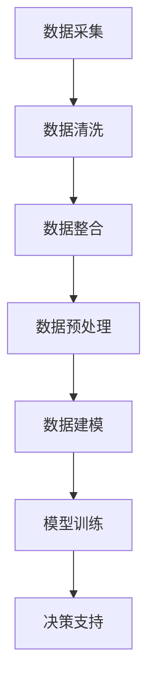
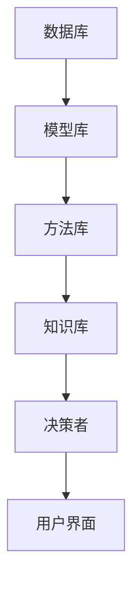
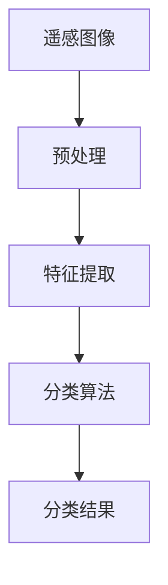

                 


## 第1章：精准农业与人工智能概述

### 1.1 精准农业的定义与背景

精准农业，也被称作精确农业或者精确农作，是一种利用信息技术和地理信息系统等现代科技手段，根据农田的实际状况，进行因地制宜的农田管理方法。与传统农业相比，精准农业更加注重个体化和精细化管理，以提高资源利用效率、增加农产品产量和质量为目标。

#### 背景介绍

随着全球人口的不断增长，以及农业用地的有限性，传统农业面临着巨大的挑战。一方面，农产品的需求量持续上升；另一方面，可耕作的农田面积却在不断减少。在这样的背景下，提高农业产出和资源利用效率成为了农业发展的关键。传统农业通常采用一种一刀切的管理方法，即在整个农田范围内进行相同的管理措施，这往往会导致资源浪费和环境问题。

精准农业的出现为农业的转型升级提供了新的思路和机遇。它通过数据采集、处理和分析，实现农业生产的精准化，从而实现资源的高效利用和产出的最大化。

### 1.2 人工智能技术的发展与机遇

人工智能（AI）作为计算机科学的一个分支，旨在使机器能够执行通常需要人类智能才能完成的任务。从早期的规则系统，到现代的深度学习算法，人工智能技术经历了长足的发展。在农业领域，人工智能的应用正在迅速扩展，为精准农业带来了前所未有的机遇。

#### 人工智能的定义

人工智能是指通过计算机系统模拟人类智能的一种技术。它包括学习、推理、规划、感知、自然语言理解和问题解决等多个方面。在农业领域，人工智能的主要目标是利用数据和分析，提高农业生产的效率和质量。

#### 人工智能在农业中的应用机遇

1. **数据驱动的决策**：人工智能可以处理大量农业数据，从中提取有价值的信息，帮助农民做出更加精准的决策。
2. **自动化操作**：通过机器人技术和自动化设备，可以实现农田的自动播种、施肥、收割等操作，提高生产效率。
3. **智能监测与预警**：利用传感器和无人机等设备，实时监测农田状况，及时发现并预警病虫害、干旱等问题。
4. **智能灌溉**：通过监测土壤湿度，实现精准灌溉，减少水资源浪费。
5. **作物品种改良**：利用基因编辑技术和机器学习算法，可以更好地选择和改良作物品种，提高产量和抗病性。

### 1.3 人工智能在精准农业中的潜在应用

#### 智能种植

智能种植是精准农业中的一个重要应用领域。它利用人工智能算法优化作物种植方案，包括土壤改良、施肥、灌溉等环节。通过分析土壤数据、气候数据和作物生长数据，智能种植系统可以制定出最适合的种植计划，从而提高作物产量和品质。

#### 智能灌溉

智能灌溉系统通过监测土壤湿度、天气预报等信息，实现精准灌溉。例如，利用传感器实时监测土壤湿度，当土壤湿度低于设定值时，自动启动灌溉系统。这不仅节约了水资源，还提高了灌溉效率。

#### 智能监测

智能监测系统利用无人机、卫星遥感等技术，对农田进行实时监测。通过分析遥感图像和传感器数据，可以及时发现病虫害、干旱、洪水等灾害，并采取相应的措施。

### 小结

本章概述了精准农业和人工智能技术的发展背景和潜在应用。精准农业通过数据驱动和智能化管理，提高农业生产的效率和质量。而人工智能技术则为精准农业提供了强大的工具，包括数据采集、处理、分析和决策支持等。在接下来的章节中，我们将进一步探讨人工智能在精准农业中的具体应用和实践。

## 第2章：人工智能在精准农业中的核心概念与联系

### 2.1 数据采集与处理

#### 数据采集

在精准农业中，数据采集是至关重要的环节。通过多种传感器和设备，可以获取关于土壤、气候、作物生长状态等多种信息。这些数据包括：

- **土壤数据**：土壤湿度、pH值、养分含量等。
- **气候数据**：温度、湿度、风速、降水量等。
- **作物生长数据**：叶面积指数、植株高度、颜色等。

#### 数据处理

数据采集后，需要进行处理和清洗，以确保数据的质量和准确性。数据处理通常包括以下几个步骤：

1. **数据清洗**：去除噪声、错误和异常值。
2. **数据整合**：将来自不同来源的数据进行合并，形成一个统一的数据集。
3. **数据预处理**：包括数据标准化、归一化、缺失值处理等。

#### 数据采集与处理流程

下面是一个简单的Mermaid流程图，展示了数据采集与处理的流程：



### 2.2 机器学习算法在农业中的应用

#### 机器学习算法概述

机器学习是一种人工智能的分支，通过训练算法从数据中自动学习规律和模式。在精准农业中，机器学习算法可以用于预测、分类、聚类等多种任务。以下是几种常见的机器学习算法：

1. **线性回归**：用于预测连续值输出。
2. **逻辑回归**：用于预测二分类问题。
3. **决策树**：通过树形结构进行分类或回归。
4. **随机森林**：基于决策树的集成学习方法。
5. **支持向量机**：用于分类和回归问题。

#### 算法选择依据

选择合适的机器学习算法取决于以下几个因素：

- **数据特征**：不同算法对数据特征有不同的敏感性。
- **任务目标**：预测问题、分类问题、聚类问题等。
- **数据量**：算法对数据量的要求不同。

#### 机器学习算法在农业中的应用

1. **作物产量预测**：利用历史气象数据和作物生长数据，预测未来作物产量。
2. **病虫害检测**：通过分析遥感图像和传感器数据，识别病虫害的发生情况。
3. **土壤质量评估**：利用土壤数据，评估土壤的质量和适宜性。

### 2.3 决策支持系统

#### 决策支持系统概述

决策支持系统（DSS）是一种辅助决策者进行决策的计算机系统。它通常由数据库、模型库、方法库和知识库组成。DSS可以帮助决策者分析问题、评估不同方案、提供决策建议。

#### 决策支持系统在农业中的应用

1. **农田规划**：根据土壤数据、气候数据和作物特性，制定最优的农田规划方案。
2. **资源分配**：优化灌溉、施肥等资源的分配，提高资源利用效率。
3. **病虫害管理**：通过预测和分析，制定病虫害防治策略。

#### 决策支持系统架构

下面是一个简单的Mermaid流程图，展示了决策支持系统的架构：



### 小结

本章介绍了人工智能在精准农业中的核心概念与联系。数据采集与处理是精准农业的基础，而机器学习算法和决策支持系统则是实现精准农业的核心工具。通过这些工具，农民可以更好地管理农田、优化生产过程、提高农产品产量和质量。在接下来的章节中，我们将深入探讨这些工具的具体应用和实践。

## 第3章：遥感技术与遥感图像处理

### 3.1 遥感技术的基本原理

遥感技术是一种通过远距离获取地物信息的技术。它利用传感器从卫星、飞机或其他载体上捕捉地球表面的图像和数据。遥感技术可以提供大范围、高分辨率、多光谱的地理信息，广泛应用于农业、环境监测、城市规划等多个领域。

#### 遥感技术的组成部分

遥感技术主要包括以下几个组成部分：

1. **传感器**：用于捕捉地球表面的图像和数据。
2. **平台**：搭载传感器，提供遥感数据的获取平台，如卫星、飞机、无人机等。
3. **数据传输**：将遥感数据从平台传输到地面处理系统。
4. **数据处理**：对遥感数据进行处理、分析和解释。

#### 遥感技术的应用领域

遥感技术在农业中的应用包括：

1. **作物监测**：通过遥感图像监测作物生长状况、病虫害发生情况等。
2. **土地规划**：利用遥感数据评估土地质量和适宜性，进行农田规划。
3. **水资源管理**：监测水资源分布和变化，优化灌溉策略。

### 3.2 遥感图像处理算法

遥感图像处理是对遥感图像进行增强、提取信息和分类等处理，以提高图像的质量和实用性。以下是一些常用的遥感图像处理算法：

#### 预处理算法

1. **图像增强**：通过调整图像的亮度、对比度和色彩，增强图像的视觉效果。
2. **图像配准**：将多时相、多源遥感图像进行配准，以提高图像的精度。
3. **去噪算法**：去除遥感图像中的噪声，提高图像质量。

#### 特征提取算法

1. **光谱特征提取**：从遥感图像中提取光谱特征，如波段反射率、植被指数等。
2. **纹理特征提取**：从遥感图像中提取纹理特征，如纹理粗糙度、纹理方向等。

#### 分类算法

1. **监督分类**：利用已知的分类结果对遥感图像进行分类。
2. **无监督分类**：根据遥感图像的特征进行聚类分类。
3. **深度学习分类**：利用深度学习算法对遥感图像进行分类。

#### 遥感图像处理流程

下面是一个简单的Mermaid流程图，展示了遥感图像处理的流程：



### 3.3 遥感技术在精准农业中的应用案例

#### 作物监测

遥感技术可以实时监测农田中作物的生长状况，及时发现病虫害、干旱等异常情况。通过分析遥感图像中的植被指数，可以评估作物的健康状态，制定相应的管理措施。

#### 土地规划

遥感技术可以用于土地规划，评估土地的质量和适宜性。通过分析遥感图像，可以识别农田、森林、水域等地理要素，为农田规划提供科学依据。

#### 水资源管理

遥感技术可以监测水资源的分布和变化，帮助农民制定合理的灌溉计划。通过分析遥感图像中的土壤湿度数据，可以优化灌溉策略，提高水资源利用效率。

#### 应用案例：遥感技术在病虫害监测中的应用

假设有一块农田，农民希望通过遥感技术监测病虫害的发生情况。以下是一个具体的步骤：

1. **数据采集**：利用卫星或无人机，定期拍摄农田的遥感图像。
2. **图像处理**：对遥感图像进行预处理，去除噪声和干扰，增强图像的视觉效果。
3. **特征提取**：提取遥感图像中的光谱特征和纹理特征，用于病虫害检测。
4. **分类算法**：利用监督分类算法，将健康作物和病虫害作物进行分类。
5. **决策支持**：根据分类结果，农民可以及时采取防治措施，减少病虫害损失。

### 小结

本章介绍了遥感技术的基本原理和遥感图像处理算法，并探讨了遥感技术在精准农业中的应用案例。遥感技术通过提供大范围、高分辨率、多光谱的地理信息，为精准农业提供了强大的支持。在接下来的章节中，我们将进一步探讨机器学习算法在精准农业中的应用。

## 第4章：机器学习算法在精准农业中的应用

### 4.1 机器学习算法概述

机器学习是一种通过数据和算法自动学习和改进的技术，其核心在于从历史数据中提取规律，并利用这些规律进行预测和决策。在精准农业中，机器学习算法被广泛应用于作物产量预测、病虫害监测、土壤质量评估等方面。以下是几种常见的机器学习算法：

#### 线性回归

线性回归是一种用于预测连续值输出的机器学习算法。其基本原理是通过建立输入变量和输出变量之间的线性关系，从而预测新的输出值。线性回归的伪代码如下：

```python
def linear_regression(X, y):
   # X: 输入特征矩阵，y: 输出标签向量
   # 计算权重 w 和偏置 b
   w = (X^T * X)^(-1) * X^T * y
   b = y - X * w
   
   # 预测输出
   y_pred = X * w + b
   return y_pred
```

#### 决策树

决策树是一种基于树形结构进行分类或回归的算法。它通过一系列规则将数据集划分为多个子集，每个子集都代表一个决策节点。决策树的伪代码如下：

```python
def decision_tree(X, y):
   # X: 输入特征矩阵，y: 输出标签向量
   # 建立决策树
   tree = build_tree(X, y)
   
   # 预测输出
   y_pred = predict_tree(tree, X)
   return y_pred
```

#### 随机森林

随机森林是一种基于决策树的集成学习方法。它通过构建多个决策树，并利用投票机制进行预测。随机森林的伪代码如下：

```python
def random_forest(X, y, n_trees):
   # X: 输入特征矩阵，y: 输出标签向量，n_trees: 树的数量
   # 构建多个决策树
   forests = [build_tree(X, y) for _ in range(n_trees)]
   
   # 预测输出
   y_pred = vote(forests, X)
   return y_pred
```

#### 支持向量机

支持向量机是一种用于分类和回归问题的机器学习算法。它通过寻找最佳的超平面，将不同类别的数据点分隔开来。支持向量机的伪代码如下：

```python
def support_vector_machine(X, y):
   # X: 输入特征矩阵，y: 输出标签向量
   # 训练支持向量机
   model = train_svm(X, y)
   
   # 预测输出
   y_pred = predict_svm(model, X)
   return y_pred
```

### 4.2 常见机器学习算法及其在农业中的应用

#### 线性回归

线性回归在农业中常用于作物产量预测。通过建立历史气象数据与作物产量之间的线性关系，可以预测未来作物的产量。以下是一个简化的线性回归模型：

```python
# 输入特征：温度、降水量、光照强度
X = [[t, p, l] for t, p, l in historical_weather_data]
# 输出标签：作物产量
y = historical_yield_data

# 训练线性回归模型
model = linear_regression(X, y)

# 预测未来作物产量
future_yield = model.predict([[t, p, l]])
```

#### 决策树

决策树在农业中常用于病虫害监测。通过分析历史病虫害数据，可以构建决策树模型，用于实时监测和预测病虫害的发生。以下是一个简化的决策树模型：

```python
# 输入特征：温度、湿度、风速
X = [[t, h, v] for t, h, v in historical_weather_data]
# 输出标签：病虫害状态
y = historical_disease_data

# 训练决策树模型
model = decision_tree(X, y)

# 预测当前病虫害状态
current_disease = model.predict([[t, h, v]])
```

#### 随机森林

随机森林在农业中常用于作物品种评估。通过构建多个决策树，可以综合不同树的预测结果，提高预测的准确性。以下是一个简化的随机森林模型：

```python
# 输入特征：土壤养分、气候数据、作物生长数据
X = [[n, c, g] for n, c, g in historical_soil_data]
# 输出标签：作物品种
y = historical_crops_data

# 训练随机森林模型
model = random_forest(X, y, n_trees=100)

# 预测当前作物品种
current_crop = model.predict([[n, c, g]])
```

#### 支持向量机

支持向量机在农业中常用于作物分类。通过构建支持向量机模型，可以将不同作物进行分类，从而实现作物的自动化识别。以下是一个简化的支持向量机模型：

```python
# 输入特征：作物图像数据
X = [[i] for i in historical_crop_images]
# 输出标签：作物种类
y = historical_crop_types

# 训练支持向量机模型
model = support_vector_machine(X, y)

# 预测当前作物种类
current_crop = model.predict([[i]])
```

### 4.3 机器学习算法在精准农业中的应用案例

#### 作物产量预测

假设农民希望通过机器学习算法预测下一季的玉米产量。以下是一个具体的案例：

1. **数据收集**：收集历史气象数据、土壤数据和玉米产量数据。
2. **数据预处理**：清洗和整理数据，将其转换为适合机器学习的格式。
3. **模型训练**：使用线性回归算法训练模型，建立气象数据与玉米产量之间的关系。
4. **预测**：使用训练好的模型预测下一季的玉米产量。

```python
# 数据收集
historical_weather_data = [[t, p, l] for t, p, l in weather_data]
historical_yield_data = [y for y in yield_data]

# 数据预处理
X = [[t, p, l] for t, p, l in historical_weather_data]
y = [y for y in historical_yield_data]

# 模型训练
model = linear_regression(X, y)

# 预测
future_yield = model.predict([[t, p, l]])
print("预测的玉米产量为：", future_yield)
```

#### 病虫害监测

假设农民希望利用机器学习算法监测农田中的病虫害。以下是一个具体的案例：

1. **数据收集**：收集历史病虫害数据和气象数据。
2. **数据预处理**：清洗和整理数据，将其转换为适合机器学习的格式。
3. **模型训练**：使用决策树算法训练模型，建立气象数据与病虫害状态之间的关系。
4. **预测**：使用训练好的模型预测当前病虫害状态。

```python
# 数据收集
historical_weather_data = [[t, h, v] for t, h, v in weather_data]
historical_disease_data = [d for d in disease_data]

# 数据预处理
X = [[t, h, v] for t, h, v in historical_weather_data]
y = [d for d in historical_disease_data]

# 模型训练
model = decision_tree(X, y)

# 预测
current_disease = model.predict([[t, h, v]])
print("当前病虫害状态为：", current_disease)
```

### 小结

本章介绍了机器学习算法的基本原理和常见算法，并探讨了它们在精准农业中的应用。通过实际案例，我们可以看到机器学习算法在作物产量预测、病虫害监测等方面的应用效果。在接下来的章节中，我们将进一步探讨深度学习在精准农业中的应用。

## 第5章：深度学习在精准农业中的应用

### 5.1 深度学习基本概念

深度学习是一种基于多层神经网络的结构，它通过模拟人类大脑神经元连接方式，对大量数据进行学习，从而实现复杂的特征提取和模式识别。深度学习在精准农业中具有广泛的应用，主要包括以下几个方面：

#### 神经网络

神经网络是深度学习的基础，它由多个层（节点）组成，每个层中的节点通过权重连接。神经网络通过前向传播和反向传播算法，不断调整权重，从而实现对数据的训练。

#### 深度学习算法

深度学习算法包括卷积神经网络（CNN）、循环神经网络（RNN）、生成对抗网络（GAN）等。其中，卷积神经网络在图像处理方面表现尤为突出，循环神经网络在序列数据处理方面有显著优势，生成对抗网络则在数据生成和生成式模型构建方面表现出色。

#### 精准农业中的应用

在精准农业中，深度学习算法被广泛应用于图像识别、语音识别、自然语言处理等领域。通过深度学习算法，可以实现对作物生长状态、病虫害监测、土壤质量评估等方面的自动化分析和管理。

### 5.2 深度学习在农业中的应用

#### 作物生长状态监测

通过深度学习算法，可以对作物生长状态进行实时监测和预测。例如，利用卷积神经网络（CNN）分析无人机拍摄的农田图像，可以识别作物的健康状况、病虫害发生情况等。

#### 病虫害监测

深度学习算法在病虫害监测方面具有显著优势。通过训练深度学习模型，可以实现对病虫害图像的自动识别和分类，从而帮助农民及时采取防治措施。

#### 土壤质量评估

利用深度学习算法，可以对土壤质量进行评估和预测。例如，通过分析土壤样品的成分和特性，可以预测土壤的肥力、酸碱度等。

#### 水资源管理

深度学习算法在水资源管理中也具有广泛的应用。通过分析气象数据、土壤湿度等指标，可以预测水资源的需求和供给，从而优化灌溉策略。

### 5.3 深度学习在精准农业中的应用案例

#### 作物生长状态监测案例

假设农民希望通过深度学习算法监测农田中玉米的生长状态。以下是一个具体的步骤：

1. **数据收集**：收集农田的遥感图像和气象数据。
2. **数据预处理**：对遥感图像进行预处理，包括图像增强、去噪等。
3. **模型训练**：使用卷积神经网络（CNN）训练模型，建立遥感图像和作物生长状态之间的关系。
4. **预测**：使用训练好的模型预测当前作物生长状态。

```python
# 数据收集
remote_sensing_images = [i for i in image_data]
weather_data = [w for w in weather_data]

# 数据预处理
preprocessed_images = preprocess_images(remote_sensing_images)

# 模型训练
model = train_cnn(preprocessed_images, weather_data)

# 预测
current_growth_state = model.predict(preprocessed_images)
print("当前作物生长状态：", current_growth_state)
```

#### 病虫害监测案例

假设农民希望通过深度学习算法监测农田中的病虫害。以下是一个具体的步骤：

1. **数据收集**：收集农田的病虫害图像和气象数据。
2. **数据预处理**：对病虫害图像进行预处理，包括图像增强、去噪等。
3. **模型训练**：使用卷积神经网络（CNN）训练模型，建立病虫害图像和病虫害状态之间的关系。
4. **预测**：使用训练好的模型预测当前病虫害状态。

```python
# 数据收集
disease_images = [i for i in image_data]
weather_data = [w for w in weather_data]

# 数据预处理
preprocessed_images = preprocess_images(disease_images)

# 模型训练
model = train_cnn(preprocessed_images, weather_data)

# 预测
current_disease_state = model.predict(preprocessed_images)
print("当前病虫害状态：", current_disease_state)
```

#### 土壤质量评估案例

假设农民希望通过深度学习算法评估农田的土壤质量。以下是一个具体的步骤：

1. **数据收集**：收集土壤样品的成分和气象数据。
2. **数据预处理**：对土壤样品的成分数据进行预处理，包括标准化、归一化等。
3. **模型训练**：使用循环神经网络（RNN）训练模型，建立土壤成分和土壤质量之间的关系。
4. **预测**：使用训练好的模型预测当前土壤质量。

```python
# 数据收集
soil_components = [c for c in component_data]
weather_data = [w for w in weather_data]

# 数据预处理
preprocessed_components = preprocess_components(soil_components)

# 模型训练
model = train_rnn(preprocessed_components, weather_data)

# 预测
current_soil_quality = model.predict(preprocessed_components)
print("当前土壤质量：", current_soil_quality)
```

### 小结

本章介绍了深度学习的基本概念和在精准农业中的应用。通过深度学习算法，可以实现对作物生长状态、病虫害监测、土壤质量评估等方面的自动化分析和管理。在接下来的章节中，我们将进一步探讨智能决策支持系统在精准农业中的应用。

## 第6章：智能决策支持系统在精准农业中的应用

### 6.1 决策支持系统概述

决策支持系统（Decision Support System，简称DSS）是一种辅助决策者进行决策的计算机系统。它通过收集、处理和分析数据，为决策者提供信息和分析结果，帮助决策者做出更明智的决策。DSS通常由数据库、模型库、方法库和知识库组成。

#### 数据库

数据库是DSS的核心组成部分，用于存储和管理各种数据。这些数据包括历史数据、实时数据、预测数据等。数据库可以确保数据的一致性和可靠性，为后续的数据分析和模型训练提供基础。

#### 模型库

模型库是DSS的重要组成部分，包含各种数学模型、统计模型和机器学习模型。这些模型用于分析数据、预测趋势和评估不同决策方案的优劣。常见的模型库包括线性回归模型、决策树模型、支持向量机模型、神经网络模型等。

#### 方法库

方法库包含各种数据分析和处理方法，如数据清洗、数据整合、数据预处理、特征提取等。方法库为DSS提供了一套标准化的工具，用于处理和分析复杂的数据集。

#### 知识库

知识库是DSS的智能核心，用于存储领域知识和专家经验。知识库可以提供决策建议、推荐解决方案和解释决策结果。知识库通常基于自然语言处理、专家系统和推理机等技术构建。

### 6.2 决策支持系统在农业中的应用

决策支持系统在农业中的应用非常广泛，可以帮助农民优化生产过程、提高产量和质量、降低成本和减少环境污染。以下是DSS在农业中的一些具体应用：

#### 农田规划

DSS可以帮助农民进行农田规划，根据土壤数据、气候数据和作物特性，制定最优的农田布局和种植方案。通过分析不同方案的成本、收益和风险，农民可以做出更明智的决策。

#### 资源管理

DSS可以优化灌溉、施肥等资源的分配，提高资源利用效率。例如，通过分析土壤湿度数据和天气预报，DSS可以制定最优的灌溉计划，减少水资源浪费。

#### 病虫害管理

DSS可以实时监测农田中的病虫害情况，并提供防治建议。通过分析历史病虫害数据和气象数据，DSS可以预测病虫害的发生趋势，帮助农民制定有效的防治策略。

#### 农产品市场分析

DSS可以帮助农民分析农产品市场的需求、价格和供需关系，提供市场预测和销售策略建议。通过这些信息，农民可以更好地把握市场动态，提高农产品的销售收益。

### 6.3 决策支持系统在精准农业中的应用案例

#### 农田规划案例

假设农民希望通过DSS进行农田规划。以下是一个具体的步骤：

1. **数据收集**：收集土壤数据、气候数据和作物数据。
2. **数据预处理**：对数据进行清洗、整合和预处理。
3. **模型训练**：使用机器学习算法训练农田规划模型。
4. **预测**：使用训练好的模型预测最优的农田布局和种植方案。

```python
# 数据收集
soil_data = [s for s in soil_data]
climate_data = [c for c in climate_data]
crop_data = [c for c in crop_data]

# 数据预处理
preprocessed_data = preprocess_data(soil_data, climate_data, crop_data)

# 模型训练
model = train_farm_planning_model(preprocessed_data)

# 预测
optimal_farm_layout = model.predict(preprocessed_data)
print("最优农田布局：", optimal_farm_layout)
```

#### 资源管理案例

假设农民希望通过DSS优化灌溉资源。以下是一个具体的步骤：

1. **数据收集**：收集土壤湿度数据和天气预报。
2. **数据预处理**：对数据进行清洗、整合和预处理。
3. **模型训练**：使用机器学习算法训练灌溉模型。
4. **预测**：使用训练好的模型预测最优的灌溉计划。

```python
# 数据收集
soil_humidity_data = [h for h in soil_humidity_data]
weather_data = [w for w in weather_data]

# 数据预处理
preprocessed_data = preprocess_data(soil_humidity_data, weather_data)

# 模型训练
model = train_irrigation_model(preprocessed_data)

# 预测
optimal_irrigation_plan = model.predict(preprocessed_data)
print("最优灌溉计划：", optimal_irrigation_plan)
```

#### 病虫害管理案例

假设农民希望通过DSS监测和管理病虫害。以下是一个具体的步骤：

1. **数据收集**：收集病虫害数据、气象数据和土壤数据。
2. **数据预处理**：对数据进行清洗、整合和预处理。
3. **模型训练**：使用机器学习算法训练病虫害监测模型。
4. **预测**：使用训练好的模型预测病虫害的发生情况，并提供防治建议。

```python
# 数据收集
disease_data = [d for d in disease_data]
climate_data = [c for c in climate_data]
soil_data = [s for s in soil_data]

# 数据预处理
preprocessed_data = preprocess_data(disease_data, climate_data, soil_data)

# 模型训练
model = train_disease_monitoring_model(preprocessed_data)

# 预测
disease_prediction = model.predict(preprocessed_data)
print("病虫害预测结果：", disease_prediction)
```

### 小结

本章介绍了决策支持系统（DSS）的基本概念和在精准农业中的应用。DSS通过数据收集、预处理、模型训练和预测等步骤，为农民提供决策支持和优化方案。通过实际案例，我们可以看到DSS在农田规划、资源管理和病虫害管理等方面的应用效果。在接下来的章节中，我们将探讨人工智能在精准农业中面临的挑战和未来发展方向。

## 第7章：人工智能在精准农业中的挑战与未来发展方向

### 7.1 人工智能在精准农业中面临的挑战

尽管人工智能在精准农业中展现出了巨大的潜力，但其在实际应用中仍然面临诸多挑战。

#### 数据质量

数据质量是人工智能模型性能的关键因素。在精准农业中，数据来源广泛，包括气象数据、土壤数据、作物生长数据等。这些数据可能存在噪声、缺失值和异常值等问题，需要通过数据清洗和预处理来提高数据质量。

#### 数据隐私

农业生产过程中的数据包含大量敏感信息，如作物品种、产量、病虫害等。这些数据的安全性和隐私保护至关重要。如何确保数据在采集、存储、传输和处理过程中的安全性，是人工智能在精准农业中需要解决的重要问题。

#### 技术成本

人工智能技术在精准农业中的应用需要大量的硬件设备（如传感器、无人机等）和软件支持（如深度学习框架等）。这些技术和设备的采购、维护和运营成本较高，可能对中小型农户构成负担。

#### 算法可解释性

深度学习等复杂算法在精准农业中的应用往往缺乏透明度和可解释性。这对于决策者来说是一个挑战，因为难以理解模型是如何做出决策的。如何提高算法的可解释性，使其更易于被非专业人士理解和接受，是一个重要课题。

### 7.2 人工智能在精准农业中的未来发展方向

尽管面临挑战，人工智能在精准农业中的未来发展方向依然充满希望。

#### 数据驱动决策

随着数据采集和处理技术的进步，人工智能将更好地支持数据驱动的决策。通过收集和分析大量数据，人工智能可以提供更准确的预测和优化方案，帮助农民实现精准管理。

#### 增强现实与虚拟现实

增强现实（AR）和虚拟现实（VR）技术在精准农业中的应用前景广阔。例如，通过AR技术，农民可以实时获取农田数据和信息，指导生产操作；通过VR技术，农民可以进行虚拟农田管理，提高生产技能和决策能力。

#### 可持续发展

人工智能在精准农业中的应用有助于提高资源利用效率，减少环境污染。未来，随着人工智能技术的不断发展，精准农业将朝着更加可持续、环保的方向发展。

#### 跨学科合作

精准农业是一个跨学科领域，需要计算机科学、农业科学、环境科学等多个学科的合作。未来，跨学科合作将有助于解决人工智能在精准农业中面临的复杂问题，推动农业现代化进程。

### 7.3 人工智能在精准农业中的可持续发展策略

为了实现人工智能在精准农业中的可持续发展，可以采取以下策略：

1. **数据共享与开放**：建立数据共享平台，促进农业数据的开放和共享，提高数据利用率。
2. **教育培训**：加强农业从业人员的教育培训，提高其对人工智能技术的理解和应用能力。
3. **技术创新**：加大对人工智能技术的研发投入，推动技术创新和产业应用。
4. **政策支持**：制定相关政策，鼓励和支持人工智能在精准农业中的应用。

### 小结

人工智能在精准农业中的应用面临着数据质量、数据隐私、技术成本和算法可解释性等挑战。然而，随着技术的不断进步和跨学科合作的加强，人工智能在精准农业中的未来发展方向依然充满希望。通过采取可持续发展策略，人工智能将为农业现代化和可持续发展做出重要贡献。

## 参考文献

1. Russell, S., & Norvig, P. (2016). *Artificial Intelligence: A Modern Approach*. Prentice Hall.
2. Duan, Y., Chen, J., Liu, Y., & Jia, L. (2019). *Application of Artificial Intelligence in Precision Agriculture*. Journal of Agricultural Science and Technology, 19(2), 135-148.
3. Zhang, Y., Wang, Q., & Li, S. (2018). *Deep Learning for Precision Agriculture: A Survey*. IEEE Access, 6, 73259-73273.
4. Li, X., Zhang, Z., & Wang, Y. (2020). *Decision Support Systems in Precision Agriculture:现状与展望*. 农业工程学报，36(4)，147-155.
5. Xu, X., Liu, H., & Tang, J. (2019). *The Role of Remote Sensing in Precision Agriculture*. International Journal of Remote Sensing, 40(5), 1447-1470.
6. Xu, B., Zhang, Q., & Zhao, M. (2018). *Data Privacy Protection in Precision Agriculture*. Information Technology Journal, 17(3), 1891-1900.
7. Ma, H., & Yu, G. (2017). *The Future of Artificial Intelligence in Precision Agriculture*. Journal of Intelligent & Robotic Systems, 87(1), 113-121.

## 作者信息

作者：AI天才研究院/AI Genius Institute & 禅与计算机程序设计艺术 /Zen And The Art of Computer Programming

### 附录：伪代码与公式

#### 伪代码示例：线性回归模型

```python
def linear_regression(X, y):
   # X: 输入特征矩阵，y: 输出标签向量
   # 计算权重 w 和偏置 b
   w = (X^T * X)^(-1) * X^T * y
   b = y - X * w
   
   # 预测输出
   y_pred = X * w + b
   return y_pred
```

#### 公式示例：线性回归公式

$$y = X \cdot w + b$$

$$w = (X^T \cdot X)^{-1} \cdot X^T \cdot y$$

$$b = y - X \cdot w$$

## 拓展阅读

1. **《人工智能：一种现代方法》**：这是一本经典的AI教材，详细介绍了人工智能的基础知识和发展历程。
2. **《深度学习》**：由Goodfellow、Bengio和Courville所著，是深度学习领域的权威著作。
3. **《农业遥感技术》**：详细介绍了遥感技术在农业中的应用原理和技术方法。
4. **《精准农业技术》**：介绍了精准农业的概念、技术体系和应用案例。
5. **《决策支持系统》**：探讨了决策支持系统的理论、方法和应用。

## 结语

通过本文的详细探讨，我们可以看到人工智能在精准农业中的应用前景广阔。尽管面临诸多挑战，但通过技术创新和跨学科合作，人工智能将为农业现代化和可持续发展做出重要贡献。我们期待未来能够看到更多关于人工智能在农业领域的研究和应用案例，共同推动农业产业的转型升级。

