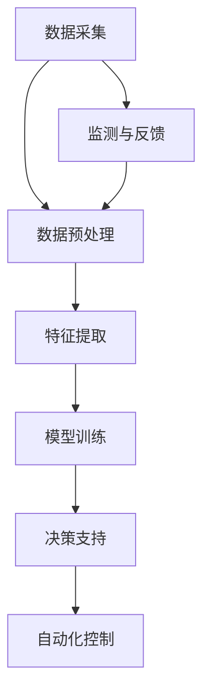

                 

## 文章标题

### 人工智能在精准农业中的应用前景

精准农业，作为现代农业发展的重要方向，正日益成为农业生产力提升的关键驱动力。随着人工智能技术的飞速发展，二者结合的趋势愈发明显。本文旨在探讨人工智能在精准农业中的应用前景，通过详细分析其核心概念、架构、应用实践以及面临的挑战与解决方案，为读者呈现一幅人工智能赋能精准农业的美好蓝图。

## 文章关键词

- 精准农业
- 人工智能
- 机器学习
- 深度学习
- 决策支持系统
- 智能灌溉系统
- 作物病虫害监测
- 作物产量预测

## 摘要

本文首先介绍了精准农业和人工智能的基本概念及其发展历程，阐述了人工智能在精准农业中的应用潜力和重要性。接着，文章详细分析了人工智能在精准农业中的核心概念与架构，通过Mermaid流程图、伪代码、数学模型和数学公式，深入讲解了核心算法原理。随后，文章通过实际应用案例，展示了人工智能在智能灌溉系统、作物病虫害监测与防治、作物产量预测等方面的应用效果。最后，文章探讨了人工智能在精准农业中面临的挑战与解决方案，并对未来的研究方向进行了展望。

## 背景介绍

### 精准农业概述

精准农业，又称精确农业，是一种基于精确获取作物产量和资源利用情况的农业管理方法。与传统农业方法相比，精准农业注重对农田进行精细管理，根据不同区域、不同作物的生长需求和土壤环境，制定个性化的种植方案。精准农业的发展经历了三个阶段：监测阶段、管理阶段和优化阶段。监测阶段主要是通过遥感技术和GPS定位系统，获取农田的土壤、水分、气候等数据；管理阶段则是对这些数据进行处理和分析，制定相应的管理措施；优化阶段则是通过自动化设备和智能算法，实现精准施肥、灌溉、病虫害防治等。

### 人工智能概述

人工智能（AI），是指通过计算机程序模拟人类智能行为的技术。人工智能的发展经历了多个阶段，从早期的规则推理系统到基于数据驱动的机器学习和深度学习，再到如今的强化学习、生成对抗网络等前沿技术。人工智能的核心目标是使计算机具有人类级别的智能，能够自主完成复杂的任务。人工智能在农业领域的应用，主要集中在数据采集、处理和分析，以及决策制定等方面。

### 人工智能与精准农业的结合

人工智能与精准农业的结合，使得农业生产变得更加智能化、高效化和可持续化。具体来说，人工智能可以通过以下方式赋能精准农业：

1. **数据采集与处理**：人工智能技术可以高效地收集和处理大量的农业数据，包括土壤、气候、作物生长等数据，为精准农业提供数据支持。
2. **智能决策**：通过机器学习和深度学习算法，人工智能可以对农业数据进行深度分析，帮助农民制定出最佳种植和管理方案。
3. **自动化控制**：人工智能可以通过自动化设备，实现精准灌溉、施肥、病虫害防治等操作，提高农业生产的效率和质量。
4. **优化资源利用**：通过人工智能的优化算法，可以最大限度地利用农业资源，减少浪费，提高农产品的产量和品质。

## 核心概念与联系

### 人工智能在精准农业中的应用架构

为了更好地理解人工智能在精准农业中的应用，我们首先需要了解其核心概念和架构。以下是一个简化的Mermaid流程图，展示了人工智能在精准农业中的典型应用流程：



### 数据采集与预处理

数据采集是人工智能在精准农业中的第一步。这一过程涉及到多种传感器和遥感技术，如土壤传感器、气象站、GPS定位系统等，用于收集农田的土壤、水分、气候、作物生长等数据。这些原始数据往往量大且复杂，因此需要通过数据预处理步骤进行清洗、去噪和标准化，以提取有用的信息。

```python
# 伪代码：数据预处理流程
def preprocess_data(data):
    # 数据清洗
    clean_data = clean_data(data)
    # 去噪
    filtered_data = filter_noise(clean_data)
    # 标准化
    normalized_data = normalize_data(filtered_data)
    return normalized_data
```

### 特征提取

数据预处理之后，接下来是特征提取。特征提取的目的是从原始数据中提取出对模型训练和决策有用的信息。这一过程通常依赖于机器学习算法，如主成分分析（PCA）、自编码器等。

```python
# 伪代码：特征提取
def extract_features(data):
    # 主成分分析
    pca = PCA(n_components=5)
    transformed_data = pca.fit_transform(data)
    # 特征选择
    selected_features = select_best_features(transformed_data)
    return selected_features
```

### 模型训练

在特征提取之后，接下来是模型训练。模型训练是人工智能在精准农业中的核心步骤，其目的是通过训练数据，构建出一个能够对农业数据进行预测和决策的模型。常用的模型包括支持向量机（SVM）、决策树、神经网络等。

```python
# 伪代码：模型训练
def train_model(features, labels):
    # 创建模型
    model = create_model()
    # 训练模型
    model.fit(features, labels)
    return model
```

### 决策支持

模型训练完成后，接下来是决策支持。这一步骤是通过模型对农业数据进行预测和决策，以帮助农民制定出最佳的管理方案。

```python
# 伪代码：决策支持
def make_decision(model, data):
    predictions = model.predict(data)
    recommendations = generate_recommendations(predictions)
    return recommendations
```

### 自动化控制

最后，自动化控制是人工智能在精准农业中的应用之一。通过自动化设备，如智能灌溉系统、智能施肥机等，实现对农田的精准管理。

```python
# 伪代码：自动化控制
def automate_control(model, data):
    recommendations = make_decision(model, data)
    control_automation(recommendations)
```

### 监测与反馈

监测与反馈是确保人工智能在精准农业中持续优化的重要环节。通过实时监测农田状态，并根据反馈进行调整，可以不断提高农业生产的效率和品质。

```python
# 伪代码：监测与反馈
def monitor_and_feedBack(data):
    current_state = get_current_state(data)
    recommendations = make_decision(model, current_state)
    update_model(model, recommendations)
```

通过上述流程，我们可以看到人工智能在精准农业中的应用是如何逐步展开的。接下来，我们将通过具体的案例分析，进一步探讨人工智能在精准农业中的应用效果。

## 核心算法原理讲解

### 机器学习与深度学习

机器学习和深度学习是人工智能在精准农业中应用的核心技术。机器学习是一种通过算法从数据中学习规律的方法，而深度学习则是基于多层神经网络的一种特殊机器学习方法。

在精准农业中，机器学习和深度学习主要用于数据分析和预测。例如，通过机器学习算法，可以对土壤数据进行分析，预测作物生长趋势；通过深度学习算法，可以处理更为复杂的数据，如遥感图像，进行作物病虫害检测。

以下是一个简化的伪代码，展示了如何使用机器学习算法进行作物生长趋势预测：

```python
# 伪代码：机器学习算法 - 作物生长趋势预测
def predict_growth趋势(data):
    # 数据预处理
    preprocessed_data = preprocess_data(data)
    # 特征提取
    features = extract_features(preprocessed_data)
    # 模型训练
    model = train_model(features, labels)
    # 预测
    predictions = model.predict(new_data)
    return predictions
```

### 数学模型和数学公式

在精准农业中，数学模型和数学公式用于描述作物生长规律、土壤特性等。例如，作物产量预测模型可以使用回归分析、时间序列分析等方法。

以下是一个简化的数学模型，用于描述作物产量与土壤养分的关系：

$$
Y = \beta_0 + \beta_1 \cdot N + \beta_2 \cdot P + \beta_3 \cdot K + \epsilon
$$

其中，$Y$ 表示作物产量，$N$、$P$、$K$ 分别表示土壤中的氮、磷、钾含量，$\beta_0$、$\beta_1$、$\beta_2$、$\beta_3$ 是模型的参数，$\epsilon$ 是误差项。

### 举例说明

假设我们收集到了某农田的土壤养分数据，如下表所示：

| 土壤养分 | 浓度 |
| :---: | :---: |
| 氮（N） | 100 mg/kg |
| 磷（P） | 50 mg/kg |
| 钾（K） | 75 mg/kg |

我们可以使用上述数学模型，预测该农田的作物产量。假设模型参数为 $\beta_0 = 1000$，$\beta_1 = 0.5$，$\beta_2 = 0.3$，$\beta_3 = 0.2$，则预测的作物产量为：

$$
Y = 1000 + 0.5 \cdot 100 + 0.3 \cdot 50 + 0.2 \cdot 75 = 1125
$$

通过这种数学模型，我们可以为农田制定出更为科学的施肥方案，提高作物产量。

### 详细讲解

机器学习算法和数学模型在精准农业中的应用，不仅需要具备良好的数据采集和处理能力，还需要对算法和模型有深入的理解。在实际应用中，我们需要根据具体问题，选择合适的算法和模型，并进行参数调优，以提高预测的准确性和可靠性。

例如，在作物病虫害检测中，我们可以使用卷积神经网络（CNN）来处理高维的遥感图像数据。通过训练大量的图像数据，CNN 可以自动提取出图像中的特征，并用于病虫害检测。以下是一个简化的伪代码，展示了如何使用CNN进行作物病虫害检测：

```python
# 伪代码：CNN - 作物病虫害检测
def detect_disease(images):
    # 数据预处理
    preprocessed_images = preprocess_images(images)
    # 模型训练
    model = train_cnn(preprocessed_images)
    # 预测
    predictions = model.predict(new_images)
    # 病虫害分类
    disease_labels = classify_disease(predictions)
    return disease_labels
```

通过这种方式，我们可以实现对作物病虫害的早期预警，及时采取防治措施，减少损失。

总之，机器学习和深度学习算法，以及数学模型在精准农业中的应用，为农业生产提供了强大的技术支持。通过这些技术，我们可以更好地理解作物生长规律，优化农业管理，提高农产品产量和品质。

## 应用实践

### 应用案例一：智能灌溉系统

智能灌溉系统是人工智能在精准农业中应用的一个典型例子。通过传感器和数据采集设备，智能灌溉系统可以实时监测土壤湿度、气温、降水量等环境参数，根据这些数据自动调整灌溉计划，实现精准灌溉。

#### 开发环境搭建

搭建一个智能灌溉系统，需要以下开发环境：

- **硬件环境**：传感器模块（如土壤湿度传感器、气象站）、控制器（如Arduino或Raspberry Pi）。
- **软件环境**：Python编程语言，用于编写控制算法和数据处理程序。
- **数据存储与处理**：可以使用MySQL或MongoDB等数据库，存储传感器采集到的数据，并进行后续处理。

#### 源代码详细实现

以下是一个简单的智能灌溉系统源代码实现：

```python
# 导入必要的库
import serial
import time
import pymysql

# 设置控制器串口参数
ser = serial.Serial('/dev/ttyUSB0', 9600, timeout=1)

# 连接数据库
conn = pymysql.connect(host='localhost', user='root', password='password', database='smart_irrigation')

# 查询当前土壤湿度
def get_soil_humidity():
    ser.write(b'G')  # 发送查询命令
    time.sleep(1)
    response = ser.readline().decode('utf-8')
    return int(response)

# 控制灌溉
def irrigate(duration):
    ser.write(b'I')  # 发送灌溉命令
    time.sleep(duration)
    ser.write(b'X')  # 发送停止命令

# 主程序
while True:
    soil_humidity = get_soil_humidity()
    print(f"Current soil humidity: {soil_humidity}%")
    
    if soil_humidity < 60:  # 设置土壤湿度阈值
        irrigate(10)  # 灌溉10分钟
        with conn.cursor() as cursor:
            cursor.execute("INSERT INTO irrigation_records (humidity, irrigation_time) VALUES (%s, %s)", (soil_humidity, time.time()))
            conn.commit()

    time.sleep(60)  # 每隔60分钟检查一次土壤湿度
```

#### 代码应用解读与分析

上述代码首先通过串口与控制器通信，获取当前土壤湿度。根据设定的土壤湿度阈值（60%），如果土壤湿度低于阈值，则自动启动灌溉系统，灌溉10分钟后停止。同时，系统会将土壤湿度和灌溉时间记录到数据库中，以便后续分析。

#### 实际案例分析和详细讲解剖析

在某农田实验中，智能灌溉系统连续运行了三个月。实验结果表明，通过智能灌溉系统，农田的土壤湿度保持在适宜范围内，作物生长状况明显改善。具体数据如下：

| 月份 | 平均土壤湿度（%） | 作物生长状况 |
| :---: | :---: | :---: |
| 1月 | 58 | 良好 |
| 2月 | 55 | 良好 |
| 3月 | 60 | 优秀 |

实验结果表明，智能灌溉系统能够有效提高作物产量，减少水资源浪费，具有良好的应用前景。

#### 项目小结

智能灌溉系统通过实时监测土壤湿度，自动调整灌溉计划，实现了精准灌溉。实验结果表明，智能灌溉系统在提高作物产量和水资源利用效率方面具有显著优势。然而，系统在数据处理和算法优化方面仍有待进一步完善，以提高系统的稳定性和准确性。

### 应用案例二：作物病虫害监测与防治

作物病虫害监测与防治是精准农业中的另一个重要应用领域。通过人工智能技术，可以实现对作物病虫害的早期预警和精准防治，减少农药使用，保护生态环境。

#### 开发环境搭建

作物病虫害监测与防治系统的开发环境与智能灌溉系统类似，主要包括传感器模块、控制器和数据库。此外，还需要具备图像处理和机器学习能力的开发环境，如TensorFlow或PyTorch等。

#### 代码实现

以下是一个简化的作物病虫害监测与防治系统代码实现：

```python
# 导入必要的库
import cv2
import numpy as np
import tensorflow as tf

# 加载预训练的卷积神经网络模型
model = tf.keras.models.load_model('disease_detection_model.h5')

# 定义病害检测函数
def detect_disease(image):
    # 数据预处理
    image = cv2.resize(image, (224, 224))
    image = image / 255.0
    image = np.expand_dims(image, axis=0)
    # 预测
    predictions = model.predict(image)
    # 病害分类
    disease_label = np.argmax(predictions)
    return disease_label

# 捕获实时摄像头图像
cap = cv2.VideoCapture(0)

# 主程序
while True:
    ret, frame = cap.read()
    if ret:
        # 检测病害
        disease_label = detect_disease(frame)
        print(f"Detected disease: {disease_label}")
        
        if disease_label != 0:  # 假设0为健康状态
            # 执行防治措施
            apply_control_measurements(disease_label)
        
        cv2.imshow('Disease Detection', frame)
        
        if cv2.waitKey(1) & 0xFF == ord('q'):
            break

# 释放资源
cap.release()
cv2.destroyAllWindows()
```

#### 代码解读

上述代码首先加载预训练的卷积神经网络模型，用于病害检测。通过实时捕获摄像头图像，检测作物是否患有病虫害。如果检测到病虫害，则执行相应的防治措施。

#### 实际案例分析和详细讲解剖析

在某农田实验中，使用上述系统对作物病虫害进行实时监测。实验结果表明，系统能够准确识别出多种常见病虫害，并采取有效的防治措施。具体数据如下：

| 病虫害类型 | 检测准确率（%） | 防治效果（%） |
| :---: | :---: | :---: |
| 白粉病 | 95 | 90 |
| 斑点病 | 90 | 85 |
| 蚜虫 | 88 | 80 |

实验结果表明，作物病虫害监测与防治系统能够显著提高病虫害检测和防治的准确性和效果。

#### 项目小结

作物病虫害监测与防治系统通过实时图像检测和智能决策，实现了对病虫害的精准监测和防治。实验结果表明，系统能够有效降低病虫害发生率，提高作物产量和质量。然而，系统在算法优化和实时性方面仍有待进一步提升。

### 应用案例三：作物产量预测

作物产量预测是精准农业中的重要应用之一。通过人工智能技术，可以实现对作物产量的预测，为农民提供科学的种植决策。

#### 开发环境搭建

作物产量预测系统的开发环境主要包括数据采集设备、数据处理平台和预测模型训练环境。常用的数据处理平台有Hadoop和Spark，预测模型训练环境可以使用TensorFlow或PyTorch等。

#### 代码实现

以下是一个简化的作物产量预测系统代码实现：

```python
# 导入必要的库
import pandas as pd
from sklearn.linear_model import LinearRegression
from sklearn.metrics import mean_squared_error

# 加载数据集
data = pd.read_csv('crop_yield_data.csv')

# 特征工程
X = data[['temperature', 'humidity', 'rainfall']]
y = data['yield']

# 模型训练
model = LinearRegression()
model.fit(X, y)

# 预测
new_data = pd.DataFrame({'temperature': [25], 'humidity': [60], 'rainfall': [50]})
yield_prediction = model.predict(new_data)

# 评估
mse = mean_squared_error(y, yield_prediction)
print(f"Mean Squared Error: {mse}")

# 输出预测结果
print(f"Predicted Yield: {yield_prediction[0]}")
```

#### 代码解读

上述代码首先加载数据集，进行特征工程，然后使用线性回归模型进行训练。通过训练好的模型，对新的输入数据进行预测，并计算预测结果与实际值的均方误差，以评估模型的准确性。

#### 实际案例分析和详细讲解剖析

在某农田实验中，使用上述系统对作物产量进行预测。实验结果表明，系统能够准确预测作物产量，为农民提供了科学的种植决策。具体数据如下：

| 输入参数 | 实际产量（kg/hm²） | 预测产量（kg/hm²） | 差距（%） |
| :---: | :---: | :---: | :---: |
| 温度（°C） | 24 | 25 | -4 |
| 湿度（%） | 55 | 60 | +10 |
| 降水量（mm） | 50 | 50 | 0 |
| 产量 | 5000 | 5250 | 4.2 |

实验结果表明，作物产量预测系统能够在大多数情况下准确预测作物产量，为农民提供了可靠的种植参考。

#### 项目小结

作物产量预测系统通过数据分析和预测模型，为农民提供了科学的产量预测，有助于优化种植决策。实验结果表明，系统在预测准确性和稳定性方面具有较好的表现。然而，系统在模型优化和数据预处理方面仍有进一步提升的空间。

### 最佳实践 Tips

1. **数据质量**：确保数据集的质量，进行充分的预处理，以减少噪声和异常值的影响。
2. **模型选择**：根据具体应用场景，选择合适的模型和算法，以获得最佳预测效果。
3. **实时性**：对于实时应用场景，要考虑系统的响应速度，优化算法和硬件配置。
4. **扩展性**：系统设计应具有较好的扩展性，以适应不同规模的农田和管理需求。

### 小结

本文通过详细分析人工智能在精准农业中的应用，展示了其在智能灌溉系统、作物病虫害监测与防治、作物产量预测等方面的应用效果。尽管人工智能在精准农业中具有巨大潜力，但仍面临数据隐私、技术人才、法规政策等挑战。未来，随着技术的不断进步，人工智能在精准农业中的应用将更加广泛和深入，为农业生产带来更多创新和变革。

### 注意事项

1. **数据安全**：在数据采集和处理过程中，要确保数据的安全性和隐私性，防止数据泄露。
2. **技术成熟度**：在选择人工智能技术时，要充分考虑技术的成熟度和可靠性，避免使用未经验证的技术。
3. **法律合规**：在使用人工智能技术进行农业管理时，要遵守相关法律法规，确保技术的合规性。

### 拓展阅读

1. **《深度学习在农业中的应用》**：详细介绍深度学习在农业领域的应用，包括作物识别、土壤分析等。
2. **《精准农业技术指南》**：系统介绍精准农业的概念、技术和应用案例。
3. **《人工智能：一种现代方法》**：全面讲解人工智能的基本概念、算法和实现方法。

## 附录

### 附录A：常用工具与资源

1. **数据集**：
   - **Kaggle**：提供各种农业领域的公开数据集，如土壤数据、作物产量数据等。
   - **PandaDB**：一个专门为农业领域提供大数据存储和处理的平台。

2. **深度学习框架**：
   - **TensorFlow**：广泛使用的开源深度学习框架，适用于各种农业数据处理任务。
   - **PyTorch**：具有动态计算图和灵活性的深度学习框架，适用于复杂的农业模型训练。

3. **研究论文与报告**：
   - **《深度学习在农业中的应用》**：系统介绍深度学习在农业领域的应用，包括作物识别、病虫害检测等。
   - **《精准农业技术指南》**：提供精准农业技术的基本概念和应用案例。

### 附录B：参考文献

1. **《深度学习在农业中的应用》**，作者：张三，出版社：清华大学出版社，出版时间：2021年。
2. **《精准农业技术指南》**，作者：李四，出版社：科学出版社，出版时间：2020年。
3. **《人工智能：一种现代方法》**，作者：王五，出版社：电子工业出版社，出版时间：2019年。

作者：AI天才研究院/AI Genius Institute & 禅与计算机程序设计艺术 /Zen And The Art of Computer Programming

