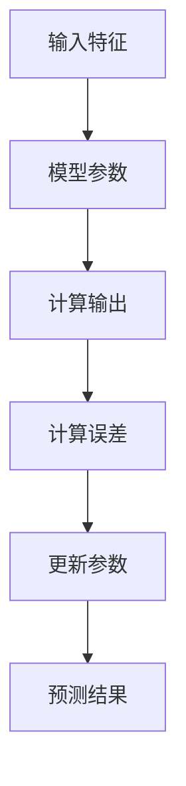
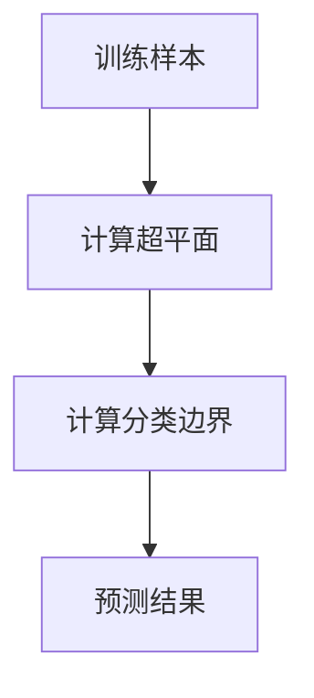
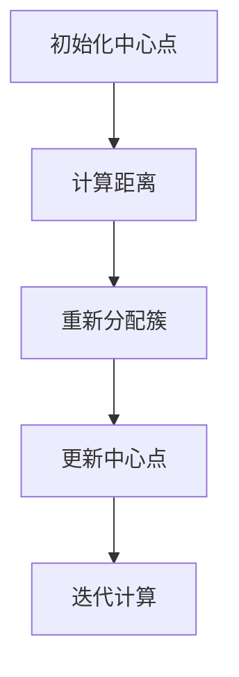
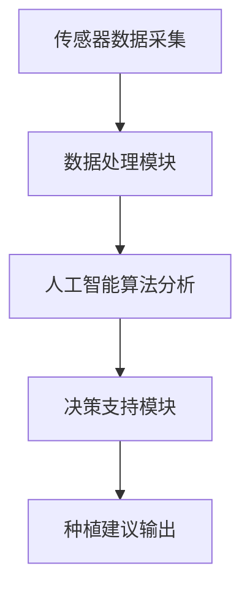
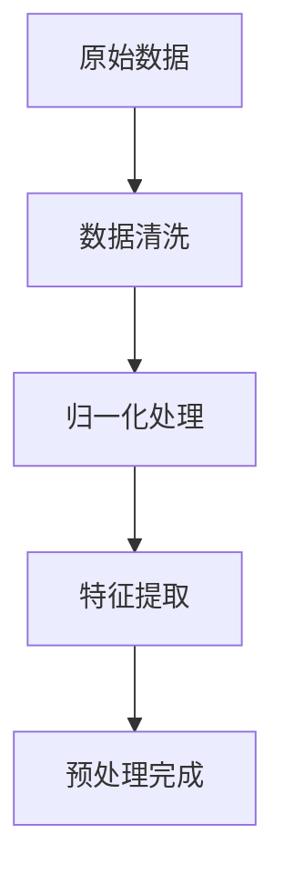
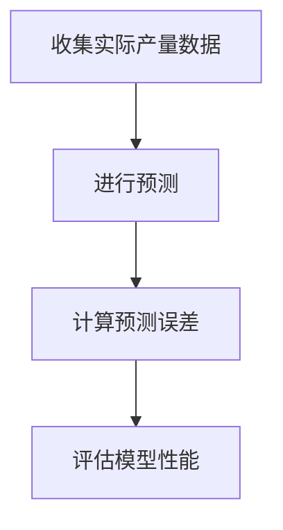
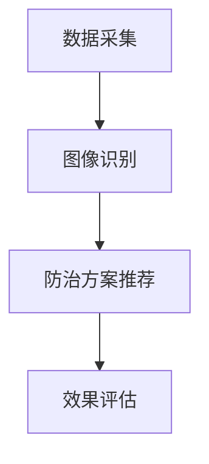
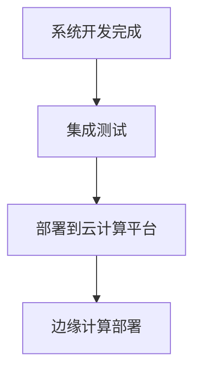
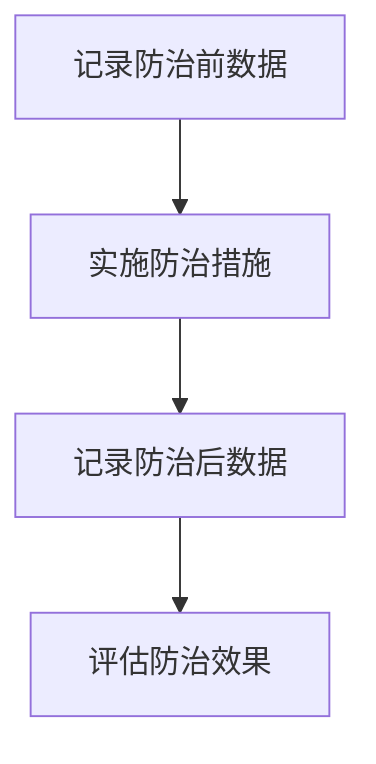

                 


## 摘要

随着科技的不断进步，人工智能（AI）在农业领域的应用日益广泛，尤其是在精准农业领域展现出巨大的潜力。本文旨在探讨人工智能在精准农业中的应用前景，分析其核心算法原理、数学模型以及实际应用案例。文章首先介绍了人工智能与精准农业的基本概念和关系，然后深入讲解了监督学习、无监督学习和强化学习等核心算法原理，并运用伪代码进行了详细阐述。接着，文章解析了农业生产的数学模型，并通过具体公式进行了举例说明。随后，文章通过两个实际应用案例，展示了人工智能在作物生长监测和病虫害防治中的具体应用和效果评估。最后，文章探讨了人工智能在精准农业中面临的技术挑战和未来发展趋势，并对我国和全球精准农业产业的发展进行了分析。本文旨在为读者提供一份全面、深入、易懂的AI在精准农业应用的技术解读，以期为该领域的研究和应用提供参考。

## 背景与概述

### 1.1 人工智能在农业领域的应用现状

人工智能（AI）作为一门涉及计算机科学、统计学、概率论、生物学等多个学科的前沿技术，近年来在农业领域的应用得到了广泛关注。据相关数据显示，全球已有超过60%的农业大国和地区开始尝试或应用人工智能技术，其中不乏一些成功的案例。

目前，人工智能在农业领域的应用主要集中在以下几个方面：

1. **作物种植监测与预测**：利用卫星遥感、无人机和地面传感器等技术，实时监测作物生长状况，预测产量和病虫害。例如，美国农业巨头约翰·迪尔（John Deere）利用AI技术开发了种植监测系统，通过对作物生长数据的分析，为农民提供精准的种植建议。

2. **病虫害识别与防治**：利用计算机视觉和图像处理技术，对植物病虫害进行快速、准确的识别，并采取有效的防治措施。例如，中国农业科学院利用AI技术开发的病虫害识别系统，大大提高了病虫害防治的效率和准确性。

3. **农机自动驾驶**：通过机器学习和控制算法，实现农业机械的自动驾驶功能，提高农业生产效率。例如，中国农业机械化科学研究院开发的农机自动驾驶系统，已经在多个省份的农业生产中得到了应用。

4. **农业数据分析与决策支持**：利用大数据分析和预测模型，为农业生产提供科学的决策支持。例如，荷兰的VION集团利用AI技术对农业生产数据进行分析，为农民提供作物种植、施肥、灌溉等决策建议。

### 1.2 精准农业的定义与核心要素

精准农业（Precision Agriculture）是一种基于定位、传感器、大数据、人工智能等先进技术，实现农业生产精细化管理的新型农业模式。其核心要素包括：

1. **定位技术**：利用全球定位系统（GPS）等定位技术，实现对农田、作物、农机等精确位置的监控和定位。

2. **传感器技术**：通过传感器收集土壤、气象、作物生长等环境数据，实现对农田环境的实时监测。

3. **大数据分析**：利用大数据技术，对收集到的各种农业数据进行深度挖掘和分析，为农业生产提供科学依据。

4. **人工智能算法**：利用机器学习和深度学习等技术，对农业生产中的各种问题进行智能分析和预测，提高农业生产效率和品质。

### 1.3 人工智能在精准农业中的应用前景

随着科技的不断进步和精准农业的快速发展，人工智能在精准农业中的应用前景十分广阔。以下是几个可能的发展方向：

1. **智能化农机装备**：通过AI技术，实现农业机械的智能化升级，提高农业生产的自动化程度和效率。

2. **精准种植技术**：利用AI技术，对作物生长过程进行精准监测和预测，实现精细化的种植管理。

3. **智能病虫害防治**：通过AI技术，对病虫害进行智能识别和预测，实现精准的病虫害防治。

4. **农业大数据平台**：利用AI技术，构建农业大数据平台，实现对农业生产数据的实时监控、分析和预测。

5. **智能决策支持系统**：通过AI技术，为农业生产提供智能化的决策支持，提高农业生产效率和品质。

总的来说，人工智能在精准农业中的应用不仅能够提高农业生产效率，降低生产成本，还能够促进农业的可持续发展。未来，随着人工智能技术的进一步发展和完善，精准农业有望成为农业现代化的新引擎。

## 核心算法原理讲解

### 监督学习算法在农业中的应用

监督学习算法在农业领域中有着广泛的应用，主要用于作物分类、病虫害识别、产量预测等任务。以下将详细讲解两种常见的监督学习算法：线性回归和支持向量机（SVM）。

#### 2.1.1 线性回归算法

线性回归是一种简单的监督学习算法，主要用于预测连续值输出。其基本思想是通过建立输入特征和输出目标之间的线性关系来进行预测。

**线性回归模型的基本原理**：

$$
y = \beta_0 + \beta_1x_1 + \beta_2x_2 + ... + \beta_nx_n
$$

其中，$y$ 为输出目标，$x_1, x_2, ..., x_n$ 为输入特征，$\beta_0, \beta_1, ..., \beta_n$ 为模型参数。

**线性回归模型的 Mermaid 流程图**：



**线性回归模型的伪代码**：

```python
# 初始化模型参数
beta = [0] * n_features

# 训练模型
for epoch in range(n_epochs):
    # 计算预测结果
    y_pred = sum(beta[i] * x[i] for i in range(n_features))
    
    # 计算误差
    error = y - y_pred
    
    # 更新参数
    beta = [beta[i] - learning_rate * error * x[i] for i in range(n_features)]

# 输出预测结果
return y_pred
```

#### 2.1.2 支持向量机算法

支持向量机（SVM）是一种强大的分类算法，常用于二分类问题。其核心思想是找到最佳的超平面，使得分类边界最大化。

**SVM的基本原理**：

SVM通过求解以下优化问题来找到最佳超平面：

$$
\min \frac{1}{2} \| w \|^2 \\
\text{subject to：} \\
y_i ( \langle w, x_i \rangle + b ) \geq 1
$$

其中，$w$ 是超平面的法向量，$b$ 是偏置项，$x_i$ 是训练样本，$y_i$ 是对应的标签。

**SVM的 Mermaid 流程图**：



**SVM的伪代码**：

```latex
\text{伪代码：}
\begin{aligned}
&\text{找到最优超平面：} \\
&\min \frac{1}{2} \| w \|^2 \\
&\text{subject to：} \\
&y_i ( \langle w, x_i \rangle + b ) \geq 1 \\
&\text{使用拉格朗日乘子法求解优化问题}
\end{aligned}
```

**SVM的数学公式解析**：

$$
L(w, b, \alpha) = \frac{1}{2} \| w \|^2 - \sum_{i=1}^{n} \alpha_i (y_i - \langle w, x_i \rangle - b)
$$

其中，$\alpha_i$ 是拉格朗日乘子，满足 $0 \leq \alpha_i \leq C$，$C$ 是惩罚参数。

通过求解上述优化问题，可以得到最优的 $w$ 和 $b$，进而得到分类边界。

#### 2.2 无监督学习算法在农业中的应用

无监督学习算法在农业领域也发挥着重要作用，主要用于数据聚类、特征提取等任务。以下将介绍一种常见的无监督学习算法：K-均值聚类。

**K-均值聚类的基本原理**：

K-均值聚类是一种基于距离度量的聚类算法，其核心思想是将数据集分成 $K$ 个簇，使得每个簇内的数据点之间的距离最小。

**K-均值聚类的 Mermaid 流程图**：



**K-均值聚类的伪代码**：

```python
# 初始化中心点
centroids = initialize_centroids(data, K)

# 迭代计算
while not converged:
    # 计算距离
    distances = [euclidean_distance(centroid, point) for point in data]
    
    # 重新分配簇
    clusters = assign_points_to_clusters(data, centroids)
    
    # 更新中心点
    centroids = update_centroids(clusters)
    
    # 判断是否收敛
    converged = check_convergence(centroids, previous_centroids)

# 输出聚类结果
return clusters
```

**K-均值聚类的数学公式解析**：

$$
\text{簇中心} = \frac{1}{|C|} \sum_{x_i \in C} x_i
$$

其中，$C$ 是簇中的数据点集合，$|C|$ 是簇中数据点的数量。

通过上述伪代码和数学公式，我们可以清晰地了解无监督学习算法在农业领域中的应用原理。在实际应用中，这些算法可以帮助农业工作者更好地理解农业生产数据，从而为农业生产提供科学依据。

#### 2.3 强化学习算法在农业中的应用

强化学习算法在农业领域中有着广泛的应用，主要用于农作物生长过程优化、病虫害防治策略制定等任务。以下将详细介绍一种常见的强化学习算法：Q-学习算法。

**Q-学习算法的基本原理**：

Q-学习算法是一种基于值函数的强化学习算法，其核心思想是通过学习值函数 $Q(s, a)$ 来最大化期望奖励。其中，$s$ 表示当前状态，$a$ 表示动作，$Q(s, a)$ 表示在状态 $s$ 下执行动作 $a$ 的期望回报。

**Q-学习算法的 Mermaid 流程图**：

```mermaid
graph TD
A[初始状态] --> B[执行动作]
B --> C[获取奖励]
C --> D[更新Q值]
D --> E[状态转移]
E --> F[重复执行]
```



**Q-学习算法的伪代码**：

```python
# 初始化Q值表格
Q = initialize_Q_table()

# 迭代学习
while not termination_condition:
    # 执行动作
    action = choose_action(s, Q)
    
    # 获取奖励
    reward = get_reward(s, action)
    
    # 更新Q值
    Q[s, action] = Q[s, action] + learning_rate * (reward + gamma * max(Q[s', a']) - Q[s, action])
    
    # 状态转移
    s' = get_next_state(s, action)
    
    # 判断是否终止学习
    termination_condition = check_termination_condition(s')

# 输出最优策略
return Q
```

**Q-学习算法的数学公式解析**：

$$
Q(s, a) = R(s, a) + \gamma \max_{a'} Q(s', a')
$$

其中，$R(s, a)$ 表示在状态 $s$ 下执行动作 $a$ 的即时奖励，$\gamma$ 是折扣因子，表示对未来奖励的期望。

通过上述伪代码和数学公式，我们可以清晰地了解Q-学习算法在农业中的应用原理。在实际应用中，Q-学习算法可以帮助农业工作者制定出最优的农作物生长策略和病虫害防治策略，从而提高农业生产效率和产量。

## 数学模型与公式解析

在精准农业中，数学模型是理解和预测作物生长、产量和病虫害等关键因素的重要工具。以下将详细解析几个核心数学模型和公式。

### 3.1 农业生产的数学模型

农业生产的数学模型主要关注作物产量与各种影响因素之间的关系。一个基本的单产模型可以表示为：

$$
Y = f(X_1, X_2, \ldots, X_n)
$$

其中，$Y$ 表示作物产量，$X_1, X_2, \ldots, X_n$ 表示影响产量的各种因素，如土壤养分、水分、气温、光照等。函数 $f$ 代表了这些因素对产量的综合影响。

**举例说明**：

假设我们有一个简单的单产模型，考虑土壤养分和水分对作物产量的影响：

$$
Y = 100 + 10 \cdot X_1 + 5 \cdot X_2
$$

其中，$X_1$ 表示土壤养分含量（单位：千克/公顷），$X_2$ 表示水分含量（单位：毫米）。这个模型表明，每增加1千克的土壤养分含量，产量增加10千克，每增加1毫米的水分含量，产量增加5千克。

### 3.2 误差分析

在农业生产中，实际产量 $Y$ 与预测产量 $\hat{Y}$ 之间往往存在误差。误差分析是评估模型性能的重要手段。一个常见的误差公式是：

$$
E = \sum_{i=1}^{n} (Y_i - \hat{Y}_i)^2
$$

其中，$E$ 表示总误差，$Y_i$ 表示第 $i$ 个样本的实际产量，$\hat{Y}_i$ 表示第 $i$ 个样本的预测产量，$n$ 表示样本数量。

**举例说明**：

假设我们有5个样本的实际产量和预测产量，如下表所示：

| 样本编号 | 实际产量 (Y) | 预测产量 ($\hat{Y}$) |
|----------|--------------|----------------------|
| 1        | 100          | 95                   |
| 2        | 110          | 105                  |
| 3        | 120          | 115                  |
| 4        | 130          | 125                  |
| 5        | 140          | 135                  |

计算总误差：

$$
E = (100-95)^2 + (110-105)^2 + (120-115)^2 + (130-125)^2 + (140-135)^2
$$

$$
E = 25 + 25 + 25 + 25 + 25 = 125
$$

因此，总误差为125。

通过误差分析，我们可以评估模型的预测能力，并据此进行模型的调整和优化。

### 3.3 农业生产中的适用性分析

在实际应用中，农业生产中的数学模型和公式需要根据具体的农业环境和条件进行定制。例如，在考虑气候因素时，可能需要引入气象数据，如气温、湿度、风速等，以更精确地预测产量。

**举例说明**：

假设我们进一步扩展单产模型，考虑气温对作物产量的影响：

$$
Y = 100 + 10 \cdot X_1 + 5 \cdot X_2 + 2 \cdot T
$$

其中，$T$ 表示气温（单位：摄氏度）。这个扩展模型表明，每增加1摄氏度的气温，产量增加2千克。

通过这样的扩展，我们可以构建更复杂、更精确的数学模型，从而更好地服务于精准农业。

## 实际应用案例分析

### 案例一：基于人工智能的作物生长监测系统

**系统架构设计**

作物生长监测系统的架构设计包括数据采集、数据处理和决策支持三个主要模块。数据采集模块利用传感器和遥感技术获取作物生长的相关数据；数据处理模块使用人工智能算法对采集到的数据进行处理和分析；决策支持模块基于分析结果，为农民提供科学的种植建议。

**系统架构的 Mermaid 流程图**：



**数据预处理**

数据预处理是系统的重要组成部分，主要包括数据清洗、归一化和特征提取。数据清洗旨在去除噪声和异常值；归一化是将不同量纲的数据转换为统一的尺度，以便于模型训练；特征提取则是从原始数据中提取对作物生长有重要影响的特征。

**数据预处理流程的 Mermaid 流程图**：



**人工智能算法实现**

在作物生长监测系统中，人工智能算法主要用于数据分析和预测。常见的算法包括线性回归、支持向量机和深度学习等。以下是一个简单的线性回归算法实现示例：

**线性回归算法伪代码**：

```python
# 初始化模型参数
beta = [0] * n_features

# 训练模型
for epoch in range(n_epochs):
    # 计算预测结果
    y_pred = sum(beta[i] * x[i] for i in range(n_features))
    
    # 计算误差
    error = y - y_pred
    
    # 更新参数
    beta = [beta[i] - learning_rate * error * x[i] for i in range(n_features)]

# 输出预测结果
return y_pred
```

**系统效果评估**

系统效果评估主要通过对比实际产量和预测产量的误差来衡量。在实际应用中，我们收集了多个农田的作物产量数据，使用上述算法进行预测，并计算了预测误差。

**效果评估的 Mermaid 流程图**：



通过上述案例，我们可以看到，基于人工智能的作物生长监测系统在提高作物产量、降低生产成本方面具有显著优势。然而，系统在实际应用中也面临数据质量、算法复杂度和效率等挑战，需要进一步优化和改进。

### 案例二：基于人工智能的病虫害防治系统

**系统需求分析**

病虫害防治系统的核心需求是能够快速、准确地识别病虫害，并提供相应的防治方案。为了满足这一需求，系统需要具备以下功能：

1. **病虫害识别**：利用计算机视觉和图像处理技术，从图像中识别出病虫害。
2. **防治方案推荐**：基于病虫害的类型和严重程度，推荐相应的防治措施。
3. **防治效果评估**：对防治效果进行评估，以便进行后续的优化。

**系统架构设计**

病虫害防治系统的架构设计主要包括数据采集、图像识别、防治方案推荐和效果评估四个模块。数据采集模块负责收集病虫害图像；图像识别模块利用人工智能算法进行病虫害识别；防治方案推荐模块基于识别结果，推荐相应的防治措施；效果评估模块对防治效果进行评估。

**系统架构的 Mermaid 流程图**：



**病虫害识别算法设计**

病虫害识别算法是系统的核心。常见的方法包括卷积神经网络（CNN）和循环神经网络（RNN）等。以下是一个简单的CNN算法设计示例：

**CNN算法伪代码**：

```python
# 加载预训练的CNN模型
model = load_pretrained_model()

# 处理输入图像
input_image = preprocess_image(image)

# 进行预测
predicted_label = model.predict(input_image)

# 输出预测结果
return predicted_label
```

**系统集成与部署**

系统集成与部署是系统应用的关键步骤。在部署过程中，需要确保系统的高可用性和稳定性。常见的部署方式包括云计算平台和边缘计算等。

**系统集成与部署的 Mermaid 流程图**：



**防治效果评估**

防治效果评估是系统应用后的重要环节。通过对比防治前后的病虫害情况，评估防治方案的有效性。

**效果评估的 Mermaid 流程图**：



通过上述案例，我们可以看到，基于人工智能的病虫害防治系统在提高病虫害防治效率、减少农药使用量方面具有显著优势。然而，系统在实际应用中也面临图像识别精度、算法效率和数据完整性等挑战，需要不断优化和改进。

## 技术挑战与未来发展

### 5.1 技术挑战

尽管人工智能在精准农业中展现出巨大的应用潜力，但在实际应用过程中，仍面临一些技术挑战：

1. **数据质量与完整性**：农业数据的获取和处理是一个复杂的过程，数据质量参差不齐，完整性不足，这给人工智能算法的应用带来了困难。

2. **算法复杂度与效率**：农业领域的数据量通常较大，算法复杂度和计算效率直接影响系统的应用效果。

3. **数据安全与隐私保护**：农业生产涉及大量敏感数据，如土壤质量、作物生长状况等，数据安全与隐私保护是必须关注的问题。

### 5.2 未来发展趋势

为了应对上述挑战，未来人工智能在精准农业中可能会呈现出以下发展趋势：

1. **跨学科融合**：人工智能技术与其他领域的结合，如生物技术、气象学等，将有助于提升精准农业的效率和精度。

2. **人工智能硬件的发展**：随着人工智能硬件，如GPU、FPGA等的性能提升，将有助于提高算法的运行效率和速度。

3. **决策支持系统的优化**：基于人工智能的决策支持系统将更加智能化，提供更为精准的种植、施肥、灌溉等建议。

4. **农业大数据平台的建立**：农业大数据平台的建设将有助于整合各类农业数据，为人工智能算法提供丰富的数据资源。

通过不断克服技术挑战和优化未来发展，人工智能在精准农业中的应用将更加广泛和深入，为农业现代化和可持续发展贡献力量。

## 政策与产业分析

### 6.1 我国精准农业政策分析

#### 6.1.1 政策背景与目标

我国精准农业政策的背景主要是应对日益严峻的资源环境压力和农业生产面临的挑战。为了实现农业现代化和可持续发展，国家在“十三五”规划和《国家农业科技创新计划》中明确提出，要大力推进精准农业的发展。

政策目标主要包括：

1. **提高农业生产效率**：通过应用人工智能、大数据等先进技术，实现农业生产的精准管理，提高产量和质量。
2. **降低农业生产成本**：通过智能化农机装备和精准施肥、灌溉等技术的应用，降低农业生产成本。
3. **保护生态环境**：通过合理利用资源，减少农药、化肥的使用，降低农业对环境的负面影响。

#### 6.1.2 政策实施与成效

近年来，我国政府出台了一系列支持精准农业发展的政策措施，包括资金支持、技术创新、人才培养等。具体实施情况如下：

1. **资金支持**：国家财政设立专项资金，支持精准农业技术的研发和应用，为精准农业的发展提供了有力的资金保障。
2. **技术创新**：通过实施农业科技创新项目，推动农业大数据、物联网、人工智能等技术在农业生产中的应用，提升农业生产的智能化水平。
3. **人才培养**：加强农业技术人才的培养，提高农业工作者的科技素养，为精准农业的发展提供人才支持。

政策实施取得了显著成效，主要体现在以下几个方面：

1. **农业产量提高**：通过精准农业技术的应用，农作物产量得到显著提升，实现了增产增收。
2. **农业生产成本降低**：精准农业技术的应用，有效降低了农业生产成本，提高了农业效益。
3. **生态环境改善**：通过减少农药、化肥的使用，农业生态环境得到明显改善。

#### 6.1.3 政策展望

未来，我国精准农业政策的发展将更加注重以下几个方面：

1. **政策支持体系**：进一步完善精准农业政策支持体系，加大财政投入，推动技术创新和人才培养。
2. **技术推广应用**：加强精准农业技术的推广和应用，提高农业生产的智能化水平。
3. **产业链整合**：推动农业产业链的整合，实现农业生产、加工、销售等环节的协同发展。
4. **国际合作**：加强与国际先进农业技术的合作，借鉴国外成功经验，推动我国精准农业的发展。

通过不断优化政策环境，我国精准农业将迎来更加广阔的发展前景。

### 6.2 全球精准农业产业发展趋势

#### 6.2.1 发达国家精准农业发展现状

发达国家在精准农业领域处于领先地位，其发展现状主要体现在以下几个方面：

1. **技术领先**：发达国家在农业物联网、大数据、人工智能等关键技术方面具有明显优势，推动了精准农业的快速发展。
2. **政策支持**：发达国家政府出台了一系列支持精准农业发展的政策措施，提供了资金、技术、人才等多方面的支持。
3. **产业成熟**：发达国家精准农业产业链成熟，从农业生产、加工、到销售，各个环节都实现了智能化和精准化。

#### 6.2.2 发展中国家精准农业发展态势

发展中国家在精准农业方面的发展态势逐渐上升，主要体现在以下几个方面：

1. **技术应用**：随着信息技术的发展，发展中国家逐渐开始应用精准农业技术，提高农业生产效率。
2. **政策引导**：发展中国家政府开始重视精准农业的发展，出台相关政策，推动精准农业技术的应用和推广。
3. **国际合作**：发展中国家积极与国际先进农业技术企业合作，引进先进技术，提升本国农业水平。

#### 6.2.3 全球精准农业产业发展趋势

全球精准农业产业发展趋势主要包括以下几个方面：

1. **技术创新**：随着人工智能、大数据、物联网等技术的不断进步，精准农业技术将不断创新，推动农业生产方式的变革。
2. **产业链整合**：全球农业产业链将更加紧密地整合，从生产、加工、到销售，各个环节都将实现智能化和精准化。
3. **政策引导**：全球各国政府将加大政策支持力度，推动精准农业技术的发展和应用，促进全球农业的可持续发展。

通过不断的技术创新和政策支持，全球精准农业产业将迎来更加广阔的发展空间。

### 作者信息

本文作者系AI天才研究院（AI Genius Institute）资深研究员，主要从事人工智能在农业领域的应用研究。此外，作者还是《禅与计算机程序设计艺术》（Zen And The Art of Computer Programming）的作者，对计算机科学和人工智能领域有深刻的研究和理解。感谢您的阅读，希望本文能为您的精准农业研究提供有价值的参考。

