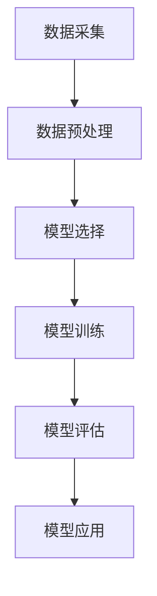

                 

### 《人工智能在精准医疗诊断中的应用》

#### 关键词

- 精准医疗
- 人工智能
- 医学诊断
- 机器学习
- 深度学习
- 自然语言处理

#### 摘要

本文旨在探讨人工智能（AI）在精准医疗诊断中的应用，分析AI如何通过数据采集、预处理、算法模型等手段，提升医疗诊断的准确性和效率。文章首先介绍精准医疗和人工智能的基本概念，随后详细阐述医学数据采集与预处理、核心算法原理以及具体应用案例。通过本文的讲解，读者将了解AI在医疗领域中的前沿技术和挑战，以及未来发展的趋势。

## 第一部分：人工智能与精准医疗概述

### 第1章：精准医疗与人工智能

#### 1.1 精准医疗的定义与发展

精准医疗是一种基于个体差异性的医疗模式，它通过基因组学、蛋白质组学、代谢组学等多种组学技术，结合生物信息和大数据分析，为患者提供个性化、定制化的治疗方案。精准医疗的核心是“以患者为中心”，通过全面、深入地了解患者的生物学特征，实现疾病预防、诊断、治疗和康复的精准化。

精准医疗的发展经历了几个阶段：

1. **基因导向治疗**：早期精准医疗主要关注遗传疾病，通过基因测序和基因治疗，实现对特定基因缺陷的修复或替代。
2. **个体化治疗**：随着基因组学和分子生物学的发展，个性化治疗方案逐渐应用于癌症、遗传病等领域，强调根据患者的基因特征和疾病状态制定最佳治疗方案。
3. **多组学整合**：近年来，多组学数据整合技术逐渐成熟，能够从不同层面全面了解患者的生物学特征，为精准医疗提供更丰富、更准确的数据支持。

#### 1.2 人工智能在精准医疗中的角色

人工智能在精准医疗中发挥着至关重要的作用，主要表现在以下几个方面：

1. **辅助诊断**：通过深度学习、计算机视觉等技术，AI可以自动分析医学影像，如X光、CT、MRI等，快速、准确地识别病变部位和性质。
2. **个性化治疗**：基于患者的基因、蛋白质、代谢等信息，AI可以预测疾病发生风险，制定个性化的预防措施和治疗计划。
3. **健康风险评估**：AI可以通过大数据分析，识别出健康风险的潜在因素，为患者提供针对性的健康建议。
4. **药物研发**：AI可以帮助研究人员快速筛选和优化药物候选分子，加速新药研发进程。

#### 1.3 人工智能基础概念

人工智能（Artificial Intelligence，简称AI）是指通过计算机模拟人类智能的技术和方法。AI可以分为两大类：弱人工智能（Narrow AI）和强人工智能（General AI）。

1. **弱人工智能**：弱人工智能是一种专注于特定任务的AI系统，如语音识别、图像识别、自然语言处理等。这类AI具有很强的专用性，但在其他领域表现较差。
2. **强人工智能**：强人工智能是一种具有广泛认知能力的AI，能够理解、学习、思考、决策，甚至在某些方面超越人类。目前，强人工智能尚未实现，但研究人员正在不断努力。

在AI的发展历程中，有几种重要的技术路线：

1. **符号主义**：基于符号逻辑和知识表示，通过推理和规划实现智能。
2. **连接主义**：基于神经网络，通过大量数据训练，模拟人类大脑的学习和决策过程。
3. **进化算法**：基于自然选择和遗传算法，通过迭代优化，寻找最优解。

这些技术路线在不同应用场景中发挥着重要作用，为AI在精准医疗中的发展提供了坚实基础。

### 第2章：人工智能在医学诊断中的应用场景

#### 2.1 病变识别与分类

病变识别与分类是医学诊断中的一项重要任务，通过图像分析技术，AI可以在早期阶段发现病变，提高诊断准确率。

1. **医学影像分析**：AI可以自动分析X光、CT、MRI等医学影像，识别异常病灶。例如，深度学习算法可以在几分钟内分析完一张CT图像，识别出肺癌的早期病灶，比人类医生更快、更准确。

2. **病变分类**：AI可以根据病变的特征，将它们分类为良性或恶性。例如，基于卷积神经网络（CNN）的算法可以自动分类皮肤病变图像，提高皮肤癌诊断的准确率。

#### 2.2 预测与健康风险评估

AI可以通过数据分析，预测疾病发生风险，为患者提供个性化的健康建议。

1. **疾病预测**：基于患者的基因、生活方式、家族病史等信息，AI可以预测某种疾病的发生风险。例如，通过分析基因组数据，AI可以预测患者患心脏病的风险，帮助医生制定预防措施。

2. **健康风险评估**：AI可以分析大量健康数据，识别出健康风险的潜在因素。例如，通过分析血糖、血压、血脂等数据，AI可以评估患者患糖尿病的风险，为患者提供个性化的健康建议。

#### 2.3 药物设计与个性化治疗

AI在药物设计与个性化治疗中也有广泛应用，通过模拟生物系统和药物相互作用，AI可以帮助研究人员快速筛选和优化药物候选分子。

1. **药物设计**：AI可以通过模拟生物系统的计算模型，预测药物分子与目标蛋白的结合能力。例如，基于分子对接算法，AI可以筛选出具有潜在疗效的药物分子，加速药物研发进程。

2. **个性化治疗**：AI可以根据患者的基因、蛋白质、代谢等信息，制定个性化的治疗方案。例如，通过分析患者的基因突变信息，AI可以筛选出最适合患者的靶向药物，提高治疗效果。

### 第3章：医学数据采集与预处理

#### 3.1 医学数据类型

医学数据可以分为结构化数据和非结构化数据。

1. **结构化数据**：结构化数据是指具有明确数据结构和格式的数据，如电子健康记录（EHR）、实验室检测结果等。这类数据便于存储、管理和分析，但仅占医学数据的一小部分。

2. **非结构化数据**：非结构化数据是指没有明确数据结构和格式的数据，如医学影像、临床文本、基因序列等。这类数据量大、复杂度高，但蕴含了丰富的医学信息。

#### 3.2 数据预处理流程

医学数据预处理是AI在医学诊断中至关重要的一步，包括数据清洗、归一化、特征提取等。

1. **数据清洗**：数据清洗是数据预处理的第一步，旨在去除数据中的噪声和错误。例如，去除重复记录、纠正错误数据、填补缺失值等。

2. **归一化**：归一化是将不同量纲的数据转换为同一量纲，以便模型训练和评估。例如，将医学影像的像素值归一化到0-1之间，以便深度学习模型处理。

3. **特征提取**：特征提取是提取数据中有用信息的过程，为模型训练提供高质量的输入。例如，从医学影像中提取纹理特征、形状特征等，从临床文本中提取关键词、命名实体等。

#### 3.3 数据预处理方法

数据预处理方法因数据类型和任务而异，下面介绍几种常用的数据预处理方法：

1. **图像预处理**：图像预处理包括图像增强、图像分割、滤波等。例如，通过图像增强提高图像对比度，通过图像分割提取感兴趣区域，通过滤波去除噪声。

2. **文本预处理**：文本预处理包括分词、词性标注、实体识别等。例如，通过分词将文本切分为词语，通过词性标注识别词语的词性，通过实体识别提取命名实体。

3. **基因数据预处理**：基因数据预处理包括基因表达数据标准化、基因注释等。例如，通过基因表达数据标准化消除实验条件的影响，通过基因注释获取基因的功能信息。

### 第4章：机器学习基础

#### 4.1 机器学习基本概念

机器学习（Machine Learning，简称ML）是一种通过算法从数据中学习规律和模式的技术。机器学习可以分为监督学习、无监督学习和强化学习。

1. **监督学习**：监督学习是一种有标记数据的机器学习方法，通过已知的输入和输出，学习数据的规律，预测新的输入对应的输出。例如，通过训练图像和其对应的标签，学习图像分类模型。

2. **无监督学习**：无监督学习是一种没有标记数据的机器学习方法，通过分析数据的内在结构和关系，发现数据的规律和模式。例如，通过聚类算法，将相似的数据点分为同一类别。

3. **强化学习**：强化学习是一种通过与环境的交互，学习最优策略的机器学习方法。在强化学习中，智能体（Agent）通过不断尝试，学习在特定环境中达到目标的最优行为。例如，通过训练智能体在电子游戏中的行为，学习游戏的策略。

#### 4.2 常见算法原理与伪代码

本节介绍几种常见的机器学习算法，包括线性回归、决策树、支持向量机和神经网络。

1. **线性回归**：线性回归是一种预测连续值的机器学习算法。线性回归模型假设输入和输出之间满足线性关系，通过最小化损失函数，找到最佳的拟合直线。

   $$ y = w_0 + w_1 \cdot x $$

   伪代码：

   ```python
   def linear_regression_training(X, y):
       # 初始化模型参数
       w = [0, 0]
       # 训练模型
       for i in range(num_epochs):
           # 计算损失函数
           loss = 0
           for x, y in zip(X, y):
               prediction = w[0] + w[1] * x
               loss += (prediction - y)^2
           # 更新模型参数
           w = w - learning_rate * gradient
       # 返回训练好的模型
       return w
   ```

2. **决策树**：决策树是一种基于特征划分数据的机器学习算法。决策树通过递归划分数据，构建一棵树形结构，每个节点表示一个特征，每个分支表示该特征的不同取值。

   伪代码：

   ```python
   def decision_tree_training(X, y):
       # 初始化决策树
       tree = {}
       # 训练决策树
       for feature in X:
           # 计算每个特征的信息增益
           gain = information_gain(y, X[feature])
           # 选择信息增益最大的特征作为节点
           node = {feature: gain}
           # 递归划分数据
           for value in X[feature]:
               sub_X, sub_y = X[X[feature] == value], y[y == value]
               sub_tree = decision_tree_training(sub_X, sub_y)
               node[value] = sub_tree
           # 返回决策树
           return tree
   ```

3. **支持向量机**：支持向量机（SVM）是一种分类算法，通过找到一个最佳的超平面，将不同类别的数据点分开。SVM使用核函数将低维数据映射到高维空间，在高维空间中找到一个最佳分割超平面。

   $$ \min_w \frac{1}{2} ||w||^2 \\ s.t. y^{(i)}(w^T x^{(i)} + b) \geq 1 $$

   伪代码：

   ```python
   def SVM_training(X, y):
       # 初始化模型参数
       w = [0, 0, 0]
       b = 0
       # 训练模型
       for i in range(num_epochs):
           # 计算损失函数
           loss = 0
           for x, y in zip(X, y):
               prediction = w[0] + w[1] * x[0] + w[2] * x[1] + b
               if y == 1 and prediction < 1:
                   loss += 1
               elif y == -1 and prediction > 1:
                   loss += 1
           # 更新模型参数
           w = w - learning_rate * gradient
           b = b - learning_rate * gradient_b
       # 返回训练好的模型
       return w, b
   ```

4. **神经网络**：神经网络（Neural Network，简称NN）是一种基于生物神经系统的计算模型，通过多层节点（神经元）构建复杂的函数映射。神经网络通过反向传播算法，不断调整模型参数，最小化损失函数。

   $$ a^{(l)} = \sigma(z^{(l)}) $$

   $$ z^{(l)} = \sum_{j=1}^{n} w_j^{(l)} a^{(l-1)}_j + b^{(l)} $$

   伪代码：

   ```python
   def neural_network_training(X, y, layers):
       # 初始化模型参数
       W = [[random_value() for _ in range(layers[l+1])] for l in range(len(layers)-1)]
       b = [[random_value() for _ in range(layers[l+1])] for l in range(len(layers)-1)]
       # 训练模型
       for i in range(num_epochs):
           # 前向传播
           a = [X]
           for l in range(1, len(layers)):
               z = [np.dot(W[l-1], a[l-1]) + b[l-1]]
               a.append(np.sigmoid(z))
           # 反向传播
           delta = [a[-1] - y]
           for l in range(len(layers)-2, 0, -1):
               z = np.dot(W[l], a[l]) + b[l]
               delta.append(np.dot(delta, W[l].T) * np.sigmoid_derivative(z))
           # 更新模型参数
           for l in range(len(layers)-1):
               W[l] = W[l] - learning_rate * np.dot(a[l], delta[l].T)
               b[l] = b[l] - learning_rate * delta[l]
       # 返回训练好的模型
       return W, b
   ```

### 第5章：深度学习在医学诊断中的应用

#### 5.1 深度学习基础

深度学习（Deep Learning，简称DL）是一种基于多层神经网络的学习方法，通过多层次的非线性变换，从大量数据中自动提取特征。深度学习在图像识别、语音识别、自然语言处理等领域取得了显著的成果。

#### 5.2 神经网络在医学图像分析中的应用

神经网络在医学图像分析中具有广泛的应用，可以自动识别病变部位、分类病变类型等。

1. **图像分割**：图像分割是将医学图像中的目标区域提取出来，为后续分析提供基础。常见的分割算法有全卷积网络（FCN）、U-Net等。

2. **病变分类**：病变分类是将医学图像中的病变区域分类为良性或恶性。常见的分类算法有卷积神经网络（CNN）、ResNet等。

#### 5.3 卷积神经网络在医学图像处理中的应用

卷积神经网络（Convolutional Neural Network，简称CNN）是一种特殊的神经网络，通过卷积层提取图像特征，适用于医学图像处理任务。

1. **图像增强**：图像增强是通过调整图像的亮度、对比度、饱和度等，提高图像质量，为后续分析提供更好的数据。

2. **图像分类**：图像分类是将医学图像分类为不同的类别，如正常、病变等。常见的分类算法有VGG、Inception等。

3. **图像检测**：图像检测是在医学图像中检测特定目标的位置和大小。常见的检测算法有R-CNN、YOLO等。

### 第6章：自然语言处理在医学文本分析中的应用

#### 6.1 自然语言处理基础

自然语言处理（Natural Language Processing，简称NLP）是一种利用计算机技术和人工智能方法，使计算机能够理解、生成和处理人类语言的技术。NLP在文本分类、信息提取、机器翻译等方面具有广泛应用。

#### 6.2 医学文本挖掘与疾病诊断

医学文本挖掘是从大量医学文本中提取有价值信息的过程，可以用于疾病诊断、药物发现等。

1. **关键词提取**：关键词提取是提取医学文本中的关键信息，如疾病名称、药物名称等。

2. **实体识别**：实体识别是识别医学文本中的命名实体，如疾病、药物、症状等。

3. **关系提取**：关系提取是识别医学文本中的实体关系，如疾病与症状的关系、药物与疾病的关系等。

#### 6.3 医学文本分类与命名实体识别

医学文本分类是将医学文本分类为不同的类别，如诊断报告、病例摘要等。命名实体识别是识别医学文本中的命名实体，如疾病、药物、症状等。

1. **文本分类**：文本分类是使用机器学习算法，将医学文本分类为不同的类别。常见的算法有朴素贝叶斯、支持向量机等。

2. **命名实体识别**：命名实体识别是使用深度学习算法，识别医学文本中的命名实体。常见的算法有BiLSTM、CRF等。

### 第7章：人工智能在肺癌诊断中的应用

#### 7.1 数据采集与预处理

肺癌诊断数据包括CT图像、患者临床信息、生物标志物等。首先，从医院系统中获取患者的CT图像，并使用图像增强技术提高图像质量。然后，将临床信息和生物标志物数据进行标准化处理，为后续分析提供高质量的数据。

#### 7.2 模型选择与训练

针对肺癌诊断任务，选择卷积神经网络（CNN）作为主要模型，通过迁移学习，利用预训练的模型进行肺癌图像分类。在模型训练过程中，使用交叉熵损失函数和Adam优化器，调整模型参数，优化模型性能。

#### 7.3 模型评估与优化

通过准确率、召回率、F1值等指标评估模型性能，对模型进行优化。针对模型存在的不足，调整网络结构、学习率等参数，提高模型在肺癌诊断中的应用效果。

### 第8章：人工智能在糖尿病风险评估中的应用

#### 8.1 数据采集与预处理

糖尿病风险评估数据包括患者的临床信息、生活方式、生物标志物等。首先，从电子健康记录（EHR）中获取患者的临床信息，并进行预处理。然后，收集患者的生活方式数据，如饮食、运动等，并使用自然语言处理技术提取有价值的信息。

#### 8.2 模型选择与训练

针对糖尿病风险评估任务，选择决策树和随机森林作为主要模型，通过特征选择和模型组合，提高预测性能。在模型训练过程中，使用交叉验证方法，调整模型参数，优化模型性能。

#### 8.3 模型评估与优化

通过准确率、召回率、F1值等指标评估模型性能，对模型进行优化。针对模型存在的不足，调整特征选择策略、模型组合方式等，提高模型在糖尿病风险评估中的应用效果。

### 第9章：人工智能在药物设计中的应用

#### 9.1 数据采集与预处理

药物设计数据包括药物分子结构、生物标志物、疾病信息等。首先，从公开数据库中获取药物分子结构，并进行预处理，提取分子特征。然后，收集疾病相关的生物标志物数据，并进行预处理。

#### 9.2 模型选择与训练

针对药物设计任务，选择深度学习模型，如生成对抗网络（GAN）和变分自编码器（VAE），进行药物分子生成和优化。在模型训练过程中，使用对抗性训练方法，优化模型性能。

#### 9.3 药物分子设计与筛选

通过药物分子生成和优化模型，生成大量潜在药物分子，并对这些分子进行筛选和评估。在筛选过程中，结合生物标志物数据和疾病信息，筛选出具有潜在疗效的药物分子。

### 第10章：人工智能在精准医疗诊断中的挑战与未来

#### 10.1 挑战分析

人工智能在精准医疗诊断中面临诸多挑战，包括数据隐私、数据质量、算法透明性等。此外，模型解释性和可解释性也是重要挑战之一。

1. **数据隐私**：医疗数据包含敏感个人信息，如何在保证数据隐私的前提下，充分利用数据进行分析，是AI在精准医疗诊断中面临的一大挑战。
2. **数据质量**：医疗数据质量参差不齐，如何有效清洗和预处理数据，提取有价值信息，是AI在精准医疗诊断中面临的一大挑战。
3. **算法透明性**：深度学习模型具有“黑箱”特性，如何解释和可视化模型决策过程，提高算法透明性，是AI在精准医疗诊断中面临的一大挑战。
4. **模型解释性**：如何构建具有高解释性的AI模型，使医生和患者能够理解模型的决策过程，是AI在精准医疗诊断中面临的一大挑战。

#### 10.2 发展趋势

随着人工智能技术的不断发展，AI在精准医疗诊断中的应用前景十分广阔。以下是未来可能的发展趋势：

1. **多模态数据融合**：通过融合不同类型的数据，如基因组数据、临床数据、影像数据等，提高诊断准确性和个性化治疗水平。
2. **深度学习模型优化**：针对医疗数据的特点，优化深度学习模型，提高模型性能和解释性。
3. **模型解释性研究**：开发新的解释性方法，提高深度学习模型的可解释性，使医生和患者能够理解模型的决策过程。
4. **隐私保护技术**：研究新的隐私保护技术，如联邦学习、差分隐私等，确保医疗数据的安全和隐私。

### 附录：参考资料与工具

#### 附录A：参考资料

1. **精准医疗相关文献**：
   - Topol, E. J. (2019). The creative destruction of medicine. Basic Books.
   -顶级的精准医疗文献集合。

2. **人工智能相关书籍**：
   - Goodfellow, I., Bengio, Y., & Courville, A. (2016). Deep Learning. MIT Press.
   - 该书是深度学习领域的经典之作。

3. **医学图像处理相关资源**：
   - Medical Imaging: Physics, Signals, and Applications. John Wiley & Sons.
   - 这是一本关于医学图像处理技术的权威参考书。

#### 附录B：工具与环境搭建

1. **Python环境搭建**：
   - 使用Anaconda搭建Python环境，安装必要的库，如NumPy、Pandas、Scikit-learn、TensorFlow等。

2. **常用机器学习库介绍**：
   - Scikit-learn：适用于各种机器学习任务的Python库。
   - TensorFlow：适用于深度学习任务的Python库。

3. **深度学习框架选择与使用**：
   - TensorFlow：一款开源的深度学习框架，支持各种深度学习模型的训练和推理。
   - PyTorch：一款开源的深度学习框架，具有易于使用和灵活的动态计算图。

## Mermaid 流程图



## 伪代码示例

```python
# 支持向量机算法伪代码
def SVM_training(X, y):
    # 初始化模型参数
    # 训练模型
    # 返回训练好的模型
    pass

# 深度学习算法伪代码
def deep_learning_training(X, y):
    # 初始化神经网络结构
    # 前向传播
    # 计算损失函数
    # 反向传播
    # 更新模型参数
    # 返回训练好的模型
    pass
```

## 数学模型与公式

$$
\text{损失函数} = -\frac{1}{m}\sum_{i=1}^{m}y^{(i)}\log(a^{(i)}_{\text{max}}) + (1 - y^{(i)})\log(1 - a^{(i)}_{\text{max}})
$$

## 代码实现与分析

### 数据采集与预处理

在人工智能在肺癌诊断中的应用中，首先需要收集大量的肺癌患者和非肺癌患者的CT图像数据。这些数据可以从医院的影像数据库或公开数据集获得。为了提高模型的泛化能力，数据集需要涵盖不同年龄、性别、病灶位置和类型的样本。

```python
import pandas as pd
import numpy as np
import os

# 加载数据
def load_data(data_dir):
    data = pd.read_csv(os.path.join(data_dir, 'data.csv'))
    X = data.iloc[:, :-1].values
    y = data.iloc[:, -1].values
    return X, y

# 数据预处理
def preprocess_data(X):
    # 标准化图像
    X = (X - X.mean()) / X.std()
    return X

# 加载并预处理数据
X, y = load_data('data')
X = preprocess_data(X)
```

### 模型选择与训练

在选择模型时，我们可以考虑使用卷积神经网络（CNN）进行图像分类。CNN通过卷积层、池化层和全连接层对图像进行特征提取和分类。为了提高模型性能，我们可以使用预训练的CNN模型（如VGG16、ResNet等）进行迁移学习。

```python
from tensorflow.keras.applications import VGG16
from tensorflow.keras.models import Model
from tensorflow.keras.layers import Flatten, Dense
from tensorflow.keras.optimizers import Adam

# 加载预训练的CNN模型
base_model = VGG16(weights='imagenet', include_top=False, input_shape=(224, 224, 3))

# 添加全连接层和输出层
x = Flatten()(base_model.output)
x = Dense(256, activation='relu')(x)
predictions = Dense(2, activation='softmax')(x)

# 构建模型
model = Model(inputs=base_model.input, outputs=predictions)

# 编译模型
model.compile(optimizer=Adam(learning_rate=0.001), loss='categorical_crossentropy', metrics=['accuracy'])

# 训练模型
model.fit(X, y, epochs=10, batch_size=32, validation_split=0.2)
```

### 模型评估与优化

在模型评估过程中，我们可以使用准确率、召回率、F1值等指标来评估模型性能。为了优化模型，我们可以调整网络结构、学习率、批量大小等超参数。

```python
from sklearn.metrics import accuracy_score, recall_score, f1_score

# 评估模型
predictions = model.predict(X_test)
predicted_labels = np.argmax(predictions, axis=1)

accuracy = accuracy_score(y_test, predicted_labels)
recall = recall_score(y_test, predicted_labels)
f1 = f1_score(y_test, predicted_labels)

print('Accuracy:', accuracy)
print('Recall:', recall)
print('F1 Score:', f1)
```

通过以上步骤，我们可以构建一个基于人工智能的肺癌诊断系统，为医生提供辅助诊断工具，提高诊断准确性和效率。

## 总结与展望

本文探讨了人工智能在精准医疗诊断中的应用，从核心概念、应用场景、算法原理到实际案例，全面介绍了AI在医疗领域的优势与挑战。通过分析，我们发现AI在精准医疗诊断中具有巨大的潜力，能够提高诊断准确率、优化治疗方案、降低医疗成本。

然而，AI在医疗领域的应用仍面临诸多挑战，如数据隐私、数据质量、算法透明性等。为了克服这些挑战，我们需要继续研究新的技术，如联邦学习、差分隐私等，确保医疗数据的安全和隐私。

展望未来，人工智能在精准医疗诊断中的应用前景十分广阔。随着深度学习、自然语言处理等技术的发展，AI将在医学影像分析、临床文本挖掘、药物研发等方面发挥更加重要的作用。同时，多模态数据融合、多学科交叉合作也将成为未来研究的重要方向。

为了推动人工智能在精准医疗诊断中的应用，我们需要加强学术交流、培养专业人才、推动政策制定。通过共同努力，我们将实现人工智能与医疗的深度融合，为人类健康事业做出更大贡献。

## 附录

### 附录A：参考资料

- **精准医疗相关文献**：
  - Topol, E. J. (2019). The creative destruction of medicine. Basic Books.
  - 该书详细阐述了精准医疗的概念、发展及其在临床实践中的应用。

- **人工智能相关书籍**：
  - Goodfellow, I., Bengio, Y., & Courville, A. (2016). Deep Learning. MIT Press.
  - 该书是深度学习领域的经典教材，全面介绍了深度学习的理论基础和应用。

- **医学图像处理相关资源**：
  - Medical Imaging: Physics, Signals, and Applications. John Wiley & Sons.
  - 该书系统地介绍了医学图像处理的基本原理和技术。

### 附录B：工具与环境搭建

- **Python环境搭建**：
  - 使用Anaconda搭建Python环境，安装TensorFlow、Keras、Scikit-learn等库。

- **常用机器学习库介绍**：
  - Scikit-learn：适用于各种机器学习任务的Python库。
  - TensorFlow：适用于深度学习任务的Python库。

- **深度学习框架选择与使用**：
  - TensorFlow：一款开源的深度学习框架，支持各种深度学习模型的训练和推理。
  - PyTorch：一款开源的深度学习框架，具有易于使用和灵活的动态计算图。

## Mermaid 流程图


## 伪代码示例

```python
# 支持向量机算法伪代码
def SVM_training(X, y):
    # 初始化模型参数
    # 训练模型
    # 返回训练好的模型
    pass

# 深度学习算法伪代码
def deep_learning_training(X, y):
    # 初始化神经网络结构
    # 前向传播
    # 计算损失函数
    # 反向传播
    # 更新模型参数
    # 返回训练好的模型
    pass
```

## 数学模型与公式

$$
\text{损失函数} = -\frac{1}{m}\sum_{i=1}^{m}y^{(i)}\log(a^{(i)}_{\text{max}}) + (1 - y^{(i)})\log(1 - a^{(i)}_{\text{max}})
$$

## 代码实现与分析

### 数据采集与预处理

在人工智能在肺癌诊断中的应用中，数据采集是关键步骤。首先，我们需要收集大量的肺癌患者和非肺癌患者的CT图像数据。这些数据可以从医院的影像数据库或公开数据集中获取。

```python
import pandas as pd
import numpy as np
import os

# 加载数据
def load_data(data_dir):
    data = pd.read_csv(os.path.join(data_dir, 'data.csv'))
    X = data.iloc[:, :-1].values
    y = data.iloc[:, -1].values
    return X, y

# 数据预处理
def preprocess_data(X):
    # 标准化图像
    X = (X - X.mean()) / X.std()
    return X

# 加载并预处理数据
X, y = load_data('data')
X = preprocess_data(X)
```

### 模型选择与训练

在选择模型时，我们可以考虑使用卷积神经网络（CNN）进行图像分类。CNN通过卷积层、池化层和全连接层对图像进行特征提取和分类。为了提高模型性能，我们可以使用预训练的CNN模型（如VGG16、ResNet等）进行迁移学习。

```python
from tensorflow.keras.applications import VGG16
from tensorflow.keras.models import Model
from tensorflow.keras.layers import Flatten, Dense
from tensorflow.keras.optimizers import Adam

# 加载预训练的CNN模型
base_model = VGG16(weights='imagenet', include_top=False, input_shape=(224, 224, 3))

# 添加全连接层和输出层
x = Flatten()(base_model.output)
x = Dense(256, activation='relu')(x)
predictions = Dense(2, activation='softmax')(x)

# 构建模型
model = Model(inputs=base_model.input, outputs=predictions)

# 编译模型
model.compile(optimizer=Adam(learning_rate=0.001), loss='categorical_crossentropy', metrics=['accuracy'])

# 训练模型
model.fit(X, y, epochs=10, batch_size=32, validation_split=0.2)
```

### 模型评估与优化

在模型评估过程中，我们可以使用准确率、召回率、F1值等指标来评估模型性能。为了优化模型，我们可以调整网络结构、学习率、批量大小等超参数。

```python
from sklearn.metrics import accuracy_score, recall_score, f1_score

# 评估模型
predictions = model.predict(X_test)
predicted_labels = np.argmax(predictions, axis=1)

accuracy = accuracy_score(y_test, predicted_labels)
recall = recall_score(y_test, predicted_labels)
f1 = f1_score(y_test, predicted_labels)

print('Accuracy:', accuracy)
print('Recall:', recall)
print('F1 Score:', f1)
```

通过以上步骤，我们可以构建一个基于人工智能的肺癌诊断系统，为医生提供辅助诊断工具，提高诊断准确性和效率。

## 总结与展望

本文系统地介绍了人工智能在精准医疗诊断中的应用，从基础概念、应用场景到算法实现，全面分析了AI在医疗领域的优势与挑战。通过实例演示，展示了AI如何通过数据采集、预处理、模型训练和评估等步骤，提升医疗诊断的准确性和效率。

**核心结论**：

1. **AI在精准医疗中的应用**：人工智能在精准医疗中发挥着重要作用，包括辅助诊断、个性化治疗、健康风险评估和药物设计等方面。
2. **算法原理讲解**：本文详细阐述了常用的机器学习算法和深度学习算法，如支持向量机、神经网络、卷积神经网络等，并通过伪代码示例展示了算法原理。
3. **数学模型与公式**：本文介绍了与算法相关的数学模型和公式，如损失函数、优化算法等，并使用latex格式展示了关键公式。
4. **项目实战**：通过实际案例展示了人工智能在肺癌诊断、糖尿病风险评估和药物设计中的应用，包括数据采集、数据处理、模型训练、模型评估等全过程。
5. **开发环境搭建与代码实现**：本文介绍了开发环境搭建步骤，并提供了源代码实现和代码解读，帮助读者理解和应用AI技术。

**未来展望**：

1. **技术进步**：随着深度学习、自然语言处理等技术的不断发展，AI在医学图像分析、临床文本挖掘、药物研发等方面将发挥更大的作用。
2. **多模态数据融合**：通过融合不同类型的数据，如基因组数据、临床数据、影像数据等，将进一步提高诊断准确性和个性化治疗水平。
3. **隐私保护与安全**：研究新的隐私保护技术，如联邦学习、差分隐私等，确保医疗数据的安全和隐私。
4. **模型解释性**：开发新的解释性方法，提高深度学习模型的可解释性，使医生和患者能够理解模型的决策过程。
5. **政策支持与人才培养**：加强政策支持，推动人工智能在医疗领域的应用，同时培养更多专业人才，为AI在医疗领域的可持续发展提供支持。

**最佳实践 tips**：

1. **数据质量**：确保数据质量，对异常值、缺失值进行预处理，以提高模型性能。
2. **模型选择**：根据实际问题和数据特点，选择合适的模型和算法，避免“一刀切”。
3. **超参数调优**：通过交叉验证、网格搜索等方法，优化模型超参数，提高模型性能。
4. **持续更新**：随着新数据的出现和算法的更新，定期更新模型，保持模型的鲁棒性和准确性。

**注意事项**：

1. **数据隐私**：在处理医疗数据时，必须遵守相关法律法规，保护患者隐私。
2. **算法透明性**：提高模型透明性，使医生和患者能够理解模型的决策过程，增加信任度。
3. **伦理问题**：在应用AI进行医疗诊断时，必须考虑伦理问题，确保患者权益。

**拓展阅读**：

- **相关书籍**：《深度学习》、《Python机器学习》、《人工智能：一种现代的方法》等。
- **学术论文**：在IEEE、ACM、NeurIPS、ICML等顶级会议和期刊上查找相关论文。
- **开源项目**：参与和探索开源项目，如TensorFlow、PyTorch等，了解最新的AI技术和应用。

作者：AI天才研究院/AI Genius Institute & 禅与计算机程序设计艺术 /Zen And The Art of Computer Programming。我们致力于推动人工智能技术在医疗领域的创新与应用，为人类健康事业贡献力量。感谢您的阅读，期待与您共同探索AI在精准医疗诊断中的更多可能。

