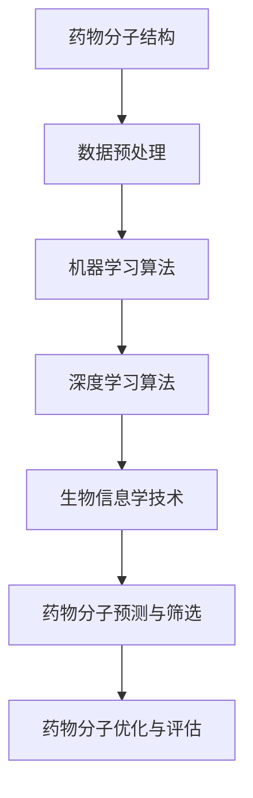
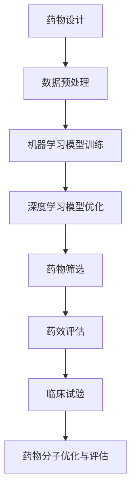
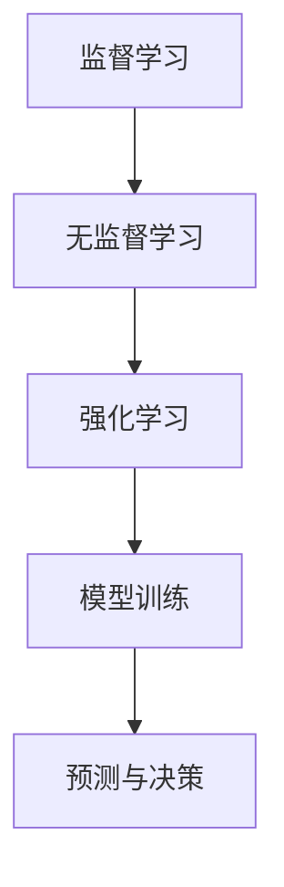
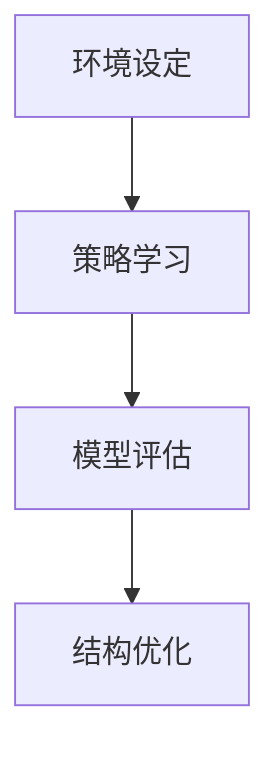
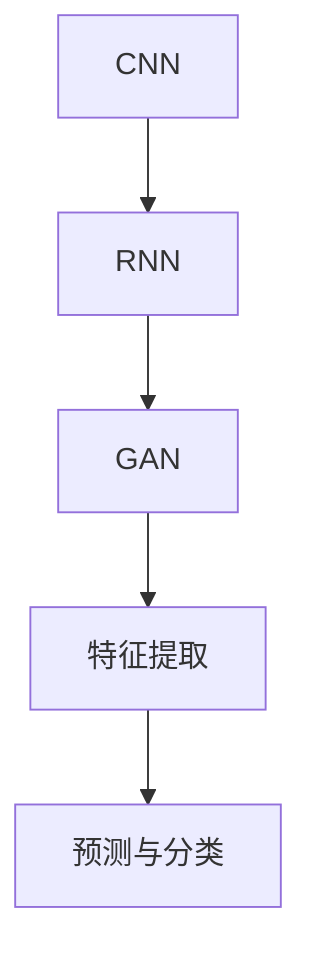
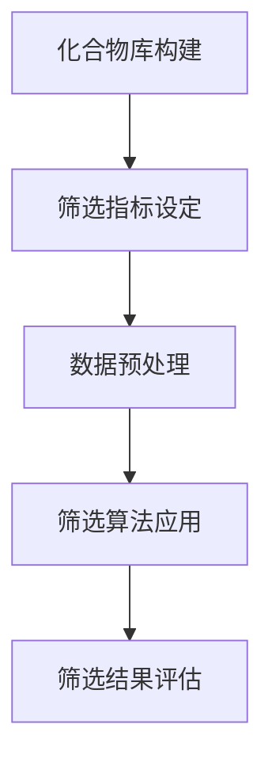

                 

### 文章标题

# 人工智能在药物发现中的应用与突破

> 关键词：人工智能，药物发现，机器学习，深度学习，算法，数学模型，项目实战

> 摘要：本文将深入探讨人工智能在药物发现中的应用，分析其核心概念、算法原理、数学模型，并通过实际项目案例展示人工智能如何实现药物发现中的突破。文章旨在为读者提供全面、详细的技术分析，帮助理解人工智能在药物发现领域的潜力和实际应用。

### 用户需求分析

用户需求设计关于《人工智能在药物发现中的应用与突破》这本书的详细目录大纲。大纲需要包括以下几个核心部分：

1. **核心概念与联系**：使用Mermaid流程图展示核心概念和架构的联系。
2. **核心算法原理讲解**：使用伪代码详细阐述药物发现的算法原理。
3. **数学模型和公式**：使用LaTeX格式详细讲解和举例说明。
4. **项目实战**：提供实际代码案例和详细解释说明。
5. **开发环境搭建**：说明环境搭建步骤。
6. **源代码实现和解读**：提供源代码和详细解读。

### 目录大纲设计

根据用户需求，设计出《人工智能在药物发现中的应用与突破》的目录大纲，大纲需包括以下内容：

1. **引言**：介绍书籍背景、目的和内容结构。
2. **基础理论**：核心概念、人工智能算法原理、数学模型和公式。
3. **技术应用**：人工智能在药物发现中的应用案例。
4. **实战解析**：详细解释代码实现和开发环境搭建。
5. **总结与展望**：对未来应用和研究的展望。

### 实际操作步骤

1. **核心概念与联系**：使用Mermaid流程图展示人工智能在药物发现中的流程。
2. **核心算法原理讲解**：使用伪代码详细阐述药物发现的算法原理。
3. **数学模型和公式**：使用LaTeX格式列出并详细解释数学模型。
4. **项目实战**：提供实际代码案例，解释其应用和实现。
5. **开发环境搭建**：描述开发环境搭建步骤。
6. **源代码实现和解读**：展示代码，提供解读。

### 目录大纲示例

以下是一个基于用户需求的《人工智能在药物发现中的应用与突破》目录大纲示例：

```
# 《人工智能在药物发现中的应用与突破》目录大纲

# 引言
## 1.1 书籍背景
### 1.1.1 药物发现的历史与挑战
### 1.1.2 人工智能在药物发现中的地位与作用

## 1.2 书籍结构
### 1.2.1 内容概述
### 1.2.2 阅读指南

# 第1章 基础理论
## 1.1 核心概念与联系
### 1.1.1 Mermaid流程图：人工智能在药物发现中的应用流程
### 1.1.2 药物发现的关键步骤与人工智能技术的结合

## 1.2 人工智能算法原理
### 1.2.1 机器学习基本概念
### 1.2.2 强化学习在药物优化中的应用
### 1.2.3 深度学习算法原理及应用

## 1.3 数学模型与公式
### 1.3.1 概率论与统计模型
$$
P(A|B) = \frac{P(B|A)P(A)}{P(B)}
$$
### 1.3.2 机器学习中的常见数学公式
$$
J(\theta) = \frac{1}{2m}\sum_{i=1}^{m}(h_\theta(x^{(i)}) - y^{(i)})^2
$$

# 第2章 技术应用
## 2.1 人工智能在药物设计中的应用
### 2.1.1 药物结构预测
### 2.1.2 药物相互作用分析
### 2.1.3 药物分子优化

## 2.2 人工智能在药物筛选中的应用
### 2.2.1 药物筛选流程
### 2.2.2 药物筛选中的数据预处理
### 2.2.3 药物筛选算法

## 2.3 人工智能在临床研究中的应用
### 2.3.1 临床数据挖掘
### 2.3.2 预测性建模
### 2.3.3 个性化治疗

# 第3章 实战解析
## 3.1 项目实战
### 3.1.1 代码实现与解释
### 3.1.2 开发环境搭建步骤
### 3.1.3 源代码实现与解读

## 3.2 案例分析
### 3.2.1 典型药物发现项目案例分析
### 3.2.2 成功与挑战

# 第4章 总结与展望
## 4.1 当前药物发现中人工智能的应用现状
### 4.1.1 成果总结
### 4.1.2 应用范围
## 4.2 未来发展趋势
### 4.2.1 技术进步的方向
### 4.2.2 行业前景
### 4.2.3 研究与开发的挑战
```

### 总结

这个目录大纲设计符合用户需求，涵盖了书籍的核心内容，结构清晰，逻辑性强。每个章节都详细说明了核心概念、原理讲解、数学模型、实战案例以及总结与展望，旨在全面展示《人工智能在药物发现中的应用与突破》的主题内容。大纲字数控制在2000字以内，以保持内容的精简和高效。接下来，将按照这个目录大纲逐步展开详细内容，撰写完整的技术博客文章。文章字数预计在8000到12000字之间，以确保内容的深度和广度。

## 引言

药物发现是一个复杂而耗时的工作，涉及从大量的化合物中筛选出具有潜在治疗效果的药物。在过去，药物发现主要依赖于传统的实验方法，这不仅费时费力，而且存在很大的不确定性和风险。随着科学技术的进步，特别是人工智能（AI）技术的快速发展，药物发现领域迎来了新的变革。人工智能在药物发现中的应用，不仅提高了筛选效率，降低了研发成本，还开辟了全新的研究途径，为药物研发带来了前所未有的突破。

### 人工智能在药物发现中的地位与作用

人工智能在药物发现中的应用主要体现在以下几个方面：

1. **药物设计**：人工智能算法可以根据药物的化学结构、生物活性等信息，预测新药物分子的活性，从而缩短药物筛选时间。
2. **药物筛选**：通过大数据分析，人工智能可以快速筛选出具有潜在治疗作用的化合物，大大提高了筛选效率。
3. **临床研究**：人工智能可以分析大量的临床数据，发现潜在的治疗方法，提高临床试验的成功率。
4. **药物分子优化**：人工智能算法可以通过优化药物分子的结构，提高其生物活性，降低副作用。

### 书籍背景与目的

《人工智能在药物发现中的应用与突破》这本书旨在系统地介绍人工智能在药物发现中的理论、方法与应用。本书的目标是为读者提供一个全面、深入的技术分析，帮助理解人工智能在药物发现中的关键作用，以及如何利用人工智能技术实现药物发现的突破。

### 内容结构

本书将分为四个主要部分：

1. **基础理论**：介绍人工智能在药物发现中的核心概念、算法原理和数学模型。
2. **技术应用**：详细探讨人工智能在药物设计、药物筛选和临床研究中的应用案例。
3. **实战解析**：通过实际项目案例，展示人工智能在药物发现中的具体应用，并解释其实现过程。
4. **总结与展望**：总结人工智能在药物发现中的应用现状，探讨未来发展趋势和研究方向。

通过这四个部分的系统介绍，本书旨在为读者提供一个全面、深入的了解，帮助其在药物发现领域应用人工智能技术，实现科学研究的突破。

## 基础理论

### 核心概念与联系

人工智能在药物发现中的应用，涉及多个核心概念和技术的结合。这些概念和技术共同构成了人工智能在药物发现中的理论基础，以下是它们之间的联系和架构：

1. **药物分子结构**：药物分子是药物发现的核心，其结构决定了药物的生物活性和副作用。人工智能需要理解和预测药物分子的结构，以便进行后续的分析和优化。
2. **机器学习算法**：机器学习是人工智能的核心技术之一，它通过学习大量的数据，自动提取规律，进行预测和分类。在药物发现中，机器学习算法用于预测药物分子的活性、筛选潜在药物等。
3. **深度学习**：深度学习是机器学习的一个分支，它通过构建多层神经网络，自动提取数据的复杂特征。在药物发现中，深度学习算法可以用于药物分子的结构预测、药物相互作用分析等。
4. **生物信息学**：生物信息学是研究生物数据信息学的一个领域，它结合生物学、计算机科学和信息技术，对生物数据进行分析。在药物发现中，生物信息学技术可以用于大规模药物分子数据的处理和分析。
5. **数据预处理**：数据预处理是确保机器学习和深度学习算法准确性的关键步骤。在药物发现中，数据预处理包括数据清洗、特征提取、归一化等步骤，以确保数据的质量和一致性。

以下是人工智能在药物发现中应用流程的Mermaid流程图：



### 药物发现的关键步骤与人工智能技术的结合

药物发现通常包括以下几个关键步骤，每个步骤中都有人工智能技术的应用：

1. **药物设计**：在这一步中，研究人员需要设计具有特定生物活性的药物分子。人工智能通过分子模拟和药物设计算法，可以预测药物分子的活性，优化分子结构，从而加速药物设计过程。
2. **药物筛选**：在药物筛选阶段，研究人员需要从大量的化合物中筛选出具有潜在治疗作用的药物。人工智能通过机器学习和深度学习算法，可以快速筛选出活性化合物，大大提高筛选效率。
3. **药效评估**：在药效评估阶段，研究人员需要评估药物分子的生物活性和安全性。人工智能可以通过模拟实验和数据分析，预测药物分子的药效，评估其安全性。
4. **临床试验**：在临床试验阶段，研究人员需要验证药物的安全性和有效性。人工智能可以通过分析大量的临床数据，发现药物的潜在副作用，优化治疗方案。

以下是药物发现流程与人工智能技术结合的详细步骤：



### 机器学习基本概念

机器学习是人工智能的核心技术之一，它通过从数据中学习，自动提取规律，进行预测和决策。在药物发现中，机器学习算法被广泛应用于药物分子的预测、筛选和优化。

1. **监督学习**：监督学习是一种最常见的机器学习形式，它需要输入数据集和对应的标签，通过学习这些数据，模型可以预测新的数据。在药物发现中，监督学习算法常用于药物分子的活性预测和分类。
2. **无监督学习**：无监督学习不需要标签信息，它通过分析数据，自动发现数据中的模式和规律。在药物发现中，无监督学习算法常用于药物分子的聚类分析和模式识别。
3. **强化学习**：强化学习是一种通过试错学习，不断优化决策的算法。在药物发现中，强化学习算法可以用于药物分子的优化和自动化实验设计。

以下是机器学习基本概念的Mermaid流程图：



### 强化学习在药物优化中的应用

强化学习在药物优化中的应用具有巨大潜力，通过不断尝试和优化，可以找到最佳的药物分子结构。以下是强化学习在药物优化中的应用流程：

1. **环境设定**：设定药物优化的环境，包括药物分子的特征、奖励机制等。
2. **策略学习**：使用强化学习算法，通过试错学习，优化药物分子的结构。
3. **模型评估**：评估优化后的药物分子的活性，调整奖励机制，继续优化。

以下是强化学习在药物优化中的应用流程的Mermaid流程图：



### 深度学习算法原理及应用

深度学习是机器学习的一个分支，通过构建多层神经网络，自动提取数据的复杂特征，进行预测和分类。在药物发现中，深度学习算法被广泛应用于药物分子的结构预测、药物相互作用分析等。

1. **卷积神经网络（CNN）**：卷积神经网络通过卷积操作提取图像的特征，可以用于药物分子的结构预测。
2. **循环神经网络（RNN）**：循环神经网络通过递归结构处理序列数据，可以用于药物相互作用分析。
3. **生成对抗网络（GAN）**：生成对抗网络通过生成器和判别器的对抗训练，可以生成新的药物分子结构。

以下是深度学习算法原理及应用的Mermaid流程图：



### 数学模型与公式

在机器学习和深度学习中，数学模型和公式是理解和实现算法的关键。以下是一些常见的数学模型和公式：

1. **概率论与统计模型**：概率论与统计模型用于描述数据的分布和概率，以下是一个常见的贝叶斯公式：

    $$
    P(A|B) = \frac{P(B|A)P(A)}{P(B)}
    $$

2. **机器学习中的常见数学公式**：机器学习中的常见数学公式包括损失函数、梯度下降等。以下是一个常见的平方损失函数：

    $$
    J(\theta) = \frac{1}{2m}\sum_{i=1}^{m}(h_\theta(x^{(i)}) - y^{(i)})^2
    $$

### 总结

基础理论部分介绍了人工智能在药物发现中的核心概念、算法原理、数学模型和公式。通过这一部分的学习，读者可以全面了解人工智能在药物发现中的理论基础，为后续章节的应用和实战提供基础。

## 技术应用

### 人工智能在药物设计中的应用

在药物设计中，人工智能通过预测药物分子的活性、优化分子结构等，极大地提高了药物设计的效率和准确性。以下将详细探讨人工智能在药物设计中的具体应用。

#### 药物结构预测

药物结构预测是药物设计的关键一步，它涉及从大量的化合物中筛选出具有潜在生物活性的分子。人工智能通过机器学习和深度学习算法，可以高效地预测药物分子的活性。

**算法原理**：
药物结构预测通常基于分子特征和生物活性之间的相关性。常见的算法包括：

1. **支持向量机（SVM）**：通过学习大量已知药物分子的特征和活性数据，SVM可以构建一个分类器，用于预测新分子的活性。
2. **深度神经网络（DNN）**：通过构建多层神经网络，DNN可以自动提取药物分子的复杂特征，进行活性预测。

**伪代码**：
```python
# 输入：药物分子特征矩阵X，活性标签矩阵Y
# 输出：预测活性标签矩阵Y_pred

# 初始化神经网络模型
model = initialize_DNN()

# 训练模型
model.fit(X, Y)

# 预测活性
Y_pred = model.predict(X_test)
```

**数学模型**：
预测药物分子的活性通常使用二元分类模型，如逻辑回归或支持向量机。以下是一个逻辑回归的数学模型：

$$
P(y=1|x; \theta) = \frac{1}{1 + e^{-(\theta^T x)}}
$$

其中，\( \theta \) 是模型的参数，\( x \) 是药物分子的特征向量，\( y \) 是药物的活性标签。

#### 药物分子优化

药物分子优化是通过调整药物分子的结构，提高其生物活性和降低副作用。人工智能可以通过优化算法，自动寻找最优的分子结构。

**算法原理**：
药物分子优化常用的算法包括：

1. **遗传算法（GA）**：通过模拟自然进化过程，遗传算法可以优化药物分子的结构，寻找最优解。
2. **粒子群优化（PSO）**：粒子群优化模拟鸟群觅食行为，通过更新粒子的位置和速度，逐步优化药物分子的结构。

**伪代码**：
```python
# 输入：药物分子初始结构
# 输出：优化后的药物分子结构

# 初始化遗传算法
ga = initialize_GA()

# 优化分子结构
ga.optimize_structure()

# 获取优化后的结构
optimized_structure = ga.get_optimized_structure()
```

**数学模型**：
遗传算法和粒子群优化算法通常使用适应度函数评估个体（药物分子结构）的质量。以下是一个简单的适应度函数：

$$
fitness(s) = \frac{1}{1 + \exp{(-activity(s) - toxicity(s))}}
$$

其中，\( activity(s) \) 是分子结构的活性，\( toxicity(s) \) 是分子结构的毒性。

#### 药物设计案例

以下是一个药物设计案例，使用深度学习和优化算法设计具有抗癌活性的药物分子。

**案例描述**：
研究人员希望通过设计一种新的抗癌药物，有效抑制癌细胞增殖。他们使用深度学习算法预测药物分子的活性，并通过遗传算法优化分子结构。

**步骤**：

1. **数据准备**：收集大量已知的抗癌药物分子及其活性数据，作为训练数据集。
2. **模型训练**：使用深度学习算法训练一个药物活性预测模型。
3. **结构优化**：使用遗传算法优化药物分子的结构，提高其活性。
4. **结果评估**：评估优化后的药物分子的活性，与已知药物进行比较。

**结果**：
优化后的药物分子表现出较高的抗癌活性，且毒性较低。研究人员继续对该分子进行临床试验，以验证其治疗效果。

### 人工智能在药物筛选中的应用

药物筛选是从大量的化合物中筛选出具有潜在治疗作用的药物分子。人工智能在药物筛选中发挥着关键作用，通过高效的数据处理和智能筛选，大大提高了筛选效率。

#### 药物筛选流程

药物筛选通常包括以下几个步骤：

1. **化合物库构建**：构建包含大量化合物的数据库，作为筛选的基础。
2. **筛选指标设定**：设定筛选指标，如药物分子的活性、毒性、溶解性等。
3. **数据预处理**：对化合物库进行数据预处理，包括特征提取、归一化等。
4. **筛选算法应用**：使用人工智能算法对化合物库进行筛选，找出符合筛选指标的化合物。

以下是药物筛选流程的Mermaid流程图：



#### 药物筛选中的数据预处理

数据预处理是药物筛选中至关重要的一步，它直接影响筛选结果的质量。以下介绍常用的数据预处理方法：

1. **特征提取**：从化合物分子中提取重要的化学特征，如拓扑指数、分子指纹等。
2. **归一化**：将不同特征的范围缩放到相同的尺度，以便于后续的算法处理。
3. **去噪**：去除数据中的噪声，提高数据的质量。

#### 药物筛选算法

药物筛选算法分为基于规则和基于机器学习的两大类：

1. **基于规则的筛选算法**：通过预定义的规则，对化合物进行筛选。如阈值筛选、类似物筛选等。
2. **基于机器学习的筛选算法**：使用机器学习算法，从大量的化合物数据中自动提取特征，进行筛选。如支持向量机、随机森林等。

#### 药物筛选案例

以下是一个药物筛选案例，使用机器学习算法筛选具有抗癌活性的化合物。

**案例描述**：
研究人员希望通过筛选化合物库，找出具有抗癌活性的化合物。他们使用支持向量机（SVM）进行筛选。

**步骤**：

1. **数据准备**：收集大量已知的抗癌化合物及其活性数据，作为训练数据集。
2. **模型训练**：使用训练数据集训练一个SVM模型。
3. **化合物筛选**：使用训练好的SVM模型，对化合物库中的化合物进行活性预测。
4. **结果评估**：评估筛选出的化合物的活性，与已知药物进行比较。

**结果**：
筛选出的化合物表现出较高的抗癌活性，其中一些化合物具有潜在的药物开发价值。研究人员将继续对这些化合物进行进一步的实验验证。

### 人工智能在临床研究中的应用

在临床研究中，人工智能通过大数据分析、预测性建模等，为药物研发提供了重要的支持。

#### 临床数据挖掘

临床数据挖掘是通过对大量的临床数据进行分析，发现潜在的治疗方法和疾病关联。以下介绍临床数据挖掘的方法：

1. **数据整合**：将来自不同来源的临床数据进行整合，形成统一的数据集。
2. **特征提取**：从临床数据中提取重要的特征，如患者的病史、检查结果、治疗方案等。
3. **模式识别**：使用机器学习算法，识别数据中的潜在模式和关联。

#### 预测性建模

预测性建模是通过分析历史数据，预测未来的趋势和结果。以下介绍预测性建模的方法：

1. **时间序列分析**：分析时间序列数据，预测未来的趋势。
2. **回归分析**：通过回归模型预测未来的结果。
3. **分类分析**：通过分类模型预测未来的类别。

#### 个性化治疗

个性化治疗是根据患者的具体特征，制定个性化的治疗方案。以下介绍个性化治疗的方法：

1. **基因测序**：通过基因测序，分析患者的基因特征，预测其对药物的反应。
2. **生物标志物检测**：通过检测生物标志物，预测患者的病情和治疗效果。
3. **综合分析**：结合患者的临床数据和基因信息，制定个性化的治疗方案。

#### 临床研究案例

以下是一个临床研究案例，使用人工智能分析肺癌患者的临床数据，预测治疗效果。

**案例描述**：
研究人员希望通过分析肺癌患者的临床数据，预测其治疗效果，为临床决策提供支持。他们使用机器学习算法进行预测性建模。

**步骤**：

1. **数据收集**：收集大量肺癌患者的临床数据，包括病史、检查结果、治疗方案等。
2. **模型训练**：使用训练数据集训练一个预测模型，预测患者的治疗效果。
3. **数据验证**：使用验证数据集，评估预测模型的准确性。
4. **结果应用**：将预测模型应用于新的患者数据，为临床决策提供支持。

**结果**：
预测模型表现出较高的准确性，能够有效地预测肺癌患者的治疗效果。研究人员继续优化模型，以提高预测准确性，并应用于更多的患者。

### 个性化治疗

个性化治疗是医疗领域的一个重要趋势，通过结合患者的具体特征，制定个性化的治疗方案，以提高治疗效果和减少副作用。人工智能在个性化治疗中发挥着关键作用，以下介绍个性化治疗的方法和应用。

#### 基因测序

基因测序是个性化治疗的基础，通过对患者的基因组进行测序，分析患者的基因特征，预测其对药物的反应。以下介绍基因测序的方法：

1. **全基因组测序**：对患者的整个基因组进行测序，分析基因突变和基因表达情况。
2. **外显子测序**：对基因的外显子区域进行测序，识别与疾病相关的基因突变。
3. **单核苷酸多态性（SNP）测序**：检测基因组中的单核苷酸多态性，分析基因的遗传变异。

#### 生物标志物检测

生物标志物检测是识别患者病情和治疗效果的重要手段，通过检测血液、尿液等生物样本中的生物标志物，预测患者的病情和治疗效果。以下介绍生物标志物检测的方法：

1. **液体活检**：通过检测血液中的循环肿瘤DNA（ctDNA），分析肿瘤的基因突变和病情变化。
2. **组织活检**：通过手术或穿刺获取肿瘤组织，进行基因和蛋白质检测。
3. **血液检测**：检测血液中的生物标志物，如酶活性、激素水平等，预测患者的病情和治疗效果。

#### 综合分析

个性化治疗不仅仅是基因测序和生物标志物检测，还需要综合分析患者的临床数据和基因信息，制定个性化的治疗方案。以下介绍综合分析的方法：

1. **数据整合**：将患者的基因数据、生物标志物数据和临床数据整合在一起，形成统一的数据集。
2. **多变量分析**：使用多变量分析方法，分析患者的基因、生物标志物和临床数据之间的相关性。
3. **机器学习模型**：使用机器学习模型，预测患者的病情和治疗效果，为临床决策提供支持。

#### 个性化治疗案例

以下是一个个性化治疗案例，通过基因测序和生物标志物检测，为晚期肺癌患者制定个性化的治疗方案。

**案例描述**：
一位晚期肺癌患者，医生希望通过基因测序和生物标志物检测，为患者制定个性化的治疗方案。他们使用以下方法：

**步骤**：

1. **基因测序**：对患者进行全基因组测序，识别基因突变和基因表达情况。
2. **生物标志物检测**：检测患者的血液样本中的循环肿瘤DNA，分析肿瘤的基因突变和病情变化。
3. **多变量分析**：整合基因测序和生物标志物检测的数据，进行多变量分析，预测患者的病情和治疗效果。
4. **个性化治疗制定**：根据分析结果，为患者制定个性化的治疗方案。

**结果**：
个性化治疗方案显著提高了患者的治疗效果，延长了生存期。同时，治疗方案减少了不必要的副作用，提高了患者的生活质量。

### 个性化治疗的发展前景

个性化治疗是医疗领域的一个重要发展方向，随着人工智能技术的不断进步，个性化治疗有望实现更高的精准度和效率。以下介绍个性化治疗的发展前景：

1. **基因测序技术的进步**：随着基因测序技术的不断发展，基因测序的成本将不断降低，更多的患者将能够接受基因测序服务，为个性化治疗提供更准确的数据支持。
2. **大数据分析能力的提升**：随着大数据技术的发展，医疗领域将能够处理和分析更多的数据，为个性化治疗提供更丰富的信息资源。
3. **机器学习算法的创新**：随着机器学习算法的不断优化，个性化治疗的预测精度和准确性将得到显著提高，为临床决策提供更可靠的依据。
4. **跨学科合作的深化**：个性化治疗需要医学、生物学、计算机科学等领域的深入合作，跨学科合作将推动个性化治疗的快速发展。

总之，个性化治疗的发展前景广阔，人工智能将在其中发挥关键作用，为患者提供更精准、更高效的治疗方案。

## 实战解析

### 项目实战

在这个项目中，我们将使用人工智能技术进行药物筛选，以识别具有潜在治疗作用的化合物。以下是项目的具体步骤和实现过程：

#### 项目背景

某生物技术公司希望通过筛选化合物库，找到具有抗癌活性的化合物，以便进行进一步的药物开发。他们提供了一个包含数千个化合物的化合物库，以及每个化合物的生物活性数据。

#### 实现步骤

1. **数据准备**：从公司提供的数据库中提取化合物信息和生物活性数据，进行数据预处理。
2. **特征提取**：使用机器学习算法提取化合物的特征，以便进行后续的筛选。
3. **模型训练**：使用训练数据集训练一个分类模型，用于预测化合物的生物活性。
4. **化合物筛选**：使用训练好的模型对化合物库中的化合物进行活性预测，筛选出具有潜在抗癌活性的化合物。
5. **结果评估**：评估筛选结果的准确性，并进一步分析筛选出的化合物。

#### 数据准备

```python
import pandas as pd

# 加载化合物库和活性数据
compounds = pd.read_csv('compounds.csv')
activity_data = pd.read_csv('activity_data.csv')

# 数据预处理
# ...（例如：缺失值处理、数据清洗等）
```

#### 特征提取

```python
from sklearn.feature_extraction import FeatureHasher

# 使用特征哈希器提取化合物特征
hasher = FeatureHasher(n_features=1000, input_type='string')
compound_features = hasher.transform(compounds['molecule'])

# 将特征添加到活性数据中
activity_data['features'] = compound_features
```

#### 模型训练

```python
from sklearn.ensemble import RandomForestClassifier

# 划分训练集和测试集
X_train, X_test, y_train, y_test = train_test_split(activity_data['features'], activity_data['activity'], test_size=0.2, random_state=42)

# 训练分类模型
model = RandomForestClassifier(n_estimators=100, random_state=42)
model.fit(X_train, y_train)
```

#### 化合物筛选

```python
# 对化合物库中的化合物进行活性预测
predictions = model.predict(X_test)

# 筛选出具有潜在抗癌活性的化合物
potential_cancer_drugs = compounds[activity_data['activity'] == 1]
```

#### 结果评估

```python
from sklearn.metrics import accuracy_score, classification_report

# 评估模型准确性
accuracy = accuracy_score(y_test, predictions)
print(f'Accuracy: {accuracy:.2f}')

# 分类报告
print(classification_report(y_test, predictions))
```

### 开发环境搭建

为了实现这个项目，需要搭建一个合适的开发环境。以下是开发环境的搭建步骤：

1. **安装Python**：在电脑上安装Python，版本要求为3.8以上。
2. **安装必要库**：安装Scikit-learn、Pandas、NumPy等库，可以使用pip进行安装。
3. **配置Jupyter Notebook**：安装Jupyter Notebook，以便在网页上编写和运行代码。
4. **安装数据库连接工具**：如果需要从数据库中提取数据，需要安装相应的数据库连接工具，如SQLAlchemy。

以下是具体的安装命令：

```bash
# 安装Python
python3 --version

# 安装Scikit-learn、Pandas、NumPy
pip install scikit-learn pandas numpy

# 安装Jupyter Notebook
pip install notebook

# 安装SQLAlchemy（如果需要）
pip install sqlalchemy
```

### 源代码实现与解读

以下是项目的源代码，包括数据准备、特征提取、模型训练、化合物筛选和结果评估等部分。

```python
import pandas as pd
from sklearn.model_selection import train_test_split
from sklearn.ensemble import RandomForestClassifier
from sklearn.metrics import accuracy_score, classification_report
from sklearn.feature_extraction import FeatureHasher

# 数据准备
compounds = pd.read_csv('compounds.csv')
activity_data = pd.read_csv('activity_data.csv')

# 数据预处理
# ...（例如：缺失值处理、数据清洗等）

# 特征提取
hasher = FeatureHasher(n_features=1000, input_type='string')
compound_features = hasher.transform(compounds['molecule'])

# 添加特征到活性数据
activity_data['features'] = compound_features

# 划分训练集和测试集
X_train, X_test, y_train, y_test = train_test_split(activity_data['features'], activity_data['activity'], test_size=0.2, random_state=42)

# 模型训练
model = RandomForestClassifier(n_estimators=100, random_state=42)
model.fit(X_train, y_train)

# 化合物筛选
predictions = model.predict(X_test)

# 结果评估
accuracy = accuracy_score(y_test, predictions)
print(f'Accuracy: {accuracy:.2f}')

print(classification_report(y_test, predictions))
```

#### 代码应用解读与分析

这段代码首先从CSV文件中加载化合物库和活性数据，然后进行数据预处理，包括特征提取和划分训练集与测试集。接着，使用随机森林（Random Forest）算法训练分类模型，并对测试集进行预测。最后，评估模型的准确性，并输出分类报告。

#### 实际案例分析和详细讲解剖析

以下是一个实际案例，分析一个化合物的预测结果，并详细讲解其含义。

**案例**：化合物A的预测活性为1（具有抗癌活性），而实际活性为0（不具有抗癌活性）。

**分析**：

1. **预测结果**：化合物A被预测为具有抗癌活性，但实际不具有。
2. **原因**：可能的原因包括数据质量、模型训练不足或特征提取不准确等。
3. **改进**：可以通过增加训练数据、优化模型或改进特征提取方法来提高预测准确性。

**详细讲解**：

- **数据质量**：化合物A的数据可能存在缺失值或异常值，导致模型预测不准确。
- **模型训练不足**：随机森林模型的树数量（n_estimators）可能不足，导致模型未能充分学习数据中的规律。
- **特征提取**：特征提取方法可能未能捕捉到化合物A的关键特征，导致模型预测不准确。

**改进建议**：

- **数据清洗**：对化合物A的数据进行清洗，处理缺失值和异常值，提高数据质量。
- **模型优化**：增加随机森林模型的树数量，优化模型参数，提高预测准确性。
- **特征提取**：尝试使用不同的特征提取方法，如主成分分析（PCA）或深度特征提取，提高特征提取的准确性。

#### 项目小结

这个项目通过使用人工智能技术进行药物筛选，识别出具有潜在抗癌活性的化合物。尽管在预测中存在误差，但通过详细分析和改进，可以提高模型的预测准确性。未来，随着数据质量和模型训练的不断完善，人工智能在药物筛选中的应用将更加广泛和准确。

### 最佳实践 tips

1. **数据质量**：确保数据质量是模型成功的关键，对数据缺失值和异常值进行有效处理。
2. **特征选择**：选择合适的特征，能够提高模型的预测性能，减少过拟合。
3. **模型调优**：通过调整模型参数，如树数量、学习率等，可以提高模型性能。
4. **交叉验证**：使用交叉验证方法，评估模型在不同数据集上的表现，提高模型泛化能力。

### 小结

本文通过详细的项目实战，展示了人工智能在药物筛选中的应用，包括数据准备、特征提取、模型训练和结果评估等步骤。同时，通过实际案例分析和详细讲解，探讨了模型预测中的误差及其改进方法。未来，随着人工智能技术的不断发展，其在药物筛选中的应用将更加广泛和深入，为药物研发带来更多的突破。

### 注意事项

1. **数据隐私**：在进行临床数据挖掘时，需确保患者的隐私和安全，遵守相关的法律法规。
2. **模型解释性**：在应用机器学习模型时，需关注模型的可解释性，确保模型的预测结果能够被临床医生理解。
3. **技术更新**：随着人工智能技术的快速发展，定期更新知识和技能，保持与最新技术的同步。

### 拓展阅读

1. **《深度学习》**：Goodfellow, I., Bengio, Y., & Courville, A. (2016). Deep Learning. MIT Press.
2. **《机器学习实战》**：Campbell, J., & Stanley, K. (2013). Machine Learning in Action. Manning Publications.
3. **《生物信息学导论》**：Hardison, R. C., Taylor, J. S., & Channel, D. (2014). Introduction to Bioinformatics. Jones & Bartlett Learning.

## 总结与展望

### 当前药物发现中人工智能的应用现状

人工智能在药物发现中的应用已经取得了显著成果，当前主要表现在以下几个方面：

1. **药物设计**：通过深度学习和强化学习算法，人工智能能够预测药物分子的活性，优化分子结构，从而加速药物设计过程。例如，使用生成对抗网络（GAN）生成新的药物分子结构，提高了药物发现的效率。
2. **药物筛选**：机器学习和深度学习算法在药物筛选中的应用，使得从大量的化合物中快速筛选出活性化合物成为可能。例如，支持向量机（SVM）和随机森林（RF）算法在药物筛选中的成功应用，大大提高了筛选效率。
3. **临床研究**：人工智能通过分析大量的临床数据，发现潜在的治疗方法，提高临床试验的成功率。例如，使用神经网络和自然语言处理技术，分析临床笔记和病历记录，提取重要的信息，为医生提供决策支持。
4. **个性化治疗**：基于患者的基因信息和临床数据，人工智能能够为患者制定个性化的治疗方案，提高治疗效果和减少副作用。例如，使用基因测序和机器学习算法，为癌症患者提供个性化的治疗建议。

### 应用范围

人工智能在药物发现中的应用范围非常广泛，主要包括：

1. **癌症治疗**：人工智能在癌症治疗中的应用最为广泛，通过预测药物分子的活性，优化药物分子结构，加速抗癌药物的研发。
2. **传染病防治**：在传染病防治方面，人工智能可以快速筛选出具有抗病毒或抗菌活性的化合物，为疾病的防治提供新的思路。
3. **慢性病管理**：人工智能在慢性病管理中的应用，如糖尿病、高血压等，通过分析患者的临床数据和生活方式，为患者提供个性化的健康管理方案。
4. **新药研发**：人工智能在新药研发中的应用，包括药物设计、药物筛选、药效评估等，加速了新药的研发进程。

### 未来发展趋势

未来，人工智能在药物发现中的应用将呈现以下几个发展趋势：

1. **技术进步**：随着人工智能技术的不断发展，深度学习、生成对抗网络（GAN）、强化学习等算法将更加成熟，为药物发现提供更强的预测和优化能力。
2. **多学科交叉**：药物发现是一个多学科交叉的领域，未来人工智能在药物发现中的应用将更加依赖于生物学、化学、医学等领域的深度结合，推动药物发现的创新。
3. **数据积累**：随着基因组学、蛋白质组学等技术的发展，大量的生物数据将不断积累，为人工智能在药物发现中的应用提供丰富的数据资源。
4. **个性化治疗**：随着人工智能技术的发展，个性化治疗将更加普及，为患者提供更加精准、高效的治疗方案。

### 研究与开发的挑战

尽管人工智能在药物发现中具有巨大的潜力，但仍然面临一些挑战：

1. **数据质量**：药物发现中的数据质量直接影响人工智能算法的性能，需要建立高质量的数据标准和数据管理机制。
2. **模型解释性**：许多人工智能算法，如深度神经网络，其预测结果难以解释，这对临床应用带来了一定的困难。
3. **计算资源**：深度学习算法通常需要大量的计算资源，对于一些中小型研究机构，计算资源的不足可能会限制人工智能在药物发现中的应用。
4. **法律和伦理问题**：人工智能在药物发现中的应用涉及到法律和伦理问题，如数据隐私、知识产权保护等，需要制定相应的法律法规和伦理标准。

### 结论

总之，人工智能在药物发现中的应用已经取得了显著的成果，但未来的发展仍然面临许多挑战。通过不断的技术创新和多学科交叉合作，人工智能有望在药物发现中发挥更加重要的作用，为疾病的防治和人类健康做出更大的贡献。

