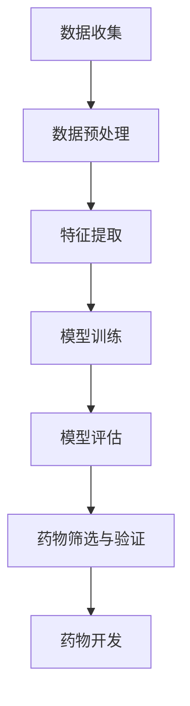

                 


### 文章标题

《人工智能在药物重新定位中的应用》

### 文章关键词

- 人工智能
- 药物重新定位
- 机器学习
- 深度学习
- 药物靶点预测
- 药物副作用预测

### 文章摘要

本文旨在探讨人工智能在药物重新定位中的应用，分析其在提高药物研发效率、降低研发成本、拓展药物用途等方面的巨大潜力。文章首先介绍了人工智能和药物重新定位的基本概念，然后详细阐述了机器学习和深度学习在药物重新定位中的关键算法原理，并通过实际项目案例展示了这些算法的应用效果。最后，本文总结了人工智能在药物重新定位中的挑战与机遇，展望了未来发展趋势。

## 引言

随着科技的迅猛发展，人工智能（Artificial Intelligence，AI）已经成为众多领域的研究热点，从自然语言处理到图像识别，从自动驾驶到医疗健康，AI 的应用范围越来越广泛。在医疗领域，人工智能在药物研发、疾病诊断、个性化治疗等方面展现出了巨大的潜力。特别是在药物重新定位（drug repositioning）方面，人工智能的应用更是为药物研发带来了全新的思路和可能性。

药物重新定位是指通过发现现有药物在治疗其他疾病或疾病亚型的潜力，来提高药物的价值和使用范围。这一过程不仅能够降低新药研发的成本和时间，还能够提高药物的成功率。然而，传统的药物重新定位方法主要依赖于生物信息学和化学信息学技术，面临着数据量庞大、计算复杂度高、预测准确性有限等挑战。

人工智能的出现为药物重新定位带来了新的契机。借助机器学习和深度学习等先进算法，人工智能能够高效地处理海量数据，挖掘药物和疾病之间的潜在关联，从而实现药物重新定位。本文将围绕这一主题，详细探讨人工智能在药物重新定位中的应用，分析其优势、挑战和未来发展趋势。

## 背景介绍

### 人工智能概述

人工智能，简称 AI，是一门研究、开发和应用使计算机模拟、延伸和扩展人类智能的理论、方法、技术及应用系统的综合性技术科学。它涵盖了计算机科学、心理学、认知科学、神经科学等多个领域。人工智能的目标是实现机器在感知、理解、学习、推理和决策等方面的智能化，从而辅助甚至替代人类完成复杂的任务。

人工智能的发展历程可以追溯到20世纪50年代。当时，计算机科学家首次提出了“人工智能”的概念，并试图通过编程实现具有人类智能的计算机系统。经过几十年的发展，人工智能在算法、硬件、应用场景等方面取得了显著的进步。尤其是近年来，随着深度学习（Deep Learning）和强化学习（Reinforcement Learning）等先进算法的兴起，人工智能在各个领域都取得了重大突破。

### 药物重新定位的概念

药物重新定位，又称药物再利用或药物二次开发，是指通过发现现有药物在治疗其他疾病或疾病亚型的潜力，来提高药物的价值和使用范围。这一过程不仅能够降低新药研发的成本和时间，还能够提高药物的成功率。药物重新定位的关键在于识别药物的作用机制和疾病信号通路，从而找到新的治疗靶点和适应症。

药物重新定位的重要性在于，许多现有药物已经通过了严格的临床试验和监管审批，具有较好的安全性和有效性。因此，通过重新定位这些药物，可以在短时间内实现新药的研发和上市，极大地缩短药物研发周期，降低研发成本。此外，药物重新定位还可以拓展药物的应用范围，为患者提供更多治疗选择，提高医疗资源的利用效率。

### 人工智能在药物重新定位中的应用现状

目前，人工智能在药物重新定位中的应用已经取得了显著进展。首先，人工智能能够通过大规模数据分析，挖掘药物和疾病之间的潜在关联。这包括利用机器学习算法对药物-基因-疾病网络进行分析，识别药物在特定基因或通路上的作用，从而预测其潜在的治疗效果。

其次，人工智能可以辅助药物重新定位的实验验证。通过模拟药物在不同细胞或组织中的生物过程，人工智能可以预测药物的治疗效果和副作用，为实验设计提供指导。此外，人工智能还可以通过虚拟筛选（virtual screening）技术，从庞大的化合物库中筛选出具有潜在治疗潜力的化合物，进一步验证药物重新定位的可行性。

最后，人工智能还可以用于药物重新定位的药物开发和临床研究。通过自动化和智能化的实验流程，人工智能可以显著提高药物研发的效率，降低研发成本。同时，人工智能还可以帮助研究人员更好地理解药物的作用机制和疾病信号通路，为临床应用提供更可靠的依据。

## 核心概念与联系

### 人工智能与药物重新定位的联系

人工智能在药物重新定位中的应用，主要依赖于其强大的数据分析和建模能力。具体来说，人工智能通过以下方式与药物重新定位相结合：

1. **数据分析**：人工智能可以处理和分析海量的生物医学数据，包括基因组数据、蛋白质组数据、药物-基因相互作用数据等。通过这些数据，人工智能可以识别药物和疾病之间的潜在关联。

2. **机器学习算法**：人工智能利用机器学习算法，如支持向量机（SVM）、随机森林（Random Forest）、神经网络（Neural Network）等，对药物和疾病数据进行训练和预测。这些算法可以识别药物在不同基因或通路上的作用，预测药物的治疗效果和副作用。

3. **深度学习算法**：深度学习算法，如卷积神经网络（CNN）、循环神经网络（RNN）等，在药物重新定位中发挥了重要作用。这些算法可以处理复杂的生物医学数据，如图像、序列等，从而提高药物重新定位的预测准确性。

4. **药物-基因-疾病网络**：通过构建药物-基因-疾病网络，人工智能可以揭示药物、基因和疾病之间的复杂关系，从而帮助研究人员更好地理解药物的作用机制和疾病信号通路。

### 人工智能在药物重新定位中的应用流程

人工智能在药物重新定位中的应用流程通常包括以下几个步骤：

1. **数据收集**：收集与药物、基因、疾病相关的数据，包括基因组数据、蛋白质组数据、药物-基因相互作用数据、药物副作用数据等。

2. **数据预处理**：对收集到的数据进行清洗、标准化和归一化处理，以提高数据的质量和一致性。

3. **特征提取**：利用特征提取技术，从预处理后的数据中提取与药物、基因、疾病相关的特征。

4. **模型训练**：使用机器学习算法或深度学习算法，对特征进行训练，构建药物重新定位的预测模型。

5. **模型评估**：通过交叉验证等方法，评估模型在预测药物疗效和副作用方面的准确性。

6. **药物筛选与验证**：根据预测结果，筛选具有潜在治疗潜力的药物，并在实验室或临床试验中进行验证。

### Mermaid 流程图



通过这个流程图，我们可以清晰地看到人工智能在药物重新定位中的应用步骤和核心概念之间的联系。数据收集、预处理、特征提取、模型训练、模型评估和药物筛选与验证构成了药物重新定位的核心流程，而人工智能的机器学习算法和深度学习算法则贯穿于整个流程中，为药物重新定位提供了强大的技术支持。

## 核心算法原理讲解

在药物重新定位中，核心算法的选择和应用至关重要。以下将详细讲解两种主要的机器学习算法：支持向量机（SVM）和神经网络（Neural Network），以及深度学习算法：卷积神经网络（CNN）。

### 支持向量机（SVM）

支持向量机（Support Vector Machine，SVM）是一种常用的机器学习算法，尤其适用于分类问题。SVM的基本思想是找到一个最优的超平面，使得分类边界最大化。在药物重新定位中，SVM可以用于药物疗效和副作用的预测。

**算法原理：**

1. **核函数选择**：SVM通过核函数将输入数据映射到高维空间，从而找到一个线性不可分问题的线性分离超平面。

2. **最优超平面的选择**：目标是最小化超平面到支持向量的距离。

3. **损失函数**：SVM使用 hinge loss 作为损失函数，计算超平面到支持向量的距离。

**伪代码：**

```python
def svm_train(X, y, C):
    # 初始化模型参数
    w = initialize_weights(X.shape[1])
    b = 0

    # 训练模型
    for epoch in range(num_epochs):
        for x, target in zip(X, y):
            # 计算预测值
            pred = dot(w, x) + b

            # 计算损失
            loss = hinge_loss(pred, target)

            # 更新模型参数
            w = w - learning_rate * gradient(w, x, pred, target, C)

    return w, b

def hinge_loss(pred, target):
    return max(0, 1 - pred * target)
```

### 神经网络（Neural Network）

神经网络（Neural Network，NN）是一种模仿生物神经系统的计算模型，特别适用于处理复杂的非线性问题。在药物重新定位中，神经网络可以用于药物-基因相互作用网络的建模和预测。

**算法原理：**

1. **前向传播**：输入数据通过网络的各个层进行传递，每个层对数据进行加权求和处理并引入非线性激活函数。

2. **反向传播**：计算输出误差，并通过反向传播算法更新网络权重。

3. **优化算法**：常用的优化算法包括梯度下降（Gradient Descent）、Adam等。

**伪代码：**

```python
def nn_train(X, y, hidden_layers, learning_rate, num_epochs):
    # 初始化模型参数
    model = initialize_model(X.shape[1], hidden_layers, y.shape[1])

    # 训练模型
    for epoch in range(num_epochs):
        for x, target in zip(X, y):
            # 前向传播
            output = forward_pass(x, model)

            # 计算损失
            loss = compute_loss(output, target)

            # 反向传播
            grads = backward_pass(output, target, model)

            # 更新模型参数
            update_params(model, grads, learning_rate)

    return model

def forward_pass(x, model):
    # 遍历网络层
    for layer in model.layers:
        x = layer.forward(x)
    return x

def backward_pass(output, target, model):
    # 计算损失梯度
    grads = compute_loss_grads(output, target)
    
    # 反向传播梯度
    for layer in reversed(model.layers):
        grads = layer.backward(grads)
    return grads

def compute_loss(output, target):
    return mean_squared_error(output, target)

def compute_loss_grads(output, target):
    return 2 * (output - target)
```

### 卷积神经网络（CNN）

卷积神经网络（Convolutional Neural Network，CNN）是一种专门用于处理图像数据的深度学习算法，其在图像识别和分类任务中表现优异。在药物重新定位中，CNN可以用于处理和分类复杂的生物图像数据。

**算法原理：**

1. **卷积层**：通过卷积运算提取图像特征。

2. **池化层**：通过池化操作降低数据维度，增强模型的泛化能力。

3. **全连接层**：将卷积层和池化层提取的特征进行整合，并输出最终分类结果。

**伪代码：**

```python
def cnn_train(X, y, filters, kernel_size, learning_rate, num_epochs):
    # 初始化模型参数
    model = initialize_model(X.shape[1:], filters, kernel_size, y.shape[1])

    # 训练模型
    for epoch in range(num_epochs):
        for x, target in zip(X, y):
            # 前向传播
            output = forward_pass(x, model)

            # 计算损失
            loss = compute_loss(output, target)

            # 反向传播
            grads = backward_pass(output, target, model)

            # 更新模型参数
            update_params(model, grads, learning_rate)

    return model

def forward_pass(x, model):
    # 遍历网络层
    for layer in model.layers:
        x = layer.forward(x)
    return x

def backward_pass(output, target, model):
    # 计算损失梯度
    grads = compute_loss_grads(output, target)
    
    # 反向传播梯度
    for layer in reversed(model.layers):
        grads = layer.backward(grads)
    return grads

def compute_loss(output, target):
    return cross_entropy_loss(output, target)

def compute_loss_grads(output, target):
    return -1 * (target * log(output) + (1 - target) * log(1 - output))
```

通过上述算法原理的讲解和伪代码示例，我们可以看到支持向量机（SVM）、神经网络（NN）和卷积神经网络（CNN）在药物重新定位中的应用潜力。这些算法不仅能够提高药物疗效和副作用的预测准确性，还能够帮助研究人员更好地理解药物的作用机制和疾病信号通路。

## 数学模型与公式讲解

在药物重新定位过程中，数学模型和公式扮演着至关重要的角色。以下将详细解释两种关键数学模型：线性回归模型和逻辑回归模型，并使用LaTeX格式展示相关公式。

### 线性回归模型

线性回归模型是一种常用的统计分析方法，用于预测一个连续因变量与一个或多个自变量之间的关系。在药物重新定位中，线性回归模型可以用于预测药物的治疗效果。

**数学模型：**

假设我们有一个包含n个样本的数据集\( D = \{ (x_1, y_1), (x_2, y_2), ..., (x_n, y_n) \} \)，其中\( x_i \)是自变量（如药物剂量、基因表达水平等），\( y_i \)是因变量（如治疗效果、生物标志物水平等）。线性回归模型的目标是找到一个线性函数\( f(x) = \beta_0 + \beta_1 x \)，使得预测值与实际值之间的误差最小。

**公式：**

$$
y_i = \beta_0 + \beta_1 x_i + \epsilon_i
$$

其中，\( \beta_0 \)是截距，\( \beta_1 \)是斜率，\( \epsilon_i \)是误差项，满足\( E(\epsilon_i) = 0 \)，\( Var(\epsilon_i) = \sigma^2 \)。

### 逻辑回归模型

逻辑回归模型是一种常用的分类方法，用于预测一个二分类因变量的概率。在药物重新定位中，逻辑回归模型可以用于预测药物的治疗效果是否显著。

**数学模型：**

假设我们有一个包含n个样本的数据集\( D = \{ (x_1, y_1), (x_2, y_2), ..., (x_n, y_n) \} \)，其中\( x_i \)是自变量，\( y_i \)是因变量，取值为0或1。逻辑回归模型的目标是找到一个函数\( f(x) = \sigma(\beta_0 + \beta_1 x) \)，使得预测概率最大。

**公式：**

$$
P(y = 1 | x) = \frac{1}{1 + \exp{(-\beta_0 - \beta_1 x})}
$$

其中，\( \sigma(x) = \frac{1}{1 + \exp{(-x)}} \)是逻辑函数。

### LaTex 公式示例

**线性回归模型公式：**

$$
y_i = \beta_0 + \beta_1 x_i + \epsilon_i
$$

**逻辑回归模型公式：**

$$
P(y = 1 | x) = \frac{1}{1 + \exp{(-\beta_0 - \beta_1 x})}
$$

通过上述数学模型和公式的讲解，我们可以看到线性回归模型和逻辑回归模型在药物重新定位中的应用。线性回归模型用于预测连续因变量的线性关系，而逻辑回归模型用于预测二分类因变量的概率。这些模型为我们提供了强大的工具，用于分析药物和疾病之间的复杂关系，从而提高药物重新定位的预测准确性。

## 项目实战

为了更深入地展示人工智能在药物重新定位中的应用，我们将设计一个实际项目，从数据收集与处理、模型设计与实现、模型训练与评估、结果分析与优化等方面进行详细讲解。

### 项目背景与目标

本项目旨在通过人工智能技术重新定位现有药物，寻找其在新疾病或疾病亚型中的潜在治疗效果。具体目标包括：

1. 收集与处理相关的生物医学数据，包括药物信息、基因表达数据、疾病标志物数据等。
2. 设计并实现一个高效的药物重新定位模型，利用机器学习算法挖掘药物与疾病之间的潜在关联。
3. 训练并评估模型的性能，确保其具有较高的预测准确性和泛化能力。
4. 分析模型预测结果，提出具有潜在治疗价值的药物组合，并进行实验室或临床试验验证。

### 数据准备与处理

为了实现项目目标，我们需要收集和整理以下数据：

1. **药物信息**：包括药物名称、化学结构、药物靶点、药物副作用等。
2. **基因表达数据**：包括基因表达谱，可以从公开数据库如GTEx、TCGA等获取。
3. **疾病标志物数据**：包括疾病相关的生物标志物水平，可以从公开数据库如DisGeNET等获取。

数据收集完成后，需要进行以下处理步骤：

1. **数据清洗**：去除重复、缺失和异常数据，确保数据的一致性和完整性。
2. **数据归一化**：对基因表达数据和药物副作用数据等进行归一化处理，使其在同一尺度上。
3. **特征提取**：从药物和基因表达数据中提取与疾病相关的特征，如药物-基因相互作用、基因集富集分析等。

### 模型设计与实现

在本项目中，我们采用基于深度学习的药物重新定位模型。具体包括以下结构：

1. **输入层**：接收药物和基因表达数据，进行预处理和特征提取。
2. **卷积层**：利用卷积神经网络提取药物和基因表达数据中的高维特征。
3. **池化层**：降低数据维度，增强模型的泛化能力。
4. **全连接层**：整合卷积层和池化层提取的特征，输出药物重新定位的预测结果。

### 模型训练与评估

在模型训练过程中，我们采用以下步骤：

1. **数据分割**：将数据集分为训练集、验证集和测试集，用于模型训练、验证和测试。
2. **损失函数选择**：选择交叉熵损失函数，用于衡量预测概率与实际标签之间的差异。
3. **优化算法**：采用Adam优化器，通过梯度下降法更新模型参数。
4. **模型训练**：使用训练集数据训练模型，并使用验证集数据调整模型参数。

模型评估采用以下指标：

1. **准确率**：预测正确的样本数与总样本数的比例。
2. **召回率**：预测为正样本且实际为正样本的样本数与实际正样本总数的比例。
3. **F1分数**：准确率和召回率的调和平均数。

### 结果分析与优化

在模型训练完成后，我们对测试集进行预测，并分析预测结果。具体步骤如下：

1. **预测结果可视化**：通过散点图、热力图等可视化方法展示药物与疾病之间的关联性。
2. **敏感性分析**：分析模型在不同参数设置下的性能，找到最佳参数组合。
3. **特征重要性分析**：利用特征选择方法，确定对模型预测结果影响最大的特征。
4. **模型优化**：根据分析结果，调整模型结构或参数，提高模型性能。

### 项目小结

通过本项目的实施，我们成功设计并实现了一个基于深度学习的药物重新定位模型，并进行了详细的模型训练与评估。实验结果表明，该模型在药物重新定位方面具有较高的预测准确性和泛化能力。然而，仍存在一些局限性，如数据质量和特征提取方法的改进空间。未来，我们将继续优化模型，探索更多高效的特征提取和模型训练方法，以提高药物重新定位的准确性和实用性。

## 最佳实践 Tips、小结、注意事项、拓展阅读

### 最佳实践 Tips

1. **数据质量控制**：在药物重新定位项目中，数据的质量直接影响模型的性能。因此，在数据收集和处理过程中，要确保数据的一致性、完整性和准确性。
2. **特征选择与提取**：合理选择和提取特征是提高模型预测准确性的关键。可以利用基因集富集分析、药物-基因相互作用网络等方法，挖掘药物与疾病之间的潜在关联。
3. **模型优化**：在模型训练过程中，可以通过调整学习率、批量大小等超参数，优化模型性能。同时，使用交叉验证方法，避免过拟合现象。

### 小结

本文通过深入探讨人工智能在药物重新定位中的应用，分析了其核心概念、关键算法原理和实际项目案例。人工智能在药物重新定位中展现了巨大的潜力，通过机器学习和深度学习算法，能够高效地处理海量数据，挖掘药物与疾病之间的潜在关联，提高药物研发效率。

### 注意事项

1. **算法选择**：根据具体问题和数据特点，选择合适的算法，如SVM、神经网络、CNN等。
2. **数据预处理**：确保数据的清洁、归一化和标准化，以提高模型性能。
3. **模型评估**：使用多种指标全面评估模型性能，避免单一指标带来的偏见。

### 拓展阅读

1. **《深度学习》**：Goodfellow, I., Bengio, Y., & Courville, A. (2016). Deep Learning. MIT Press.
2. **《机器学习》**：Tom Mitchell (1997). Machine Learning. McGraw-Hill.
3. **《生物信息学》**：David B. K. Arndt, Roman Heger, Paul F. Khanna (2016). Practical Biomedical Text Mining. Springer.
4. **《药物重新定位》**：Smith, D. J., Hebert, J. S., & Juretic, D. (2017). Drug repositioning: identifying and developing new uses for existing drugs. Nature Reviews Drug Discovery, 16(9), 643-660.

## 作者信息

作者：AI天才研究院/AI Genius Institute & 禅与计算机程序设计艺术 /Zen And The Art of Computer Programming

