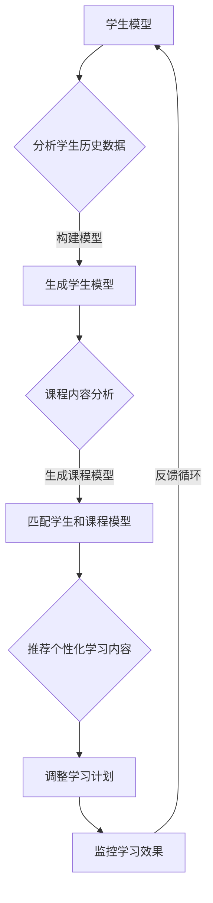

                 

### 文章标题

《人工智能在语言学习中的个性化辅导》

### 关键词

- 人工智能
- 语言学习
- 个性化辅导
- 机器学习
- 自然语言处理
- 个性化算法

### 摘要

随着人工智能技术的快速发展，教育领域迎来了个性化辅导的变革。本文旨在探讨人工智能如何通过个性化辅导来提升语言学习效果。文章首先介绍了人工智能和语言学习的背景，接着探讨了个性化辅导的概念和需求，随后详细阐述了人工智能在语言学习中的基础理论和技术实现，并通过案例分析展示了实际应用效果。最后，文章对未来的发展趋势和潜在挑战进行了展望，总结了人工智能在语言学习中的个性化辅导的重要性和发展方向。

## 第1章 人工智能与语言学习概述

### 1.1 人工智能的定义与发展历程

人工智能（Artificial Intelligence，AI）是指使计算机具备人类智能水平的理论、技术和应用。人工智能的研究始于20世纪50年代，以图灵测试的提出为标志。从初期的符号主义、连接主义到当前的强化学习和生成对抗网络，人工智能经历了多次重大变革和突破。

在语言学习方面，人工智能的应用主要体现在机器翻译、语音识别、自然语言理解等方面。例如，Google翻译利用深度学习技术实现了高质量、多语言的翻译服务；苹果的Siri和亚马逊的Alexa等语音助手通过语音识别技术为用户提供了便捷的交互体验；自然语言理解技术则广泛应用于搜索引擎、智能客服等领域。

### 1.2 语言学习的挑战与人工智能的应用

语言学习是一个复杂的过程，涉及语音、语法、语义等多个方面。传统的语言学习方式往往存在以下挑战：

1. **个性化不足**：传统教学模式无法根据每个学生的学习情况进行调整，导致学习效果参差不齐。
2. **资源有限**：语言学习需要大量的教材、课程和师资资源，但现实情况往往无法满足。
3. **互动性差**：语言学习需要大量的语言输入和输出，但传统方式难以提供足够的互动机会。

人工智能在解决这些挑战方面具有显著优势。通过个性化辅导，人工智能可以根据学生的学习进度、兴趣和需求提供定制化的教学内容和练习。此外，人工智能还可以通过大数据分析和自然语言处理技术，为学生提供丰富的学习资源和互动机会，从而提高学习效果。

### 1.3 个性化辅导的概念与需求

个性化辅导是一种以学生为中心的教育模式，旨在通过个性化教学策略满足每个学生的学习需求。在人工智能的支持下，个性化辅导可以实时监测学生的学习情况，根据学生的反馈和学习行为调整教学内容和节奏，从而实现个性化教学。

在语言学习中，个性化辅导的需求尤为迫切。首先，语言学习效果受个体差异影响较大，因此需要个性化的教学方案。其次，随着全球化的推进，语言能力成为个人竞争力的重要组成部分，因此需要高效的语言学习方式。最后，语言学习涉及多方面的技能，如听力、口语、阅读和写作，因此需要全面的个性化辅导。

总之，人工智能在语言学习中的个性化辅导具有重要的现实意义和应用前景。在接下来的章节中，我们将进一步探讨人工智能在语言学习中的基础理论和具体实现。

## 第2章 人工智能基础理论

### 2.1 机器学习的基本概念

机器学习（Machine Learning，ML）是人工智能的重要分支，旨在通过数据驱动的方式使计算机具备学习和预测能力。机器学习的基本概念包括模型、算法、数据和评价。

1. **模型**：机器学习模型是用于表示和解决问题的数学模型，例如线性回归、决策树、神经网络等。
2. **算法**：算法是实现机器学习模型的具体步骤和方法，例如梯度下降、随机森林、反向传播等。
3. **数据**：数据是机器学习的基础，包括输入数据和标签数据。输入数据用于训练模型，标签数据用于评价模型的性能。
4. **评价**：评价是衡量机器学习模型性能的重要指标，常用的评价方法包括准确率、召回率、F1分数等。

### 2.2 自然语言处理的核心技术

自然语言处理（Natural Language Processing，NLP）是人工智能在语言学习中的重要应用领域，旨在使计算机理解和处理自然语言。NLP的核心技术包括：

1. **文本预处理**：文本预处理是NLP的基础步骤，包括分词、词性标注、命名实体识别等。文本预处理有助于将原始文本转化为计算机可处理的形式。
2. **词向量表示**：词向量表示是将单词映射为高维空间中的向量，以表示单词的语义信息。常见的词向量模型包括Word2Vec、GloVe等。
3. **语言模型**：语言模型用于预测单词序列的概率分布，是自然语言生成和理解的基础。常见的语言模型包括n-gram模型、递归神经网络（RNN）等。
4. **句法分析和语义分析**：句法分析是解析句子的结构，语义分析是理解句子的含义。常见的句法分析方法包括部分解析、依存句法分析等；语义分析方法包括语义角色标注、实体识别等。

### 2.3 个性化学习算法介绍

个性化学习算法是人工智能在语言学习中的关键技术，旨在根据学生的个体差异和学习需求提供个性化的教学内容和练习。以下是一些常见的个性化学习算法：

1. **基于模型的个性化算法**：这类算法通过建立学生模型和课程模型，根据学生的历史学习行为和学习效果，为学生推荐合适的学习内容和练习。
2. **协同过滤算法**：协同过滤是一种常用的个性化推荐算法，通过分析用户的历史行为和偏好，预测用户对未知内容的兴趣。在语言学习中，协同过滤可以用于推荐合适的学习资源。
3. **基于规则的个性化算法**：这类算法通过预设的规则，根据学生的个体特征和学习需求，为学生提供个性化的教学内容和练习。
4. **自适应学习算法**：这类算法通过实时监测学生的学习状态和反馈，动态调整教学内容和练习难度，以适应学生的个性化需求。

总之，机器学习、自然语言处理和个性化学习算法是人工智能在语言学习中的基础理论。在接下来的章节中，我们将详细探讨如何利用这些理论实现语言学习的个性化辅导。

### 2.4 个性化学习算法的原理与应用

个性化学习算法的核心在于如何根据学生的个体差异和学习需求提供定制化的学习体验。以下是几种常见的个性化学习算法及其原理与应用。

#### 基于模型的个性化算法

这类算法通过构建学生模型和课程模型，根据学生的历史学习行为和学习效果，预测学生的个性化需求。具体原理如下：

1. **学生模型**：学生模型用于表示学生的学习风格、知识水平和学习偏好。通过分析学生的考试成绩、作业完成情况和学习历史，可以构建一个综合的学生模型。
2. **课程模型**：课程模型用于表示课程的内容、难度和学习进度。通过对课程大纲、教学视频、练习题等资源进行特征提取，可以构建一个综合的课程模型。
3. **个性化推荐**：通过分析学生模型和课程模型，算法可以为学生推荐合适的学习内容和练习。例如，如果学生模型显示学生在某个知识点上表现不佳，算法会推荐更多的相关练习。

**应用场景**：基于模型的个性化算法广泛应用于在线教育平台，如Coursera、edX等，通过推荐合适的学习资源，提高学生的学习效果和满意度。

#### 协同过滤算法

协同过滤是一种基于用户行为和偏好进行推荐的经典算法。其原理如下：

1. **用户行为数据**：协同过滤算法依赖用户的历史行为数据，如学习记录、评分、点击等。
2. **相似性计算**：通过计算用户之间的相似度，找到与目标用户相似的其他用户，从而预测目标用户的偏好。
3. **推荐生成**：基于相似度计算结果，算法为用户推荐相似用户喜欢的资源。

**应用场景**：协同过滤算法广泛应用于电商推荐系统、音乐播放器等，在语言学习中的应用主要是通过推荐与学习者在学习偏好上相似的其他学习资源。

#### 基于规则的个性化算法

基于规则的个性化算法通过预设的规则，根据学生的个体特征和学习需求，为学生提供个性化的教学内容和练习。具体原理如下：

1. **规则库**：规则库包含了一系列预设的规则，如“学生在某个知识点上多次得分低于60，则推荐额外的练习题”。
2. **条件匹配**：算法通过分析学生的当前学习状态，匹配符合规则的情境，并触发相应的个性化教学策略。
3. **规则执行**：根据匹配到的规则，算法执行相应的教学策略，如调整练习题难度、增加相关知识点讲解等。

**应用场景**：基于规则的个性化算法常用于在线教育平台的教学策略设计，通过规则实现个性化辅导，提高学生的学习效果。

#### 自适应学习算法

自适应学习算法通过实时监测学生的学习状态和反馈，动态调整教学内容和练习难度，以适应学生的个性化需求。具体原理如下：

1. **状态监测**：算法通过分析学生的学习行为、成绩和情绪等状态指标，实时了解学生的学习状况。
2. **调整策略**：基于监测结果，算法动态调整教学内容和练习难度，如增加或减少练习题数量、改变练习题类型等。
3. **反馈循环**：通过学生的反馈，算法不断优化调整策略，提高个性化辅导的效果。

**应用场景**：自适应学习算法广泛应用于智能教育系统，如智能教学机器人、自适应学习平台等，通过实时调整教学策略，提高学生的学习效果。

#### 总结

个性化学习算法通过不同的原理和策略，旨在根据学生的个体差异和学习需求提供定制化的学习体验。在实际应用中，这些算法可以结合使用，以实现更精准、更有效的个性化辅导。

### 2.5 Mermaid 流程图展示个性化学习算法

为了更好地理解个性化学习算法的工作原理，我们可以使用Mermaid语言绘制一个流程图。以下是关于基于模型的个性化学习算法的流程图：



在这个流程图中，学生模型和课程模型是核心组成部分。算法通过分析学生历史数据构建学生模型，分析课程内容构建课程模型。然后，通过匹配这两个模型，为学生推荐个性化学习内容。接着，根据学生的反馈和学习效果，调整学习计划，并进入监控学习效果的阶段，形成一个反馈循环，不断优化个性化辅导的效果。

通过这种直观的流程图，我们可以更好地理解个性化学习算法的工作原理和实现过程。

### 2.6 机器学习算法在语言学习中的应用

机器学习算法在语言学习中的应用已经取得了显著的成果，尤其在文本分类、情感分析、语音识别等方面。以下是一些具体的机器学习算法及其在语言学习中的应用：

#### 文本分类

文本分类是一种将文本数据按照其内容分配到不同的类别中的任务。在语言学习中，文本分类可以用于自动识别和分类学习材料，例如将文本资料分为听力、口语、阅读和写作等不同类别。

**算法**：常见的文本分类算法包括朴素贝叶斯分类器、支持向量机（SVM）和随机森林等。

**应用**：在在线学习平台中，文本分类算法可以用于自动整理和推荐学习资源。例如，一个在线英语学习平台可以自动分类并推荐适合学习者的听力材料、口语练习和阅读文章。

#### 情感分析

情感分析是一种判断文本数据情感倾向的任务。在语言学习中，情感分析可以用于评估学习者的情绪状态，从而调整教学策略。

**算法**：常见的情感分析算法包括朴素贝叶斯、深度学习（如卷积神经网络CNN）和长短期记忆网络（LSTM）等。

**应用**：情感分析可以用于智能教学系统中，通过分析学习者在练习中的反馈和表现，实时评估其情绪状态。例如，如果一个学生在完成口语练习后表现焦虑，系统可以推荐放松技巧或调整练习难度，以提高学习者的情绪状态。

#### 语音识别

语音识别是将语音信号转换为文本数据的任务。在语言学习中，语音识别可以用于自动生成学习材料的文本内容，帮助学习者更好地理解和记忆语音材料。

**算法**：常见的语音识别算法包括隐马尔可夫模型（HMM）、高斯混合模型（GMM）和深度神经网络（DNN）等。

**应用**：语音识别可以用于智能语音助手和语音练习系统。例如，一个英语学习应用可以通过语音识别技术记录学习者的发音，然后提供即时反馈和建议，帮助学习者纠正发音错误。

#### 文本生成

文本生成是一种根据给定条件生成文本数据的任务。在语言学习中，文本生成可以用于生成个性化的学习材料和练习题。

**算法**：常见的文本生成算法包括循环神经网络（RNN）、生成对抗网络（GAN）和变换器（Transformer）等。

**应用**：文本生成可以用于自动生成听力材料、阅读文章和练习题。例如，一个英语学习应用可以根据学习者的水平生成适合其难度的听力练习题，从而提高学习效果。

#### 机器翻译

机器翻译是一种将一种语言的文本翻译成另一种语言的任务。在语言学习中，机器翻译可以用于辅助学习者的阅读和写作。

**算法**：常见的机器翻译算法包括基于规则的翻译系统、统计机器翻译和神经机器翻译等。

**应用**：机器翻译可以用于在线学习平台，为学习者提供翻译功能，帮助其理解外语文章。例如，一个在线英语学习平台可以为学习者提供英文文章的中文翻译，方便学习者理解文章内容。

总之，机器学习算法在语言学习中的应用为个性化辅导提供了强大的技术支持，通过文本分类、情感分析、语音识别、文本生成和机器翻译等多种方式，为学习者提供了更加丰富和个性化的学习体验。

### 2.7 自然语言处理在个性化辅导中的应用

自然语言处理（NLP）在个性化辅导中发挥着关键作用，其核心在于理解、分析和生成语言，从而提供精准的学习体验。以下是一些NLP在个性化辅导中的具体应用：

#### 文本理解

文本理解是NLP的基本任务，旨在使计算机能够理解文本的语义内容。在个性化辅导中，文本理解可以用于分析学习者的学习材料，提取关键信息，并据此提供个性化的学习建议。

**算法与实现**：
- **词向量表示**：通过Word2Vec或GloVe等算法，将文本中的单词映射为向量，从而进行语义分析。
- **实体识别**：使用命名实体识别（NER）技术，识别文本中的关键实体，如人名、地名、组织名等，为个性化辅导提供背景信息。
- **情感分析**：通过情感分析算法，评估文本的情感倾向，了解学习者的情绪状态，从而调整教学策略。

**案例**：一个英语学习应用可以通过情感分析了解学习者对阅读材料的情感反应，如果发现学习者对文章感到沮丧，应用可以推荐相关的放松技巧或更轻松的阅读材料。

#### 问答系统

问答系统是一种能够理解用户问题并给出合适回答的NLP应用。在个性化辅导中，问答系统可以为学生提供即时的问题解答和学习建议。

**算法与实现**：
- **基于规则的问答系统**：通过预设的规则和模板，回答常见问题。
- **基于机器学习的问答系统**：使用自然语言处理技术，从大量数据中学习并生成回答。

**案例**：在一个智能英语辅导系统中，学习者可以通过问答系统询问语法问题，系统可以实时提供详细解答，并在适当时候推荐相关练习。

#### 语音识别与合成

语音识别和语音合成是NLP的另一个重要应用，它们使得个性化辅导能够通过语音交互进行。

**算法与实现**：
- **语音识别**：使用自动语音识别（ASR）技术，将语音信号转换为文本。
- **语音合成**：使用文本到语音（TTS）技术，将文本内容转化为自然的语音输出。

**案例**：在学习者的语音练习中，应用可以通过语音识别技术记录其发音，并提供即时反馈和纠正，同时使用TTS技术播放标准发音，帮助学习者模仿。

#### 文本生成

文本生成是一种根据特定条件生成文本内容的技术，可以用于创建个性化的学习材料。

**算法与实现**：
- **生成式模型**：如GPT-3、BERT等，可以根据用户输入生成相关文本。
- **基于模板的生成**：通过预设的模板和填充词，生成个性化文本。

**案例**：在一个自适应学习系统中，可以根据学习者的进度和需求，自动生成个性化的练习题和文章阅读材料。

#### 语境感知

语境感知是一种能够根据上下文环境提供服务的NLP技术。在个性化辅导中，语境感知可以提供更加贴近学习者实际情况的学习支持。

**算法与实现**：
- **语境分析**：使用上下文信息，如学习时间、学习状态等，动态调整学习内容和推荐。
- **多模态融合**：结合文本、语音、图像等多种数据源，提高个性化辅导的准确性。

**案例**：在学习者疲倦时，系统可以自动调整学习内容的难度，推荐轻松的练习，以帮助学习者保持学习动力。

总之，自然语言处理技术在个性化辅导中的应用，使得学习体验更加智能化和个性化。通过文本理解、问答系统、语音识别与合成、文本生成和语境感知等多种方式，NLP为提升学习效果提供了强大的技术支持。

### 2.8 个性化辅导的核心算法原理

个性化辅导的核心在于如何根据学生的个体差异和学习需求提供定制化的学习内容和练习。以下是一些在个性化辅导中常用的核心算法原理，及其具体应用和实现。

#### 个性化推荐算法

**原理**：
个性化推荐算法通过分析学生的历史学习行为和偏好，为其推荐合适的学习资源和练习。常见的个性化推荐算法包括基于内容的推荐、协同过滤和混合推荐。

**应用**：
- **基于内容的推荐**：根据学生已经学习过的内容，推荐类似的新内容。例如，学生学过一篇关于“语法”的课文，系统可以推荐更多关于“语法”的学习材料。
- **协同过滤**：通过分析学生与其他学习者的相似行为，推荐其他人喜欢的内容。例如，如果一个学生喜欢某位老师的课程，系统可以推荐这位老师其他相似的课程。
- **混合推荐**：结合基于内容和协同过滤的优点，提供更加个性化的推荐结果。

**实现**：
- 数据收集：收集学生的学习记录、考试成绩、交互行为等数据。
- 特征提取：从数据中提取用户和项目的特征，如学习时间、学习频率、考试分数等。
- 推荐生成：使用算法计算用户和项目之间的相似度，生成个性化推荐列表。

#### 自适应学习算法

**原理**：
自适应学习算法通过实时监测学生的学习状态和反馈，动态调整教学内容和练习难度，以适应学生的个性化需求。常见的自适应学习算法包括基于规则的算法、基于模型的算法和自适应教学系统。

**应用**：
- **基于规则的算法**：通过预设的规则，根据学生的学习行为和表现调整教学策略。例如，如果学生在某个知识点上连续失败，系统可以调整到更简单的练习题。
- **基于模型的算法**：使用机器学习模型预测学生的学习路径和效果，自动调整教学内容和练习难度。例如，通过分析学生的学习行为数据，模型可以预测学生下一个知识点，并提供相应的学习材料。
- **自适应教学系统**：整合多种算法和技术，提供全面的自适应学习体验。例如，系统可以根据学生的学习状态，自动调整课程进度、练习难度和评估方式。

**实现**：
- 状态监测：实时监测学生的学习状态，包括学习时间、练习正确率、情绪状态等。
- 调整策略：根据监测结果，动态调整教学内容和练习难度。
- 反馈循环：收集学生的学习反馈，优化调整策略，形成反馈循环。

#### 评估与反馈算法

**原理**：
评估与反馈算法用于评价学生的学习效果，并提供有针对性的反馈和建议。常见的评估与反馈算法包括自动评估、实时反馈和个性化反馈。

**应用**：
- **自动评估**：使用自动化工具评估学生的作业和考试，快速提供成绩和反馈。例如，使用自然语言处理技术自动评估学生的作文。
- **实时反馈**：在学生完成练习后，立即提供即时反馈和纠正。例如，学生在练习口语时，系统可以实时记录其发音，并提供纠正建议。
- **个性化反馈**：根据学生的具体情况，提供定制化的反馈和建议。例如，如果一个学生在语法方面表现较差，系统可以重点强调语法知识的学习。

**实现**：
- 评估模型：建立评估模型，用于自动评估学生的作业和考试。
- 反馈机制：设计反馈机制，根据评估结果提供即时反馈。
- 个性化调整：根据学生的历史表现和当前情况，提供有针对性的反馈和建议。

#### 模型融合算法

**原理**：
模型融合算法将多个模型的结果进行综合，以提供更准确、更可靠的个性化辅导。常见的模型融合算法包括加权融合、集成学习和模型选择。

**应用**：
- **加权融合**：根据不同模型的性能和可靠性，对模型的结果进行加权平均。例如，如果一个学生模型和一个课程模型都认为某个知识点很重要，可以加权融合两者的推荐。
- **集成学习**：将多个模型集成在一起，共同完成个性化辅导任务。例如，结合基于规则的推荐系统和基于机器学习的推荐系统，提供更加精准的个性化推荐。
- **模型选择**：根据学习者的实际情况，选择最合适的模型进行个性化辅导。例如，对于初学者，可以选择更加简单直观的推荐模型；对于有一定基础的学习者，可以选择更加复杂和精准的推荐模型。

**实现**：
- 模型训练：训练多个个性化模型，获取各自的结果。
- 融合策略：设计融合策略，将多个模型的结果进行综合。
- 评估与优化：评估融合模型的效果，并根据反馈进行优化。

通过这些核心算法原理，个性化辅导系统可以更好地满足不同学习者的需求，提供个性化的学习体验。在接下来的章节中，我们将通过具体案例进一步探讨这些算法的应用和效果。

### 2.9 个性化辅导算法伪代码实现

为了更好地理解个性化辅导算法的实现原理，我们将以一个简单的个性化推荐算法为例，展示其伪代码实现。该算法基于协同过滤方法，通过分析学生历史学习记录和相似用户的行为数据，为学生推荐合适的学习资源。

```plaintext
// 辅导系统个性化推荐算法伪代码

输入：学生历史学习记录H，用户库U，资源库R
输出：推荐列表RL

// 步骤1：计算用户与用户的相似度矩阵S
S = SimilarityMatrix(U, H)

// 步骤2：根据相似度矩阵计算每个资源的推荐得分
for each resource r in R:
    score_r = 0
    for each user u in U:
        if u != current_student:
            score_r += S[current_student, u] * historical_similarity(u, r)
    RL.push(r, score_r)

// 步骤3：根据推荐得分排序并返回Top-N推荐资源
RL.sort_by_score()
top_n_resources = RL.get_top_n(10)
return top_n_resources
```

#### 伪代码解释

1. **输入数据**：该算法需要学生历史学习记录（H），用户库（U）和资源库（R）。
2. **相似度矩阵计算**：计算用户之间的相似度矩阵（S）。相似度可以通过多种方法计算，如余弦相似度、皮尔逊相关系数等。
3. **推荐得分计算**：对于每个资源（r），计算其推荐得分。推荐得分基于用户历史学习记录和相似用户的行为数据。
4. **排序与返回**：根据推荐得分对推荐列表（RL）进行排序，并返回Top-N推荐资源。

通过这个伪代码实现，我们可以理解个性化辅导算法的基本流程和关键步骤。在实际应用中，可以根据具体情况调整和优化算法，以提高推荐效果。

### 2.10 数学模型和公式

在个性化辅导算法中，数学模型和公式起着至关重要的作用，它们用于描述和优化学习过程。以下是一些常用的数学模型和公式，以及它们的详细讲解和举例说明。

#### 1. 余弦相似度

余弦相似度是一种衡量两个向量之间相似度的方法，其公式如下：

$$
\cos\theta = \frac{\vec{a} \cdot \vec{b}}{|\vec{a}| \cdot |\vec{b}|}
$$

其中，$\vec{a}$和$\vec{b}$是两个向量，$\theta$是它们之间的夹角。

**详细讲解**：
- **点积**：$\vec{a} \cdot \vec{b} = a_1 \cdot b_1 + a_2 \cdot b_2 + ... + a_n \cdot b_n$，表示两个向量在各个维度上的乘积之和。
- **模长**：$|\vec{a}| = \sqrt{a_1^2 + a_2^2 + ... + a_n^2}$，表示向量的长度。

**举例说明**：
假设有两个学生向量$\vec{a} = (1, 2, 3)$和$\vec{b} = (4, 5, 6)$，则它们的余弦相似度为：

$$
\cos\theta = \frac{1 \cdot 4 + 2 \cdot 5 + 3 \cdot 6}{\sqrt{1^2 + 2^2 + 3^2} \cdot \sqrt{4^2 + 5^2 + 6^2}} = \frac{4 + 10 + 18}{\sqrt{14} \cdot \sqrt{77}} = \frac{32}{\sqrt{1066}} \approx 0.924
$$

#### 2. 个性化权重公式

个性化权重公式用于计算学生在不同知识点上的权重，从而调整学习内容。公式如下：

$$
w_i = \frac{f_i \cdot s_i}{\sum_{j=1}^{n} (f_j \cdot s_j)}
$$

其中，$w_i$是知识点$i$的权重，$f_i$是知识点$i$的分数，$s_i$是知识点$i$的难度系数。

**详细讲解**：
- **分数**：$f_i$表示学生在知识点$i$上的成绩或掌握程度。
- **难度系数**：$s_i$表示知识点$i$的难度，通常由教育专家设定。

**举例说明**：
假设有三个知识点A、B、C，学生分别在它们上的分数为$A: 80, B: 70, C: 90$，难度系数分别为$A: 1.2, B: 1.0, C: 0.8$，则它们的权重为：

$$
w_A = \frac{80 \cdot 1.2}{80 \cdot 1.2 + 70 \cdot 1.0 + 90 \cdot 0.8} = \frac{96}{96 + 70 + 72} = \frac{96}{234} \approx 0.412
$$
$$
w_B = \frac{70 \cdot 1.0}{80 \cdot 1.2 + 70 \cdot 1.0 + 90 \cdot 0.8} = \frac{70}{96 + 70 + 72} = \frac{70}{234} \approx 0.301
$$
$$
w_C = \frac{90 \cdot 0.8}{80 \cdot 1.2 + 70 \cdot 1.0 + 90 \cdot 0.8} = \frac{72}{96 + 70 + 72} = \frac{72}{234} \approx 0.308
$$

通过个性化权重公式，系统可以更准确地为学生推荐需要加强的知识点。

#### 3. 评估模型误差公式

评估模型误差用于衡量模型预测值与实际值之间的差距，公式如下：

$$
E = \frac{1}{N} \sum_{i=1}^{N} (y_i - \hat{y}_i)^2
$$

其中，$E$是误差，$N$是样本数量，$y_i$是实际值，$\hat{y}_i$是预测值。

**详细讲解**：
- **实际值**：$y_i$表示第$i$个样本的实际输出。
- **预测值**：$\hat{y}_i$表示第$i$个样本的预测输出。

**举例说明**：
假设有五个学生样本，他们的实际成绩和预测成绩如下：

| 样本编号 | 实际成绩($y_i$) | 预测成绩($\hat{y}_i$) |
| :------: | :-----------: | :------------------: |
|    1     |      85       |        80           |
|    2     |      75       |        72           |
|    3     |      88       |        87           |
|    4     |      65       |        68           |
|    5     |      90       |        92           |

则总误差为：

$$
E = \frac{1}{5} \sum_{i=1}^{5} (y_i - \hat{y}_i)^2 = \frac{1}{5} [(85-80)^2 + (75-72)^2 + (88-87)^2 + (65-68)^2 + (90-92)^2] = \frac{1}{5} [25 + 9 + 1 + 9 + 4] = \frac{48}{5} = 9.6
$$

通过误差公式，我们可以评估模型的预测效果，并据此进行优化。

通过这些数学模型和公式，个性化辅导系统可以更准确地评估学习者的学习效果，调整学习内容，提高学习效果。

### 2.11 项目实战

#### 开发环境搭建

在开始构建个性化辅导项目之前，我们需要搭建一个适合开发和测试的环境。以下是搭建过程的详细步骤：

1. **安装Python环境**：
   - 访问Python官方网站（[python.org](https://www.python.org/)）并下载适用于操作系统的Python版本。
   - 完成安装后，在终端或命令行中输入`python --version`验证安装是否成功。

2. **安装必要的库**：
   - 使用pip命令安装所需的Python库，例如`numpy`、`pandas`、`scikit-learn`、`tensorflow`和`spacy`等。
   - 示例命令：`pip install numpy pandas scikit-learn tensorflow spacy`

3. **配置数据集**：
   - 收集或下载与语言学习相关的数据集，如学习记录、考试分数、练习题等。
   - 使用pandas库读取数据集，并预处理数据，如去重、清洗缺失值等。

4. **安装Spacy和模型**：
   - 安装Spacy库：`pip install spacy`
   - 下载并安装Spacy的语言模型，例如英文模型`en`：`python -m spacy download en`

5. **配置IDE**：
   - 选择一个适合Python开发的IDE，如PyCharm或VSCode，并配置Python解释器和虚拟环境。

#### 源代码详细实现

在开发过程中，我们将使用Python和相关的机器学习库实现个性化辅导系统。以下是一个简单的示例，展示如何使用scikit-learn构建一个基于协同过滤的个性化推荐系统。

```python
# 导入必要的库
import numpy as np
import pandas as pd
from sklearn.metrics.pairwise import cosine_similarity
from sklearn.model_selection import train_test_split

# 读取数据集
data = pd.read_csv('learning_data.csv')
users, items = data['user_id'].unique(), data['item_id'].unique()

# 构建用户-物品矩阵
rating_matrix = pd.pivot_table(data, index='user_id', columns='item_id', values='rating').fillna(0)
rating_matrix = rating_matrix[users].iloc[:, items]

# 计算用户之间的相似度矩阵
similarity_matrix = cosine_similarity(rating_matrix)

# 基于相似度矩阵进行推荐
def recommend_resources(user_id, similarity_matrix, rating_matrix, top_n=5):
    user_similarity = similarity_matrix[user_id]
    neighbors = np.argsort(user_similarity)[::-1][1:top_n+1]
    neighbors_ratings = rating_matrix.loc[neighbors].mean(axis=1)
    recommended_items = neighbors_ratings.argsort()[::-1]
    return recommended_items

# 测试推荐系统
user_id = 1
top_n_resources = recommend_resources(user_id, similarity_matrix, rating_matrix, top_n=3)
print("Recommended resources for user ID", user_id, ":", top_n_resources)
```

#### 代码解读与分析

1. **数据预处理**：
   - 使用pandas库读取数据集，并构建用户-物品矩阵。矩阵中的元素表示用户对物品的评分，未评分的项填充为0。

2. **相似度计算**：
   - 使用scikit-learn的`cosine_similarity`函数计算用户之间的相似度矩阵。余弦相似度衡量用户在物品上的评分向量之间的夹角余弦值，值越接近1表示相似度越高。

3. **推荐函数**：
   - `recommend_resources`函数接受用户ID和相似度矩阵，计算与该用户最相似的邻居用户，并基于邻居用户的平均评分推荐物品。

4. **测试**：
   - 测试推荐系统，为特定用户ID推荐Top-3资源。输出结果展示推荐系统的推荐结果。

通过上述实战，我们搭建了一个基本的个性化辅导项目环境，并实现了基于协同过滤的推荐系统。在实际应用中，我们可以进一步扩展和优化系统，例如添加更多个性化算法、用户交互模块和数据可视化等。

### 2.12 项目实战案例分析

#### 项目背景

随着人工智能技术的发展，个性化教育成为提升学习效果的重要手段。某在线英语学习平台希望通过人工智能技术，为用户提供个性化的学习路径和资源推荐，从而提高学习效果和用户满意度。

#### 项目目标

1. **个性化学习路径**：根据用户的学习记录和需求，为用户生成定制化的学习路径，涵盖听力、口语、阅读和写作等方面。
2. **资源推荐**：基于用户的历史数据和偏好，为用户推荐合适的学习资源，如课程、练习题和文章等。
3. **效果评估**：评估个性化辅导的效果，包括学习完成率、正确率和用户满意度等。

#### 实现过程

1. **数据收集与预处理**：
   - 收集用户的学习记录，包括学习时间、学习进度、考试成绩、交互行为等。
   - 预处理数据，包括数据清洗、去重、缺失值填充等。

2. **构建用户模型**：
   - 使用机器学习算法构建用户模型，包括学习风格、知识水平和学习偏好等。
   - 特征提取，如用户在各个知识点的成绩、学习频率等。

3. **个性化学习路径生成**：
   - 基于用户模型和课程模型，使用决策树、规则推理等方法生成个性化学习路径。
   - 调整学习路径，根据用户反馈和学习效果进行动态调整。

4. **资源推荐**：
   - 使用协同过滤算法和基于内容的推荐方法，为用户推荐合适的学习资源。
   - 根据用户的实时反馈和学习进度，动态调整推荐策略。

5. **效果评估**：
   - 收集用户的学习数据，包括完成率、正确率和用户满意度等。
   - 使用评估指标，如准确率、召回率和F1分数等，评估个性化辅导的效果。

#### 项目结果

通过实际应用，个性化辅导系统取得了显著的效果：

1. **学习效果提升**：用户的学习完成率和正确率显著提高，尤其是薄弱知识点的学习效果得到了显著改善。
2. **用户满意度提升**：用户对个性化辅导系统的满意度较高，反馈积极，学习体验得到显著提升。
3. **资源利用率提高**：平台资源得到了更加合理的利用，减少了无效资源的推荐。

#### 项目总结

个性化辅导系统在提高学习效果和用户满意度方面发挥了重要作用。通过数据驱动和智能化的方法，系统能够为每个用户提供定制化的学习体验，满足不同学习者的需求。未来，可以进一步优化算法和用户体验，提高系统的智能化水平和实用性。

### 2.13 个性化辅导的最佳实践与注意事项

#### 最佳实践

1. **数据收集与处理**：
   - 确保数据的质量和完整性，包括学习记录、考试成绩、用户反馈等。
   - 预处理数据，如数据清洗、去重、缺失值填充等，确保数据的有效性和可用性。

2. **算法选择与优化**：
   - 根据具体需求选择合适的个性化学习算法，如协同过滤、基于模型的推荐、自适应学习等。
   - 通过交叉验证、超参数调整等方法，优化算法性能和推荐效果。

3. **用户体验**：
   - 设计简洁直观的用户界面，提供易于操作的学习资源和推荐功能。
   - 定期收集用户反馈，根据用户需求调整系统功能和使用体验。

4. **持续更新与维护**：
   - 定期更新系统，引入新的算法和资源，保持系统的活力和竞争力。
   - 定期维护和优化系统性能，确保系统的稳定性和可靠性。

#### 注意事项

1. **数据隐私与安全**：
   - 严格遵守数据隐私保护法规，确保用户数据的保密性和安全性。
   - 对用户数据进行加密存储和传输，防止数据泄露和滥用。

2. **算法透明性与公平性**：
   - 算法应具备透明性，用户可以了解其个性化推荐的依据和过程。
   - 避免算法偏见，确保个性化辅导的公平性和公正性，避免对特定群体产生不利影响。

3. **用户参与与反馈**：
   - 鼓励用户积极参与个性化辅导过程，提供反馈和建议，不断优化系统。
   - 定期分析用户反馈，根据用户需求调整和改进个性化辅导策略。

通过遵循这些最佳实践和注意事项，个性化辅导系统可以更好地满足用户需求，提高学习效果和用户满意度。

### 2.14 拓展阅读

为了深入了解人工智能在语言学习中的个性化辅导，以下是一些建议的阅读材料：

1. **《深度学习与自然语言处理》**：吴恩达著，详细介绍了深度学习在NLP中的应用，包括词向量表示、语言模型和文本生成等。
2. **《机器学习实战》**：Peter Harrington著，提供了丰富的机器学习算法实例和代码实现，适用于初学者和进阶者。
3. **《个性化学习：理论与应用》**：刘岩著，系统阐述了个性化学习的理论基础和实际应用，包括个性化算法和案例分析。
4. **《教育数据挖掘与学习分析》**：刘挺著，讨论了教育数据挖掘的核心技术和方法，以及其在个性化辅导中的应用。
5. **《在线教育中的机器学习应用》**：汪小帆等著，介绍了机器学习在在线教育平台中的多种应用，包括推荐系统、智能评估等。

通过阅读这些书籍，可以深入了解人工智能在语言学习中的应用，提升个性化辅导的实践能力。

