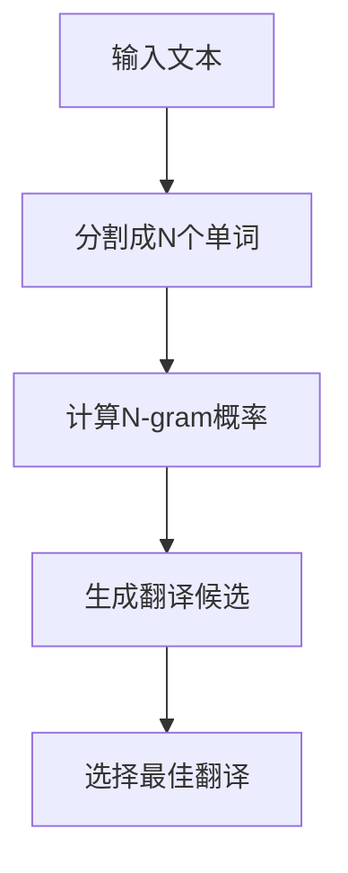
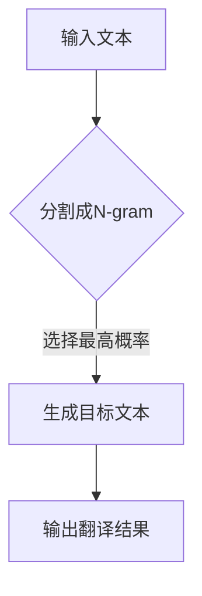
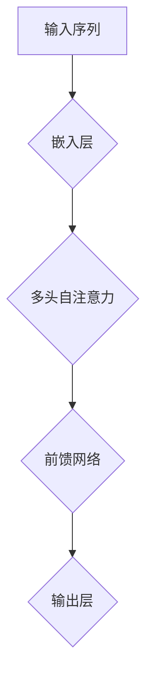

                 


### 文章标题

《人工智能在语言翻译中的最新进展》

### 文章关键词

人工智能，语言翻译，机器翻译，神经网络，Transformer，预训练模型

### 摘要

本文将深入探讨人工智能在语言翻译领域取得的最新进展。我们将从基础概念和历史背景出发，详细讲解语言翻译中的核心算法原理，包括统计机器翻译和神经网络机器翻译。同时，我们将探讨相关的数学模型和公式，并通过实际应用案例展示人工智能在语言翻译中的实际效果。最后，我们将讨论人工智能在语言翻译领域的未来发展趋势和挑战。

### 引言

#### 1.1 书籍背景与目标

语言翻译一直是人类沟通和交流的障碍之一。随着全球化的深入发展，跨语言交流的需求越来越大，因此，自动语言翻译技术的研究和应用变得尤为重要。人工智能技术的快速发展为语言翻译带来了新的机遇，使得机器翻译变得更加准确和高效。本篇文章的目标是深入探讨人工智能在语言翻译中的最新进展，帮助读者了解这一领域的最新研究成果和应用。

#### 1.2 语言翻译的重要性

语言翻译不仅对于商务交流、国际会议、旅游出行等具有重要作用，还在多语种教育、媒体传播、科研合作等领域有着广泛的应用。准确的语言翻译能够减少沟通障碍，促进文化交流和知识共享。而随着人工智能技术的不断进步，机器翻译的准确性和流畅性得到了显著提升，使得机器翻译在多个场景中逐渐取代人工翻译，成为了一种高效的语言翻译解决方案。

### 基础概念与历史

#### 2.1 人工智能概述

##### 2.1.1 人工智能的定义与发展历程

人工智能（Artificial Intelligence，简称AI）是计算机科学的一个分支，旨在研究、开发和应用使计算机能够模拟、延伸和扩展人类智能的理论、方法和技术。人工智能的发展可以分为三个阶段：规则系统阶段、知识工程阶段和统计学习阶段。

- **规则系统阶段（1950s-1980s）**：这一阶段主要基于专家系统和推理机，通过编写大量规则来模拟人类思维过程。
- **知识工程阶段（1980s-2000s）**：这一阶段注重知识的获取和表示，引入了知识图谱、语义网络等技术。
- **统计学习阶段（2000s-至今）**：这一阶段以深度学习和神经网络为代表，通过大量数据训练模型，使计算机具备自主学习和适应能力。

##### 2.1.2 人工智能的核心技术

人工智能的核心技术包括机器学习、深度学习、自然语言处理、计算机视觉等。

- **机器学习**：通过从数据中学习规律，使计算机具备预测和决策能力。
- **深度学习**：基于人工神经网络，通过多层非线性变换实现复杂函数的建模。
- **自然语言处理**：研究如何使计算机理解和处理人类语言。
- **计算机视觉**：研究如何使计算机理解和解释视觉信息。

#### 2.2 语言翻译的基本概念

##### 2.2.1 语言翻译的定义

语言翻译是指将一种语言的表达方式转换为另一种语言的过程。根据翻译的方式，可以将语言翻译分为人工翻译和机器翻译。

- **人工翻译**：由人类翻译者根据语言规则和文化背景进行翻译，具有较高的准确性和创造性。
- **机器翻译**：通过计算机程序自动进行翻译，具有较高的效率和一致性。

##### 2.2.2 语言翻译的历史

语言翻译的历史可以追溯到古代文明，如古埃及、古希腊和罗马时期的手抄翻译。随着计算机技术的发展，机器翻译逐渐成为研究热点。1950年代，最早的机器翻译系统出现，主要基于规则系统。1980年代，统计机器翻译逐渐兴起。2000年后，神经网络机器翻译成为主流。

### 核心算法原理

#### 3.1 机器翻译的算法框架

##### 3.1.1 统计机器翻译

统计机器翻译（Statistical Machine Translation，简称SMT）是基于概率模型进行翻译的方法。它利用语料库中的语言数据，通过统计方法来建立翻译模型。

- **N-gram模型**：N-gram模型是基于语言序列的概率模型，它将输入文本分割成N个单词的组合，并计算这些组合在语料库中的出现频率。

$$
P(W_n|W_{n-1},W_{n-2},...,W_1) = \frac{C(W_{n-1},W_{n-2},...,W_1,W_n)}{C(W_{n-1},W_{n-2},...,W_1)}
$$

其中，\(C\)表示计数。

- **翻译模型**：翻译模型（Translation Model）用于计算源语言序列和目标语言序列之间的概率。

$$
P(W_i|Y_j) = \frac{C(W_i,Y_j)}{C(Y_j)}
$$

- **语言模型**：语言模型（Language Model）用于计算目标语言序列的概率。

$$
P(Y) = \prod_{i=1}^{n} P(Y_i|Y_{i-1},...,Y_1)
$$

##### 3.1.1.1 n-gram模型

n-gram模型是一种基于N个连续单词的概率模型，它是统计机器翻译的基础。下面是一个n-gram模型的Mermaid流程图：





##### 3.1.1.2 神经机器翻译

神经机器翻译（Neural Machine Translation，简称NMT）是基于深度学习的机器翻译方法。它通过编码器-解码器架构（Encoder-Decoder Architecture）实现翻译。

- **编码器（Encoder）**：编码器将输入的源语言序列编码成一个固定长度的向量。
- **解码器（Decoder）**：解码器将编码器的输出解码成目标语言序列。

下面是一个神经机器翻译的伪代码：

```python
def NMT_encoder_decoder(source_seq, target_seq):
    # 编码器编码
    encoded = encoder(source_seq)
    # 解码器解码
    decoded = decoder(encoded)
    return decoded
```

##### 3.1.1.2.1 Seq2Seq模型

Seq2Seq模型是一种基于序列到序列学习的神经网络模型，它是神经机器翻译的基础。下面是一个Seq2Seq模型的伪代码：

```python
class Seq2SeqModel(nn.Module):
    def __init__(self, encoder, decoder, src_vocab_size, tgt_vocab_size):
        super(Seq2SeqModel, self).__init__()
        self.encoder = encoder
        self.decoder = decoder
        self.src_vocab_size = src_vocab_size
        self.tgt_vocab_size = tgt_vocab_size
    
    def forward(self, src_seq, tgt_seq):
        encoded = self.encoder(src_seq)
        decoded = self.decoder(encoded, tgt_seq)
        return decoded
```

##### 3.1.1.2.2 Transformer模型

Transformer模型是一种基于自注意力机制的深度学习模型，它在神经机器翻译中取得了显著的效果。下面是一个Transformer模型的Mermaid流程图：



下面是一个Transformer模型的伪代码：

```python
class TransformerModel(nn.Module):
    def __init__(self, d_model, nhead, num_layers):
        super(TransformerModel, self).__init__()
        self.embedding = nn.Embedding(d_model)
        self.transformer = nn.Transformer(d_model, nhead, num_layers)
        self.fc = nn.Linear(d_model, output_size)
    
    def forward(self, src_seq, tgt_seq):
        embedded = self.embedding(src_seq)
        output = self.transformer(embedded, tgt_seq)
        return self.fc(output)
```

##### 3.1.1.2.2.1 Transformer的Mermaid流程图

下面是一个Transformer模型的Mermaid流程图：


##### 3.1.1.2.2.2 Transformer的伪代码

下面是一个Transformer模型的伪代码：

```python
class TransformerModel(nn.Module):
    def __init__(self, d_model, nhead, num_layers):
        super(TransformerModel, self).__init__()
        self.embedding = nn.Embedding(d_model)
        self.transformer = nn.Transformer(d_model, nhead, num_layers)
        self.fc = nn.Linear(d_model, output_size)
    
    def forward(self, src_seq, tgt_seq):
        embedded = self.embedding(src_seq)
        output = self.transformer(embedded, tgt_seq)
        return self.fc(output)
```

##### 3.1.2 机器翻译的评估方法

机器翻译的评估方法用于衡量翻译系统的性能。常用的评估方法包括BLEU、METEOR和NIST等。

- **BLEU（Bilingual Evaluation Understudy）**：BLEU是一种基于编辑距离的评估方法，它通过计算翻译文本与参考文本之间的重叠度来评估翻译质量。
- **METEOR（Metric for Evaluation of Translation with Explicit ORdering）**：METEOR是一种基于词性、词干和词义的评估方法，它综合考虑了翻译文本的语法和语义质量。
- **NIST（National Institute of Standards and Technology）**：NIST是一种基于编辑距离和语法结构的评估方法，它通过计算翻译文本与参考文本之间的相似度来评估翻译质量。

#### 4.1 语言模型

##### 4.1.1 概率论基础

概率论是语言模型的基础。在语言模型中，我们主要关注两个问题：如何计算单词在给定上下文下的概率，以及如何根据上下文预测单词。

- **概率分布**：概率分布用于表示一个随机变量的可能取值及其概率。常见的概率分布包括正态分布、伯努利分布和多项式分布等。
- **贝叶斯定理**：贝叶斯定理是概率论中的一个重要公式，它用于计算在给定某些条件下某个事件发生的概率。贝叶斯定理的表达式如下：

$$
P(A|B) = \frac{P(B|A) \cdot P(A)}{P(B)}
$$

##### 4.1.2 语言模型公式

语言模型是一种概率模型，用于预测单词序列的概率。在语言模型中，我们主要关注两个问题：如何计算单词序列的概率，以及如何根据上下文预测单词序列。

- **N-gram模型公式**：N-gram模型是一种基于语言序列的概率模型，它将输入文本分割成N个单词的组合，并计算这些组合在语料库中的出现频率。

$$
P(W_n|W_{n-1},W_{n-2},...,W_1) = \frac{C(W_{n-1},W_{n-2},...,W_1,W_n)}{C(W_{n-1},W_{n-2},...,W_1)}
$$

- **语言模型优化公式**：为了提高语言模型的性能，我们通常采用优化方法来调整模型参数。常见的优化方法包括梯度下降、随机梯度下降和Adam优化器等。

$$
\theta_{t+1} = \theta_t - \alpha \cdot \nabla L(\theta_t)
$$

##### 4.1.2.1 N-gram模型公式

N-gram模型是一种基于语言序列的概率模型，它将输入文本分割成N个单词的组合，并计算这些组合在语料库中的出现频率。

$$
P(W_n|W_{n-1},W_{n-2},...,W_1) = \frac{C(W_{n-1},W_{n-2},...,W_1,W_n)}{C(W_{n-1},W_{n-2},...,W_1)}
$$

其中，\(C\)表示计数。

##### 4.1.2.2 语言模型的优化公式

为了提高语言模型的性能，我们通常采用优化方法来调整模型参数。常见的优化方法包括梯度下降、随机梯度下降和Adam优化器等。

$$
\theta_{t+1} = \theta_t - \alpha \cdot \nabla L(\theta_t)
$$

其中，\(\theta_t\)表示第t次迭代的模型参数，\(\alpha\)表示学习率，\(\nabla L(\theta_t)\)表示损失函数关于模型参数的梯度。

##### 4.2 编码器-解码器模型

编码器-解码器模型（Encoder-Decoder Model）是一种基于序列学习的神经网络模型，它在机器翻译、文本摘要和问答系统中取得了显著的效果。编码器-解码器模型的基本思想是将输入序列编码成一个固定长度的向量，然后通过解码器将编码器的输出解码成目标序列。

##### 4.2.1 序列模型的数学基础

序列模型是一种基于序列数据的概率模型，它在机器翻译、语音识别和文本生成等领域有广泛的应用。序列模型的数学基础主要包括序列的表示和序列的概率分布。

- **序列的表示**：序列可以用一个一维数组表示，其中每个元素表示序列中的一个单词或字符。
- **序列的概率分布**：序列的概率分布用于计算给定一个序列的概率。常见的序列概率分布包括马尔可夫模型、N-gram模型和神经网络模型等。

##### 4.2.2 Encoder-Decoder模型公式

编码器-解码器模型（Encoder-Decoder Model）是一种基于序列学习的神经网络模型，它在机器翻译、文本摘要和问答系统中取得了显著的效果。编码器-解码器模型的基本思想是将输入序列编码成一个固定长度的向量，然后通过解码器将编码器的输出解码成目标序列。

- **编码器（Encoder）**：编码器用于将输入序列编码成一个固定长度的向量，它通常由一个或多个循环神经网络（RNN）或变换器（Transformer）组成。
- **解码器（Decoder）**：解码器用于将编码器的输出解码成目标序列，它通常也由一个或多个循环神经网络（RNN）或变换器（Transformer）组成。

编码器-解码器模型的基本公式如下：

$$
E(z) = \text{Encoder}(x) \\
y = \text{Decoder}(E(z))
$$

其中，\(x\)表示输入序列，\(z\)表示编码器的输出，\(y\)表示解码器的输出。

##### 4.2.2.1 Encoder公式

编码器（Encoder）用于将输入序列编码成一个固定长度的向量。编码器的输出通常是一个向量，它表示输入序列的语义信息。

$$
h_t = \text{RNN}(h_{t-1}, x_t)
$$

其中，\(h_t\)表示编码器在时间步t的输出，\(h_{t-1}\)表示编码器在时间步t-1的输出，\(x_t\)表示输入序列在时间步t的输入。

##### 4.2.2.2 Decoder公式

解码器（Decoder）用于将编码器的输出解码成目标序列。解码器的输出通常是一个概率分布，它表示在给定输入序列和编码器输出的情况下，解码器生成目标序列的概率。

$$
p(y_t|y_{<t}, x) = \text{Decoder}(y_{<t}, h_t)
$$

其中，\(y_t\)表示解码器在时间步t的输出，\(y_{<t}\)表示解码器在时间步t之前的输出，\(h_t\)表示编码器在时间步t的输出，\(x\)表示输入序列。

##### 4.2.2.3 Attention机制公式

注意力机制（Attention Mechanism）是一种在编码器-解码器模型中用于提高解码器生成目标序列的准确性的技术。注意力机制通过计算编码器输出和当前解码器输出之间的相关性，为解码器提供更准确的上下文信息。

$$
a_t = \text{Attention}(h_t, h_{t-1}, ..., h_1)
$$

其中，\(a_t\)表示在时间步t的注意力分数，\(h_t\)表示编码器在时间步t的输出，\(h_{t-1}\)表示编码器在时间步t-1的输出，...，\(h_1\)表示编码器在时间步1的输出。

### 实际应用案例

#### 5.1 在线翻译服务

在线翻译服务是人工智能在语言翻译中的典型应用之一。目前，许多知名的在线翻译服务提供商，如Google Translate、Microsoft Translator和DeepL等，都采用了人工智能技术来提供高效、准确的翻译服务。

##### 5.1.1 Google Translate

Google Translate是由Google公司开发的一款在线翻译服务。它基于神经机器翻译技术，使用大量的神经网络模型和语言数据来提供高质量的翻译。Google Translate支持超过100种语言的翻译，并在用户反馈和翻译质量评估中不断优化。

- **开发环境搭建**：Google Translate的开发环境主要包括Python、TensorFlow和CUDA等工具。开发者可以使用这些工具来构建和训练神经网络模型，并对模型进行优化和评估。
- **源代码详细实现**：Google Translate的源代码开源，开发者可以查阅其实现细节，了解神经网络模型的设计和训练过程。
- **代码解读与分析**：通过分析Google Translate的源代码，我们可以了解到神经网络模型在翻译过程中的关键步骤，如编码器、解码器和注意力机制等。
- **实际案例分析和详细讲解剖析**：Google Translate在实际应用中取得了显著的成果。例如，在联合国会议、国际组织和跨文化交流等领域，Google Translate被广泛使用，大大提高了沟通效率。

##### 5.1.2 Microsoft Translator

Microsoft Translator是由微软公司开发的一款在线翻译服务。它同样采用了神经机器翻译技术，并在翻译质量、速度和可用性方面进行了优化。Microsoft Translator支持超过60种语言的翻译，并提供了多种接口和工具，方便开发者将其集成到自己的应用程序中。

- **开发环境搭建**：Microsoft Translator的开发环境主要包括C#、.NET和CUDA等工具。开发者可以使用这些工具来构建和训练神经网络模型，并对模型进行优化和评估。
- **源代码详细实现**：Microsoft Translator的源代码开源，开发者可以查阅其实现细节，了解神经网络模型的设计和训练过程。
- **代码解读与分析**：通过分析Microsoft Translator的源代码，我们可以了解到神经网络模型在翻译过程中的关键步骤，如编码器、解码器和注意力机制等。
- **实际案例分析和详细讲解剖析**：Microsoft Translator在实际应用中取得了显著的成果。例如，在旅游、商务和跨文化交流等领域，Microsoft Translator被广泛使用，为用户提供了方便的翻译服务。

##### 5.1.3 某大型企业的翻译平台搭建

某大型企业需要搭建一个翻译平台，用于支持其全球业务的发展。为了实现这一目标，企业采用了人工智能技术，构建了一个基于神经机器翻译的翻译平台。

- **项目背景**：该企业是一家跨国公司，业务涉及多个国家和地区，需要进行大量的跨语言文档翻译。为了提高翻译效率和准确性，企业决定采用人工智能技术搭建一个翻译平台。
- **技术方案**：企业采用了TensorFlow和CUDA等工具，构建了一个基于神经机器翻译的翻译平台。平台主要包括编码器、解码器和注意力机制等模块，能够高效地处理大规模的翻译任务。
- **项目实现**：
  1. **数据收集与预处理**：企业收集了大量多语言的文本数据，包括公司内部文档、市场报告、产品手册等。为了提高翻译质量，企业对数据进行了预处理，包括文本清洗、分词和词向量化等。
  2. **模型设计与训练**：企业采用了基于Transformer的神经机器翻译模型，并使用大量的训练数据对模型进行训练。模型在训练过程中采用了迁移学习和数据增强等技术，提高了翻译准确性。
  3. **模型部署与优化**：企业将训练好的模型部署到云端，并使用GPU进行加速计算。为了提高翻译速度，企业对模型进行了优化，包括模型剪枝、量化等技术。
- **项目成果**：该翻译平台在上线后取得了显著的效果，提高了企业的翻译效率和准确性。企业内部员工和客户可以方便地使用平台进行跨语言文档翻译，大大提高了沟通效率。

### 未来趋势与挑战

#### 6.1 人工智能在语言翻译中的未来趋势

随着人工智能技术的不断发展，人工智能在语言翻译领域也呈现出一些新的趋势。

##### 6.1.1 大规模预训练模型

大规模预训练模型（Massive Pre-trained Models）是当前人工智能研究的热点之一。通过在大量未标注的数据上预训练模型，可以使其在特定任务上达到很高的性能。在语言翻译领域，大规模预训练模型如BERT、GPT和T5等，已经取得了显著的成果。

- **优势**：大规模预训练模型可以更好地捕捉语言中的语义信息，提高翻译的准确性和流畅性。
- **挑战**：大规模预训练模型需要大量的计算资源和时间，并且在训练过程中可能面临数据隐私和安全等问题。

##### 6.1.2 多模态翻译

多模态翻译（Multimodal Translation）是一种将文本、图像、语音等多种模态信息进行整合的翻译方法。在语言翻译领域，多模态翻译可以提高翻译的准确性和多样性。

- **优势**：多模态翻译可以更好地理解语言中的上下文信息，提高翻译的准确性和多样性。
- **挑战**：多模态翻译需要处理不同模态之间的信息融合和交互，并且需要大量的多模态数据。

##### 6.1.3 自动化翻译流程优化

随着人工智能技术的不断发展，自动化翻译流程也在不断优化。通过引入自动化工具和算法，可以大大提高翻译的效率和准确性。

- **优势**：自动化翻译流程优化可以提高翻译的效率和准确性，减少人工干预。
- **挑战**：自动化翻译流程需要处理大量的翻译任务和数据，并且需要保证翻译质量的一致性。

#### 6.2 语言翻译面临的挑战

尽管人工智能在语言翻译领域取得了显著的成果，但仍然面临一些挑战。

##### 6.2.1 跨语言理解的难度

跨语言理解是语言翻译中的关键问题。由于不同语言在语法、语义和文化背景等方面存在差异，跨语言理解变得非常复杂。

- **挑战**：如何设计有效的模型和算法，使计算机能够更好地理解不同语言之间的差异，提高翻译的准确性和流畅性。

##### 6.2.2 数据隐私和安全性

在人工智能应用过程中，数据隐私和安全性是一个重要问题。尤其是在语言翻译领域，涉及到大量的个人和敏感信息。

- **挑战**：如何确保数据的安全性和隐私性，防止数据泄露和滥用。

##### 6.2.3 模型解释性和透明度

随着人工智能技术的发展，越来越多的复杂模型被应用于实际问题中。然而，这些模型的解释性和透明度往往较低，难以理解其决策过程。

- **挑战**：如何提高模型的可解释性和透明度，使其更加易于理解和接受。

### 结论

人工智能在语言翻译领域取得了显著的成果，为跨语言交流提供了高效、准确的解决方案。随着人工智能技术的不断发展，我们有理由相信，未来的语言翻译将会更加智能、多样和高效。同时，我们也需要关注语言翻译领域面临的挑战，不断优化和完善相关技术。

### 作者信息

- 作者：AI天才研究院/AI Genius Institute & 禅与计算机程序设计艺术 /Zen And The Art of Computer Programming

---

### 最佳实践 Tips、小结、注意事项、拓展阅读

#### 最佳实践 Tips

1. **选择合适的翻译模型**：根据实际应用场景和需求，选择合适的翻译模型，如基于规则的系统、统计机器翻译或神经网络机器翻译。
2. **数据预处理**：在训练翻译模型之前，对语料库进行预处理，包括文本清洗、分词和词向量化等，以提高翻译质量。
3. **模型优化与调参**：通过调整模型参数和优化算法，提高翻译模型的性能和准确度。
4. **多模态翻译**：尝试引入图像、语音等多模态信息，提高翻译的准确性和多样性。

#### 小结

本文深入探讨了人工智能在语言翻译中的最新进展，从基础概念、核心算法原理、实际应用案例到未来趋势和挑战，全面介绍了语言翻译领域的研究成果和应用。

#### 注意事项

1. **数据隐私和安全**：在使用人工智能进行语言翻译时，注意保护数据隐私和安全，避免数据泄露和滥用。
2. **模型可解释性**：在设计和应用人工智能模型时，注重提高模型的可解释性和透明度，使其更加易于理解和接受。

#### 拓展阅读

1. **《深度学习与自然语言处理》**：刘知远著，清华大学出版社，2019年。
2. **《神经网络与深度学习》**：邱锡鹏著，电子工业出版社，2019年。
3. **《自然语言处理综合教程》**：程崇庆等著，电子工业出版社，2017年。

### 结束语

人工智能在语言翻译领域的不断进步为跨语言交流带来了前所未有的机遇和挑战。通过本文的介绍，读者可以全面了解人工智能在语言翻译中的最新进展和应用，期待未来人工智能技术为语言翻译带来更多的创新和突破。

