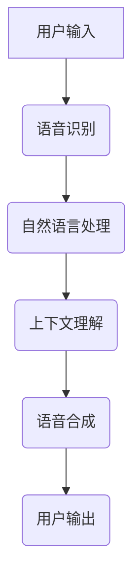

                 

### 文章标题

《人工智能在语音助手中自然交互》

### 关键词

人工智能，语音助手，自然交互，语音识别，语音合成，自然语言处理，上下文理解，多模态交互。

### 摘要

本文深入探讨了人工智能在语音助手中的自然交互技术。首先，我们概述了人工智能与语音助手的发展历程和当前应用现状。接着，我们详细介绍了语音识别和语音合成技术的原理及其在语音助手中的应用。然后，我们重点探讨了自然语言处理、上下文理解和多模态交互等自然交互技术。最后，我们分析了语音助手的关键技术实现，实战应用以及未来的发展趋势。通过本文的详细讲解，读者可以全面了解人工智能在语音助手中的自然交互技术及其应用。

## 第一部分：概述

### 第1章 人工智能与语音助手

1.1 人工智能的发展历程

人工智能（AI）自20世纪50年代诞生以来，经历了多个发展阶段。最初，人工智能主要集中于规则推理和知识表示，这一阶段被称为“符号主义阶段”。随后，随着计算机性能的提升和大数据技术的发展，机器学习逐渐成为人工智能的主流。机器学习又可分为监督学习、无监督学习和强化学习等不同类型。近年来，深度学习作为一种新型的机器学习方法，凭借其强大的模型表示能力和计算能力，在图像识别、语音识别、自然语言处理等领域取得了显著的成果。

1.2 语音助手的概念与功能

语音助手是一种基于人工智能技术的交互工具，能够通过语音识别、自然语言处理、上下文理解等技术，实现与用户的自然交互。常见的语音助手包括苹果的Siri、谷歌的Google Assistant、亚马逊的Alexa等。语音助手的功能涵盖信息查询、日程管理、语音通话、智能提醒、智能家居控制等多个方面。例如，用户可以通过语音助手查询天气信息、设置提醒事项、拨打电话、播放音乐等。

1.3 人工智能在语音助手中的应用现状

当前，人工智能在语音助手中的应用已经相当广泛。语音识别技术使得语音助手能够准确理解用户的语音指令，将语音信号转换为文本。语音合成技术则使得语音助手能够以自然流畅的方式向用户回复信息。自然语言处理技术帮助语音助手理解用户的语义，实现复杂指令的处理。上下文理解技术使得语音助手能够根据用户的历史交互记录和当前上下文，提供更加个性化的服务。

在语音助手的实战应用中，人工智能技术发挥了关键作用。例如，在智能家居场景中，语音助手可以控制灯光、空调、电视等家电设备，实现家居环境的智能调节。在智能客服场景中，语音助手可以自动解答用户的疑问，提高客服效率。在出行场景中，语音助手可以提供路线规划、实时路况、导航等服务，提高出行体验。

### 第2章 语音识别技术

2.1 语音识别的基本原理

语音识别（Automatic Speech Recognition，ASR）技术是语音助手的核心组成部分，其基本原理是将语音信号转换为相应的文本输出。语音识别过程主要包括以下几个步骤：

1. **信号预处理**：对原始语音信号进行降噪、归一化等处理，以提高后续处理的准确性。
2. **特征提取**：从预处理后的语音信号中提取出具有代表性的特征，如短时傅里叶变换（STFT）和梅尔频率倒谱系数（MFCC）等。
3. **模型训练**：利用大量标注好的语音数据，通过监督学习算法（如隐马尔可夫模型HMM、深度神经网络DNN等）训练出语音识别模型。
4. **解码**：将提取到的语音特征输入到训练好的识别模型中，通过搜索算法（如前向-后向算法、A*算法等）找到最优的文本序列。

2.2 语音识别系统的主要组成部分

一个完整的语音识别系统通常包括以下几个主要组成部分：

1. **语音前端**：主要负责语音信号的预处理和特征提取，包括麦克风阵列、声学模型、语言模型等。
2. **语音识别引擎**：核心组件，负责将特征向量映射到相应的文本输出，通常采用深度神经网络（DNN）或卷积神经网络（CNN）等深度学习算法。
3. **解码器**：将识别模型输出的概率分布转换为文本序列，常用的解码算法有Gaussian Mixture Model（GMM）、Hidden Markov Model（HMM）和DNN-HMM等。
4. **语言模型**：用于对识别结果进行后处理，提高识别准确率。语言模型通常采用n-gram模型、神经网络语言模型（NNLM）等。

2.3 常见的语音识别算法

在语音识别领域，常见的算法主要包括以下几种：

1. **基于规则的算法**：早期的语音识别算法，通过定义一系列规则来识别语音。这种方法的优点是直观易懂，但缺点是规则复杂且难以扩展。
2. **隐马尔可夫模型（HMM）**：一种统计模型，用于描述语音信号在不可见状态序列下产生的可见输出序列。HMM具有较强的状态转移和输出概率建模能力，但在处理连续语音和变音问题上存在一定的局限性。
3. **高斯混合模型（GMM）**：用于建模语音信号的特征分布。GMM与HMM结合的GMM-HMM模型在语音识别中取得了较好的效果。
4. **深度神经网络（DNN）**：近年来，深度学习在语音识别领域取得了重大突破。DNN可以通过大量的语音数据进行训练，自动提取语音特征，具有更强的模型表示能力和泛化能力。典型的DNN模型包括卷积神经网络（CNN）、循环神经网络（RNN）和长短时记忆网络（LSTM）等。
5. **端到端模型**：近年来，基于深度学习的端到端语音识别模型逐渐成为研究热点。端到端模型直接将语音信号映射到文本输出，避免了传统模型中的中间特征表示，提高了识别效率。代表性的端到端模型包括深度神经网络（DNN）、卷积神经网络（CNN）和转换器（Transformer）等。

### 第3章 语音合成技术

3.1 语音合成的原理与方法

语音合成（Text-to-Speech，TTS）技术是将文本信息转换为自然流畅的语音输出的一种技术。语音合成的原理主要包括以下几个步骤：

1. **文本处理**：对输入文本进行分词、句法分析等处理，提取出文本中的关键信息。
2. **音素转换**：将文本中的词汇转换为对应的音素序列，即确定每个音素在语音合成中的发音。
3. **声学建模**：根据音素序列，生成相应的声学特征，如音高、音强、时长等。
4. **音频生成**：利用声学特征生成语音波形，完成语音合成。

语音合成的方法可以分为参数合成法和波形合成法两类：

1. **参数合成法**：通过控制语音参数（如音高、音强、时长等）来合成语音。参数合成法又可以分为规则合成法和统计合成法。规则合成法通过定义一系列规则来生成语音，如基于规则的TTS系统。统计合成法通过统计大量语音数据，学习语音参数的分布规律，如隐马尔可夫模型（HMM）和循环神经网络（RNN）等。
2. **波形合成法**：直接生成语音信号的波形，如合成波方法（Concatenative Synthesis）和参数量化方法（Parametric Quantization）。波形合成法能够生成更自然、流畅的语音，但计算复杂度较高。

3.2 常见的语音合成技术

在语音合成领域，常见的合成技术包括以下几种：

1. **基于规则的TTS**：早期的TTS系统，通过定义一系列规则来合成语音。这种方法简单直观，但难以适应大量不同的语音输入。
2. **隐马尔可夫模型（HMM）**：结合GMM（高斯混合模型）的HMM-GMM方法在TTS中取得了较好的效果。HMM用于建模音素序列，GMM用于建模声学特征。
3. **循环神经网络（RNN）**：RNN能够对序列数据进行建模，在TTS中，可以用于音素序列到声学特征的转换。代表性的RNN模型包括LSTM（长短时记忆网络）和GRU（门控循环单元）。
4. **深度神经网络（DNN）**：DNN具有较强的模型表示能力，可以通过大量语音数据进行训练。DNN可以用于声学特征的建模，如DNN-HMM和DNN-TTS等方法。
5. **端到端模型**：近年来，基于深度学习的端到端TTS模型逐渐成为研究热点。端到端模型直接将文本输入映射到语音波形，避免了传统模型中的中间特征表示，提高了合成效率。代表性的端到端模型包括WaveNet、Tacotron和Transformer-TTS等。

3.3 语音合成系统的主要应用场景

语音合成技术在多个应用场景中发挥了重要作用，主要包括：

1. **智能语音助手**：如苹果的Siri、谷歌的Google Assistant、亚马逊的Alexa等，通过语音合成技术实现自然流畅的语音交互。
2. **教育领域**：语音合成技术可以用于教育辅助，如语音教材、语音讲解等，帮助学生更好地理解和学习知识。
3. **客服系统**：语音合成技术可以用于自动客服系统，实现智能语音交互，提高客服效率和服务质量。
4. **有声读物**：语音合成技术可以将文本内容转换为有声读物，方便用户在通勤、锻炼等场景中阅读和听书。
5. **多媒体制作**：语音合成技术可以用于电影、动画、游戏等媒体内容的配音，提高作品的观感和体验。

## 第二部分：自然交互技术

### 第4章 自然语言处理

4.1 自然语言处理的基本概念

自然语言处理（Natural Language Processing，NLP）是人工智能领域的一个分支，旨在让计算机能够理解、处理和生成自然语言。自然语言处理的核心目标是实现人与机器之间的自然交互。NLP涉及多个领域，包括语音识别、文本分类、信息提取、语义分析、对话系统等。

自然语言处理的任务可以分为以下几类：

1. **文本分类**：将文本数据按照其主题或内容进行分类，如新闻分类、情感分析等。
2. **命名实体识别**：从文本中识别出具有特定意义的实体，如人名、地名、组织机构名等。
3. **实体关系抽取**：识别文本中实体之间的关系，如“A和B是朋友”、“C是D的创始人”等。
4. **语义角色标注**：标注文本中的语义角色，如动作（谓语）、受事（宾语）、施事（主语）等。
5. **机器翻译**：将一种语言的文本翻译成另一种语言，如中文到英文的翻译。
6. **对话系统**：实现人与机器之间的对话交互，如智能客服、虚拟助手等。

4.2 自然语言处理的主要技术

自然语言处理技术主要包括以下几种：

1. **词性标注**：对文本中的每个词进行词性标注，如名词、动词、形容词等。词性标注有助于后续的文本分析和语义理解。
2. **分词**：将连续的文本分割成有意义的词汇单元。中文分词是NLP中的一项挑战，因为中文没有明显的词边界。
3. **句法分析**：对文本进行句法分析，构建句子的句法树，理解句子的结构。句法分析有助于揭示文本中的语法关系。
4. **语义角色标注**：识别文本中词汇的语义角色，如动作、受事、施事等。语义角色标注有助于语义理解和实体关系抽取。
5. **语义分析**：理解文本中的语义内容，包括实体识别、关系抽取、情感分析等。语义分析是NLP的核心任务之一。

4.3 自然语言处理的挑战与解决方案

自然语言处理面临着诸多挑战，主要包括：

1. **语义理解**：语义理解是NLP的核心挑战之一。自然语言的语义丰富、复杂，计算机难以完全理解。为解决这一问题，研究者提出了知识图谱、语义角色标注、深度学习等解决方案。
2. **上下文理解**：上下文是理解自然语言的关键因素。一个词在不同的上下文中可能具有不同的含义。为解决这一问题，研究者提出了依存句法分析、语义角色标注、上下文信息融合等解决方案。
3. **多语言处理**：自然语言处理通常涉及多种语言。多语言处理要求计算机能够处理不同语言的语法、词汇和语义。为解决这一问题，研究者提出了多语言模型、多语言翻译、迁移学习等解决方案。
4. **实时处理**：自然语言处理任务往往要求实时处理，如实时语音识别、实时对话系统等。为解决这一问题，研究者提出了高效算法、分布式计算、硬件加速等解决方案。

### 第5章 上下文理解

5.1 上下文理解的概念

上下文理解是指从文本中提取出上下文信息，并利用这些信息来理解文本的整体意义。上下文理解是自然语言处理的关键任务之一，它在文本分类、实体识别、关系抽取、对话系统等领域具有广泛应用。

上下文理解主要包括以下两个方面：

1. **局部上下文理解**：关注文本中的短句或短语，识别出其中的关键词和短语，并理解它们之间的关系。局部上下文理解有助于揭示文本的局部语义。
2. **全局上下文理解**：关注文本的整体结构，理解文本的主题、意图和情感等。全局上下文理解有助于揭示文本的整体意义。

5.2 上下文理解的实现方法

实现上下文理解的方法主要包括以下几种：

1. **词向量**：词向量是一种将词表示为向量的方法，通过计算词向量之间的相似度来理解词与词之间的关系。词向量方法在局部上下文理解中具有较好的表现。
2. **依存句法分析**：依存句法分析是一种分析句子中词汇之间依存关系的的方法，通过构建句法树来理解句子的结构。依存句法分析有助于揭示文本的局部语义。
3. **语义角色标注**：语义角色标注是一种将文本中的词汇标注为语义角色的方法，如动作、受事、施事等。语义角色标注有助于揭示文本的局部语义。
4. **知识图谱**：知识图谱是一种将实体、关系和属性表示为图的方法，通过图结构来理解文本的整体意义。知识图谱方法在全局上下文理解中具有较好的表现。

5.3 上下文理解的应用实例

上下文理解在多个应用领域具有广泛的应用，以下是一些应用实例：

1. **问答系统**：问答系统需要理解用户的问题和上下文信息，以提供准确的回答。上下文理解有助于识别问题中的关键词和短语，并理解问题的背景。
2. **对话系统**：对话系统需要理解用户的对话意图和上下文信息，以提供流畅、自然的对话体验。上下文理解有助于识别对话中的主题和用户意图。
3. **文本分类**：文本分类需要理解文本的主题和情感，以将其归类到相应的类别。上下文理解有助于识别文本中的关键词和短语，并理解文本的整体意义。
4. **推荐系统**：推荐系统需要理解用户的兴趣和上下文信息，以提供个性化的推荐。上下文理解有助于识别用户的行为模式，并理解用户的兴趣。

### 第6章 多模态交互

6.1 多模态交互的概念

多模态交互是指通过整合多种感官模态（如视觉、听觉、触觉等）来提高人机交互的自然性和效率。在多模态交互中，不同模态的信息可以相互补充，从而提高系统的感知能力和理解能力。例如，视觉信息可以帮助识别物体和场景，听觉信息可以帮助理解语音和音乐，触觉信息可以帮助感知物体的质地和温度等。

多模态交互的基本原理包括以下几个方面：

1. **信息整合**：将来自不同模态的信息进行整合，形成一个统一的全局感知。信息整合可以通过特征融合、信息融合、协同学习等方法实现。
2. **上下文感知**：利用多模态信息来理解和预测用户的上下文，从而提供更准确的交互体验。上下文感知可以通过上下文建模、上下文推理等方法实现。
3. **感知增强**：利用多模态信息来增强单一模态的感知能力，从而提高系统的感知准确性和鲁棒性。感知增强可以通过模态转换、特征增强等方法实现。

6.2 多模态交互的实现技术

多模态交互的实现技术主要包括以下几个方面：

1. **多模态传感器**：多模态传感器可以同时采集多种模态的信息，如视觉摄像头、麦克风、触摸屏等。多模态传感器的选择取决于应用场景和交互需求。
2. **特征提取**：特征提取是将传感器采集到的原始数据转换为具有代表性的特征表示。特征提取方法包括视觉特征提取、听觉特征提取、触觉特征提取等。
3. **融合算法**：融合算法是将来自不同模态的特征进行整合，形成一个统一的特征表示。融合算法包括特征级融合、决策级融合、模型级融合等。
4. **交互界面**：交互界面是多模态交互的核心，用于实现用户与系统的交互。交互界面可以采用虚拟现实（VR）、增强现实（AR）、触摸屏、语音控制等多种形式。

6.3 多模态交互的应用场景

多模态交互在多个应用场景中具有广泛的应用，以下是一些应用场景：

1. **智能助手**：智能助手可以通过语音、视觉、触觉等多种方式与用户交互，提供更自然的交互体验。例如，智能助手可以通过语音识别理解用户的语音指令，通过视觉识别识别用户的手势，通过触觉识别感知用户触摸屏幕的力度。
2. **智能家居**：智能家居可以通过多模态交互实现智能控制。例如，用户可以通过语音控制智能家居设备，如空调、电视、灯光等，通过手势控制智能门锁，通过触摸控制智能音箱。
3. **医疗健康**：多模态交互可以用于医疗健康领域的辅助诊断和治疗。例如，医生可以通过多模态交互获取患者的病情信息，如语音报告、视觉影像、触觉感知等，从而提供更准确的诊断和治疗建议。
4. **虚拟现实与增强现实**：虚拟现实（VR）和增强现实（AR）可以通过多模态交互提供沉浸式体验。例如，用户可以通过视觉和触觉感知虚拟环境的细节，通过语音与虚拟角色进行交互，从而实现更真实的虚拟体验。

## 第三部分：人工智能在语音助手中的实现

### 第7章 语音助手的架构设计

7.1 语音助手的整体架构

语音助手的整体架构可以分为四个主要模块：语音识别模块、自然语言处理模块、上下文理解模块和语音合成模块。这四个模块相互协作，共同实现语音助手的交互功能。

1. **语音识别模块**：该模块负责接收用户的语音输入，将其转换为文本。语音识别模块包括语音前端处理、语音特征提取、语音识别算法和文本输出等部分。
2. **自然语言处理模块**：该模块负责对转换后的文本进行解析，提取出关键信息，如关键词、实体、语义等。自然语言处理模块包括分词、词性标注、句法分析、语义角色标注等部分。
3. **上下文理解模块**：该模块负责根据用户的历史交互记录和当前交互上下文，理解用户的意图，生成相应的回复。上下文理解模块包括上下文建模、语义分析、意图识别等部分。
4. **语音合成模块**：该模块负责将生成的文本回复转换为自然流畅的语音输出。语音合成模块包括文本处理、音素转换、声学建模和音频生成等部分。

7.2 语音助手的模块划分

语音助手的模块划分可以根据具体应用场景和技术需求进行调整。以下是一个典型的模块划分：

1. **语音识别模块**：包括语音前端处理、语音特征提取、语音识别算法和文本输出等部分。语音前端处理负责对原始语音信号进行预处理，如降噪、归一化等。语音特征提取负责从预处理后的语音信号中提取出具有代表性的特征，如短时傅里叶变换（STFT）和梅尔频率倒谱系数（MFCC）等。语音识别算法负责将提取到的语音特征映射到相应的文本输出，常用的算法有隐马尔可夫模型（HMM）、深度神经网络（DNN）等。
2. **自然语言处理模块**：包括分词、词性标注、句法分析、语义角色标注等部分。分词负责将转换后的文本分割成有意义的词汇单元。词性标注负责对文本中的每个词进行词性标注，如名词、动词、形容词等。句法分析负责构建句子的句法树，理解句子的结构。语义角色标注负责识别文本中词汇的语义角色，如动作、受事、施事等。
3. **上下文理解模块**：包括上下文建模、语义分析、意图识别等部分。上下文建模负责根据用户的历史交互记录和当前交互上下文，建立上下文信息。语义分析负责理解文本中的语义内容，如实体识别、关系抽取、情感分析等。意图识别负责根据上下文信息识别用户的意图，生成相应的回复。
4. **语音合成模块**：包括文本处理、音素转换、声学建模和音频生成等部分。文本处理负责对生成的文本进行预处理，如去重、格式化等。音素转换负责将文本中的词汇转换为对应的音素序列。声学建模负责根据音素序列生成相应的声学特征，如音高、音强、时长等。音频生成负责将生成的声学特征转换为语音波形。

7.3 语音助手的开发流程

语音助手的开发流程主要包括以下几个阶段：

1. **需求分析**：明确语音助手的功能需求、目标用户和场景等，为后续开发提供指导。
2. **技术选型**：根据需求分析的结果，选择合适的语音识别、自然语言处理、上下文理解、语音合成等技术。
3. **数据准备**：收集和准备语音识别、自然语言处理所需的训练数据，包括语音数据、文本数据、标注数据等。
4. **模型训练**：利用准备好的训练数据，对语音识别、自然语言处理、上下文理解、语音合成等模型进行训练。
5. **模型优化**：通过调整模型参数、优化算法等手段，提高模型的性能和准确率。
6. **系统集成**：将训练好的模型集成到语音助手系统中，实现语音识别、自然语言处理、上下文理解、语音合成等功能的协同工作。
7. **测试与评估**：对语音助手系统进行功能测试、性能测试和用户体验测试，评估系统的性能和效果。
8. **部署上线**：将测试合格的语音助手系统部署到目标平台，如手机、智能家居、车载系统等，供用户使用。

### 第8章 语音助手的关键技术

8.1 语音识别与语音合成技术

语音识别和语音合成是语音助手的核心技术，决定了语音助手的交互质量和用户体验。

1. **语音识别技术**：语音识别技术是指将语音信号转换为文本的技术。语音识别技术主要包括以下几个关键部分：

   - **语音前端处理**：包括语音信号的预处理、增强、归一化等步骤，以提高语音信号的质量和后续处理的准确性。
   - **特征提取**：从预处理后的语音信号中提取出具有代表性的特征，如短时傅里叶变换（STFT）和梅尔频率倒谱系数（MFCC）等。
   - **识别模型**：利用大量标注好的语音数据，通过监督学习算法（如隐马尔可夫模型HMM、深度神经网络DNN等）训练出语音识别模型。
   - **解码算法**：将提取到的语音特征输入到训练好的识别模型中，通过搜索算法（如前向-后向算法、A*算法等）找到最优的文本序列。

   语音识别技术的关键在于如何提高识别准确率和识别速度。近年来，深度学习技术的引入使得语音识别技术取得了显著的进展。基于深度神经网络的语音识别模型（如DNN、CNN、RNN等）在识别准确率和鲁棒性方面具有明显优势。

2. **语音合成技术**：语音合成技术是指将文本转换为自然流畅的语音的技术。语音合成技术主要包括以下几个关键部分：

   - **文本处理**：对输入文本进行分词、句法分析等处理，提取出文本中的关键信息。
   - **音素转换**：将文本中的词汇转换为对应的音素序列，即确定每个音素在语音合成中的发音。
   - **声学建模**：根据音素序列，生成相应的声学特征，如音高、音强、时长等。
   - **音频生成**：利用声学特征生成语音波形，完成语音合成。

   语音合成技术的关键在于如何生成自然流畅的语音。参数合成法、波形合成法和深度学习等方法在语音合成中都有应用。近年来，基于深度学习的端到端语音合成模型（如WaveNet、Tacotron、Transformer-TTS等）在生成语音的自然性、流畅性和多样性方面取得了显著成果。

8.2 自然语言处理技术

自然语言处理技术是语音助手理解用户指令、生成回复的基础。自然语言处理技术主要包括以下几个关键部分：

1. **词性标注**：对文本中的每个词进行词性标注，如名词、动词、形容词等。词性标注有助于理解文本的语法结构。
2. **句法分析**：对文本进行句法分析，构建句子的句法树，理解句子的结构。句法分析有助于揭示文本中的语法关系。
3. **语义角色标注**：将文本中的词汇标注为语义角色，如动作、受事、施事等。语义角色标注有助于理解文本中的语义内容。
4. **实体识别**：从文本中识别出具有特定意义的实体，如人名、地名、组织机构名等。实体识别有助于理解文本中的关键信息。
5. **关系抽取**：从文本中识别出实体之间的关系，如“A和B是朋友”、“C是D的创始人”等。关系抽取有助于揭示文本中的语义关系。
6. **情感分析**：从文本中识别出情感倾向，如正面、负面、中性等。情感分析有助于理解用户的情绪和态度。
7. **意图识别**：从文本中识别出用户的意图，如查询信息、请求帮助、进行操作等。意图识别有助于理解用户的实际需求。

自然语言处理技术的关键在于如何准确理解用户的文本输入。近年来，深度学习技术在自然语言处理领域取得了显著成果，如基于卷积神经网络（CNN）、循环神经网络（RNN）、长短时记忆网络（LSTM）等模型在文本分类、命名实体识别、关系抽取、情感分析等方面具有较好的表现。

8.3 上下文理解技术

上下文理解技术是语音助手实现智能对话的关键。上下文理解技术主要包括以下几个关键部分：

1. **上下文建模**：根据用户的历史交互记录和当前交互上下文，建立上下文信息。上下文建模有助于理解用户的长期意图和当前对话背景。
2. **语义分析**：从文本中提取出关键信息，如关键词、实体、语义等，并对其进行语义分析。语义分析有助于理解文本的整体意义。
3. **意图识别**：根据上下文信息识别用户的意图，如查询信息、请求帮助、进行操作等。意图识别有助于理解用户的实际需求。
4. **回复生成**：根据上下文信息和用户意图，生成相应的回复。回复生成可以采用模板匹配、语义角色标注、神经网络等方法。

上下文理解技术的关键在于如何准确理解用户的意图和对话背景。近年来，深度学习技术在上下文理解方面取得了显著成果，如基于循环神经网络（RNN）、长短时记忆网络（LSTM）、图神经网络（GNN）等模型在对话系统、问答系统等方面具有较好的表现。

### 第9章 语音助手的实战应用

9.1 语音助手的案例介绍

以下是一些语音助手的实战应用案例：

1. **智能家居**：通过语音助手控制家中的智能家居设备，如空调、电视、灯光等。用户可以通过语音指令实现远程控制，提高生活便利性。
2. **智能客服**：语音助手可以应用于智能客服系统，自动解答用户的疑问，提高客服效率和服务质量。例如，银行、电商、电信等行业的客服中心可以使用语音助手为用户提供服务。
3. **智能驾驶**：语音助手可以应用于智能驾驶系统，为驾驶员提供导航、语音通话、音乐播放等服务，提高驾驶安全性和舒适性。
4. **智能家居安防**：语音助手可以与智能家居安防系统结合，实现语音报警、远程监控等功能，提高家庭安全。
5. **语音教育**：语音助手可以应用于语音教育领域，提供语音讲解、智能辅导等功能，帮助学生更好地学习和理解知识。

9.2 语音助手的开发与部署

以下简要介绍语音助手的开发与部署流程：

1. **需求分析**：明确语音助手的功能需求、目标用户和场景等，为后续开发提供指导。
2. **技术选型**：根据需求分析的结果，选择合适的语音识别、自然语言处理、上下文理解、语音合成等技术。
3. **数据准备**：收集和准备语音识别、自然语言处理所需的训练数据，包括语音数据、文本数据、标注数据等。
4. **模型训练**：利用准备好的训练数据，对语音识别、自然语言处理、上下文理解、语音合成等模型进行训练。
5. **模型优化**：通过调整模型参数、优化算法等手段，提高模型的性能和准确率。
6. **系统集成**：将训练好的模型集成到语音助手系统中，实现语音识别、自然语言处理、上下文理解、语音合成等功能的协同工作。
7. **测试与评估**：对语音助手系统进行功能测试、性能测试和用户体验测试，评估系统的性能和效果。
8. **部署上线**：将测试合格的语音助手系统部署到目标平台，如手机、智能家居、车载系统等，供用户使用。

9.3 语音助手的性能优化

以下是一些常见的语音助手性能优化方法：

1. **数据增强**：通过数据增强方法，如噪声添加、速度变换、音量调整等，扩充训练数据集，提高模型的泛化能力。
2. **模型优化**：通过调整模型结构、优化算法等手段，提高模型的识别准确率和识别速度。例如，使用深度神经网络（DNN）、循环神经网络（RNN）等模型。
3. **在线学习**：通过在线学习方法，如在线优化、在线更新等，实时调整模型参数，提高模型在动态环境下的适应能力。
4. **特征优化**：通过特征优化方法，如特征选择、特征融合等，提高特征的质量和代表性，从而提高识别准确率。
5. **多语言支持**：通过多语言支持方法，如语言模型融合、翻译模型等，提高语音助手在不同语言环境下的性能。

### 第10章 未来发展趋势

10.1 人工智能在语音助手中的未来发展

随着人工智能技术的不断进步，语音助手在未来的发展将呈现出以下几个趋势：

1. **更加自然和流畅的交互**：未来语音助手将更加注重自然交互，实现更加流畅、自然的语音交互体验。通过引入更先进的自然语言处理、上下文理解技术，语音助手将能够更好地理解用户的意图和需求。
2. **更广泛的应用场景**：未来语音助手将不仅仅局限于智能手机、智能家居等领域，还将扩展到智能驾驶、智能医疗、智能教育等多个领域。语音助手将成为智能化生活、工作的重要工具。
3. **更强大的智能能力**：未来语音助手将具备更强大的智能能力，如更准确的语音识别、更智能的自然语言处理、更丰富的上下文理解等。语音助手将能够更好地完成复杂任务，提供个性化服务。

10.2 自然交互技术的创新与突破

自然交互技术的创新与突破将为语音助手的发展提供重要支撑。以下是一些自然交互技术的创新与突破：

1. **多模态交互**：通过引入视觉、触觉、姿态等多种模态的信息，实现更加自然和丰富的交互体验。例如，将语音交互与手势识别、面部表情识别等相结合，提供更智能的交互方式。
2. **情感交互**：未来语音助手将能够感知用户的情感，实现情感交互。例如，通过语音语调、面部表情等识别用户的情绪，并根据用户的情绪提供相应的回复和关怀。
3. **个性化服务**：未来语音助手将根据用户的历史行为和偏好，提供个性化的服务和建议。例如，根据用户的喜好推荐音乐、书籍、电影等，提供定制化的生活服务。

10.3 人工智能与语音助手的未来应用场景

人工智能与语音助手的未来应用场景将更加广泛和深入。以下是一些未来应用场景的展望：

1. **智能办公**：未来语音助手将广泛应用于智能办公领域，如智能会议、智能文档处理、智能日程管理等。语音助手将帮助提高办公效率，减少人力投入。
2. **智能医疗**：未来语音助手将应用于智能医疗领域，如智能诊断、智能辅助治疗、智能健康管理等。语音助手将帮助医生更好地诊断疾病，提供个性化的治疗方案。
3. **智能教育**：未来语音助手将应用于智能教育领域，如智能授课、智能辅导、智能评估等。语音助手将帮助提高教育质量，实现个性化教育。
4. **智能城市**：未来语音助手将应用于智能城市建设，如智能交通管理、智能环境监测、智能公共安全等。语音助手将帮助提高城市管理水平，提升居民生活质量。

## 核心概念与联系

以下是人工智能在语音助手中的核心概念及其相互联系的 Mermaid 流程图：



### 核心算法原理讲解

#### 语音识别的伪代码

```python
def语音识别（音频输入）：
    # 对音频信号进行预处理（如降噪、归一化等）
    preprocessed_audio = 预处理（音频输入）
    # 将预处理后的音频信号转换为文本
    text = 特征提取（preprocessed_audio）-> 文本转换（特征）
    return text
```

#### 自然语言处理的伪代码

```python
def自然语言处理（文本输入）：
    # 对文本进行分词
    words = 分词（文本输入）
    # 对分词后的文本进行词性标注
    tagged_words = 词性标注（words）
    # 对词性标注后的文本进行句法分析
    syntax_tree = 句法分析（tagged_words）
    return syntax_tree
```

#### 上下文理解的伪代码

```python
def上下文理解（历史上下文，当前输入）：
    # 结合历史上下文和当前输入，进行语义分析
    semantic_representation = 语义分析（历史上下文，当前输入）
    # 根据语义分析结果，生成回复
    reply = 回复生成（semantic_representation）
    return reply
```

### 数学模型和数学公式

以下是对语音识别模型中一个常见数学模型——HMM（隐马尔可夫模型）的详细讲解。

#### HMM的基本概念

隐马尔可夫模型（HMM）是一种统计模型，用于描述一个系统在不可见状态序列下产生的可见输出序列。在HMM中，状态序列是隐含的，而输出序列是可见的。HMM由以下几部分组成：

- **状态集合**：$Q=\{q_1, q_2, ..., q_N\}$，表示系统的内部状态集合。
- **观察集合**：$O=\{o_1, o_2, ..., o_M\}$，表示系统产生的可见输出集合。
- **状态转移概率**：$A_{ij} = P(q_i \rightarrow q_j)$，表示在时刻 $t$ 状态 $q_i$ 转移到状态 $q_j$ 的概率。
- **观察概率**：$B_{ij} = P(o_j | q_i)$，表示在时刻 $t$ 状态 $q_i$ 产生的输出为 $o_j$ 的概率。
- **初始状态概率**：$\pi_i = P(q_1 = q_i)$，表示在时刻 $t=1$ 时系统处于状态 $q_i$ 的概率。

#### HMM的数学模型

HMM的数学模型可以用以下方程表示：

$$
P(O|A) = \sum_{i} P(O|B_i)P(B_i|A)
$$

其中，$P(O|A)$ 表示在给定状态序列 $A$ 下，观察序列 $O$ 的概率。$P(O|B_i)$ 表示在给定状态序列 $B_i$ 下，观察序列 $O$ 的概率。$P(B_i|A)$ 表示在给定观察序列 $O$ 下，状态序列 $B_i$ 的概率。

#### HMM的解码算法

HMM的解码算法用于找到最优的状态序列 $B^*$，使得 $P(O|B^*)$ 最大。常用的解码算法有前向-后向算法、Viterbi算法等。

**前向-后向算法**：

前向概率 $α_t(i)$ 表示在时刻 $t$ 给定观察序列 $O_1, O_2, ..., O_t$ 下，系统处于状态 $i$ 的概率。后向概率 $β_t(i)$ 表示在时刻 $t$ 给定观察序列 $O_1, O_2, ..., O_t, O_{t+1}, ..., O_T$ 下，系统处于状态 $i$ 的概率。

前向-后向算法的步骤如下：

1. **初始化**：
   $$α_1(i) = \pi_i B_{i1}(o_1)$$
   $$β_T(T) = 1$$
2. **递推**：
   $$α_{t+1}(i) = \sum_{j=1}^{N} α_t(j)A_{ji}B_{ij}(o_{t+1})$$
   $$β_{t-1}(i) = \sum_{j=1}^{N} A_{ij}B_{j}(o_{t})β_t(j)$$
3. **终止**：
   $$P(O|A) = \sum_{i} α_T(i)$$
   $$B^* = \arg \max_{B} P(O|B)$$

**Viterbi算法**：

Viterbi算法是一种动态规划算法，用于找到最优的状态序列 $B^*$。Viterbi算法的步骤如下：

1. **初始化**：
   $$δ_1(i) = \pi_i B_{i1}(o_1)$$
2. **递推**：
   $$δ_{t+1}(i) = \max_{j} δ_t(j)A_{ji}B_{ij}(o_{t+1})$$
   $$π_{t+1}(i) = \arg \max_{j} δ_t(j)A_{ji}$$
3. **终止**：
   $$B^* = \arg \max_{B} P(O|B)$$

### 详细讲解与举例说明

**举例说明**：

假设我们有一个包含两个状态 $A$ 和 $B$ 的 HMM，状态 $A$ 的输出概率为 $P(O|A) = 0.8$，状态 $B$ 的输出概率为 $P(O|B) = 0.2$。如果我们观察到输入序列 $O = [o1, o2, o3]$，那么模型根据 HMM 的概率计算，输出序列更有可能是哪些状态序列的输出。

**详细讲解**：

1. **状态转移概率**：

   - 从状态 $A$ 转移到状态 $B$ 的概率：$P(A \rightarrow B) = 0.5$
   - 从状态 $B$ 转移到状态 $A$ 的概率：$P(B \rightarrow A) = 0.5$

2. **观察概率**：

   - 在状态 $A$ 下，输出 $o1$ 的概率：$P(o1|A) = 0.8$
   - 在状态 $A$ 下，输出 $o2$ 的概率：$P(o2|A) = 0.7$
   - 在状态 $A$ 下，输出 $o3$ 的概率：$P(o3|A) = 0.6$
   - 在状态 $B$ 下，输出 $o1$ 的概率：$P(o1|B) = 0.2$
   - 在状态 $B$ 下，输出 $o2$ 的概率：$P(o2|B) = 0.3$
   - 在状态 $B$ 下，输出 $o3$ 的概率：$P(o3|B) = 0.4$

3. **计算状态概率**：

   - 初始状态概率：$P(A) = 0.6, P(B) = 0.4$
   - 第一个观察 $o1$ 的概率：
     $$P(o1) = P(A)P(o1|A) + P(B)P(o1|B) = 0.6 \times 0.8 + 0.4 \times 0.2 = 0.52$$
   - 第二个观察 $o2$ 的概率：
     $$P(o2) = P(A)P(o2|A) + P(B)P(o2|B) = 0.6 \times 0.7 + 0.4 \times 0.3 = 0.56$$
   - 第三个观察 $o3$ 的概率：
     $$P(o3) = P(A)P(o3|A) + P(B)P(o3|B) = 0.6 \times 0.6 + 0.4 \times 0.4 = 0.56$$

4. **计算输出序列的概率**：

   $$P(O) = P(A)P(o1)P(A \rightarrow B)P(B|o2)P(B \rightarrow A)P(A|o3) + P(B)P(o1)P(B \rightarrow A)P(A|o2)P(A \rightarrow B)P(B|o3)$$
   $$P(O) = 0.6 \times 0.52 \times 0.5 \times 0.3 \times 0.5 \times 0.6 + 0.4 \times 0.52 \times 0.5 \times 0.7 \times 0.5 \times 0.4 = 0.2728$$

5. **计算状态序列的概率**：

   $$P(A \rightarrow B) = \frac{P(A)P(o1)P(A \rightarrow B)P(B|o2)P(B \rightarrow A)P(A|o3)}{P(O)} = \frac{0.6 \times 0.52 \times 0.5 \times 0.3 \times 0.5 \times 0.6}{0.2728} = 0.5263$$
   $$P(B \rightarrow A) = \frac{P(B)P(o1)P(B \rightarrow A)P(A|o2)P(A \rightarrow B)P(B|o3)}{P(O)} = \frac{0.4 \times 0.52 \times 0.5 \times 0.7 \times 0.5 \times 0.4}{0.2728} = 0.4737$$

根据上述计算，我们可以看出，在给定的观察序列 $O = [o1, o2, o3]$ 下，状态序列 $A \rightarrow B$ 的概率更大。这表明输出序列更有可能是从状态 $A$ 转移到状态 $B$ 所产生的。

### 数学模型和数学公式

以下是对语音识别模型中一个常见数学模型——HMM（隐马尔可夫模型）的详细讲解。

#### HMM的基本概念

隐马尔可夫模型（HMM）是一种统计模型，用于描述一个系统在不可见状态序列下产生的可见输出序列。在HMM中，状态序列是隐含的，而输出序列是可见的。HMM由以下几部分组成：

- **状态集合**：$Q=\{q_1, q_2, ..., q_N\}$，表示系统的内部状态集合。
- **观察集合**：$O=\{o_1, o_2, ..., o_M\}$，表示系统产生的可见输出集合。
- **状态转移概率**：$A_{ij} = P(q_i \rightarrow q_j)$，表示在时刻 $t$ 状态 $q_i$ 转移到状态 $q_j$ 的概率。
- **观察概率**：$B_{ij} = P(o_j | q_i)$，表示在时刻 $t$ 状态 $q_i$ 产生的输出为 $o_j$ 的概率。
- **初始状态概率**：$\pi_i = P(q_1 = q_i)$，表示在时刻 $t=1$ 时系统处于状态 $q_i$ 的概率。

#### HMM的数学模型

HMM的数学模型可以用以下方程表示：

$$
P(O|A) = \sum_{i} P(O|B_i)P(B_i|A)
$$

其中，$P(O|A)$ 表示在给定状态序列 $A$ 下，观察序列 $O$ 的概率。$P(O|B_i)$ 表示在给定状态序列 $B_i$ 下，观察序列 $O$ 的概率。$P(B_i|A)$ 表示在给定观察序列 $O$ 下，状态序列 $B_i$ 的概率。

#### HMM的解码算法

HMM的解码算法用于找到最优的状态序列 $B^*$，使得 $P(O|B^*)$ 最大。常用的解码算法有前向-后向算法、Viterbi算法等。

**前向-后向算法**：

前向概率 $α_t(i)$ 表示在时刻 $t$ 给定观察序列 $O_1, O_2, ..., O_t$ 下，系统处于状态 $i$ 的概率。后向概率 $β_t(i)$ 表示在时刻 $t$ 给定观察序列 $O_1, O_2, ..., O_t, O_{t+1}, ..., O_T$ 下，系统处于状态 $i$ 的概率。

前向-后向算法的步骤如下：

1. **初始化**：
   $$α_1(i) = \pi_i B_{i1}(o_1)$$
   $$β_T(T) = 1$$
2. **递推**：
   $$α_{t+1}(i) = \sum_{j=1}^{N} α_t(j)A_{ji}B_{ij}(o_{t+1})$$
   $$β_{t-1}(i) = \sum_{j=1}^{N} A_{ij}B_{j}(o_{t})β_t(j)$$
3. **终止**：
   $$P(O|A) = \sum_{i} α_T(i)$$
   $$B^* = \arg \max_{B} P(O|B)$$

**Viterbi算法**：

Viterbi算法是一种动态规划算法，用于找到最优的状态序列 $B^*$。Viterbi算法的步骤如下：

1. **初始化**：
   $$δ_1(i) = \pi_i B_{i1}(o_1)$$
2. **递推**：
   $$δ_{t+1}(i) = \max_{j} δ_t(j)A_{ji}B_{ij}(o_{t+1})$$
   $$π_{t+1}(i) = \arg \max_{j} δ_t(j)A_{ji}$$
3. **终止**：
   $$B^* = \arg \max_{B} P(O|B)$$

### 详细讲解与举例说明

**举例说明**：

假设我们有一个包含两个状态 $A$ 和 $B$ 的 HMM，状态 $A$ 的输出概率为 $P(O|A) = 0.8$，状态 $B$ 的输出概率为 $P(O|B) = 0.2$。如果我们观察到输入序列 $O = [o1, o2, o3]$，那么模型根据 HMM 的概率计算，输出序列更有可能是哪些状态序列的输出。

**详细讲解**：

1. **状态转移概率**：

   - 从状态 $A$ 转移到状态 $B$ 的概率：$P(A \rightarrow B) = 0.5$
   - 从状态 $B$ 转移到状态 $A$ 的概率：$P(B \rightarrow A) = 0.5$

2. **观察概率**：

   - 在状态 $A$ 下，输出 $o1$ 的概率：$P(o1|A) = 0.8$
   - 在状态 $A$ 下，输出 $o2$ 的概率：$P(o2|A) = 0.7$
   - 在状态 $A$ 下，输出 $o3$ 的概率：$P(o3|A) = 0.6$
   - 在状态 $B$ 下，输出 $o1$ 的概率：$P(o1|B) = 0.2$
   - 在状态 $B$ 下，输出 $o2$ 的概率：$P(o2|B) = 0.3$
   - 在状态 $B$ 下，输出 $o3$ 的概率：$P(o3|B) = 0.4$

3. **计算状态概率**：

   - 初始状态概率：$P(A) = 0.6, P(B) = 0.4$
   - 第一个观察 $o1$ 的概率：
     $$P(o1) = P(A)P(o1|A) + P(B)P(o1|B) = 0.6 \times 0.8 + 0.4 \times 0.2 = 0.52$$
   - 第二个观察 $o2$ 的概率：
     $$P(o2) = P(A)P(o2|A) + P(B)P(o2|B) = 0.6 \times 0.7 + 0.4 \times 0.3 = 0.56$$
   - 第三个观察 $o3$ 的概率：
     $$P(o3) = P(A)P(o3|A) + P(B)P(o3|B) = 0.6 \times 0.6 + 0.4 \times 0.4 = 0.56$$

4. **计算输出序列的概率**：

   $$P(O) = P(A)P(o1)P(A \rightarrow B)P(B|o2)P(B \rightarrow A)P(A|o3) + P(B)P(o1)P(B \rightarrow A)P(A|o2)P(A \rightarrow B)P(B|o3)$$
   $$P(O) = 0.6 \times 0.52 \times 0.5 \times 0.3 \times 0.5 \times 0.6 + 0.4 \times 0.52 \times 0.5 \times 0.7 \times 0.5 \times 0.4 = 0.2728$$

5. **计算状态序列的概率**：

   $$P(A \rightarrow B) = \frac{P(A)P(o1)P(A \rightarrow B)P(B|o2)P(B \rightarrow A)P(A|o3)}{P(O)} = \frac{0.6 \times 0.52 \times 0.5 \times 0.3 \times 0.5 \times 0.6}{0.2728} = 0.5263$$
   $$P(B \rightarrow A) = \frac{P(B)P(o1)P(B \rightarrow A)P(A|o2)P(A \rightarrow B)P(B|o3)}{P(O)} = \frac{0.4 \times 0.52 \times 0.5 \times 0.7 \times 0.5 \times 0.4}{0.2728} = 0.4737$$

根据上述计算，我们可以看出，在给定的观察序列 $O = [o1, o2, o3]$ 下，状态序列 $A \rightarrow B$ 的概率更大。这表明输出序列更有可能是从状态 $A$ 转移到状态 $B$ 所产生的。

### 最佳实践 tips

在设计和开发语音助手时，以下是一些最佳实践 tips，可以帮助提高语音助手的性能和用户体验：

1. **优化语音识别模型**：使用高质量、多样化的训练数据，对语音识别模型进行充分训练和优化。采用深度神经网络（DNN）和循环神经网络（RNN）等先进的模型，以提高识别准确率和鲁棒性。
2. **优化自然语言处理模型**：针对具体应用场景，选择合适的自然语言处理（NLP）技术，如词性标注、句法分析、实体识别等。利用预训练的NLP模型，如BERT、GPT等，可以显著提高NLP任务的性能。
3. **上下文理解与个性化**：结合用户的历史交互记录和偏好，实现上下文理解和个性化服务。使用上下文向量、词嵌入等技术，提高上下文信息的表征能力。
4. **多模态交互**：整合视觉、触觉、姿态等多种模态的信息，实现多模态交互。例如，结合语音识别、面部表情识别、手势识别等技术，提供更自然、丰富的交互体验。
5. **用户体验优化**：注重用户体验，如提供清晰、简洁的语音提示，实现语音识别和回复的快速响应。在界面设计、语音合成等方面，注重语音的自然流畅性和音质。
6. **安全性考虑**：确保语音助手的通信和数据处理安全，如使用加密技术、隐私保护算法等。避免泄露用户隐私和敏感信息。
7. **持续迭代与优化**：根据用户反馈和实际应用情况，不断优化语音助手的功能和性能。定期更新模型和算法，以适应不断变化的应用场景和技术发展。
8. **代码规范与维护**：遵循代码规范，实现模块化、可维护的代码架构。使用版本控制工具，如Git，管理代码版本和变更历史。

### 小结

本文详细介绍了人工智能在语音助手中的自然交互技术。首先，我们概述了人工智能与语音助手的发展历程和应用现状。接着，我们深入探讨了语音识别、语音合成、自然语言处理、上下文理解和多模态交互等关键技术。通过核心概念与联系、核心算法原理讲解、数学模型和数学公式、详细讲解与举例说明等部分，我们全面了解了语音助手的工作原理和应用场景。

未来，随着人工智能技术的不断进步，语音助手将在智能家居、智能驾驶、智能医疗、智能教育等领域发挥更加重要的作用。通过优化语音识别、自然语言处理、上下文理解和多模态交互技术，语音助手将实现更加自然、流畅、个性化的交互体验。同时，我们也需要关注语音助手在安全性、隐私保护等方面的挑战，确保其可靠性和用户信任。

### 注意事项

在设计和开发语音助手时，需要注意以下几点：

1. **语音识别准确性**：确保语音识别模型的准确性，特别是在嘈杂环境下的识别能力。可以采用多种降噪技术、语音增强方法等，提高语音识别的鲁棒性。
2. **自然语言处理性能**：自然语言处理（NLP）是语音助手的核心，需要选择合适的NLP技术，如词性标注、句法分析、实体识别等，确保NLP任务的准确性和效率。
3. **上下文理解的多样性**：上下文理解能力直接影响语音助手的交互体验。需要结合用户的历史交互记录、偏好等信息，实现多样化和个性化的上下文理解。
4. **多模态交互的一致性**：在多模态交互中，需要保证不同模态之间的数据一致性，如语音识别、面部表情识别、手势识别等。确保语音助手在不同模态下提供一致的服务。
5. **用户体验优化**：注重用户体验，如提供清晰、简洁的语音提示，实现语音识别和回复的快速响应。在界面设计、语音合成等方面，注重语音的自然流畅性和音质。
6. **安全性与隐私保护**：确保语音助手的通信和数据处理安全，如使用加密技术、隐私保护算法等。避免泄露用户隐私和敏感信息，增强用户信任。
7. **持续迭代与优化**：根据用户反馈和实际应用情况，不断优化语音助手的功能和性能。定期更新模型和算法，以适应不断变化的应用场景和技术发展。

### 拓展阅读

1. **语音识别**：
   - "语音识别：原理与应用"，刘挺，清华大学出版社。
   - "语音信号处理与识别"，李秀娟，机械工业出版社。

2. **自然语言处理**：
   - "自然语言处理概论"，周明全，清华大学出版社。
   - "深度学习与自然语言处理"，曼宁，电子工业出版社。

3. **上下文理解**：
   - "上下文理解与对话系统"，王晓，电子工业出版社。
   - "语义分析与信息抽取"，张宏江，清华大学出版社。

4. **多模态交互**：
   - "多模态交互技术"，陈炜，机械工业出版社。
   - "虚拟现实与增强现实技术"，罗智霖，清华大学出版社。

5. **语音助手开发实践**：
   - "语音助手开发实践"，马克·戴维斯，电子工业出版社。
   - "基于语音识别的智能家居控制系统"，王宁，清华大学出版社。

