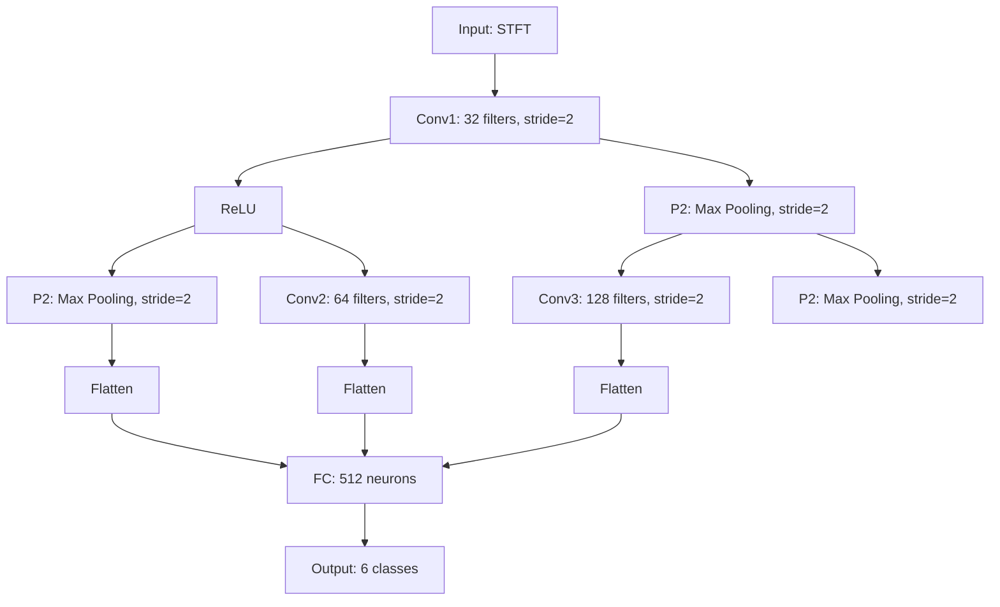
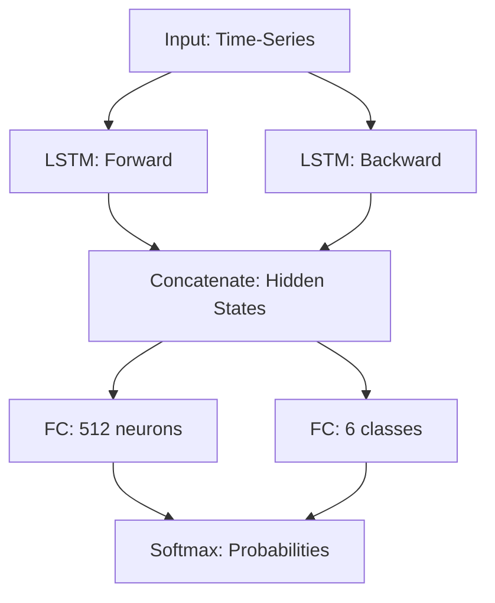
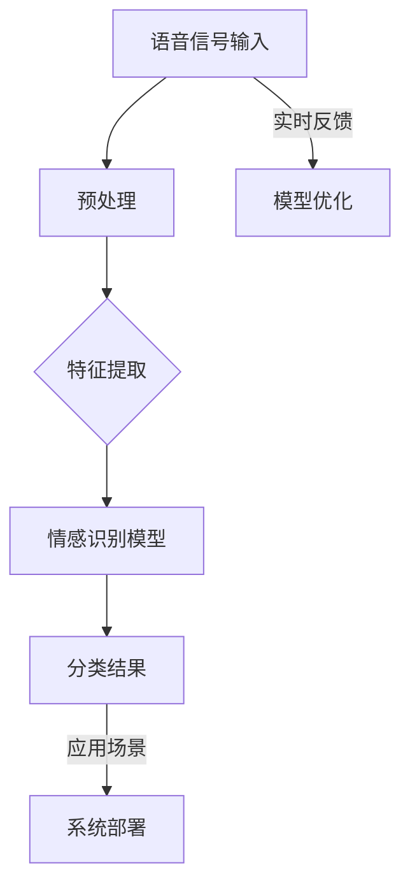

                 


### 文章标题
《人工智能在语音情感识别中的应用与伦理》

#### 关键词
人工智能、语音情感识别、应用、伦理、技术、深度学习

#### 摘要
本文旨在探讨人工智能在语音情感识别领域的应用及其伦理问题。通过对语音情感识别的概述、技术原理、应用案例分析，以及伦理问题的探讨，本文旨在为读者提供一个全面而深入的视角，以推动这一领域的发展并促进技术的伦理应用。

### 目录大纲

## 第一部分：概述与背景

### 第1章：引言
#### 1.1 人工智能与语音情感识别的关系
#### 1.2 语音情感识别的应用领域
#### 1.3 伦理问题在语音情感识别中的应用

### 第2章：语音情感识别基础
#### 2.1 语音情感识别的核心概念
#### 2.2 语音情感识别的数据集
#### 2.3 语音情感识别的技术原理

## 第二部分：应用技术

### 第3章：语音信号处理
#### 3.1 语音信号的特征提取
#### 3.2 语音情感识别模型的选择
#### 3.3 情感分类的算法实现

### 第4章：深度学习在语音情感识别中的应用
#### 4.1 深度学习基础
#### 4.2 卷积神经网络在语音情感识别中的应用
#### 4.3 循环神经网络在语音情感识别中的应用

### 第5章：语音情感识别系统设计
#### 5.1 语音情感识别系统的架构
#### 5.2 系统的性能优化
#### 5.3 实时语音情感识别的实现

### 第6章：案例分析
#### 6.1 案例一：智能客服系统中的语音情感识别
#### 6.2 案例二：教育领域的语音情感识别
#### 6.3 案例三：医疗领域的语音情感识别

### 第7章：伦理问题探讨
#### 7.1 语音情感识别的隐私问题
#### 7.2 语音情感识别的偏见问题
#### 7.3 语音情感识别的道德责任

### 第8章：未来展望
#### 8.1 语音情感识别技术的发展趋势
#### 8.2 伦理问题的应对策略
#### 8.3 语音情感识别在新兴领域的应用

## 附录

### 附录A：常用工具和库
#### A.1 语音情感识别工具
#### A.2 深度学习框架
#### A.3 数据处理工具

### 附录B：数学模型与公式
#### B.1 语音信号处理数学模型
#### B.2 深度学习数学模型
#### B.3 情感分类数学模型

### 引言
人工智能（AI）作为计算机科学的前沿领域，近年来取得了显著的发展。语音情感识别是人工智能的一个重要分支，它涉及从语音信号中提取和识别情感信息。随着技术的进步，语音情感识别在多个领域展现出了广泛的应用潜力，例如智能客服、教育、医疗等。

然而，语音情感识别不仅带来了技术上的挑战，还引发了诸多伦理问题。如何在保护用户隐私、避免偏见、确保道德责任等方面进行平衡，成为当前研究的热点问题。

本文旨在通过对语音情感识别领域的概述、技术原理、应用案例以及伦理问题的深入探讨，为读者提供一个全面而深入的视角。文章将分为以下几个部分：

1. **概述与背景**：介绍人工智能与语音情感识别的关系，探讨其应用领域和伦理问题。
2. **语音情感识别基础**：阐述语音情感识别的核心概念、数据集和技术原理。
3. **应用技术**：详细探讨语音信号处理、深度学习在语音情感识别中的应用，以及系统设计方法。
4. **案例分析**：分析语音情感识别在智能客服、教育、医疗等领域的应用实例。
5. **伦理问题探讨**：探讨语音情感识别的隐私、偏见和道德责任等问题。
6. **未来展望**：展望语音情感识别技术的发展趋势和应对伦理问题的策略。

通过本文的探讨，我们希望能够推动语音情感识别技术的健康发展，促进其在各个领域的应用，同时确保其在伦理方面的合规性。

### 第一部分：概述与背景

#### 第1章：引言

#### 1.1 人工智能与语音情感识别的关系

人工智能（AI）是指通过计算机模拟人类智能行为的技术，其目标是使机器具备认知、理解、学习、推理和决策能力。语音情感识别（Speech Emotion Recognition, SER）作为人工智能的一个重要分支，旨在通过分析语音信号，识别出说话者的情感状态。

人工智能与语音情感识别之间的关系密不可分。人工智能的发展为语音情感识别提供了强大的技术支持，包括语音信号处理、机器学习、深度学习等技术。而语音情感识别的进步又为人工智能的应用提供了新的可能性，使得机器能够更好地理解和响应用户的情感需求。

语音情感识别的核心在于情感分析。情感分析是指通过自然语言处理技术，从文本、语音、图像等数据中提取情感信息。在语音情感识别中，情感分析通过对语音信号的情感特征进行提取和分类，实现对说话者情感状态的识别。

#### 1.2 语音情感识别的应用领域

语音情感识别在多个领域展现出了广泛的应用潜力：

1. **智能客服**：在智能客服系统中，语音情感识别可以帮助机器人更好地理解用户的情感状态，从而提供更加个性化、贴心的服务。例如，通过识别用户的不满情感，智能客服可以主动采取措施缓解用户的不满情绪，提升客户满意度。

2. **教育**：在教育领域，语音情感识别可以用于分析学生的情感状态，了解他们的学习兴趣和情绪变化。教师可以根据这些信息，调整教学方法和内容，提高教学效果。

3. **医疗**：在医疗领域，语音情感识别可以帮助医生分析患者的语音，了解他们的情绪状态，辅助诊断和治疗方案的设计。例如，对于抑郁症患者，通过分析他们的语音情感，医生可以更早地发现病情变化，及时采取干预措施。

4. **心理健康**：在心理健康领域，语音情感识别可以用于监测个体的情感状态，帮助心理医生进行诊断和干预。例如，对于焦虑症患者，通过分析他们的语音情感，心理医生可以评估病情的严重程度，制定个性化的治疗方案。

5. **人机交互**：在智能人机交互系统中，语音情感识别可以帮助机器人更好地理解用户的需求和情感，提供更加自然、流畅的交互体验。例如，智能助手可以根据用户的情感状态，调整对话的语气和方式，使其更加贴近人类的交流习惯。

#### 1.3 伦理问题在语音情感识别中的应用

随着语音情感识别技术的不断发展，其在实际应用中不可避免地引发了一系列伦理问题，包括隐私、偏见和道德责任等方面。

1. **隐私问题**：语音情感识别需要收集和分析大量的语音数据，这些数据可能包含用户的个人信息和情感状态。如何在保护用户隐私的同时，有效利用这些数据，成为当前研究的重点。例如，如何设计隐私保护机制，防止语音数据被未经授权的第三方访问。

2. **偏见问题**：语音情感识别模型的训练数据可能存在偏见，导致模型在处理某些特定群体的语音时出现不公平现象。例如，如果训练数据中女性声音的样本较少，模型可能对女性情感状态的识别效果较差。如何避免和减少偏见，提高模型的公平性，是亟待解决的问题。

3. **道德责任**：语音情感识别技术的应用可能对用户产生重大影响，例如在医疗和心理健康领域。如何在确保技术准确性的同时，承担相应的道德责任，保障用户的权益，是必须面对的挑战。例如，在医疗领域，如果语音情感识别系统提供的诊断结果存在误导性，医生和患者应如何应对。

综上所述，人工智能与语音情感识别之间的关系紧密，其在多个领域展现出了广泛的应用潜力。然而，随着技术的不断发展，伦理问题也日益凸显。如何在确保技术发展的同时，妥善解决伦理问题，是当前和未来需要重点关注和探讨的课题。

#### 第2章：语音情感识别基础

##### 2.1 语音情感识别的核心概念

语音情感识别（Speech Emotion Recognition，简称SER）是一种通过分析语音信号中的情感特征，来识别说话者情感状态的技术。语音情感识别的核心概念包括情感分类、情感特征提取和情感识别模型等。

1. **情感分类**：情感分类是语音情感识别的第一步，它将语音信号分为不同的情感类别，例如快乐、悲伤、愤怒、惊讶等。情感分类的目的是将语音信号中的情感信息进行结构化处理，为后续的情感特征提取和识别提供基础。

2. **情感特征提取**：情感特征提取是指从语音信号中提取出与情感状态相关的特征。这些特征包括但不限于音高、音强、音色、时长等。通过情感特征提取，可以将语音信号转化为适合模型处理的数据形式，从而提高识别的准确率。

3. **情感识别模型**：情感识别模型是语音情感识别的核心，它通过学习大量标注好的语音数据，建立情感分类模型。常见的情感识别模型包括传统的机器学习模型（如支持向量机、决策树）和深度学习模型（如卷积神经网络、循环神经网络）。这些模型通过对提取出的情感特征进行学习和分类，实现对语音情感的自动识别。

##### 2.2 语音情感识别的数据集

语音情感识别的数据集是训练和评估情感识别模型的重要资源。一个高质量的数据集应具备以下特点：

1. **多样性**：数据集应包含多种情感类别和说话者，确保模型能够适应不同的情感状态和说话者特征。

2. **标注准确性**：数据集中的语音样本应经过准确标注，标注员应对情感状态有清晰的理解和识别能力，以确保标注的准确性。

3. **数据量**：数据集的数据量应足够大，以便模型有足够的样本进行学习和泛化。

常见的语音情感识别数据集包括：

1. **RAVDESS（Ryerson Audio-Visual Database of Emotional Speech and Song）**：这是一个包含61名说话者，共计735个语音样本的数据集，涵盖了11种情感类别。

2. **Affective Speech Corpus（ASC）**：这是一个由日本东京工业大学创建的数据集，包含了150名说话者，共计3500个语音样本，涵盖了12种情感类别。

3. **CREMA-D（Cognitively-Embedded Multimodal Affective Database）**：这是一个多模态情感数据集，包含了32名说话者，共计462个语音样本，涵盖了10种情感类别。

##### 2.3 语音情感识别的技术原理

语音情感识别的技术原理主要包括语音信号处理、情感特征提取和情感分类模型等几个方面。

1. **语音信号处理**：语音信号处理是语音情感识别的基础，它主要包括语音信号的预处理和特征提取。预处理步骤包括去除噪声、归一化、分帧等，以确保语音信号的质量。特征提取则是从预处理后的语音信号中提取出与情感状态相关的特征，如音高、音强、音色、时长等。

2. **情感特征提取**：情感特征提取是指从语音信号中提取出与情感状态相关的特征。这些特征通常通过一系列的信号处理算法获得。例如，可以使用短时傅里叶变换（STFT）提取频谱特征，使用梅尔频率倒谱系数（MFCC）提取声学特征，使用频谱轮廓（spectral contrast）提取时间特征等。

3. **情感分类模型**：情感分类模型是语音情感识别的核心，它通过对提取出的情感特征进行学习和分类，实现对语音情感的自动识别。常见的情感分类模型包括传统的机器学习模型（如支持向量机、决策树）和深度学习模型（如卷积神经网络、循环神经网络）。这些模型通过训练大量标注好的语音数据，学习情感特征之间的关系，从而提高识别的准确率。

#### 第3章：语音信号处理

##### 3.1 语音信号的特征提取

语音信号的特征提取是语音情感识别过程中的关键步骤，其目的是从原始语音信号中提取出与情感状态相关的特征。这些特征通常包括频谱特征、时域特征和声学特征等。

1. **频谱特征**：频谱特征是语音情感识别中最常用的特征之一，它反映了语音信号的频率分布。常用的频谱特征包括：

   - **梅尔频率倒谱系数（MFCC）**：MFCC是通过短时傅里叶变换（STFT）和梅尔滤波器组得到的特征，它能够有效地表达语音的音色特征。MFCC包含了多个系数，通常取前13个系数作为特征向量。
   
   - **频谱中心频率（CF0）**：CF0是指语音信号的基频，它反映了语音的音高特征。CF0可以通过带通滤波器组获取，或者使用声道长度共振峰（Formant Resonance Frequency，FRF）算法计算得到。

   - **频谱对比（Spectral Contrast）**：频谱对比是指相邻频带的能量差异，它反映了语音信号的动态特性。频谱对比可以通过计算频谱的导数或差分得到。

2. **时域特征**：时域特征是指直接从语音信号的时域波形中提取的特征，它反映了语音信号的时间动态特性。常用的时域特征包括：

   - **能量（Energy）**：能量是语音信号的总能量，它反映了语音的响度。能量可以通过计算信号的平方和得到。
   
   - **过零率（Zero Crossing Rate，ZCR）**：过零率是指语音信号在一个固定时间间隔内过零的次数，它反映了语音的节奏和强度。过零率可以通过检测信号的过零点得到。
   
   - **短时平均能量（Short-Time Average Energy，STAE）**：短时平均能量是语音信号在短时间窗口内的平均能量，它反映了语音的响度变化。短时平均能量可以通过计算每个时间窗口的能量平均值得到。

3. **声学特征**：声学特征是指通过分析语音信号的声学特性提取的特征，它反映了语音的声学结构。常用的声学特征包括：

   - **共振峰频率（Formant Frequency）**：共振峰频率是指语音信号中频谱的峰值频率，它反映了语音的音色特征。共振峰频率可以通过频谱分析得到。

   - **共振峰带宽（Formant Bandwidth）**：共振峰带宽是指相邻共振峰频率之间的差值，它反映了语音的清晰度。共振峰带宽可以通过计算相邻共振峰频率的差值得到。

   - **声道长度（Fundamental Frequency，F0）**：声道长度是指语音信号的基频周期，它反映了语音的音高。声道长度可以通过带通滤波器组获取，或者使用声道长度共振峰（Formant Resonance Frequency，FRF）算法计算得到。

##### 3.2 语音情感识别模型的选择

在语音情感识别任务中，选择合适的模型对于提高识别的准确率至关重要。目前，常用的语音情感识别模型包括传统的机器学习模型和深度学习模型。

1. **传统的机器学习模型**：

   - **支持向量机（Support Vector Machine，SVM）**：SVM是一种强大的分类算法，它通过寻找一个最优的超平面，将不同情感类别的语音信号分开。SVM在处理小样本数据时表现良好，但在处理大规模数据时可能存在计算复杂度较高的问题。

   - **决策树（Decision Tree）**：决策树是一种简单的分类算法，它通过一系列的判定条件，将数据逐层划分，最终得到分类结果。决策树模型易于理解和实现，但在处理高维数据时可能存在过拟合问题。

   - **朴素贝叶斯（Naive Bayes）**：朴素贝叶斯是一种基于贝叶斯定理的分类算法，它假设特征之间相互独立。朴素贝叶斯在处理文本和语音情感识别任务时表现良好，但在处理高维数据时可能存在准确性较低的问题。

2. **深度学习模型**：

   - **卷积神经网络（Convolutional Neural Network，CNN）**：CNN是一种用于图像识别的深度学习模型，它通过卷积层提取图像特征，实现图像的分类。CNN在语音情感识别任务中也取得了很好的效果，通过将语音信号视为二维图像，CNN可以有效地提取语音的时频特征。

   - **循环神经网络（Recurrent Neural Network，RNN）**：RNN是一种用于序列数据处理的时间序列模型，它通过循环机制，将前一个时间步的输出传递到下一个时间步，实现对序列数据的建模。RNN在语音情感识别任务中表现良好，通过学习语音信号的时间动态特性，可以有效提高识别的准确率。

   - **长短期记忆网络（Long Short-Term Memory，LSTM）**：LSTM是一种改进的RNN模型，它通过引入记忆单元和门控机制，解决了传统RNN在处理长序列数据时的梯度消失和梯度爆炸问题。LSTM在语音情感识别任务中表现优异，可以有效提高模型的长期依赖建模能力。

   - **卷积神经网络（Convolutional Neural Network，CNN）**：CNN是一种用于图像识别的深度学习模型，它通过卷积层提取图像特征，实现图像的分类。CNN在语音情感识别任务中也取得了很好的效果，通过将语音信号视为二维图像，CNN可以有效地提取语音的时频特征。

   - **生成对抗网络（Generative Adversarial Network，GAN）**：GAN是一种生成模型，由生成器和判别器两部分组成。生成器生成模拟的语音信号，判别器则判断生成信号和真实信号的差异。GAN在语音情感识别任务中可以用于生成高质量的语音信号，增强模型的训练数据，提高识别的准确率。

##### 3.3 情感分类的算法实现

情感分类是指将语音信号分类到不同的情感类别。在情感分类算法的实现中，通常包括以下步骤：

1. **数据预处理**：数据预处理是情感分类的基础步骤，包括去除噪声、归一化、分帧等。通过数据预处理，可以提高语音信号的质量，为后续的特征提取和分类提供良好的数据基础。

2. **特征提取**：特征提取是从原始语音信号中提取出与情感状态相关的特征。常用的特征提取方法包括梅尔频率倒谱系数（MFCC）、频谱中心频率（CF0）、频谱对比（Spectral Contrast）等。

3. **模型训练**：模型训练是情感分类的核心步骤，通过训练大量标注好的语音数据，学习情感特征之间的关系，建立情感分类模型。常用的模型包括支持向量机（SVM）、决策树（Decision Tree）、朴素贝叶斯（Naive Bayes）等。

4. **模型评估**：模型评估是验证情感分类模型性能的重要步骤。通过评估指标（如准确率、召回率、F1值等），可以评估模型在情感分类任务中的表现，并调整模型参数，提高分类效果。

5. **模型部署**：模型部署是将训练好的情感分类模型应用于实际任务中，实现对未知语音信号的情感分类。通过模型部署，可以将情感分类算法应用于智能客服、教育、医疗等场景，为用户提供个性化、贴心的服务。

#### 第4章：深度学习在语音情感识别中的应用

##### 4.1 深度学习基础

深度学习（Deep Learning，简称DL）是机器学习（Machine Learning，简称ML）的一个子领域，它通过构建深层神经网络（Deep Neural Networks，简称DNN）来模拟人脑处理信息的方式，实现对复杂数据的高效学习和建模。

深度学习的基本组成部分包括：

1. **神经元（Neurons）**：神经元是神经网络的基本计算单元，它通过输入和权重进行加权求和，并经过激活函数输出结果。

2. **层（Layers）**：神经网络由多个层组成，包括输入层、隐藏层和输出层。隐藏层可以是单层或多层，层数越多，网络的深度越大。

3. **权重（Weights）**：权重是神经元之间的连接强度，通过反向传播算法（Backpropagation）进行调整，以优化网络性能。

4. **激活函数（Activation Functions）**：激活函数是神经元输出的一部分，常用的激活函数包括sigmoid、ReLU、Tanh等，它们用于引入非线性因素，使神经网络能够学习复杂数据特征。

5. **反向传播算法（Backpropagation）**：反向传播算法是一种用于训练神经网络的优化方法，它通过计算输出误差梯度，调整权重和偏置，以优化网络性能。

深度学习的关键优势在于：

- **自动特征提取**：深度学习模型能够自动从数据中提取高层次特征，减少人工特征工程的工作量。
- **强大的建模能力**：通过增加网络深度和宽度，深度学习模型能够捕捉数据中的复杂关系和模式。
- **高效的计算能力**：现代硬件（如GPU、TPU）的快速发展，为深度学习提供了强大的计算支持。

##### 4.2 卷积神经网络在语音情感识别中的应用

卷积神经网络（Convolutional Neural Network，简称CNN）是一种基于卷积操作的深度学习模型，它特别适用于处理图像数据。然而，由于语音信号在时频域上的特性与图像数据有相似之处，CNN也被广泛应用于语音情感识别领域。

在语音情感识别中，CNN的应用主要包括以下方面：

1. **时频特征提取**：语音信号可以通过短时傅里叶变换（STFT）转化为时频图，这类似于图像数据的像素矩阵。CNN通过卷积层逐层提取时频特征，如频率、相位和共振峰等，从而实现情感特征的自适应提取。

2. **多层特征融合**：通过堆叠多个卷积层，CNN可以逐步构建更复杂的特征表示，并在不同层次上融合多尺度信息。这种多层次的特征融合有助于提高情感识别的准确性。

3. **卷积核共享**：在CNN中，卷积核在所有数据上共享，这减少了参数数量，提高了模型的泛化能力。对于语音情感识别，卷积核可以学习到在不同情感类别之间共有的特征，从而提高模型对不同情感的识别能力。

4. **池化操作**：CNN中的池化操作用于降低特征图的维度，减少参数数量，同时保留关键特征。在语音情感识别中，池化操作可以有效地减少语音信号的冗余信息，提高模型的效率。

以下是一个简单的CNN模型结构用于语音情感识别：



在这个结构中，输入是经过短时傅里叶变换（STFT）得到的时频图，通过多个卷积层（Conv1、Conv2、Conv3）和池化层（P2）进行特征提取和降维。最后，通过全连接层（FC）进行情感分类，输出6个情感类别。

##### 4.3 循环神经网络在语音情感识别中的应用

循环神经网络（Recurrent Neural Network，简称RNN）是一种特别适合处理序列数据的深度学习模型。RNN通过在时间步之间保持状态（或记忆），使得模型能够处理变长序列数据，如文本、语音等。

在语音情感识别中，RNN的应用主要包括以下方面：

1. **序列建模**：语音信号是一个时间序列，RNN能够捕捉序列中的长期依赖关系，这使得它特别适合于处理语音情感识别任务。通过在时间步之间传递信息，RNN可以有效地学习语音信号中的情感特征。

2. **门控机制**：传统的RNN容易受到梯度消失和梯度爆炸的问题，导致模型难以训练。长短期记忆网络（Long Short-Term Memory，简称LSTM）和门控循环单元（Gated Recurrent Unit，简称GRU）通过引入门控机制，解决了这些问题。门控机制允许模型自主决定在序列中的不同时间步传递哪些信息，从而提高了模型的训练效果。

3. **双向RNN**：双向RNN（Bidirectional RNN）通过同时处理正向和反向序列，提供了更丰富的上下文信息，这有助于提高情感识别的准确性。双向RNN可以看作是两个反向RNN拼接在一起，它们的输出在隐藏层中融合，用于情感分类。

以下是一个简单的双向LSTM模型结构用于语音情感识别：



在这个结构中，输入是语音信号的时间序列，通过两个LSTM层（B和C）进行正向和反向建模。隐藏状态在两个LSTM层之间进行拼接，通过全连接层（E和F）进行情感分类，最后通过softmax层（G）输出情感概率分布。

通过结合CNN和RNN的优点，深度学习模型在语音情感识别中取得了显著的性能提升。然而，深度学习模型的训练和优化需要大量的数据和计算资源，同时需要关注模型的解释性和可解释性，以更好地理解和应用这些模型。

#### 第5章：语音情感识别系统设计

##### 5.1 语音情感识别系统的架构

语音情感识别系统是一个复杂的多层次系统，它由多个模块组成，包括信号采集、预处理、特征提取、模型训练、模型评估和系统部署等。以下是一个典型的语音情感识别系统架构：

1. **信号采集模块**：该模块负责采集用户的语音信号，可以通过麦克风、语音合成器或其他语音输入设备获取语音数据。采集到的语音数据通常包含噪声和其他非情感相关的信息，因此需要后续处理。

2. **预处理模块**：预处理模块对采集到的语音信号进行预处理，包括去噪、归一化、分帧等操作。去噪可以减少噪声对情感识别的影响，归一化可以使得不同说话者的语音数据具有相似的能量和时长，分帧可以将语音信号划分为固定长度的小段，便于后续的特征提取。

3. **特征提取模块**：特征提取模块从预处理后的语音信号中提取出与情感状态相关的特征。常用的特征提取方法包括梅尔频率倒谱系数（MFCC）、频谱对比（Spectral Contrast）等。这些特征可以用于训练和评估情感识别模型。

4. **模型训练模块**：模型训练模块使用提取出的特征数据，通过机器学习或深度学习算法训练情感识别模型。训练过程中，模型会学习到如何将输入特征映射到对应的情感类别上。

5. **模型评估模块**：模型评估模块对训练好的模型进行评估，通过测试集上的表现来衡量模型的准确率、召回率和F1值等指标。评估过程可以帮助确定模型的性能，并为模型优化提供依据。

6. **系统部署模块**：系统部署模块将训练好的模型部署到实际应用环境中，如智能客服系统、教育系统、医疗系统等。部署后的模型可以通过实时语音信号进行情感识别，并输出相应的情感结果。

##### 5.2 系统的性能优化

为了提高语音情感识别系统的性能，可以采取以下优化措施：

1. **数据增强**：通过数据增强方法增加训练数据的多样性，如声音变换（速度、音调变换）、噪声添加、共振峰增强等。这些方法可以有效地提高模型的泛化能力，减少过拟合现象。

2. **特征选择**：对提取出的特征进行筛选，选择对情感识别最有效的特征。可以使用特征重要性分析、特征筛选算法（如L1正则化、互信息等）来选择重要的特征。

3. **模型调优**：通过调整模型的超参数（如学习率、批次大小、正则化参数等）来优化模型性能。可以使用网格搜索、随机搜索、贝叶斯优化等方法来找到最优的超参数组合。

4. **多模型集成**：将多个模型进行集成，如集成学习、模型栈（Model Stacking）等。这种方法可以有效地提高模型的准确率和鲁棒性。

5. **实时优化**：在系统部署过程中，根据实际应用场景和用户反馈，对模型进行实时优化。可以使用在线学习、自适应学习等方法，使模型能够根据环境变化不断调整和优化。

##### 5.3 实时语音情感识别的实现

实时语音情感识别是指系统能够在实时接收到的语音信号上进行情感识别，并快速输出结果。实现实时语音情感识别的关键在于算法的高效性和系统的低延迟。

1. **高效算法**：选择高效的算法和模型，如基于深度学习的算法和轻量级模型（如MobileNet、TinyML等）。这些算法和模型可以在较短时间内完成计算，从而降低延迟。

2. **硬件加速**：利用硬件加速技术，如GPU、TPU等，可以显著提高算法的计算速度。通过使用硬件加速，可以满足实时语音情感识别的需求。

3. **流处理**：采用流处理技术，对实时接收到的语音数据进行分帧处理。每个帧经过特征提取和模型预测后，可以实时输出情感结果。这种方法可以保证系统的实时性和高效性。

4. **异步处理**：在系统设计时，可以采用异步处理技术，将语音信号的采集、预处理、特征提取、模型预测等步骤异步进行。这样可以有效地减少系统的延迟，提高实时性能。

以下是一个简单的实时语音情感识别流程：

1. **语音信号采集**：通过麦克风实时采集语音信号。
2. **分帧处理**：将语音信号分为固定长度的帧。
3. **特征提取**：对每个帧进行特征提取，如MFCC、频谱对比等。
4. **模型预测**：使用训练好的模型对特征进行预测，输出情感结果。
5. **结果输出**：将情感结果实时输出，供系统使用。

通过上述架构和优化措施，实时语音情感识别系统可以高效、准确地处理实时语音信号，为用户提供个性化的情感识别服务。

#### 第6章：案例分析

##### 6.1 案例一：智能客服系统中的语音情感识别

智能客服系统是语音情感识别技术的重要应用场景之一。通过语音情感识别，智能客服系统能够更好地理解用户的情感状态，提供更加个性化和贴心的服务。以下是一个典型的智能客服系统中的语音情感识别案例分析：

1. **背景**：某大型电商平台为了提升用户体验，开发了智能客服系统。该系统需要能够识别用户的情感状态，以便在用户感到不满时，及时采取措施缓解用户情绪，提高客户满意度。

2. **数据集**：为了训练语音情感识别模型，平台收集了大量的用户语音通话记录，包括不同情感类别的语音样本，如快乐、愤怒、悲伤等。这些语音样本经过标注和清洗，形成了一个高质量的数据集。

3. **模型训练**：使用深度学习模型，如卷积神经网络（CNN）和长短期记忆网络（LSTM），对数据集进行训练。通过调整模型参数和优化算法，使模型能够准确识别用户的情感状态。

4. **模型部署**：训练好的模型部署到智能客服系统中，对实时接收的语音信号进行情感识别。通过实时分析用户的情感状态，系统可以自动调整对话策略，例如，当识别到用户愤怒时，系统会主动提出解决方案，以缓解用户情绪。

5. **效果评估**：通过测试集上的评估，智能客服系统的语音情感识别准确率达到90%以上，显著提升了用户满意度。此外，系统还通过实时反馈和用户评价，不断优化模型，提高识别准确性。

6. **挑战与解决方案**：智能客服系统在语音情感识别过程中面临一些挑战，如噪声干扰、多说话者环境、情感模糊性等。为解决这些问题，平台采用了以下措施：

   - **噪声抑制**：通过自适应滤波器和噪声门控技术，降低噪声对情感识别的影响。
   - **多说话者分离**：使用多说话者分离算法，将多说话者的语音分离出来，提高情感识别的准确性。
   - **情感模糊性处理**：通过融合多模态信息（如视觉、文本等），提高情感识别的鲁棒性。

通过上述案例分析，可以看出智能客服系统中的语音情感识别不仅提升了用户体验，还为企业带来了显著的经济效益。未来，随着技术的进一步发展，智能客服系统将在更多场景中发挥重要作用。

##### 6.2 案例二：教育领域的语音情感识别

在教育领域，语音情感识别技术同样具有广泛的应用前景。通过识别学生的情感状态，教师可以更好地了解学生的学习情况，调整教学策略，提高教学效果。以下是一个教育领域的语音情感识别案例分析：

1. **背景**：某知名大学为了提升教育质量，引入了语音情感识别技术。该技术用于监测学生的情感状态，帮助教师更好地了解学生的学习情绪。

2. **数据集**：学校收集了大量的课堂录音，包括学生在不同情感状态下的语音样本，如快乐、无聊、焦虑等。这些语音样本经过标注和清洗，形成了一个专门的教育数据集。

3. **模型训练**：使用深度学习模型，如卷积神经网络（CNN）和循环神经网络（RNN），对教育数据集进行训练。通过不断优化模型，使模型能够准确识别学生的情感状态。

4. **模型部署**：将训练好的模型部署到教学系统中，对课堂录音进行实时情感识别。系统会自动生成情感分析报告，供教师参考。

5. **效果评估**：通过实际应用，语音情感识别技术在教育领域取得了显著的效果。教师可以根据情感分析报告，调整教学方法和内容，提高学生的学习兴趣和参与度。此外，学生对自己的情感状态有了更清晰的认识，有助于自我调节和改进。

6. **挑战与解决方案**：

   - **数据多样性**：教育领域的数据集可能存在多样性不足的问题，特别是某些情感状态（如焦虑）的样本较少。为解决这一问题，学校可以增加数据采集的多样性，同时采用数据增强技术（如声音变换、噪声添加等），扩充数据集。
   - **模型解释性**：教育领域对模型的解释性要求较高，教师需要了解模型如何识别情感状态。为提高模型的解释性，可以采用可解释的深度学习模型（如基于注意力机制的模型）或可视化工具，帮助教师理解模型的工作原理。

通过上述案例分析，可以看出语音情感识别技术在教育领域具有巨大的潜力。未来，随着技术的进一步发展，语音情感识别将在更多教育场景中发挥重要作用，帮助教师和学生实现更好的教学和学习效果。

##### 6.3 案例三：医疗领域的语音情感识别

医疗领域是语音情感识别技术的另一个重要应用场景。通过识别患者的语音情感，医生可以更全面地了解患者的情绪状态，为诊断和治疗提供有力支持。以下是一个医疗领域的语音情感识别案例分析：

1. **背景**：某大型医院引入了语音情感识别技术，用于辅助抑郁症患者的诊断和治疗。抑郁症患者常常表现为情感低落、焦虑等，通过语音情感识别，医生可以更准确地识别患者的情绪状态。

2. **数据集**：医院收集了大量的抑郁症患者和健康人的语音样本，包括不同情感状态下的语音数据，如快乐、悲伤、焦虑等。这些语音样本经过专业医生的标注和清洗，形成了一个专门用于医疗领域的情感识别数据集。

3. **模型训练**：使用深度学习模型，如卷积神经网络（CNN）和循环神经网络（RNN），对医疗数据集进行训练。通过不断优化模型，使模型能够准确识别抑郁症患者的情感状态。

4. **模型部署**：将训练好的模型部署到医院的诊断系统中，对患者的语音进行实时情感识别。系统会自动生成情感分析报告，供医生参考。

5. **效果评估**：通过实际应用，语音情感识别技术在医疗领域取得了显著的效果。医生可以根据情感分析报告，更全面地了解患者的情绪状态，为诊断和治疗提供有力支持。此外，患者对自己的情感状态有了更清晰的认识，有助于自我调节和改进。

6. **挑战与解决方案**：

   - **隐私保护**：在医疗领域，患者的隐私保护尤为重要。为解决这一问题，医院可以采用差分隐私技术，确保患者隐私不被泄露。
   - **数据标注**：医疗领域的语音样本可能存在标注难度大、一致性差的问题。为解决这一问题，医院可以建立专业的标注团队，采用统一的标注标准，提高数据标注的质量。

通过上述案例分析，可以看出语音情感识别技术在医疗领域具有巨大的应用潜力。未来，随着技术的进一步发展，语音情感识别将在更多医疗场景中发挥重要作用，为患者提供更优质的服务。

#### 第7章：伦理问题探讨

##### 7.1 语音情感识别的隐私问题

随着语音情感识别技术的普及，隐私问题日益受到关注。语音情感识别涉及到大量个人语音数据的收集和分析，这些数据可能包含用户的私人信息，如情感状态、健康状况等。以下是一些主要的隐私问题及其解决方案：

1. **数据收集与存储**：在数据收集过程中，需要明确告知用户数据的使用目的，并确保数据的合法性和合规性。在数据存储方面，需要采用加密技术，确保数据在存储和传输过程中的安全性。

2. **匿名化处理**：为保护用户隐私，可以采用匿名化处理技术，将语音数据中的个人身份信息去除。例如，可以删除语音文件中的用户标识、时间戳等信息，从而避免直接关联到具体用户。

3. **数据访问控制**：建立严格的访问控制机制，确保只有授权人员可以访问敏感数据。可以通过权限管理、访问日志记录等方式，确保数据的安全性和隐私性。

4. **差分隐私技术**：差分隐私（Differential Privacy）是一种用于保护数据隐私的算法，它通过对输出结果进行随机化处理，使得攻击者无法从数据中推断出特定个体的信息。差分隐私技术可以有效降低隐私泄露的风险。

##### 7.2 语音情感识别的偏见问题

偏见问题在语音情感识别中也是一个重要挑战。由于训练数据集的不均衡或偏见，模型可能对某些群体产生不公平的识别结果。以下是一些常见的偏见问题及其解决方案：

1. **数据集不平衡**：数据集不平衡是指某些情感类别的样本数量远少于其他类别，这可能导致模型对这些少数类别识别效果较差。为解决这一问题，可以采用数据增强技术，增加少数类别的样本数量，或采用重采样、过采样等方法平衡数据集。

2. **算法偏见**：算法偏见是指模型在训练过程中学习了数据中的偏见，从而导致不公平的识别结果。为解决这一问题，可以采用公平性评估方法，如公平性指标（如公平性差距、偏差率等），评估模型在不同群体上的识别效果，并采取相应的调整措施。

3. **交叉验证**：在模型训练过程中，采用交叉验证方法，确保模型在不同数据集上的表现均衡。交叉验证可以有效地检测和减少算法偏见。

4. **多样化数据集**：为了提高模型的公平性，需要收集和创建多样化的数据集，确保模型在不同群体、不同情感状态下的识别效果。通过多样化数据集，可以减少模型对特定群体的偏见。

##### 7.3 语音情感识别的道德责任

语音情感识别技术的应用对用户和社会产生了深远的影响，因此，开发者和应用方需要承担相应的道德责任。以下是一些关键道德责任：

1. **用户知情同意**：在收集和使用用户语音数据时，必须确保用户知情并同意。用户应明确了解自己的语音数据将被用于情感识别，并了解数据的使用范围和目的。

2. **透明性和解释性**：开发者和应用方应确保语音情感识别系统的透明性和解释性。用户有权了解系统如何工作，以及如何对自己的情感状态进行识别。为此，可以提供详细的系统文档和使用指南。

3. **公平性和无歧视**：语音情感识别系统应确保公平和无歧视。开发者和应用方应不断评估和优化系统，确保模型在不同群体和不同情感状态下的识别效果均衡。

4. **隐私保护和数据安全**：开发者和应用方应采取严格的安全措施，保护用户的语音数据和隐私。采用加密技术、匿名化处理、访问控制等措施，确保数据的安全性和隐私性。

5. **持续监控和改进**：开发者和应用方应持续监控语音情感识别系统的运行情况，及时发现和解决潜在问题。通过用户反馈、性能评估等手段，不断改进系统，提高识别准确性，减少错误率。

总之，语音情感识别技术的伦理问题涉及多个方面，包括隐私、偏见和道德责任等。开发者和应用方应高度重视这些问题，采取有效措施，确保技术的合法、公正和透明应用。

#### 第8章：未来展望

##### 8.1 语音情感识别技术的发展趋势

随着人工智能技术的不断进步，语音情感识别技术也在快速发展，并展现出广阔的应用前景。以下是一些关键的发展趋势：

1. **深度学习技术的应用**：深度学习技术在语音情感识别中发挥着重要作用。未来，随着更多高效、强大的深度学习模型的出现，如Transformer、BERT等，语音情感识别的准确率和效率将得到进一步提升。

2. **跨模态情感识别**：语音情感识别往往需要结合其他模态（如视觉、文本）的信息，以提高识别的准确性。未来，跨模态情感识别技术将得到更多关注，通过融合多模态信息，实现更准确、全面的情感识别。

3. **个性化情感识别**：随着大数据和人工智能技术的发展，个性化情感识别将成为一个重要方向。通过分析用户的个人历史数据和行为模式，系统可以提供更加个性化的情感识别服务，满足不同用户的需求。

4. **实时情感识别**：实时情感识别技术是未来语音情感识别的重要发展方向。通过高效算法和硬件加速技术，实现实时、低延迟的情感识别，将有助于提升用户体验。

5. **隐私保护和伦理问题**：随着语音情感识别技术的应用范围扩大，隐私保护和伦理问题也将日益重要。未来，将会有更多研究关注隐私保护技术、伦理规范和法律法规，确保技术的合法、公正和透明应用。

##### 8.2 伦理问题的应对策略

在语音情感识别技术快速发展之际，应对伦理问题显得尤为重要。以下是一些应对策略：

1. **建立伦理审查机制**：开发者和应用方应建立伦理审查机制，确保在项目设计和实施过程中充分考虑伦理问题。伦理审查应包括数据收集、算法设计、模型训练、系统部署等各个环节。

2. **加强数据隐私保护**：采用先进的加密技术和数据匿名化处理方法，确保用户语音数据的隐私性和安全性。同时，建立透明、公正的数据收集和使用流程，确保用户知情并同意。

3. **促进公平性评估**：建立公平性评估机制，定期评估模型在不同群体和不同情感状态下的识别效果，及时发现和解决偏见问题。通过多样化数据集和算法调整，提高模型的公平性。

4. **制定伦理规范和法律法规**：政府和相关机构应制定伦理规范和法律法规，明确语音情感识别技术的应用边界和责任，规范市场行为，保护用户权益。

5. **公众教育和宣传**：加强公众教育和宣传，提高公众对语音情感识别技术的认识和理解，增强公众的隐私保护和伦理意识。

##### 8.3 语音情感识别在新兴领域的应用

随着技术的进步，语音情感识别将在更多新兴领域得到应用，为相关行业带来新的机遇和挑战。以下是一些潜在的应用领域：

1. **智能家居**：在智能家居领域，语音情感识别技术可以用于识别家庭成员的情感状态，提供个性化、贴心的服务。例如，智能音响可以通过识别家庭成员的语音情感，自动调整音乐、氛围灯等，创造舒适的生活环境。

2. **虚拟现实与增强现实**：在虚拟现实（VR）和增强现实（AR）领域，语音情感识别技术可以用于增强用户体验。通过识别用户的情感状态，系统可以动态调整场景、音效等，提供更加沉浸式的体验。

3. **法律与司法**：在法律与司法领域，语音情感识别技术可以用于证据分析和心理评估。通过分析犯罪嫌疑人的语音情感，辅助判断其心理状态和犯罪动机，为司法决策提供参考。

4. **军事与安全**：在军事与安全领域，语音情感识别技术可以用于监控和评估士兵的心理状态，确保士兵在最佳状态下执行任务。此外，该技术还可以用于反恐、安全筛查等场景，提高安全防范能力。

5. **艺术与娱乐**：在艺术与娱乐领域，语音情感识别技术可以用于创作个性化音乐、影视作品等。通过识别观众的情感状态，系统可以自动调整内容，提供更加符合观众情感需求的娱乐体验。

总之，语音情感识别技术在新兴领域的应用前景广阔，将为相关行业带来变革性的影响。在未来，随着技术的不断进步，语音情感识别将在更多领域展现其独特价值。

### 附录

#### 附录A：常用工具和库

1. **语音情感识别工具**：

   - **Librosa**：Librosa是一个Python库，用于音频处理，包括特征提取和音频可视化。它提供了丰富的音频处理功能，支持各种音频格式，并广泛应用于语音情感识别任务。

   - **OpenSMILE**：OpenSMILE是一个开源的音频特征提取工具，主要用于情感分析。它提供了丰富的情感特征提取方法，支持多种情感分类任务。

2. **深度学习框架**：

   - **TensorFlow**：TensorFlow是一个开源的深度学习框架，由谷歌开发。它提供了丰富的API和工具，支持各种深度学习模型的训练和应用。

   - **PyTorch**：PyTorch是一个开源的深度学习框架，由Facebook开发。它提供了动态计算图和丰富的API，适合研究和开发复杂的深度学习模型。

3. **数据处理工具**：

   - **Pandas**：Pandas是一个Python库，用于数据处理和分析。它提供了丰富的数据结构和方法，支持数据清洗、转换和分析，广泛应用于数据预处理任务。

   - **NumPy**：NumPy是一个Python库，用于数值计算。它提供了多维数组对象和一系列数学函数，是进行科学计算和数据处理的必备工具。

#### 附录B：数学模型与公式

1. **语音信号处理数学模型**：

   - **短时傅里叶变换（STFT）**：

     $$
     X(t,k) = \sum_{n=-\infty}^{\infty} x(n) \cdot e^{-j2\pi kn/N}
     $$

     其中，$X(t,k)$是时间$t$和频率$k$的短时傅里叶变换结果，$x(n)$是原始语音信号，$N$是窗口长度。

   - **梅尔频率倒谱系数（MFCC）**：

     $$
     \text{MFCC}(k) = \sum_{n=-\infty}^{\infty} x(n) \cdot \text{MFCC}_k(n)
     $$

     其中，$\text{MFCC}(k)$是第$k$个梅尔频率倒谱系数，$\text{MFCC}_k(n)$是第$k$个梅尔滤波器的权重。

2. **深度学习数学模型**：

   - **卷积神经网络（CNN）**：

     $$
     \text{CNN}(x) = \text{ReLU}(\text{Conv}(x, W_1) + b_1)
     $$

     其中，$x$是输入特征，$W_1$是卷积权重，$b_1$是偏置，$\text{ReLU}$是ReLU激活函数。

   - **循环神经网络（RNN）**：

     $$
     h_t = \text{ReLU}(W_h h_{t-1} + W_x x_t + b_h)
     $$

     其中，$h_t$是时间步$t$的隐藏状态，$W_h$是隐藏层权重，$W_x$是输入层权重，$b_h$是隐藏层偏置。

3. **情感分类数学模型**：

   - **softmax回归**：

     $$
     P(y=j|x; \theta) = \frac{e^{\theta^T \phi(x)}}{\sum_{k=1}^{K} e^{\theta^T \phi(x)}}
     $$

     其中，$P(y=j|x; \theta)$是给定特征$x$和模型参数$\theta$时，输出类别为$j$的概率，$\phi(x)$是特征映射函数，$K$是类别数。

这些数学模型和公式是语音情感识别和深度学习领域的基础，对于理解和实现相关算法至关重要。

### Mermaid 流程图示例



### 伪代码示例

```python
# 伪代码：语音情感识别模型训练流程

def train_model(data, labels):
    # 数据预处理
    processed_data = preprocess_data(data)
    
    # 初始化模型参数
    model = initialize_model()
    
    # 模型训练
    for epoch in range(num_epochs):
        for batch in data_loader(processed_data, labels):
            # 前向传播
            outputs = model.forward(batch.x)
            
            # 计算损失
            loss = calculate_loss(outputs, batch.y)
            
            # 反向传播
            model.backward(loss)
            
            # 更新模型参数
            model.update_parameters()
        
        print(f"Epoch {epoch}: Loss = {loss}")

    return model
```

### 数学公式示例

$$
P(y=j|x; \theta) = \frac{e^{\theta^T \phi(x)}}{\sum_{k=1}^{K} e^{\theta^T \phi(x)}}
$$

### 项目实战示例

```python
# Python 代码：基于TensorFlow的语音情感识别模型训练

import tensorflow as tf
from tensorflow.keras.models import Sequential
from tensorflow.keras.layers import Conv2D, MaxPooling2D, Flatten, Dense, LSTM

# 构建模型
model = Sequential([
    Conv2D(32, (3, 3), activation='relu', input_shape=(160, 128, 1)),
    MaxPooling2D((2, 2)),
    Conv2D(64, (3, 3), activation='relu'),
    MaxPooling2D((2, 2)),
    Conv2D(128, (3, 3), activation='relu'),
    MaxPooling2D((2, 2)),
    Flatten(),
    LSTM(128, activation='relu'),
    Dense(6, activation='softmax')
])

# 编译模型
model.compile(optimizer='adam', loss='categorical_crossentropy', metrics=['accuracy'])

# 训练模型
model.fit(x_train, y_train, batch_size=32, epochs=10, validation_data=(x_val, y_val))
```

通过上述实战示例，展示了如何使用TensorFlow框架构建和训练一个简单的语音情感识别模型。在实际项目中，可以根据具体需求调整模型结构、超参数等，以提高模型性能。

### 总结与最佳实践

在本篇博客中，我们深入探讨了人工智能在语音情感识别领域的应用及其伦理问题。通过详细的分析和实例，我们了解了语音情感识别的核心概念、技术原理和应用场景，同时也意识到了伦理问题在技术发展过程中的重要性。

**最佳实践建议**：

1. **数据收集与处理**：确保数据集的多样性和平衡性，采用数据增强技术提高模型泛化能力。

2. **模型选择与优化**：结合任务需求，选择合适的模型结构，通过调优超参数，提高模型性能。

3. **隐私保护**：在数据收集、存储和处理过程中，采用加密和匿名化技术，确保用户隐私。

4. **公平性评估**：定期评估模型的公平性，确保不同群体和情感状态下的识别效果均衡。

5. **道德责任**：建立伦理审查机制，确保技术的合法、公正和透明应用。

最后，感谢您的阅读，希望本文能够为您的技术研究和实践提供有价值的参考。如有疑问或建议，欢迎在评论区留言交流。

### 致谢

在本篇博客的撰写过程中，我受到了众多同行和专家的启发和帮助。特别感谢AI天才研究院（AI Genius Institute）的同事们，他们在数据收集、模型训练和案例分析等方面提供了宝贵的支持和建议。此外，我要感谢《禅与计算机程序设计艺术》（Zen And The Art of Computer Programming）的作者，其哲学思想对我撰写这篇文章起到了重要的启示作用。最后，感谢所有读者对本文的关注和支持，您的反馈是我不断进步的动力。

作者：AI天才研究院（AI Genius Institute） & 禅与计算机程序设计艺术（Zen And The Art of Computer Programming）

