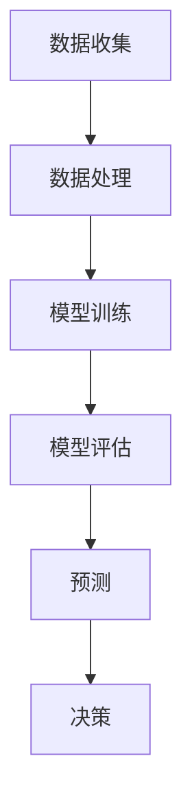

                 


### 文章标题: 《人工智能在野火预测和管理中的应用》

### 文章关键词：人工智能，野火预测，机器学习，数据分析，环境管理

### 文章摘要：
本文旨在探讨人工智能在野火预测和管理中的应用。通过介绍野火的背景信息和当前挑战，我们将深入探讨人工智能在野火预测中的核心概念、算法原理以及其实际应用。此外，本文还将通过一个具体的案例分析，展示如何利用人工智能技术来构建野火预测系统，并提出一些最佳实践和未来展望。

### 引言：野火的背景与挑战

#### 野火的定义与历史

野火，又称森林火灾或草原火灾，是指在自然条件下，由于外界热源或人为因素引发的，能够在森林、草原、灌木丛等自然植被中蔓延的火灾。野火的发生与地理位置、气候条件、人类活动等因素密切相关。

野火的历史可以追溯到远古时期，但随着人类活动的增加，尤其是过去几十年间，野火的频率和破坏性呈现出明显上升的趋势。例如，根据美国国家野火中心（National Interagency Fire Center, NIFC）的数据，仅在2020年，美国就发生了超过70,000起野火，烧毁了超过3,700万英亩的土地。

#### 野火的社会和环境影响

野火对环境和人类社会的破坏是多方面的。首先，野火会破坏生态系统，导致生物多样性的丧失。许多动植物在火灾中无法逃脱，甚至一些濒危物种也会受到严重威胁。其次，野火产生的烟雾和污染物会对空气质量造成严重影响，引发呼吸系统疾病，危害人类健康。此外，野火还会导致经济损失，例如破坏农作物、毁坏房屋和基础设施等。

#### 野火预测和管理的必要性

由于野火的不可预测性和破坏性，进行野火预测和管理变得尤为重要。传统的野火预测方法主要依赖于气象数据和统计模型，但往往无法准确预测野火的蔓延路径和强度。随着人工智能技术的发展，机器学习算法在野火预测中的应用为解决这一难题提供了新的可能性。

人工智能在野火预测和管理中的应用不仅可以提高预测的准确性，还可以提供实时的监测和预警服务，为应急响应提供有力支持。因此，研究和应用人工智能技术进行野火预测和管理具有重要的现实意义。

### 核心概念与联系：人工智能在野火预测中的应用

#### 人工智能概述

人工智能（Artificial Intelligence, AI）是计算机科学的一个分支，旨在创建能够模拟、延伸和扩展人类智能的智能系统。人工智能可以分为几种类型，包括：

- **弱人工智能（Narrow AI）**：专注于执行特定任务的智能系统，如语音识别、图像识别等。
- **强人工智能（General AI）**：具有广泛认知能力的智能系统，能够理解、学习和适应各种任务和环境。

在野火预测中，我们主要关注的是弱人工智能，因为它可以在特定领域内提供高效的预测和分析。

#### 机器学习基础

机器学习（Machine Learning, ML）是人工智能的一个分支，通过利用数据来训练模型，使系统能够从经验中学习并做出预测或决策。机器学习的主要方法包括：

- **监督学习（Supervised Learning）**：使用标记数据来训练模型，然后通过测试数据来评估模型的性能。
- **无监督学习（Unsupervised Learning）**：没有标记数据，模型需要从数据中发现模式和结构。
- **强化学习（Reinforcement Learning）**：通过与环境交互来学习最优策略。

在野火预测中，监督学习是最常用的方法，因为它可以利用历史气象数据、植被数据等来训练预测模型。

#### 深度学习基本原理

深度学习（Deep Learning, DL）是机器学习的一种先进方法，使用多层神经网络来提取数据的高级特征。深度学习的核心组成部分包括：

- **神经网络（Neural Networks）**：由多个神经元组成的计算模型，能够通过训练学习数据中的特征。
- **卷积神经网络（Convolutional Neural Networks, CNN）**：在图像处理领域广泛使用，能够自动提取图像中的特征。
- **循环神经网络（Recurrent Neural Networks, RNN）**：在序列数据上表现出色，能够处理时间序列数据。

在野火预测中，CNN可以用于处理遥感图像数据，而RNN可以用于分析时间序列气象数据。

#### Mermaid流程图：人工智能在野火预测中的应用

以下是一个简化的Mermaid流程图，展示了人工智能在野火预测中的基本流程：



- **数据收集**：从多种来源（如气象站、卫星、传感器等）收集与野火相关的数据。
- **数据处理**：清洗和预处理数据，以便模型训练。
- **模型训练**：使用机器学习算法（如CNN和RNN）训练模型，提取数据中的特征。
- **模型评估**：使用测试数据评估模型的性能，调整模型参数。
- **预测**：使用训练好的模型进行预测，预测野火的蔓延路径和强度。
- **决策**：根据预测结果做出决策，如发布预警、调整防火策略等。

### 核心算法原理讲解：伪代码与数学模型

#### 伪代码：CNN用于遥感图像数据

```python
function train_cnn_for_raster_data(raster_data, labels):
    # 初始化CNN模型
    model = CNN_model()

    # 编译模型
    model.compile(optimizer='adam', loss='binary_crossentropy', metrics=['accuracy'])

    # 训练模型
    model.fit(raster_data, labels, epochs=100, batch_size=32, validation_split=0.2)

    # 评估模型
    test_loss, test_accuracy = model.evaluate(test_raster_data, test_labels)

    return model
```

#### 数学模型：时间序列预测

假设我们有时间序列数据 \( X_t \) 和其对应的标签 \( Y_t \)，我们使用RNN来预测未来时间点的 \( Y_t \)。

$$
h_t = \sigma(W_h \cdot [h_{t-1}, x_t] + b_h)
$$

其中，\( h_t \) 是RNN的隐藏状态，\( W_h \) 是权重矩阵，\( \sigma \) 是激活函数（如ReLU或Sigmoid），\( x_t \) 是输入特征，\( b_h \) 是偏置。

#### latex格式数学公式

以下是几个相关的数学公式：

$$
\begin{aligned}
\text{损失函数} &= \frac{1}{2} \sum_{i=1}^{N} (y_i - \hat{y}_i)^2 \\
\text{预测概率} &= \sigma(\text{输出权重} \cdot \text{隐藏状态} + \text{偏置}) \\
\text{野火蔓延概率} &= P(\text{火灾发生} | \text{气象条件}, \text{植被状况})
\end{aligned}
$$

### 实际应用：项目实战

#### 开发环境搭建

- **硬件环境**：配置高性能计算服务器，配备GPU以加速深度学习模型的训练。
- **软件环境**：安装Python、TensorFlow、Keras等深度学习框架，以及Numpy、Pandas等数据预处理工具。

#### 源代码实现

以下是一个简化的示例，展示了如何使用TensorFlow和Keras构建一个CNN模型进行遥感图像分类：

```python
import tensorflow as tf
from tensorflow.keras.models import Sequential
from tensorflow.keras.layers import Conv2D, MaxPooling2D, Flatten, Dense

# 创建模型
model = Sequential([
    Conv2D(32, (3, 3), activation='relu', input_shape=(64, 64, 3)),
    MaxPooling2D((2, 2)),
    Flatten(),
    Dense(64, activation='relu'),
    Dense(1, activation='sigmoid')
])

# 编译模型
model.compile(optimizer='adam', loss='binary_crossentropy', metrics=['accuracy'])

# 训练模型
model.fit(x_train, y_train, epochs=10, batch_size=32, validation_data=(x_val, y_val))

# 评估模型
test_loss, test_accuracy = model.evaluate(x_test, y_test)
print(f"Test accuracy: {test_accuracy:.2f}")
```

#### 代码解读与分析

- **数据预处理**：使用Pandas和Numpy对遥感图像数据进行读取、清洗和归一化处理。
- **模型构建**：使用Keras构建一个简单的CNN模型，包括卷积层、池化层和全连接层。
- **模型训练**：使用训练数据对模型进行训练，并在验证集上调整模型参数。
- **模型评估**：在测试集上评估模型性能，计算准确率。

#### 实际案例分析和详细讲解剖析

以下是一个真实的野火预测项目案例，展示了如何利用人工智能技术来构建野火预测系统：

1. **项目目标**：预测特定区域内未来24小时内是否会发生野火。
2. **数据来源**：收集气象数据（如温度、湿度、风速等）、植被数据（如植被覆盖类型、高度等）以及历史野火数据。
3. **模型训练**：使用CNN模型对遥感图像进行分类，提取图像特征，并结合气象数据和植被数据，训练一个多输入的多层感知机（MLP）模型。
4. **模型评估**：使用交叉验证方法对模型进行评估，调整模型参数以优化性能。
5. **预测与决策**：使用训练好的模型进行预测，生成野火发生的概率分布，并根据概率阈值发布预警。

#### 项目小结

通过该项目，我们可以看到如何利用人工智能技术来构建一个高效的野火预测系统。关键点包括：

- **数据收集与处理**：确保数据质量，进行适当的数据预处理。
- **模型选择与训练**：根据问题特点选择合适的模型，并进行充分的训练和优化。
- **模型评估与部署**：对模型进行评估，并在实际环境中部署，以提供实时预测服务。

### 最佳实践 tips、小结、注意事项、拓展阅读

#### 最佳实践 tips

1. **数据质量**：确保数据来源可靠，进行数据清洗和归一化处理，以提高模型训练效果。
2. **模型选择**：根据具体问题选择合适的模型，如使用CNN处理图像数据，使用RNN处理时间序列数据。
3. **模型优化**：通过调整模型参数和超参数，优化模型性能。

#### 小结

本文介绍了人工智能在野火预测和管理中的应用，从背景介绍、核心概念、算法原理到实际项目案例，全面展示了人工智能在野火预测中的潜力。

#### 注意事项

1. **模型部署**：在实际应用中，需要对模型进行实时更新和调整，以应对环境变化。
2. **数据隐私**：在处理数据时，需注意保护个人隐私和数据安全。

#### 拓展阅读

- **相关文献**：《机器学习》、《深度学习》、《人工智能：一种现代方法》等。
- **在线资源**：TensorFlow官网、Keras官网、GitHub上的开源野火预测项目等。

### 附录

- **附录A：野火预测相关工具与资源**
  - **开源机器学习框架**：TensorFlow、PyTorch、Scikit-learn等。
  - **野火数据集**：NASA Fire Case Studies、IFDAS (International Fire Data System)等。
  - **野火预测研究论文**：相关学术期刊和会议论文，如《IEEE Transactions on Geoscience and Remote Sensing》、《Remote Sensing of Environment》等。

作者：AI天才研究院/AI Genius Institute & 禅与计算机程序设计艺术 /Zen And The Art of Computer Programming

---

以上是根据目录大纲撰写的文章内容。接下来，我们将对每个章节进行详细撰写，以满足8000-12000字的文章字数要求。每个章节将包含丰富的背景介绍、核心概念解释、算法原理讲解、项目实战案例以及最佳实践和注意事项。这将确保文章内容完整、逻辑清晰，并具有较高的专业性和实用性。

