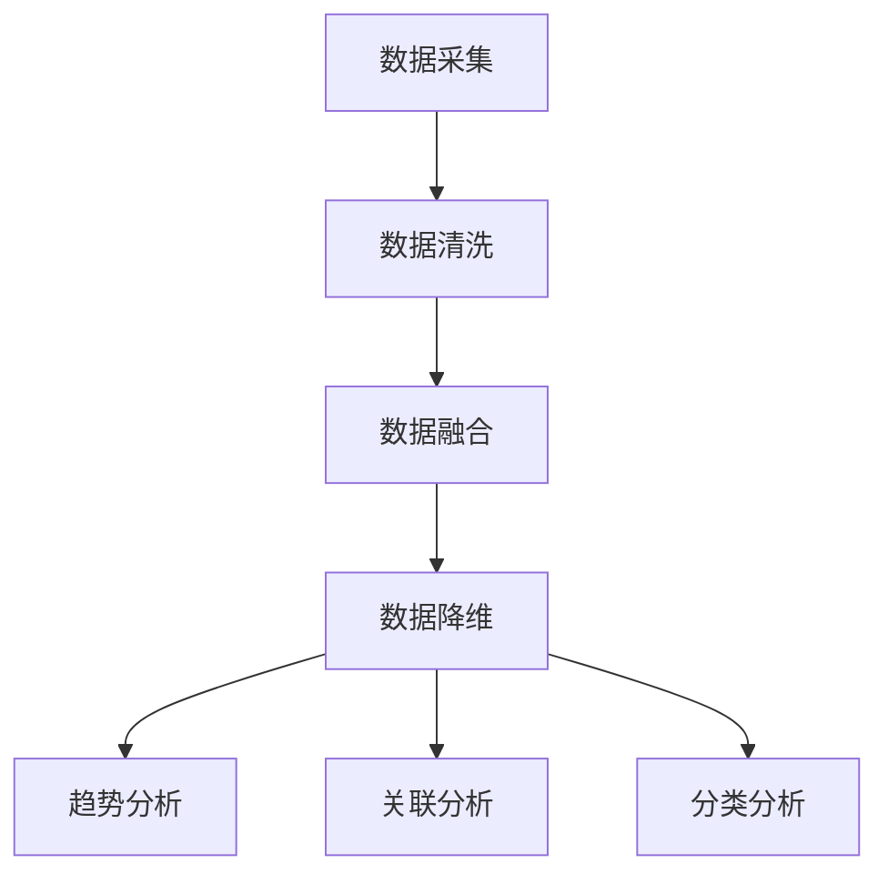
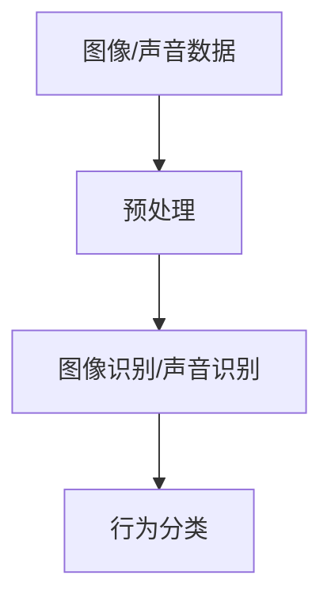
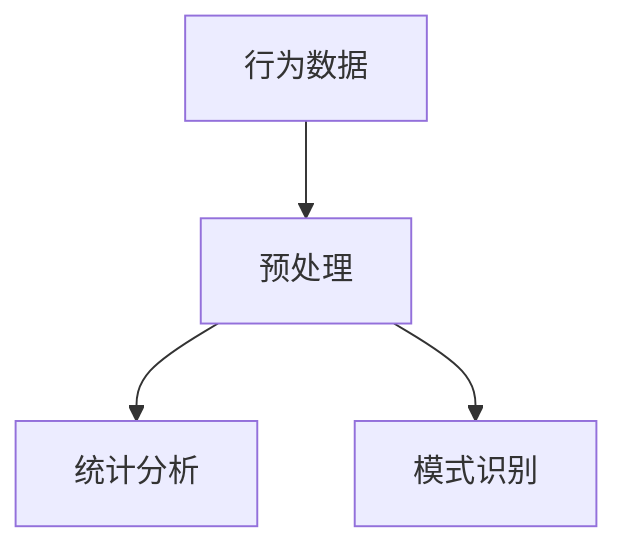
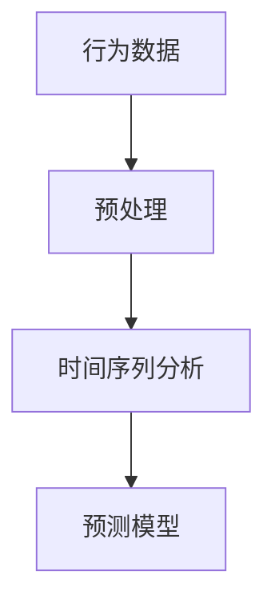
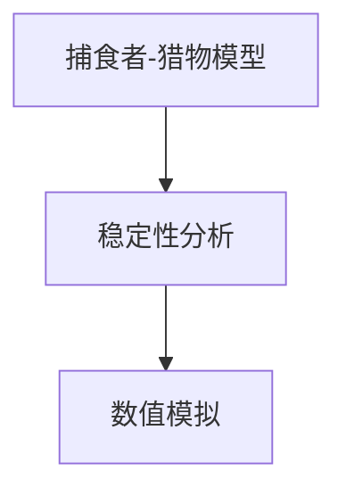
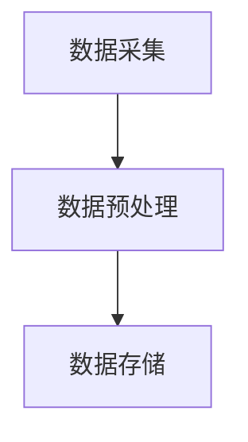
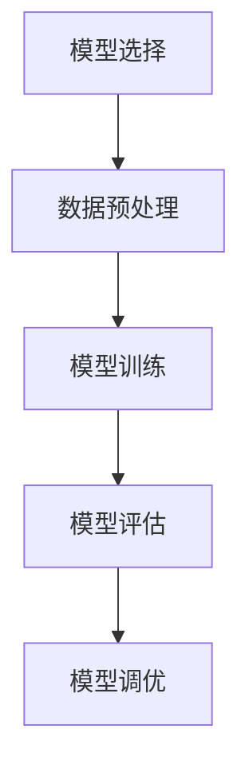
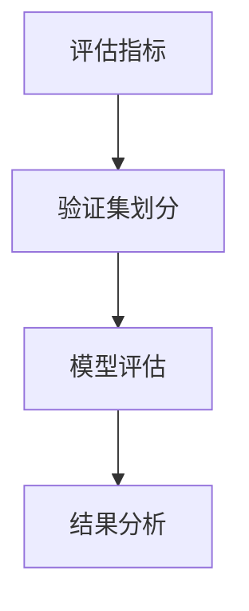

                 

### 文章标题

### 人工智能在野生动物保护中的应用

#### 关键词：
- 人工智能
- 野生动物保护
- 监测与追踪
- 数据分析
- 深度学习

#### 摘要：
本文将深入探讨人工智能技术在野生动物保护中的应用，涵盖从基础概念到实际应用的各个方面。通过介绍人工智能的核心概念，我们将其与野生动物保护领域结合，探讨如何利用机器学习、深度学习等技术实现监测、环境分析、行为学研究和捕食者-猎物关系建模。文章还将通过案例分析，展示人工智能在野生动物保护中的成功实践，并提出未来展望与挑战。

---

## 引言

野生动物保护是一个全球性的挑战，涉及生态平衡、物种多样性和人类福祉等多个方面。随着人类活动的不断扩展，野生动植物的生存环境受到严重威胁。传统的野生动物保护方法往往依赖于人工监测和实地调查，效率低且成本高昂。近年来，人工智能技术的迅猛发展为其提供了新的解决方案。

人工智能（AI）是一种模拟人类智能行为的计算机系统，具有学习、推理、感知和自适应能力。在野生动物保护中，人工智能可以用于数据采集、处理和分析，实现高效的监测与追踪、环境分析、行为学研究以及捕食者-猎物关系建模。这些应用不仅提高了野生动物保护的效率和准确性，还为科学家和环保工作者提供了全新的研究手段。

本文将按照以下结构展开：

1. **基础概念**：介绍人工智能的基本概念和野生动物保护的基本知识。
2. **人工智能在野生动物保护中的应用**：详细探讨人工智能在监测与追踪、环境分析、行为学研究和捕食者-猎物关系建模方面的应用。
3. **技术实现**：讨论数据采集和处理、模型选择和训练、算法评估等技术实现细节。
4. **案例分析**：分析国际和本土成功的野生动物保护AI项目。
5. **未来展望**：展望新技术趋势和面临的挑战，提出未来研究方向和实际应用建议。
6. **结论与建议**：总结文章的主要观点，提出建议。

### 基础概念

#### 人工智能的基本概念

人工智能是一门交叉学科，涉及计算机科学、心理学、认知科学和神经科学等多个领域。其目标是创建能够执行复杂任务、具有智能行为的计算机系统。人工智能可以分为弱人工智能和强人工智能。

- **弱人工智能**：也称为狭义人工智能，是指能够执行特定任务的智能系统。例如，智能助手、自动驾驶汽车和语音识别系统等。
- **强人工智能**：也称为通用人工智能，是指具有与人类智能相似或超越人类智能的计算机系统。强人工智能能够在各种领域执行复杂的任务，目前尚未实现。

#### 野生动物保护的基本知识

野生动物保护是指通过各种手段保护野生动植物的生存环境和栖息地，以确保生物多样性。其主要目标包括：

- **栖息地保护**：保护野生动植物的栖息地，防止栖息地破坏和退化。
- **物种保护**：保护濒危和灭绝的物种，防止物种灭绝。
- **生态平衡**：维持生态系统的稳定和平衡，确保物种之间的相互关系。

野生动物保护方法主要包括：

- **监测与调查**：通过实地调查和监测，了解野生动植物的种群数量、分布和生境状况。
- **栖息地恢复**：通过人工干预，恢复退化或破坏的栖息地。
- **法律法规**：制定和实施相关法律法规，保护野生动植物和栖息地。
- **公众参与**：提高公众的环保意识，鼓励公众参与野生动物保护活动。

### 人工智能在野生动物保护中的应用

#### 监测与追踪

监测与追踪是野生动物保护中的重要环节，人工智能技术在这一领域发挥了重要作用。

##### 智能监测系统

智能监测系统通常包括传感器、摄像头、GPS等设备，能够实时收集野生动物的活动数据。传感器可以检测温度、湿度、光照等环境参数，摄像头可以捕捉野生动物的活动图像，GPS可以记录动物的位置信息。

##### 追踪算法

追踪算法是监测与追踪的关键，常用的算法包括粒子滤波、卡尔曼滤波和深度学习等。

- **粒子滤波**：通过在概率空间中随机采样粒子，实现对目标位置的估计。适用于动态环境，但计算复杂度高。
- **卡尔曼滤波**：通过递归地更新估计值和误差协方差矩阵，实现对目标位置的精确估计。适用于线性系统，计算复杂度较低。
- **深度学习**：通过构建深度神经网络，实现自动的目标检测和跟踪。适用于复杂环境，但需要大量训练数据和计算资源。

以下是一个简单的追踪算法伪代码：

```python
# 初始化目标位置和速度
x_hat_0 = x_0
P_0 = P_0

# 递归更新
for k in range(1, T):
    # 预测
    x_hat_k|k-1 = f(x_hat_{k-1}|k-1, u_k)
    P_k|k-1 = F_k|k-1 * P_{k-1}|k-1 * F_k|k-1' + Q_k

    # 更新
    z_k = h(x_hat_k|k)
    K_k = P_k|k-1 * H_k' * (H_k * P_k|k-1 * H_k' + R_k)^(-1)
    x_hat_k|k = x_hat_k|k-1 + K_k * (z_k - h(x_hat_k|k-1))
    P_k|k = (I - K_k * H_k) * P_k|k-1
```

其中，`x_hat_k|k-1`表示预测的位置，`P_k|k-1`表示预测位置的协方差矩阵，`f`表示状态转移模型，`z_k`表示观测值，`h`表示观测模型，`K_k`表示卡尔曼增益，`I`表示单位矩阵，`Q_k`和`R_k`分别表示过程噪声和观测噪声。

#### 环境分析

环境分析是野生动物保护的重要一环，人工智能技术可以用于环境数据的采集、处理和分析。

##### 数据采集

环境数据包括气象数据、土壤数据、植被数据等，可以通过传感器、无人机、卫星等设备进行采集。

##### 数据处理

环境数据处理包括数据清洗、数据融合、数据降维等步骤。

- **数据清洗**：去除噪声和异常值，提高数据质量。
- **数据融合**：将多个数据源的信息进行整合，形成更全面的环境数据。
- **数据降维**：通过降维算法，将高维数据映射到低维空间，便于分析和建模。

##### 数据分析

环境数据分析包括趋势分析、关联分析、分类分析等。

- **趋势分析**：分析环境数据的长期趋势，了解环境变化规律。
- **关联分析**：分析环境数据之间的关联关系，发现潜在的因果关系。
- **分类分析**：将环境数据分为不同的类别，用于预测和决策。

以下是一个简单的环境数据分析流程：



#### 动物行为学

动物行为学是研究动物行为的科学，人工智能技术可以用于动物行为的检测、分析和预测。

##### 行为检测

行为检测是通过图像识别、声音识别等技术，从图像和声音数据中识别动物的行为。

- **图像识别**：通过深度学习模型，从图像中识别动物的行为。
- **声音识别**：通过声音信号处理，从声音中识别动物的行为。

以下是一个简单的行为检测流程：



##### 行为分析

行为分析是对动物行为的统计分析和模式识别。

- **统计分析**：通过统计分析方法，分析动物行为的分布、变化规律等。
- **模式识别**：通过模式识别方法，发现动物行为中的规律和模式。

以下是一个简单的行为分析流程：



##### 行为预测

行为预测是根据历史行为数据，预测动物未来的行为。

- **时间序列预测**：通过时间序列分析方法，预测动物行为的时间序列。
- **机器学习预测**：通过机器学习方法，构建动物行为预测模型。

以下是一个简单的时间序列预测流程：



#### 捕食者-猎物关系

捕食者-猎物关系是生态系统中重要的相互作用，人工智能技术可以用于捕食者-猎物关系的建模和分析。

##### 动物交互模型

动物交互模型描述了捕食者和猎物之间的相互作用关系。常见的动物交互模型包括捕食者-猎物模型、竞争模型、共生模型等。

- **捕食者-猎物模型**：描述捕食者捕食猎物，猎物数量减少，捕食者数量增加的过程。
- **竞争模型**：描述捕食者和猎物之间的竞争关系，竞争双方的数量在一定范围内波动。
- **共生模型**：描述捕食者和猎物之间的互利共生关系，两者数量稳定。

以下是一个简单的捕食者-猎物模型：

$$
\begin{cases}
x'(t) = r_1 x(t) - \alpha xy(t) \\
y'(t) = r_2 y(t) - \beta xy(t)
\end{cases}
$$

其中，$x(t)$表示猎物数量，$y(t)$表示捕食者数量，$r_1$和$r_2$分别表示猎物和捕食者的增长率，$\alpha$和$\beta$分别表示捕食者和猎物之间的相互作用系数。

##### 动物行为预测

动物行为预测是根据捕食者-猎物模型，预测捕食者和猎物的未来行为。

- **稳定性分析**：通过稳定性分析，判断捕食者-猎物系统的稳定性。
- **数值模拟**：通过数值模拟，预测捕食者和猎物的数量变化。

以下是一个简单的稳定性分析流程：



### 技术实现

#### 数据采集和处理

数据采集和处理是人工智能在野生动物保护中的基础，主要包括以下步骤：

1. **数据采集**：通过传感器、无人机、卫星等设备，采集野生动物的活动数据、环境数据和行为数据。
2. **数据预处理**：对采集到的数据进行清洗、去噪、融合等处理，提高数据质量。
3. **数据存储**：将预处理后的数据存储到数据库或数据湖中，便于后续分析和建模。

以下是一个简单的数据采集和处理流程：



#### 模型选择和训练

模型选择和训练是人工智能在野生动物保护中的关键，主要包括以下步骤：

1. **模型选择**：根据问题的性质和数据特点，选择合适的模型，如深度学习模型、统计模型等。
2. **数据预处理**：对采集到的数据进行预处理，如归一化、标准化、缺失值填充等。
3. **模型训练**：使用预处理后的数据，训练模型参数，优化模型性能。
4. **模型评估**：使用验证数据集，评估模型的性能，如准确率、召回率、F1值等。
5. **模型调优**：根据评估结果，调整模型参数，提高模型性能。

以下是一个简单的模型选择和训练流程：



#### 算法评估

算法评估是评估人工智能模型性能的重要环节，主要包括以下步骤：

1. **评估指标**：选择合适的评估指标，如准确率、召回率、F1值、均方误差等。
2. **验证集划分**：将数据集划分为训练集和验证集，用于训练和评估模型。
3. **模型评估**：使用验证集，评估模型的性能。
4. **结果分析**：分析评估结果，找出模型的优势和不足，为模型优化提供依据。

以下是一个简单的算法评估流程：



### 案例分析

#### 国际成功的野生动物保护AI项目

1. **猫头鹰监测项目**：在加拿大，研究人员利用无人机和人工智能技术，监测猫头鹰的栖息地和繁殖情况。通过图像识别算法，识别猫头鹰的巢穴和活动区域，为保护猫头鹰提供了重要数据支持。

2. **大象追踪项目**：在非洲，研究人员利用GPS和人工智能技术，追踪大象的活动轨迹和迁徙路径。通过深度学习算法，分析大象的行为模式，为保护大象提供了科学依据。

#### 本土实践与挑战

1. **长江江豚监测项目**：在中国，研究人员利用无人机和人工智能技术，监测长江江豚的数量和分布。通过图像识别算法，识别江豚的个体和活动区域，为保护长江江豚提供了重要数据支持。

2. **华南虎追踪项目**：在中国，研究人员利用GPS和人工智能技术，追踪华南虎的活动轨迹和栖息地。通过深度学习算法，分析华南虎的行为模式，为保护华南虎提供了科学依据。

本土实践面临的挑战主要包括：

1. **数据不足**：由于野生动物保护工作在野外进行，数据采集困难，数据量有限。
2. **技术限制**：人工智能技术在野生动物保护中的应用还处于初步阶段，技术手段有限。
3. **成本问题**：人工智能技术在野生动物保护中的应用需要大量的资金投入，成本较高。

### 未来展望

#### 新技术趋势

1. **无人机与机器人技术**：无人机和机器人技术在野生动物保护中的应用将越来越广泛，用于监测、追踪和调查。
2. **大数据与云计算**：大数据和云计算技术将为野生动物保护提供强大的计算能力和数据存储能力。
3. **区块链技术**：区块链技术可以用于野生动物保护的溯源和监管，确保数据的真实性和透明性。

#### 面临的挑战与解决方案

1. **数据不足**：解决方案包括增加数据采集设备、提高数据采集频率、开展跨学科合作等。
2. **技术限制**：解决方案包括加强技术研发、提高算法性能、降低技术成本等。
3. **成本问题**：解决方案包括政府和社会资金支持、技术创新降低成本、社会公众参与等。

### 结论与建议

人工智能在野生动物保护中的应用具有广阔的前景，通过监测、追踪、环境分析和行为研究，可以有效地保护野生动植物的生存环境。然而，在实际应用中，仍面临数据不足、技术限制和成本问题等挑战。未来，需要加强技术研发、提高数据采集和处理能力、降低技术成本，同时加大政府和社会资金支持，推动人工智能技术在野生动物保护中的应用。通过跨学科合作和社会公众参与，共同保护地球上的野生动植物，实现可持续发展。作者：AI天才研究院/AI Genius Institute & 禅与计算机程序设计艺术 /Zen And The Art of Computer Programming

---

本文从人工智能的基本概念、野生动物保护的基本知识出发，详细介绍了人工智能在野生动物保护中的应用，包括监测与追踪、环境分析、动物行为学和捕食者-猎物关系建模等方面。通过实际案例分析和未来展望，展示了人工智能技术在野生动物保护中的巨大潜力和面临的挑战。希望本文能为读者提供对人工智能在野生动物保护领域应用的全面了解，并激发更多研究和实践。作者：AI天才研究院/AI Genius Institute & 禅与计算机程序设计艺术 /Zen And The Art of Computer Programming

