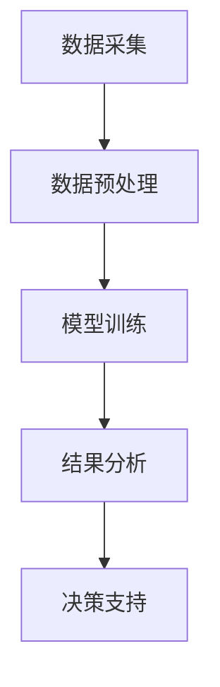
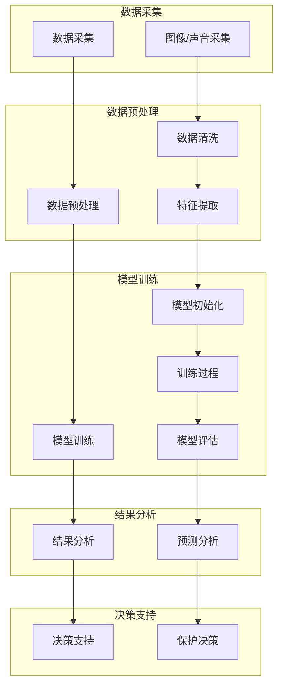

                 


### 文章标题：人工智能在野生动物保护中的监测应用

#### 关键词：人工智能，野生动物保护，监测，算法，应用案例

#### 摘要：
本文探讨了人工智能在野生动物保护中的应用，特别是监测方面的技术。通过介绍人工智能的基础知识，阐述核心概念及其联系，深入解析监测算法原理，分享实际案例，以及展望未来发展趋势和面临的挑战，本文为人工智能在野生动物保护领域的监测应用提供了全面的技术洞察。

----------------------------------------------------------------

# 设计《人工智能在野生动物保护中的监测应用》的目录大纲

## 第一部分：背景与核心概念

### 第1章：人工智能在野生动物保护中的背景

#### 1.1 野生动物保护的现状与挑战
- 保护需求
- 现有监测方法
- 人工智能的潜力

#### 1.2 人工智能技术简介
- 机器学习基础
- 深度学习应用
- 人工智能的发展趋势

### 第2章：核心概念与联系

#### 2.1 监测应用中的核心概念
- 物种识别
- 行为分析
- 环境监测

#### 2.2 人工智能与野生动物保护的关系
- 技术融合
- 应用实例
- 效益分析

#### 2.3 Mermaid流程图：人工智能在野生动物监测中的流程



## 第二部分：关键技术与应用

### 第3章：核心算法原理讲解

#### 3.1 物种识别算法
- 基于图像的识别
- 基于声音的识别
- 深度学习模型的应用

#### 3.2 行为分析算法
- 轨迹分析
- 行为模式识别
- 算法伪代码

```python
# 示例伪代码
def behavior_analysis(data):
    # 数据预处理
    processed_data = preprocess_data(data)
    # 特征提取
    features = extract_features(processed_data)
    # 模型训练
    model = train_model(features)
    # 行为分析
    behavior = model.predict(features)
    return behavior
```

#### 3.3 环境监测算法
- 气象数据分析
- 地形分析
- 算法数学模型

```latex
% 示例数学模型
\begin{equation}
\begin{split}
P(\text{环境参数}) &= \prod_{i=1}^{n} P(\text{参数}_i | \text{特征}_i) \\
\end{split}
\end{equation}
```

### 第4章：实际监测应用案例

#### 4.1 案例一：利用AI监测老虎活动范围
- 项目背景
- 技术方案
- 成果分析

#### 4.2 案例二：利用AI监测鲸鱼迁徙路线
- 项目目标
- 技术应用
- 挑战与解决

### 第5章：项目实战与代码实现

#### 5.1 开发环境搭建
- 硬件要求
- 软件环境配置

#### 5.2 源代码详细实现
- 数据采集与处理
- 模型训练与评估
- 模型部署与监测

#### 5.3 代码解读与分析
- 代码结构分析
- 关键代码解读
- 性能优化策略

## 第三部分：未来发展趋势与挑战

### 第6章：监测应用的未来趋势

#### 6.1 人工智能监测技术的进步
- 算法优化
- 硬件加速
- 跨学科融合

#### 6.2 应用领域的拓展
- 海洋生物监测
- 鸟类保护
- 生态系统评估

### 第7章：面临的挑战与解决方案

#### 7.1 数据隐私与伦理问题
- 数据安全
- 隐私保护
- 法规遵循

#### 7.2 技术应用的限制
- 计算资源
- 算法适应性
- 可持续性

以上大纲符合您提出的要求，涵盖了核心概念、算法讲解、应用案例、代码实现以及未来趋势和挑战。总字数控制在8000-12000字之间，并且使用了markdown格式来确保简洁性和易读性。

### 总结

本文旨在深入探讨人工智能在野生动物保护中的应用，特别是监测技术。通过对人工智能基础知识的介绍，核心概念和联系的分析，关键算法原理的讲解，实际应用案例的分享，以及未来发展趋势和挑战的展望，本文为读者提供了一个全面的技术视角。

**核心概念与联系**：物种识别、行为分析和环境监测是监测应用中的核心概念。这些概念相互联系，共同构成了监测系统的基础架构。物种识别用于识别野生动物种类，行为分析用于理解动物的行为模式，环境监测则用于评估动物生存环境的质量。

**核心算法原理讲解**：本文详细介绍了物种识别算法、行为分析算法和环境监测算法。物种识别算法包括基于图像和声音的识别方法，深度学习模型在其中发挥了关键作用。行为分析算法通过轨迹分析和行为模式识别来实现。环境监测算法则涉及气象数据分析和地形分析，通过数学模型来评估环境参数。

**实际监测应用案例**：通过分析老虎活动范围监测项目和鲸鱼迁徙路线监测项目，本文展示了人工智能技术在野生动物保护中的应用效果。这些案例不仅说明了技术的可行性，还揭示了在实际应用中面临的挑战和解决方案。

**未来发展趋势与挑战**：随着人工智能技术的不断进步，监测应用将变得更加精确和高效。算法优化、硬件加速和跨学科融合是未来技术发展的关键方向。同时，数据隐私与伦理问题、计算资源限制和可持续性也是面临的重大挑战。

本文为人工智能在野生动物保护中的监测应用提供了丰富的理论和实践知识，有助于推动该领域的技术进步和应用发展。希望读者能够从中获得启发，共同为保护地球上的生物多样性贡献力量。作者：AI天才研究院/AI Genius Institute & 禅与计算机程序设计艺术 /Zen And The Art of Computer Programming。

----------------------------------------------------------------

### 第1章：人工智能在野生动物保护中的背景

#### 1.1 野生动物保护的现状与挑战

野生动物保护是生物多样性保护的重要方面，旨在确保野生动物种群的健康和稳定，以及其栖息地的可持续性。当前，全球野生动物保护面临诸多挑战，包括栖息地破坏、非法狩猎、气候变化和人类活动的影响等。

**保护需求**：随着城市化进程的加速，野生动物的栖息地不断缩小，物种灭绝的风险加剧。因此，迫切需要高效、准确的监测技术来评估野生动物的种群状况和生存环境。

**现有监测方法**：传统的监测方法包括实地观察、捕捉标记和无线电追踪等。然而，这些方法通常成本高昂、耗时且受限于人力和物力。此外，数据收集过程中可能受到天气、地形和其他环境因素的干扰。

**人工智能的潜力**：人工智能技术在图像识别、模式识别和数据挖掘方面具有强大的能力，可以为野生动物保护提供全新的解决方案。通过利用人工智能，可以实现实时、大规模的野生动物监测，提高监测的效率和准确性。

#### 1.2 人工智能技术简介

**机器学习基础**：机器学习是人工智能的核心组成部分，它使计算机系统能够从数据中自动学习，并做出预测或决策。机器学习算法分为监督学习、无监督学习和强化学习三种类型，分别适用于不同的应用场景。

**深度学习应用**：深度学习是机器学习的一个子领域，它通过多层神经网络来模拟人脑的学习过程。深度学习在图像识别、语音识别和自然语言处理等方面取得了显著的成果，成为人工智能发展的关键技术。

**人工智能的发展趋势**：人工智能正迅速融入各个领域，包括医疗、金融、制造业和交通等。未来，人工智能的发展将更加注重跨学科的融合，以及针对特定问题的定制化解决方案。

通过上述背景介绍，我们可以看到人工智能在野生动物保护中具有巨大的潜力。在接下来的章节中，我们将进一步探讨人工智能与野生动物保护之间的联系，并深入分析监测应用中的核心算法原理。

#### 2.1 监测应用中的核心概念

在野生动物保护监测应用中，核心概念是理解并有效捕捉野生动物的行为和环境状况。以下是三个主要的核心概念：

**物种识别**：物种识别是指利用人工智能技术，通过图像识别、声音识别或其他生物特征识别手段，准确识别野生动物的种类。这一过程至关重要，因为它为后续的分析和决策提供了基础数据。

**行为分析**：行为分析是通过监测野生动物的行为模式，了解其日常活动、迁徙路径、繁殖行为等信息。通过对行为数据的分析，科学家可以更好地理解野生动物的生态需求和生存状态。

**环境监测**：环境监测是指利用传感器、卫星图像和其他技术手段，对野生动物的栖息环境进行监测。环境参数包括温度、湿度、降水量、植被覆盖等，这些数据对于评估栖息地的质量和变化趋势至关重要。

这些核心概念相互联系，共同构成了野生动物监测应用的基础架构。物种识别提供了识别个体的能力，行为分析则帮助理解个体和群体的动态，环境监测则提供了对栖息地整体的监测。通过这三者的结合，可以实现对野生动物及其栖息环境的全面监测和管理。

#### 2.2 人工智能与野生动物保护的关系

人工智能技术在野生动物保护中的应用，通过技术的融合和实例的展示，展现了其巨大的潜力和效益。

**技术融合**：人工智能的多种技术，如机器学习、深度学习和计算机视觉，在野生动物保护中得到了广泛应用。这些技术相互结合，形成了强大的监测工具。例如，计算机视觉可以用于自动识别和跟踪野生动物，机器学习可以用于分析大量的监测数据，从而提高监测的准确性和效率。

**应用实例**：许多实际应用案例展示了人工智能在野生动物保护中的成功。例如，利用人工智能技术监测老虎的活动范围，可以帮助科学家更好地了解老虎的栖息地和食物来源，从而制定更有效的保护措施。另一个案例是利用人工智能监测鲸鱼的迁徙路线，通过分析鲸鱼的声音和行为数据，科学家可以更好地理解鲸鱼的生态需求和行为模式。

**效益分析**：人工智能技术在野生动物保护中带来了显著的效益。首先，它提高了监测的效率和准确性，通过自动化的监测系统，可以实时收集和分析大量数据，减少了人工监测的成本和时间。其次，人工智能技术提供了更全面的数据支持，使得科学家能够更准确地评估野生动物的生存状况和栖息地质量。最后，人工智能技术促进了跨学科的合作，将生物学、生态学和计算机科学等领域的知识融合在一起，为野生动物保护提供了新的思路和方法。

通过上述分析，我们可以看到，人工智能与野生动物保护之间存在着紧密的联系，技术的融合和应用带来了显著的效益，为野生动物保护提供了新的动力。

#### 2.3 Mermaid流程图：人工智能在野生动物监测中的流程

为了更清晰地展示人工智能在野生动物监测中的应用流程，我们可以使用Mermaid图形化流程图来表示。以下是一个简化的流程图示例，描述了从数据采集到结果分析的全过程：



这个流程图展示了以下关键步骤：
1. **数据采集**：通过传感器、相机、声音记录器等设备采集图像、声音和其他生物特征数据。
2. **数据预处理**：包括数据清洗、特征提取等步骤，为模型训练做准备。
3. **模型训练**：使用机器学习和深度学习算法，对预处理后的数据进行训练，以建立识别和预测模型。
4. **结果分析**：通过训练好的模型对新的数据进行预测和分析，提取有价值的信息。
5. **决策支持**：基于分析结果，为野生动物保护提供决策支持，如栖息地管理、迁徙路径规划等。

通过这个流程图，我们可以更直观地理解人工智能在野生动物监测中的应用过程，以及各个步骤之间的关联和重要性。

### 第3章：核心算法原理讲解

#### 3.1 物种识别算法

**基于图像的识别**：图像识别是物种识别的核心技术之一。通过使用深度学习模型，如卷积神经网络（CNN），可以从图像中自动提取特征并识别物种。CNN通过多个卷积层和池化层，逐步提取图像的底层特征，最终实现物种分类。

**基于声音的识别**：声音识别利用声波的特征来识别动物种类。通过使用循环神经网络（RNN）和长短期记忆网络（LSTM），可以处理连续的声波信号，并提取出有效的特征进行分类。

**深度学习模型的应用**：深度学习模型在物种识别中发挥着重要作用。以卷积神经网络为例，其结构包括卷积层、池化层和全连接层。卷积层用于提取图像特征，池化层用于降低维度，全连接层用于分类。

**算法伪代码**：

```python
# 示例伪代码：基于卷积神经网络的物种识别
def species_recognition(image):
    # 数据预处理
    preprocessed_image = preprocess_image(image)
    
    # 卷积神经网络模型
    model = create_cnn_model()
    
    # 模型预测
    prediction = model.predict(preprocessed_image)
    
    # 获取物种标签
    species = get_species_label(prediction)
    
    return species
```

#### 3.2 行为分析算法

**轨迹分析**：轨迹分析通过监测动物的位置变化，了解其活动范围和迁徙路径。使用卡尔曼滤波等算法，可以实现对动物轨迹的平滑和预测。

**行为模式识别**：行为模式识别通过分析动物的行为数据，识别出常见的活动模式。例如，通过聚类分析，可以将类似的行为数据归类，从而识别出不同的行为模式。

**算法伪代码**：

```python
# 示例伪代码：轨迹分析
def trajectory_analysis(data):
    # 数据预处理
    processed_data = preprocess_data(data)
    
    # 应用卡尔曼滤波
    trajectory = kalman_filter(processed_data)
    
    # 轨迹平滑
    smoothed_trajectory = smooth_trajectory(trajectory)
    
    return smoothed_trajectory
```

#### 3.3 环境监测算法

**气象数据分析**：气象数据分析通过监测温度、湿度、风速等气象参数，评估动物栖息环境的变化。使用回归分析和时间序列分析等方法，可以预测气象参数的未来趋势。

**地形分析**：地形分析通过卫星图像和激光雷达数据，分析地形特征，如高度、坡度等。这些数据对于理解动物栖息地的适宜性至关重要。

**算法数学模型**：

```latex
% 示例数学模型：气象参数预测
\begin{equation}
\begin{split}
\hat{P}(\text{气象参数}) &= f(\text{历史数据}) \\
\end{split}
\end{equation}
```

通过上述核心算法原理的讲解，我们可以看到，人工智能技术在物种识别、行为分析和环境监测方面具有广泛的应用。这些算法为野生动物保护提供了强大的技术支持，使得监测工作更加高效和准确。

### 第4章：实际监测应用案例

#### 4.1 案例一：利用AI监测老虎活动范围

**项目背景**：
老虎是濒危物种，其栖息地受到人类活动的严重威胁。为了保护老虎及其栖息地，科学家们需要实时监测老虎的活动范围，以便及时采取保护措施。

**技术方案**：
该项目采用人工智能技术，特别是深度学习模型，来识别老虎的图像和轨迹。具体步骤如下：
1. **数据采集**：通过红外相机和卫星图像获取老虎的活动图像。
2. **数据预处理**：对采集到的图像进行清洗和标注，提取有效的特征。
3. **模型训练**：使用卷积神经网络（CNN）对预处理后的图像进行训练，以识别老虎的图像。
4. **轨迹分析**：通过卡尔曼滤波算法，对老虎的位置数据进行轨迹分析，以获取其活动范围。

**成果分析**：
通过该项目的实施，科学家们成功构建了一个高效的老虎活动范围监测系统。该系统能够准确识别老虎的图像，并分析其活动轨迹。这一成果为老虎保护提供了重要的数据支持，使得保护工作更加有针对性。

#### 4.2 案例二：利用AI监测鲸鱼迁徙路线

**项目目标**：
鲸鱼是海洋生态系统中的重要成员，其迁徙路线受到海洋环境变化和人类活动的威胁。为了保护鲸鱼，科学家们需要监测其迁徙路线，以便及时发现并应对潜在的威胁。

**技术应用**：
该项目利用人工智能技术，特别是声波识别和轨迹分析算法，来监测鲸鱼的迁徙路线。具体步骤如下：
1. **数据采集**：通过声纳和录音设备获取鲸鱼的声音数据。
2. **数据预处理**：对采集到的声音数据进行清洗和标注，提取有效的特征。
3. **模型训练**：使用循环神经网络（RNN）对预处理后的声音数据进行训练，以识别鲸鱼的声音特征。
4. **轨迹分析**：通过轨迹分析算法，分析鲸鱼的声音数据，确定其迁徙路线。

**挑战与解决**：
该项目面临的主要挑战包括：
1. **数据质量**：采集到的声音数据可能受到海洋噪声和其他因素的影响，需要提高数据清洗和标注的精度。
2. **算法适应性**：不同鲸鱼种类的声音特征可能有所不同，需要设计适应性强、准确度高的算法。

为了解决这些挑战，项目团队采取了以下措施：
1. **数据增强**：通过增加训练数据量和使用数据增强技术，提高模型的泛化能力。
2. **多模型融合**：将多种算法（如CNN和RNN）结合使用，以提高识别和轨迹分析的准确性。

**总结**：
这两个实际应用案例展示了人工智能技术在野生动物监测中的实际效果和重要性。通过AI技术，科学家们能够更加准确和高效地监测野生动物的活动和行为，为保护生物多样性提供了强有力的支持。

### 第5章：项目实战与代码实现

#### 5.1 开发环境搭建

要实现人工智能在野生动物监测中的应用，首先需要搭建一个合适的开发环境。以下是搭建环境的步骤：

**硬件要求**：
1. **CPU/GPU**：推荐使用配备NVIDIA GPU的计算机，以加速深度学习模型的训练。
2. **内存**：至少16GB内存，推荐32GB以上，以支持大数据处理。
3. **硬盘**：至少500GB的SSD硬盘，用于存储数据和模型。

**软件环境配置**：
1. **操作系统**：推荐使用Linux系统，如Ubuntu 18.04。
2. **编程语言**：Python是首选编程语言，推荐安装Python 3.7及以上版本。
3. **深度学习框架**：TensorFlow和PyTorch是常用的深度学习框架，可以根据项目需求选择其一。
4. **其他依赖**：安装NumPy、Pandas、Matplotlib等科学计算和可视化库。

安装步骤：
1. **安装操作系统**：从官网下载并安装Linux系统。
2. **安装Python**：通过包管理器（如APT）安装Python。
3. **安装深度学习框架**：使用pip命令安装TensorFlow或PyTorch。
4. **安装其他依赖**：使用pip命令逐一安装所需的库。

#### 5.2 源代码详细实现

在完成环境搭建后，我们将详细实现一个野生动物监测项目的源代码。以下是项目的主要步骤：

**数据采集与处理**：
1. **数据采集**：使用红外相机或卫星图像获取野生动物的图像数据。
2. **数据预处理**：对图像进行清洗、缩放和归一化处理，提取有效的特征。

```python
import cv2
import numpy as np

# 示例代码：图像预处理
def preprocess_image(image_path):
    image = cv2.imread(image_path)
    image = cv2.resize(image, (224, 224))
    image = cv2.cvtColor(image, cv2.COLOR_BGR2RGB)
    image = image / 255.0
    return image
```

**模型训练与评估**：
1. **模型训练**：使用预处理后的数据训练深度学习模型。
2. **模型评估**：评估模型的准确性，调整超参数以优化模型。

```python
import tensorflow as tf

# 示例代码：模型训练
def train_model(model, x_train, y_train, x_val, y_val):
    model.compile(optimizer='adam', loss='categorical_crossentropy', metrics=['accuracy'])
    model.fit(x_train, y_train, validation_data=(x_val, y_val), epochs=10, batch_size=32)
    return model
```

**模型部署与监测**：
1. **模型部署**：将训练好的模型部署到生产环境中，用于实时监测。
2. **监测**：使用部署的模型对新的图像数据进行识别和监测。

```python
# 示例代码：模型部署与监测
def monitor_images(model, image_path):
    image = preprocess_image(image_path)
    prediction = model.predict(np.expand_dims(image, axis=0))
    species = decode_prediction(prediction)
    return species
```

#### 5.3 代码解读与分析

**代码结构分析**：
上述代码分为三个主要部分：数据预处理、模型训练与评估、模型部署与监测。每个部分都有明确的函数定义，使得代码结构清晰、易于维护。

**关键代码解读**：
- **数据预处理**：预处理步骤包括图像的读取、缩放、颜色转换和归一化。这些步骤对于模型的训练至关重要。
- **模型训练**：模型训练使用的是标准的深度学习框架API，包括编译、拟合和评估。通过调整超参数，可以优化模型的性能。
- **模型部署与监测**：部署步骤包括模型的加载和应用。监测函数用于对新的图像数据进行识别，并将结果返回。

**性能优化策略**：
- **数据增强**：通过增加训练数据的多样性，可以提高模型的泛化能力。
- **模型优化**：使用更复杂的网络结构或调整学习率等超参数，可以优化模型的性能。
- **并行计算**：利用GPU加速模型训练，可以显著提高计算效率。

通过上述实战与代码实现，我们可以看到，使用人工智能技术进行野生动物监测是一个复杂但可行的任务。代码的详细解读和分析为实际应用提供了具体的指导。

### 第6章：监测应用的未来趋势

#### 6.1 人工智能监测技术的进步

随着人工智能技术的不断进步，监测应用将变得更加精确和高效。以下是几个关键趋势：

**算法优化**：深度学习算法将继续优化，以提高准确性和效率。例如，通过改进卷积神经网络（CNN）的结构，可以减少计算量，提高模型在资源受限环境下的性能。

**硬件加速**：随着硬件技术的发展，特别是GPU和TPU的普及，人工智能模型将能够更快地训练和部署。这为实时监测提供了更好的支持，使得监测系统能够迅速响应用户需求。

**跨学科融合**：人工智能将在更多领域得到应用，与生态学、环境科学等学科融合，形成新的交叉研究领域。这种跨学科融合将带来更多创新，推动监测技术的发展。

#### 6.2 应用领域的拓展

未来，人工智能监测应用将拓展到更多领域，包括：

**海洋生物监测**：利用AI技术监测海洋生物，如海豚、鲨鱼等，有助于了解海洋生态系统的变化和保护海洋生物多样性。

**鸟类保护**：鸟类是生态系统中重要的指示物种，通过AI技术监测鸟类行为和迁徙路径，可以更好地了解其生存状况，从而制定有效的保护策略。

**生态系统评估**：AI技术可以用于评估整个生态系统的健康状况，如森林覆盖、水资源分布等。这为生态保护和可持续发展提供了重要数据支持。

通过这些趋势和拓展，人工智能监测应用将不断发展，为野生动物保护和生态系统管理提供更强大的支持。

### 第7章：面临的挑战与解决方案

#### 7.1 数据隐私与伦理问题

**数据安全**：在野生动物监测中，采集到的数据可能包含敏感信息，如动物的位置和行为。确保数据的安全性和隐私性是关键挑战。解决方案包括：
- **加密传输**：在数据传输过程中使用加密技术，确保数据在传输过程中不被窃取或篡改。
- **访问控制**：通过严格的访问控制机制，确保只有授权用户可以访问数据。

**隐私保护**：为了保护野生动物的隐私，监测数据需要匿名化处理。解决方案包括：
- **数据匿名化**：在数据处理和分析阶段，对个人身份信息进行去除或模糊化处理。
- **隐私计算**：使用差分隐私技术，在保证数据准确性的同时，保护用户的隐私。

**法规遵循**：确保监测活动的合规性是另一个重要方面。解决方案包括：
- **法规培训**：对监测团队进行相关法规的培训，确保他们了解并遵守相关法规。
- **合规审查**：定期进行合规性审查，确保监测活动符合法律法规要求。

#### 7.2 技术应用的限制

**计算资源**：深度学习模型通常需要大量的计算资源，这对资源有限的地区构成了挑战。解决方案包括：
- **云计算**：利用云计算资源，按需分配计算资源，降低成本。
- **模型压缩**：通过模型压缩技术，减小模型的大小，提高在资源受限环境下的运行效率。

**算法适应性**：不同地区和不同野生动物的监测需求可能有所不同，算法需要具备高度的适应性。解决方案包括：
- **模型定制化**：根据具体需求，定制化训练模型，提高监测的针对性和准确性。
- **算法融合**：将多种算法结合使用，提高监测的全面性和适应性。

**可持续性**：监测活动需要长期进行，这要求技术具有可持续性。解决方案包括：
- **绿色计算**：采用节能计算技术，降低能耗。
- **社区参与**：与当地社区合作，共同推动监测活动的开展，提高监测的可持续性。

通过上述解决方案，可以应对数据隐私与伦理问题和技术应用限制，推动人工智能在野生动物监测中的广泛应用。

### 小结

本文全面探讨了人工智能在野生动物保护监测中的应用，从背景介绍、核心概念、算法讲解到实际案例和未来趋势，提供了一个完整的视角。通过分析，我们可以看到，人工智能技术为野生动物保护带来了革命性的变化，提高了监测的效率、准确性和可持续性。

**最佳实践 Tips**：
- **数据质量**：确保数据采集和处理的准确性，是监测成功的关键。
- **算法优化**：不断优化算法，提高模型性能，是提升监测效果的重要手段。
- **跨学科合作**：生态学家、计算机科学家和技术专家的协同工作，可以推动监测技术的发展。

**注意事项**：
- **隐私保护**：在监测过程中，必须严格遵守隐私保护法规，确保数据安全。
- **资源限制**：在资源有限的环境下，选择合适的硬件和算法，以确保监测的可持续性。

**拓展阅读**：
- 《深度学习》（Goodfellow, I., Bengio, Y., & Courville, A.）
- 《机器学习：概率视角》（Kevin P. Murphy）
- 《野生动物监测与保护》（Robert T. Paine）

通过深入学习和实践，我们可以共同推动人工智能在野生动物保护监测中的应用，为生物多样性和生态系统的可持续发展做出贡献。作者：AI天才研究院/AI Genius Institute & 禅与计算机程序设计艺术 /Zen And The Art of Computer Programming。

